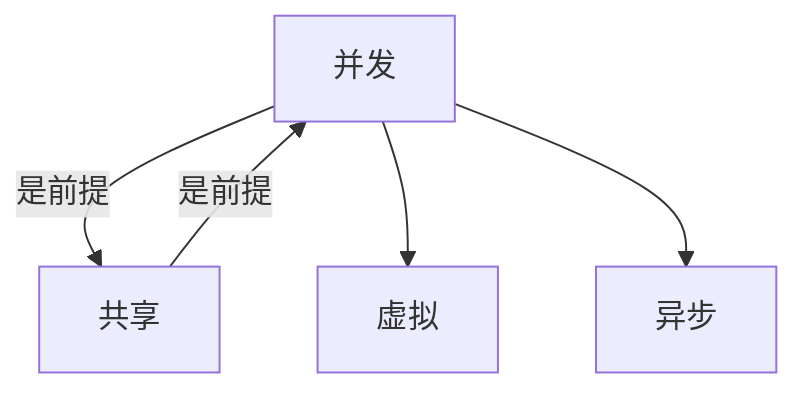
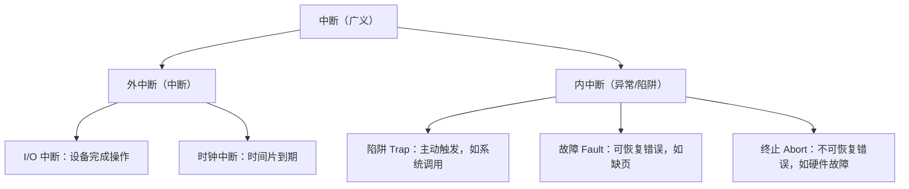
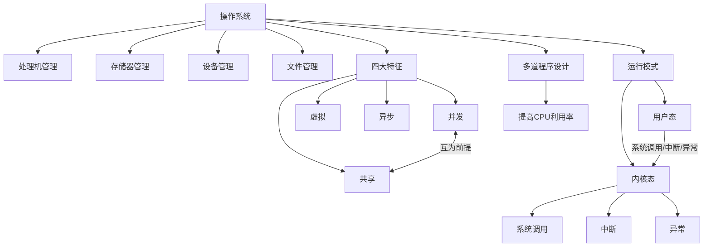

# 408 OS 第一章：操作系统概述

> 📌 操作系统（Operating System，OS）是运行在计算机硬件上的第一层软件，它是所有用户程序和硬件之间的"大管家"——管理 CPU、内存、磁盘、I/O 设备等全部资源，让多个程序能够安全、高效、并发地运行。

## 📋 前置知识

- [[计算机组成原理]] — 需要了解 CPU、内存、中断、总线的基本工作原理
- [[408_OS_overview]] — 建议先阅读全书导航，了解操作系统的整体知识版图

## 🤔 为什么要学操作系统概述？

你可能会想：第一章不就是介绍性的内容，随便看看就行了？

实际上，第一章在 408 中每年稳定出 **2～4 道选择题**，考的都是概念辨析：

- 操作系统的四大特征，考题会给你四个描述，让你判断哪个是"并发"哪个是"共享"
- 内核态 vs 用户态，考题会给你一条指令，问它能不能在用户态执行
- 系统调用的概念，考题会让你判断某个操作是否需要系统调用
- 多道程序设计的效果，考题会让你计算 CPU 利用率的变化

这些概念不理解，选择题必丢分。而且第一章的很多概念（中断、系统调用、内核态）是后续章节的基础，理解不到位会影响第二章、第三章的学习。

## 🧠 核心概念

### 1.1 什么是操作系统？

> 🎯 **类比**：把计算机想象成一家大型酒店。硬件（CPU、内存、磁盘）是酒店的房间、厨房、电梯等设施。用户程序（浏览器、游戏、Word）是住在酒店里的客人。而**操作系统就是酒店的前台和管理团队**——它负责给客人分配房间（内存），安排电梯使用（CPU 时间），管理餐厅（I/O 设备），同时确保一个客人不能闯进另一个客人的房间（内存保护）。

**正式定义**：操作系统是控制和管理整个计算机系统的**硬件与软件资源**，合理组织、调度计算机的**工作与资源分配**，以提供给用户和其他软件方便的**接口与环境**的程序集合。

这个定义里有三层含义：

**第一层：资源管理者。** 操作系统管理 CPU（决定哪个程序运行）、内存（决定程序放在哪里）、磁盘（管理文件存储）、I/O 设备（管理打印机、网卡等）。

**第二层：程序执行环境。** 没有操作系统，你的程序根本没法运行。操作系统为程序提供了运行所需的一切基础服务。

**第三层：用户接口。** 操作系统提供两种接口：一种是给普通用户的图形界面或命令行（GUI/CLI），另一种是给程序员的系统调用（System Call）接口。

### 1.2 操作系统的四大目标

操作系统追求四个目标，考试中会考"某个设计决策体现了操作系统的哪个目标"：

| 目标 | 含义 | 举例 |
|------|------|------|
| **有效性** | 提高系统资源利用率 | 多道程序设计让 CPU 不空闲 |
| **方便性** | 让计算机更易于使用 | 提供图形界面，不用记忆命令 |
| **可扩充性** | 方便增加新功能 | 插入新设备后安装驱动即可使用 |
| **开放性** | 遵循国际标准，可互操作 | POSIX 标准让程序可跨 Unix 系统移植 |

> ⚠️ **考点**：有效性和方便性有时是矛盾的。为了方便性（如添加图形界面），可能牺牲部分有效性（消耗更多资源）。考题可能考这对矛盾关系。

### 1.3 操作系统的发展历史（了解脉络即可）

理解历史是为了理解为什么操作系统要有这些特性，不需要死记年份。

**阶段一：无操作系统（手工操作阶段）**

早期计算机没有操作系统，程序员要手动拨开关、插卡片来输入程序。一次只能运行一个程序，程序运行时 CPU 要等待人工操作，**CPU 利用率极低**。

**阶段二：批处理系统**

为了减少 CPU 等待时间，发明了批处理：把多个作业打包成一批，由监督程序（操作系统的雏形）自动依次执行，不需要人工干预切换。

- **单道批处理**：一次只有一个程序在内存中运行。I/O 操作时 CPU 仍然空闲等待。
- **多道批处理**：内存中同时放多个程序。一个程序做 I/O 时，CPU 切换去运行另一个程序。这是现代操作系统的核心思想起源。

**阶段三：分时系统**

批处理的问题是用户没法实时交互——你提交作业后要等很久才知道结果。分时系统让多个用户**同时**连接到一台计算机，每个用户轮流获得一小段 CPU 时间（时间片），感觉像是独占了整台机器。

**阶段四：实时系统**

某些场景（工业控制、军事、航空）要求计算机在**严格时限内**完成任务，否则后果严重。实时系统（RTOS）就是专为此设计的，强调响应时间的确定性，而不是追求高吞吐量。

**阶段五：现代操作系统**

现代操作系统（Windows、Linux、macOS）综合了上述所有特性，同时支持多用户、多任务、图形界面、网络、安全等。

### 1.4 操作系统的四大特征（⭐ 必考！）

这是第一章最重要的考点，四个特征的定义和相互关系必须烂熟于心。

> 🎯 **类比**：想象一个大型超市（操作系统）同时服务很多顾客（程序）：
> - **并发**：超市里同时有很多顾客在购物（多个程序同时推进）
> - **共享**：顾客共用同一个收银机（程序共享 CPU、内存等资源）
> - **虚拟**：每个顾客都觉得收银机是专门为自己服务的（每个程序都以为自己独占了 CPU）
> - **异步**：顾客的购物速度不一样，每次服务的时间也不确定（程序的执行速度和完成时间是不确定的）

**① 并发（Concurrence）**

并发是指系统中**同时存在**多个运行的程序，宏观上它们都在运行，微观上它们轮流使用 CPU。

注意区分并发和并行：
- **并发**：多个程序在**一个** CPU 上交替执行，看起来像同时运行（单核 CPU 也能并发）
- **并行**：多个程序**真正同时**在**多个** CPU 上执行（需要多核 CPU）

> ❌ **常见误区**：很多人认为"并发 = 并行"，实际上并发是操作系统通过时间片轮转模拟出来的"假并行"。408 考题经常用这对概念出判断题。

**② 共享（Sharing）**

共享是指系统中的**资源**可以被多个并发进程**共同使用**。共享有两种方式：

- **互斥共享**：某资源一次只能给一个进程使用（如打印机）。一个进程用完后，下一个才能用。
- **同时访问**：某资源可以被多个进程同时访问（如只读的代码段、磁盘文件）。

**③ 虚拟（Virtual）**

虚拟是指通过技术手段，把**一个物理实体**转变为**若干个逻辑上的对应物**，让每个进程都感觉自己在独享资源。

- **时分复用**（虚拟 CPU）：一个 CPU 轮流给多个进程用，每个进程都觉得自己有专属 CPU。
- **空分复用**（虚拟内存）：物理内存只有 4GB，但通过虚拟内存技术，每个进程都以为自己有独立的、巨大的地址空间。

**④ 异步（Asynchronism）**

异步是指进程的执行不是一气呵成的，而是**走走停停**、以不可预知的速度推进。进程可能在任何时刻被中断（因为其他进程要用 CPU），也可能在等待 I/O 时挂起。

**四大特征的关系（⭐ 重点！）**：

- **并发和共享是操作系统最基本的两个特征**，互为存在条件：没有并发就不需要共享，没有共享就无法并发。
- 虚拟和异步都是在并发和共享的基础上产生的。

> ⚠️ **考题易错点**：考题可能问"操作系统最基本的特征是什么？"答案是**并发**（并发是最核心的特征，共享、虚拟、异步都依赖并发）。

### 1.5 操作系统的功能（四大管理）

操作系统的功能对应它管理的四类资源：

| 功能 | 管理对象 | 核心任务 |
|------|----------|----------|
| **处理机（CPU）管理** | CPU 时间 | 决定哪个进程运行、运行多久 |
| **存储器（内存）管理** | 内存空间 | 内存分配、地址转换、内存保护 |
| **设备管理** | I/O 设备 | 设备分配、驱动控制、缓冲管理 |
| **文件管理** | 磁盘存储 | 文件组织、目录管理、存取控制 |

还有一个附加功能：**用户接口**，包括命令行接口（CLI）和图形用户界面（GUI），以及给程序员用的系统调用接口。

### 1.6 操作系统的分类

| 类型 | 核心特点 | 典型代表 | 适用场景 |
|------|----------|----------|----------|
| **批处理 OS** | 无需用户干预，自动执行一批作业 | 早期大型机系统 | 大量计算任务，不需要交互 |
| **分时 OS** | 多用户共享，时间片轮转，交互性强 | Unix、Linux | 通用计算，用户交互 |
| **实时 OS** | 严格时限内完成，响应时间确定 | VxWorks、μC/OS | 工业控制、航空、医疗 |
| **网络 OS** | 管理网络资源，支持网络通信 | Windows Server | 服务器环境 |
| **分布式 OS** | 多台计算机协同工作，对用户透明 | 分布式 Linux 集群 | 大规模计算 |
| **嵌入式 OS** | 针对特定硬件裁剪，资源极少 | Android、FreeRTOS | 手机、路由器、IoT |

> ⚠️ **分时 OS 和实时 OS 的区别**（高频考点）：
> - 分时 OS 追求**响应时间短**，但不能保证严格的时限（用户感觉快即可）
> - 实时 OS 追求**响应时间确定**，必须在规定时限内完成，否则后果严重（硬实时）

### 1.7 内核（Kernel）与用户态/内核态（⭐ 必考！）

这是第一章最难理解也最重要的考点，与后续的系统调用、中断密切相关。

> 🎯 **类比**：把操作系统的内核想象成一家银行的**金库区**，用户程序是**客户大厅**。客户（用户程序）不能直接进金库取钱，必须通过柜台（系统调用）提交申请，由银行工作人员（内核）代为操作。这样做的目的是**安全**——不能让任何程序随意访问硬件资源。

**为什么要区分用户态和内核态？**

如果所有程序都可以直接访问硬件，一个恶意程序可以随意读写其他程序的内存，可以控制磁盘擦除数据，可以关掉中断让系统崩溃。用户态/内核态的区分是**计算机安全的基石**。

**用户态（User Mode）**：

- CPU 运行在受限模式下，只能执行**普通指令**（加减乘除、逻辑运算等）
- 不能直接操作硬件，不能访问内核数据结构
- 所有用户程序（浏览器、游戏、你写的代码）都运行在用户态

**内核态（Kernel Mode）**，也叫管态、特权态：

- CPU 运行在特权模式下，可以执行**所有指令**，包括**特权指令**
- 可以直接操作硬件，访问任意内存地址
- 操作系统内核运行在内核态

**特权指令**是只有内核态才能执行的指令，例如：

- 关中断/开中断指令
- 直接 I/O 指令（直接读写硬件端口）
- 修改页表基址寄存器（控制内存映射）
- 停机指令（HALT）

**从用户态切换到内核态的三种方式**：

| 触发方式 | 描述 | 举例 |
|----------|------|------|
| **系统调用** | 用户程序主动请求内核服务 | `open()` 打开文件、`fork()` 创建进程 |
| **中断** | 外部设备通知 CPU 有事件发生 | 键盘按下、网卡收到数据包 |
| **异常**（陷阱/故障） | CPU 执行指令时遇到错误 | 除以零、访问非法地址（段错误） |

> ❌ **常见误区**：有人以为"从用户态切换到内核态"是"进程切换"。实际上这两者完全不同：用户态→内核态只是同一个进程改变了 CPU 执行权限，进程本身没有变；而进程切换是 CPU 从一个进程切换到另一个进程，会引发上下文保存/恢复。

### 1.8 系统调用（System Call）（⭐ 必考！）

> 🎯 **类比**：系统调用是用户程序向操作系统发出的**正式服务请求**，就像你去政务大厅办证——你不能自己去档案室翻文件（不能直接操作硬件），但可以填一张申请单（系统调用），让工作人员帮你办（内核代为执行）。

**系统调用的执行过程**：

1. 用户程序执行系统调用指令（如 x86 的 `int 0x80` 或 `syscall`）
2. CPU 从用户态切换到内核态
3. 内核根据系统调用号找到对应的服务函数
4. 内核执行服务，操作硬件资源
5. 内核将结果返回给用户程序
6. CPU 切换回用户态，用户程序继续执行

**常见系统调用分类**：

| 类别 | 举例 |
|------|------|
| 进程控制 | `fork()`（创建进程）、`exit()`（终止进程）、`exec()`（加载程序） |
| 文件操作 | `open()`、`read()`、`write()`、`close()` |
| 设备操作 | `ioctl()`、`read()`（设备文件）、`write()`（设备文件） |
| 信息维护 | `getpid()`、`alarm()`、`sleep()` |
| 通信 | `pipe()`、`socket()`、`send()`、`recv()` |

**哪些操作需要系统调用？**（选择题常考）

需要系统调用的操作（需要内核介入）：
- 读写文件
- 创建/终止进程
- 分配内存（`malloc` 底层调用 `sbrk` 或 `mmap`）
- 网络通信
- 获取当前时间

不需要系统调用的操作（用户态可以完成）：
- 变量赋值、数学计算
- 字符串操作（`strlen`、`strcpy`）
- 用户态的内存读写（已分配的内存）

### 1.9 中断与异常（⭐ 必考！）

中断机制是操作系统能够"强制"控制 CPU 的核心手段，没有中断就没有多道程序设计。

> 🎯 **类比**：中断就像你在专心工作（CPU 执行程序）时，手机响了（外设有事件）。你暂停工作，拿起手机处理消息（中断处理程序），处理完毕后继续工作（恢复程序执行）。

**中断的分类**：

**外中断（中断）**：来自 CPU 外部，与当前执行的指令无关。

- **I/O 中断**：磁盘读写完成、键盘按下、网卡收到数据包
- **时钟中断**：定时器到期，这是操作系统实现**时间片轮转**的基础！没有时钟中断，操作系统就无法强制剥夺某个进程对 CPU 的使用权。

**内中断（异常）**：由 CPU 在执行当前指令时发现的问题，分三类：

| 类型 | 触发方式 | 能否恢复 | 举例 |
|------|----------|----------|------|
| **陷阱（Trap）** | 程序主动触发（`int` 指令） | 能 | 系统调用 |
| **故障（Fault）** | 执行指令时发生可纠正错误 | 通常能 | 缺页中断（加载页面后重新执行该指令） |
| **终止（Abort）** | 严重的不可恢复错误 | 不能 | 硬件故障、机器校验错误 |

**中断处理的过程**：

1. 保存现场（把 CPU 寄存器的值保存到内存，即保存"当前在做什么"）
2. 分析中断类型，找到对应的中断处理程序
3. 执行中断处理程序
4. 恢复现场（把之前保存的寄存器值恢复），继续被中断的程序

> ⚠️ **考点**：时钟中断是实现**进程调度**的基础机制。每次时钟中断时，操作系统可以重新决定让哪个进程运行。这就是为什么用户程序无法"霸占"CPU 不放的原因。

### 1.10 多道程序设计（⭐ 必考！）

多道程序设计是现代操作系统提高 CPU 利用率的核心技术。

> 🎯 **类比**：单道程序就像一条单行道——一辆车（程序）要等前面的车开走才能走，路（CPU）经常空着。多道程序就像高速公路——多辆车同时行驶，路的利用率大大提高。

**单道程序**：内存中只有一个程序，程序做 I/O 时 CPU 只能等待，CPU 利用率很低。

**多道程序**：内存中同时存放多个程序，当一个程序在等待 I/O 时，操作系统切换 CPU 去执行另一个程序，让 CPU 尽量不空闲。

**CPU 利用率计算**（考题常见）：

假设一个程序有 50% 的时间在做 I/O（CPU 空闲），50% 在计算（CPU 工作）。

- 单道程序：CPU 利用率 = 50%
- 两道程序：CPU 利用率 ≈ $1 - 0.5^2 = 75\%$（两个都在等 I/O 的概率很低）
- $n$ 道程序：CPU 利用率 ≈ $1 - 0.5^n$（理想情况下趋近于 100%）

**多道程序设计的特点**：

| 特点 | 说明 |
|------|------|
| **多道** | 内存中同时存放多个程序 |
| **宏观上并行** | 从外部看，多个程序同时在推进 |
| **微观上串行** | 在任意时刻，一个 CPU 只执行一个程序 |

## ⚠️ 常见误区与踩坑点

> ❌ **误区 1：并发 = 并行**
> 并发是宏观上"同时"推进，微观上交替执行；并行是真正同时在多个 CPU 核上执行。单核 CPU 只能并发，不能并行。

> ❌ **误区 2：操作系统最基本的特征是"虚拟"**
> 最基本的特征是**并发**（也有说法是"并发和共享"并列为最基本），虚拟和异步都是在并发基础上产生的。

> ⚠️ **踩坑 3：分时 OS 和实时 OS 混淆**
> 分时 OS 强调**多用户交互**，响应时间短但不做硬性保证。实时 OS 强调**严格时限**，必须在规定时间内完成，否则系统失效（如导弹控制）。

> ⚠️ **踩坑 4：系统调用和普通函数调用的区别**
> 普通函数调用：`printf()` 中的字符串格式化工作（纯用户态计算）不需要系统调用。但 `printf()` 最终要调用 `write()` 把字符写到屏幕，`write()` 是系统调用，会进入内核态。很多 C 标准库函数是对系统调用的封装。

> ⚠️ **踩坑 5：内核态切换不等于进程切换**
> 用户态→内核态：同一个进程执行系统调用，CPU 权限级别变了，但进程没换。
> 进程切换：CPU 从进程 A 切换到进程 B，需要保存 A 的上下文、恢复 B 的上下文，代价更大。

## 🔄 关键概念对比

| 概念对 | 区别要点 |
|--------|---------|
| 并发 vs 并行 | 并发是逻辑上同时（单核可以），并行是物理上同时（需要多核） |
| 中断 vs 异常 | 中断来自外部设备，异常来自 CPU 执行当前指令时内部产生 |
| 陷阱 vs 故障 vs 终止 | 陷阱主动触发可恢复，故障被动触发通常可恢复，终止不可恢复 |
| 用户态 vs 内核态 | 用户态受限不能访问硬件，内核态特权可操作所有资源 |
| 系统调用 vs 库函数 | 系统调用进内核，库函数可能只是对系统调用的封装，也可能纯用户态 |
| 分时 OS vs 实时 OS | 分时追求响应快，实时追求时限确定 |
| 单道 vs 多道程序 | 单道 CPU 常空闲，多道并发执行提高 CPU 利用率 |

## 🏋️ 动手练习

### 练习 1：特征判断（⭐ 难度）

**题目**：下列关于操作系统特征的描述中，正确的是（）

A. 操作系统的并发性是指多个程序在同一时刻同时在 CPU 上执行

B. 操作系统的共享性是指所有资源都可以被任意进程随时访问

C. 并发和共享是操作系统最基本的两个特征，互为存在的条件

D. 操作系统的异步性是指进程的执行速度不可预知，但执行结果是确定的

**参考答案**：**C**

- A 错误：并发是宏观上同时推进，微观上交替执行，不是真正"同时"在 CPU 上执行（那是并行）。
- B 错误：共享分互斥共享（一次只给一个进程）和同时访问，不是所有资源都可以随时访问。
- C 正确：并发和共享互为前提，是最基本的两个特征。
- D 错误：异步性是指进程的执行速度和完成时间不可预知，在相同条件下多次运行结果应该相同，但操作系统必须保证这一点（要求程序的执行结果是确定的）。

### 练习 2：内核态判断（⭐ 难度）

**题目**：下列操作中，需要在内核态（核心态）下执行的是（）

A. 执行 `i = i + 1` 这条赋值语句

B. 调用 `printf()` 函数打印一个字符串到屏幕

C. 调用 `strlen()` 函数计算字符串长度

D. 调用 `malloc()` 分配内存并立即访问该内存

**参考答案**：**B**

- A 错误：普通算术运算，完全在用户态执行。
- B 正确：`printf()` 最终调用 `write()` 系统调用，将字符写入标准输出（屏幕），需要切换到内核态。
- C 错误：`strlen()` 是纯内存计算，不涉及任何系统调用，完全在用户态。
- D 分析：`malloc()` 可能涉及系统调用（如 `brk()` 或 `mmap()` 扩展堆空间），但若只是在已分配堆中取内存，则不需要。这道题选 B 更确定。

### 练习 3：CPU 利用率计算（⭐⭐ 难度）

**题目**：假设系统中有 3 道程序并发运行，每个程序有 60% 的时间在等待 I/O，40% 的时间需要 CPU 计算（各程序独立，等待 I/O 的时间相互独立）。理论上 CPU 的利用率约为多少？

**参考答案**：

每个程序等待 I/O 的概率为 0.6，$n$ 个程序同时等待 I/O 的概率为 $0.6^n$。

3 道程序时，三个都在等待 I/O（CPU 空闲）的概率为：

$$P(\text{CPU 空闲}) = 0.6^3 = 0.216$$

所以 CPU 利用率为：

$$\text{CPU 利用率} = 1 - 0.6^3 = 1 - 0.216 = 78.4\%$$

与单道程序（利用率 40%）相比，提升了将近一倍。这就是多道程序设计的价值。

## 📝 总结

### 本章要点回顾

1. **操作系统的本质**是资源管理者 + 程序执行环境 + 用户接口，管理 CPU、内存、设备、文件四类资源。

2. **四大特征**：并发（交替执行）、共享（资源共用）、虚拟（一变多）、异步（不确定速度）。并发和共享是最基本的特征，互为前提。

3. **内核态 vs 用户态**：用户程序运行在受限的用户态，只有通过系统调用/中断/异常才能切换到特权的内核态。这是操作系统保护硬件资源的核心机制。

4. **系统调用**是用户程序请求内核服务的唯一正式通道，会引发用户态→内核态的切换。

5. **中断**（外部）和**异常**（内部）是操作系统获得 CPU 控制权的主要途径，时钟中断是实现进程调度的基础。

6. **多道程序设计**：让多个程序并发执行，当一个程序等 I/O 时 CPU 去执行另一个，大幅提高 CPU 利用率。

### 知识图谱

## 🔗 相关链接

- 上级概念：[[408_OS_overview]]
- 下一章：[[408_OS_ch2_进程线程]]
- 关联概念：[[408_OS_ch3_内存管理]]（虚拟内存是"虚拟"特征的体现）
- 并列科目：[[408_计算机组成原理_总览]]（中断机制的硬件基础）

## 📚 参考资料

- 汤子瀛《操作系统（第四版）》第一章 — 官方教材，408 考试标准
- 王道考研《操作系统》第一章 — 配套习题与真题解析
- [小林 coding 图解操作系统](https://xiaolincoding.com/os/) — 图文并茂，辅助理解抽象概念
