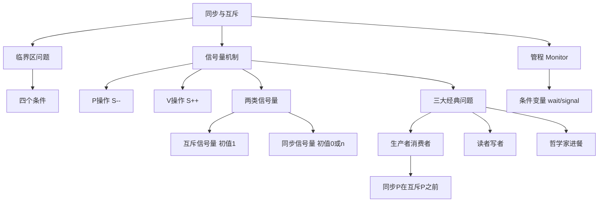

# 408 OS 第二章：进程同步与互斥

> 📌 多个进程并发执行时，对共享资源的访问必须协调——**互斥**防止多个进程同时修改共享数据，**同步**保证进程按正确顺序推进。信号量（PV 操作）是解决这两类问题的核心工具，三大经典问题是 408 大题的必考点。


## 📋 前置知识

- [[408_OS_ch2_进程线程]] — 需要理解进程并发、状态转换的概念
- [[408_OS_ch1_概述]] — 需要理解并发和共享的基本特征


## 🤔 为什么需要同步与互斥？

先看一个具体的问题。假设两个进程 A 和 B 同时对一个共享变量 `count` 执行 `count++`：

```c
// count 的初始值为 5
// 进程 A 执行：count++
// 进程 B 执行：count++
// 我们期望结果是 count = 7
```

但在底层，`count++` 实际上分三步执行：

```c
// 第一步：从内存读 count 的值到寄存器
// 第二步：寄存器的值加 1
// 第三步：把寄存器的值写回内存
```

如果进程 A 执行完第一步（读到 count=5），被时钟中断切换出去，进程 B 抢先完整执行了 `count++`（count 变成 6），然后 A 继续执行（把自己寄存器里的 5+1=6 写回内存），最终 count=6，而不是期望的 7！

这就是**竞争条件（Race Condition）**——结果依赖于进程执行的时序，是不可预测的 bug，也是并发编程最危险的问题之一。

解决方案：给共享资源的访问加上"锁"，让同一时刻只有一个进程能修改 count。这就是**互斥**的本质。


## 🧠 核心概念


### 2.8 临界区（Critical Section）

> 🎯 **类比**：临界区就像一个只有一个坑位的公共厕所——任何时刻只能有一个人在里面，门外的人必须等待。进入厕所前要锁门（加锁），出来后开门（解锁），让下一个人进入。

**临界资源**：一次只允许一个进程使用的资源，称为临界资源。例如：打印机、共享变量 `count`、全局链表。

**临界区（Critical Section）**：进程中**访问临界资源的那段代码**。

```c
// 程序结构模板
entry section;    // 进入区：申请进入临界区的代码（加锁）

critical section; // 临界区：访问临界资源的代码（必须互斥执行）

exit section;     // 退出区：释放临界区的代码（解锁）

remainder section;// 剩余区：其他不需要互斥的代码
```

**互斥访问临界区必须满足的四个条件**（⭐ 必记！）：

| 条件 | 含义 | 违反后果 |
|------|------|----------|
| **空闲让进** | 临界区空闲时，想进的进程立刻可以进 | 进程在外白等，浪费时间 |
| **忙则等待** | 临界区有进程时，其他想进的进程必须等待 | 多个进程同时进入，破坏互斥 |
| **有限等待** | 进程等待进入临界区的时间有限，不能无限等 | 进程饥饿 |
| **让权等待** | 等待时应释放 CPU（进入阻塞），不能一直占着 CPU 死等 | 浪费 CPU 资源（忙等） |

> ⚠️ **考点**：这四个条件是判断某个同步算法是否正确的标准，考试会给你一个算法，让你分析它违反了哪个条件。


### 2.9 信号量（Semaphore）与 PV 操作（⭐⭐⭐ 必考！）

信号量是 Dijkstra（迪科斯彻）在 1965 年提出的同步机制，是 408 中最重要的知识点。

> 🎯 **类比**：信号量就像停车场门口显示"剩余车位"的牌子。
> - **P 操作（parking）**：想停车时，先看牌子：有空位（值 > 0），牌子减 1，开进去；没空位（值 = 0），在门口等待。
> - **V 操作（vacating）**：开走时，牌子加 1，唤醒门口等待的车。
>
> 整数型信号量的值就是"剩余车位数"，初始值代表资源总量。

**信号量的定义**：信号量是一个**整数变量** $S$，只能通过两个原子操作 P 和 V 来访问（不能直接读写 $S$ 的值）：

**P 操作（Wait 操作，荷兰语 Proberen = 测试）**：

$$P(S): S = S - 1;\ \text{若 } S < 0\text{，则进程阻塞}$$

用伪代码表示：

```c
P(S) {
    S--;
    if (S < 0) {
        // 把当前进程加入信号量的等待队列
        // 阻塞当前进程（进入阻塞态）
        block();
    }
}
```

**V 操作（Signal 操作，荷兰语 Verhogen = 增加）**：

$$V(S): S = S + 1;\ \text{若 } S \leq 0\text{，则唤醒一个等待进程}$$

用伪代码表示：

```c
V(S) {
    S++;
    if (S <= 0) {
        // 从等待队列中取出一个进程
        // 唤醒该进程（进入就绪态）
        wakeup();
    }
}
```

**信号量值的含义**：

- $S > 0$：表示当前还有 $S$ 个可用资源
- $S = 0$：资源刚好用完，没有进程等待
- $S < 0$：资源已经用完，还有 $|S|$ 个进程在等待

> ⚠️ **关键点**：P 和 V 操作必须是**原子操作**，不能被中断，否则信号量本身就成了竞争条件的受害者。

**两类信号量的用途**：

| 信号量类型 | 初值 | 用途 |
|------------|------|------|
| **互斥信号量（mutex）** | 1 | 实现互斥，保证临界区一次只有一个进程 |
| **同步信号量** | 0 或资源数 $n$ | 实现同步，控制进程的执行顺序 |

**用互斥信号量实现互斥**：

```c
semaphore mutex = 1;  // 互斥信号量，初值为 1

// 进程 A 和 进程 B 都使用同一个 mutex
void process_A() {
    P(mutex);         // 申请进入临界区，mutex 变为 0
    // === 临界区开始 ===
    count++;          // 访问共享资源
    // === 临界区结束 ===
    V(mutex);         // 释放临界区，mutex 变为 1
}

void process_B() {
    P(mutex);         // 若 mutex=0，阻塞；若 mutex=1，进入
    count++;
    V(mutex);
}
```

**用同步信号量实现顺序关系**：

假设进程 A 的语句 $S_1$ 必须在进程 B 的语句 $S_2$ 之前执行：

```c
semaphore sync = 0;   // 同步信号量，初值为 0（表示"S1还没执行"）

void process_A() {
    S1;               // 先执行 S1
    V(sync);          // 通知 B：S1 已完成，sync 变为 1
}

void process_B() {
    P(sync);          // 等待 S1 完成（若 sync=0 则阻塞，直到 A 执行 V）
    S2;               // S1 完成后才能执行 S2
}
```


### 2.10 经典同步问题（⭐⭐⭐ 大题必考！）

这三个经典问题是历年 408 大题最常考的内容，必须做到**闭着眼睛也能写出伪代码**。

#### 问题一：生产者—消费者问题

**问题描述**：

有一个容量为 $N$ 的缓冲区（Buffer），生产者不断往缓冲区放产品，消费者不断从缓冲区取产品。要求：

1. **互斥**：生产者和消费者不能同时操作缓冲区（避免竞争条件）
2. **同步**：缓冲区满时，生产者必须等待；缓冲区空时，消费者必须等待

**信号量设置**：

```c
semaphore mutex = 1;   // 互斥信号量：保护缓冲区的互斥访问，初值为 1
semaphore empty = N;   // 同步信号量：表示缓冲区中的空槽数，初值为 N
semaphore full = 0;    // 同步信号量：表示缓冲区中的产品数，初值为 0
```

**完整伪代码**：

```c
void producer() {
    while (true) {
        produce_item();        // 生产一个产品（在临界区外生产）
        P(empty);              // 等待空槽（空槽数 -1；若 empty=0 则阻塞）
        P(mutex);              // 进入临界区（互斥保护缓冲区）
        buffer[in] = item;     // 将产品放入缓冲区
        in = (in + 1) % N;    // 更新缓冲区写指针
        V(mutex);              // 退出临界区
        V(full);               // 通知消费者有新产品（产品数 +1）
    }
}

void consumer() {
    while (true) {
        P(full);               // 等待产品（产品数 -1；若 full=0 则阻塞）
        P(mutex);              // 进入临界区
        item = buffer[out];    // 从缓冲区取出产品
        out = (out + 1) % N;  // 更新缓冲区读指针
        V(mutex);              // 退出临界区
        V(empty);              // 通知生产者有空槽（空槽数 +1）
        consume_item(item);    // 消费产品（在临界区外消费）
    }
}
```

> ❌ **最经典的错误：P(mutex) 和 P(empty)/P(full) 的顺序颠倒！**
>
> 如果生产者代码改成：
> ```c
> P(mutex);   // 先拿锁
> P(empty);   // 再检查空槽
> ```
> 会发生什么？当缓冲区满时（empty=0），生产者先拿到了 mutex 锁，然后在 P(empty) 上阻塞，此时 mutex=0。消费者来取产品，先做 P(mutex)，但 mutex=0，消费者也阻塞！两者互相等待，**死锁**！
>
> **正确顺序永远是：先 P 同步信号量，再 P 互斥信号量。**

#### 问题二：读者—写者问题

**问题描述**：

多个进程共享一个数据资源（如数据库），分为**读者**和**写者**两类。要求：

1. 允许多个读者同时读（读操作不修改数据，不会冲突）
2. 写者必须独占，写者写时不允许任何其他进程读或写
3. 读者和写者不能同时访问

**读者优先版本**（读者不必等待，只要有读者在读，后来的读者可以立刻进入）：

**信号量设置**：

```c
semaphore rw_mutex = 1;   // 控制写者和第一个/最后一个读者的互斥，初值为 1
semaphore mutex = 1;       // 保护读者计数器 read_count 的互斥，初值为 1
int read_count = 0;        // 当前正在读的读者数量
```

**完整伪代码**：

```c
void reader() {
    while (true) {
        P(mutex);                      // 保护 read_count 的修改
        read_count++;                  // 读者数 +1
        if (read_count == 1) {         // 如果是第一个读者
            P(rw_mutex);               // 阻止写者进入（拿写锁）
        }
        V(mutex);                      // 释放 read_count 的锁

        // 读取数据（可以多个读者同时在此）
        read();

        P(mutex);                      // 保护 read_count 的修改
        read_count--;                  // 读者数 -1
        if (read_count == 0) {         // 如果是最后一个离开的读者
            V(rw_mutex);               // 允许写者进入（释放写锁）
        }
        V(mutex);
    }
}

void writer() {
    while (true) {
        P(rw_mutex);   // 独占访问（等待所有读者离开）
        write();        // 写入数据
        V(rw_mutex);   // 释放
    }
}
```

**读者优先的问题**：如果读者源源不断，写者可能**永远得不到机会写**，产生写者饥饿。

**写者优先版本**（只要有写者等待，后来的读者必须等）较复杂，408 以读者优先版本为主，了解写者饥饿问题即可。

#### 问题三：哲学家进餐问题

**问题描述**：

$5$ 个哲学家围坐圆桌，每两人之间放一根筷子，共 $5$ 根筷子。哲学家要么思考，要么进餐。进餐需要同时拿到**左右两根筷子**。

**直觉的错误解法**（会死锁！）：

```c
// 错误：每人先拿左边，再拿右边
P(chopstick[i]);           // 拿左边筷子
P(chopstick[(i+1) % 5]);   // 拿右边筷子
// 进餐
V(chopstick[i]);
V(chopstick[(i+1) % 5]);
```

为什么会死锁？如果 5 个哲学家同时先拿左边的筷子，每人都拿到了左边，然后所有人都在等右边的筷子，而右边的筷子正被左边的哲学家拿着——**循环等待，死锁！**

**正确解法 1：限制同时进餐人数（最多 4 人同时尝试）**

```c
semaphore chopstick[5] = {1, 1, 1, 1, 1};  // 每根筷子的信号量
semaphore limit = 4;                          // 最多允许 4 人同时尝试取筷子

void philosopher(int i) {
    while (true) {
        think();
        P(limit);                             // 最多 4 人进入取筷环节
        P(chopstick[i]);                      // 拿左边筷子
        P(chopstick[(i+1) % 5]);             // 拿右边筷子
        eat();
        V(chopstick[i]);
        V(chopstick[(i+1) % 5]);
        V(limit);
    }
}
```

为什么最多 4 人能打破死锁？只要有 4 人，其中至少有一人能拿到两根筷子（5 根筷子 4 人，鸽巢原理保证至少有人能拿全）。

**正确解法 2：奇偶哲学家拿筷子的顺序不同**

```c
void philosopher(int i) {
    think();
    if (i % 2 == 0) {          // 偶数哲学家先拿左边
        P(chopstick[i]);
        P(chopstick[(i+1) % 5]);
    } else {                    // 奇数哲学家先拿右边
        P(chopstick[(i+1) % 5]);
        P(chopstick[i]);
    }
    eat();
    V(chopstick[i]);
    V(chopstick[(i+1) % 5]);
}
```

打破了"所有人先拿同侧"的对称性，从根本上避免了循环等待。

**正确解法 3：原子地拿起两根筷子（使用互斥锁保护取筷动作）**

```c
semaphore mutex = 1;
semaphore chopstick[5] = {1, 1, 1, 1, 1};

void philosopher(int i) {
    think();
    P(mutex);                          // 保证取筷子的动作是原子的
    P(chopstick[i]);
    P(chopstick[(i+1) % 5]);
    V(mutex);
    eat();
    V(chopstick[i]);
    V(chopstick[(i+1) % 5]);
}
```

> ⚠️ **考试注意**：408 大题会给你改编版本的三大问题，核心思路不变。读题时注意：有几个进程？共享什么资源？什么顺序关系需要保证？先想清楚需要几个信号量、每个初值是多少，再写代码。


### 2.11 管程（Monitor）

管程是比信号量更高层次的同步机制，是面向对象思想在同步问题上的应用。

> 🎯 **类比**：如果信号量是"手动锁门"，那管程就是"自动门"——你进门时自动锁，出门时自动开，不需要程序员手动调用 P/V。

管程的特点：

- 将共享数据结构和操作它的过程封装在一起（类似 class）
- 一次只有一个进程可以在管程内执行（互斥由管程自动保证）
- 内部用**条件变量**（condition variable）实现同步：
  - `wait(c)`：挂起调用进程，等待条件 c 变真
  - `signal(c)`：唤醒等待条件 c 的一个进程

> ⚠️ **408 考纲**：管程主要以概念理解为主，考题以信号量为主。管程的概念题（选择题）要能辨别管程的特点。


## ⚠️ 常见误区与踩坑点

> ❌ **误区 1：PV 操作的顺序随意**
> 同一个进程对同步信号量和互斥信号量的 P 操作，**同步 P 必须在互斥 P 之前**。违反此顺序会产生死锁（见生产者消费者问题分析）。V 操作则没有严格的顺序限制（先释放互斥锁还是先发信号，通常不影响正确性，但习惯上先 V(mutex) 再 V(同步)）。

> ❌ **误区 2：信号量可以负数就没有意义**
> 信号量为负数时，$|S|$ 表示等待队列中的进程数，这是有意义的。初值为 0 的同步信号量，第一次 P 操作后变为 -1，表示有 1 个进程在等待，这是完全正常的状态。

> ⚠️ **踩坑 3：读者写者问题中 mutex 和 rw_mutex 不能搞混**
> `mutex` 只保护 `read_count` 这个变量的修改，不保护读操作本身。`rw_mutex` 才是"读者整体"和"写者"之间的互斥锁。很多人把两者混淆，导致算法错误。

> ❌ **误区 4：哲学家直觉解法"看起来没问题"**
> 直觉上，如果运气好，5 个哲学家不会恰好同时行动，但这只是概率上不会死锁，在最坏情况下必然死锁。操作系统设计必须保证**任何时序下**都不会死锁，不能依赖运气。

> ⚠️ **踩坑 5：V 操作不会让当前进程阻塞**
> V 操作只是 S++，若有等待进程则唤醒一个，然后**当前进程继续执行**。V 操作不会让当前进程挂起。


## 🔄 概念对比

| 特性 | 互斥信号量（mutex） | 同步信号量 |
|------|---------------------|------------|
| 初值 | 1 | 0（或资源数） |
| 用途 | 保证临界区互斥访问 | 控制进程执行顺序 |
| P 操作含义 | 申请进入临界区 | 等待某条件/资源 |
| V 操作含义 | 离开临界区 | 通知条件已满足 |
| 典型场景 | 保护共享变量 | 生产者通知消费者 |


## 🏋️ 动手练习

### 练习 1：基础 PV 应用（⭐ 难度）

**题目**：有进程 $P_1$ 和 $P_2$，代码如下。要求 $P_1$ 中的 $a=1$ 在 $P_2$ 的 $b=2$ 之前执行，且 $P_2$ 中的 $c=3$ 在 $P_1$ 的 $d=4$ 之前执行。用信号量写出正确代码。

```c
// 原始代码（无同步）
P1: a = 1;   d = 4;
P2: b = 2;   c = 3;
```

**参考答案**：

```c
semaphore s1 = 0;   // 控制 a=1 在 b=2 之前
semaphore s2 = 0;   // 控制 c=3 在 d=4 之前

void P1() {
    a = 1;
    V(s1);    // 通知 P2：a=1 已完成
    P(s2);    // 等待 P2 完成 c=3
    d = 4;
}

void P2() {
    P(s1);    // 等待 P1 完成 a=1
    b = 2;
    c = 3;
    V(s2);    // 通知 P1：c=3 已完成
}
```


### 练习 2：改编版生产者消费者（⭐⭐ 难度）

**题目**：有两类生产者（生产产品 A 和产品 B）和一个消费者，缓冲区大小为 1，且缓冲区中存放产品 A 和产品 B 的顺序必须交替（A B A B ...）。用信号量写出解决方案。

**参考答案**：

```c
semaphore empty = 1;     // 缓冲区初始为空，可以放入
semaphore full_A = 0;    // 缓冲区中有产品 A 可取
semaphore full_B = 0;    // 缓冲区中有产品 B 可取
semaphore turn_A = 1;    // 控制先放 A（初始允许放 A）
semaphore turn_B = 0;    // 控制后放 B（初始不允许放 B）

void producer_A() {
    while (true) {
        produce_A();
        P(turn_A);     // 等待轮到 A
        P(empty);      // 等待缓冲区空
        put_A();       // 放入产品 A
        V(full_A);     // 通知消费者有产品 A
    }
}

void producer_B() {
    while (true) {
        produce_B();
        P(turn_B);     // 等待轮到 B
        P(empty);      // 等待缓冲区空
        put_B();       // 放入产品 B
        V(full_B);     // 通知消费者有产品 B
    }
}

void consumer() {
    while (true) {
        P(full_A);     // 等待产品 A
        get_A();       // 取出产品 A
        V(empty);      // 释放缓冲区
        V(turn_B);     // 允许生产者 B 放产品
        consume_A();

        P(full_B);     // 等待产品 B
        get_B();       // 取出产品 B
        V(empty);      // 释放缓冲区
        V(turn_A);     // 允许生产者 A 放产品
        consume_B();
    }
}
```


### 练习 3：判断算法正确性（⭐⭐ 难度）

**题目**：判断下面的生产者代码是否正确，如果不正确，说明原因并修改。

```c
semaphore mutex = 1;
semaphore empty = N;
semaphore full = 0;

void producer() {
    produce_item();
    P(mutex);          // 先拿互斥锁
    P(empty);          // 再检查空槽
    put_item();
    V(mutex);
    V(full);
}
```

**参考答案**：

**不正确。** 会导致死锁。

**分析**：当缓冲区满（empty=0）时，生产者先拿到了 mutex（mutex 变为 0），然后在 P(empty) 上阻塞。此时消费者来取产品，先做 P(full)（成功），再做 P(mutex)——但 mutex=0，消费者也阻塞。生产者等消费者拿走产品（empty 才能 +1），消费者等生产者释放 mutex，两者互相等待，死锁。

**修改**：把 P(mutex) 和 P(empty) 的顺序交换，改为先 P(empty) 再 P(mutex)。


## 📝 总结

### 本章要点回顾

1. **临界区**是访问临界资源的代码段，必须满足空闲让进、忙则等待、有限等待、让权等待四个条件。

2. **信号量**是解决同步互斥的核心工具。互斥信号量（初值 1）保护临界区；同步信号量（初值 0 或资源数）控制执行顺序。P 操作 $S--$（可能阻塞），V 操作 $S++$（可能唤醒）。

3. **三大经典问题**的核心模式：生产者消费者（两个同步信号量 + 一个互斥信号量，顺序：先同步 P 再互斥 P），读者写者（用计数器 + 两个信号量），哲学家进餐（打破对称性或限制并发人数）。

4. **最危险的错误**：把互斥 P 放在同步 P 之前，导致死锁。

### 知识图谱




## 🔗 相关链接

- 上一节：[[408_OS_ch2_进程线程]]
- 下一节：[[408_OS_ch2_死锁]]
- 相关章节：[[408_OS_ch2_调度算法]]


## 📚 参考资料

- 汤子瀛《操作系统（第四版）》第二章第 2-3 节 — 信号量与经典问题
- 王道考研《操作系统》同步互斥专题 — 必刷真题
- [小林 coding 进程同步](https://xiaolincoding.com/os/4_process/process_commu.html) — 图解辅助理解
