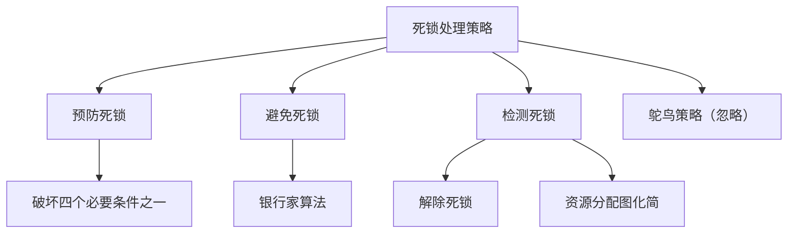
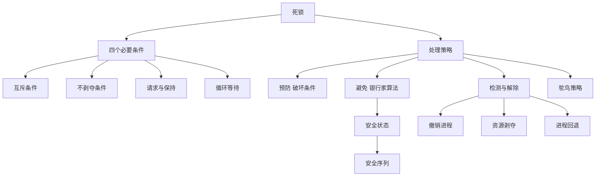

# 408 OS 第二章：死锁

> 📌 死锁是多个进程因为互相等待对方持有的资源，导致所有进程都无法推进的僵局。理解死锁的四个必要条件、银行家算法，以及各种处理策略，是 408 大题的必考内容。


## 📋 前置知识

- [[408_OS_ch2_进程线程]] — 需要理解进程状态、资源分配的概念
- [[408_OS_ch2_同步互斥]] — 需要理解信号量和临界区


## 🤔 死锁是怎么发生的？

回到哲学家进餐问题：5 个哲学家同时拿起左边的筷子，然后同时等待右边的筷子——右边的筷子被左边的哲学家拿着，而左边的哲学家也在等右边的筷子。这就是**死锁（Deadlock）**：所有人都在等，但谁也不会主动放手。

再看一个更简单的例子：

- 进程 A 持有资源 $R_1$，等待资源 $R_2$
- 进程 B 持有资源 $R_2$，等待资源 $R_1$

A 等 B 释放 $R_2$，B 等 A 释放 $R_1$——双方永远等待下去，这就是最典型的死锁场景。


## 🧠 核心概念


### 2.12 死锁的定义与四个必要条件（⭐⭐ 必考！）

**死锁的定义**：多个进程在执行过程中，因争夺资源而造成的一种**互相等待**的僵局。若无外力干预，这些进程将永远无法推进。

死锁发生必须同时满足以下**四个必要条件**（缺少任何一个，死锁就不会发生）：

| 条件 | 含义 | 举例 |
|------|------|------|
| **互斥条件（Mutual Exclusion）** | 资源一次只能被一个进程使用 | 打印机、互斥锁 |
| **不剥夺条件（No Preemption）** | 进程持有的资源只能由自己主动释放，不能被强制剥夺 | 进程拿着文件锁，别人抢不走 |
| **请求与保持条件（Hold and Wait）** | 进程持有至少一个资源，同时又在等待其他资源 | 拿着 $R_1$ 等 $R_2$ |
| **循环等待条件（Circular Wait）** | 存在一个进程等待链，形成环路 | A 等 B，B 等 C，C 等 A |

> ⚠️ **考点**：四个条件是死锁的**必要条件**而非充分条件——满足四个条件不一定死锁，但死锁一定满足这四个条件。破坏任意一个条件就可以预防死锁。

> 🎯 **类比**：四条件就像一场"交通大堵车"的条件：路只能一辆车用（互斥），车不能倒退（不剥夺），每辆车都占着路又等前面的车（请求与保持），最终形成环形堵塞（循环等待）。


### 2.13 资源分配图（RAG）

资源分配图（Resource Allocation Graph）是用图形化方式表示死锁状态的工具。

图中有两类节点：

- **进程节点**（圆圈）：表示进程
- **资源节点**（矩形）：矩形中的小黑点表示该资源的**实例数量**

两类有向边：

- **请求边**（进程→资源）：进程正在请求该资源（还没得到）
- **分配边**（资源→进程）：该资源已经分配给进程

**如何从 RAG 判断是否死锁**：

- 若图中**没有环**：一定没有死锁
- 若图中**有环**：
  - 每种资源只有 1 个实例 → **一定死锁**
  - 每种资源有多个实例 → **可能死锁**（需进一步判断）

```
示例（死锁情形）：
进程 P1 持有资源 R1，请求资源 R2
进程 P2 持有资源 R2，请求资源 R1

R1 → P1 → R2 → P2 → R1（形成环，每种资源 1 个实例 → 死锁）
```


### 2.14 死锁的处理策略

死锁的处理策略分为四类，从"不让死锁发生"到"发生了再处理"：



#### 策略一：死锁预防（静态，限制申请方式）

通过在系统设计时破坏死锁的四个必要条件之一来预防死锁：

| 破坏的条件 | 方法 | 缺点 |
|------------|------|------|
| **互斥条件** | 把资源设计成可共享的（如只读文件） | 很多资源天然不可共享（如打印机），无法破坏 |
| **不剥夺条件** | 允许操作系统强制剥夺进程的资源 | 代价大，可能破坏进程状态 |
| **请求与保持条件** | 进程开始前一次性申请所有资源（资源预分配） | 资源利用率低，可能产生饥饿 |
| **循环等待条件** | 对资源编号，进程只能按递增顺序申请资源 | 限制了编程灵活性 |

**破坏请求与保持条件**（资源预分配法）：

进程在运行前必须一次性申请所有需要的资源，若有一个申请不到，则不分配任何资源，等待。

- 优点：简单，绝对防止死锁
- 缺点：进程可能长时间持有用不到的资源（浪费），且必须预先知道需要哪些资源

**破坏循环等待条件**（资源有序分配法）：

对所有资源类型编号（$R_1, R_2, \ldots, R_m$），规定进程必须按**编号递增**的顺序申请资源。

- 例如：进程必须先申请 $R_1$，才能申请 $R_3$，不能持有 $R_3$ 后再去申请 $R_1$
- 这从根本上打破了循环等待的可能性

> ⚠️ **考点**：死锁预防的缺点是限制太严格，资源利用率低，系统吞吐量降低。


#### 策略二：死锁避免（动态，银行家算法）（⭐⭐ 大题必考！）

死锁避免不从根本上限制资源申请方式，而是在每次资源分配时**动态判断**：如果分配这个资源，系统是否还处于"安全状态"？只有安全才分配。

**安全状态（Safe State）**：

> 🎯 **类比**：你是一家银行（操作系统），有若干笔贷款额度（资源），多个企业（进程）向你借钱。安全状态是指：存在一个还款顺序，使得每个企业都能最终还清贷款，不会让银行因为资金链断裂而倒闭。

如果存在一个**安全序列**（$P_1, P_2, \ldots, P_n$），使得对每个 $P_i$，它需要的资源可以由当前可用资源加上所有 $P_j$（$j < i$）已释放的资源满足，则系统处于安全状态。

安全状态一定不会死锁，不安全状态**可能**（不一定）死锁。

**银行家算法**（Banker's Algorithm）：

设有 $n$ 个进程，$m$ 种资源，定义以下矩阵/向量：

- $\text{Available}[j]$：第 $j$ 种资源当前可用数量（$m$ 维向量）
- $\text{Max}[i][j]$：进程 $i$ 最多需要第 $j$ 种资源的数量（$n \times m$ 矩阵）
- $\text{Allocation}[i][j]$：进程 $i$ 当前已分配第 $j$ 种资源的数量
- $\text{Need}[i][j]$：进程 $i$ 还需要第 $j$ 种资源的数量

$$\text{Need}[i][j] = \text{Max}[i][j] - \text{Allocation}[i][j]$$

**安全性算法**（判断系统是否处于安全状态）：

```
Work = Available（初始化工作向量为当前可用资源）
Finish[i] = false for all i（所有进程初始标记为未完成）

循环：
    找一个进程 i，满足：
        Finish[i] == false
        且 Need[i] <= Work（它需要的资源当前都能满足）
    
    若找到：
        Work = Work + Allocation[i]（假设该进程执行完毕，释放资源）
        Finish[i] = true
    
    若找不到这样的进程：退出循环

若所有 Finish[i] == true：系统处于安全状态，存在安全序列
否则：系统处于不安全状态
```

**资源请求算法**（判断某个请求是否可以满足）：

设进程 $P_i$ 请求资源向量 $\text{Request}_i$：

```
1. 若 Request_i > Need[i]：出错（请求超过最大需求）

2. 若 Request_i > Available：进程等待（资源不足）

3. 假设分配：
   Available = Available - Request_i
   Allocation[i] = Allocation[i] + Request_i
   Need[i] = Need[i] - Request_i

4. 运行安全性算法：
   若系统仍处于安全状态：正式分配（保留上面的假设修改）
   若系统进入不安全状态：撤销假设，进程等待
```

**银行家算法例题**：

设系统中有 3 种资源（A、B、C），数量分别为 10、5、7，有 5 个进程（$P_0 \sim P_4$），某时刻的状态如下：

| 进程 | Max (A B C) | Allocation (A B C) | Need (A B C) |
|------|-------------|---------------------|--------------|
| $P_0$ | 7 5 3 | 0 1 0 | 7 4 3 |
| $P_1$ | 3 2 2 | 2 0 0 | 1 2 2 |
| $P_2$ | 9 0 2 | 3 0 2 | 6 0 0 |
| $P_3$ | 2 2 2 | 2 1 1 | 0 1 1 |
| $P_4$ | 4 3 3 | 0 0 2 | 4 3 1 |

当前 $\text{Available} = (10-0-2-3-2-0,\ 5-1-0-0-1-0,\ 7-0-0-2-1-2) = (3, 3, 2)$

**判断是否安全**：

初始 $\text{Work} = (3, 3, 2)$

**第一轮**：找 $\text{Need}[i] \leq \text{Work}$：

- $P_0$：Need=(7,4,3) > Work=(3,3,2)，不满足
- $P_1$：Need=(1,2,2) ≤ Work=(3,3,2)，✅ 满足
  - $\text{Work} = (3,3,2) + (2,0,0) = (5,3,2)$，$\text{Finish}[1]=\text{true}$

**第二轮**：$\text{Work} = (5,3,2)$

- $P_3$：Need=(0,1,1) ≤ (5,3,2)，✅ 满足
  - $\text{Work} = (5,3,2) + (2,1,1) = (7,4,3)$，$\text{Finish}[3]=\text{true}$

**第三轮**：$\text{Work} = (7,4,3)$

- $P_0$：Need=(7,4,3) ≤ (7,4,3)，✅ 满足
  - $\text{Work} = (7,4,3) + (0,1,0) = (7,5,3)$，$\text{Finish}[0]=\text{true}$

**第四轮**：$\text{Work} = (7,5,3)$

- $P_2$：Need=(6,0,0) ≤ (7,5,3)，✅ 满足
  - $\text{Work} = (7,5,3) + (3,0,2) = (10,5,5)$，$\text{Finish}[2]=\text{true}$

**第五轮**：$\text{Work} = (10,5,5)$

- $P_4$：Need=(4,3,1) ≤ (10,5,5)，✅ 满足

所有进程都能完成，安全序列为 $\langle P_1, P_3, P_0, P_2, P_4 \rangle$，系统处于**安全状态**。

> ⚠️ **注意**：安全序列不唯一，只要能找到一个就说明系统安全。

> ⚠️ **银行家算法的缺点**：
> - 需要预先知道每个进程的最大资源需求（Max），实际中很难做到
> - 每次资源请求都要运行安全性算法，开销大
> - 资源数和进程数固定，实际系统是动态变化的


#### 策略三：死锁检测与解除

操作系统不阻止死锁，让它发生，再定期检测并解除。

**死锁检测（资源分配图化简）**：

1. 找一个**既不等待资源、又分配了资源**的进程（可以完成执行）
2. 假设该进程执行完毕，释放它持有的所有资源，从图中删除该进程
3. 重复步骤 1-2
4. 若所有进程都被删除：无死锁；若还有进程剩余：这些进程处于死锁状态

**死锁解除的方法**：

| 方法 | 原理 | 优点 | 缺点 |
|------|------|------|------|
| **撤销进程** | 终止死锁进程，释放其资源 | 简单直接 | 进程工作丢失 |
| **逐步撤销** | 每次撤销一个代价最小的进程，重复直到解除死锁 | 代价较小 | 判断标准复杂 |
| **资源剥夺** | 强制剥夺某些进程的资源，分配给其他进程 | 进程可继续 | 被剥夺进程可能状态不一致 |
| **进程回退** | 将进程回退到死锁发生前的某个检查点 | 工作损失少 | 需要检查点机制，开销大 |

**选择撤销进程的依据**（代价最小化）：

- 进程已运行的时间（运行时间短的优先撤销，损失小）
- 进程还需要多少时间完成
- 进程持有的资源数量（持有资源多的优先撤销，解除更有效）
- 进程的优先级（低优先级先撤销）


#### 策略四：鸵鸟策略（忽略死锁）

大多数通用操作系统（包括 Linux、Windows）采用的策略：假装死锁不会发生，不做任何预防或检测，靠用户（重启）来解决。

**为什么这是合理的？**

- 死锁发生的概率很低
- 预防和避免死锁的代价（性能开销、使用限制）远高于死锁本身
- 现代系统通过其他机制（如超时、看门狗）来间接处理进程挂起问题


### 2.15 死锁、饥饿、死循环的区别

这三个概念容易混淆，是选择题常考辨析点：

| 特征 | 死锁 | 饥饿 | 死循环 |
|------|------|------|--------|
| **原因** | 多个进程循环等待资源 | 进程长期得不到资源 | 程序逻辑错误 |
| **涉及进程数** | 多个（相互等待） | 一个或多个 | 一个 |
| **能否自行解除** | 否（需外力干预） | 可能（低优先级进程最终得到资源） | 否（需杀死进程） |
| **资源使用** | 各持有部分资源 | 没有资源 | 不一定占资源 |
| **CPU 占用** | 通常不占（都阻塞了） | 通常不占（阻塞等待） | 占（一直循环运行） |


## ⚠️ 常见误区与踩坑点

> ❌ **误区 1：四个条件满足 → 一定死锁**
> 四个条件是死锁的必要条件，满足这四个条件**可能**死锁，但不一定会死锁（比如虽然存在循环等待的可能性，但实际执行时可能某个进程恰好先完成释放了资源）。

> ❌ **误区 2：安全状态 = 无死锁，不安全状态 = 死锁**
> 安全状态一定无死锁，但不安全状态不一定死锁（只是**可能**死锁）。银行家算法拒绝一些不安全的分配，是因为怕进入不安全状态后**无法保证**不死锁。

> ⚠️ **踩坑 3：银行家算法手算时 Need 矩阵计算错误**
> $\text{Need} = \text{Max} - \text{Allocation}$，每个元素单独相减，不要把矩阵搞混。做题前先把 Need 矩阵全部算出来，避免每一步都重算。

> ⚠️ **踩坑 4：安全序列不唯一**
> 找到一个安全序列就够了，不需要找所有安全序列。考试如果问"能否找到安全序列"，找到一个就可以回答"能，序列为 $\langle \ldots \rangle$"。

> ❌ **误区 5：死锁 = 进程一直在运行**
> 死锁的进程通常是**阻塞态**（都在等待资源），CPU 是空闲的，不是进程在忙着死循环。


## 🏋️ 动手练习

### 练习 1：死锁必要条件分析（⭐ 难度）

**题目**：以下哪种措施能**预防**死锁？

A. 给每个进程设置一个运行时限

B. 进程运行前一次性申请所有资源，若不能全部满足则等待

C. 允许进程动态申请资源，但限制同一时刻运行的进程数不超过资源总数

D. 为每个进程设置优先级，高优先级进程可以抢占低优先级进程的 CPU

**参考答案**：**B**

- A：设置运行时限不能预防死锁，只是超时后强制终止（死锁解除，不是预防）
- B：资源预分配破坏了"请求与保持条件"，是死锁预防方法 ✅
- C：限制并发进程数不是标准的死锁预防方法
- D：抢占 CPU 与资源分配无关，不能预防死锁


### 练习 2：银行家算法手算（⭐⭐ 难度）

**题目**：系统有 3 种资源 A、B、C，总量为 (9, 3, 6)。当前状态：

| 进程 | Allocation (A B C) | Max (A B C) |
|------|---------------------|-------------|
| $P_1$ | 2 1 2 | 4 2 3 |
| $P_2$ | 3 0 2 | 6 1 3 |
| $P_3$ | 2 1 1 | 3 1 4 |

计算 Available，再判断是否处于安全状态，若安全给出安全序列。

**参考答案**：

**第一步：计算 Available**

已分配总量 = $(2+3+2, 1+0+1, 2+2+1) = (7, 2, 5)$

$\text{Available} = (9, 3, 6) - (7, 2, 5) = (2, 1, 1)$

**第二步：计算 Need**

| 进程 | Need (A B C) |
|------|-------------|
| $P_1$ | (4,2,3)-(2,1,2)=(2,1,1) |
| $P_2$ | (6,1,3)-(3,0,2)=(3,1,1) |
| $P_3$ | (3,1,4)-(2,1,1)=(1,0,3) |

**第三步：安全性检测**

$\text{Work} = (2,1,1)$

- $P_1$：Need=(2,1,1) ≤ Work=(2,1,1)，✅
  - Work = (2,1,1)+(2,1,2) = (4,2,3)
- $P_2$：Need=(3,1,1) ≤ (4,2,3)，✅
  - Work = (4,2,3)+(3,0,2) = (7,2,5)
- $P_3$：Need=(1,0,3) ≤ (7,2,5)，✅
  - Work = (7,2,5)+(2,1,1) = (9,3,6)

安全序列为 $\langle P_1, P_2, P_3 \rangle$，系统处于**安全状态**。


### 练习 3：死锁 vs 饥饿判断（⭐ 难度）

**题目**：读者写者问题中，若一直有读者在读，写者始终无法进入。这属于死锁还是饥饿？为什么？

**参考答案**：

这属于**饥饿（Starvation）**，不是死锁。

- 写者没有持有任何资源，只是一直等待，而读者并不在等待写者——不存在循环等待，所以不是死锁。
- 写者等待的原因是资源（读写锁）被连续不断的读者占用，自己一直排不上队，这是饥饿现象。
- 如果读者停止到来，写者就能立即运行，说明系统并未陷入僵局，只是资源分配不公平。


## 📝 总结

### 本章要点回顾

1. **死锁的四个必要条件**：互斥、不剥夺、请求与保持、循环等待。四个条件必须**同时满足**才会死锁，破坏任意一个即可预防。

2. **安全状态**：存在安全序列，所有进程都能最终完成。安全状态一定无死锁，不安全状态可能死锁。

3. **银行家算法**：每次分配前运行安全性检测，只有分配后仍处于安全状态才实际分配。手算时，先求 Need = Max - Allocation，再从 Available 出发找安全序列。

4. **死锁解除**：撤销进程（损失工作），资源剥夺（状态可能不一致），进程回退（需检查点机制）。

5. **死锁 vs 饥饿 vs 死循环**：死锁是循环等待，饥饿是一直没机会，死循环是程序逻辑错误。

### 知识图谱




## 🔗 相关链接

- 上一节：[[408_OS_ch2_同步互斥]]
- 下一节：[[408_OS_ch2_调度算法]]
- 相关概念：[[408_OS_ch2_进程线程]]


## 📚 参考资料

- 汤子瀛《操作系统（第四版）》第三章（死锁）— 官方教材
- 王道考研《操作系统》死锁专题 — 银行家算法真题精讲
