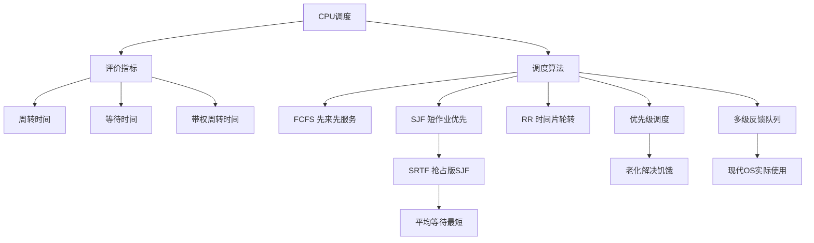

# 408 OS 第二章：CPU 调度算法

> 📌 CPU 调度决定"就绪队列中哪个进程下一个获得 CPU"。调度算法的选择直接影响系统的吞吐量、响应时间和公平性。408 大题会给你进程信息，让你手算各算法下的调度顺序和平均周转时间。


## 📋 前置知识

- [[408_OS_ch2_进程线程]] — 需要理解进程状态、就绪队列的概念
- [[408_OS_ch1_概述]] — 需要了解中断和时钟中断的机制


## 🤔 为什么需要调度算法？

在任何时刻，就绪队列里可能有多个进程在等待 CPU。操作系统需要一个**策略**来决定让哪个进程运行。不同的策略会导致截然不同的结果：

- 让等了最久的进程先运行？（公平，但对短任务不友好）
- 让最短的任务先运行？（平均等待时间最短，但可能饿死长任务）
- 给每个进程一小段时间轮流运行？（交互性好，但频繁切换有开销）

不存在"最好的"调度算法——只有最适合特定场景的算法。


## 🧠 核心概念


### 2.16 调度的基本概念

**调度的层次**：

| 层次 | 名称 | 决定内容 | 频率 |
|------|------|----------|------|
| **高级调度**（作业调度） | 决定哪个作业从磁盘调入内存 | 进程的创建 | 低（分钟级） |
| **中级调度**（内存调度） | 决定哪个进程在内存中（换入/换出） | 进程的挂起/激活 | 中 |
| **低级调度**（进程调度） | 决定就绪队列中哪个进程获得 CPU | CPU 的分配 | 高（毫秒级，最频繁） |

408 考试重点是**低级调度**（进程调度）。

**调度时机**：以下情况会触发调度：

1. 运行态 → 阻塞态（进程主动放弃 CPU 等待事件）
2. 运行态 → 就绪态（时间片用完，或被高优先级进程抢占）
3. 阻塞态 → 就绪态（I/O 完成，系统决定是否切换）
4. 进程终止

**调度方式**：

| 方式 | 含义 | 特点 |
|------|------|------|
| **非抢占式（Non-preemptive）** | 进程一旦获得 CPU，一直运行到主动放弃为止 | 简单，切换开销小；响应时间可能长 |
| **抢占式（Preemptive）** | 操作系统可以强制剥夺正在运行的进程的 CPU | 公平，响应时间短；实现复杂，切换开销大 |

**调度评价指标**：

| 指标 | 定义 | 公式 |
|------|------|------|
| **CPU 利用率** | CPU 有效工作的时间占比 | $\text{CPU 利用率} = \frac{\text{CPU 工作时间}}{\text{总时间}}$ |
| **吞吐量** | 单位时间内完成的进程数 | 进程数/总时间 |
| **周转时间** | 从作业提交到完成的时间 | $T = \text{完成时间} - \text{到达时间}$ |
| **带权周转时间** | 周转时间与服务时间的比值（衡量公平性） | $W = \frac{T}{\text{服务时间}}$ |
| **等待时间** | 进程在就绪队列中等待的总时间 | $\text{等待时间} = T - \text{服务时间}$ |
| **响应时间** | 从提交请求到第一次产生响应的时间 | 对交互式系统重要 |

> ⚠️ **手算关键公式**（必记）：
> $$\text{等待时间} = \text{周转时间} - \text{服务时间（burst time）}$$
> $$\text{周转时间} = \text{完成时间} - \text{到达时间}$$
> $$\text{带权周转时间} = \frac{\text{周转时间}}{\text{服务时间}}$$


### 2.17 各调度算法详解与手算

#### 算法一：先来先服务（FCFS，First Come First Served）

**策略**：按照进程**到达就绪队列的顺序**分配 CPU，先到先服务。

**类型**：非抢占式

**特点**：

- 最简单，实现容易
- 对长作业有利，对短作业不利（短任务可能等很久）
- **护航效应（Convoy Effect）**：一个长作业排在前面，后面的短作业都在等，系统整体性能差

**手算示例**：

| 进程 | 到达时间 | 服务时间（CPU burst） |
|------|----------|----------------------|
| $P_1$ | 0 | 7 |
| $P_2$ | 2 | 4 |
| $P_3$ | 4 | 1 |

FCFS 调度顺序（按到达时间）：$P_1 \to P_2 \to P_3$

甘特图（Gantt Chart）：

```
| P1         | P2     | P3 |
0            7       11   12
```

计算结果：

| 进程 | 到达时间 | 完成时间 | 周转时间 | 等待时间 | 带权周转时间 |
|------|----------|----------|----------|----------|------------|
| $P_1$ | 0 | 7 | 7-0=7 | 7-7=0 | 7/7=1.0 |
| $P_2$ | 2 | 11 | 11-2=9 | 9-4=5 | 9/4=2.25 |
| $P_3$ | 4 | 12 | 12-4=8 | 8-1=7 | 8/1=8.0 |

平均周转时间 = $(7+9+8)/3 = 8$，平均等待时间 = $(0+5+7)/3 = 4$


#### 算法二：短作业优先（SJF，Shortest Job First）

**策略**：每次调度时，选择**服务时间最短**的进程运行。

**类型**：
- **非抢占式 SJF**：选中后一直运行到完成（或主动阻塞）
- **抢占式 SJF（SRTF）**：有新进程到达时，若新进程的剩余时间更短，则立即抢占（Shortest Remaining Time First，最短剩余时间优先）

**特点**：

- 平均等待时间和平均周转时间**最短**（非抢占 SJF 在同一时刻到达的进程中最优）
- 对长作业不公平，可能导致**饥饿**（长作业一直被短作业插队）
- 必须预知进程的服务时间，实际中难以实现（通常用历史数据预测）

**非抢占 SJF 手算示例**（同样的进程表）：

| 进程 | 到达时间 | 服务时间 |
|------|----------|---------|
| $P_1$ | 0 | 7 |
| $P_2$ | 2 | 4 |
| $P_3$ | 4 | 1 |

- 时刻 0：只有 $P_1$ 到达，运行 $P_1$（非抢占，必须等 $P_1$ 完成）
- 时刻 7：$P_1$ 完成，就绪队列有 $P_2$（服务时间 4）和 $P_3$（服务时间 1）。选短的 $P_3$
- 时刻 8：$P_3$ 完成，运行 $P_2$

甘特图：

```
| P1         | P3 | P2     |
0            7    8       12
```

| 进程 | 到达 | 完成 | 周转时间 | 等待时间 |
|------|------|------|----------|---------|
| $P_1$ | 0 | 7 | 7 | 0 |
| $P_2$ | 2 | 12 | 10 | 6 |
| $P_3$ | 4 | 8 | 4 | 3 |

平均周转时间 = $(7+10+4)/3 = 7$（比 FCFS 的 8 更短）

**抢占式 SJF（SRTF）手算示例**：

| 进程 | 到达时间 | 服务时间 |
|------|----------|---------|
| $P_1$ | 0 | 7 |
| $P_2$ | 2 | 4 |
| $P_3$ | 4 | 1 |

- 时刻 0：$P_1$ 到达，运行 $P_1$（剩余时间 7）
- 时刻 2：$P_2$ 到达（服务时间 4），$P_1$ 剩余 5。4 < 5，$P_2$ 抢占 $P_1$！
- 时刻 4：$P_3$ 到达（服务时间 1），$P_2$ 剩余 2。1 < 2，$P_3$ 抢占 $P_2$！
- 时刻 5：$P_3$ 完成，就绪队列：$P_1$（剩余 5）、$P_2$（剩余 2）。选 $P_2$
- 时刻 7：$P_2$ 完成，运行 $P_1$
- 时刻 12：$P_1$ 完成

甘特图：

```
| P1 | P2 | P3 | P2 | P1          |
0    2    4    5    7            12
```

| 进程 | 到达 | 完成 | 周转时间 | 等待时间 |
|------|------|------|----------|---------|
| $P_1$ | 0 | 12 | 12 | 5 |
| $P_2$ | 2 | 7 | 5 | 1 |
| $P_3$ | 4 | 5 | 1 | 0 |

平均周转时间 = $(12+5+1)/3 = 6$（SRTF 是所有算法中平均周转时间最短的）


#### 算法三：时间片轮转（RR，Round Robin）

**策略**：把 CPU 时间分成固定大小的**时间片**（Quantum），就绪队列中的进程轮流各运行一个时间片。若时间片用完还没结束，进程回到就绪队列末尾等待下一轮。

**类型**：抢占式

**特点**：

- 对所有进程**公平**，响应时间短（适合分时系统）
- 时间片大小对性能影响很大：
  - 时间片太小：切换频繁，上下文切换开销占比大，CPU 利用率下降
  - 时间片太大：退化为 FCFS，响应时间长
  - **经验值**：时间片大小通常设为使 80% 的 CPU burst 在一个时间片内完成

**手算示例**（时间片 = 2）：

| 进程 | 到达时间 | 服务时间 |
|------|----------|---------|
| $P_1$ | 0 | 5 |
| $P_2$ | 1 | 3 |
| $P_3$ | 2 | 1 |

执行过程（时间片 q=2）：

- 时刻 0：就绪队列 [$P_1$]，运行 $P_1$（运行 2）
- 时刻 2：$P_1$ 剩余 3，$P_2$ 已到达。就绪队列 [$P_2, P_1$]（$P_1$ 排到队尾）
  - 运行 $P_2$（运行 2）
- 时刻 4：$P_2$ 剩余 1，$P_3$ 已到达。就绪队列 [$P_1, P_3, P_2$]
  - 运行 $P_1$（运行 2）
- 时刻 6：$P_1$ 剩余 1。就绪队列 [$P_3, P_2, P_1$]
  - 运行 $P_3$（运行 1，完成！）
- 时刻 7：就绪队列 [$P_2, P_1$]，运行 $P_2$（剩余 1，运行完成！）
- 时刻 8：就绪队列 [$P_1$]，运行 $P_1$（剩余 1，运行完成！）

甘特图：

```
| P1 | P2 | P1 | P3 | P2 | P1 |
0    2    4    6    7    8    9
```

| 进程 | 到达 | 完成 | 周转时间 | 等待时间 |
|------|------|------|----------|---------|
| $P_1$ | 0 | 9 | 9 | 4 |
| $P_2$ | 1 | 8 | 7 | 4 |
| $P_3$ | 2 | 7 | 5 | 4 |

> ⚠️ **手算 RR 的易错点**：新到达的进程和时间片用完回到队尾的进程，进队列的顺序要处理好。通常约定：若某时刻有进程时间片用完，同时有新进程到达，**新进程先入队，时间片用完的进程排在新进程后面**（或反之，题目会说明，若未说明任意假设并注明）。


#### 算法四：优先级调度（Priority Scheduling）

**策略**：每次调度选择**优先级最高**的进程运行。

**类型**：可以是抢占式或非抢占式（题目会说明）

**优先级的设定**：

| 优先级来源 | 方式 | 说明 |
|------------|------|------|
| **静态优先级** | 进程创建时设定，运行中不变 | 简单，但不公平（低优先级可能饿死） |
| **动态优先级** | 运行过程中根据情况调整 | 等待时间越长优先级越高（老化机制，解决饥饿） |

**老化（Aging）机制**：为了防止低优先级进程饿死，每隔一段时间将所有等待进程的优先级提升一点，最终每个进程都有机会运行。

**优先级的分配原则**：

- I/O 密集型进程（经常等 I/O）优先级高于 CPU 密集型（让 I/O 操作尽快完成，提高 I/O 利用率）
- 实时进程优先级高于普通进程
- 交互式进程优先级高于批处理进程

**手算示例**（非抢占式，数字越小优先级越高）：

| 进程 | 到达时间 | 服务时间 | 优先级 |
|------|----------|---------|--------|
| $P_1$ | 0 | 10 | 3 |
| $P_2$ | 1 | 1 | 1 |
| $P_3$ | 2 | 2 | 4 |
| $P_4$ | 3 | 1 | 5 |
| $P_5$ | 4 | 5 | 2 |

- 时刻 0：只有 $P_1$，运行 $P_1$（非抢占，一直运行到完成）
- 时刻 10：就绪队列 [$P_2, P_3, P_4, P_5$]，按优先级：$P_2$（1）< $P_5$（2）< $P_3$（4）< $P_4$（5）
  - 选 $P_2$ 运行
- 时刻 11：选 $P_5$ 运行
- 时刻 16：选 $P_3$ 运行
- 时刻 18：选 $P_4$ 运行

甘特图：

```
| P1                | P2 | P5        | P3  | P4 |
0                  10   11          16   18   19
```


#### 算法五：多级反馈队列（MLFQ，Multilevel Feedback Queue）

这是**最接近实际操作系统使用的算法**（Linux、Windows 的调度核心思想），综合了 RR 和优先级调度的优点。

**基本结构**：

```
高优先级  → 队列 1（时间片 q=1）  ← 新进程首先进入这里
         → 队列 2（时间片 q=2）
         → 队列 3（时间片 q=4）
低优先级  → 队列 n（时间片 q=2^(n-1)）
```

**调度规则**：

1. 新进程进入最高优先级队列（队列 1）
2. 用时间片轮转运行队列 1 中的进程
3. 如果一个进程在一个时间片内没有完成，降级到队列 2（时间片变大）
4. 以此类推，越来越长时间片的队列优先级越低
5. 只有高优先级队列为空时，才调度低优先级队列

**优点**：

- 短作业（CPU burst 短的）在高优先级队列就完成了，等待时间短
- 长作业逐渐降级，用更大的时间片运行，减少切换次数
- 交互式进程（经常主动让出 CPU）自然保持在高优先级队列
- 不需要预知进程的服务时间，算法自适应

> ⚠️ **408 考点**：多级反馈队列以概念理解和判断题为主，通常不考手算。重点记住：为什么它能兼顾短作业响应时间和长作业吞吐量。


### 2.18 各调度算法综合对比

| 算法 | 抢占 | 对短作业 | 对长作业 | 平均等待时间 | 饥饿 | 适用场景 |
|------|------|----------|----------|------------|------|---------|
| FCFS | 否 | 不利 | 有利 | 可能很长 | 无 | 批处理 |
| SJF（非抢占） | 否 | 有利 | 不利 | 最优（同时到达时） | 可能 | 批处理 |
| SRTF（抢占SJF） | 是 | 最有利 | 不利 | 最优（总体最优） | 可能 | 理论最优 |
| RR | 是 | 较有利 | 不利 | 均衡 | 无 | 分时系统 |
| 优先级（非抢占） | 否 | 取决于优先级 | 取决于优先级 | 中等 | 可能 | 实时/嵌入式 |
| 优先级（抢占） | 是 | 取决于优先级 | 取决于优先级 | 较短 | 可能 | 通用 |
| MLFQ | 是 | 最有利 | 逐渐适应 | 短作业最短 | 可能 | 现代OS通用 |

> 💡 **一句话总结**：FCFS 最公平但效率低；SJF 平均等待时间最短但需要预知 burst；RR 对交互式系统响应好；优先级灵活但可能饥饿；MLFQ 是现实系统的最优折中。


## ⚠️ 常见误区与踩坑点

> ❌ **误区 1：非抢占式算法中，新到达进程可以立刻抢占当前进程**
> 非抢占式意味着正在运行的进程不会被强制中断。新进程到达只是进入就绪队列，当前进程必须运行到完成（或主动阻塞）才会触发调度。

> ⚠️ **踩坑 2：FCFS 中"先来"是指到达就绪队列的时间，不是提交时间**
> 若进程在时刻 0 提交但时刻 5 才装入内存（创建进程），则从时刻 5 开始算到达就绪队列的时间。

> ⚠️ **踩坑 3：SJF 手算时，"服务时间"是 CPU burst，不是周转时间**
> 判断谁最短，比较的是 CPU burst（还需要多少 CPU 时间），不是周转时间（那是结果，不是输入）。

> ❌ **误区 4：带权周转时间越小越好 = 服务时间越长越好**
> 带权周转时间 = 周转时间 / 服务时间，若某进程服务时间极短但等了很久，带权周转时间会很大，说明对这个进程不公平。带权周转时间越接近 1 越好。

> ⚠️ **踩坑 5：RR 手算中进程入队顺序**
> 同一时刻发生"时间片用完回队"和"新进程到达"时，通常约定**先将新到进程入队，再将时间片用完的进程排到队尾**。若题目没说明，选一种并说明假设即可。


## 🏋️ 动手练习

### 练习 1：FCFS + SJF 对比手算（⭐⭐ 难度）

**题目**：进程信息如下，分别用 FCFS 和非抢占 SJF 计算平均周转时间和平均等待时间。

| 进程 | 到达时间 | 服务时间 |
|------|----------|---------|
| $P_1$ | 0 | 6 |
| $P_2$ | 1 | 8 |
| $P_3$ | 2 | 7 |
| $P_4$ | 3 | 3 |

**参考答案**：

**FCFS**（按到达时间：$P_1 \to P_2 \to P_3 \to P_4$）：

```
| P1     | P2              | P3            | P4   |
0        6               14             21     24
```

| 进程 | 到达 | 完成 | 周转时间 | 等待时间 |
|------|------|------|----------|---------|
| $P_1$ | 0 | 6 | 6 | 0 |
| $P_2$ | 1 | 14 | 13 | 5 |
| $P_3$ | 2 | 21 | 19 | 12 |
| $P_4$ | 3 | 24 | 21 | 18 |

平均周转时间 = $(6+13+19+21)/4 = 14.75$，平均等待时间 = $(0+5+12+18)/4 = 8.75$

**非抢占 SJF**：

- 时刻 0：只有 $P_1$，运行 $P_1$
- 时刻 6：就绪队列 [$P_2$（8）, $P_3$（7）, $P_4$（3）]，选 $P_4$（最短）
- 时刻 9：就绪队列 [$P_2$（8）, $P_3$（7）]，选 $P_3$
- 时刻 16：就绪队列 [$P_2$（8）]，运行 $P_2$

```
| P1     | P4   | P3      | P2              |
0        6      9        16               24
```

| 进程 | 到达 | 完成 | 周转时间 | 等待时间 |
|------|------|------|----------|---------|
| $P_1$ | 0 | 6 | 6 | 0 |
| $P_2$ | 1 | 24 | 23 | 15 |
| $P_3$ | 2 | 16 | 14 | 7 |
| $P_4$ | 3 | 9 | 6 | 3 |

平均周转时间 = $(6+23+14+6)/4 = 12.25$，平均等待时间 = $(0+15+7+3)/4 = 6.25$

SJF 的平均周转时间（12.25）明显优于 FCFS（14.75），但 $P_2$ 的等待时间反而更长（饥饿风险）。


### 练习 2：RR 手算（⭐⭐ 难度）

**题目**：以下进程用时间片 $q=2$ 的 RR 算法调度，计算平均周转时间。

| 进程 | 到达时间 | 服务时间 |
|------|----------|---------|
| $P_1$ | 0 | 4 |
| $P_2$ | 0 | 3 |
| $P_3$ | 0 | 5 |

**参考答案**（三个进程同时到达，初始队列顺序为 $P_1, P_2, P_3$）：

执行过程：

- 0-2：$P_1$ 运行 2，剩余 2。队列：[$P_2, P_3, P_1$]
- 2-4：$P_2$ 运行 2，剩余 1。队列：[$P_3, P_1, P_2$]
- 4-6：$P_3$ 运行 2，剩余 3。队列：[$P_1, P_2, P_3$]
- 6-8：$P_1$ 运行 2，完成！队列：[$P_2, P_3$]
- 8-9：$P_2$ 运行 1，完成！队列：[$P_3$]
- 9-11：$P_3$ 运行 2，剩余 1。队列：[$P_3$]
- 11-12：$P_3$ 运行 1，完成！

甘特图：

```
| P1 | P2 | P3 | P1 | P2 | P3 | P3 |
0    2    4    6    8    9   11   12
```

| 进程 | 到达 | 完成 | 周转时间 |
|------|------|------|----------|
| $P_1$ | 0 | 8 | 8 |
| $P_2$ | 0 | 9 | 9 |
| $P_3$ | 0 | 12 | 12 |

平均周转时间 = $(8+9+12)/3 = 9.67$


## 📝 总结

### 本章要点回顾

1. **调度指标**：周转时间 = 完成 - 到达；等待时间 = 周转时间 - 服务时间；带权周转时间 = 周转时间 / 服务时间。

2. **FCFS**：最简单，按到达顺序，非抢占；护航效应导致短作业等待时间长。

3. **SJF / SRTF**：平均等待时间最短（SRTF 最优），但可能饥饿，需预知 burst 时间。

4. **RR**：时间片轮转，公平，响应时间短；时间片大小是关键参数，太小切换开销大，太大退化为 FCFS。

5. **优先级调度**：灵活，可能饥饿；老化机制解决饥饿问题。

6. **MLFQ**：综合最优，是现代操作系统的实际选择；新进程进高优先级队列，长时间未完成则降级。

### 知识图谱




## 🔗 相关链接

- 上一节：[[408_OS_ch2_死锁]]
- 本章完结，下一大章：[[408_OS_ch3_内存管理]]
- 本章回顾：[[408_OS_ch2_进程线程]] | [[408_OS_ch2_同步互斥]] | [[408_OS_ch2_死锁]]


## 📚 参考资料

- 汤子瀛《操作系统（第四版）》第二章调度节 — 官方教材
- 王道考研《操作系统》调度算法专题 — 手算真题必刷
