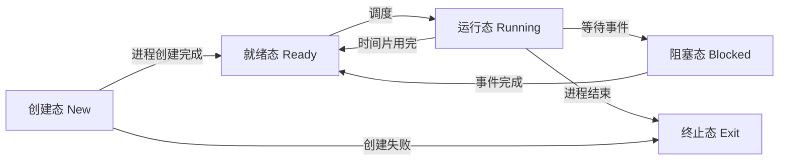
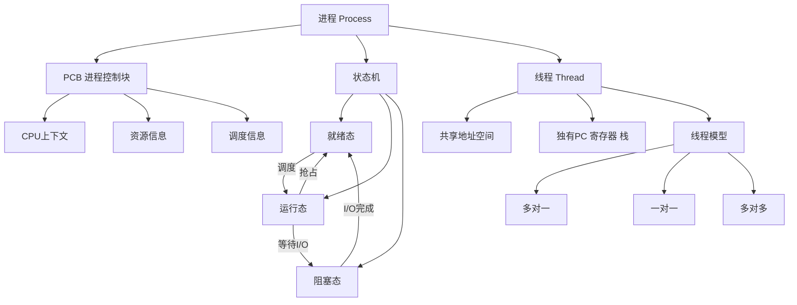

# 408 OS 第二章：进程与线程

> 📌 进程是操作系统进行**资源分配**的基本单位，线程是 CPU **调度执行**的基本单位。理解进程的状态转换和控制，是学习后续同步、死锁、调度的根基。


## 📋 前置知识

- [[408_OS_ch1_概述]] — 需要理解并发、中断、用户态/内核态的概念
- [[计算机组成原理]] — 需要了解寄存器、程序计数器（PC）、栈的概念


## 🤔 为什么需要"进程"这个概念？

早期计算机一次只运行一个程序，程序就是程序。但当多道程序设计出现后，内存中同时有多个程序，问题来了：

- CPU 怎么知道现在轮到哪个程序运行？
- 每个程序"运行到哪里了"怎么记录？
- 程序 A 在等磁盘 I/O，怎么让 CPU 去运行程序 B，之后再回来继续 A？

操作系统需要一个**数据结构**来描述"一个正在运行的程序的完整状态"，这就是**进程（Process）**的由来。

进程不是程序本身，而是程序的**一次执行过程**——包括程序的代码、当前运行到哪里（程序计数器）、用了哪些内存、打开了哪些文件等所有状态信息。


## 🧠 核心概念


### 2.1 进程的定义与组成

> 🎯 **类比**：如果"程序"是一份菜谱，那"进程"就是按照这份菜谱**正在烹饪中的一道菜**。同一份菜谱可以同时做出多道菜（同一个程序可以有多个进程），每道菜的进度各不相同，用的是不同的锅和食材（不同的内存空间和资源）。

**进程的正式定义**：进程是程序的一次执行，是系统进行**资源分配和调度**的基本单位，是操作系统结构的基础。

进程由三部分组成：

| 组成部分 | 内容 | 作用 |
|----------|------|------|
| **程序段** | 程序的机器代码（指令序列） | 进程要执行的操作 |
| **数据段** | 全局变量、堆、栈等运行时数据 | 进程操作的对象 |
| **进程控制块 PCB** | 描述进程当前状态的数据结构 | 操作系统管理进程的唯一凭证 |

**程序 vs 进程**（必须区分清楚）：

| 对比维度 | 程序 | 进程 |
|----------|------|------|
| 本质 | 静态的指令集合（存储在磁盘） | 动态的执行过程（在内存中运行） |
| 生命周期 | 永久存在（除非删除文件） | 有创建和终止，是暂时的 |
| 对应关系 | 一个程序可对应多个进程 | 一个进程只对应一个程序 |
| 资源 | 不占用运行时资源 | 占用 CPU、内存、文件等资源 |


### 2.2 进程控制块 PCB（⭐ 必考！）

PCB（Process Control Block，进程控制块）是操作系统**管理进程的核心数据结构**。操作系统通过 PCB 来感知进程的存在，PCB 是进程存在的**唯一标志**。

> 🎯 **类比**：PCB 就像每个员工的**人事档案**。公司（操作系统）通过档案来了解员工（进程）的基本信息：员工编号（PID）、现在在哪里上班（状态）、工资级别（优先级）、负责什么项目（打开的文件）等。没有档案，公司就无法管理这个员工。

PCB 中包含的信息分为四类：

**① 进程标识信息**

- **PID**（Process Identifier，进程标识符）：进程的唯一编号，就像身份证号
- **父进程 PID**（PPID）：创建当前进程的进程的 PID
- **用户标识**：是哪个用户启动的这个进程

**② 处理机状态信息（CPU 上下文）**

这是进程被切换出 CPU 时需要保存的所有寄存器值，包括：

- **程序计数器（PC）**：记录下一条要执行的指令地址，这是"运行到哪里了"的核心记录
- **通用寄存器**：各种计算中间结果
- **栈指针（SP）**：指向当前栈顶的位置
- **程序状态字（PSW）**：包含各种标志位（进位标志、零标志等）和当前特权级

这些信息合称"**CPU 上下文**"，进程切换时必须保存和恢复。

**③ 进程调度信息**

- **进程状态**：就绪、运行、阻塞等（详见下一节）
- **进程优先级**：决定调度时谁先运行
- **等待事件**：进程在阻塞时等待什么事件（如等待磁盘读写完成）

**④ 进程控制信息**

- **内存地址信息**：进程的代码段、数据段、堆栈在哪里
- **打开文件列表**：进程当前打开了哪些文件（文件描述符表）
- **I/O 资源**：进程占用了哪些 I/O 设备

> ⚠️ **考点**：PCB 存放在**内核空间**（受保护的内存区域），用户程序不能直接读写 PCB。进程切换时，操作系统把旧进程的 CPU 上下文保存到其 PCB，再从新进程的 PCB 中恢复 CPU 上下文。


### 2.3 进程的状态与转换（⭐⭐ 必考！）

进程在其生命周期中会经历不同的状态。状态转换图是 408 大题的常考内容，必须理解每个转换的触发条件。

#### 三状态模型（基础）


**① 就绪态（Ready）**

进程已经准备好运行所需的一切资源（内存、I/O 设备），只差 CPU。处于就绪态的进程可能有多个，它们排成**就绪队列**，等待调度程序分配 CPU。

**② 运行态（Running）**

进程正在 CPU 上执行。在单处理机系统中，同一时刻最多只有**一个**进程处于运行态。

**③ 阻塞态（Blocked）**，也叫等待态

进程正在等待某个事件发生，即使给它 CPU 也无法运行。常见原因：

- 等待 I/O 完成（磁盘读数据、键盘输入）
- 等待其他进程发送消息
- 等待定时器到期

**关键规则**：

- **就绪→运行**：只有调度程序决定，是操作系统主动触发
- **运行→就绪**：时间片用完，或更高优先级进程来了（被抢占）
- **运行→阻塞**：进程**主动**请求等待某事件（如发出 I/O 请求）
- **阻塞→就绪**：等待的事件**发生了**（如 I/O 完成中断），注意这里是到**就绪态**而不是直接到运行态！

> ❌ **常见误区**：很多人认为"I/O 完成后进程直接进入运行态"，实际上是进入就绪态，还需要等调度程序选中它才能运行。阻塞态不能直接转换到运行态！

#### 五状态模型（完整）

在三状态基础上加入**创建态**和**终止态**：



**创建态（New）**：操作系统正在为进程分配资源、初始化 PCB，进程还没有准备好运行。

**终止态（Exit）**：进程执行完毕或被强制终止，操作系统正在回收其资源，还没有完全销毁 PCB（其他进程可能还在查询它的退出状态）。

#### 七状态模型（含挂起）

当内存不足时，操作系统会把某些进程从内存**换出到磁盘**，腾出内存给其他进程。被换出的进程处于"挂起"状态。

| 状态 | 在内存中 | 在磁盘上 |
|------|----------|----------|
| 就绪态 | ✅ | ❌ |
| 阻塞态 | ✅ | ❌ |
| 就绪挂起 | ❌ | ✅（等事件完成后可运行） |
| 阻塞挂起 | ❌ | ✅（还在等事件，且被换出） |

> ⚠️ **考点**：挂起（suspend）是操作系统主动行为，不是进程自己要求的。挂起后进程的内存映像被保存到磁盘（交换区）。


### 2.4 进程控制（进程的创建、终止、阻塞与唤醒）

**原语（Primitive）**：操作系统中用于进程控制的操作必须是**原子性**的，即要么全做，要么全不做，不能被中断。这类操作称为原语。原语通过关中断/开中断来实现原子性。

**① 进程的创建**

触发创建进程的事件：用户登录、作业调度、系统初始化、用户程序调用 `fork()`。

创建过程：
1. 申请空白 PCB，分配唯一 PID
2. 为进程分配内存、其他资源
3. 初始化 PCB（填写进程状态为就绪、优先级、寄存器初值等）
4. 将 PCB 插入就绪队列

**② 进程的终止**

触发终止的事件：进程正常退出（`exit()`）、异常退出（除零、越界）、父进程请求终止子进程。

终止过程：
1. 找到对应 PCB
2. 若进程在运行，立即剥夺 CPU，调度新进程
3. 若有子进程，递归终止所有子进程
4. 释放所有资源（内存、文件、I/O 设备）
5. 将 PCB 从队列中摘除（或保留为僵尸进程等待父进程读取退出状态）

**③ 进程的阻塞与唤醒**

**阻塞**：进程主动调用阻塞原语（如 `wait()`），将自己从运行态转为阻塞态，进入阻塞队列，让出 CPU，触发重新调度。

**唤醒**：当进程等待的事件发生（如 I/O 中断），操作系统调用唤醒原语，将进程从阻塞队列移入就绪队列。

> ⚠️ **考点**：阻塞是进程**主动**行为；唤醒必须由**其他进程或操作系统**发出，不能自己唤醒自己（自己都阻塞了怎么自己唤醒自己）。阻塞和唤醒必须成对使用。


### 2.5 进程通信（IPC）

多个进程需要传递数据时，由于进程的地址空间相互独立，不能直接访问对方内存，需要通过操作系统提供的机制来通信。

| 通信方式 | 原理 | 特点 | 适用场景 |
|----------|------|------|----------|
| **共享内存** | 两个进程共享一块物理内存 | 速度最快，但需要同步机制 | 大量数据传输 |
| **消息传递** | 通过 `send/receive` 原语发送消息 | 简单，系统负责传递 | 少量数据，同步控制 |
| **管道（Pipe）** | 半双工的字节流通道 | 只能在有亲缘关系的进程间用 | 父子进程通信 |
| **信号（Signal）** | 发送简单的通知信号 | 只能通知，携带信息量少 | 事件通知 |
| **套接字（Socket）** | 网络通信接口 | 可跨主机通信 | 网络应用 |

> ⚠️ **考点**：共享内存是**最快的** IPC 方式（不需要内核中转，数据直接在内存中共享）。消息传递需要数据拷贝（用户空间→内核→用户空间），速度较慢。


### 2.6 线程（Thread）（⭐⭐ 必考！）

#### 为什么需要线程？

进程是资源分配的基本单位，创建和切换进程的代价很高（需要分配内存、文件描述符、页表等）。但很多时候，我们只是想让同一个程序的多个任务**并发执行**，而这些任务共享相同的数据和代码。

> 🎯 **类比**：进程是一家公司，拥有自己的办公室、设备、员工档案（独立的地址空间和资源）。如果要让两个项目并行推进，在"进程"的比喻下，要建立两家完全独立的公司，代价极高。但实际上我们只需要**同一家公司的两个项目组**（线程），共用公司的办公室和资源，只是各自独立地推进自己的工作。

**线程**是进程内部的一个执行流，是 CPU 调度的基本单位。同一进程内的多个线程**共享进程的地址空间和资源**，但每个线程有自己独立的：

- **程序计数器**（各自执行到不同位置）
- **寄存器组**（各自的运算中间状态）
- **栈**（各自的函数调用链）

#### 进程 vs 线程（⭐ 必考对比！）

| 对比维度 | 进程 | 线程 |
|----------|------|------|
| **资源分配** | 基本单位，拥有独立地址空间 | 不独立分配资源，共享进程资源 |
| **CPU 调度** | 传统上是调度单位 | 现代系统中是调度的基本单位 |
| **创建开销** | 大（需分配独立内存、页表等） | 小（共享进程资源） |
| **切换开销** | 大（需切换地址空间，刷新 TLB） | 小（地址空间不变） |
| **通信方式** | 需要 IPC 机制（开销大） | 直接读写共享内存（开销小） |
| **独立性** | 进程间完全隔离 | 线程间共享内存，一个崩溃可能影响同进程其他线程 |
| **并发性** | 进程间可并发 | 同一进程内线程可并发 |

**记忆口诀**：进程是资源分配单位，线程是调度单位；进程重量级，线程轻量级；进程间隔离，线程间共享。

#### 线程的实现方式

| 实现方式 | 原理 | 优点 | 缺点 |
|----------|------|------|------|
| **用户级线程（ULT）** | 线程管理在用户态完成，内核不感知 | 切换快，不需要系统调用 | 一个线程阻塞，整个进程阻塞 |
| **内核级线程（KLT）** | 线程由内核直接管理，一个线程对应一个内核线程 | 一个线程阻塞不影响其他线程 | 切换需要系统调用，开销大 |
| **混合方式** | 用户线程映射到内核线程，$m$ 个用户线程对应 $n$ 个内核线程 | 兼顾两者优点 | 实现复杂 |

> ⚠️ **考点**：现代操作系统（Linux、Windows）采用**内核级线程**。Linux 中线程通过 `clone()` 系统调用实现，内核将其视为共享地址空间的"轻量级进程"。


### 2.7 多线程模型

当用户级线程和内核级线程并存时，存在三种映射模型：

**① 多对一模型（Many-to-One）**：多个用户线程映射到一个内核线程。

```
用户线程：T1  T2  T3
              ↓
内核线程：   KT1
```

- 优点：切换快（不进内核）
- 缺点：一个线程调用阻塞系统调用，整个进程阻塞；无法利用多核

**② 一对一模型（One-to-One）**：每个用户线程对应一个内核线程。

```
用户线程：T1  T2  T3
          ↓   ↓   ↓
内核线程：KT1 KT2 KT3
```

- 优点：真正并行，一个线程阻塞不影响其他线程
- 缺点：线程多了内核开销大（Linux、Windows 采用此模型）

**③ 多对多模型（Many-to-Many）**：$m$ 个用户线程映射到 $n$ 个内核线程（$m \geq n$）。

- 优点：灵活，兼顾并行性和开销
- 缺点：实现复杂


## ⚠️ 常见误区与踩坑点

> ❌ **误区 1：一个进程只能有一个线程**
> 现代操作系统中，一个进程可以有多个线程（如浏览器：一个线程负责渲染，一个线程负责网络下载，一个线程负责 UI 响应）。

> ❌ **误区 2：线程切换不需要保存任何状态**
> 线程切换仍然需要保存/恢复线程自己的 PC、寄存器、栈指针，只是不需要切换地址空间（页表），所以比进程切换快。

> ⚠️ **踩坑 3：阻塞态不能直接到运行态**
> 很多人画状态图时会连一条"阻塞→运行"的箭头，这是错的。阻塞态只能转到就绪态，然后再由调度程序选中才能进入运行态。

> ⚠️ **踩坑 4：程序和进程的数量关系**
> "同一个程序的多次运行"产生多个进程。例如，你同时打开两个记事本窗口，就有两个进程，但它们对应同一个程序文件（notepad.exe）。

> ❌ **误区 5：父进程终止，子进程立即终止**
> 在 Linux 中，父进程终止后，子进程会被 `init` 进程（PID=1）收养，成为孤儿进程，继续运行。但 Windows 中父进程终止时通常会终止所有子进程（取决于具体实现）。408 考试以 Linux 行为为主。


## 🏋️ 动手练习

### 练习 1：状态转换判断（⭐ 难度）

**题目**：下列关于进程状态转换的描述中，**不可能**发生的是（）

A. 就绪态 → 运行态

B. 运行态 → 就绪态

C. 运行态 → 阻塞态

D. 阻塞态 → 运行态

**参考答案**：**D**

阻塞态不能直接转换到运行态。阻塞态必须先等待事件发生，转换到就绪态，再由调度程序选中后才能进入运行态。


### 练习 2：进程与线程对比简答（⭐⭐ 难度）

**题目**：简述进程和线程的区别与联系。（简答题，约 150 字）

**参考答案**：

**区别**：

- **调度**：进程是资源分配的基本单位，线程是 CPU 调度的基本单位（在引入线程的系统中）。
- **资源**：进程拥有独立的地址空间和系统资源；同一进程内的线程共享进程的地址空间和资源，各自只拥有独立的程序计数器、寄存器和栈。
- **开销**：进程的创建、撤销和切换开销大（需切换地址空间）；线程的开销小得多。
- **独立性**：进程间相互隔离，一个进程崩溃不影响其他进程；同一进程的线程共享内存，一个线程异常可能导致整个进程崩溃。

**联系**：线程是进程的组成部分，一个进程可包含多个线程，进程是线程的容器和资源提供者。


### 练习 3：PCB 内容分析（⭐⭐ 难度）

**题目**：当进程 A 因时间片用完被切换出 CPU，操作系统需要把 A 的哪些信息保存到 PCB？为什么必须保存这些信息？

**参考答案**：

需要保存的信息（**CPU 上下文**）：

1. **程序计数器（PC）**：记录 A 下一条要执行的指令地址，否则恢复时不知道从哪里继续。
2. **通用寄存器**：各种运算的中间值（如 `eax`、`ebx` 等），否则恢复时计算结果丢失。
3. **栈指针（SP）**：指向当前栈顶，否则函数调用链断裂。
4. **程序状态字（PSW）**：包含零标志、进位标志等状态位，否则条件判断结果丢失。

保存的原因：CPU 在任一时刻只有一套寄存器，切换到新进程时，旧进程的寄存器值会被覆盖。保存 CPU 上下文到 PCB，恢复时才能让旧进程"无感知"地继续运行，就好像它从未被中断过。


## 📝 总结

### 本章要点回顾

1. **进程 = 程序 + 执行状态**，是资源分配的基本单位；PCB 是进程存在的唯一标志，由操作系统维护在内核空间。

2. **三状态模型**：就绪↔运行（调度/抢占），运行→阻塞（等事件），阻塞→就绪（事件完成）。阻塞不能直接到运行！

3. **进程切换**的本质是：保存旧进程的 CPU 上下文（寄存器）到其 PCB，从新进程的 PCB 中恢复 CPU 上下文。

4. **线程**是进程内的执行流，是调度的基本单位；同进程的线程共享地址空间，各自有独立的 PC、寄存器、栈；切换开销远小于进程。

5. **进程 vs 线程**：进程重量级（独立资源、强隔离），线程轻量级（共享资源、快速切换）。

### 知识图谱




## 🔗 相关链接

- 上一章：[[408_OS_ch1_概述]]
- 本章延伸：[[408_OS_ch2_同步互斥]] | [[408_OS_ch2_死锁]] | [[408_OS_ch2_调度算法]]
- 下一大章：[[408_OS_ch3_内存管理]]


## 📚 参考资料

- 汤子瀛《操作系统（第四版）》第二章 — 官方教材
- 王道考研《操作系统》第二章 — 真题解析与配套练习
- [小林 coding 进程与线程](https://xiaolincoding.com/os/4_process/process_base.html) — 图文并茂的补充阅读
