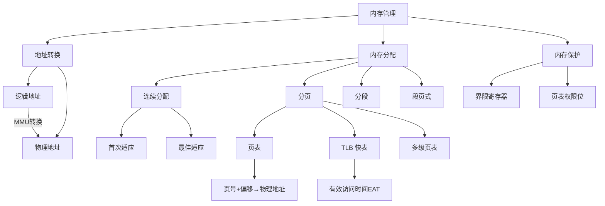

# 408 OS 第三章：内存管理

> 📌 内存管理解决的核心问题是：物理内存有限，多个进程如何安全、高效地共享它？核心技术是**地址映射**（逻辑地址 → 物理地址）和**内存保护**。分页是 408 最重要的手算考点。


## 📋 前置知识

- [[408_OS_ch2_进程线程]] — 需要理解进程的地址空间概念
- [[计算机组成原理]] — 需要了解内存的基本工作原理、寄存器


## 🤔 为什么需要内存管理？

想象一个没有内存管理的系统：程序员写程序时，必须知道自己的程序会被加载到物理内存的哪个地址，还要确保不和其他程序冲突——这几乎不可能做到。

内存管理要解决三个核心问题：

**问题一：地址冲突。** 两个程序都想用地址 0x1000，怎么办？

**问题二：安全隔离。** 进程 A 不能读写进程 B 的内存，否则一个恶意程序可以随意篡改其他程序的数据。

**问题三：内存不够用。** 程序加起来比物理内存大得多，怎么让它们都能运行？（这个问题留给下一篇：[[408_OS_ch3_虚拟内存]]）


## 🧠 核心概念


### 3.1 地址空间：逻辑地址与物理地址

这是理解整个内存管理的基石，必须先搞清楚。

> 🎯 **类比**：你住在一栋大楼里，你的房间门牌是 302（逻辑地址）。但大楼在整个城市里有一个真实的街道地址（物理地址）。"302 房间"在不同的大楼里都存在，但最终映射到城市里的唯一真实位置。操作系统就是那个把"302 房间"翻译成"某街某号某楼 302"的系统。

**逻辑地址（Logical Address）**，也叫虚拟地址：

- 程序编译后使用的地址，从 0 开始编号
- 每个进程都有自己独立的逻辑地址空间（都从 0 开始），互不干扰
- 程序员看到的就是逻辑地址

**物理地址（Physical Address）**：

- 内存条上真实的存储位置（地址总线上的真实地址）
- 整个系统只有一套物理地址空间
- 进程运行时，CPU 最终访问的是物理地址

**地址转换（Address Translation）**：

由**内存管理单元（MMU，Memory Management Unit）** 硬件负责，在程序运行时自动将逻辑地址转换为物理地址。这个过程对程序完全透明。

```
程序运行时：
  CPU 发出逻辑地址  →  MMU 转换  →  物理地址  →  访问内存
```

**地址转换发生的时机**（三种绑定时机）：

| 时机 | 名称 | 时机说明 | 缺点 |
|------|------|----------|------|
| 编译时 | 编译时绑定 | 编译器直接生成物理地址 | 程序只能加载到固定地址，不可重定位 |
| 装入时 | 装入时绑定（静态重定位） | 程序装入内存时一次性转换所有地址 | 装入后不能移动 |
| 运行时 | 运行时绑定（动态重定位） | 每次访问时由 MMU 动态转换 | 需要 MMU 硬件支持，但最灵活 |

> ⚠️ **考点**：现代操作系统采用**运行时绑定**，需要 MMU 硬件支持。这是实现虚拟内存、进程迁移等功能的基础。


### 3.2 连续内存分配

早期操作系统将每个进程放在一段**连续的物理内存**中。

#### 单一连续分配

整个内存分为两区：操作系统区 + 用户区。只有一个用户程序，独占用户区。

- 优点：简单，无需内存保护（只有一个用户进程）
- 缺点：不支持多道程序设计，内存利用率极低

#### 固定分区分配

将内存划分为若干**固定大小的分区**，每个分区装一个进程。

```
| OS | 分区1(128KB) | 分区2(256KB) | 分区3(512KB) | 分区4(1MB) |
```

- 优点：简单，支持多道程序
- 缺点：**内部碎片**——进程比分区小，剩余空间浪费；分区数固定，限制并发进程数

**内部碎片（Internal Fragmentation）**：分区内部未被使用的空间。

#### 动态分区分配（可变分区）

不预先划分分区，按进程需求动态分配大小恰好合适的内存块。

- 优点：没有内部碎片
- 缺点：产生**外部碎片**——多次分配/释放后，空闲内存被分割成很多小块，每块单独都不够用

**外部碎片（External Fragmentation）**：内存中总空闲量足够，但因为不连续而无法分配给某个进程。

**解决外部碎片的方法：紧凑（Compaction）**——定期移动进程，将所有空闲内存合并到一端。代价高昂，需要移动大量数据，且只有运行时绑定的系统才能做。

**动态分区的四种分配算法**（选择题常考）：

| 算法 | 策略 | 优点 | 缺点 |
|------|------|------|------|
| **首次适应（First Fit）** | 找第一个足够大的空闲块 | 速度快，保留大块给未来 | 低地址区碎片多 |
| **最佳适应（Best Fit）** | 找最小的足够大的空闲块 | 减少内存浪费 | 产生很多小碎片，速度慢 |
| **最坏适应（Worst Fit）** | 找最大的空闲块 | 剩余块较大，仍可使用 | 大块很快被用完 |
| **循环首次适应（Next Fit）** | 从上次分配的位置继续找 | 均匀分配，减少低地址碎片 | 大块利用率降低 |

> 💡 **记忆方法**：首次适应综合效果最好，实际系统多用首次适应或其变种。最佳适应听起来好，实则产生最多小碎片，效果往往不如首次适应。


### 3.3 分页存储管理（⭐⭐⭐ 大题必考！）

分页是现代操作系统内存管理的基础，也是 408 最核心的手算考点。

> 🎯 **类比**：把内存想象成一个大型停车场，停车场被均匀划分成一个个标准车位（物理页框）。你的车（进程）不需要停在连续的车位上，可以停在任意空闲的车位。你拿着一张"停车单"（页表），上面记录着你的每个箱子（逻辑页）停在哪个车位（物理页框）。

**基本思想**：

- 把**物理内存**划分为等大的块，称为**页框（Page Frame）**，也叫物理页、帧
- 把**进程的逻辑地址空间**也划分为同样大小的块，称为**页（Page）**，也叫逻辑页
- 每个逻辑页可以映射到任意一个物理页框（不要求连续）
- 通过**页表（Page Table）**记录每个逻辑页对应哪个物理页框

**关键参数**：

- **页大小（Page Size）**：通常为 $2^k$ 字节（如 4KB = $2^{12}$ B），题目一般给出
- **逻辑地址 = 页号 + 页内偏移**
- **物理地址 = 页框号 + 页内偏移**（偏移量不变！）

#### 分页地址转换（⭐ 手算核心！）

**逻辑地址的结构**（关键公式）：

设页大小为 $2^k$ 字节，则逻辑地址中：

- **低 $k$ 位**：页内偏移（offset），范围 $[0, 2^k - 1]$
- **高位**：页号（page number）

$$\text{页号} = \left\lfloor \frac{\text{逻辑地址}}{\text{页大小}} \right\rfloor$$

$$\text{页内偏移} = \text{逻辑地址} \bmod \text{页大小}$$

$$\text{物理地址} = \text{页表}[\text{页号}] \times \text{页大小} + \text{页内偏移}$$

**手算示例**：

已知：逻辑地址 = 3500，页大小 = 1024 B，页表如下：

| 页号 | 页框号 |
|------|--------|
| 0 | 4 |
| 1 | 7 |
| 2 | 2 |
| 3 | 5 |

**第一步：分解逻辑地址**

$$\text{页号} = \lfloor 3500 / 1024 \rfloor = \lfloor 3.417 \rfloor = 3$$

$$\text{页内偏移} = 3500 \bmod 1024 = 3500 - 3 \times 1024 = 428$$

**第二步：查页表**

页号 3 → 页框号 5

**第三步：计算物理地址**

$$\text{物理地址} = 5 \times 1024 + 428 = 5120 + 428 = 5548$$

> ⚠️ **手算技巧**：当页大小是 $2^k$ 时，不要用除法，直接用二进制分割更快！
> - 例：页大小 1KB = $2^{10}$ B，逻辑地址 3500 的二进制是 `0000_1101_1010_1100`
> - 低 10 位 = 偏移 = `01_1010_1100` = 428
> - 高位 = 页号 = `11` = 3
> 直接切割，不用做除法。

**分页的地址转换过程（含页表寄存器）**：

```
1. CPU 发出逻辑地址（页号 p + 偏移 d）
2. MMU 从页表基址寄存器（PTBR）找到当前进程的页表起始位置
3. 访问内存中的页表，取出第 p 项 → 得到物理页框号 f
4. 物理地址 = f × 页大小 + d
5. 访问物理内存
```

注意：步骤 3 需要**一次额外的内存访问**（访问页表），所以没有 TLB 时，每次访存实际需要两次内存访问。


### 3.4 TLB（快表）（⭐ 必考！）

**问题**：每次内存访问都要先访问页表（一次内存访问），再访问数据（又一次内存访问），效率减半。

**解决方案**：TLB（Translation Lookaside Buffer，转换检测缓冲区），也叫**快表**，是一种高速缓存（硬件实现），存放最近使用的页表项。

> 🎯 **类比**：页表是图书馆的大型书目索引（在图书馆某处），TLB 是你随身携带的小笔记本，记了你最近查过的几本书的位置。下次要找同一本书，先看笔记本（快），笔记本没有再去查大索引（慢）。

**TLB 的工作流程**：

```
CPU 发出逻辑地址
    ↓
先查 TLB（极快，纳秒级）
    ├── TLB 命中（Hit）：直接得到物理页框号 → 访问内存（共 1 次内存访问）
    └── TLB 未命中（Miss）：查内存中的页表 → 得到物理页框号 → 同时更新 TLB → 访问内存（共 2 次内存访问）
```

**有效访问时间（EAT，Effective Access Time）**的计算（⭐ 考点！）：

设 TLB 访问时间为 $\alpha$（纳秒），内存访问时间为 $\beta$（纳秒），TLB 命中率为 $h$：

$$\text{EAT} = h \times (\alpha + \beta) + (1 - h) \times (\alpha + 2\beta)$$

化简：

$$\text{EAT} = \alpha + \beta + (1 - h) \times \beta = \alpha + (2 - h) \times \beta$$

**例题**：TLB 访问时间 20ns，内存访问时间 100ns，命中率 90%，求 EAT。

$$\text{EAT} = 0.9 \times (20 + 100) + 0.1 \times (20 + 200) = 108 + 22 = 130 \text{ ns}$$

若没有 TLB，每次访存需要 2 次内存访问 = 200ns。有 TLB 后只需 130ns，性能提升 35%。

> ⚠️ **考点**：TLB 是**硬件**（在 CPU 芯片内），不是软件。每次进程切换时，TLB 必须**清空**（或用 ASID 标记区分进程），否则新进程会用旧进程的 TLB 条目，导致地址转换错误。


### 3.5 多级页表（⭐ 选择题常考）

**问题**：页表本身很大，占用内存多。

例：32 位地址空间，页大小 4KB（$2^{12}$），则页表项数 = $2^{32} / 2^{12} = 2^{20}$ = 1M 个页表项。若每项 4 字节，**每个进程的页表就需要 4MB**。100 个进程就需要 400MB 仅用于存页表，不合理。

**解决方案：多级页表**——把页表本身也分页，只在内存中保留当前需要的页表页，其余换到磁盘。

**两级页表的结构**（以 32 位地址空间、4KB 页为例）：

逻辑地址被分为三段：

$$\underbrace{\text{外层页号（10位）}}_{\text{一级页表索引}} \quad \underbrace{\text{内层页号（10位）}}_{\text{二级页表索引}} \quad \underbrace{\text{页内偏移（12位）}}_{d}$$

**地址转换过程**：

1. 用外层页号查**一级页表**，得到对应二级页表的**物理地址**
2. 用内层页号查**二级页表**，得到物理页框号 $f$
3. 物理地址 = $f \times 4\text{KB} + d$

**两级页表需要 3 次内存访问**（无 TLB 时）：一级页表 + 二级页表 + 数据。有 TLB 时命中则只需 1 次。

**多级页表的优点**：按需分配页表页，节省内存。

**多级页表的缺点**：访问时间增加（级数越多，没有 TLB 时访问次数越多）。

> ⚠️ **考点**：64 位系统通常用 4 级页表（如 x86-64 的 PGD → PUD → PMD → PTE）。试题一般考 32 位两级页表，会给你逻辑地址的分段方式，让你做地址转换。


### 3.6 分段存储管理

**动机**：程序员在写程序时，自然地把程序分为多个逻辑模块：代码段、数据段、堆、栈、共享库……这些模块长度不同，逻辑上也相互独立。分段存储正是为了配合这种**程序的逻辑结构**。

> 🎯 **类比**：分段就像把搬家的物品按类别分箱（书一箱、衣服一箱、厨具一箱），每箱大小不同。搬到新家后，各箱可以放在不同的位置，通过"箱号+箱内位置"来找东西。

**分段的基本思想**：

- 进程的地址空间被划分为若干**大小不等的段**（代码段、数据段、堆段、栈段……）
- 每个段有自己的**段号**和**段内偏移**
- **段表（Segment Table）**：记录每个段的起始物理地址（基址）和段长

**逻辑地址 = （段号, 段内偏移）**

**地址转换**：

$$\text{物理地址} = \text{段表}[\text{段号}].\text{基址} + \text{段内偏移}$$

转换时还需检查：段内偏移 < 段长（否则越界，产生段错误！）

**分页 vs 分段**（⭐ 高频考点！）：

| 对比维度 | 分页 | 分段 |
|----------|------|------|
| **划分依据** | 固定大小（物理角度） | 逻辑模块大小（逻辑角度） |
| **地址结构** | 页号 + 页内偏移 | 段号 + 段内偏移 |
| **碎片** | 内部碎片（最后一页） | 外部碎片 |
| **地址空间** | 一维（一个数字） | 二维（段号 + 偏移） |
| **共享/保护** | 难（按页，不按逻辑） | 容易（按段，对应逻辑模块） |
| **对程序员** | 透明（不可见） | 可见（程序员感知段） |

> 💡 **记忆口诀**：分页是操作系统视角（提高利用率），分段是程序员视角（符合逻辑结构）。


### 3.7 段页式存储管理

**目的**：结合分段（符合逻辑结构、便于共享保护）和分页（消除外部碎片、便于管理）的优点。

**基本思想**：先按段划分，再对每个段内部进行分页。

**地址结构**：

$$\underbrace{\text{段号}}_s \quad \underbrace{\text{段内页号}}_p \quad \underbrace{\text{页内偏移}}_d$$

**地址转换过程**（共需 3 次内存访问，无 TLB 时）：

1. 用段号查**段表**，得到该段的**页表起始地址**
2. 用段内页号查该段的**页表**，得到物理**页框号** $f$
3. 物理地址 = $f \times \text{页大小} + d$

> ⚠️ **考点**：段页式是实际现代 OS（x86 保护模式）的基础机制，但 408 通常以选择题考察概念，大题以纯分页为主。


### 3.8 内存保护

操作系统必须防止进程访问不属于自己的内存，或以不被允许的方式访问（如修改只读代码段）。

**两种保护机制**：

**① 界限寄存器（Base + Limit Registers）**（用于连续分配）：

- **基址寄存器**：存储进程内存的起始物理地址
- **界限寄存器**：存储进程内存的长度
- 每次访存：$\text{基址} \leq \text{物理地址} < \text{基址} + \text{界限}$，否则越界，触发中断

**② 页表/段表中的访问权限位**（用于分页/分段）：

每个页表项或段表项包含权限位：

| 权限位 | 含义 |
|--------|------|
| **有效位（Valid/Present）** | 该页是否在物理内存中（0 = 不在内存，触发缺页中断） |
| **读/写/执行位（R/W/X）** | 是否允许读、写、执行 |
| **用户/内核位（U/K）** | 用户态程序是否能访问 |
| **修改位（Dirty）** | 该页是否被修改过（换出时需不需要写回磁盘） |
| **访问位（Accessed/Reference）** | 该页最近是否被访问（用于 LRU 近似算法） |


### 3.9 内存共享

分页使得内存共享变得简单：只需让不同进程的页表项**指向同一个物理页框**即可。

**代码共享**：只读的程序代码可以被多个进程共享（如共享库 `libc.so`）。每个进程的页表中，代码段的页表项指向同一块物理内存，节省大量内存。

**写时复制（Copy-On-Write，COW）**：`fork()` 创建子进程时，不立刻复制父进程的内存，而是让父子进程共享同一块物理页（标记为只读）。当任一进程尝试**写入**时，才真正复制那一页，保证各自独立。

这是 Linux `fork()` 的核心优化，避免了不必要的内存复制。


## ⚠️ 常见误区与踩坑点

> ❌ **误区 1：分页就不会有碎片**
> 分页只消除了**外部碎片**（页可以分散放置），但存在**内部碎片**——每个进程的最后一页通常装不满，浪费了一部分（最多浪费 1 页大小 - 1 字节）。

> ❌ **误区 2：逻辑地址就是偏移量**
> 逻辑地址是完整的地址（包含页号部分），不只是偏移。页内偏移是逻辑地址的低若干位，不是逻辑地址本身。

> ⚠️ **踩坑 3：地址转换手算时页框号和页号混淆**
> 页表存的是**页框号**（物理页），不是逻辑页号。页号是索引，页框号是值。物理地址 = 页框号 × 页大小 + 偏移，不是页号 × 页大小。

> ⚠️ **踩坑 4：TLB 命中率考题中的时间计算**
> EAT 公式中，TLB 访问时间 $\alpha$ 无论命中与否都要花（先查 TLB 才知道有没有命中）。很多同学忘记把 $\alpha$ 加进去。

> ❌ **误区 5：多级页表减少了总的页表项数**
> 多级页表不减少页表项总数，减少的是**当前需要在内存中保存的页表项数**。一级页表必须常驻内存，但二级页表可以按需换入换出。

> ⚠️ **踩坑 6：分段的地址转换忘记检查越界**
> 分段地址转换时，必须先检查段内偏移是否小于段长，才能计算物理地址。越界 → 产生段错误（Segmentation Fault），这也是 C 程序常见的"段错误"崩溃的根本原因。


## 🔄 连续分配 vs 分页 vs 分段 vs 段页式

| 特性 | 连续分配 | 分页 | 分段 | 段页式 |
|------|----------|------|------|--------|
| 碎片类型 | 外部碎片 | 内部碎片 | 外部碎片 | 内部碎片 |
| 逻辑地址空间 | 一维 | 一维 | 二维 | 二维 |
| 内存利用率 | 低 | 高 | 中 | 高 |
| 共享与保护 | 困难 | 较难 | 容易 | 容易 |
| 实现复杂度 | 简单 | 中等 | 中等 | 复杂 |
| 是否支持虚拟内存 | 否 | 是 | 是 | 是 |


## 🏋️ 动手练习

### 练习 1：分页地址转换（⭐⭐ 难度）

**题目**：系统页大小为 512B，进程页表如下：

| 页号 | 页框号 |
|------|--------|
| 0 | 3 |
| 1 | 6 |
| 2 | 1 |
| 3 | 8 |

将以下逻辑地址转换为物理地址：(a) 1023，(b) 1024，(c) 2500

**参考答案**：

页大小 = 512 = $2^9$，低 9 位为偏移，高位为页号。

**(a) 逻辑地址 = 1023**

$$\text{页号} = \lfloor 1023 / 512 \rfloor = 1, \quad \text{偏移} = 1023 \bmod 512 = 511$$

页号 1 → 页框号 6

$$\text{物理地址} = 6 \times 512 + 511 = 3072 + 511 = 3583$$

**(b) 逻辑地址 = 1024**

$$\text{页号} = \lfloor 1024 / 512 \rfloor = 2, \quad \text{偏移} = 0$$

页号 2 → 页框号 1

$$\text{物理地址} = 1 \times 512 + 0 = 512$$

**(c) 逻辑地址 = 2500**

$$\text{页号} = \lfloor 2500 / 512 \rfloor = 4$$

页号 4 不在页表中（页表只有 0-3），**越界！产生地址越界中断**。


### 练习 2：TLB 有效访问时间计算（⭐ 难度）

**题目**：内存访问时间 200ns，TLB 访问时间 10ns，TLB 命中率 95%。
(a) 计算有效访问时间 EAT。
(b) 若没有 TLB，访问时间是多少？
(c) TLB 使性能提升了多少百分比？

**参考答案**：

**(a)** 设 $h = 0.95$，$\alpha = 10\text{ns}$，$\beta = 200\text{ns}$：

$$\text{EAT} = h(\alpha + \beta) + (1-h)(\alpha + 2\beta)$$

$$= 0.95 \times (10 + 200) + 0.05 \times (10 + 400)$$

$$= 0.95 \times 210 + 0.05 \times 410 = 199.5 + 20.5 = 220 \text{ ns}$$

**(b)** 没有 TLB：每次访存 = 访问页表（200ns）+ 访问数据（200ns）= **400ns**

**(c)** 性能提升：

$$\frac{400 - 220}{400} \times 100\% = 45\%$$


### 练习 3：分页 vs 分段辨析（⭐ 难度）

**题目**：下列说法正确的是（）

A. 分页存储管理中，页的大小由用户决定

B. 分段存储管理中，段的长度可以动态增长

C. 分页存储管理会产生外部碎片，但不产生内部碎片

D. 分段存储管理的地址是二维的（段号 + 偏移），而分页管理的地址是一维的

**参考答案**：**B 和 D** 均正确（若单选，选 D）

- A 错误：页的大小由**操作系统和硬件**决定（通常 4KB），不由用户决定
- B 正确：段可以动态增长（如堆段、栈段），只要有空间
- C 错误：分页**有**内部碎片（最后一页未填满），**没有**外部碎片（C 说反了）
- D 正确：分段地址空间是二维的（需要段号和段内偏移），分页是一维的（连续编号）


## 📝 总结

### 本章要点回顾

1. **逻辑地址 vs 物理地址**：程序使用逻辑地址，MMU 硬件在运行时将其转换为物理地址。每个进程的逻辑地址空间独立，都从 0 开始。

2. **分页的核心**：物理内存 = 等大页框，逻辑空间 = 等大页，通过页表做映射。地址转换：物理地址 = 页表[页号] × 页大小 + 偏移。消除外部碎片，存在内部碎片。

3. **TLB**：缓存最近的页表项，将页表访问从内存访问降低到硬件缓存访问，极大提升地址转换效率。EAT = $h(\alpha+\beta) + (1-h)(\alpha+2\beta)$。

4. **多级页表**：对页表本身也分页，节省页表占用的内存，代价是增加访存次数。

5. **分段**：按程序逻辑结构（代码、数据、堆、栈）划分大小不等的段，便于共享和保护，但有外部碎片。

6. **段页式**：先分段再分页，综合两者优点，是现代 x86 系统的基础。

### 知识图谱




## 🔗 相关链接

- 上一章：[[408_OS_ch2_调度算法]]
- 本章续篇：[[408_OS_ch3_虚拟内存]]
- 下一大章：[[408_OS_ch4_文件系统]]


## 📚 参考资料

- 汤子瀛《操作系统（第四版）》第四章 — 存储器管理
- 王道考研《操作系统》内存管理专题 — 地址转换与 TLB 真题
- [小林 coding 内存管理](https://xiaolincoding.com/os/3_memory/vmem.html) — 图解分页机制
