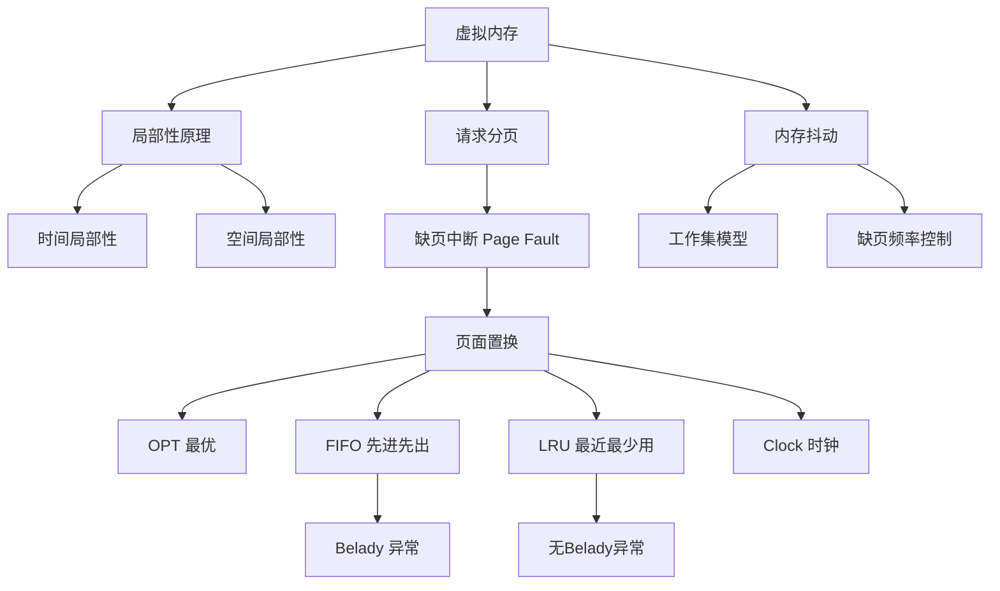

# 408 OS 第三章：虚拟内存

> 📌 虚拟内存让每个进程"以为"自己拥有完整的、巨大的地址空间，实际上只有当前需要的部分在物理内存中。缺页中断触发换页，页面置换算法决定换出哪一页——这是 408 大题的手算核心。


## 📋 前置知识

- [[408_OS_ch3_内存管理]] — 必须先理解分页、页表、页框的概念
- [[408_OS_ch2_进程线程]] — 需要理解进程地址空间


## 🤔 虚拟内存解决什么问题？

前一篇讨论的内存分配，有一个隐含假设：程序运行前必须**全部加载到内存**。但这带来两个问题：

**问题一：程序比内存大怎么办？** 一个 8GB 的游戏没法全装进 4GB 内存。

**问题二：大量内存被浪费。** 程序有很多代码（错误处理、不常用功能）在一次运行中根本不会用到，却占着宝贵的内存空间。

**局部性原理（Principle of Locality）** 给出了解决方案的理论基础：

> 🎯 **类比**：你在图书馆写论文，不需要把所有参考书都搬到你的座位上。你只把**当前翻看的几本书**放在桌上（工作集），其他的留在书架（磁盘）。要用某本书时，去书架取回来；桌上放不下了，把不常用的书还回书架。

- **时间局部性**：刚访问过的数据，不久后很可能再次访问（如循环体内的变量）
- **空间局部性**：访问某个地址后，其附近地址也很可能被访问（如数组的顺序访问）

**基于局部性原理**，只需把进程当前"活跃"的那些页装入内存，其他的放在磁盘上，按需换入——这就是**虚拟内存**的核心思想。


## 🧠 核心概念


### 3.10 虚拟内存的工作原理

**虚拟内存的实现**（以请求分页为主，408 考纲）：

在分页的基础上，为每个页表项增加几个控制位：

| 控制位 | 名称 | 含义 |
|--------|------|------|
| **P（Present/Valid）** | 有效位/存在位 | 1 = 该页在物理内存；0 = 该页不在内存（在磁盘上） |
| **D（Dirty/Modified）** | 修改位 | 1 = 该页被修改过，换出时需写回磁盘 |
| **A（Accessed/Reference）** | 访问位 | 1 = 最近被访问过（用于 LRU 近似） |
| **R/W/X** | 权限位 | 可读/可写/可执行 |

**请求分页（Demand Paging）的工作流程**：

```
CPU 发出逻辑地址
    ↓
MMU 查页表
    ├── 有效位 P = 1（页在内存中）→ 正常转换，访问数据
    └── 有效位 P = 0（页不在内存）→ 触发缺页中断（Page Fault）
                                         ↓
                               操作系统处理缺页中断
                               （将所需页从磁盘读入内存）
                                         ↓
                               更新页表（P = 1，填入页框号）
                                         ↓
                               重新执行触发缺页的指令
```


### 3.11 缺页中断处理（⭐ 必考！）

**缺页中断（Page Fault）** 是一种特殊的中断（内中断/异常），由 MMU 在发现有效位为 0 时触发。

**缺页中断处理的完整步骤**：

1. **保存 CPU 现场**（保存寄存器、程序计数器等，以便后续恢复）
2. **确定缺页**：操作系统分析中断信息，确认是缺页而非非法访问
3. **找到磁盘上的页**：从页表中找到该页在磁盘上的位置（页表项存有磁盘地址）
4. **分配空闲页框**：
   - 若有空闲页框 → 直接使用
   - 若无空闲页框 → 运行**页面置换算法**，选择一个页框换出
     - 若被换出页的修改位 D=1 → 先写回磁盘（脏页），再使用该页框
     - 若 D=0 → 直接使用（磁盘上已有最新版本）
5. **从磁盘读取所需页**到分配的页框（磁盘 I/O，这一步最慢！）
6. **更新页表**：填入物理页框号，设置有效位 P=1
7. **恢复进程**：从步骤 1 恢复 CPU 现场，**重新执行**引发缺页的那条指令

> ⚠️ **关键点**：缺页中断处理完成后，CPU **重新执行**（Restart）引发缺页的那条指令，不是执行下一条。因为那条指令之前没有成功完成（数据不在内存里），必须再来一次。

**缺页率（Page Fault Rate）**：

$$p = \frac{\text{缺页次数}}{\text{总访问次数}}$$

**有效访问时间（含缺页）**：

$$\text{EAT} = (1-p) \times t_\text{内存} + p \times t_\text{缺页处理}$$

其中 $t_\text{缺页处理}$ 包括：磁盘 I/O 时间（主要）+ 中断处理时间 + 重启指令时间。

磁盘访问时间约为内存访问时间的 10 万倍，所以缺页率必须极低（< 0.1%）才能保证性能。


### 3.12 页面置换算法（⭐⭐⭐ 大题必考！）

当内存中没有空闲页框时，需要选择一个页面换出，为新页腾地方。**选哪个页面换出**，就是页面置换算法要解决的问题。

**手算方法**：给定内存帧数（Frame Count）和页面访问序列（Reference String），模拟每个算法，统计**缺页次数**。

**约定**：页面第一次装入时也算一次缺页。

#### 算法一：OPT（最优置换算法）

**策略**：置换**未来最长时间内不会被访问**的页面。

**特点**：

- 缺页次数最少（理论最优）
- **不可实现**（需要预知未来的访问序列）
- 作为其他算法的比较基准

**手算示例**：

访问序列：7 0 1 2 0 3 0 4 2 3 0 3 2 1 2 0 1 7 0 1

内存帧数 = 3

| 访问 | 帧1 | 帧2 | 帧3 | 缺页？ |
|------|-----|-----|-----|--------|
| 7 | 7 | - | - | ✅ |
| 0 | 7 | 0 | - | ✅ |
| 1 | 7 | 0 | 1 | ✅ |
| 2 | **2** | 0 | 1 | ✅（换出7，7下次在第17步才用） |
| 0 | 2 | 0 | 1 | — |
| 3 | 2 | 0 | **3** | ✅（换出1，1下次在第13步；2在第8步；0在第10步；1最远） |
| 0 | 2 | 0 | 3 | — |
| 4 | **4** | 0 | 3 | ✅（换出2，2在第8步；0在第10步；3在第9步；2最近）→ 换出3更好（3下次在第9步，2下次在第8步，0下次在第10步，0最远）→ 换出0？ 重新看：下次访问：2→第8步，0→第10步，3→第9步，换出0 |

> ⚠️ OPT 手算容易出错，关键是找每个在内存中的页，**下次访问时在哪个位置**，选最远的换出。

#### 算法二：FIFO（先进先出置换算法）

**策略**：置换**最先进入内存**的页面（内存中待得最久的页面）。

**特点**：

- 实现简单（维护一个队列，先进先出）
- 性能较差，可能换出常用的页
- 存在 **Belady 异常**：增加帧数，缺页次数反而增多（反直觉！）

**手算示例**：

访问序列：1 2 3 4 1 2 5 1 2 3 4 5，内存帧数 = 3

维护一个队列，队头是最早进入的（待换出的）：

| 步骤 | 访问 | 帧（队列顺序：旧→新） | 缺页？ |
|------|------|----------------------|--------|
| 1 | 1 | [1] | ✅ |
| 2 | 2 | [1,2] | ✅ |
| 3 | 3 | [1,2,3] | ✅ |
| 4 | 4 | [2,3,4]（换出1） | ✅ |
| 5 | 1 | [3,4,1]（换出2） | ✅ |
| 6 | 2 | [4,1,2]（换出3） | ✅ |
| 7 | 5 | [1,2,5]（换出4） | ✅ |
| 8 | 1 | [1,2,5] | — |
| 9 | 2 | [1,2,5] | — |
| 10 | 3 | [2,5,3]（换出1） | ✅ |
| 11 | 4 | [5,3,4]（换出2） | ✅ |
| 12 | 5 | [5,3,4] | — |

缺页次数 = 9

**Belady 异常演示**（帧数从 3 增到 4，缺页次数反而增加）：

访问序列：1 2 3 4 1 2 5 1 2 3 4 5

- 帧数 = 3：缺页 9 次
- 帧数 = 4：使用上面同样序列，可验证缺页 10 次（反而多了！）

> ⚠️ **Belady 异常只会出现在 FIFO 中**，OPT 和 LRU 不会出现（它们是"栈算法"，具有栈特性：帧数增加，缺页次数不会增多）。这是 408 选择题的高频考点。

#### 算法三：LRU（最近最少使用置换算法）

**策略**：置换**最近最长时间未被访问**的页面（用过去预测未来，基于时间局部性）。

**特点**：

- 性能接近 OPT（实践中效果很好）
- 实现代价高：需要记录每个页最后一次访问的时间，硬件实现复杂
- **不会出现 Belady 异常**（栈算法）

**手算方法**：每次缺页时，在当前内存中的页里找**最近最久未用的**换出。

**手算示例**：

访问序列：1 2 3 4 1 2 5 1 2 3 4 5，内存帧数 = 3

关键：每次访问后，维护一个"最近使用顺序"（最近的在右边）：

| 步骤 | 访问 | 帧内容（左=最久未用） | 缺页？ |
|------|------|-----------------------|--------|
| 1 | 1 | [1] | ✅ |
| 2 | 2 | [1,2] | ✅ |
| 3 | 3 | [1,2,3] | ✅ |
| 4 | 4 | [2,3,4]（换出1，最久未用） | ✅ |
| 5 | 1 | [3,4,1]（换出2） | ✅ |
| 6 | 2 | [4,1,2]（换出3） | ✅ |
| 7 | 5 | [1,2,5]（换出4） | ✅ |
| 8 | 1 | [2,5,1]（1移到最近） | — |
| 9 | 2 | [5,1,2]（2移到最近） | — |
| 10 | 3 | [1,2,3]（换出5） | ✅ |
| 11 | 4 | [2,3,4]（换出1） | ✅ |
| 12 | 5 | [3,4,5]（换出2） | ✅ |

缺页次数 = 10（比 FIFO 多？这个特定序列如此，LRU 并不总优于 FIFO，但平均性能更好）

**LRU 的实现方式**：

| 实现方式 | 原理 | 开销 |
|----------|------|------|
| **计数器** | 每个页表项有时间戳，每次访问更新 | 每次访存都要更新，且找最小值要扫描全表 |
| **栈** | 维护一个页号栈，每次访问将页号移到栈顶，栈底是最久未用 | 每次访问都要移动栈节点 |
| **近似 LRU（Clock 算法）** | 用访问位近似替代精确时间戳 | 开销小，实际系统多用此方案 |

#### 算法四：Clock 算法（时钟置换算法 / NRU）

**策略**：LRU 的近似实现，用**访问位**来近似判断"最近最少使用"。

**结构**：所有内存页框组成一个循环链表，用一个指针像时钟的表盘一样转动。

**每个页框有一个访问位 R**：
- 页被访问时，硬件自动将 R 置 1
- 操作系统定期（或置换时）检查 R

**置换规则**：

```
遍历时钟链表：
    指针指向的页的 R = 0 → 该页"最近未用"→ 选中换出，指针前移
    指针指向的页的 R = 1 → 将 R 清 0，指针前移（给它一次机会）
继续遍历，直到找到 R=0 的页
```

**直觉**：R=1 说明最近访问过，给它一次"翻牌机会"，清零 R 后指针继续转。转了一圈后，那些没有被再次访问的页 R 仍为 0，就是候选换出页。

**增强版 Clock（考虑修改位 D）**：

优先级排序（优先换出排名靠前的）：

| 优先级 | 访问位 R | 修改位 D | 说明 |
|--------|----------|----------|------|
| 1（最先换出） | 0 | 0 | 最近未访问，未修改，换出无需写磁盘 |
| 2 | 0 | 1 | 最近未访问，但修改过，换出需写磁盘 |
| 3 | 1 | 0 | 最近访问过，未修改 |
| 4（最后换出） | 1 | 1 | 最近访问过，且修改过 |


### 3.13 工作集与内存抖动（Thrashing）（⭐ 考点！）

#### 工作集（Working Set）

**工作集**是进程在某段时间窗口内实际使用的页面集合。工作集的大小反映了进程对内存的"真实需求"。

如果分配给进程的帧数少于其工作集大小，进程将频繁发生缺页。

#### 内存抖动（Thrashing）

> 🎯 **类比**：图书馆的桌子（内存帧）只能放 3 本书，但你同时参考的书有 10 本。你不得不一直从书架上取书、放回书架，真正看书的时间反而很少——这就是抖动。

**抖动的成因**：

当多道程序度（并发进程数）过高时：

1. 每个进程分配到的内存帧数不足，工作集装不下
2. 每个进程频繁产生缺页，大量时间在做磁盘 I/O
3. 进程大部分时间阻塞（等 I/O），CPU 利用率下降
4. 操作系统发现 CPU 闲置，认为可以再增加更多进程
5. 更多进程 → 每个进程帧数更少 → 缺页更频繁 → CPU 利用率进一步下降
6. 恶性循环！

**抖动的表现**：CPU 利用率极低，但磁盘 I/O 极高，系统整体停滞。

**预防/解决抖动的方法**：

| 方法 | 原理 |
|------|------|
| **工作集模型** | 监控每个进程的工作集大小，确保每个进程分配的帧数 ≥ 工作集大小 |
| **缺页频率（PFF）控制** | 监控进程的缺页率：缺页率过高 → 增加帧数；缺页率过低 → 减少帧数 |
| **降低多道程序度** | 将部分进程换出内存（挂起），给剩余进程更多帧数 |


### 3.14 页面分配策略

操作系统需要决定给每个进程分配多少内存帧：

**固定分配（Fixed Allocation）**：进程创建时分配固定数量的帧，运行中不变。

**可变分配（Variable Allocation）**：根据进程的缺页率动态调整帧数。

**局部置换（Local Replacement）**：进程缺页时，只能从**自己**的帧中选一个换出。

**全局置换（Global Replacement）**：进程缺页时，可以从**所有进程**的帧中选一个换出（包括其他进程的帧）。

> ⚠️ **考点**：全局置换 + 可变分配是实际系统常用组合（如 Linux），允许进程动态获取或失去帧，整体效率更高，但某个进程可能"抢走"其他进程的帧，影响其他进程性能。


### 3.15 请求分段与请求段页式（简要了解）

- **请求分段**：在分段基础上实现虚拟内存，以段为单位进行换入换出
- **请求段页式**：在段页式基础上实现虚拟内存，以页为单位换入换出

408 考纲以**请求分页**为主，分段和段页式的虚拟内存以概念理解为主。


## ⚠️ 常见误区与踩坑点

> ❌ **误区 1：缺页中断是外部中断（I/O 中断）**
> 缺页中断是由 CPU 内部的 MMU 触发的，属于**内部中断（异常/故障 Fault）**，不是外部 I/O 中断。处理完缺页后，CPU **重新执行**引发缺页的指令（这是 Fault 类型异常的特征）。

> ❌ **误区 2：Belady 异常说明 FIFO 一定比 LRU 差**
> Belady 异常只是说 FIFO 在某些序列下，增加帧数会增加缺页次数——这是 FIFO 的理论缺陷，不代表 FIFO 在所有情况下缺页次数都多于 LRU。

> ⚠️ **踩坑 3：LRU 手算时维护"最近使用顺序"容易出错**
> LRU 手算时，每次访问都要更新页在"最近使用顺序"中的位置（命中的页移到最近端）。很多同学只在缺页时更新，忘记命中时也要更新顺序，导致后续判断错误。

> ⚠️ **踩坑 4：换出修改过的页（脏页）需要写磁盘**
> 手算页面置换时，考题有时会问"换出过程中共发生几次磁盘 I/O"。换入一个页 = 1 次 I/O（读），但若被换出的页是脏页（修改位 D=1），还需要 1 次写 I/O。共 2 次 I/O。

> ❌ **误区 5：虚拟内存 = 磁盘当内存用**
> 虚拟内存的本质是地址空间的抽象，磁盘只是存放"暂时不用的页"的地方。虚拟内存的大小由地址空间决定（如 32 位系统 4GB），不是由磁盘大小决定。


## 🔄 各置换算法对比

| 算法 | 策略 | 缺页率 | 实现复杂度 | Belady 异常 | 实际应用 |
|------|------|--------|------------|-------------|---------|
| **OPT** | 换最久不用的 | 最低（理论最优） | 不可实现 | 无 | 仅用于比较 |
| **FIFO** | 换最早进入的 | 较高 | 简单 | **有** | 很少单独使用 |
| **LRU** | 换最久未访问的 | 接近 OPT | 复杂（需记时间戳） | 无 | 理论常用，实现用近似 |
| **Clock** | LRU 近似（访问位） | 中等 | 中等 | 无 | 实际系统广泛使用 |
| **增强 Clock** | 访问位 + 修改位 | 较低 | 稍复杂 | 无 | Linux 等现代 OS |


## 🏋️ 动手练习

### 练习 1：OPT 手算（⭐⭐ 难度）

**题目**：访问序列为 2 3 2 1 5 2 4 5 3 2 5 2，内存帧数 = 3，用 OPT 算法，计算缺页次数。

**参考答案**：

| 步骤 | 访问 | 帧（内存内容） | 缺页 | 换出决策 |
|------|------|---------------|------|---------|
| 1 | 2 | {2} | ✅ | — |
| 2 | 3 | {2,3} | ✅ | — |
| 3 | 2 | {2,3} | — | — |
| 4 | 1 | {2,3,1} | ✅ | — |
| 5 | 5 | {2,5,1} | ✅ | 换出3（3下次在步骤8出现；1下次在无；5下次在步骤7）→ 3和1都不再出现（1不再），换出1最合适，再看：3在步骤8，5在步骤7，1之后不出现→ 换出1 |
| 6 | 2 | {2,5,1} | — | — |

重新做（更仔细）：

| 步骤 | 访问 | 帧 | 缺页 | 说明 |
|------|------|----|------|------|
| 1 | 2 | {2,-,-} | ✅ | |
| 2 | 3 | {2,3,-} | ✅ | |
| 3 | 2 | {2,3,-} | — | 命中 |
| 4 | 1 | {2,3,1} | ✅ | |
| 5 | 5 | {2,5,1} | ✅ | 2下次→步骤6，3下次→步骤9，1后续不再出现。换出1（最远/永不使用）|
| 6 | 2 | {2,5,1} | — | 命中 |
| 7 | 4 | {4,5,2} | ✅ | 2下次→步骤9（？），5下次→步骤8，1不在内存→ 内存有{2,5,1}，步骤7访问4，2下次→步骤9，5下次→步骤8，1不再→ 换出1（不再使用）|

重新整理（内存始终是3帧）：

| 步骤 | 访问 | 帧1 | 帧2 | 帧3 | 缺页 |
|------|------|-----|-----|-----|------|
| 1 | 2 | 2 | — | — | ✅ |
| 2 | 3 | 2 | 3 | — | ✅ |
| 3 | 2 | 2 | 3 | — | — |
| 4 | 1 | 2 | 3 | 1 | ✅ |
| 5 | 5 | 2 | 5 | 1 | ✅（后续：3→步9，1→不再；3和1比，1更远，换3）→ 换3 |
| 6 | 2 | 2 | 5 | 1 | — |
| 7 | 4 | 4 | 5 | 2 | ✅（后续：2→步9，5→步8，1→不再；换1；但帧里是{2,5,1}→换1）|
| 8 | 5 | 4 | 5 | 2 | — |
| 9 | 3 | 4 | 3 | 2 | ✅（后续：2→步10，5→步11，4→不再；换4）|
| 10 | 2 | 4 | 3 | 2 | — |
| 11 | 5 | 5 | 3 | 2 | ✅（后续：3→不再，2→步12，5→？不再；换3）|
| 12 | 2 | 5 | 3 | 2 | — |

**缺页次数 = 8**


### 练习 2：FIFO 和 LRU 对比手算（⭐⭐ 难度）

**题目**：访问序列 1 2 3 4 2 1 5 6 2 1，内存帧数 = 3，分别用 FIFO 和 LRU 计算缺页次数。

**参考答案**：

**FIFO**（队列：左=最旧，右=最新）：

| 步骤 | 访问 | 队列 | 缺页 |
|------|------|------|------|
| 1 | 1 | [1] | ✅ |
| 2 | 2 | [1,2] | ✅ |
| 3 | 3 | [1,2,3] | ✅ |
| 4 | 4 | [2,3,4] | ✅（换1）|
| 5 | 2 | [2,3,4] | — |
| 6 | 1 | [3,4,1] | ✅（换2）|
| 7 | 5 | [4,1,5] | ✅（换3）|
| 8 | 6 | [1,5,6] | ✅（换4）|
| 9 | 2 | [5,6,2] | ✅（换1）|
| 10 | 1 | [6,2,1] | ✅（换5）|

FIFO 缺页次数 = **9**

**LRU**（左=最久未用，右=最近使用）：

| 步骤 | 访问 | 帧（顺序）| 缺页 |
|------|------|-----------|------|
| 1 | 1 | [1] | ✅ |
| 2 | 2 | [1,2] | ✅ |
| 3 | 3 | [1,2,3] | ✅ |
| 4 | 4 | [2,3,4] | ✅（换出最久未用的1）|
| 5 | 2 | [3,4,2] | —（2命中，移到最近）|
| 6 | 1 | [4,2,1] | ✅（换出3）|
| 7 | 5 | [2,1,5] | ✅（换出4）|
| 8 | 6 | [1,5,6] | ✅（换出2）|
| 9 | 2 | [5,6,2] | ✅（换出1）|
| 10 | 1 | [6,2,1] | ✅（换出5）|

LRU 缺页次数 = **9**（本例 LRU 和 FIFO 相同，这是特例）


### 练习 3：Belady 异常验证（⭐⭐ 难度）

**题目**：用 FIFO 算法，访问序列 1 2 3 4 1 2 5 1 2 3 4 5，分别计算帧数 = 3 和帧数 = 4 时的缺页次数，验证 Belady 异常。

**参考答案**：

**帧数 = 3**（队列：左旧右新）：

| 步骤 | 访问 | 队列 | 缺页 |
|------|------|------|------|
| 1 | 1 | [1] | ✅ |
| 2 | 2 | [1,2] | ✅ |
| 3 | 3 | [1,2,3] | ✅ |
| 4 | 4 | [2,3,4] | ✅ |
| 5 | 1 | [3,4,1] | ✅ |
| 6 | 2 | [4,1,2] | ✅ |
| 7 | 5 | [1,2,5] | ✅ |
| 8 | 1 | [1,2,5] | — |
| 9 | 2 | [1,2,5] | — |
| 10 | 3 | [2,5,3] | ✅ |
| 11 | 4 | [5,3,4] | ✅ |
| 12 | 5 | [5,3,4] | — |

帧数=3 时缺页次数 = **9**

**帧数 = 4**：

| 步骤 | 访问 | 队列 | 缺页 |
|------|------|------|------|
| 1 | 1 | [1] | ✅ |
| 2 | 2 | [1,2] | ✅ |
| 3 | 3 | [1,2,3] | ✅ |
| 4 | 4 | [1,2,3,4] | ✅ |
| 5 | 1 | [1,2,3,4] | — |
| 6 | 2 | [1,2,3,4] | — |
| 7 | 5 | [2,3,4,5] | ✅（换出1）|
| 8 | 1 | [3,4,5,1] | ✅（换出2）|
| 9 | 2 | [4,5,1,2] | ✅（换出3）|
| 10 | 3 | [5,1,2,3] | ✅（换出4）|
| 11 | 4 | [1,2,3,4] | ✅（换出5）|
| 12 | 5 | [2,3,4,5] | ✅（换出1）|

帧数=4 时缺页次数 = **10**

**结论**：帧数从 3 增到 4，缺页次数从 9 增到 10——**Belady 异常得证！** 这证明了 FIFO 不是栈算法，增加帧数不保证性能提升。


## 📝 总结

### 本章要点回顾

1. **虚拟内存的原理**：基于局部性原理，进程只把当前活跃的页放在物理内存，其余放磁盘。页表中有效位（P 位）区分页是否在内存，P=0 触发缺页中断。

2. **缺页中断处理**：保存现场 → 找磁盘上的页 → 选空闲帧或置换 → 读入磁盘页 → 更新页表 → **重新执行**引发缺页的指令（Fault 型，重做！）。

3. **四种置换算法**：
   - OPT：最优，不可实现，作为基准
   - FIFO：最简单，有 Belady 异常
   - LRU：性能好，实现复杂
   - Clock：LRU 近似，实际系统使用

4. **Belady 异常**：FIFO 独有，增加帧数可能缺页次数增多。LRU 和 OPT 不会发生（栈算法）。

5. **内存抖动**：多道程序度过高，每个进程帧数不足工作集大小，导致频繁缺页，CPU 利用率极低。解决：降低多道程序度，或用工作集/PFF 控制帧分配。

### 知识图谱




## 🔗 相关链接

- 上一篇：[[408_OS_ch3_内存管理]]
- 下一章：[[408_OS_ch4_文件系统]]
- 回顾总览：[[408_OS_overview]]


## 📚 参考资料

- 汤子瀛《操作系统（第四版）》第五章 — 虚拟存储器
- 王道考研《操作系统》虚拟内存专题 — 置换算法手算真题
- [小林 coding 虚拟内存](https://xiaolincoding.com/os/3_memory/vmem.html) — 图解缺页中断
