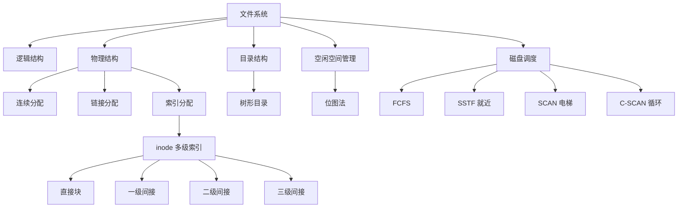

# 408 OS 第四章：文件系统与磁盘调度

> 📌 文件系统解决数据的**持久存储**问题——如何组织、检索和保护磁盘上的文件。磁盘调度决定磁头按什么顺序移动以减少寻道时间，是 408 大题的手算考点。


## 📋 前置知识

- [[408_OS_ch3_内存管理]] — 理解存储层次结构
- [[408_OS_ch2_进程线程]] — 理解进程对文件的访问方式


## 🧠 核心概念


### 4.1 文件系统的基本概念

> 🎯 **类比**：磁盘就像一个仓库，文件系统就是仓库的**货架管理系统**——决定每件货物（文件）放在哪个货架（磁盘块），怎么快速找到（目录），谁有权取用（访问控制）。

**文件（File）**：具有文件名的一组相关信息的集合，是磁盘存储的基本单位。

**文件系统的功能**：

| 功能 | 说明 |
|------|------|
| 文件管理 | 文件的创建、删除、读写、重命名 |
| 目录管理 | 维护目录（文件名 → 文件位置的映射） |
| 存储空间管理 | 磁盘块的分配与回收 |
| 文件共享与保护 | 多进程共享文件，访问权限控制 |


### 4.2 文件的逻辑结构

逻辑结构是用户和程序员看到的文件组织方式（与物理存储无关）。

**① 无结构文件（流式文件）**

文件内容是字节流，没有内部结构。操作系统不关心内容的含义，完全由应用程序解析。

- 例子：文本文件（`.txt`）、二进制文件（`.exe`）、图片（`.jpg`）
- 操作系统提供 `read()`、`write()` 等按字节/块读写的接口

**② 有结构文件（记录式文件）**

文件由固定格式的**记录**组成，类似数据库的行。

- **顺序文件**：记录按顺序排列，读写必须顺序进行（如磁带上的文件）
- **随机文件（索引文件）**：每条记录有一个键（key），通过索引快速定位任意记录（类似数据库）

> ⚠️ **408 考点**：408 主要关注物理结构，逻辑结构以概念理解为主。重点在下面的物理结构。


### 4.3 文件的物理结构（⭐ 必考！）

物理结构是文件数据**实际在磁盘上如何存储**的方式。

> 🎯 **类比**：磁盘被划分成等大的**块（Block）**，就像笔记本的一页一页。文件的数据分散在这些块上，物理结构就是这些块的**组织方式**。

#### 连续分配（Contiguous Allocation）

文件的数据存储在**相邻的连续磁盘块**中。

```
| 块0 | 块1 | 块2 | 块3 | 块4 | 块5 | 块6 |
         文件A               文件B
```

- **优点**：顺序读写速度快（磁头不需要移动），支持随机访问（知道起始块号和块号偏移，直接计算）
- **缺点**：产生**外部碎片**；文件大小固定，难以动态扩展；需要提前知道文件大小

**目录项内容**：（起始块号，长度）

**第 $i$ 块的物理块号** = 起始块号 + $i$

#### 链接分配（Linked Allocation）

文件的数据块可以**分散**在磁盘的任意位置，每个块中包含一个**指针**指向下一块。

**① 隐式链接（块内指针）**：每个数据块的末尾存放指向下一块的指针。

```
块 5 → [数据][→块12] → 块 12 → [数据][→块3] → 块 3 → [数据][→NULL]
```

- **优点**：消除外部碎片，文件可以动态增长
- **缺点**：只支持**顺序访问**（不支持随机访问，访问第 $n$ 块必须从头遍历 $n-1$ 个指针）；指针占用存储空间；可靠性差（指针损坏则后续数据全丢）

**② 显式链接（FAT，File Allocation Table）**：

把所有块的指针集中存放在一张**文件分配表（FAT）**中（常驻内存），不放在数据块里。

```
FAT 表（在内存中）：
块号 | 下一块
  5  |  12
  12 |   3
  3  | -1（文件结尾）
```

- **优点**：支持随机访问（在 FAT 中查找第 $n$ 块，$O(n)$，但不需要读磁盘）；可靠性略好
- **缺点**：FAT 表占内存；磁盘越大 FAT 越大（FAT32 的 FAT 可达数百 MB）

#### 索引分配（Indexed Allocation）（⭐ 重点！）

为每个文件创建一个**索引块**，索引块中存放该文件所有数据块的**物理块号**列表。

```
索引块：| 块5 | 块12 | 块3 | 块9 | ...

块5  →  数据
块12 →  数据
块3  →  数据
块9  →  数据
```

- **优点**：支持随机访问（直接查索引块第 $i$ 项），消除外部碎片
- **缺点**：文件很小时，索引块本身就浪费了一个块；大文件需要多级索引

**大文件的多级索引**（Unix inode 结构，⭐⭐ 考点！）：

Unix/Linux 的 inode 采用混合索引，兼顾小文件和大文件：

```
inode 中包含：
  12 个 直接块号（指向数据块，适合小文件）
   1 个 一级间接块（间接块中存放256个数据块号，适合中等文件）
   1 个 二级间接块（间接块→间接块→数据块，适合大文件）
   1 个 三级间接块（间接块→间接块→间接块→数据块，适合超大文件）
```

**设每块大小 1KB，每个块号占 4B（即每个间接块可放 $1024/4 = 256$ 个块号）**：

| 索引方式 | 可访问的数据块数 | 可寻址文件大小 |
|----------|-----------------|---------------|
| 直接块 | 12 块 | $12 \times 1\text{KB} = 12\text{KB}$ |
| 一级间接 | 256 块 | $256 \times 1\text{KB} = 256\text{KB}$ |
| 二级间接 | $256^2$ 块 | $256^2 \times 1\text{KB} = 64\text{MB}$ |
| 三级间接 | $256^3$ 块 | $256^3 \times 1\text{KB} = 16\text{GB}$ |

**手算考题**：给定逻辑块号（文件内第几块），求需要几次磁盘访问。

**例**：块大小 1KB，每块号 4B，直接块 12 个，inode 在内存中。求访问逻辑块号 270 需几次磁盘访问？

- 直接块：0-11（12块）
- 一级间接：12-267（256块）
- 二级间接：268-（$256^2+267$ 块）

逻辑块 270 在二级间接范围（270 > 267）。

访问路径：读一级间接块（1次）→ 读二级间接块（1次）→ 读数据块（1次）= **3次磁盘访问**

（inode 在内存中，不算磁盘访问）

**三种物理结构对比**：

| 特性 | 连续分配 | 链接分配 | 索引分配 |
|------|----------|----------|----------|
| 顺序访问 | 快 | 慢 | 快 |
| 随机访问 | 快 | 不支持（隐式）/ 慢（显式） | 快 |
| 外部碎片 | 有 | 无 | 无 |
| 文件动态增长 | 难 | 容易 | 容易 |
| 代表系统 | CD-ROM | FAT12/16/32 | Unix/Linux（ext系列） |


### 4.4 文件控制块与 inode

**文件控制块（FCB，File Control Block）**：

操作系统为每个文件维护的数据结构，记录文件的所有元数据（metadata）。

FCB 的内容：

| 类别 | 字段 |
|------|------|
| **基本信息** | 文件名、文件类型、创建/修改时间 |
| **存储信息** | 文件大小、物理位置（起始块号或索引块地址）、存储方式 |
**访问控制信息** | 文件所有者、访问权限（读/写/执行）|
| **使用信息** | 当前被哪些进程打开、引用计数 |

**inode（Index Node）**：

Unix/Linux 系统中 FCB 的实现。**inode 不包含文件名**——文件名存在目录中，inode 只存文件的元数据和数据块地址。

这种设计的优点：一个 inode 可以对应多个文件名（**硬链接**），文件名只是指向 inode 的一个指针。

> ⚠️ **考点**：FCB（inode）和文件名是**分离**的，目录项存的是"文件名 → inode 号"的映射。这是 Unix 文件系统的核心设计理念。


### 4.5 目录结构（⭐ 必考！）

**目录（Directory）** 是一种特殊的文件，内容是文件名到 FCB/inode 号的映射表。

| 目录结构 | 说明 | 缺点 |
|----------|------|------|
| **单级目录** | 全系统只有一个目录，所有文件平铺在一起 | 文件名不能重复；文件多了难以管理 |
| **两级目录** | 一个主目录（每个用户一项）+ 每用户一个子目录 | 不同用户可以有同名文件；但缺乏层次结构 |
| **树形目录** | 多级目录，形成树状结构（现代 OS 使用） | 文件共享不方便（共享文件要在多处建目录项） |
| **有向无环图（DAG）目录** | 在树形基础上允许共享（一个文件可有多个父目录项） | 实现稍复杂（需要引用计数防止误删） |

**路径名**：

- **绝对路径**：从根目录开始的完整路径（如 `/home/user/doc.txt`）
- **相对路径**：从当前工作目录开始（如 `doc.txt` 或 `../parent/file`）

**目录项的查找过程**（以 `/home/karry/notes.md` 为例）：

1. 从根目录 `/` 的 inode 开始
2. 在根目录的数据块中查找 `home` → 得到 `home` 的 inode 号
3. 读取 `home` 的 inode，找到 `home` 目录的数据块
4. 在 `home` 的数据块中查找 `karry` → 得到 `karry` 的 inode 号
5. 类推，最终找到 `notes.md` 的 inode，读取文件数据

路径越深，查找所需磁盘访问次数越多。


### 4.6 文件的空闲空间管理

磁盘上哪些块是空闲的，需要数据结构来记录：

| 方法 | 原理 | 优缺点 |
|------|------|--------|
| **空闲表** | 记录每段连续空闲区的起始块号和长度 | 适合连续分配；碎片多时表很大 |
| **空闲链表** | 所有空闲块通过指针链在一起 | 简单；随机访问空闲块慢 |
| **位图（Bitmap）** | 每个磁盘块对应一个 bit：1=已用，0=空闲 | 大小固定（磁盘大小/8）；查找连续空闲区方便 |
| **成组链接法** | 将空闲块分组，每组首块存该组的块号列表 | Unix 使用；平衡效率和空间 |

> ⚠️ **考点**：位图法是最常考的空闲空间管理方式，简单直观，容易出选择题。


### 4.7 文件访问控制

**访问权限矩阵**：行是用户（或用户组），列是文件，每个单元格记录该用户对该文件的权限。实现代价高（矩阵可能很大）。

**访问控制列表（ACL）**：每个文件维护一个列表，记录哪些用户有哪些权限。Unix 的 `chmod` 设置的就是简化版 ACL（所有者/组/其他人各自的 rwx）。

Unix 权限示例（`-rwxr-xr--`）：

```
- rwx r-x r--
│ │   │   └── 其他用户：只读
│ │   └────── 同组用户：读+执行
│ └────────── 文件所有者：读+写+执行
└──────────── 文件类型（-=普通文件，d=目录）
```


### 4.8 磁盘的物理结构

理解磁盘物理结构是理解磁盘调度的前提。

> 🎯 **类比**：磁盘就像一叠黑胶唱片，每张唱片（盘片）的两面都有同心圆轨道（磁道）。所有盘片上**相同位置的磁道**构成一个柱面。读写头（磁头）在电机带动下在磁道间移动。

**磁盘的访问时间由三部分组成**：

$$T_\text{访问} = T_\text{寻道} + T_\text{旋转} + T_\text{传输}$$

| 时间 | 含义 | 量级 |
|------|------|------|
| **寻道时间（Seek Time）** | 磁头移动到目标磁道 | 毫秒级，最慢！ |
| **旋转延迟（Rotational Latency）** | 等待目标扇区转到磁头下方 | 约为转一圈时间的 1/2 |
| **数据传输时间（Transfer Time）** | 实际读写数据 | 很快 |

**磁盘调度算法的目标：最小化寻道时间**（寻道是最慢的，必须减少磁头移动距离）。


### 4.9 磁盘调度算法（⭐⭐ 大题必考！）

**输入**：当前磁头位置，各请求的磁道号。

**输出**：磁头服务顺序，计算磁头移动的**总磁道数**。

**约定**：磁头移动一个磁道的距离算 1，移动距离 = |目标磁道 - 当前磁道|。

#### 算法一：FCFS（先来先服务）

**策略**：按请求到达的顺序依次服务。

**例题**：磁头在磁道 53，请求队列（到达顺序）：98 183 37 122 14 124 65 67

服务顺序：53 → 98 → 183 → 37 → 122 → 14 → 124 → 65 → 67

总移动距离 = |98-53| + |183-98| + |37-183| + |122-37| + |14-122| + |124-14| + |65-124| + |67-65|

= 45 + 85 + 146 + 85 + 108 + 110 + 59 + 2 = **640**

- 优点：公平，无饥饿
- 缺点：磁头移动无规律，总距离大，效率低


#### 算法二：SSTF（最短寻道时间优先）

**策略**：每次选择**离当前磁头最近**的请求服务。

**例题**（同上，初始磁头 = 53）：

请求队列：{98, 183, 37, 122, 14, 124, 65, 67}

- 53：最近是 65（距离 12）→ 移到 65
- 65：最近是 67（距离 2）→ 移到 67
- 67：最近是 37（距离 30）vs 98（距离 31）→ 移到 37

> 继续按最近选择：37→14→98→122→124→183

服务顺序：53 → 65 → 67 → 37 → 14 → 98 → 122 → 124 → 183

总移动距离 = 12+2+30+23+84+24+2+59 = **236**

- 优点：平均寻道时间大幅减小
- 缺点：**可能饥饿**——如果持续有靠近磁头的请求，远处的请求永远等不到


#### 算法三：SCAN（扫描算法，电梯算法）（⭐⭐ 最重要！）

**策略**：磁头沿**一个方向**移动，服务沿途所有请求，到达最远的请求后**反向**继续扫描。像电梯一样，来回扫描。

**例题**（初始磁头 = 53，假设磁头初始向磁道号增大方向移动，最大磁道 199）：

请求队列：{98, 183, 37, 122, 14, 124, 65, 67}

向高磁道方向扫描：53 → 65 → 67 → 98 → 122 → 124 → 183 → [到头反向]

反向向低磁道：183 → 37 → 14

服务顺序：53 → 65 → 67 → 98 → 122 → 124 → 183 → 37 → 14

总移动距离 = (183-53) + (183-14) = 130 + 169 = **299**

（更简便：从53向右到183，再回到14，= (183-53)+(183-14) = 130+169 = 299）

- 优点：效率较高，公平性好（不会太长饥饿）
- 缺点：两端请求响应较慢（磁头从中间扫到端点，再反向才能服务另一端）


#### 算法四：C-SCAN（循环扫描算法）

**策略**：磁头只**单向**扫描（如从低到高），到达最高磁道后，立即**跳回最低磁道**（不服务返回途中的请求），再继续向高磁道扫描。

**例题**（初始磁头 = 53，向高磁道方向，最大磁道 199，最小磁道 0）：

服务顺序：53 → 65 → 67 → 98 → 122 → 124 → 183 → [跳到0] → 14 → 37

总移动距离 = (183-53) + (199-0) + (37-0) = 130 + 199 + 37 = **366**（含跳回的距离）

> ⚠️ 有些版本把"跳回"不计入移动距离，只计算实际服务的移动：(183-53)+(37-0) = 130+37 = 167。考题会说明是否计入，若无说明，通常计入总距离。

- 优点：各磁道等待时间更均匀（SCAN 靠近反向端的磁道刚服务完马上又来下一轮，而 C-SCAN 每轮都从最低开始）
- 缺点：返回时不服务，利用率略低


#### 磁盘调度算法对比

| 算法 | 策略 | 平均寻道时间 | 饥饿问题 | 特点 |
|------|------|------------|---------|------|
| FCFS | 先来先服务 | 最长 | 无 | 公平但低效 |
| SSTF | 就近服务 | 较短 | 可能 | 效率高，但不公平 |
| SCAN | 电梯扫描 | 中等 | 基本无 | 综合性能好 |
| C-SCAN | 单向循环 | 中等 | 基本无 | 等待时间更均匀 |

> 💡 **记忆口诀**：FCFS 最笨，SSTF 最贪（就近）可能饿死人，SCAN 最常用（实际 OS 多用 SCAN 或 C-SCAN 的变种）。


### 4.10 磁盘格式化与分区

**低级格式化（物理格式化）**：将磁盘划分为扇区（Sector），写入扇区头部信息（地址信息）和纠错码（ECC），出厂前完成。

**磁盘分区（Partition）**：将磁盘划分为若干独立的逻辑区域，每个分区可以安装不同的文件系统。

**高级格式化（逻辑格式化）**：在分区上创建文件系统（建立根目录、位图、FAT 或 inode 表等）。


## ⚠️ 常见误区与踩坑点

> ❌ **误区 1：连续分配没有碎片**
> 连续分配有**外部碎片**（分配和回收后留下的小空洞）。不像分页的内部碎片（页内浪费），连续分配的碎片在已分配区域之外。

> ⚠️ **踩坑 2：索引分配中多级访问次数的计算**
> 每读一个间接块就是一次磁盘访问。二级间接需要：读一级间接块（1次）+ 读二级间接块（1次）+ 读数据块（1次）= 共 3 次。注意 inode 通常假设已在内存（不算），题目若说"inode 在磁盘"则还需再加 1 次。

> ❌ **误区 3：SSTF 和 SCAN 谁的总移动距离一定更短**
> 不一定。SSTF 每次局部最优，但全局可能不优；SCAN 方向固定，移动规律。在某些特定请求队列下，两者各有优劣。

> ⚠️ **踩坑 3：SCAN 手算时确认磁头方向**
> 题目一般会说明磁头初始移动方向（向高磁道还是向低磁道）。若没说明，需要假设并注明。磁头方向不同，服务顺序完全不同。

> ❌ **误区 4：inode 包含文件名**
> Unix inode **不包含文件名**！文件名存在目录的数据块中（目录项 = 文件名 + inode 号）。这也是硬链接能用多个文件名指向同一个文件的原因——多个目录项指向同一个 inode 号。


## 🏋️ 动手练习

### 练习 1：索引结构访问次数计算（⭐⭐ 难度）

**题目**：文件系统磁盘块大小为 512B，块号占 4B，inode 中有 10 个直接块、1 个一级间接块、1 个二级间接块。求：
(a) 每个间接块能存多少个块号？
(b) 一级间接最多支持多大的文件额外大小？
(c) 访问文件逻辑块号 600（从 0 开始计），需要几次磁盘访问？（假设 inode 已在内存）

**参考答案**：

**(a)** 每块 512B，每个块号 4B，每个间接块存放 $512/4 = 128$ 个块号。

**(b)** 一级间接块可额外寻址 $128$ 块 = $128 \times 512\text{B} = 64\text{KB}$。

**(c)** 范围划分：

- 直接块：第 0-9 块（共 10 块）
- 一级间接：第 10-137 块（共 128 块）
- 二级间接：第 138 - $(138 + 128^2 - 1)$ 块（共 $128^2 = 16384$ 块）

逻辑块 600 在二级间接范围（$138 \leq 600 \leq 16521$）。

访问路径：读一级间接块（1次）→ 读对应的二级间接块（1次）→ 读数据块（1次）= **3次磁盘访问**


### 练习 2：SSTF 和 SCAN 手算（⭐⭐ 难度）

**题目**：当前磁头在磁道 100，磁盘磁道范围 0-200，请求队列（按到达顺序）：50 150 80 130 20 170，磁头当前向高磁道方向移动。分别用 SSTF 和 SCAN 计算总移动距离。

**参考答案**：

请求集合：{50, 150, 80, 130, 20, 170}

**SSTF**（从磁道 100 开始，每次找最近）：

- 100 → 80（距离 20）
- 80 → 50（距离 30）
- 50 → 20（距离 30）
- 20 → 130（距离 110）
- 130 → 150（距离 20）
- 150 → 170（距离 20）

总移动距离 = 20+30+30+110+20+20 = **230**

**SCAN**（从 100 向高磁道，先服务高磁道方向）：

向高方向服务：100 → 130 → 150 → 170 → [最大请求 170，反向]

向低方向服务：170 → 80 → 50 → 20

总移动距离 = (170-100) + (170-20) = 70 + 150 = **220**

> 本例 SCAN 比 SSTF 总距离略小，但通常差异不大，关键看请求分布。


## 📝 总结

### 本章要点回顾

1. **文件物理结构**：连续（快速随机访问，有外部碎片）、链接（消除外部碎片，不支持随机访问）、索引（支持随机访问，消除外部碎片，inode 是重点）。

2. **inode 多级索引**：直接块 + 一级间接 + 二级间接 + 三级间接，支持从小文件到超大文件。访问逻辑块号 $n$ 需确定在哪级间接范围，每级间接块各需 1 次磁盘 I/O。

3. **目录结构**：树形目录是现代 OS 标配，inode 不含文件名，文件名存在目录项中。

4. **磁盘调度**：目标是减少寻道时间。FCFS 公平低效，SSTF 就近可能饥饿，SCAN（电梯）综合最优，C-SCAN 等待时间更均匀。

### 知识图谱




## 🔗 相关链接

- 上一章：[[408_OS_ch3_虚拟内存]]
- 下一章：[[408_OS_ch5_IO管理]]
- 总览：[[408_OS_overview]]


## 📚 参考资料

- 汤子瀛《操作系统（第四版）》第六章（文件管理）、第七章（磁盘存储） — 官方教材
- 王道考研《操作系统》文件系统专题 — 索引结构与磁盘调度手算真题
