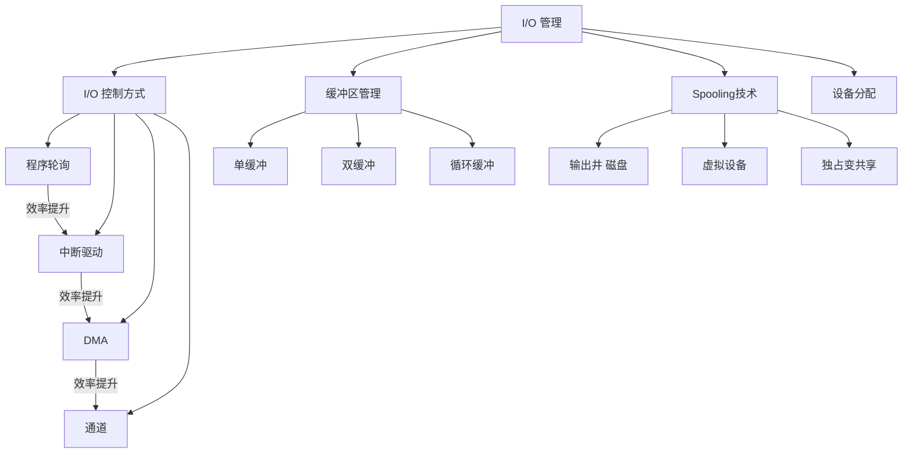

# 408 OS 第五章：I/O 设备管理

> 📌 I/O 管理解决的核心问题是：CPU 很快，I/O 设备很慢，如何让 CPU 不浪费时间等 I/O？核心技术是中断驱动、DMA、缓冲区和 Spooling。本章以选择题和简答题为主，概念理解优先。


## 📋 前置知识

- [[408_OS_ch1_概述]] — 需要理解中断机制
- [[408_OS_ch2_进程线程]] — 需要理解进程阻塞与唤醒


## 🤔 I/O 管理的核心矛盾

CPU 执行一条指令需要纳秒（$10^{-9}$ 秒），而键盘输入需要毫秒（$10^{-3}$ 秒），磁盘读写需要毫秒到几十毫秒，网络传输可能需要秒级。

CPU 和 I/O 设备之间存在**千倍到亿倍**的速度差异。如果 CPU 要等 I/O 设备完成再继续运行，绝大部分时间都在空等，这是巨大的浪费。

**I/O 管理的目标**：让 CPU 和 I/O 设备尽可能并行工作，提高整体系统吞吐量。


## 🧠 核心概念


### 5.1 I/O 设备的分类

| 分类方式 | 类型 | 例子 |
|----------|------|------|
| **按传输速率** | 低速：字节/秒级 | 键盘、鼠标 |
| | 中速：KB/s 级 | 激光打印机 |
| | 高速：MB/s 级 | 磁盘、光驱、网卡 |
| **按传输单位** | 字符设备（Character Device） | 键盘、串口，一次一个字节 |
| | 块设备（Block Device） | 磁盘，一次一块（512B-4KB） |
| **按使用特性** | 独占设备 | 打印机（一次只给一个进程） |
| | 共享设备 | 磁盘（多个进程可并发使用） |
| | 虚拟设备 | 通过 Spooling 技术将独占变为共享 |


### 5.2 I/O 控制方式（⭐⭐ 必考！）

操作系统如何控制 I/O 设备完成数据传输，经历了四个发展阶段：

#### 方式一：程序直接控制（轮询，Polling）

> 🎯 **类比**：你在打印机旁边站着，不停地问"打印好了吗？打印好了吗？"——就是轮询。

**工作原理**：CPU 启动 I/O 设备后，不断循环检查设备状态寄存器，直到设备完成。

```c
// 伪代码示意
start_io_device();
while (device_status != DONE) {
    // CPU 在这里空转，什么也不做，只是等
}
read_data();
```

- **优点**：简单，无需硬件支持
- **缺点**：CPU 全程等待，**利用率为 0**（完全浪费 CPU）

#### 方式二：中断驱动 I/O（Interrupt-Driven I/O）

> 🎯 **类比**：你把文件发给打印机，然后去做别的事。打印机打完了，按响铃通知你（发中断），你再去取打印件。CPU 不用空等！

**工作原理**：

1. CPU 启动 I/O 设备后，立即返回去执行其他程序
2. 设备完成后，向 CPU 发出**中断信号**
3. CPU 响应中断，执行中断处理程序读取数据
4. 恢复之前被中断的程序继续执行

- **优点**：CPU 不空等，可以做其他工作，**效率大幅提升**
- **缺点**：每次传输一个字符/字节就要中断一次；中断频率高时，中断处理本身消耗大量 CPU 时间（如键盘每秒可能产生数百次中断，磁盘连续读写产生大量中断）

#### 方式三：DMA（直接存储器访问，Direct Memory Access）

> 🎯 **类比**：不仅不用你自己等，连接数据（收快递）这件事也外包出去了——快递员（DMA 控制器）直接把包裹搬到你家（内存），搬完了再按门铃告诉你（发中断）。CPU 完全解放出来。

**工作原理**：

```
CPU → 告诉 DMA 控制器：读哪个磁盘扇区，数据放内存哪个地址，读多少字节
DMA 控制器 → 直接控制磁盘，将数据搬运到内存（不经过 CPU）
DMA 完成 → 向 CPU 发出一次中断（"我搬完了"）
CPU → 处理中断，得知数据已就绪，继续处理
```

- **优点**：CPU 只在启动和完成时各参与一次，中间的大量数据传输由 DMA 硬件完成；每传输一块（几百KB）才中断一次，而不是每字节中断一次
- **缺点**：需要 DMA 控制器硬件；DMA 和 CPU 共享内存总线，可能产生**总线争用（Bus Contention）**，CPU 访存时需等待

**DMA 的寄存器**：

| 寄存器 | 作用 |
|--------|------|
| 内存地址寄存器（MAR） | 数据要写入/读出的内存地址 |
| 字节计数寄存器（WC） | 还剩多少字节没传完 |
| 数据缓冲寄存器（DR） | 暂存一个字的数据 |
| 设备地址寄存器 | 设备（磁盘）上的位置 |

#### 方式四：通道（Channel）控制方式

> 🎯 **类比**：连 DMA 的"告知任务"也不用 CPU 来做了。通道是一个专用的小型处理器，CPU 只需丢给它一个"任务清单"（通道程序），通道自己执行全部 I/O 操作，完成后才通知 CPU。

**工作原理**：通道是一个独立的处理单元，有自己的指令集（通道程序），能独立执行复杂的 I/O 任务序列。CPU 启动通道后完全不管，通道和 CPU 完全并行工作。

- **优点**：CPU 介入最少，I/O 处理能力最强
- **缺点**：硬件复杂，成本高（主要用于大型机）

**四种方式演进对比**：

| 方式 | CPU 参与度 | 数据路径 | 中断频率 | 适用设备 |
|------|-----------|---------|---------|---------|
| 程序轮询 | 全程参与 | CPU↔设备 | 无中断 | 几乎不用 |
| 中断驱动 | 每字节中断 | CPU↔设备 | 极高 | 慢速设备 |
| DMA | 仅启动/结束 | 设备↔内存（DMA代劳）| 每块中断一次 | 磁盘、网卡 |
| 通道 | 仅启动 | 设备↔内存（通道代劳）| 批量完成后 | 大型机 |

> ⚠️ **考点**：DMA 的核心是数据**不经过** CPU，直接在设备和内存之间传输。中断驱动的数据要经过 CPU 的寄存器中转。


### 5.3 I/O 软件的层次结构

I/O 软件被设计成四层，每层向上层提供接口，向下层发出请求：

```
┌─────────────────────────────┐
│    用户层 I/O 软件           │  ← 应用程序调用的接口（printf, read, write）
├─────────────────────────────┤
│    设备无关的操统软件         │  ← 统一接口、缓冲、错误处理（设备驱动无关的通用层）
├─────────────────────────────┤
│    设备驱动程序（Driver）     │  ← 针对特定硬件的代码，厂商提供
├─────────────────────────────┤
│    中断处理程序               │  ← 中断发生时由内核直接调用
├─────────────────────────────┤
│    硬件（键盘/磁盘/网卡等）   │
└─────────────────────────────┘
```

**设备无关性（Device Independence）**：用户程序调用 `read()`，不需要知道是从磁盘读、从键盘读还是从网络读——操作系统屏蔽了设备差异。这通过将设备统一抽象为文件（Unix 的"一切皆文件"理念）来实现。

**设备驱动程序**：操作系统内核的一部分，直接操作硬件寄存器，是 I/O 软件层次中**离硬件最近**的软件层，由设备厂商提供（如显卡驱动）。


### 5.4 缓冲区管理（⭐ 必考概念！）

**为什么需要缓冲区？**

> 🎯 **类比**：工厂（CPU 产生数据）的生产速度和仓库发货（I/O 设备消耗数据）速度不匹配，中间需要一个**缓冲仓库**（缓冲区）来吸收速度差异。

缓冲区是在内存中开辟的**临时存储区**，用于缓和 CPU 与 I/O 设备速度不匹配的问题。

#### 单缓冲（Single Buffer）

系统分配**一个**缓冲区。工作流程：

```
设备 → 填满缓冲区 → CPU 处理缓冲区数据 → 设备再填 → CPU 再处理 ...
```

设备填充和 CPU 处理**串行**进行（一个在工作时另一个必须等），无法实现真正的并行。

每处理一块数据的时间 = $\max(T, C) + M$

其中 $T$ = 设备填充缓冲区的时间，$C$ = CPU 处理缓冲区数据的时间，$M$ = 将缓冲区数据移到用户区的时间。

#### 双缓冲（Double Buffer）

系统分配**两个**缓冲区，设备往一个缓冲区写，CPU 从另一个缓冲区读，交替使用——实现设备和 CPU 的**并行**。

```
缓冲区1：  [设备填充] → [CPU处理]           → [设备填充] → ...
缓冲区2：               [设备填充] → [CPU处理]              → ...
```

每处理一块数据的时间 = $\max(T, C) + M$（若 $T \neq C$）

当 $T \approx C$ 时，双缓冲效果最佳，CPU 和设备几乎不用等待对方。

#### 循环缓冲（Circular Buffer）

分配 $n$ 个缓冲区组成一个循环池，设备用一个指针写，CPU 用另一个指针读，两个指针不断追逐。

适用于生产速率和消费速率接近但不完全相同的场景。

#### 缓冲池（Buffer Pool）

更通用的方案：将所有缓冲区放入一个公共池，根据需要动态分配给各种 I/O 操作。

Linux 的**页缓存（Page Cache）** 就是一种缓冲池，将磁盘块缓存在内存中：

- 读文件时，先查 Page Cache，命中则不读磁盘（非常快）
- 写文件时，先写入 Page Cache（立即返回），定期由内核刷回磁盘（称为脏页回写）


### 5.5 Spooling 技术（假脱机技术）（⭐ 必考！）

**问题**：打印机是独占设备——同一时刻只能给一个进程用。进程 A 打印时，进程 B 要打印，只能等待。如何让打印机也能"同时"服务多个进程？

> 🎯 **类比**：公司有一台打印机，你不用站在打印机旁边等，直接把文件发到**打印队列**（服务器上的一个文件夹），打印服务程序按顺序把文件一个个送给打印机。你发完就可以继续工作，打印完了系统通知你。

**Spooling（Simultaneous Peripheral Operations On-Line，假脱机操作）**：

用软件将**独占设备**模拟为**多个虚拟设备**，允许多个进程并发使用。

**工作原理**：

```
进程A "打印" → 写入磁盘上的输出井（spool文件）→ 进程A立刻返回继续执行
进程B "打印" → 写入磁盘上的输出井（spool文件）→ 进程B立刻返回
...
Spooling 守护进程 → 按顺序从输出井读取任务 → 发送给真实打印机 → 打印
```

**关键组成部分**：

| 组件 | 作用 |
|------|------|
| **输入井** | 磁盘上存放输入数据的区域（模拟输入设备缓冲） |
| **输出井** | 磁盘上存放输出数据的区域（模拟输出设备缓冲） |
| **预输入进程** | 将输入数据预读到输入井 |
| **缓输出进程** | 将输出井的数据发送给真实设备 |

**Spooling 的特点**：

- 以**磁盘**代替真实的输入/输出设备，进程的 I/O 操作只是磁盘读写（速度快得多）
- 真实设备由 Spooling 进程独占，用户进程永远不直接访问真实设备
- **将独占设备改造为共享设备**（逻辑上每个进程都有"自己的"打印机）
- 提高了设备利用率和系统吞吐量

**Spooling 的典型应用**：

- **打印机**（最典型）：现代 Windows/Linux 的打印队列本质上就是 Spooling
- **批处理系统**中的作业输入：在作业执行前预先将数据从磁带读入磁盘

> ⚠️ **考点**：Spooling 技术**必须**有磁盘的支持（输出井就在磁盘上）。Spooling 是"以空间换时间"的典型，用磁盘空间缓存数据，换来设备利用率和并发度的提升。


### 5.6 设备分配

**设备分配时需要考虑的数据结构**：

| 数据结构 | 内容 |
|----------|------|
| **设备控制表（DCT）** | 每个设备一个，记录设备类型、状态、等待队列 |
| **控制器控制表（COCT）** | 每个控制器一个，记录控制器状态 |
| **通道控制表（CHCT）** | 每个通道一个（大型机才有） |
| **系统设备表（SDT）** | 全系统的所有设备的汇总表 |

**设备分配的安全性**：

设备是临界资源（独占设备一次只给一个进程）。设备分配若处理不当会导致**死锁**（如两个进程各持有一台设备，互相等待对方的设备）。

安全分配策略：一次性分配进程所需的全部设备（破坏"请求与保持"条件），避免死锁。

**设备分配的独立性**：

操作系统提供**设备独立性**（Device Independence）——进程以逻辑设备名（如 "printer"）申请设备，操作系统将逻辑设备映射到物理设备。这样进程不依赖特定的物理设备，换一台打印机不需要修改程序。


### 5.7 I/O 性能优化小结

提高 I/O 性能的常用手段：

| 手段 | 原理 |
|------|------|
| **中断驱动代替轮询** | CPU 不空等，发出 I/O 后去做其他事 |
| **DMA** | 数据传输不经过 CPU，减少 CPU 中断次数 |
| **缓冲（Buffer）** | 平衡 CPU 与 I/O 速度差异，减少等待 |
| **Spooling** | 独占设备虚拟化，提高设备利用率 |
| **磁盘调度（SCAN/SSTF）** | 减少磁头寻道距离，提高磁盘吞吐量 |
| **磁盘缓存（Page Cache）** | 热点数据在内存中缓存，避免重复磁盘访问 |
| **I/O 请求合并** | 将相邻的读写请求合并成一个大请求，减少总 I/O 次数 |


## ⚠️ 常见误区与踩坑点

> ❌ **误区 1：DMA 是操作系统软件实现的**
> DMA 是**硬件**——DMA 控制器是独立的芯片（或集成在 CPU 芯片组中）。操作系统只负责初始化 DMA 控制器（告诉它传什么、传哪里），实际传输由硬件完成。

> ❌ **误区 2：中断驱动 I/O 中 CPU 完全不参与数据传输**
> 中断驱动 I/O 中，每传一个字符，设备会中断一次，CPU 进入中断处理程序，把数据从设备寄存器**搬到内存**——CPU 还是要参与的，只是不需要等待（忙等）。DMA 才是 CPU 完全不参与数据搬运。

> ⚠️ **踩坑 3：Spooling 中进程"打印"时并没有真正操作打印机**
> 进程调用"打印"时，实际上只是把数据写入磁盘上的输出井，这一步完成后进程立即返回。真正的打印机操作由 Spooling 守护进程在后台完成，两者是异步的。

> ❌ **误区 4：双缓冲一定比单缓冲快一倍**
> 双缓冲实现了 CPU 和设备的并行，但并不一定快一倍。当 $T = C$（设备填充时间等于 CPU 处理时间）时效果最好，接近一倍提速；若 $T \gg C$ 或 $C \gg T$，提升幅度有限。


## 🔄 I/O 控制方式进化对比

| 特征 | 程序轮询 | 中断驱动 | DMA | 通道 |
|------|----------|----------|-----|------|
| CPU 利用率 | 极低 | 较高 | 高 | 最高 |
| 硬件复杂度 | 最低 | 低 | 中 | 高 |
| 中断频率 | 无 | 极高（每字节）| 低（每块）| 最低（每批） |
| 适用设备速率 | 极慢设备 | 慢速设备 | 高速设备 | 超高速/大型机 |
| 数据路径 | CPU中转 | CPU中转 | 直接到内存 | 直接到内存 |


## 🏋️ 动手练习

### 练习 1：I/O 控制方式判断（⭐ 难度）

**题目**：以下描述各对应哪种 I/O 控制方式？

A. CPU 启动磁盘读操作后，不断检查磁盘状态寄存器，直到读操作完成

B. CPU 启动网卡后，继续执行当前程序；网卡每收到一个字节，向 CPU 发一次中断

C. CPU 告诉 DMA 控制器"把磁盘第 100 扇区的数据读到内存地址 0x8000"，然后继续执行；DMA 完成后发一次中断通知 CPU

D. CPU 启动通道执行 I/O 程序，通道完成全部 I/O 操作后才通知 CPU

**参考答案**：

A → **程序轮询（忙等）**

B → **中断驱动 I/O**

C → **DMA**

D → **通道控制方式**


### 练习 2：缓冲区时间计算（⭐⭐ 难度）

**题目**：磁盘读一块数据需要 $T=20\text{ms}$，CPU 处理一块数据需要 $C=15\text{ms}$，将数据从缓冲区移到用户区需要 $M=5\text{ms}$。分别计算单缓冲和双缓冲处理 100 块数据各需多少时间。

**参考答案**：

**单缓冲**（每块时间 = $\max(T, C) + M$）：

每块时间 = $\max(20, 15) + 5 = 20 + 5 = 25\text{ms}$

100 块时间 ≈ $100 \times 25 = 2500\text{ms}$

**双缓冲**（设备和 CPU 并行，瓶颈是较慢的一方）：

当一个缓冲区被 CPU 处理（$C=15\text{ms}$）时，设备同时填充另一个缓冲区（$T=20\text{ms}$）。

每轮的瓶颈 = $\max(T, C) = 20\text{ms}$（磁盘是瓶颈）

加上最后一块需要额外的 CPU 处理和移动时间：

总时间 ≈ $100 \times 20 + C + M = 2000 + 15 + 5 = 2020\text{ms}$

**双缓冲比单缓冲快约 19%**。


### 练习 3：Spooling 简答（⭐ 难度）

**题目**：简述 Spooling 技术的基本思想，并说明它是如何将独占设备改造成共享设备的。

**参考答案**：

**基本思想**：Spooling（假脱机技术）利用磁盘作为中间缓冲，让进程的 I/O 操作不直接与低速 I/O 设备交互，而是与高速磁盘交互（写入/读取"输出井/输入井"），由专用的 Spooling 进程在后台真正操作 I/O 设备。

**如何将独占变共享**：以打印机为例——

1. 进程请求打印时，Spooling 系统为其在磁盘输出井中分配一个独立的区域（虚拟打印机），将要打印的数据写入该区域，进程立即返回（不再等待打印完成）
2. 多个进程可以同时"打印"（向各自的磁盘区域写数据），互不影响
3. Spooling 守护进程按队列顺序，依次将各进程的打印数据从磁盘读出，发送给真实打印机

**效果**：逻辑上，每个进程都拥有自己的专属"打印机"（虚拟设备）；物理上，真实打印机由 Spooling 进程统一管理，实现了独占设备的多进程共享。


## 📝 总结

### 本章要点回顾

1. **I/O 控制方式的演进**：轮询（CPU 全程忙等）→ 中断驱动（每字节中断）→ DMA（每块中断，数据不经 CPU）→ 通道（批量完成后中断）。CPU 参与度依次降低，效率依次提升。

2. **DMA 的核心**：数据在 I/O 设备和内存之间**直接传输**，不经过 CPU 寄存器，极大减轻了 CPU 负担。

3. **缓冲区**：平衡 CPU 与设备速度差异。双缓冲实现了设备填充与 CPU 处理的并行，每块处理时间 = $\max(T, C) + M$。

4. **Spooling**：以磁盘为中介，将独占设备虚拟为多个共享设备。进程与磁盘交互，Spooling 进程与真实设备交互，两者异步解耦。

5. **设备独立性**：进程以逻辑设备名申请设备，操作系统负责映射到物理设备，程序不依赖特定硬件。

### 知识图谱




## 🔗 相关链接

- 上一章：[[408_OS_ch4_文件系统]]
- 总览：[[408_OS_overview]]
- 全章复习：[[408_OS_ch1_概述]] | [[408_OS_ch2_进程线程]] | [[408_OS_ch2_同步互斥]] | [[408_OS_ch2_死锁]] | [[408_OS_ch2_调度算法]] | [[408_OS_ch3_内存管理]] | [[408_OS_ch3_虚拟内存]] | [[408_OS_ch4_文件系统]]


## 📚 参考资料

- 汤子瀛《操作系统（第四版）》第八章（I/O 系统）— 官方教材
- 王道考研《操作系统》I/O 管理专题 — DMA 与 Spooling 考点汇总
- [小林 coding 设备管理](https://xiaolincoding.com/os/) — 辅助理解
