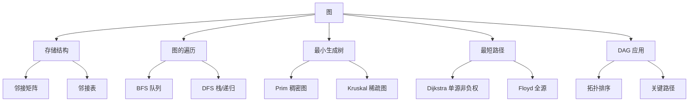

# 408 数据结构：图

> 📌 图是最一般化的数据结构——线性表是"一对一"，树是"一对多"，图是"多对多"。408 中图的考点覆盖面极广：存储结构、BFS/DFS、最小生成树、最短路径、拓扑排序、关键路径，几乎每年都有大题。


## 📋 前置知识

- [[408 数据结构：线性表]] — 邻接表本质是"数组 + 链表"
- [[408 数据结构：栈、队列与数组]] — DFS 用栈，BFS 用队列
- [[408 数据结构：串、树与二叉树]] — 生成树是图的子结构，很多图算法和树有密切关联
- [[时间复杂度与空间复杂度]] — 分析各种图算法的效率


## 🤔 为什么要学图？

现实世界中大量关系是"多对多"的：
- 城市之间的交通网络（城市是节点，公路/铁路是边）
- 社交网络（人是节点，好友关系是边）
- 课程的先修关系（课程是节点，"A 是 B 的先修课"是有向边）
- 网页之间的超链接（网页是节点，链接是有向边）

这些关系无法用线性表或树来表达，必须用图。

408 中图的算法题是**选择题和大题的双重热点**：选择题考图的性质、邻接矩阵/邻接表的特点、遍历序列；大题考最短路径算法的手工模拟、拓扑排序、关键路径的计算。


## 🧠 核心概念


### 一、图的基本概念

#### 1.1 定义与术语

> 🎯 **类比**：如果说线性表是一条路，树是一棵倒长的树，那图就是一张**地图**——上面散落着若干个城市（顶点），城市之间有道路（边）相连，道路可能是单行道（有向图）也可能是双向的（无向图），还可能标注了距离（带权图）。

**正式定义**：图 $G = (V, E)$，其中 $V$ 是**顶点集**（Vertex Set），$E$ 是**边集**（Edge Set）。

- **无向图**：边没有方向，用 $(v_i, v_j)$ 表示。$(v_i, v_j)$ 和 $(v_j, v_i)$ 是同一条边
- **有向图**：边有方向，用 $\langle v_i, v_j \rangle$ 表示（从 $v_i$ 指向 $v_j$）。$\langle v_i, v_j \rangle$ 和 $\langle v_j, v_i \rangle$ 是两条不同的边，前者叫做**弧**（Arc），$v_i$ 是弧尾，$v_j$ 是弧头
- **简单图**：不存在自环（顶点到自身的边）和重复边的图。408 中如果没有特殊说明，默认是简单图

**关键术语**：

- **度**（Degree）：与顶点 $v$ 关联的边数。在有向图中分为**入度**（In-degree，指向 $v$ 的边数）和**出度**（Out-degree，从 $v$ 出发的边数）
- **路径**：从顶点 $v_p$ 到 $v_q$ 的一系列边的序列。**路径长度** = 经过的边数（无权图）或边权之和（带权图）
- **简单路径**：路径中不重复经过同一个顶点
- **回路/环**（Cycle）：起点和终点相同的路径
- **连通**：在无向图中，如果 $v_i$ 到 $v_j$ 存在路径，则称 $v_i$ 和 $v_j$ 连通
- **连通图**：无向图中任意两个顶点都连通
- **连通分量**：无向图的极大连通子图
- **强连通图**：有向图中任意两个顶点之间都有**双向**路径（$v_i$ 到 $v_j$ 有路径，$v_j$ 到 $v_i$ 也有路径）
- **强连通分量**：有向图的极大强连通子图

#### 1.2 图的重要性质（408 选择题高频）

**性质 1**：设 $|V| = n$，$|E| = e$。

- 无向图：$0 \leq e \leq \frac{n(n-1)}{2}$。取等号时叫**完全图**
- 有向图：$0 \leq e \leq n(n-1)$。取等号时叫**有向完全图**

**性质 2**：无向图中所有顶点度之和 $= 2e$（每条边贡献 $2$ 个度）。

有向图中所有顶点入度之和 $=$ 出度之和 $= e$。

**性质 3**：$n$ 个顶点的连通图至少有 $n - 1$ 条边（树的形态）。$n$ 个顶点的强连通图至少有 $n$ 条边（形成一个环）。

**性质 4**：连通图的生成树（Spanning Tree）包含图中全部 $n$ 个顶点和 $n - 1$ 条边。

> ⚠️ **常考陷阱**：$n$ 个顶点 $n - 1$ 条边的图**不一定**是连通图（也不一定是树）。必须同时满足连通性才行。反过来，连通图的边数 $\geq n - 1$。


### 二、图的存储结构

#### 2.1 邻接矩阵（Adjacency Matrix）

> 🎯 **类比**：邻接矩阵就是一张"距离表"。行代表出发城市，列代表目的城市，交叉格填上是否有路（$0$ 或 $1$）或路的距离。

用一个 $n \times n$ 的二维数组 $A$ 来存储边的信息：

- 无权图：$A[i][j] = 1$ 表示 $v_i$ 和 $v_j$ 之间有边，$0$ 表示没有
- 带权图：$A[i][j] = w$ 表示边权为 $w$，没有边时填 $0$ 或 $\infty$

```cpp
#define MaxVertexNum 100
#define INF 0x3f3f3f3f  // 用一个大数表示无穷

typedef struct {
    char vex[MaxVertexNum];                  // 顶点表
    int edge[MaxVertexNum][MaxVertexNum];     // 邻接矩阵
    int vexnum, arcnum;                       // 顶点数和边数
} MGraph;
```

**邻接矩阵的特点**：

| 特性 | 说明 |
|------|------|
| 空间复杂度 | $O(n^2)$，与边数无关 |
| 判断边是否存在 | $O(1)$，直接查 $A[i][j]$ |
| 求顶点的度 | $O(n)$，扫描一行（出度）或一列（入度） |
| 适合 | **稠密图**（边多的图） |
| 无向图特点 | 邻接矩阵是**对称矩阵**，可以压缩存储 |
| 有向图特点 | 一般不对称。第 $i$ 行非零元素个数 = $v_i$ 的出度，第 $i$ 列 = 入度 |

> 🔑 **408 常考**：邻接矩阵 $A$ 的 $n$ 次方 $A^n$ 中，$A^n[i][j]$ 的值等于从 $v_i$ 到 $v_j$ 长度为 $n$ 的路径条数。这是用矩阵乘法的含义推出来的。

#### 2.2 邻接表（Adjacency List）

> 🎯 **类比**：邻接表就像一本通讯录。每个人（顶点）都有自己的一页，上面列出了他所有朋友（邻接顶点）的名字。

对于每个顶点，用一个链表存储它所有的邻接顶点。所有顶点的链表头存在一个数组中。

```cpp
#define MaxVertexNum 100

// 边表节点（链表节点）
typedef struct ArcNode {
    int adjvex;             // 邻接顶点的编号
    int weight;             // 边权（如果是带权图）
    struct ArcNode *next;   // 指向下一个邻接顶点
} ArcNode;

// 顶点表节点（数组元素）
typedef struct VNode {
    char data;              // 顶点信息
    ArcNode *first;         // 指向第一个邻接顶点（边链表头指针）
} VNode, AdjList[MaxVertexNum];

// 邻接表
typedef struct {
    AdjList vertices;       // 顶点数组
    int vexnum, arcnum;     // 顶点数和边数
} ALGraph;
```

**邻接表的特点**：

| 特性 | 说明 |
|------|------|
| 空间复杂度 | 无向图 $O(n + 2e)$，有向图 $O(n + e)$ |
| 判断边是否存在 | $O(\text{degree})$，需遍历链表 |
| 求顶点的出度 | 数该顶点链表长度，$O(\text{degree})$ |
| 求顶点的入度 | 需遍历所有链表，$O(n + e)$（不方便！） |
| 适合 | **稀疏图**（边少的图） |

> ⚠️ **408 注意**：邻接表中链表的顺序不唯一（取决于插入顺序），因此同一个图的邻接表表示可能不同，导致 BFS/DFS 的遍历序列也不唯一。但邻接矩阵是唯一的。

#### 2.3 邻接矩阵 vs 邻接表

| 对比项 | 邻接矩阵 | 邻接表 |
|--------|----------|--------|
| 空间 | $O(n^2)$ | $O(n + e)$ |
| 判断边 | $O(1)$ | $O(\text{degree})$ |
| 求度 | $O(n)$ | 出度 $O(\text{degree})$，入度不方便 |
| 适合图类型 | 稠密图 | 稀疏图 |
| 表示唯一性 | 唯一 | 不唯一 |
| 算法选择 | Floyd、矩阵运算 | BFS、DFS、Prim、Dijkstra |

> 💡 **一句话总结**：邻接矩阵像一张完整的距离表，查询快但占空间；邻接表像一本通讯录，省空间但查边慢。

408 还会考到**十字链表**（有向图的优化存储，同时方便求入度和出度）和**邻接多重表**（无向图的优化存储，每条边只存一次），了解概念即可，代码极少考。


### 三、图的遍历

#### 3.1 广度优先搜索（BFS）

> 🎯 **类比**：BFS 像往平静的水面扔一颗石子——波纹从落点向外一圈一圈扩散。先访问距离为 $1$ 的所有邻居，再访问距离为 $2$ 的，再距离为 $3$ 的……

BFS 使用**队列**实现：

```cpp
#include <cstdio>
#include <cstring>

#define MaxVertexNum 100

typedef struct {
    int edge[MaxVertexNum][MaxVertexNum];
    int vexnum;
} MGraph;

bool visited[MaxVertexNum];

// BFS 遍历（从顶点 v 开始）
void BFS(MGraph G, int v) {
    int queue[MaxVertexNum];
    int front = 0, rear = 0;

    printf("%d ", v);         // 访问起始顶点
    visited[v] = true;
    queue[rear++] = v;        // 入队

    while (front != rear) {
        int u = queue[front++];  // 出队
        // 遍历 u 的所有邻接顶点
        for (int w = 0; w < G.vexnum; w++) {
            if (G.edge[u][w] == 1 && !visited[w]) {
                printf("%d ", w);
                visited[w] = true;
                queue[rear++] = w;  // 未访问的邻接顶点入队
            }
        }
    }
}

// 处理非连通图：对每个连通分量都做一次 BFS
void BFS_Traverse(MGraph G) {
    memset(visited, false, sizeof(visited));
    for (int i = 0; i < G.vexnum; i++) {
        if (!visited[i]) {
            BFS(G, i);
        }
    }
}
```

**BFS 的性质**：

- 时间复杂度：邻接矩阵 $O(n^2)$，邻接表 $O(n + e)$
- 空间复杂度：$O(n)$（队列 + visited 数组）
- BFS 生成的**广度优先生成树**中，从根到每个顶点的路径是**最短路径**（边数最少，仅适用于无权图）
- BFS 可以用来求**无权图的单源最短路径**

> 🔑 **408 考点**：BFS 可以求无权图中从源点到各顶点的最短距离——在 BFS 过程中记录每个顶点被访问时的层数即可。

#### 3.2 深度优先搜索（DFS）

> 🎯 **类比**：DFS 像走迷宫的策略——沿一条路走到底，走不通了就回退到上一个岔路口，换一条路继续走到底。"不撞南墙不回头"。

DFS 使用**递归**（本质是调用栈）实现：

```cpp
bool visited[MaxVertexNum];

// DFS 遍历（从顶点 v 开始）
void DFS(MGraph G, int v) {
    printf("%d ", v);
    visited[v] = true;
    for (int w = 0; w < G.vexnum; w++) {
        if (G.edge[v][w] == 1 && !visited[w]) {
            DFS(G, w);  // 递归访问未访问的邻接顶点
        }
    }
}

void DFS_Traverse(MGraph G) {
    memset(visited, false, sizeof(visited));
    for (int i = 0; i < G.vexnum; i++) {
        if (!visited[i]) {
            DFS(G, i);
        }
    }
}
```

**DFS 的性质**：

- 时间复杂度：邻接矩阵 $O(n^2)$，邻接表 $O(n + e)$
- 空间复杂度：$O(n)$（递归栈深度最坏为 $n$）
- DFS 可以用来**判断图的连通性**（调用 DFS 的次数 = 连通分量数）
- DFS 可以用来**检测环**

#### 3.3 BFS vs DFS 对比

| 特性 | BFS | DFS |
|------|-----|-----|
| 数据结构 | 队列 | 栈（递归/显式栈） |
| 遍历特点 | "一圈一圈"扩散 | "一条路走到黑" |
| 最短路径 | ✅ 无权图最短路径 | ❌ 不保证最短 |
| 生成树 | 广度优先生成树 | 深度优先生成树 |
| 空间 | 可能存大量节点 | 递归深度最坏 $O(n)$ |

> ⚠️ **408 注意**：遍历序列不唯一！使用邻接表时，链表顺序不同会导致不同的遍历序列。使用邻接矩阵时，按照下标从小到大的顺序遍历邻接顶点，序列是唯一的。


### 四、最小生成树（MST）

> 🎯 **类比**：你是一个城市规划师，要在 $n$ 个城市之间修公路，使得任意两个城市都能通过公路互相到达。每条公路有不同的造价。你的目标是用**最少的总造价**把所有城市连通——这就是最小生成树问题。

**生成树**：连通图的一个子图，包含全部 $n$ 个顶点和 $n - 1$ 条边，且无环。

**最小生成树**（Minimum Spanning Tree, MST）：所有生成树中，边权之和最小的那棵。

MST 的性质：
- MST 不唯一（当存在权值相同的边时），但 MST 的总权值唯一
- MST 的边数 $= n - 1$

#### 4.1 Prim 算法（普里姆）

> 🎯 **类比**：Prim 像"滚雪球"——从一个顶点开始，每次把离"当前已连通区域"最近的那个顶点吸收进来。雪球越滚越大，直到覆盖所有顶点。

**核心思想**：维护一个集合 $U$（已加入 MST 的顶点）。每次从 $U$ 到 $V - U$（未加入的顶点）的所有边中，选**权值最小**的那条边，把对应的顶点加入 $U$。

**算法步骤**：

1. 初始化：$U = \{v_0\}$（任选一个起始顶点），对每个不在 $U$ 中的顶点 $v$，记录 $v$ 到 $U$ 的最短边权 `lowcost[v]` 和对应的 $U$ 中顶点 `closest[v]`
2. 重复 $n - 1$ 次：
   - 从不在 $U$ 中的顶点中，选 `lowcost` 最小的顶点 $k$
   - 将 $k$ 加入 $U$
   - 更新其余顶点的 `lowcost`（如果经过 $k$ 能找到更短的边，就更新）

```cpp
#include <cstdio>
#include <cstring>

#define MaxVertexNum 100
#define INF 0x3f3f3f3f

typedef struct {
    int edge[MaxVertexNum][MaxVertexNum];
    int vexnum;
} MGraph;

// Prim 算法（从顶点 0 开始）
void Prim(MGraph G) {
    int lowcost[MaxVertexNum];   // lowcost[i]: 顶点 i 到已选集合的最短边权
    int closest[MaxVertexNum];   // closest[i]: 该最短边在已选集合中的端点
    bool inMST[MaxVertexNum];    // 是否已加入 MST
    int totalWeight = 0;

    memset(inMST, false, sizeof(inMST));

    // 初始化：从顶点 0 出发
    for (int i = 0; i < G.vexnum; i++) {
        lowcost[i] = G.edge[0][i];  // 初始时只有顶点 0 在集合中
        closest[i] = 0;
    }
    inMST[0] = true;

    for (int count = 1; count < G.vexnum; count++) {
        // 找 lowcost 最小的顶点 k
        int minCost = INF, k = -1;
        for (int j = 0; j < G.vexnum; j++) {
            if (!inMST[j] && lowcost[j] < minCost) {
                minCost = lowcost[j];
                k = j;
            }
        }
        if (k == -1) break;  // 图不连通

        inMST[k] = true;
        totalWeight += minCost;
        printf("边 (%d, %d)，权值 %d\n", closest[k], k, minCost);

        // 更新 lowcost
        for (int j = 0; j < G.vexnum; j++) {
            if (!inMST[j] && G.edge[k][j] < lowcost[j]) {
                lowcost[j] = G.edge[k][j];
                closest[j] = k;
            }
        }
    }
    printf("MST 总权值：%d\n", totalWeight);
}

int main() {
    MGraph G;
    G.vexnum = 6;
    // 初始化邻接矩阵为 INF
    memset(G.edge, 0x3f, sizeof(G.edge));
    for (int i = 0; i < G.vexnum; i++) G.edge[i][i] = 0;

    // 添加边（无向图，对称赋值）
    auto addEdge = [&](int u, int v, int w) {
        G.edge[u][v] = G.edge[v][u] = w;
    };
    addEdge(0, 1, 6); addEdge(0, 2, 1); addEdge(0, 3, 5);
    addEdge(1, 2, 5); addEdge(1, 4, 3);
    addEdge(2, 3, 5); addEdge(2, 4, 6); addEdge(2, 5, 4);
    addEdge(3, 5, 2);
    addEdge(4, 5, 6);

    printf("Prim 算法：\n");
    Prim(G);
    return 0;
}
```

```bash
clang++ -std=c++17 -o prim prim.cpp && ./prim
```

预期输出：

```text
Prim 算法：
边 (0, 2)，权值 1
边 (2, 5)，权值 4
边 (5, 3)，权值 2
边 (2, 1)，权值 5
边 (1, 4)，权值 3
MST 总权值：15
```

**时间复杂度**：$O(n^2)$（朴素实现，适合稠密图）。用堆优化可以做到 $O(e \log n)$。

#### 4.2 Kruskal 算法（克鲁斯卡尔）

> 🎯 **类比**：Kruskal 像"捡便宜货"——把所有公路按造价从低到高排列，依次挑最便宜的公路修建，但如果这条路连接的两个城市已经能互相到达了（会形成环），就跳过。

**核心思想**：把所有边按权值从小到大排序。依次取边，如果这条边连接的两个顶点不在同一个连通分量中，就加入 MST；否则跳过（避免成环）。判断"是否在同一连通分量"用**并查集**（Union-Find）。

**算法步骤**：

1. 将所有边按权值升序排列
2. 初始化并查集，每个顶点自成一个集合
3. 依次取边 $(u, v, w)$：
   - 如果 $u$ 和 $v$ 在不同集合中 → 加入 MST，合并两个集合
   - 如果在同一集合中 → 跳过（加入会形成环）
4. 当 MST 有 $n - 1$ 条边时停止

```cpp
#include <cstdio>
#include <algorithm>

#define MaxEdge 1000
#define MaxVertex 100

// 边的结构
struct Edge {
    int u, v, w;
} edges[MaxEdge];

// 并查集
int parent[MaxVertex];

int Find(int x) {
    if (parent[x] != x)
        parent[x] = Find(parent[x]);  // 路径压缩
    return parent[x];
}

bool Union(int x, int y) {
    int fx = Find(x), fy = Find(y);
    if (fx == fy) return false;  // 已在同一集合
    parent[fx] = fy;
    return true;
}

int main() {
    int n = 6, e = 10;

    // 初始化并查集
    for (int i = 0; i < n; i++) parent[i] = i;

    // 添加边
    edges[0] = {0, 1, 6}; edges[1] = {0, 2, 1}; edges[2] = {0, 3, 5};
    edges[3] = {1, 2, 5}; edges[4] = {1, 4, 3};
    edges[5] = {2, 3, 5}; edges[6] = {2, 4, 6}; edges[7] = {2, 5, 4};
    edges[8] = {3, 5, 2}; edges[9] = {4, 5, 6};

    // 按权值排序
    std::sort(edges, edges + e, [](const Edge &a, const Edge &b) {
        return a.w < b.w;
    });

    int totalWeight = 0, count = 0;
    printf("Kruskal 算法：\n");
    for (int i = 0; i < e && count < n - 1; i++) {
        if (Union(edges[i].u, edges[i].v)) {
            printf("边 (%d, %d)，权值 %d\n", edges[i].u, edges[i].v, edges[i].w);
            totalWeight += edges[i].w;
            count++;
        }
    }
    printf("MST 总权值：%d\n", totalWeight);
    return 0;
}
```

```bash
clang++ -std=c++17 -o kruskal kruskal.cpp && ./kruskal
```

预期输出：

```text
Kruskal 算法：
边 (0, 2)，权值 1
边 (3, 5)，权值 2
边 (1, 4)，权值 3
边 (2, 5)，权值 4
边 (1, 2)，权值 5
MST 总权值：15
```

**时间复杂度**：$O(e \log e)$（排序主导），适合**稀疏图**。

#### 4.3 Prim vs Kruskal

| 特性 | Prim | Kruskal |
|------|------|---------|
| 策略 | 以顶点为中心，逐步扩张 | 以边为中心，逐步选最小边 |
| 时间复杂度 | $O(n^2)$（朴素） | $O(e \log e)$ |
| 适合 | 稠密图（$e$ 接近 $n^2$） | 稀疏图（$e$ 远小于 $n^2$） |
| 辅助结构 | lowcost 数组 | 并查集 |

> 💡 **408 做题口诀**：边多用 Prim（$O(n^2)$），边少用 Kruskal（$O(e \log e)$）。


### 五、最短路径

#### 5.1 Dijkstra 算法（单源最短路径）

> 🎯 **类比**：Dijkstra 像一个谨慎的旅行者——他先到最近的城市，确认那是最短的路，然后以那个城市为跳板更新到其他城市的距离。每次都"贪心"地选择当前已知最短的路径，保证每一步都是全局最优。

**适用条件**：边权**非负**的有向图或无向图。不能处理负权边！

**核心数据结构**：
- `dist[v]`：从源点到 $v$ 的当前已知最短距离
- `visited[v]`：$v$ 是否已确定最短路径
- `path[v]`：最短路径中 $v$ 的前驱顶点（用于回溯路径）

**算法步骤**：

1. 初始化：`dist[源点] = 0`，其余为 $\infty$
2. 重复 $n$ 次：
   - 从未确定的顶点中选 `dist` 最小的顶点 $u$
   - 标记 $u$ 为已确定
   - **松弛**（Relaxation）：对 $u$ 的所有邻接顶点 $v$，如果 `dist[u] + w(u,v) < dist[v]`，就更新 `dist[v]`

```cpp
#include <cstdio>
#include <cstring>

#define MaxVertexNum 100
#define INF 0x3f3f3f3f

typedef struct {
    int edge[MaxVertexNum][MaxVertexNum];
    int vexnum;
} MGraph;

void Dijkstra(MGraph G, int src) {
    int dist[MaxVertexNum];    // 最短距离
    bool visited[MaxVertexNum]; // 是否已确定
    int path[MaxVertexNum];    // 前驱顶点

    // 初始化
    for (int i = 0; i < G.vexnum; i++) {
        dist[i] = G.edge[src][i];
        visited[i] = false;
        path[i] = (G.edge[src][i] < INF) ? src : -1;
    }
    dist[src] = 0;
    visited[src] = true;

    for (int count = 1; count < G.vexnum; count++) {
        // 找 dist 最小的未确定顶点 u
        int minDist = INF, u = -1;
        for (int j = 0; j < G.vexnum; j++) {
            if (!visited[j] && dist[j] < minDist) {
                minDist = dist[j];
                u = j;
            }
        }
        if (u == -1) break;  // 剩余顶点不可达
        visited[u] = true;

        // 松弛操作
        for (int v = 0; v < G.vexnum; v++) {
            if (!visited[v] && G.edge[u][v] < INF &&
                dist[u] + G.edge[u][v] < dist[v]) {
                dist[v] = dist[u] + G.edge[u][v];
                path[v] = u;
            }
        }
    }

    // 输出结果
    printf("从顶点 %d 出发的最短路径：\n", src);
    for (int i = 0; i < G.vexnum; i++) {
        if (dist[i] == INF)
            printf("  到顶点 %d：不可达\n", i);
        else
            printf("  到顶点 %d：距离 = %d\n", i, dist[i]);
    }
}

int main() {
    MGraph G;
    G.vexnum = 5;
    memset(G.edge, 0x3f, sizeof(G.edge));
    for (int i = 0; i < G.vexnum; i++) G.edge[i][i] = 0;

    // 有向图的边
    G.edge[0][1] = 10; G.edge[0][3] = 5;
    G.edge[1][2] = 1;  G.edge[1][3] = 2;
    G.edge[2][4] = 4;
    G.edge[3][1] = 3;  G.edge[3][2] = 9; G.edge[3][4] = 2;
    G.edge[4][2] = 6;

    Dijkstra(G, 0);
    return 0;
}
```

```bash
clang++ -std=c++17 -o dijkstra dijkstra.cpp && ./dijkstra
```

预期输出：

```text
从顶点 0 出发的最短路径：
  到顶点 0：距离 = 0
  到顶点 1：距离 = 8
  到顶点 2：距离 = 9
  到顶点 3：距离 = 5
  到顶点 4：距离 = 7
```

**时间复杂度**：$O(n^2)$（朴素），$O((n + e) \log n)$（堆优化）。

> ⚠️ **408 重点**：Dijkstra **不能处理负权边**。如果有负权边，可能导致已确定的最短路径被"推翻"。408 选择题经常考这一点。

#### 5.2 Floyd 算法（各顶点间最短路径）

> 🎯 **类比**：Floyd 的思路很朴素——对于每一对顶点 $(i, j)$，尝试经过每一个"中转站" $k$，看看绕道 $k$ 会不会更近。就像你规划出行路线时，依次考虑"要不要经过北京中转""要不要经过上海中转"……

**核心思想**：动态规划。用 $A^{(k)}[i][j]$ 表示从 $i$ 到 $j$、只允许经过前 $k$ 个顶点中转时的最短路径长度。

$$
A^{(k)}[i][j] = \min\left(A^{(k-1)}[i][j], \quad A^{(k-1)}[i][k] + A^{(k-1)}[k][j]\right)
$$

直觉：要么不经过 $k$（保持原值），要么经过 $k$（拆成 $i \to k$ 和 $k \to j$ 两段）。

```cpp
#include <cstdio>
#include <cstring>

#define MaxVertexNum 100
#define INF 0x3f3f3f3f

void Floyd(int A[][MaxVertexNum], int n) {
    // 三重循环：k 是中转顶点，i 是起点，j 是终点
    for (int k = 0; k < n; k++) {
        for (int i = 0; i < n; i++) {
            for (int j = 0; j < n; j++) {
                if (A[i][k] < INF && A[k][j] < INF &&
                    A[i][k] + A[k][j] < A[i][j]) {
                    A[i][j] = A[i][k] + A[k][j];
                }
            }
        }
    }
}

int main() {
    int n = 4;
    int A[MaxVertexNum][MaxVertexNum];
    memset(A, 0x3f, sizeof(A));
    for (int i = 0; i < n; i++) A[i][i] = 0;

    A[0][1] = 1; A[0][3] = 4;
    A[1][2] = 9; A[1][3] = 2;
    A[2][0] = 3; A[2][1] = 5; A[2][3] = 8;
    A[3][2] = 6;

    Floyd(A, n);

    printf("Floyd 各顶点间最短路径：\n");
    for (int i = 0; i < n; i++) {
        for (int j = 0; j < n; j++) {
            if (A[i][j] == INF) printf("%4s", "INF");
            else printf("%4d", A[i][j]);
        }
        printf("\n");
    }
    return 0;
}
```

```bash
clang++ -std=c++17 -o floyd floyd.cpp && ./floyd
```

预期输出：

```text
Floyd 各顶点间最短路径：
   0   1   9   3
  12   0   8   2
   3   4   0   6
   9  10   6   0
```

**时间复杂度**：$O(n^3)$。**空间复杂度**：$O(n^2)$。

**Floyd 可以处理负权边**（但不能有负权回路），这是它和 Dijkstra 的重要区别。

#### 5.3 Dijkstra vs Floyd

| 特性 | Dijkstra | Floyd |
|------|----------|-------|
| 问题类型 | 单源最短路径 | 各顶点间最短路径 |
| 时间复杂度 | $O(n^2)$ / $O((n+e)\log n)$ | $O(n^3)$ |
| 负权边 | ❌ 不能处理 | ✅ 可以处理（无负权回路） |
| 实现复杂度 | 中等 | 简单（三重循环） |
| 适用场景 | 从一个点出发求最短路 | 求所有点对之间的最短路 |


### 六、有向无环图（DAG）的应用

#### 6.1 拓扑排序（Topological Sort）

> 🎯 **类比**：你在安排学期课程。有些课有先修关系——必须先修完"数据结构"才能修"算法设计"。拓扑排序就是找到一种选课顺序，使得每门课都在它的先修课之后。

**适用对象**：有向无环图（DAG, Directed Acyclic Graph）。如果图中有环，就不存在拓扑排序。

**算法步骤**（基于入度的 BFS 方法，又叫 Kahn 算法）：

1. 计算每个顶点的入度
2. 将所有入度为 $0$ 的顶点入队
3. 重复：
   - 出队一个顶点 $u$，输出 $u$
   - 将 $u$ 的所有邻接顶点的入度减 $1$
   - 如果某个邻接顶点的入度变为 $0$，入队
4. 如果输出的顶点数 $< n$，说明图中有环，拓扑排序失败

```cpp
#include <cstdio>
#include <cstring>
#include <vector>

#define MaxVertexNum 100

void TopologicalSort(int n, std::vector<int> adj[], int indeg[]) {
    int queue[MaxVertexNum];
    int front = 0, rear = 0;
    int count = 0;  // 已输出的顶点数

    // 入度为 0 的顶点入队
    for (int i = 0; i < n; i++) {
        if (indeg[i] == 0) queue[rear++] = i;
    }

    printf("拓扑排序：");
    while (front != rear) {
        int u = queue[front++];
        printf("%d ", u);
        count++;
        // u 的所有邻接顶点入度减 1
        for (int v : adj[u]) {
            indeg[v]--;
            if (indeg[v] == 0) queue[rear++] = v;
        }
    }
    printf("\n");

    if (count < n) {
        printf("图中存在环，拓扑排序失败！\n");
    }
}

int main() {
    int n = 6;
    std::vector<int> adj[MaxVertexNum];
    int indeg[MaxVertexNum] = {0};

    // 添加有向边
    auto addEdge = [&](int u, int v) {
        adj[u].push_back(v);
        indeg[v]++;
    };
    addEdge(0, 1); addEdge(0, 2); addEdge(0, 3);
    addEdge(2, 1); addEdge(2, 4);
    addEdge(3, 4);
    addEdge(1, 4);
    addEdge(4, 5);

    TopologicalSort(n, adj, indeg);
    return 0;
}
```

```bash
clang++ -std=c++17 -o topo topo.cpp && ./topo
```

预期输出：

```text
拓扑排序：0 2 3 1 4 5
```

**时间复杂度**：$O(n + e)$。

> 🔑 **408 核心考点**：
> 1. 拓扑排序的结果**不唯一**（多个入度为 $0$ 的顶点时，选哪个都行）
> 2. DAG 一定存在拓扑排序；存在拓扑排序的图一定是 DAG（可以用来判断有向图是否有环）
> 3. 也可以用 **DFS** 实现拓扑排序——DFS 逆后序（按完成时间降序排列）就是拓扑序

#### 6.2 关键路径（Critical Path）

> 🎯 **类比**：你在管理一个工程项目，项目包含多个任务，有些任务必须在其他任务完成后才能开始。**关键路径**就是整个项目中耗时最长的那条任务链——它决定了项目的最短完成时间。关键路径上的任何任务延误，都会导致整个项目延期。

**AOE 网**（Activity On Edge）：用**边表示活动**，顶点表示**事件**（所有入边活动都完成的时刻）。边权是活动持续时间。

**关键概念**：

- $ve(v_j)$：事件 $v_j$ 的**最早发生时间**（从源点到 $v_j$ 的最长路径长度）
- $vl(v_j)$：事件 $v_j$ 的**最迟发生时间**（在不推迟工期的前提下，最迟必须发生的时间）
- $e(a_i)$：活动 $a_i$ 的**最早开始时间** $= ve(\text{起点})$
- $l(a_i)$：活动 $a_i$ 的**最迟开始时间** $= vl(\text{终点}) - \text{持续时间}$
- **时间余量**：$d(a_i) = l(a_i) - e(a_i)$。余量为 $0$ 的活动就是**关键活动**

**计算步骤**：

1. 拓扑排序，按拓扑序**正向**计算 $ve$：$ve(v_j) = \max\{ve(v_i) + w(v_i, v_j)\}$（取所有入边的最大值）
2. 逆拓扑序**反向**计算 $vl$：从汇点开始，$vl(v_i) = \min\{vl(v_j) - w(v_i, v_j)\}$（取所有出边的最小值）。汇点的 $vl = ve$
3. 计算每条边（活动）的 $e$ 和 $l$，余量为 $0$ 的就是关键活动
4. 关键活动组成的路径就是关键路径

> ⚠️ **408 注意**：
> - 关键路径可能不唯一
> - 缩短关键活动的时间**不一定**能缩短工期——如果缩短后该活动不再在关键路径上，或者出现了新的关键路径
> - 只有缩短**所有**关键路径上都包含的关键活动，才能确保缩短工期


## ⚠️ 常见误区与踩坑点

> ❌ **误区 1：Dijkstra 能处理负权边**
> 不能！Dijkstra 的贪心策略依赖"已确定的顶点不会被更新"这一前提。负权边会打破这个前提。有负权边时用 Bellman-Ford 或 Floyd。

> ❌ **误区 2：$n$ 个顶点 $n - 1$ 条边一定是树**
> 不一定！还需要**连通**这个条件。$5$ 个顶点 $4$ 条边的图可能是一棵树，也可能是两个不相连的部分（一个三角形 + 一条孤立的边）。

> ⚠️ **踩坑 3：BFS/DFS 的遍历序列不唯一**
> 使用邻接表时，链表中节点的顺序影响遍历顺序。408 选择题如果问"下列哪个是合法的 BFS 序列"，通常需要验证多个候选答案。

> ⚠️ **踩坑 4：拓扑排序不唯一**
> 多个入度为 $0$ 的顶点同时存在时，选择不同的顶点会得到不同的拓扑序列。408 可能问"以下哪个是合法的拓扑排序"或"共有多少种拓扑序列"。

> ⚠️ **踩坑 5：关键路径和最短路径的混淆**
> 关键路径是**最长路径**（决定最短工期），不是最短路径。$ve$ 的计算取的是 $\max$（最长的那条路径决定事件何时能发生），$vl$ 的计算取的是 $\min$（最紧迫的那条路径决定事件最迟何时必须发生）。


## 🏋️ 动手练习

### 练习 1：手工模拟 Dijkstra（⭐⭐ 难度）

**题目**：对下面的有向带权图，用 Dijkstra 算法求从顶点 $0$ 到其他所有顶点的最短路径。写出每一轮选择的顶点和 `dist` 数组的更新过程。

```text
边：0→1(4), 0→2(2), 1→2(1), 1→3(5), 2→1(1), 2→3(8), 2→4(10), 3→4(2), 4→3(7)
```

**参考答案**：

| 轮次 | 选择顶点 | dist[0] | dist[1] | dist[2] | dist[3] | dist[4] |
|------|----------|---------|---------|---------|---------|---------|
| 初始 | — | $0$ | $4$ | $2$ | $\infty$ | $\infty$ |
| $1$ | $2$ | $0$ | $3$ | $2$ | $10$ | $12$ |
| $2$ | $1$ | $0$ | $3$ | $2$ | $8$ | $12$ |
| $3$ | $3$ | $0$ | $3$ | $2$ | $8$ | $10$ |
| $4$ | $4$ | $0$ | $3$ | $2$ | $8$ | $10$ |

最短路径：$0 \to 0: 0$，$0 \to 1: 3$（经 $2$），$0 \to 2: 2$，$0 \to 3: 8$（经 $2, 1$），$0 \to 4: 10$（经 $2, 1, 3$）。

### 练习 2：求关键路径（⭐⭐⭐ 难度）

**题目**：下面的 AOE 网中，求所有事件的 $ve$ 和 $vl$，找出关键活动和关键路径。

```text
顶点：v0, v1, v2, v3, v4, v5
边（活动）：
  v0→v1: 3, v0→v2: 2
  v1→v3: 2, v1→v4: 3
  v2→v3: 4, v2→v4: 3
  v3→v5: 2
  v4→v5: 1
```

**参考答案**：

拓扑序：$v_0, v_1, v_2, v_3, v_4, v_5$（或 $v_0, v_2, v_1, \dots$）

**计算 $ve$**（正向，取 max）：

- $ve(v_0) = 0$
- $ve(v_1) = ve(v_0) + 3 = 3$
- $ve(v_2) = ve(v_0) + 2 = 2$
- $ve(v_3) = \max(ve(v_1) + 2, \; ve(v_2) + 4) = \max(5, 6) = 6$
- $ve(v_4) = \max(ve(v_1) + 3, \; ve(v_2) + 3) = \max(6, 5) = 6$
- $ve(v_5) = \max(ve(v_3) + 2, \; ve(v_4) + 1) = \max(8, 7) = 8$

**计算 $vl$**（反向，取 min）：

- $vl(v_5) = ve(v_5) = 8$
- $vl(v_4) = vl(v_5) - 1 = 7$
- $vl(v_3) = vl(v_5) - 2 = 6$
- $vl(v_2) = \min(vl(v_3) - 4, \; vl(v_4) - 3) = \min(2, 4) = 2$
- $vl(v_1) = \min(vl(v_3) - 2, \; vl(v_4) - 3) = \min(4, 4) = 4$
- $vl(v_0) = \min(vl(v_1) - 3, \; vl(v_2) - 2) = \min(1, 0) = 0$

**活动的 $e$、$l$ 和余量**：

| 活动 | $e$ | $l$ | $d = l - e$ | 关键？ |
|------|------|------|-------------|--------|
| $v_0 \to v_1$ | $0$ | $1$ | $1$ | 否 |
| $v_0 \to v_2$ | $0$ | $0$ | $0$ | ✅ |
| $v_1 \to v_3$ | $3$ | $4$ | $1$ | 否 |
| $v_1 \to v_4$ | $3$ | $4$ | $1$ | 否 |
| $v_2 \to v_3$ | $2$ | $2$ | $0$ | ✅ |
| $v_2 \to v_4$ | $2$ | $4$ | $2$ | 否 |
| $v_3 \to v_5$ | $6$ | $6$ | $0$ | ✅ |
| $v_4 \to v_5$ | $6$ | $7$ | $1$ | 否 |

**关键路径**：$v_0 \to v_2 \to v_3 \to v_5$，长度 $= 2 + 4 + 2 = 8$。

### 练习 3：判断 BFS/DFS 序列合法性（⭐ 难度）

**题目**：给定无向图的邻接矩阵（下标 $0 \sim 4$）：

```text
  0 1 2 3 4
0 0 1 1 0 0
1 1 0 0 1 1
2 1 0 0 0 1
3 0 1 0 0 0
4 0 1 1 0 0
```

从顶点 $0$ 开始，以下哪个是合法的 BFS 序列？
- A: $0, 1, 2, 3, 4$
- B: $0, 2, 1, 4, 3$
- C: $0, 1, 2, 4, 3$
- D: $0, 2, 1, 3, 4$

**参考答案**：

$0$ 的邻接顶点是 $\{1, 2\}$。BFS 先访问 $0$，然后访问 $0$ 的邻接顶点（$1$ 和 $2$ 的顺序可以互换）。

- 如果先访问 $1$ 再 $2$：$0, 1, 2$，接下来是 $1$ 的未访问邻接顶点 $\{3, 4\}$，再是 $2$ 的未访问邻接顶点 $\{4\}$（$4$ 可能已被访问）。所以可能是 $0, 1, 2, 3, 4$ 或 $0, 1, 2, 4, 3$。
- 如果先访问 $2$ 再 $1$：$0, 2, 1$，接下来是 $2$ 的未访问邻接顶点 $\{4\}$，再是 $1$ 的 $\{3, 4\}$（$4$ 已访问），得到 $0, 2, 1, 4, 3$。

**A、B、C** 都是合法的。**D** 不合法——如果先访问 $2$，$2$ 的邻接顶点 $4$ 应该在 $1$ 的邻接顶点 $3$ 之前入队，不可能出现 $3$ 在 $4$ 前面。


## 📝 总结

### 本篇要点回顾

1. **图的存储**：邻接矩阵适合稠密图 $O(n^2)$，邻接表适合稀疏图 $O(n + e)$。无向图的邻接矩阵是对称矩阵。
2. **BFS** 用队列，能求无权图最短路径；**DFS** 用栈/递归，能判连通性和检测环。
3. **最小生成树**：Prim 适合稠密图 $O(n^2)$，Kruskal 适合稀疏图 $O(e \log e)$。MST 的边数 $= n - 1$。
4. **Dijkstra** 求单源最短路 $O(n^2)$，不能处理负权边；**Floyd** 求全源最短路 $O(n^3)$，可以处理负权边。
5. **拓扑排序**只适用于 DAG，可以判断有向图是否有环。结果不唯一。
6. **关键路径**是 AOE 网中的最长路径，$ve$ 取 max（正向），$vl$ 取 min（反向），余量为 $0$ 的活动是关键活动。

### 知识图谱




## 🔗 相关链接

- 上级概念：[[408 数据结构总览]]
- 前置概念：[[408 数据结构：线性表]]、[[408 数据结构：栈、队列与数组]]、[[408 数据结构：串、树与二叉树]]
- 同级概念：[[排序算法]]、[[查找算法]]
- 下级概念：[[Bellman-Ford 算法]]、[[SPFA 算法]]、[[网络流]]、[[并查集详解]]
- 实际应用：[[地图导航最短路径]]、[[课程安排拓扑排序]]、[[项目管理关键路径法]]


## 📚 参考资料

- [王道考研《数据结构》](https://www.wangdao.com/) — 本篇对应王道第六章，图的算法题是 408 大题的常客
- [严蔚敏《数据结构（C 语言版）》](https://book.douban.com/subject/24699581/) — 图论算法的证明和分析最严谨
- [VisuAlgo 图可视化](https://visualgo.net/zh/graphds) — BFS/DFS/Dijkstra/MST 全部有动画演示
- [Graph Algorithm Visualizer](https://www.cs.usfca.edu/~galles/visualization/Dijkstra.html) — 手动输入图，逐步模拟 Dijkstra
