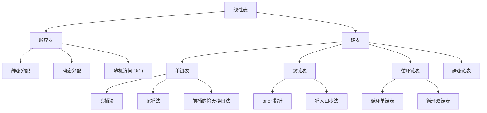

# 408 数据结构：线性表

> 📌 线性表是数据结构中最基础的一种结构——它描述的是"一群数据排成一排"这件事。数组和链表都是线性表的具体实现方式，408 考试中线性表是必考内容，选择题和算法大题都可能涉及。


## 📋 前置知识

在开始之前，你需要了解这些概念（如果不熟悉，先点击链接去补课）：

- [[C 语言指针基础]] — 链表的每个节点都靠指针串联，不懂指针就没法理解链表
- [[结构体 struct 基础]] — 链表的节点本身就是一个结构体，里面装着数据和指针
- [[时间复杂度与空间复杂度]] — 我们需要用 $O$ 记号来分析每种操作的效率


## 🤔 为什么要学这个？

想象你是一个图书管理员。你有一批新到的书，需要摆放到书架上。你面临两种选择：

**方案 A：连续书架法**。你找一排完整的空书架，把所有书紧挨着摆放，编号 $1, 2, 3, \dots$ 这样你想找第 $50$ 本书，直接走到第 $50$ 个位置就行，非常快。但问题是——如果你想在第 $3$ 本和第 $4$ 本之间插入一本新书，你得把第 $4$ 本往后的所有书都往后挪一格，太累了。而且如果这排书架满了，你得搬到一排更长的书架上去。

**方案 B：卡片索引法**。每本书可以放在图书馆的任意位置，但每本书里面都夹了一张卡片，写着"下一本书在 XX 位置"。这样插入新书很简单——把新书随便找个位置放下，修改一下前后两本书的卡片就行。但问题是——你想找第 $50$ 本书，就得从第 $1$ 本开始，按照卡片一路追踪过去，很慢。

这两种方案对应的就是**顺序表**（Sequential List）和**链表**（Linked List），它们是线性表的两种实现方式。408 考试的核心考点就是：在不同的应用场景下，哪种实现更合适？它们的操作效率分别是多少？


## 🧠 核心概念


### 一、线性表的逻辑结构

#### 1.1 什么是线性表

> 🎯 **类比**：把线性表想象成一列火车。火车有一节车头（第一个元素），一节车尾（最后一个元素），中间的每节车厢都有且仅有一个"前车厢"和一个"后车厢"。车厢之间的连接关系就是线性表的"逻辑结构"。

正式定义：线性表（Linear List）是由 $n$（$n \geq 0$）个**相同类型**的数据元素组成的**有限序列**。记作：

$$
L = (a_1, a_2, a_3, \dots, a_n)
$$

几个关键词需要拆开理解：

- **相同类型**：线性表里的所有元素类型必须一样，不能一个是整数、一个是字符串。这和你平时用的 Python 列表不太一样——Python 列表允许混合类型，但数据结构教材里的线性表是严格同类型的。
- **有限序列**：元素个数 $n$ 是有限的。$n = 0$ 时叫**空表**。
- **序列**（有序性）：元素之间有**先后顺序**。$a_i$ 是第 $i$ 个元素，$i$ 叫做它的**位序**（注意从 $1$ 开始，不是从 $0$）。

#### 1.2 线性表的"四大关系"

线性表中的元素存在以下关系，考试经常以判断题的形式考察：

- $a_1$ 是**表头元素**（没有前驱）
- $a_n$ 是**表尾元素**（没有后继）
- 对于 $a_i$（$1 < i < n$），$a_{i-1}$ 是它的**直接前驱**，$a_{i+1}$ 是它的**直接后继**
- 每个元素最多有 $1$ 个前驱和 $1$ 个后继 —— 这就是"线性"的含义

> ❌ **常考陷阱**：线性表的位序从 $1$ 开始，但数组的下标从 $0$ 开始。408 真题中经常在这里设坑，题目说"第 $i$ 个元素"指的是位序 $i$，对应数组下标 $i - 1$。

理解了线性表的逻辑结构之后，接下来的核心问题就是：怎么把这个逻辑上"一排排好的元素"存到计算机的内存里？这就引出了两种存储结构——顺序存储和链式存储。


### 二、顺序表（Sequential List）

#### 2.1 什么是顺序表

> 🎯 **类比**：顺序表就像电影院的一排座位。座位编号连续（$1$ 号、$2$ 号、$3$ 号……），每个座位大小相同，你只要知道第 $1$ 个座位的位置和座位的大小，就能直接算出任何一个座位的位置。

正式定义：顺序表是用一段**地址连续的存储单元**依次存储线性表的数据元素。简单说就是用**数组**来实现线性表。

顺序表的核心特征是**随机访问**（Random Access）：知道第 $1$ 个元素的地址（基地址）和每个元素占的空间大小，就可以通过公式直接算出第 $i$ 个元素的地址：

$$
\text{Loc}(a_i) = \text{Loc}(a_1) + (i - 1) \times \text{sizeof}(\text{ElemType})
$$

这意味着**按位序查找**的时间复杂度是 $O(1)$ —— 不管表有多长，访问任何一个位置都是一步到位的。

#### 2.2 顺序表的两种实现方式

在 C 语言中，顺序表有**静态分配**和**动态分配**两种实现方式，408 都会考。

**静态分配** —— 用定长数组：

```cpp
// 静态分配顺序表
#include <cstdio>

#define MaxSize 50  // 定义最大长度

typedef struct {
    int data[MaxSize];  // 用静态数组存放数据元素
    int length;         // 顺序表当前长度
} SqList;

// 初始化顺序表
void InitList(SqList &L) {
    L.length = 0;  // 初始长度为 0，表示空表
}

int main() {
    SqList L;        // 声明一个顺序表
    InitList(L);     // 初始化
    printf("顺序表长度：%d\n", L.length);  // 输出 0
    return 0;
}
```

```bash
clang++ -std=c++17 -o sqlist_static sqlist_static.cpp && ./sqlist_static
```

预期输出：

```text
顺序表长度：0
```

静态分配的问题很明显：`MaxSize` 是编译时就固定的，如果数据量超过 $50$ 就溢出了，而且你不能"扩容"（因为数组大小是固定的）。

**动态分配** —— 用 `malloc` / `new` 申请内存，满了可以扩容：

```cpp
// 动态分配顺序表
#include <cstdio>
#include <cstdlib>

#define InitSize 10  // 初始容量

typedef struct {
    int *data;       // 指向动态分配数组的指针
    int MaxSize;     // 顺序表的最大容量
    int length;      // 顺序表当前长度
} SeqList;

// 初始化
void InitList(SeqList &L) {
    L.data = (int *)malloc(InitSize * sizeof(int));  // 分配初始空间
    L.length = 0;
    L.MaxSize = InitSize;
}

// 扩容：容量翻倍
void IncreaseSize(SeqList &L, int len) {
    int *p = L.data;  // 保存旧数组地址
    L.data = (int *)malloc((L.MaxSize + len) * sizeof(int));  // 分配更大空间
    for (int i = 0; i < L.length; i++) {
        L.data[i] = p[i];  // 把旧数据复制到新空间
    }
    L.MaxSize += len;  // 更新最大容量
    free(p);            // 释放旧空间
}

int main() {
    SeqList L;
    InitList(L);
    printf("初始容量：%d\n", L.MaxSize);
    IncreaseSize(L, 5);
    printf("扩容后容量：%d\n", L.MaxSize);
    free(L.data);  // 用完记得释放
    return 0;
}
```

```bash
clang++ -std=c++17 -o sqlist_dynamic sqlist_dynamic.cpp && ./sqlist_dynamic
```

预期输出：

```text
初始容量：10
扩容后容量：15
```

> ⚠️ **踩坑提醒**：动态扩容的时间复杂度是 $O(n)$，因为需要把所有旧元素复制到新空间。这不是免费的操作！408 真题曾考过"动态分配的顺序表，插入操作的平均时间复杂度是多少"——答案仍然是 $O(n)$，扩容不改变量级。

#### 2.3 顺序表的基本操作及复杂度分析

这里是 408 的**重点考区**。我们逐一分析每个操作。

##### 插入操作

在顺序表的第 $i$ 个位置（位序 $i$，即 `data[i-1]`）插入一个新元素。核心动作：把第 $i$ 个及之后的所有元素**往后挪一位**。

```cpp
// 在位序 i 处插入元素 e（位序从 1 开始）
bool ListInsert(SqList &L, int i, int e) {
    if (i < 1 || i > L.length + 1)  // 判断 i 的合法性
        return false;
    if (L.length >= MaxSize)          // 存储空间已满
        return false;
    // 从最后一个元素开始，逐个后移
    for (int j = L.length; j >= i; j--) {
        L.data[j] = L.data[j - 1];   // 第 j 个元素后移到 j+1 的位置
    }
    L.data[i - 1] = e;  // 在位序 i 处放入新元素（下标 i-1）
    L.length++;          // 长度加 1
    return true;
}
```

**时间复杂度分析**（408 重点）：

移动元素的次数取决于插入位置 $i$：
- 在**表尾**插入（$i = n + 1$）：不需要移动任何元素，移动 $0$ 次 → 最好情况 $O(1)$
- 在**表头**插入（$i = 1$）：所有 $n$ 个元素都要后移，移动 $n$ 次 → 最坏情况 $O(n)$
- **平均情况**：假设在每个位置插入的概率相等（均为 $\frac{1}{n+1}$），平均移动次数为：

$$
\sum_{i=1}^{n+1} \frac{1}{n+1} \times (n - i + 1) = \frac{n}{2}
$$

所以平均时间复杂度是 $O(n)$。

> ❌ **常考陷阱**：插入位置 $i$ 的合法范围是 $1 \leq i \leq n + 1$（可以在表尾之后插入），而不是 $1 \leq i \leq n$。408 选择题经常考这个边界。

##### 删除操作

删除顺序表中第 $i$ 个位置的元素。核心动作：把第 $i + 1$ 个及之后的所有元素**往前挪一位**。

```cpp
// 删除位序 i 处的元素，用 e 返回被删除的值
bool ListDelete(SqList &L, int i, int &e) {
    if (i < 1 || i > L.length)  // 判断 i 的合法性（注意：删除没有 n+1）
        return false;
    e = L.data[i - 1];  // 取出被删除元素的值
    // 从第 i+1 个元素开始，逐个前移
    for (int j = i; j < L.length; j++) {
        L.data[j - 1] = L.data[j];  // 第 j+1 个元素前移到第 j 个位置
    }
    L.length--;  // 长度减 1
    return true;
}
```

**时间复杂度分析**：

- 删除**表尾**元素（$i = n$）：不移动，$O(1)$
- 删除**表头**元素（$i = 1$）：移动 $n - 1$ 个元素，$O(n)$
- **平均移动次数**：

$$
\sum_{i=1}^{n} \frac{1}{n} \times (n - i) = \frac{n - 1}{2}
$$

平均时间复杂度 $O(n)$。

> ⚠️ **注意区分**：插入时 $i$ 的范围是 $[1, n+1]$，删除时 $i$ 的范围是 $[1, n]$。这是因为你可以在表尾"后面"插入，但不能删除一个不存在的位置。

##### 按值查找

在顺序表中查找值等于 $e$ 的元素，返回其位序。

```cpp
// 按值查找，返回位序（找不到返回 0）
int LocateElem(SqList L, int e) {
    for (int i = 0; i < L.length; i++) {
        if (L.data[i] == e)
            return i + 1;  // 下标 i 对应位序 i+1
    }
    return 0;  // 查找失败
}
```

时间复杂度：最好 $O(1)$（第一个就是），最坏 $O(n)$（最后一个或不存在），平均 $O(n)$。

理解了顺序表之后，它的优缺点已经很清楚了：**随机访问快，插入删除慢**。那有没有一种结构，插入删除很快呢？这就引出了链表。


### 三、链表（Linked List）

#### 3.1 单链表

> 🎯 **类比**：单链表就像一个寻宝游戏。每一站（节点）都藏着一件宝物（数据），同时还有一张纸条告诉你"下一站在哪里"（指针）。你只能从第一站开始，按照纸条一站一站地走，没法直接跳到第 $50$ 站。

**节点结构**：每个节点（Node）包含两个部分：
- **数据域**（data）：存放数据元素
- **指针域**（next）：存放指向下一个节点的指针

```cpp
// 单链表节点定义
typedef struct LNode {
    int data;           // 数据域
    struct LNode *next; // 指针域，指向下一个节点
} LNode, *LinkList;
// LNode * 强调这是一个节点
// LinkList 强调这是一个链表（其实类型一样，只是语义不同）
```

这里 `LNode *` 和 `LinkList` 是同一个类型。写 `LinkList L` 表示 `L` 是一个指向链表头的指针；写 `LNode *p` 表示 `p` 是一个指向某个节点的指针。408 经常同时使用这两种写法，你要习惯。

##### 头指针 vs 头节点

这是 408 **每年必考**的知识点，很多人搞混：

- **头指针**（Head Pointer）：一个指针变量，指向链表的第一个节点。每个链表都必须有头指针，否则没法找到链表。
- **头节点**（Head Node）：在第一个数据节点**之前**额外附加的一个节点，它的数据域通常不存有效数据（或者存链表长度等辅助信息），它的 `next` 指向第一个真正的数据节点。

> 🎯 **类比**：如果把链表比作一列火车，那么**头指针**就是你手里的车票——它告诉你火车停在哪个站台。**头节点**则像一个"假车头"——它本身不坐旅客（不存数据），但它连接着第一节真正的客车车厢，给链表操作带来便利。

**为什么要设置头节点？** 这是 408 爱考的简答题：

1. **统一操作**：如果没有头节点，在第一个元素之前插入/删除时，需要修改头指针本身（因为链表的"入口"变了）；有了头节点，对第一个数据节点的操作和其他节点完全一样——都是修改"前一个节点的 next 指针"。
2. **空表处理统一**：有头节点时，空表就是"头节点的 next 为 NULL"，非空表也是从头节点的 next 开始。不需要对空表做特殊判断。

```cpp
// 带头节点的单链表初始化
bool InitList(LinkList &L) {
    L = (LNode *)malloc(sizeof(LNode));  // 创建头节点
    if (L == NULL) return false;          // 内存分配失败
    L->next = NULL;  // 头节点的 next 指向 NULL，表示空表
    return true;
}

// 不带头节点的单链表初始化
bool InitList_NoHead(LinkList &L) {
    L = NULL;  // 空表就是头指针为 NULL
    return true;
}
```

> ⚠️ **408 考试默认**：如果题目没有特别说明，一般默认链表**带头节点**。但如果题目明确说了"不带头节点"，你必须特别处理第一个节点的插入/删除。

##### 单链表的建立：头插法与尾插法

建立单链表有两种经典方法，408 **必考**（尤其头插法可以用来做链表逆置）。

**头插法**（Head Insertion）：每次把新节点插到链表头部（头节点之后）。结果是：输入顺序和链表顺序**相反**。

```cpp
// 头插法建立单链表（带头节点）
LinkList List_HeadInsert(LinkList &L) {
    LNode *s;
    int x;
    L = (LNode *)malloc(sizeof(LNode));  // 创建头节点
    L->next = NULL;                       // 初始化为空链表
    scanf("%d", &x);
    while (x != 9999) {                   // 输入 9999 表示结束
        s = (LNode *)malloc(sizeof(LNode));
        s->data = x;       // 新节点存入数据
        s->next = L->next; // 新节点的 next 指向原来的第一个数据节点
        L->next = s;       // 头节点的 next 指向新节点（新节点成为第一个）
        scanf("%d", &x);
    }
    return L;
}
```

> 🔑 **头插法的核心两步**（顺序不能反！）：
> 1. `s->next = L->next;` — 新节点先"牵手"后面的节点
> 2. `L->next = s;` — 头节点再"牵手"新节点

如果颠倒这两步，`L->next` 先被覆盖，后面的节点就丢失了！这是 408 喜欢在代码填空中考的。

**尾插法**（Tail Insertion）：每次把新节点插到链表尾部。结果是：输入顺序和链表顺序**相同**。需要一个尾指针 `r` 来记录当前最后一个节点。

```cpp
// 尾插法建立单链表（带头节点）
LinkList List_TailInsert(LinkList &L) {
    LNode *s, *r;       // s 是新节点，r 是尾指针
    int x;
    L = (LNode *)malloc(sizeof(LNode));  // 创建头节点
    r = L;                                // 尾指针初始指向头节点
    scanf("%d", &x);
    while (x != 9999) {
        s = (LNode *)malloc(sizeof(LNode));
        s->data = x;
        r->next = s;   // 把新节点接到当前尾节点的后面
        r = s;          // 尾指针后移，指向新的尾节点
        scanf("%d", &x);
    }
    r->next = NULL;     // 尾节点的 next 置空（别忘了！）
    return L;
}
```

> ⚠️ **踩坑**：尾插法最后一定要 `r->next = NULL`。如果忘了，最后一个节点的 `next` 是一个随机值（野指针），遍历链表时会访问非法内存。

##### 单链表的基本操作

**按位序查找**：找到第 $i$ 个节点（从 $1$ 开始）。

```cpp
// 返回第 i 个节点的指针（带头节点，头节点是第 0 个）
LNode *GetElem(LinkList L, int i) {
    if (i < 0) return NULL;
    LNode *p = L;     // p 从头节点开始
    int j = 0;         // j 记录当前是第几个节点
    while (p != NULL && j < i) {
        p = p->next;   // 往后走一步
        j++;
    }
    return p;  // 返回第 i 个节点（如果 i 超出范围，返回 NULL）
}
```

时间复杂度：平均 $O(n)$。这就是链表相对于顺序表的劣势——**不支持随机访问**。

**按值查找**：找到数据域等于 $e$ 的节点。

```cpp
// 返回数据域为 e 的节点指针
LNode *LocateElem(LinkList L, int e) {
    LNode *p = L->next;  // 从第一个数据节点开始
    while (p != NULL && p->data != e) {
        p = p->next;
    }
    return p;  // 找到返回节点指针，没找到返回 NULL
}
```

时间复杂度：$O(n)$。

**插入操作**：在第 $i$ 个位置插入节点。核心思路——先找到第 $i - 1$ 个节点（前驱），然后执行"后插操作"。

```cpp
// 在第 i 个位置插入元素 e（带头节点）
bool ListInsert(LinkList &L, int i, int e) {
    LNode *p = GetElem(L, i - 1);  // 找到第 i-1 个节点（前驱）
    if (p == NULL) return false;     // i 值不合法
    LNode *s = (LNode *)malloc(sizeof(LNode));
    s->data = e;
    s->next = p->next;  // 新节点指向原来的第 i 个节点
    p->next = s;         // 前驱节点指向新节点
    return true;
}
```

找前驱的时间是 $O(n)$，插入本身是 $O(1)$。总时间复杂度 $O(n)$。

**前插操作的巧妙做法**（408 算法题高频考点）：

如果题目要求在**给定节点 `p` 之前**插入一个节点，朴素做法需要从头遍历找到 `p` 的前驱，时间 $O(n)$。但有一个经典的 $O(1)$ 做法——**"偷天换日"法**：

```cpp
// 在节点 p 之前插入元素 e（O(1) 做法）
bool InsertPriorNode(LNode *p, int e) {
    if (p == NULL) return false;
    LNode *s = (LNode *)malloc(sizeof(LNode));
    // 先把新节点插到 p 的后面
    s->next = p->next;
    p->next = s;
    // 然后交换 p 和 s 的数据——效果上 s 变成了"旧的 p"，p 变成了"新插入的"
    s->data = p->data;
    p->data = e;
    return true;
}
```

这个技巧的本质是：**物理上做了后插，逻辑上实现了前插**。因为我们交换了数据域，外部看来 `p` 位置现在是新元素 $e$，`p->next` 位置是原来 `p` 的数据。这是 408 大题中的经典考点。

**删除操作**：删除第 $i$ 个节点。

```cpp
// 删除第 i 个节点，用 e 返回被删除的值
bool ListDelete(LinkList &L, int i, int &e) {
    LNode *p = GetElem(L, i - 1);  // 找到第 i-1 个节点（前驱）
    if (p == NULL || p->next == NULL) return false;
    LNode *q = p->next;  // q 指向要删除的节点
    e = q->data;          // 取出被删除节点的数据
    p->next = q->next;   // 前驱节点"跳过"被删节点，直接指向后继
    free(q);              // 释放被删节点的内存
    return true;
}
```

类似地，如果要**删除给定的节点 `p` 本身**（不知道前驱），也有 $O(1)$ 的"偷天换日"做法——把后继节点的数据复制到 `p`，然后删除后继节点。但要注意：如果 `p` 是最后一个节点，这个方法行不通（因为没有后继），只能老老实实从头遍历找前驱。

理解了单链表之后，你可能会想：单链表只能从前往后走，如果我需要找前驱怎么办？每次都要从头遍历太慢了。这就引出了双链表。


#### 3.2 双链表（Doubly Linked List）

> 🎯 **类比**：如果单链表是一条单行道（只能往前走），那双链表就是一条双向车道——每个路口都有两个方向标，告诉你"前一站"和"下一站"分别在哪里。

双链表的节点有**两个指针域**：

```cpp
typedef struct DNode {
    int data;
    struct DNode *prior;  // 指向前驱节点
    struct DNode *next;   // 指向后继节点
} DNode, *DLinkList;
```

**双链表插入操作**（在节点 `p` 之后插入节点 `s`）：

这是 408 代码填空的**超高频考点**，四步操作的顺序很关键：

```cpp
// 在 p 节点之后插入 s 节点
bool InsertNextDNode(DNode *p, DNode *s) {
    if (p == NULL || s == NULL) return false;
    s->next = p->next;       // ① s 的 next 指向 p 的原后继
    if (p->next != NULL)      // 如果 p 不是最后一个节点
        p->next->prior = s;  // ② p 的原后继的 prior 指向 s
    s->prior = p;             // ③ s 的 prior 指向 p
    p->next = s;              // ④ p 的 next 指向 s
    return true;
}
```

> 🔑 **记忆口诀**：先搞定新节点的两个指针（①③），再修改旧节点的指针（②④）。关键是 **④ 必须在 ① 之后**——因为 ④ 会覆盖 `p->next`，如果先做 ④，① 中的 `p->next` 就丢失了。

**双链表删除操作**（删除 `p` 的后继节点 `q`）：

```cpp
// 删除 p 的后继节点
bool DeleteNextDNode(DNode *p) {
    if (p == NULL || p->next == NULL) return false;
    DNode *q = p->next;      // q 是要删除的节点
    p->next = q->next;       // p 的 next 跳过 q
    if (q->next != NULL)
        q->next->prior = p;  // q 的后继的 prior 指回 p
    free(q);
    return true;
}
```

接下来再看一种变体——循环链表。


#### 3.3 循环链表

**循环单链表**：最后一个节点的 `next` 不是 `NULL`，而是指回头节点，形成一个环。

```text
头节点 → a1 → a2 → a3 → ... → an → （指回头节点）
```

**循环双链表**：在循环单链表的基础上，头节点的 `prior` 指向最后一个节点，最后一个节点的 `next` 指向头节点，形成双向的环。

**循环链表的关键特性**：

- 判空条件不同：普通链表判 `L->next == NULL`；循环链表判 `L->next == L`（头节点指向自己）
- 表尾操作效率：如果用的是**尾指针**（而不是头指针），从尾指针出发，`r->next` 就是头节点，`r->next->next` 就是第一个数据节点。这样**在表头和表尾操作都是 $O(1)$**。408 经常考"用尾指针表示循环链表的好处"。

> ❌ **常考陷阱**：循环链表遍历时，终止条件不是 `p != NULL`，而是 `p != L`（不能回到头节点）。如果写成 `p != NULL` 会陷入死循环！


#### 3.4 静态链表

> 🎯 **类比**：静态链表就像一个"在表格里模拟链表"的游戏。你有一张表格，每一行有两列：一列写数据，一列写"下一行的行号"。你按照"下一行行号"的指引跳来跳去，就实现了链表的效果。

静态链表用**数组**来模拟链表，不用真正的指针，而是用**数组下标**（叫做"游标"）来充当 next 指针：

```cpp
#define MaxSize 50

typedef struct {
    int data;  // 数据域
    int next;  // 游标：下一个元素的数组下标
} SLinkList[MaxSize];
```

**为什么需要静态链表？** 在不支持指针的语言（如早期 BASIC、Fortran）中，静态链表是实现链式结构的唯一方式。408 考试偶尔会出选择题考静态链表的特点。

静态链表的特点：
- 插入/删除不需要移动元素（只需修改游标），这和普通链表一样
- 但不能动态分配空间，容量固定，这和顺序表一样
- 在实际工程中已经很少使用，主要是考试要求了解


### 四、顺序表 vs 链表——408 核心对比

理解了两种实现方式之后，我们来做一个全面对比。这张表格覆盖了 408 几乎所有可能出的对比题。


## 🔄 概念对比

| 特性 | 顺序表 | 链表（单链表） |
|------|--------|----------------|
| **存储方式** | 连续的内存空间 | 分散的内存空间，靠指针连接 |
| **随机访问** | ✅ 支持，$O(1)$ | ❌ 不支持，只能顺序访问 $O(n)$ |
| **按值查找** | $O(n)$（无序时） | $O(n)$ |
| **插入（已知位置）** | $O(n)$（需要移动元素） | $O(1)$（只需修改指针） |
| **删除（已知位置）** | $O(n)$（需要移动元素） | $O(1)$（只需修改指针） |
| **插入/删除（按位序）** | $O(n)$ | $O(n)$（因为要先找到位置） |
| **空间分配** | 静态分配或动态扩容 | 动态分配，按需申请 |
| **空间利用率** | 可能有闲置空间 | 无闲置，但每个节点额外存指针 |
| **缓存友好性** | ✅ 好（连续内存，预取高效） | ❌ 差（内存分散，缓存命中率低） |
| **适用场景** | 表长可预估、查找多、增删少 | 表长不可预估、增删频繁 |

> 💡 **一句话总结区别**：顺序表是"连排座位"——找人快但调座位难；链表是"寻宝游戏"——调位置容易但找人得一个个问。

> ⚠️ **408 高频考点**：注意区分"已知位置"和"按位序"的插入/删除。链表在**给定了前驱节点的指针**时，插入/删除是 $O(1)$；但如果只给了位序 $i$，需要先遍历找到第 $i - 1$ 个节点，这步是 $O(n)$。所以链表的插入/删除并不总是比顺序表快！这是很多人的误区。


## ⚠️ 常见误区与踩坑点

> ❌ **误区 1：链表的插入一定比顺序表快**
> 很多人以为链表插入是 $O(1)$、顺序表是 $O(n)$，所以链表总是更快。但这只有在**已知插入位置的前驱指针**时才成立。如果只给了位序 $i$，链表也要先花 $O(n)$ 找到前驱。更别提顺序表的缓存友好性在实际运行中可能让它比链表更快。

> ❌ **误区 2：顺序表的位序和数组下标是一回事**
> 位序从 $1$ 开始，数组下标从 $0$ 开始。位序 $i$ 对应下标 $i - 1$。408 真题中"第 $i$ 个元素"永远指位序 $i$。

> ⚠️ **踩坑 3：头插法建立链表的顺序是反的**
> 如果输入 $1, 2, 3, 4, 5$，头插法得到的链表是 $5 \to 4 \to 3 \to 2 \to 1$。408 经常利用这一点出题：给你输入序列，问头插法得到的链表是什么。也正因如此，**头插法可以用来实现链表的就地逆置**。

> ⚠️ **踩坑 4：双链表插入/删除的指针修改顺序**
> 双链表操作涉及 $4$ 个指针的修改，顺序搞错会导致链表断裂。核心原则：**先处理新节点的指针，再修改旧节点的指针；特别注意不能提前覆盖还要用到的指针值**。

> ⚠️ **踩坑 5：循环链表的遍历终止条件**
> 遍历循环链表时，终止条件是 `p != L`（回到头节点就停），而不是 `p != NULL`。如果你写了 `while (p != NULL)`，程序会进入死循环。


## 💻 代码示例：完整的链表操作演示

下面是一个完整的可运行程序，演示单链表的建立、插入、删除、查找和遍历：

```cpp
#include <cstdio>
#include <cstdlib>

// 节点定义
typedef struct LNode {
    int data;
    struct LNode *next;
} LNode, *LinkList;

// 初始化（带头节点）
bool InitList(LinkList &L) {
    L = (LNode *)malloc(sizeof(LNode));
    if (L == NULL) return false;
    L->next = NULL;
    return true;
}

// 尾插法建立链表
void CreateList_Tail(LinkList &L, int arr[], int n) {
    LNode *r = L;  // r 是尾指针
    for (int i = 0; i < n; i++) {
        LNode *s = (LNode *)malloc(sizeof(LNode));
        s->data = arr[i];
        r->next = s;
        r = s;
    }
    r->next = NULL;  // 尾节点 next 置空
}

// 打印链表
void PrintList(LinkList L) {
    LNode *p = L->next;  // 跳过头节点
    while (p != NULL) {
        printf("%d", p->data);
        if (p->next != NULL) printf(" -> ");
        p = p->next;
    }
    printf("\n");
}

// 在位序 i 插入元素 e
bool ListInsert(LinkList &L, int i, int e) {
    if (i < 1) return false;
    LNode *p = L;
    int j = 0;
    while (p != NULL && j < i - 1) {  // 找到第 i-1 个节点
        p = p->next;
        j++;
    }
    if (p == NULL) return false;
    LNode *s = (LNode *)malloc(sizeof(LNode));
    s->data = e;
    s->next = p->next;  // 新节点连接后继
    p->next = s;         // 前驱连接新节点
    return true;
}

// 删除位序 i 的节点
bool ListDelete(LinkList &L, int i, int &e) {
    if (i < 1) return false;
    LNode *p = L;
    int j = 0;
    while (p != NULL && j < i - 1) {
        p = p->next;
        j++;
    }
    if (p == NULL || p->next == NULL) return false;
    LNode *q = p->next;
    e = q->data;
    p->next = q->next;
    free(q);
    return true;
}

int main() {
    LinkList L;
    InitList(L);

    // 用尾插法建立链表：1 -> 2 -> 3 -> 4 -> 5
    int arr[] = {1, 2, 3, 4, 5};
    CreateList_Tail(L, arr, 5);
    printf("初始链表：");
    PrintList(L);

    // 在位序 3 插入元素 99
    ListInsert(L, 3, 99);
    printf("在位序 3 插入 99 后：");
    PrintList(L);

    // 删除位序 4 的元素
    int deleted;
    ListDelete(L, 4, deleted);
    printf("删除位序 4 后（被删元素 = %d）：", deleted);
    PrintList(L);

    return 0;
}
```

```bash
clang++ -std=c++17 -o linklist_demo linklist_demo.cpp && ./linklist_demo
```

预期输出：

```text
初始链表：1 -> 2 -> 3 -> 4 -> 5
在位序 3 插入 99 后：1 -> 2 -> 99 -> 3 -> 4 -> 5
删除位序 4 后（被删元素 = 3）：1 -> 2 -> 99 -> 4 -> 5
```

同样提供一份 Python 版本，帮你理解链表的逻辑：

```python
class LNode:
    """单链表节点"""
    def __init__(self, data=0):
        self.data = data
        self.next = None

class LinkList:
    """带头节点的单链表"""
    def __init__(self):
        self.head = LNode()  # 头节点，不存有效数据

    def create_tail(self, arr):
        """尾插法建立链表"""
        r = self.head  # 尾指针
        for val in arr:
            s = LNode(val)
            r.next = s
            r = s
        r.next = None

    def insert(self, i, e):
        """在位序 i 处插入元素 e"""
        p = self.head
        j = 0
        while p is not None and j < i - 1:  # 找到第 i-1 个节点
            p = p.next
            j += 1
        if p is None:
            return False
        s = LNode(e)
        s.next = p.next  # 新节点连接后继
        p.next = s        # 前驱连接新节点
        return True

    def delete(self, i):
        """删除位序 i 的节点，返回被删的值"""
        p = self.head
        j = 0
        while p is not None and j < i - 1:
            p = p.next
            j += 1
        if p is None or p.next is None:
            return None
        q = p.next
        e = q.data
        p.next = q.next  # 跳过被删节点
        return e

    def __str__(self):
        """打印链表"""
        result = []
        p = self.head.next  # 跳过头节点
        while p is not None:
            result.append(str(p.data))
            p = p.next
        return " -> ".join(result)

# 测试
L = LinkList()
L.create_tail([1, 2, 3, 4, 5])
print(f"初始链表：{L}")

L.insert(3, 99)
print(f"在位序 3 插入 99 后：{L}")

deleted = L.delete(4)
print(f"删除位序 4 后（被删元素 = {deleted}）：{L}")
```

```bash
python3 linklist_demo.py
```

预期输出：

```text
初始链表：1 -> 2 -> 3 -> 4 -> 5
在位序 3 插入 99 后：1 -> 2 -> 99 -> 3 -> 4 -> 5
删除位序 4 后（被删元素 = 3）：1 -> 2 -> 99 -> 4 -> 5
```


## 🏋️ 动手练习

### 练习 1：顺序表元素逆置（⭐ 难度）

**题目**：设计一个算法，将一个顺序表中的所有元素逆置。要求空间复杂度 $O(1)$。

**参考答案**：

```cpp
#include <cstdio>

#define MaxSize 50

typedef struct {
    int data[MaxSize];
    int length;
} SqList;

// 逆置顺序表：首尾交换
void Reverse(SqList &L) {
    int left = 0, right = L.length - 1;
    while (left < right) {
        // 交换 data[left] 和 data[right]
        int temp = L.data[left];
        L.data[left] = L.data[right];
        L.data[right] = temp;
        left++;
        right--;
    }
}

int main() {
    SqList L;
    L.length = 5;
    int arr[] = {1, 2, 3, 4, 5};
    for (int i = 0; i < 5; i++) L.data[i] = arr[i];

    printf("逆置前：");
    for (int i = 0; i < L.length; i++) printf("%d ", L.data[i]);
    printf("\n");

    Reverse(L);

    printf("逆置后：");
    for (int i = 0; i < L.length; i++) printf("%d ", L.data[i]);
    printf("\n");
    return 0;
}
```

```bash
clang++ -std=c++17 -o reverse reverse.cpp && ./reverse
```

预期输出：

```text
逆置前：1 2 3 4 5
逆置后：5 4 3 2 1
```

### 练习 2：用头插法实现链表逆置（⭐⭐ 难度）

**题目**：设计一个算法，将带头节点的单链表就地逆置（不能新建链表，空间 $O(1)$）。提示：利用头插法的特性。

**参考答案**：

```cpp
#include <cstdio>
#include <cstdlib>

typedef struct LNode {
    int data;
    struct LNode *next;
} LNode, *LinkList;

// 头插法逆置链表
void ReverseList(LinkList L) {
    LNode *p = L->next;  // p 指向第一个数据节点
    L->next = NULL;       // 先断开，头节点变成空链表
    while (p != NULL) {
        LNode *r = p->next;  // 先保存 p 的后继（否则断链后就丢了）
        p->next = L->next;   // p 的 next 指向当前头节点的下一个
        L->next = p;          // 头节点的 next 指向 p（头插）
        p = r;                // p 移到下一个待处理节点
    }
}

// 尾插法建表 + 打印（辅助函数）
void CreateList(LinkList &L, int arr[], int n) {
    L = (LNode *)malloc(sizeof(LNode));
    LNode *r = L;
    for (int i = 0; i < n; i++) {
        LNode *s = (LNode *)malloc(sizeof(LNode));
        s->data = arr[i];
        r->next = s;
        r = s;
    }
    r->next = NULL;
}

void PrintList(LinkList L) {
    LNode *p = L->next;
    while (p != NULL) {
        printf("%d", p->data);
        if (p->next) printf(" -> ");
        p = p->next;
    }
    printf("\n");
}

int main() {
    LinkList L;
    int arr[] = {1, 2, 3, 4, 5};
    CreateList(L, arr, 5);

    printf("逆置前：");
    PrintList(L);

    ReverseList(L);

    printf("逆置后：");
    PrintList(L);
    return 0;
}
```

```bash
clang++ -std=c++17 -o reverse_list reverse_list.cpp && ./reverse_list
```

预期输出：

```text
逆置前：1 -> 2 -> 3 -> 4 -> 5
逆置后：5 -> 4 -> 3 -> 2 -> 1
```

### 练习 3：有序顺序表合并（⭐⭐⭐ 难度）

**题目**：两个递增有序的顺序表 $A$ 和 $B$，将它们合并为一个新的递增有序顺序表 $C$。要求时间复杂度 $O(m + n)$，其中 $m$ 和 $n$ 分别是两个表的长度。

**参考答案**：

```cpp
#include <cstdio>

#define MaxSize 100

typedef struct {
    int data[MaxSize];
    int length;
} SqList;

// 合并两个有序顺序表
bool MergeList(SqList A, SqList B, SqList &C) {
    if (A.length + B.length > MaxSize) return false;  // 空间不足
    int i = 0, j = 0, k = 0;  // i 扫描 A，j 扫描 B，k 是 C 的下标
    while (i < A.length && j < B.length) {
        if (A.data[i] <= B.data[j]) {
            C.data[k++] = A.data[i++];  // A 的当前元素更小，放入 C
        } else {
            C.data[k++] = B.data[j++];  // B 的当前元素更小，放入 C
        }
    }
    // 把剩余元素直接拷贝到 C
    while (i < A.length) C.data[k++] = A.data[i++];
    while (j < B.length) C.data[k++] = B.data[j++];
    C.length = k;
    return true;
}

int main() {
    SqList A = {{1, 3, 5, 7, 9}, 5};
    SqList B = {{2, 4, 6, 8, 10, 12}, 6};
    SqList C;

    MergeList(A, B, C);

    printf("合并结果：");
    for (int i = 0; i < C.length; i++) printf("%d ", C.data[i]);
    printf("\n");
    return 0;
}
```

```bash
clang++ -std=c++17 -o merge merge.cpp && ./merge
```

预期输出：

```text
合并结果：1 2 3 4 5 6 7 8 9 10 12
```


## 📝 总结

### 本篇要点回顾

1. **线性表是逻辑结构**，它描述"数据排成一排"的关系。顺序表和链表是它的两种**存储结构**（物理实现）。
2. **顺序表**的核心优势是**随机访问 $O(1)$**，劣势是插入/删除需要移动大量元素 $O(n)$。
3. **链表**的核心优势是**插入/删除只需修改指针 $O(1)$**（前提是已知前驱位置），劣势是不支持随机访问。
4. **头插法**得到的链表顺序与输入顺序**相反**，可以用于链表逆置；**尾插法**顺序与输入相同。
5. **双链表**通过增加 `prior` 指针解决了"找前驱"的问题；**循环链表**通过首尾相连解决了"从任意点出发都能遍历全表"的需求。

### 知识图谱




## 🔗 相关链接

- 上级概念：[[数据结构概论]]、[[408 数据结构总览]]
- 同级概念：[[栈与队列]]、[[串]]、[[数组与特殊矩阵]]
- 下级概念：[[顺序表的应用算法]]、[[链表的应用算法]]、[[双向链表详解]]
- 实际应用：[[LRU 缓存淘汰算法]]（用双链表 + 哈希表实现）


## 📚 参考资料

- [王道考研《数据结构》](https://www.wangdao.com/) — 408 最主流的复习用书，本篇内容与王道第二章对应
- [严蔚敏《数据结构（C 语言版）》](https://book.douban.com/subject/24699581/) — 经典教材，定义和证明最严谨
- [数据结构可视化网站 VisuAlgo](https://visualgo.net/zh/list) — 可以动画演示链表操作，建议边看动画边理解
