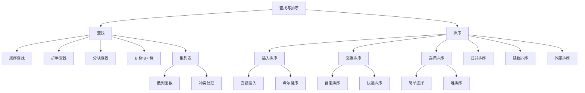

# 408 数据结构：查找与排序

> 📌 查找和排序是数据结构的两大"应用"章节。查找重点考 BST/AVL（已在树章节讲过）、B 树、散列表；排序重点考各种算法的性能对比、手工模拟和稳定性判断。这两章在 408 中占比极高，选择题几乎每年 $3$-$5$ 道，大题也经常出现。


## 📋 前置知识

- [[408 数据结构：线性表]] — 顺序查找和折半查找基于顺序表
- [[408 数据结构：串、树与二叉树]] — BST、AVL 是查找章节的核心，堆排序依赖完全二叉树
- [[时间复杂度与空间复杂度]] — 排序算法的分析核心


---

# 第一部分：查找


## 🤔 为什么要学查找？

在海量数据中快速找到目标——这是计算机最基本的需求。你在手机通讯录里搜联系人、在数据库中查记录、在搜索引擎中找网页……底层都是查找算法。

不同的数据组织方式决定了查找效率：无序数据只能一个个看（$O(n)$），有序数据可以折半查找（$O(\log n)$），散列表甚至可以一步到位（$O(1)$）。408 考的就是这些查找策略的原理、性能和适用场景。


## 🧠 核心概念


### 1.1 查找的基本概念

- **查找表**：同一类型数据元素的集合
- **关键字**（Key）：能唯一标识一个元素的属性
- **平均查找长度**（ASL, Average Search Length）：查找成功时，平均需要比较的关键字次数

$$
\text{ASL}_{\text{成功}} = \sum_{i=1}^{n} p_i \times c_i
$$

其中 $p_i$ 是查找第 $i$ 个元素的概率（等概率时 $p_i = \frac{1}{n}$），$c_i$ 是找到第 $i$ 个元素需要的比较次数。

408 也会考**查找失败的 ASL**——查找不存在的元素时平均需要多少次比较。


### 1.2 顺序查找

从头到尾逐个比较。

```cpp
// 顺序查找（带哨兵，下标 0 放哨兵，元素从下标 1 开始）
int SeqSearch(int ST[], int n, int key) {
    ST[0] = key;  // 哨兵：把 key 放在下标 0
    int i = n;
    while (ST[i] != key) i--;  // 从后往前找
    return i;  // 返回 0 表示查找失败
}
```

**哨兵**的好处：省去循环中 `i >= 1` 的越界判断，略微提高效率。

ASL 分析（等概率）：
- 成功：$\text{ASL} = \frac{1 + 2 + \cdots + n}{n} = \frac{n + 1}{2}$
- 失败：$\text{ASL} = n + 1$

时间复杂度：$O(n)$。

**有序表的顺序查找**可以优化失败情况——一旦遇到比 key 大的元素就停止。用**判定树**来分析：成功节点和失败节点交替排列，失败的 ASL 可能比无序表更优。


### 1.3 折半查找（二分查找）

> 🎯 **类比**：你在字典里查一个单词。你不会从第一页开始翻，而是翻到中间看——如果目标在前面就看前半部分，在后面就看后半部分。每次都把搜索范围砍一半。

**前提条件**：数据必须**有序**且**顺序存储**（数组）。链表不能折半查找（无法 $O(1)$ 定位中间元素）。

```cpp
// 折半查找（数组下标从 0 开始）
int BinarySearch(int A[], int n, int key) {
    int low = 0, high = n - 1;
    while (low <= high) {
        int mid = (low + high) / 2;  // 取中间位置（向下取整）
        if (A[mid] == key)
            return mid;       // 查找成功
        else if (A[mid] > key)
            high = mid - 1;   // 在左半部分找
        else
            low = mid + 1;    // 在右半部分找
    }
    return -1;  // 查找失败
}
```

**ASL 分析**：

折半查找的过程可以用一棵**判定树**（Decision Tree）来描述——它是一棵平衡的二叉排序树。

- 树的高度 $h = \lfloor \log_2 n \rfloor + 1$
- 成功 ASL $\leq h$，平均约 $\log_2(n + 1) - 1$，即 $O(\log n)$
- 失败的 ASL 需要看判定树中**外部节点**（失败节点）的层数

> 🔑 **408 超高频考点**：给你一个有序数组，画出折半查找的判定树，然后根据判定树计算成功和失败的 ASL。

**判定树的画法**：
1. $\text{mid} = \lfloor (\text{low} + \text{high}) / 2 \rfloor$ 作为根
2. 左半部分递归构建左子树，右半部分递归构建右子树
3. 每个内部节点是一个成功比较，叶子节点之间的空隙是失败情况

**举例**：有序数组 $[7, 10, 13, 16, 19, 29, 32, 33, 37, 41, 43]$（$n = 11$，下标 $0 \sim 10$）

判定树的根是 $A[5] = 29$。左子树含 $A[0..4]$，右子树含 $A[6..10]$。

成功 ASL $= \frac{1 \times 1 + 2 \times 2 + 3 \times 4 + 4 \times 4}{11} = \frac{1 + 4 + 12 + 16}{11} = \frac{33}{11} = 3$

> ⚠️ **408 注意**：`mid` 的取法（向上取整还是向下取整）会影响判定树的形状，从而影响 ASL。408 默认向下取整。


### 1.4 分块查找（索引顺序查找）

把数据分成若干块，块内无序，块间有序（前一块的最大值 < 后一块的最小值）。建立一个**索引表**，每个索引项记录该块的最大关键字和块的起始位置。

查找过程：先在**索引表**中查找确定在哪个块（可以用折半查找），再在块内**顺序查找**。

ASL = 查索引的比较次数 + 块内的比较次数。

若共 $n$ 个元素分成 $b$ 块，每块 $s$ 个元素（$b = \lceil n/s \rceil$）。索引用顺序查找时：

$$
\text{ASL} = \frac{b + 1}{2} + \frac{s + 1}{2}
$$

当 $s = \sqrt{n}$ 时 ASL 最小，约 $\sqrt{n} + 1$。


### 1.5 B 树与 B+ 树

#### B 树

> 🎯 **类比**：如果说 BST/AVL 是"瘦高个"（每个节点存一个关键字，树很高），那 B 树就是"矮胖子"——每个节点存很多个关键字，孩子很多，所以树很矮。B 树的设计目标是减少磁盘 I/O 次数——因为每次磁盘读写都很慢，而 B 树的矮个子意味着从根到叶子只需要几次磁盘读取。

**$m$ 阶 B 树的定义**（408 必背）：

1. 每个节点最多有 $m$ 棵子树（最多 $m - 1$ 个关键字）
2. 根节点至少有 $2$ 棵子树（至少 $1$ 个关键字），除非根是叶子
3. 非根非叶节点至少有 $\lceil m/2 \rceil$ 棵子树（至少 $\lceil m/2 \rceil - 1$ 个关键字）
4. **所有叶子节点在同一层**（B 树是绝对平衡的）
5. 节点内的关键字**递增有序**

> 🔑 **记忆口诀**：$m$ 阶 B 树的"下限"——根至少 $2$ 棵子树，非根至少 $\lceil m/2 \rceil$ 棵子树。"上限"——最多 $m$ 棵子树。

**B 树的高度**：含 $n$ 个关键字的 $m$ 阶 B 树，高度 $h$ 满足：

$$
\log_m(n + 1) \leq h \leq \log_{\lceil m/2 \rceil}\frac{n + 1}{2} + 1
$$

408 更常考的是：给定阶数和高度，求最多/最少能容纳多少关键字。

**B 树的插入**：

1. 在叶子节点中找到合适位置插入关键字
2. 如果插入后节点关键字数超过 $m - 1$（上溢），则**分裂**：
   - 取中间关键字 $\lceil m/2 \rceil$ 位置的关键字提升到父节点
   - 左右两部分各自成为新节点
3. 分裂可能向上传播到根——如果根也分裂，B 树增高一层

**B 树的删除**：

1. 如果删除的关键字在**非终端节点**，用前驱或后继替换后转化为在终端节点中删除
2. 在终端节点中删除后，如果关键字数少于 $\lceil m/2 \rceil - 1$（下溢）：
   - **借兄弟**：如果左/右兄弟有富余关键字，通过父节点"旋转"借一个过来
   - **合并**：如果兄弟也没富余，和兄弟合并（加上父节点中间的关键字）
3. 合并可能导致父节点下溢，继续向上传播

> ⚠️ **408 注意**：B 树的所有叶子节点在同一层，408 中的"叶子节点"有时指的是查找失败的**外部节点**（不存数据），有时指最底层的内部节点。看清题意。

#### B+ 树

B+ 树是 B 树的变体，专门为**磁盘文件系统和数据库索引**设计。

和 B 树的区别：

| 特性 | B 树 | B+ 树 |
|------|------|-------|
| 关键字位置 | 内部节点和叶子都有 | **所有数据都在叶子节点** |
| 内部节点作用 | 存数据 + 索引 | **仅作索引**，不存实际数据 |
| 叶子节点链接 | 无 | 叶子节点之间有**指针链接**成链表 |
| 子树个数 | 关键字数 $+ 1$ | 关键字数 $=$ 子树个数（不同定义） |
| 查找方式 | 可能在内部节点就找到 | 必须到叶子节点才能找到 |

B+ 树的优势：叶子节点的链表使得**范围查询**非常高效（在数据库中 `SELECT ... WHERE id BETWEEN 10 AND 100` 这种操作）。


### 1.6 散列表（Hash Table）

> 🎯 **类比**：想象一个有 $100$ 个柜子的储物间，每个柜子编号 $0 \sim 99$。你存东西时，把物品的名字通过一个"魔法公式"（散列函数）算出一个柜子编号，直接放进去。取东西时，同样算一下编号，直接打开那个柜子——几乎 $O(1)$ 就能找到。

**散列函数**（Hash Function）：将关键字映射到散列表地址的函数 $H(\text{key})$。

**冲突**（Collision）：不同的关键字被映射到同一个地址。冲突是不可避免的（关键字空间远大于地址空间），关键在于怎么处理冲突。

#### 常见散列函数

**除留余数法**（408 最常考）：

$$
H(\text{key}) = \text{key} \mod p
$$

其中 $p$ 取**不大于表长 $m$ 的最大质数**。选质数可以让散列值分布更均匀。

其他方法：直接定址法（$H = a \times \text{key} + b$）、数字分析法、平方取中法、折叠法。了解即可，408 主要考除留余数法。

#### 冲突处理方法

##### 开放定址法

冲突时，按某种探测序列寻找下一个空位。

**线性探测法**（Linear Probing）：$H_i = (H(\text{key}) + i) \mod m$，$i = 1, 2, 3, \dots$

就是依次往后找空位。容易产生**堆积**（Clustering）——已有的冲突区域越来越大，后续冲突概率也越来越高。

**平方探测法**（Quadratic Probing）：$H_i = (H(\text{key}) + d_i) \mod m$，$d_i$ 的序列为 $1^2, -1^2, 2^2, -2^2, \dots$

比线性探测分布更均匀，减轻堆积。但不能保证探测到所有位置。

**双散列法**：$H_i = (H(\text{key}) + i \times H_2(\text{key})) \mod m$

用第二个散列函数决定步长。

**再散列法/伪随机探测**：步长是伪随机序列。

##### 拉链法（链地址法）

每个散列地址对应一个**链表**。冲突的元素直接挂在对应链表上。

```cpp
#define TableSize 13

typedef struct HashNode {
    int key;
    struct HashNode *next;
} HashNode;

HashNode *hashTable[TableSize] = {NULL};

int Hash(int key) {
    return key % TableSize;  // 除留余数法
}

// 插入
void Insert(int key) {
    int h = Hash(key);
    HashNode *node = (HashNode *)malloc(sizeof(HashNode));
    node->key = key;
    node->next = hashTable[h];  // 头插法
    hashTable[h] = node;
}

// 查找
HashNode* Search(int key) {
    int h = Hash(key);
    HashNode *p = hashTable[h];
    while (p != NULL) {
        if (p->key == key) return p;
        p = p->next;
    }
    return NULL;
}
```

#### 散列表的性能分析

**装填因子**（Load Factor）：$\alpha = \frac{n}{m}$，即表中元素数除以表长。

$\alpha$ 越大，冲突越多，查找效率越低。

**ASL 分析**（408 高频计算题）：

以**线性探测法**为例，给定关键字序列和表长，手工计算每个元素的存放位置和比较次数。

**例题**：散列表长 $m = 13$，散列函数 $H(\text{key}) = \text{key} \mod 13$，用线性探测法处理冲突。依次插入 $\{16, 74, 60, 43, 54, 90, 46, 31, 29, 88\}$。

| 关键字 | $H(\text{key})$ | 实际位置 | 比较次数 |
|--------|-----------------|----------|----------|
| $16$ | $3$ | $3$ | $1$ |
| $74$ | $9$ | $9$ | $1$ |
| $60$ | $8$ | $8$ | $1$ |
| $43$ | $4$ | $4$ | $1$ |
| $54$ | $2$ | $2$ | $1$ |
| $90$ | $12$ | $12$ | $1$ |
| $46$ | $7$ | $7$ | $1$ |
| $31$ | $5$ | $5$ | $1$ |
| $29$ | $3$ → 冲突 → $4$ → 冲突 → $5$ → 冲突 → $6$ | $6$ | $4$ |
| $88$ | $10$ | $10$ | $1$ |

成功 ASL $= \frac{1 \times 9 + 4}{10} = \frac{13}{10} = 1.3$

失败 ASL：对每个散列地址 $0 \sim 12$，算出从该地址开始线性探测到空位需要的比较次数，取平均。

> ⚠️ **408 注意**：计算失败 ASL 时，不是对 $m$ 个地址取平均，而是对散列函数可能产生的**不同地址数**（即 $p$ 个）取平均。例如 $H = \text{key} \mod 13$，可能产生 $0 \sim 12$ 共 $13$ 个地址，失败 ASL 就对这 $13$ 个地址取平均。


---

# 第二部分：排序


## 🤔 为什么要学排序？

排序可能是计算机科学中被研究得最透彻的问题。408 之所以重点考排序，不仅因为排序本身重要，更因为排序算法是理解**算法设计思想**（分治、递归、贪心）和**性能分析**（时间、空间、稳定性）的最佳教材。


## 🧠 核心概念


### 2.1 排序的基本概念

**稳定性**（Stability）：如果排序前两个相等的元素 $a_i = a_j$（$i < j$），排序后 $a_i$ 仍然在 $a_j$ 前面，则该排序算法是**稳定的**。否则是**不稳定的**。

> 🔑 **为什么稳定性重要？** 当你需要对数据进行多次排序时（先按姓名排，再按成绩排），稳定的排序算法能保证在第二次排序后，成绩相同的学生仍然按姓名排好。

**内部排序 vs 外部排序**：数据全在内存中排叫内部排序，数据量太大需要借助外存叫外部排序。408 主要考内部排序。

下面我们按照 408 考纲的要求，逐一讲解每种排序算法。


### 2.2 插入排序

#### 直接插入排序

> 🎯 **类比**：就像你玩扑克牌时的整牌过程。手中的牌已经排好序，每次摸一张新牌，从右往左找到合适的位置插进去。

```cpp
// 直接插入排序
void InsertSort(int A[], int n) {
    for (int i = 1; i < n; i++) {
        if (A[i] < A[i - 1]) {   // 如果新元素比前一个小，才需要插入
            int temp = A[i];      // 暂存待插入元素
            int j;
            for (j = i - 1; j >= 0 && A[j] > temp; j--) {
                A[j + 1] = A[j]; // 比 temp 大的元素逐个后移
            }
            A[j + 1] = temp;     // 插入到正确位置
        }
    }
}
```

| 指标 | 值 |
|------|----|
| 最好 | $O(n)$（已有序，每次只比较 $1$ 次） |
| 最坏 | $O(n^2)$（逆序） |
| 平均 | $O(n^2)$ |
| 空间 | $O(1)$ |
| 稳定性 | ✅ 稳定 |

#### 折半插入排序

在已排序部分用**折半查找**找插入位置，减少比较次数。但移动次数不变，所以时间复杂度仍为 $O(n^2)$。

#### 希尔排序（Shell Sort）

> 🎯 **类比**：直接插入排序的"增强版"。先让相距较远的元素粗略排序（大步跳着比），再逐渐缩小间距，最后当间距为 $1$ 时做一次标准的插入排序。因为此时数组已经"基本有序"，插入排序会非常快。

```cpp
// 希尔排序
void ShellSort(int A[], int n) {
    // gap 从 n/2 开始，每次减半
    for (int gap = n / 2; gap >= 1; gap /= 2) {
        // 对每个子序列做直接插入排序
        for (int i = gap; i < n; i++) {
            int temp = A[i];
            int j;
            for (j = i - gap; j >= 0 && A[j] > temp; j -= gap) {
                A[j + gap] = A[j];
            }
            A[j + gap] = temp;
        }
    }
}
```

| 指标 | 值 |
|------|----|
| 时间复杂度 | 与增量序列有关，最坏 $O(n^2)$，好的增量序列可达 $O(n^{1.3})$ |
| 空间 | $O(1)$ |
| 稳定性 | ❌ **不稳定**（相同元素可能被分到不同子序列） |

> ⚠️ **408 注意**：希尔排序是**不稳定**的，这是选择题常考的判断点。而且希尔排序**只能用于顺序存储**（需要按间隔访问元素）。


### 2.3 交换排序

#### 冒泡排序

> 🎯 **类比**：像水中的气泡一样，大的元素逐渐"冒"到数组的末尾。每一趟从头到尾扫描，相邻元素比较，逆序就交换。

```cpp
// 冒泡排序
void BubbleSort(int A[], int n) {
    for (int i = 0; i < n - 1; i++) {
        bool swapped = false;  // 标记本趟是否发生交换
        for (int j = 0; j < n - 1 - i; j++) {
            if (A[j] > A[j + 1]) {
                int temp = A[j]; A[j] = A[j + 1]; A[j + 1] = temp;
                swapped = true;
            }
        }
        if (!swapped) break;  // 如果没交换，说明已有序，提前结束
    }
}
```

| 指标 | 值 |
|------|----|
| 最好 | $O(n)$（已有序，一趟扫描无交换） |
| 最坏 | $O(n^2)$（逆序） |
| 空间 | $O(1)$ |
| 稳定性 | ✅ 稳定 |

#### 快速排序（408 重点中的重点）

> 🎯 **类比**：快排就像分组站队。老师（枢轴元素）站在中间，比老师矮的站左边，比老师高的站右边。然后左边和右边的小组各自再选一个"老师"继续分……直到每组只有一个人。

**核心思想**：选一个**枢轴**（Pivot），把数组分成两部分——左边都比枢轴小，右边都比枢轴大。然后递归地对两部分排序。

```cpp
// 快速排序
int Partition(int A[], int low, int high) {
    int pivot = A[low];  // 选第一个元素作为枢轴
    while (low < high) {
        while (low < high && A[high] >= pivot) high--;  // 从右找比 pivot 小的
        A[low] = A[high];   // 放到左边
        while (low < high && A[low] <= pivot) low++;    // 从左找比 pivot 大的
        A[high] = A[low];   // 放到右边
    }
    A[low] = pivot;  // 枢轴放到最终位置
    return low;      // 返回枢轴的位置
}

void QuickSort(int A[], int low, int high) {
    if (low < high) {
        int pivotPos = Partition(A, low, high);  // 划分
        QuickSort(A, low, pivotPos - 1);          // 递归排左半部分
        QuickSort(A, pivotPos + 1, high);         // 递归排右半部分
    }
}
```

| 指标 | 值 |
|------|----|
| 最好 | $O(n \log n)$（每次枢轴恰好在中间） |
| 最坏 | $O(n^2)$（已有序或逆序，枢轴每次在极端位置） |
| 平均 | $O(n \log n)$ |
| 空间 | $O(\log n)$ 平均（递归栈深度），最坏 $O(n)$ |
| 稳定性 | ❌ **不稳定** |

> 🔑 **408 核心考点**：
> 1. 快排是**平均性能最好**的内部排序算法
> 2. 快排的最坏情况发生在数据**基本有序**时——这恰恰是插入排序的最好情况。所以快排和插入排序是"互补"的
> 3. 每趟 Partition 后，枢轴元素会被放到**最终位置**（不会再移动）。408 常考"经过一趟排序后，哪些元素一定在最终位置上"
> 4. $n$ 个元素做一次 Partition 需要比较 $n - 1$ 次（或 $n$ 次，取决于实现）


### 2.4 选择排序

#### 简单选择排序

每趟从未排序部分选出最小的元素，和未排序部分的第一个元素交换。

```cpp
void SelectSort(int A[], int n) {
    for (int i = 0; i < n - 1; i++) {
        int minIdx = i;
        for (int j = i + 1; j < n; j++) {
            if (A[j] < A[minIdx]) minIdx = j;
        }
        if (minIdx != i) {
            int temp = A[i]; A[i] = A[minIdx]; A[minIdx] = temp;
        }
    }
}
```

| 指标 | 值 |
|------|----|
| 所有情况 | $O(n^2)$（无论是否有序，都要扫描选最小值） |
| 空间 | $O(1)$ |
| 稳定性 | ❌ **不稳定**（如 $\{2_a, 2_b, 1\}$ → 第一趟 $1$ 和 $2_a$ 交换 → $2_a$ 跑到 $2_b$ 后面了） |

#### 堆排序（408 重点）

> 🎯 **类比**：堆就像一个公司的层级结构。**大顶堆**中，每个经理的工资都不低于其下属——CEO（根节点）的工资最高。每次我们把 CEO"请走"（输出最大值），然后从剩下的人中重新选出新的 CEO（调整堆）。

**堆的定义**：

- **大顶堆**（Max-Heap）：$A[i] \geq A[2i]$ 且 $A[i] \geq A[2i+1]$（父节点 $\geq$ 子节点）
- **小顶堆**（Min-Heap）：$A[i] \leq A[2i]$ 且 $A[i] \leq A[2i+1]$（父节点 $\leq$ 子节点）

堆在逻辑上是一棵**完全二叉树**，用数组存储。

**堆排序的三个步骤**：

1. **建堆**（Build Heap）：从最后一个非叶节点开始，自下而上调整
2. **输出堆顶**：堆顶是最大值（大顶堆），把它和数组末尾交换
3. **调整**（Heapify/Sift Down）：交换后堆顶可能不满足堆性质，向下调整
4. 重复 2-3，直到堆只剩一个元素

```cpp
#include <cstdio>

// 向下调整（大顶堆）
// k 是要调整的节点下标，n 是堆的大小
void SiftDown(int A[], int k, int n) {
    int temp = A[k];
    for (int i = 2 * k + 1; i < n; i = 2 * i + 1) {  // i 是左孩子（下标从 0 开始）
        if (i + 1 < n && A[i] < A[i + 1])  // 右孩子更大
            i++;
        if (temp >= A[i]) break;  // 父节点已经够大，停止
        A[k] = A[i];  // 孩子上移
        k = i;
    }
    A[k] = temp;
}

// 堆排序
void HeapSort(int A[], int n) {
    // 1. 建堆：从最后一个非叶节点开始，向下调整
    for (int i = n / 2 - 1; i >= 0; i--) {
        SiftDown(A, i, n);
    }
    // 2. 排序：每次把堆顶（最大值）换到末尾，再调整
    for (int i = n - 1; i > 0; i--) {
        int temp = A[0]; A[0] = A[i]; A[i] = temp;  // 堆顶与末尾交换
        SiftDown(A, 0, i);  // 调整剩余 i 个元素的堆
    }
}

int main() {
    int A[] = {53, 17, 78, 9, 45, 65, 87, 32};
    int n = 8;

    HeapSort(A, n);

    printf("堆排序结果：");
    for (int i = 0; i < n; i++) printf("%d ", A[i]);
    printf("\n");
    return 0;
}
```

```bash
clang++ -std=c++17 -o heapsort heapsort.cpp && ./heapsort
```

预期输出：

```text
堆排序结果：9 17 32 45 53 65 78 87
```

| 指标 | 值 |
|------|----|
| 所有情况 | $O(n \log n)$ |
| 建堆时间 | $O(n)$（不是 $O(n \log n)$！） |
| 空间 | $O(1)$ |
| 稳定性 | ❌ **不稳定** |

> 🔑 **408 考点**：
> 1. 建堆的时间是 $O(n)$，不是 $O(n \log n)$。这是 408 选择题的经典考点
> 2. 堆排序对**大规模数据**很高效，且不需要额外空间
> 3. 堆也可以用于实现**优先队列**——每次取出优先级最高（大顶堆）或最低（小顶堆）的元素
> 4. 在堆中**插入元素**：放到末尾，然后**向上调整**（Sift Up），$O(\log n)$
> 5. 在堆中**删除堆顶**：用末尾元素替换堆顶，然后**向下调整**，$O(\log n)$


### 2.5 归并排序

> 🎯 **类比**：你有一大叠试卷要按成绩排序。你先把试卷分成两半，每半再分成两半……直到每组只有一张试卷（天然有序）。然后把两组已排序的试卷**合并**成一组更大的有序试卷，依次向上合并，最终得到完全有序的一大叠。

```cpp
#include <cstdio>
#include <cstdlib>

int *temp;  // 辅助数组

// 合并两个有序子数组 A[low..mid] 和 A[mid+1..high]
void Merge(int A[], int low, int mid, int high) {
    int i = low, j = mid + 1, k = low;
    // 把两部分按序复制到 temp
    while (i <= mid && j <= high) {
        if (A[i] <= A[j])       // <= 保证稳定性
            temp[k++] = A[i++];
        else
            temp[k++] = A[j++];
    }
    while (i <= mid) temp[k++] = A[i++];
    while (j <= high) temp[k++] = A[j++];
    // 复制回原数组
    for (int t = low; t <= high; t++) A[t] = temp[t];
}

void MergeSort(int A[], int low, int high) {
    if (low < high) {
        int mid = (low + high) / 2;
        MergeSort(A, low, mid);       // 递归排左半
        MergeSort(A, mid + 1, high);  // 递归排右半
        Merge(A, low, mid, high);     // 合并
    }
}

int main() {
    int A[] = {53, 17, 78, 9, 45, 65, 87, 32};
    int n = 8;
    temp = (int *)malloc(n * sizeof(int));

    MergeSort(A, 0, n - 1);

    printf("归并排序结果：");
    for (int i = 0; i < n; i++) printf("%d ", A[i]);
    printf("\n");
    free(temp);
    return 0;
}
```

```bash
clang++ -std=c++17 -o mergesort mergesort.cpp && ./mergesort
```

预期输出：

```text
归并排序结果：9 17 32 45 53 65 78 87
```

| 指标 | 值 |
|------|----|
| 所有情况 | $O(n \log n)$ |
| 空间 | $O(n)$（辅助数组） |
| 稳定性 | ✅ **稳定** |

> 💡 归并排序是唯一在**最坏情况下也能保持 $O(n \log n)$** 且**稳定**的排序算法。代价是需要 $O(n)$ 的额外空间。


### 2.6 基数排序

> 🎯 **类比**：你要给一叠银行卡号排序。不比较卡号大小，而是先按**最后一位数字**分成 $10$ 堆（$0 \sim 9$），按顺序收回；再按**倒数第二位**分堆收回……直到按最高位分堆收回。最终就排好了。

基数排序**不基于比较**，而是基于**分配和收集**。

对于 $n$ 个 $d$ 位数，每位有 $r$ 种取值（如十进制 $r = 10$）：

| 指标 | 值 |
|------|----|
| 时间 | $O(d \times (n + r))$ |
| 空间 | $O(r)$（$r$ 个队列/桶） |
| 稳定性 | ✅ **稳定** |

> ⚠️ **408 注意**：基数排序从**最低位**（LSD）开始排，不是从最高位开始。每趟分配+收集必须是**稳定的**（用队列保证 FIFO），否则之前的排序会被打乱。


### 2.7 外部排序（简要）

当数据量太大，无法全部放入内存时，需要外部排序。核心方法是**多路归并排序**：

1. 把数据分成若干段，每段在内存中排序后写回外存，形成**初始归并段**
2. 对初始归并段进行**多路归并**（用**败者树/胜者树**加速选最小值）
3. 减少磁盘 I/O 次数是关键优化目标

**置换-选择排序**：用于生成更长的初始归并段（平均长度为内存容量的 $2$ 倍）。

**最佳归并树**：类似哈夫曼树的思想，安排归并顺序使总 I/O 次数最少。

408 对外部排序的考察通常是选择题，考概念和多路归并的 I/O 次数计算。


## 🔄 排序算法总对比（408 核心表格）

| 算法 | 最好 | 平均 | 最坏 | 空间 | 稳定 |
|------|------|------|------|------|------|
| 直接插入 | $O(n)$ | $O(n^2)$ | $O(n^2)$ | $O(1)$ | ✅ |
| 折半插入 | $O(n \log n)$ 比较 | $O(n^2)$ | $O(n^2)$ | $O(1)$ | ✅ |
| 希尔排序 | — | $O(n^{1.3})$ | $O(n^2)$ | $O(1)$ | ❌ |
| 冒泡排序 | $O(n)$ | $O(n^2)$ | $O(n^2)$ | $O(1)$ | ✅ |
| 快速排序 | $O(n \log n)$ | $O(n \log n)$ | $O(n^2)$ | $O(\log n)$ | ❌ |
| 简单选择 | $O(n^2)$ | $O(n^2)$ | $O(n^2)$ | $O(1)$ | ❌ |
| 堆排序 | $O(n \log n)$ | $O(n \log n)$ | $O(n \log n)$ | $O(1)$ | ❌ |
| 归并排序 | $O(n \log n)$ | $O(n \log n)$ | $O(n \log n)$ | $O(n)$ | ✅ |
| 基数排序 | $O(d(n+r))$ | $O(d(n+r))$ | $O(d(n+r))$ | $O(r)$ | ✅ |

> 🔑 **稳定性记忆口诀**：**不稳定的有四个——"快希选堆"（快速排序、希尔排序、选择排序、堆排序）**，其余都是稳定的。

> 💡 **适用场景总结**：
> - 数据基本有序 → **插入排序**最优
> - 大规模随机数据 → **快速排序**平均最快
> - 需要保证最坏情况 → **堆排序**或**归并排序**
> - 需要稳定性 → **归并排序**（大数据）或**插入排序**（小数据）
> - 关键字位数少且值域有限 → **基数排序**


## ⚠️ 常见误区与踩坑点

> ❌ **误区 1：快排总是最快的**
> 快排的**平均**性能最好，但**最坏**情况是 $O(n^2)$（数据基本有序时）。如果需要保证最坏情况效率，用堆排序或归并排序。

> ❌ **误区 2：堆排序建堆是 $O(n \log n)$**
> 建堆是 $O(n)$，不是 $O(n \log n)$。这是因为大多数节点在底层，调整高度很小。严格证明涉及等比数列求和。

> ⚠️ **踩坑 3：折半查找一定比顺序查找快**
> 折半查找要求数据**有序**且**顺序存储**。如果数据是链表或无序的，折半查找无法使用。而且对于很小的数据量（$n < 10$），顺序查找可能更快（分支预测友好）。

> ⚠️ **踩坑 4：散列表查找失败的 ASL 计算**
> 失败 ASL 是对**散列函数可能产生的所有地址**取平均（不是对表中元素取平均），每个地址的失败比较次数是从该地址开始探测到**第一个空位**所需的次数。

> ⚠️ **踩坑 5：快排每趟结束后，枢轴一定在最终位置**
> 这是正确的！408 经常给你一个数组和一个"经过若干趟排序后的状态"，问用的是什么算法。判断方法：如果每趟恰好有一个元素到达了最终位置，那很可能是快排或选择排序。

> ⚠️ **踩坑 6：B 树的阶数 $m$ 和关键字数的关系**
> $m$ 阶 B 树每个节点最多 $m - 1$ 个关键字（不是 $m$ 个！），最多 $m$ 棵子树。非根节点至少 $\lceil m/2 \rceil - 1$ 个关键字。


## 🏋️ 动手练习

### 练习 1：手工模拟快排的一趟划分（⭐⭐ 难度）

**题目**：对数组 $\{49, 38, 65, 97, 76, 13, 27, 49'\}$（$49'$ 表示第二个 $49$），以第一个元素 $49$ 为枢轴，执行一趟 Partition，写出结果数组和枢轴位置。

**参考答案**：

初始：`[49, 38, 65, 97, 76, 13, 27, 49']`，pivot $= 49$，low $= 0$，high $= 7$

- high 从右找小于 $49$ 的：$49' \geq 49$? 不确定（取决于实现，用 $\geq$ 则 high 停在 $49'$ 处）。但标准实现中 `A[high] >= pivot` 时 high 左移。$49' \geq 49$，high--；$27 < 49$，停在 high $= 6$。$A[0] = 27$
- low 从左找大于 $49$ 的：$27 \leq 49$, $38 \leq 49$, $65 > 49$，停在 low $= 2$。$A[6] = 65$
- high 继续：$13 < 49$，停在 high $= 5$。$A[2] = 13$
- low 继续：$13 \leq 49$, $97 > 49$，停在 low $= 3$。$A[5] = 97$
- high 继续：$97 \geq 49$, $76 \geq 49$，high $= 3$，low $=$ high $= 3$
- $A[3] = 49$

结果：`[27, 38, 13, 49, 76, 97, 65, 49']`，枢轴 $49$ 在下标 $3$。

注意 $49'$（原本在 $49$ 后面）现在在下标 $7$，仍在 $49$ 后面。但更复杂的情况下它们的相对顺序可能改变——这就是快排不稳定的原因。

### 练习 2：散列表构建与 ASL 计算（⭐⭐⭐ 难度）

**题目**：用散列函数 $H(\text{key}) = \text{key} \mod 11$，表长 $m = 11$，线性探测法。依次插入 $\{1, 13, 12, 34, 38, 33, 27, 22\}$，构造散列表并计算查找成功和失败的 ASL。

**参考答案**：

| 关键字 | $H$ | 探测序列 | 最终位置 | 比较次数 |
|--------|------|----------|----------|----------|
| $1$ | $1$ | $1$ | $1$ | $1$ |
| $13$ | $2$ | $2$ | $2$ | $1$ |
| $12$ | $1$ | $1 \to 2 \to 3$ | $3$ | $3$ |
| $34$ | $1$ | $1 \to 2 \to 3 \to 4$ | $4$ | $4$ |
| $38$ | $5$ | $5$ | $5$ | $1$ |
| $33$ | $0$ | $0$ | $0$ | $1$ |
| $27$ | $5$ | $5 \to 6$ | $6$ | $2$ |
| $22$ | $0$ | $0 \to 1 \to 2 \to 3 \to 4 \to 5 \to 6 \to 7$ | $7$ | $8$ |

散列表：

| 下标 | $0$ | $1$ | $2$ | $3$ | $4$ | $5$ | $6$ | $7$ | $8$ | $9$ | $10$ |
|------|-----|-----|-----|-----|-----|-----|-----|-----|-----|-----|------|
| 值 | $33$ | $1$ | $13$ | $12$ | $34$ | $38$ | $27$ | $22$ | — | — | — |

成功 ASL $= \frac{1 + 1 + 3 + 4 + 1 + 1 + 2 + 8}{8} = \frac{21}{8} = 2.625$

失败 ASL（对地址 $0 \sim 10$，计算从各地址到第一个空位的探测次数）：

| 地址 | $0$ | $1$ | $2$ | $3$ | $4$ | $5$ | $6$ | $7$ | $8$ | $9$ | $10$ |
|------|-----|-----|-----|-----|-----|-----|-----|-----|-----|-----|------|
| 探测到空位需比较 | $9$ | $8$ | $7$ | $6$ | $5$ | $4$ | $3$ | $2$ | $1$ | $1$ | $1$ |

失败 ASL $= \frac{9 + 8 + 7 + 6 + 5 + 4 + 3 + 2 + 1 + 1 + 1}{11} = \frac{47}{11} \approx 4.27$

### 练习 3：建大顶堆（⭐⭐ 难度）

**题目**：对数组 $\{53, 17, 78, 9, 45, 65, 87, 32\}$ 建大顶堆，写出每一步调整后的结果。

**参考答案**：

初始：$[53, 17, 78, 9, 45, 65, 87, 32]$

完全二叉树形态：

```text
        53
       /  \
      17   78
     / \   / \
    9  45 65  87
   /
  32
```

从最后一个非叶节点（下标 $3$，值 $9$）开始向下调整：

- 下标 $3$：$9$ vs 子节点 $32$ → 交换 → $[53, 17, 78, 32, 45, 65, 87, 9]$
- 下标 $2$：$78$ vs 子节点 $65, 87$ → $87$ 更大 → 交换 → $[53, 17, 87, 32, 45, 65, 78, 9]$
- 下标 $1$：$17$ vs 子节点 $32, 45$ → $45$ 更大 → 交换 → $[53, 45, 87, 32, 17, 65, 78, 9]$
- 下标 $0$：$53$ vs 子节点 $45, 87$ → $87$ 更大 → 交换 → $[87, 45, 53, 32, 17, 65, 78, 9]$。交换后 $53$ 继续向下调整：$53$ vs $65, 78$ → $78$ 更大 → 交换 → $[87, 45, 78, 32, 17, 65, 53, 9]$

最终大顶堆：$[87, 45, 78, 32, 17, 65, 53, 9]$


## 📝 总结

### 本篇要点回顾

1. **折半查找**要求有序顺序表，ASL 约 $\log_2(n+1) - 1$。画判定树是计算 ASL 的标准方法。
2. **B 树**是多路平衡查找树，$m$ 阶 B 树每个节点最多 $m - 1$ 个关键字。所有叶子在同一层。插入可能分裂，删除可能合并。
3. **散列表**通过散列函数直接定位，理想 $O(1)$。冲突处理有开放定址法（线性/平方/双散列）和拉链法。装填因子 $\alpha$ 决定性能。
4. **排序算法**的核心对比：快排平均最优 $O(n \log n)$ 但最坏 $O(n^2)$；归并排序稳定且最坏 $O(n \log n)$ 但需要 $O(n)$ 空间；堆排序原地 $O(n \log n)$ 但不稳定。
5. **稳定性口诀**："快希选堆"不稳定，其余稳定。
6. **建堆**是 $O(n)$，不是 $O(n \log n)$。

### 知识图谱




## 🔗 相关链接

- 上级概念：[[408 数据结构总览]]
- 前置概念：[[408 数据结构：线性表]]、[[408 数据结构：串、树与二叉树]]、[[408 数据结构：图]]
- 下级概念：[[红黑树]]、[[B+ 树索引]]、[[败者树与外部排序]]、[[计数排序与桶排序]]
- 实际应用：[[数据库索引原理]]、[[搜索引擎倒排索引]]、[[操作系统进程调度（优先队列/堆）]]


## 📚 参考资料

- [王道考研《数据结构》](https://www.wangdao.com/) — 本篇对应王道第七章（查找）和第八章（排序），选择题重灾区
- [严蔚敏《数据结构（C 语言版）》](https://book.douban.com/subject/24699581/) — 排序算法的复杂度证明最详尽
- [VisuAlgo 排序可视化](https://visualgo.net/zh/sorting) — 动画演示各种排序算法的执行过程
- [数据结构排序算法比较](https://www.cs.usfca.edu/~galles/visualization/ComparisonSort.html) — 交互式排序可视化
- [B-Tree Visualization](https://www.cs.usfca.edu/~galles/visualization/BTree.html) — B 树的插入删除动画
