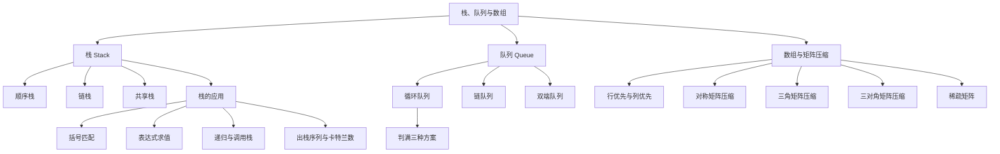

# 408 数据结构：栈、队列与数组

> 📌 栈和队列是两种"操作受限"的线性表——栈只能从一端进出（后进先出），队列只能从一端进、另一端出（先进先出）。数组则是线性表的推广，408 重点考察特殊矩阵的压缩存储。这三块内容在 408 中选择题和应用题都是高频考点。


## 📋 前置知识

在开始之前，你需要了解这些概念（如果不熟悉，先点击链接去补课）：

- [[408 数据结构：线性表]] — 栈和队列的本质就是受限的线性表，顺序表和链表的实现思路直接复用
- [[C 语言指针基础]] — 链栈和链队都依赖指针操作
- [[时间复杂度与空间复杂度]] — 分析各种操作的效率


## 🤔 为什么要学这个？

**栈的场景**：你用浏览器上网，每打开一个新页面就"压入"历史记录，点击"后退"按钮就"弹出"最近的一条记录——这就是栈的行为。编译器解析括号匹配、函数调用时保存返回地址、表达式求值……这些全靠栈。

**队列的场景**：你去食堂打饭，先排队的人先打到饭——这就是队列。操作系统的进程调度、打印机的打印任务排队、广度优先搜索（BFS）……都依赖队列。

**数组的场景**：当你需要存储一个 $n \times n$ 的对称矩阵时，如果老老实实开一个二维数组，有将近一半的空间是浪费的（因为 $a_{ij} = a_{ji}$）。压缩存储让你只用大约一半的空间就够了——408 最爱考的就是压缩存储的下标对应公式。

这三个主题看似独立，实际上在 408 真题中经常组合出题：用栈实现队列、用队列实现栈、栈的应用（表达式求值、递归转非递归）、循环队列的判满条件、矩阵压缩的公式推导……每一个都是高频考点。


## 🧠 核心概念


### 一、栈（Stack）

#### 1.1 栈的定义

> 🎯 **类比**：把栈想象成一摞盘子。你只能从最上面放盘子（入栈），也只能从最上面拿盘子（出栈）。最后放上去的盘子最先被拿走——这就是**后进先出**（LIFO, Last In First Out）。

正式定义：栈是一种**只允许在一端进行插入和删除操作**的线性表。允许操作的一端叫做**栈顶**（Top），不允许操作的一端叫做**栈底**（Bottom）。

核心操作只有两个：
- **入栈**（Push）：把元素放到栈顶
- **出栈**（Pop）：把栈顶元素取出

还有一个辅助操作：
- **读栈顶**（GetTop / Peek）：看一眼栈顶元素是什么，但不取出来

> ⚠️ **关键理解**：栈是对线性表的**操作限制**，而不是一种全新的数据结构。你可以用顺序表实现栈（顺序栈），也可以用链表实现栈（链栈），底层结构没变，只是限制了"只能从一端操作"。

#### 1.2 顺序栈的实现

顺序栈用数组来存储栈中的元素，用一个变量 `top` 来记录栈顶的位置。

**这里有一个 408 经典考点**：`top` 的初始值到底是 $-1$ 还是 $0$？两种约定都有，但行为不同：

| 约定 | 初始值 | 含义 | 入栈操作 | 出栈操作 |
|------|--------|------|----------|----------|
| `top` 指向栈顶元素 | $-1$（空栈） | `top` 是最后一个元素的下标 | 先 `++top`，再赋值 | 先取值，再 `top--` |
| `top` 指向栈顶上方 | $0$（空栈） | `top` 是下一个可用位置的下标 | 先赋值，再 `++top` | 先 `--top`，再取值 |

408 最常用的是**第一种约定**（`top` 初始为 $-1$，指向栈顶元素）：

```cpp
#include <cstdio>

#define MaxSize 50

typedef struct {
    int data[MaxSize];  // 数组存放栈中元素
    int top;            // 栈顶指针（指向栈顶元素的下标）
} SqStack;

// 初始化
void InitStack(SqStack &S) {
    S.top = -1;  // 初始化栈顶指针为 -1，表示空栈
}

// 判空
bool StackEmpty(SqStack S) {
    return S.top == -1;
}

// 入栈
bool Push(SqStack &S, int x) {
    if (S.top == MaxSize - 1) return false;  // 栈满
    S.data[++S.top] = x;  // 先移动栈顶指针，再赋值
    return true;
}

// 出栈
bool Pop(SqStack &S, int &x) {
    if (S.top == -1) return false;  // 栈空
    x = S.data[S.top--];  // 先取值，再移动栈顶指针
    return true;
}

// 读栈顶
bool GetTop(SqStack S, int &x) {
    if (S.top == -1) return false;
    x = S.data[S.top];  // 只读不移动
    return true;
}

int main() {
    SqStack S;
    InitStack(S);

    // 入栈 1, 2, 3
    Push(S, 1);
    Push(S, 2);
    Push(S, 3);

    int x;
    GetTop(S, x);
    printf("栈顶元素：%d\n", x);  // 3

    Pop(S, x);
    printf("出栈：%d\n", x);  // 3
    Pop(S, x);
    printf("出栈：%d\n", x);  // 2
    Pop(S, x);
    printf("出栈：%d\n", x);  // 1

    printf("栈是否为空：%s\n", StackEmpty(S) ? "是" : "否");
    return 0;
}
```

```bash
clang++ -std=c++17 -o sqstack sqstack.cpp && ./sqstack
```

预期输出：

```text
栈顶元素：3
出栈：3
出栈：2
出栈：1
栈是否为空：是
```

> ⚠️ **踩坑**：`S.data[++S.top] = x` 和 `S.data[S.top++] = x` 的区别非常关键。前者是"先加再赋值"（适用于 `top` 初始为 $-1$ 的约定），后者是"先赋值再加"（适用于 `top` 初始为 $0$ 的约定）。408 代码填空经常考这个。

#### 1.3 共享栈

> 🎯 **类比**：想象一个走廊，两个人分别从两端开始往中间堆东西。一个人从左边开始堆（$0$ 号栈），另一个人从右边开始堆（$1$ 号栈），直到两人的东西在中间碰头，空间才算满了。

共享栈（Shared Stack）让两个栈共享同一个数组空间，$0$ 号栈从数组头部往后增长，$1$ 号栈从数组尾部往前增长：

```cpp
#define MaxSize 50

typedef struct {
    int data[MaxSize];
    int top0;  // 0 号栈的栈顶指针，初始为 -1
    int top1;  // 1 号栈的栈顶指针，初始为 MaxSize
} ShStack;

void InitStack(ShStack &S) {
    S.top0 = -1;       // 0 号栈从左往右长
    S.top1 = MaxSize;  // 1 号栈从右往左长
}

// 栈满条件：两个栈顶指针相邻
// top0 + 1 == top1 时，中间没有空位了
```

**408 考点**：
- 共享栈的**栈满条件**是 `top0 + 1 == top1`
- 共享栈的**栈空条件**：$0$ 号栈空是 `top0 == -1`，$1$ 号栈空是 `top1 == MaxSize`
- 共享栈的好处：当一个栈元素较少时，另一个栈可以利用多余的空间，提高了空间利用率

#### 1.4 链栈

用链表实现的栈。通常用**不带头节点的单链表**，链表头就是栈顶。入栈就是头插法，出栈就是删除头节点。

```cpp
typedef struct StackNode {
    int data;
    struct StackNode *next;
} StackNode, *LinkStack;

// 入栈（头插法）
bool Push(LinkStack &S, int x) {
    StackNode *p = (StackNode *)malloc(sizeof(StackNode));
    if (p == NULL) return false;
    p->data = x;
    p->next = S;  // 新节点指向原来的栈顶
    S = p;         // 栈顶指针指向新节点
    return true;
}

// 出栈（删除头节点）
bool Pop(LinkStack &S, int &x) {
    if (S == NULL) return false;  // 栈空
    StackNode *p = S;
    x = p->data;
    S = S->next;  // 栈顶指针后移
    free(p);
    return true;
}
```

链栈的优点：不会栈满溢出（除非内存耗尽）。缺点：每个节点需要额外的指针空间。

#### 1.5 栈的应用（408 超高频考点）

##### 应用一：括号匹配

这是 408 经典应用题。算法思路：

1. 遇到左括号 `(`、`[`、`{` → 入栈
2. 遇到右括号 → 弹出栈顶，检查是否匹配
3. 如果栈空时遇到右括号 → 不匹配（右括号多了）
4. 扫描结束后栈不空 → 不匹配（左括号多了）

```cpp
#include <cstdio>
#include <cstring>

#define MaxSize 100

typedef struct {
    char data[MaxSize];
    int top;
} SqStack;

void InitStack(SqStack &S) { S.top = -1; }
bool Push(SqStack &S, char x) { S.data[++S.top] = x; return true; }
bool Pop(SqStack &S, char &x) { if (S.top == -1) return false; x = S.data[S.top--]; return true; }
bool StackEmpty(SqStack S) { return S.top == -1; }

bool BracketMatch(const char *str) {
    SqStack S;
    InitStack(S);
    for (int i = 0; str[i] != '\0'; i++) {
        if (str[i] == '(' || str[i] == '[' || str[i] == '{') {
            Push(S, str[i]);  // 左括号入栈
        } else if (str[i] == ')' || str[i] == ']' || str[i] == '}') {
            if (StackEmpty(S)) return false;  // 右括号多余
            char top;
            Pop(S, top);
            // 检查是否匹配
            if (str[i] == ')' && top != '(') return false;
            if (str[i] == ']' && top != '[') return false;
            if (str[i] == '}' && top != '{') return false;
        }
    }
    return StackEmpty(S);  // 栈空说明全部匹配
}

int main() {
    printf("({[]}) 匹配：%s\n", BracketMatch("({[]})") ? "是" : "否");
    printf("([)] 匹配：%s\n", BracketMatch("([)]") ? "是" : "否");
    printf("((( 匹配：%s\n", BracketMatch("(((") ? "是" : "否");
    return 0;
}
```

```bash
clang++ -std=c++17 -o bracket bracket.cpp && ./bracket
```

预期输出：

```text
({[]}) 匹配：是
([)] 匹配：否
((( 匹配：否
```

##### 应用二：表达式求值（中缀、后缀、前缀转换）

这是 408 **最重要的栈应用考点**，几乎每年都会涉及。我们需要理解三种表达式表示法：

- **中缀表达式**（Infix）：运算符在两个操作数**中间**，如 $a + b \times c$。这是我们人类习惯的写法。
- **后缀表达式**（Postfix，又叫逆波兰表达式 RPN）：运算符在两个操作数**后面**，如 $a \; b \; c \times +$。计算机求值最方便。
- **前缀表达式**（Prefix，又叫波兰表达式）：运算符在两个操作数**前面**，如 $+ \; a \; \times \; b \; c$。

**中缀转后缀的手工方法**（408 选择题常考）：

1. 按运算优先级给中缀表达式加满括号
2. 把每个运算符移到对应的**右括号后面**
3. 去掉所有括号

举例：$a + b \times c - d$

- 加括号：$((a + (b \times c)) - d)$
- 移运算符到右括号后：$((a \; (b \; c \times) +) \; d -)$
- 去括号：$a \; b \; c \times + \; d -$

**后缀表达式求值算法**（用栈）：

1. 从左到右扫描后缀表达式
2. 遇到**操作数** → 入栈
3. 遇到**运算符** → 弹出两个操作数，计算结果，把结果入栈
4. 扫描结束，栈中唯一的元素就是结果

> ⚠️ **注意出栈顺序**：先弹出的是**右操作数**，后弹出的是**左操作数**。对于减法和除法，顺序反了结果就错了。比如后缀表达式 `5 3 -`，先弹出 $3$（右），再弹出 $5$（左），结果是 $5 - 3 = 2$，不是 $3 - 5 = -2$。

```cpp
#include <cstdio>
#include <cstring>
#include <cstdlib>

#define MaxSize 100

typedef struct {
    double data[MaxSize];
    int top;
} NumStack;

void Init(NumStack &S) { S.top = -1; }
void Push(NumStack &S, double x) { S.data[++S.top] = x; }
double Pop(NumStack &S) { return S.data[S.top--]; }

// 后缀表达式求值（用空格分隔 token）
// 示例输入："5 3 + 2 *" 表示 (5+3)*2 = 16
double EvalPostfix(const char *expr) {
    NumStack S;
    Init(S);
    char token[20];
    int pos = 0;
    int len = strlen(expr);

    while (pos < len) {
        // 跳过空格
        while (pos < len && expr[pos] == ' ') pos++;
        if (pos >= len) break;

        // 读取一个 token
        int t = 0;
        while (pos < len && expr[pos] != ' ') {
            token[t++] = expr[pos++];
        }
        token[t] = '\0';

        // 判断是运算符还是操作数
        if (t == 1 && (token[0] == '+' || token[0] == '-' ||
                       token[0] == '*' || token[0] == '/')) {
            double b = Pop(S);  // 先弹出的是右操作数
            double a = Pop(S);  // 后弹出的是左操作数
            switch (token[0]) {
                case '+': Push(S, a + b); break;
                case '-': Push(S, a - b); break;
                case '*': Push(S, a * b); break;
                case '/': Push(S, a / b); break;
            }
        } else {
            Push(S, atof(token));  // 操作数入栈
        }
    }
    return Pop(S);  // 栈中最后一个值就是结果
}

int main() {
    // (5 + 3) * 2 的后缀表达式是 "5 3 + 2 *"
    printf("5 3 + 2 * = %.0f\n", EvalPostfix("5 3 + 2 *"));
    // 5 + 3 * 2 的后缀表达式是 "5 3 2 * +"
    printf("5 3 2 * + = %.0f\n", EvalPostfix("5 3 2 * +"));
    return 0;
}
```

```bash
clang++ -std=c++17 -o postfix postfix.cpp && ./postfix
```

预期输出：

```text
5 3 + 2 * = 16
5 3 2 * + = 11
```

##### 应用三：栈与递归

函数调用时，系统会自动维护一个**函数调用栈**（Call Stack）：

- 每次调用函数 → 把返回地址、局部变量等信息**压入**调用栈
- 函数返回 → **弹出**栈顶的信息，恢复到调用点继续执行

这就是为什么递归函数如果没有终止条件，会导致**栈溢出**（Stack Overflow）——调用栈的空间是有限的。

408 考点：递归可以用**显式的栈**来模拟，把递归转换为非递归（迭代）。这在树的遍历中尤其重要。

#### 1.6 栈的出栈序列问题（408 必考）

给定入栈序列 $1, 2, 3, \dots, n$，可能的出栈序列有多少种？哪些序列是合法的？

**判断方法**：模拟入栈和出栈的过程。对于一个候选出栈序列，用一个栈来模拟：
- 按入栈序列依次入栈
- 每次入栈后，检查栈顶是否等于出栈序列的当前元素；如果是，就出栈，并继续比较下一个
- 最终如果出栈序列全部匹配完毕，则合法

举例：入栈序列 $1, 2, 3$，判断 $3, 1, 2$ 是否合法：
- 入 $1$，栈：$[1]$，期望出 $3$，不匹配
- 入 $2$，栈：$[1, 2]$，期望出 $3$，不匹配
- 入 $3$，栈：$[1, 2, 3]$，期望出 $3$，匹配！出栈，栈：$[1, 2]$
- 期望出 $1$，栈顶是 $2$，不匹配。而且入栈序列已经用完了，无法继续 → **不合法**

合法的出栈序列总数是**卡特兰数**（Catalan Number）：

$$
C_n = \frac{1}{n+1}\binom{2n}{n} = \frac{(2n)!}{(n+1)! \cdot n!}
$$

例如 $n = 3$ 时，$C_3 = 5$，共有 $5$ 种合法的出栈序列。

> ⚠️ **408 常考选择题**：给你一个入栈序列和一个出栈序列，问是否合法。最快的判断方法就是上面的模拟法。也有一个快速排除法：**在出栈序列中，如果 $a$ 在 $b$ 之前出栈，且 $a$ 比 $b$ 后入栈（即 $a > b$），那么所有在 $a$ 和 $b$ 之间入栈的元素，必须在 $b$ 之前出栈**。

理解了栈之后，我们来看它的"镜像"——队列。栈是"后进先出"，队列则是"先进先出"。


### 二、队列（Queue）

#### 2.1 队列的定义

> 🎯 **类比**：队列就是排队买奶茶。新来的人只能站到队尾（入队），买到奶茶的人从队头离开（出队）。先来的人先买到——这就是**先进先出**（FIFO, First In First Out）。

正式定义：队列是一种**只允许在一端插入、在另一端删除**的线性表。允许插入的一端叫**队尾**（Rear），允许删除的一端叫**队头**（Front）。

核心操作：
- **入队**（EnQueue）：在队尾插入元素
- **出队**（DeQueue）：从队头删除元素

#### 2.2 顺序队列与"假溢出"问题

如果直接用数组实现队列，`front` 指向队头，`rear` 指向队尾的下一个位置。入队时 `rear++`，出队时 `front++`。

问题来了：随着入队出队的进行，`front` 和 `rear` 都在往右移动。即使数组前面有空位（之前出队留下的），`rear` 到达数组末尾时就会报"满"——但实际上数组前面还有空间！这就叫**假溢出**（False Overflow）。

> 🎯 **类比**：想象一个圆形的旋转寿司台。寿司从一端放上去，顾客从另一端取走。寿司台是环形的，放到尽头就自动回到起点继续放——永远不会"假溢出"。

解决方案就是——循环队列。

#### 2.3 循环队列（408 超高频考点）

把数组想象成一个**环**，当 `rear` 到达数组末尾时，如果前面有空位，就"绕回去"继续用。实现方式是**取模运算**：

```text
rear = (rear + 1) % MaxSize
front = (front + 1) % MaxSize
```

**核心难点：怎么区分"队空"和"队满"？**

如果 `front == rear` 时，到底是空还是满？这是循环队列最经典的问题。408 有三种解决方案：

**方案一：牺牲一个存储单元（最常用，408 默认）**

规定：`front == rear` 是空，`(rear + 1) % MaxSize == front` 是满。也就是说，`rear` 指向的那个位置永远不存数据，当 `rear` 的下一个位置就是 `front` 时，就认为满了。

实际能存 `MaxSize - 1` 个元素。

```cpp
#include <cstdio>

#define MaxSize 5  // 数组大小为 5，实际只能存 4 个元素

typedef struct {
    int data[MaxSize];
    int front;  // 队头指针（指向队头元素）
    int rear;   // 队尾指针（指向队尾元素的下一个位置）
} SqQueue;

// 初始化
void InitQueue(SqQueue &Q) {
    Q.front = Q.rear = 0;
}

// 判空
bool QueueEmpty(SqQueue Q) {
    return Q.front == Q.rear;
}

// 判满（牺牲一个单元法）
bool QueueFull(SqQueue Q) {
    return (Q.rear + 1) % MaxSize == Q.front;
}

// 入队
bool EnQueue(SqQueue &Q, int x) {
    if (QueueFull(Q)) return false;  // 队满
    Q.data[Q.rear] = x;              // 在队尾放入元素
    Q.rear = (Q.rear + 1) % MaxSize; // 队尾指针后移（取模实现循环）
    return true;
}

// 出队
bool DeQueue(SqQueue &Q, int &x) {
    if (QueueEmpty(Q)) return false;    // 队空
    x = Q.data[Q.front];                // 取出队头元素
    Q.front = (Q.front + 1) % MaxSize;  // 队头指针后移
    return true;
}

// 队列中元素个数
int QueueLength(SqQueue Q) {
    return (Q.rear - Q.front + MaxSize) % MaxSize;
}

int main() {
    SqQueue Q;
    InitQueue(Q);

    EnQueue(Q, 10);
    EnQueue(Q, 20);
    EnQueue(Q, 30);
    EnQueue(Q, 40);
    printf("入队 10,20,30,40 后，队列长度：%d\n", QueueLength(Q));

    bool ok = EnQueue(Q, 50);
    printf("再入队 50（应失败）：%s\n", ok ? "成功" : "失败");

    int x;
    DeQueue(Q, x);
    printf("出队：%d\n", x);

    EnQueue(Q, 50);
    printf("出队一个后再入队 50，队列长度：%d\n", QueueLength(Q));
    return 0;
}
```

```bash
clang++ -std=c++17 -o circqueue circqueue.cpp && ./circqueue
```

预期输出：

```text
入队 10,20,30,40 后，队列长度：4
再入队 50（应失败）：失败
出队：10
出队一个后再入队 50，队列长度：4
```

**方案二：增加一个 `size` 变量记录元素个数**

```cpp
typedef struct {
    int data[MaxSize];
    int front, rear;
    int size;  // 当前队列中的元素个数
} SqQueue;

// 判空：size == 0
// 判满：size == MaxSize
// 入队时 size++，出队时 size--
```

这种方案不浪费空间，能存满 `MaxSize` 个元素。

**方案三：增加一个 `tag` 标志位**

用 `tag` 记录最近一次操作是入队还是出队：
- `tag == 1`（最近一次是入队）且 `front == rear` → 队满
- `tag == 0`（最近一次是出队）且 `front == rear` → 队空

> 💡 **408 做题技巧**：如果题目没有明确说用哪种方案，默认是**方案一（牺牲一个单元）**。如果题目说"队列最多能存 $n$ 个元素，数组大小为 $n$"，那可能用的是方案二或方案三。

**队列元素个数公式**（方案一）：

$$
\text{length} = (\text{rear} - \text{front} + \text{MaxSize}) \mod \text{MaxSize}
$$

> ⚠️ **为什么要加 MaxSize？** 因为 `rear` 可能比 `front` 小（rear 绕了一圈回到前面），直接相减是负数。加上 `MaxSize` 再取模就能得到正确的非负结果。这个公式是 408 选择题的超高频考点。

#### 2.4 链队列

用链表实现的队列。通常用**带头节点的单链表**，设两个指针：`front` 指向头节点，`rear` 指向最后一个节点。

```cpp
#include <cstdio>
#include <cstdlib>

typedef struct LinkNode {
    int data;
    struct LinkNode *next;
} LinkNode;

typedef struct {
    LinkNode *front;  // 队头指针（指向头节点）
    LinkNode *rear;   // 队尾指针（指向最后一个数据节点）
} LinkQueue;

// 初始化（带头节点）
void InitQueue(LinkQueue &Q) {
    Q.front = Q.rear = (LinkNode *)malloc(sizeof(LinkNode));
    Q.front->next = NULL;  // 头节点 next 为空
}

// 判空
bool QueueEmpty(LinkQueue Q) {
    return Q.front == Q.rear;  // 头节点和尾指针指向同一个节点
}

// 入队（尾插法）
void EnQueue(LinkQueue &Q, int x) {
    LinkNode *s = (LinkNode *)malloc(sizeof(LinkNode));
    s->data = x;
    s->next = NULL;
    Q.rear->next = s;  // 把新节点接到队尾
    Q.rear = s;         // 更新尾指针
}

// 出队（删除头节点后的第一个节点）
bool DeQueue(LinkQueue &Q, int &x) {
    if (QueueEmpty(Q)) return false;
    LinkNode *p = Q.front->next;  // p 指向队头数据节点
    x = p->data;
    Q.front->next = p->next;      // 头节点指向下一个
    if (Q.rear == p)               // 如果删除的是最后一个节点
        Q.rear = Q.front;         // 队尾指针也要更新！
    free(p);
    return true;
}

int main() {
    LinkQueue Q;
    InitQueue(Q);

    EnQueue(Q, 10);
    EnQueue(Q, 20);
    EnQueue(Q, 30);

    int x;
    DeQueue(Q, x);
    printf("出队：%d\n", x);
    DeQueue(Q, x);
    printf("出队：%d\n", x);
    DeQueue(Q, x);
    printf("出队：%d\n", x);
    printf("队列是否为空：%s\n", QueueEmpty(Q) ? "是" : "否");
    return 0;
}
```

```bash
clang++ -std=c++17 -o linkqueue linkqueue.cpp && ./linkqueue
```

预期输出：

```text
出队：10
出队：20
出队：30
队列是否为空：是
```

> ⚠️ **踩坑**：链队列出队时，如果删除的是**最后一个数据节点**（即 `Q.rear == p`），必须把 `Q.rear` 重新指向头节点，否则 `Q.rear` 变成野指针。这是 408 代码填空的常见考点。

#### 2.5 双端队列（Deque）

双端队列（Double-Ended Queue，简称 Deque，读作"deck"）允许在**两端**都进行插入和删除操作。408 通常考的是它的两种受限变体：

- **输入受限的双端队列**：只允许从**一端插入**，但可以从**两端删除**
- **输出受限的双端队列**：可以从**两端插入**，但只允许从**一端删除**

408 考点通常是：给定一个输入序列，问在某种受限双端队列中，哪些输出序列是合法的。解题方法和栈的出栈序列类似——模拟操作过程。

理解了栈和队列之后，我们来看本章的第三部分——数组和特殊矩阵的压缩存储。


### 三、数组与特殊矩阵压缩存储

#### 3.1 数组的存储结构

数组本身很简单——一维数组就是顺序表，多维数组是线性表的推广。408 关注的重点是**多维数组的地址计算**。

对于一个二维数组 $A[m][n]$（$m$ 行 $n$ 列，下标从 $0$ 开始），有两种存储方式：

**行优先存储**（Row-Major，C/C++ 默认）：先存第 $0$ 行的所有元素，再存第 $1$ 行……

$$
\text{Loc}(a_{ij}) = \text{Loc}(a_{00}) + (i \times n + j) \times \text{sizeof}(\text{ElemType})
$$

**列优先存储**（Column-Major，Fortran 默认）：先存第 $0$ 列的所有元素，再存第 $1$ 列……

$$
\text{Loc}(a_{ij}) = \text{Loc}(a_{00}) + (j \times m + i) \times \text{sizeof}(\text{ElemType})
$$

> ⚠️ **408 注意**：题目如果说"按行优先存储"，用第一个公式；说"按列优先存储"，用第二个公式。还要注意下标是从 $0$ 开始还是从 $1$ 开始——从 $1$ 开始时公式中的 $i$ 和 $j$ 要减 $1$。

#### 3.2 特殊矩阵的压缩存储

"特殊矩阵"是指元素有规律分布的矩阵。由于存在大量重复元素或零元素，可以用更少的空间来存储。408 重点考察以下几种：

##### 对称矩阵

对称矩阵满足 $a_{ij} = a_{ji}$，所以只需要存储**下三角区域**（包括主对角线）。

对于一个 $n \times n$ 的对称矩阵，下三角区域的元素个数为：

$$
\frac{n(n + 1)}{2}
$$

我们用一个一维数组 $B[0 \dots \frac{n(n+1)}{2} - 1]$ 来存储。

**下标映射公式**（下标从 $1$ 开始，即 $a_{ij}$ 中 $i, j \in [1, n]$）：

当 $i \geq j$（下三角区域，包括对角线）时，$a_{ij}$ 在一维数组中的位置是：

$$
k = \frac{i(i-1)}{2} + j - 1
$$

当 $i < j$（上三角区域）时，利用对称性 $a_{ij} = a_{ji}$，交换 $i$ 和 $j$ 后用同一个公式。

> 🔑 **公式怎么记？** $\frac{i(i-1)}{2}$ 是前 $i - 1$ 行一共有多少个元素（第 $1$ 行 $1$ 个，第 $2$ 行 $2$ 个……第 $i-1$ 行 $i-1$ 个，求和得 $\frac{(i-1)i}{2}$），$j - 1$ 是第 $i$ 行中 $a_{ij}$ 前面有多少个元素。最后减 $1$ 是因为一维数组下标从 $0$ 开始。

> ⚠️ **408 常见变体**：如果题目说"按行优先存储上三角"，那公式会变。如果下标从 $0$ 开始，公式也会微调。做题时一定要看清题目的约定。

##### 三角矩阵

**下三角矩阵**：上三角区域的元素全部相同（通常是 $0$ 或某个常数 $c$）。存储方式和对称矩阵类似，下三角区域按行存储，再在数组末尾加一个位置存储那个常数 $c$。

一维数组大小：$\frac{n(n+1)}{2} + 1$。

下三角元素的映射公式同对称矩阵。上三角区域所有元素都映射到数组的最后一个位置（下标 $\frac{n(n+1)}{2}$）。

**上三角矩阵**类似，只是存的是上三角区域。

##### 三对角矩阵（带状矩阵）

三对角矩阵中，所有非零元素集中在以主对角线为中心的 $3$ 条对角线上。即当 $|i - j| > 1$ 时，$a_{ij} = 0$。

对于 $n \times n$ 的三对角矩阵，非零元素个数为 $3n - 2$（第一行和最后一行各 $2$ 个，其余每行 $3$ 个）。

**下标映射公式**（下标从 $1$ 开始）：

$$
k = 2(i - 1) + (j - 1)  = 2i + j - 3
$$

反过来，已知 $k$，求 $i$ 和 $j$：

$$
i = \left\lfloor \frac{k + 1}{3} \right\rfloor + 1, \quad j = k - 2i + 3
$$

> ⚠️ **408 考法**：给你 $a_{ij}$，问它在一维数组中的下标是多少？或者给你一维数组的下标 $k$，问它对应矩阵中的哪个位置？一定要注意 $i, j$ 从 $0$ 还是从 $1$ 开始。

##### 稀疏矩阵

稀疏矩阵中绝大多数元素是 $0$，非零元素很少。用普通二维数组存储太浪费，常用的压缩存储方式有：

**三元组表**：把每个非零元素存为一个三元组 $(i, j, v)$，表示第 $i$ 行第 $j$ 列的值为 $v$。所有三元组按行优先排列。

**十字链表**：每个非零元素是一个节点，同时链入行链表和列链表中。适合非零元素经常变动的场景。

408 对稀疏矩阵的考察较浅，主要是选择题问"用什么存储方式"，极少考代码。


## 🔄 概念对比

### 栈 vs 队列

| 特性 | 栈 | 队列 |
|------|------|------|
| 操作原则 | 后进先出（LIFO） | 先进先出（FIFO） |
| 操作端 | 只有栈顶一端 | 队头删除，队尾插入 |
| 典型应用 | 括号匹配、表达式求值、递归、DFS | 层序遍历、BFS、进程调度 |
| 顺序实现的判满 | `top == MaxSize - 1` | `(rear + 1) % MaxSize == front` |
| 顺序实现的判空 | `top == -1` | `front == rear` |

### 顺序队列 vs 链队列

| 特性 | 顺序队列（循环队列） | 链队列 |
|------|----------------------|--------|
| 空间 | 固定大小，可能溢出 | 动态分配，一般不溢出 |
| 判满 | 需要判断（取模比较） | 一般不需要（除非内存耗尽） |
| 适用场景 | 能预估最大长度时 | 长度变化大、无法预估时 |

> 💡 **一句话总结区别**：栈像叠盘子（后放先拿），队列像排队（先来先走）。循环队列通过取模操作解决了假溢出问题。


## ⚠️ 常见误区与踩坑点

> ❌ **误区 1：循环队列 `front == rear` 一定是空的**
> 在"牺牲一个单元"的方案中确实如此，但如果用 `size` 或 `tag` 方案，`front == rear` 也可能是满的！做题时一定要看清用的是哪种方案。

> ❌ **误区 2：后缀表达式求值时不需要管操作数的顺序**
> 对于加法和乘法确实不影响（交换律），但对于减法和除法，先弹出的是**右操作数**，后弹出的是**左操作数**。$5 \; 3 \; -$ 的结果是 $5 - 3 = 2$，不是 $3 - 5 = -2$。

> ⚠️ **踩坑 3：`top` 初始值不同导致操作顺序不同**
> `top = -1` 时入栈是"先加后赋"（`S.data[++S.top] = x`），`top = 0` 时入栈是"先赋后加"（`S.data[S.top++] = x`）。如果搞混了，要么丢数据要么下标越界。

> ⚠️ **踩坑 4：链队列出队时忘记更新 `rear`**
> 当队列中只剩一个数据节点时，出队会让 `front->next` 变成 `NULL`。但如果忘了把 `rear` 重置为 `front`，`rear` 就变成野指针。后续入队操作会产生未定义行为。

> ⚠️ **踩坑 5：对称矩阵压缩存储的下标起点**
> 公式 $k = \frac{i(i-1)}{2} + j - 1$ 适用于矩阵下标从 $1$ 开始、数组下标从 $0$ 开始的情况。如果题目的矩阵下标从 $0$ 开始，需要把 $i$ 和 $j$ 各加 $1$ 后再代入，或者重新推导。


## 🏋️ 动手练习

### 练习 1：用两个栈实现队列（⭐⭐ 难度）

**题目**：用两个栈 $S_1$ 和 $S_2$ 实现一个队列。要求实现入队和出队操作。

**思路**：$S_1$ 专门负责入队，$S_2$ 专门负责出队。出队时如果 $S_2$ 为空，就把 $S_1$ 的所有元素倒入 $S_2$（顺序翻转，正好变成 FIFO）。

**参考答案**：

```cpp
#include <cstdio>

#define MaxSize 50

typedef struct {
    int data[MaxSize];
    int top;
} SqStack;

void InitStack(SqStack &S) { S.top = -1; }
bool StackEmpty(SqStack S) { return S.top == -1; }
bool Push(SqStack &S, int x) {
    if (S.top == MaxSize - 1) return false;
    S.data[++S.top] = x;
    return true;
}
bool Pop(SqStack &S, int &x) {
    if (S.top == -1) return false;
    x = S.data[S.top--];
    return true;
}

// 用两个栈实现的队列
typedef struct {
    SqStack S1;  // 入队栈
    SqStack S2;  // 出队栈
} StackQueue;

void InitQueue(StackQueue &Q) {
    InitStack(Q.S1);
    InitStack(Q.S2);
}

// 入队：直接压入 S1
bool EnQueue(StackQueue &Q, int x) {
    return Push(Q.S1, x);
}

// 出队：从 S2 弹出；如果 S2 空了，先把 S1 全倒进 S2
bool DeQueue(StackQueue &Q, int &x) {
    if (!StackEmpty(Q.S2)) {
        return Pop(Q.S2, x);  // S2 不空，直接弹
    }
    // S2 空了，把 S1 的元素全部倒过来
    if (StackEmpty(Q.S1)) return false;  // 两个栈都空，队列为空
    int temp;
    while (!StackEmpty(Q.S1)) {
        Pop(Q.S1, temp);
        Push(Q.S2, temp);  // 从 S1 弹出，压入 S2
    }
    return Pop(Q.S2, x);
}

int main() {
    StackQueue Q;
    InitQueue(Q);

    EnQueue(Q, 1);
    EnQueue(Q, 2);
    EnQueue(Q, 3);

    int x;
    DeQueue(Q, x); printf("出队：%d\n", x);  // 应该是 1
    DeQueue(Q, x); printf("出队：%d\n", x);  // 应该是 2

    EnQueue(Q, 4);
    EnQueue(Q, 5);

    DeQueue(Q, x); printf("出队：%d\n", x);  // 应该是 3
    DeQueue(Q, x); printf("出队：%d\n", x);  // 应该是 4
    DeQueue(Q, x); printf("出队：%d\n", x);  // 应该是 5
    return 0;
}
```

```bash
clang++ -std=c++17 -o stack_queue stack_queue.cpp && ./stack_queue
```

预期输出：

```text
出队：1
出队：2
出队：3
出队：4
出队：5
```

### 练习 2：对称矩阵的压缩存储与还原（⭐⭐ 难度）

**题目**：将一个 $4 \times 4$ 的对称矩阵压缩存储到一维数组中，然后从一维数组还原出完整矩阵。矩阵下标从 $1$ 开始，数组下标从 $0$ 开始。

**参考答案**：

```cpp
#include <cstdio>

#define N 4
#define SIZE (N * (N + 1) / 2)  // 压缩数组大小 = 10

// 对称矩阵下标(i,j)映射到一维数组下标 k（i,j 从 1 开始）
int MapIndex(int i, int j) {
    if (i < j) {  // 上三角 -> 利用对称性交换
        int temp = i; i = j; j = temp;
    }
    return i * (i - 1) / 2 + j - 1;  // 下三角公式
}

int main() {
    // 原始对称矩阵（下标从 1 到 4）
    int matrix[N + 1][N + 1] = {
        {0, 0, 0, 0, 0},  // 占位行（下标 0 不用）
        {0, 1, 2, 3, 4},
        {0, 2, 5, 6, 7},
        {0, 3, 6, 8, 9},
        {0, 4, 7, 9, 10}
    };

    // 压缩存储：只存下三角
    int B[SIZE];
    for (int i = 1; i <= N; i++) {
        for (int j = 1; j <= i; j++) {  // j <= i 表示下三角（含对角线）
            B[MapIndex(i, j)] = matrix[i][j];
        }
    }

    printf("压缩数组 B：");
    for (int k = 0; k < SIZE; k++) printf("%d ", B[k]);
    printf("\n");

    // 从压缩数组还原完整矩阵
    printf("还原矩阵：\n");
    for (int i = 1; i <= N; i++) {
        for (int j = 1; j <= N; j++) {
            printf("%3d", B[MapIndex(i, j)]);
        }
        printf("\n");
    }
    return 0;
}
```

```bash
clang++ -std=c++17 -o symmetric symmetric.cpp && ./symmetric
```

预期输出：

```text
压缩数组 B：1 2 5 3 6 8 4 7 9 10
还原矩阵：
  1  2  3  4
  2  5  6  7
  3  6  8  9
  4  7  9 10
```

### 练习 3：判断出栈序列是否合法（⭐⭐⭐ 难度）

**题目**：给定入栈序列 $1, 2, 3, 4, 5$，编写程序判断某个出栈序列是否合法。

**参考答案**：

```cpp
#include <cstdio>

#define MaxSize 100

typedef struct {
    int data[MaxSize];
    int top;
} SqStack;

void InitStack(SqStack &S) { S.top = -1; }
bool StackEmpty(SqStack S) { return S.top == -1; }
void Push(SqStack &S, int x) { S.data[++S.top] = x; }
int Pop(SqStack &S) { return S.data[S.top--]; }
int Top(SqStack S) { return S.data[S.top]; }

// 判断出栈序列 out[] 是否合法
// in[] 是入栈序列，n 是长度
bool IsValidPopSequence(int in[], int out[], int n) {
    SqStack S;
    InitStack(S);
    int j = 0;  // j 扫描出栈序列
    for (int i = 0; i < n; i++) {
        Push(S, in[i]);  // 按入栈序列依次入栈
        // 栈顶等于当前期望的出栈元素时，持续出栈
        while (!StackEmpty(S) && Top(S) == out[j]) {
            Pop(S);
            j++;
        }
    }
    return StackEmpty(S);  // 栈空说明全部匹配成功
}

int main() {
    int in[] = {1, 2, 3, 4, 5};

    int out1[] = {4, 5, 3, 2, 1};  // 合法
    int out2[] = {4, 3, 5, 1, 2};  // 不合法
    int out3[] = {3, 2, 1, 4, 5};  // 合法

    printf("4,5,3,2,1: %s\n", IsValidPopSequence(in, out1, 5) ? "合法" : "不合法");
    printf("4,3,5,1,2: %s\n", IsValidPopSequence(in, out2, 5) ? "合法" : "不合法");
    printf("3,2,1,4,5: %s\n", IsValidPopSequence(in, out3, 5) ? "合法" : "不合法");
    return 0;
}
```

```bash
clang++ -std=c++17 -o popseq popseq.cpp && ./popseq
```

预期输出：

```text
4,5,3,2,1: 合法
4,3,5,1,2: 不合法
3,2,1,4,5: 合法
```


## 📝 总结

### 本篇要点回顾

1. **栈**是后进先出（LIFO）的线性表，核心应用包括括号匹配、表达式求值（中缀转后缀、后缀求值）、递归调用。`top` 初始值（$-1$ 还是 $0$）决定了入栈出栈的操作顺序。
2. **队列**是先进先出（FIFO）的线性表。循环队列通过取模运算解决假溢出，判空判满有三种方案（牺牲单元 / size / tag），默认用牺牲一个单元法。
3. **栈的出栈序列问题**：合法序列数是卡特兰数 $C_n$，判断方法是模拟入栈出栈过程。
4. **数组的地址计算**：行优先和列优先公式不同，注意下标起点。
5. **特殊矩阵压缩**：对称矩阵存下三角，$k = \frac{i(i-1)}{2} + j - 1$；三角矩阵末尾多存一个常数；三对角矩阵 $k = 2i + j - 3$。

### 知识图谱




## 🔗 相关链接

- 上级概念：[[408 数据结构总览]]
- 前置概念：[[408 数据结构：线性表]]
- 同级概念：[[串]]、[[树与二叉树]]、[[图]]
- 下级概念：[[中缀转后缀算法详解]]、[[递归转非递归]]、[[稀疏矩阵的十字链表]]
- 实际应用：[[BFS 广度优先搜索]]（队列应用）、[[DFS 深度优先搜索]]（栈应用）、[[表达式树]]


## 📚 参考资料

- [王道考研《数据结构》](https://www.wangdao.com/) — 本篇对应王道第三章，循环队列和表达式求值是重中之重
- [严蔚敏《数据结构（C 语言版）》](https://book.douban.com/subject/24699581/) — 对栈和队列的抽象数据类型定义最严谨
- [数据结构可视化 VisuAlgo](https://visualgo.net/zh/list) — 可动画演示栈和队列操作
- [卡特兰数 - Wikipedia](https://zh.wikipedia.org/wiki/%E5%8D%A1%E5%A1%94%E5%85%B0%E6%95%B0) — 了解出栈序列计数的数学背景
