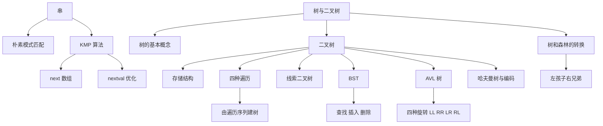

# 408 数据结构：串、树与二叉树

> 📌 串（字符串）的核心考点就是模式匹配——朴素算法和 KMP 算法。树与二叉树则是 408 中考察密度最高的章节，从性质推导、遍历算法、线索化到 BST、平衡树、哈夫曼树，几乎年年都是大题的出题范围。


## 📋 前置知识

- [[408 数据结构：线性表]] — 串是特殊的线性表，树的孩子链表用到链表
- [[408 数据结构：栈、队列与数组]] — 树的非递归遍历用栈，层序遍历用队列
- [[C 语言指针基础]] — 链式存储的树节点全靠指针
- [[时间复杂度与空间复杂度]] — 分析 KMP、遍历、建树的效率


---

# 第一部分：串与模式匹配


## 🤔 为什么要学串的模式匹配？

你用编辑器按 `Ctrl+F` 搜索一段文字，浏览器在网页中查找关键词，基因序列比对在 DNA 长链中寻找特定片段——这些场景的本质都是**模式匹配**（Pattern Matching）：在一个长字符串（**主串**）中查找一个短字符串（**模式串**）出现的位置。

朴素算法（暴力匹配）很直觉但慢，KMP 算法通过预处理模式串，避免了主串指针回溯，把时间复杂度从 $O(m \times n)$ 降到了 $O(m + n)$。KMP 是 408 的**必考算法**，几乎每年至少一道选择题。


## 🧠 核心概念


### 1.1 串的基本概念

串（String）是由**零个或多个字符**组成的有限序列，记作 $S = \text{"} a_1 a_2 \dots a_n \text{"}$。

几个术语：
- **串长**：字符个数 $n$。空串的串长为 $0$，记作 $S = \text{""}$
- **子串**：串中任意个**连续字符**组成的子序列。空串是任何串的子串
- **主串**：包含子串的那个串
- **字符位置**：从 $1$ 开始编号（408 约定）

> ⚠️ **注意**：408 中串的位序从 $1$ 开始。代码实现中数组下标可能从 $0$ 或 $1$ 开始，做题时看清题目约定。

串的存储有**定长顺序存储**（字符数组）、**堆分配存储**（动态 `malloc`）和**块链存储**（链表每个节点存多个字符）三种，408 选择题偶尔考，了解即可。重点在模式匹配算法。


### 1.2 朴素模式匹配（Brute Force）

> 🎯 **类比**：你在一本书里找一个词。你从书的第 $1$ 个字开始，逐字对比。一旦某个字不匹配，你就从书的第 $2$ 个字重新开始对比。这就是朴素匹配——简单但低效。

算法思路：用两个指针 $i$（扫描主串）和 $j$（扫描模式串）。逐字符比较，一旦失配，$i$ 回退到本次匹配起点的下一位，$j$ 回到 $1$。

```cpp
// 朴素模式匹配（下标从 1 开始，S[0] 和 T[0] 存长度）
int Index_BF(char S[], char T[]) {
    int i = 1, j = 1;
    while (i <= S[0] && j <= T[0]) {
        if (S[i] == T[j]) {
            i++;  // 匹配成功，两个指针都后移
            j++;
        } else {
            i = i - j + 2;  // i 回退到本次匹配起点的下一位
            j = 1;           // j 回到模式串开头
        }
    }
    if (j > T[0]) return i - T[0];  // 匹配成功，返回匹配起始位置
    return 0;  // 匹配失败
}
```

**时间复杂度**：最好 $O(n)$（第一趟就匹配成功），最坏 $O(m \times n)$（如主串 `"aaaaab"` 匹配模式串 `"aab"`，每次几乎比完模式串才失败，然后 $i$ 大幅回退）。

> ⚠️ **关键公式**：失配时 `i = i - j + 2`。这行的含义是：$i$ 当前走了 $j - 1$ 步，要回退 $j - 1$ 步（回到起点），再前进 $1$ 步（从下一个位置重新开始）。408 代码填空常考这一行。

朴素算法的核心问题是**主串指针 $i$ 会回退**。每次失配，$i$ 要回到"差不多之前的位置"重新比较，大量已经比过的字符被浪费了。KMP 算法的核心思想就是：**让 $i$ 永远不回退**。


### 1.3 KMP 算法（408 必考）

> 🎯 **类比**：想象你用一把有刻度的尺子（模式串）沿着一条直线（主串）滑动。朴素算法每次失配后尺子只往右移 $1$ 格。但如果你预先分析过尺子上的刻度规律（哪些段是重复的前后缀），失配时就可以直接滑动更多格——因为你已经知道前面那些字符一定是匹配的，不需要重新比。

#### KMP 的核心思想

当模式串的第 $j$ 个字符失配时，不回退主串指针 $i$，而是把模式串右滑到一个合适的位置继续比较。这个"合适的位置"就是 $\text{next}[j]$。

$\text{next}[j]$ 的含义：模式串中前 $j - 1$ 个字符组成的子串的**最长相等前后缀的长度** $+ 1$。

**什么是"前缀"和"后缀"？**

对于字符串 $\text{"abcab"}$：
- **前缀**：从第一个字符开始的连续子串（不包含自身）：`a`、`ab`、`abc`、`abca`
- **后缀**：以最后一个字符结尾的连续子串（不包含自身）：`b`、`ab`、`cab`、`bcab`
- **最长相等前后缀**：前缀和后缀中相等的最长的那个。这里是 `ab`，长度为 $2$

#### next 数组的手工求法

这是 408 **每年必考**的计算题。对于模式串 $T = t_1 t_2 \dots t_m$：

- $\text{next}[1] = 0$（固定值，表示模式串第 $1$ 个字符就失配时，主串指针后移）
- $\text{next}[2] = 1$（固定值，前面只有 $1$ 个字符，最长相等前后缀长度为 $0$，加 $1$ 得 $1$）
- 对于 $j \geq 3$：看 $t_1 \dots t_{j-1}$ 这个子串的最长相等前后缀长度，设为 $k$，则 $\text{next}[j] = k + 1$

**手工例题**：求模式串 `"abaabcac"` 的 next 数组。

| $j$ | 子串 $t_1 \dots t_{j-1}$ | 最长相等前后缀 | 长度 | $\text{next}[j]$ |
|-----|--------------------------|----------------|------|-------------------|
| $1$ | （空） | — | — | $0$ |
| $2$ | `a` | 无 | $0$ | $1$ |
| $3$ | `ab` | 无 | $0$ | $1$ |
| $4$ | `aba` | `a` | $1$ | $2$ |
| $5$ | `abaa` | `a` | $1$ | $2$ |
| $6$ | `abaab` | `ab` | $2$ | $3$ |
| $7$ | `abaabc` | 无 | $0$ | $1$ |
| $8$ | `abaabca` | `a` | $1$ | $2$ |

结果：$\text{next} = [0, 1, 1, 2, 2, 3, 1, 2]$

> 🔑 **做题技巧**：从左到右扫描子串，尝试最长的可能匹配。先看长度为 $j - 2$ 的前缀和后缀是否相等，不等就看 $j - 3$ 的……直到找到相等的或者长度为 $0$。熟练后可以利用递推关系加速：如果 $t_j = t_{\text{next}[j]}$，下一个值可以在当前基础上 $+1$。

#### KMP 算法代码

```cpp
#include <cstdio>
#include <cstring>

// 求 next 数组（下标从 1 开始）
void GetNext(char T[], int next[]) {
    int j = 1, k = 0;
    next[1] = 0;
    while (j < (int)T[0]) {  // T[0] 存的是模式串长度
        if (k == 0 || T[j] == T[k]) {
            j++;
            k++;
            next[j] = k;  // next[j] = 前 j-1 个字符的最长相等前后缀长度 + 1
        } else {
            k = next[k];  // k 回退（利用已知的 next 值）
        }
    }
}

// KMP 主算法
int Index_KMP(char S[], char T[], int next[]) {
    int i = 1, j = 1;
    while (i <= (int)S[0] && j <= (int)T[0]) {
        if (j == 0 || S[i] == T[j]) {
            i++;  // 主串指针永远不回退，只前进
            j++;
        } else {
            j = next[j];  // 模式串指针跳到 next[j]
        }
    }
    if (j > (int)T[0]) return i - (int)T[0];
    return 0;
}

int main() {
    // S[0] 和 T[0] 存长度
    char S[] = "\x0e" "abaabcacabaabcac";  // 长度 14... 用简单例子代替
    char T[] = "\x06" "abaabcac";

    // 为了简洁，改用更简单的方式
    // 主串和模式串，下标从 1 开始
    char S2[100] = {0};
    char T2[100] = {0};
    const char *s = "ababaabcacabaabcac";
    const char *t = "abaabcac";
    S2[0] = strlen(s);
    T2[0] = strlen(t);
    for (int i = 0; i < (int)strlen(s); i++) S2[i + 1] = s[i];
    for (int i = 0; i < (int)strlen(t); i++) T2[i + 1] = t[i];

    int next[100];
    GetNext(T2, next);

    printf("模式串：%s\n", t);
    printf("next 数组：");
    for (int i = 1; i <= (int)T2[0]; i++) printf("%d ", next[i]);
    printf("\n");

    int pos = Index_KMP(S2, T2, next);
    printf("主串：%s\n", s);
    printf("匹配位置：%d\n", pos);
    return 0;
}
```

```bash
clang++ -std=c++17 -o kmp kmp.cpp && ./kmp
```

预期输出：

```text
模式串：abaabcac
next 数组：0 1 1 2 2 3 1 2
主串：ababaabcacabaabcac
匹配位置：4
```

#### nextval 数组（KMP 的优化）

next 数组有一个小缺陷：如果 $t_j$ 和 $t_{\text{next}[j]}$ 相同，那么跳到 $\text{next}[j]$ 之后仍然会失配（因为是同一个字符），白跳了一次。

$\text{nextval}$ 对此进行优化：

$$
\text{nextval}[j] = \begin{cases} \text{next}[j] & \text{if } t_j \neq t_{\text{next}[j]} \\ \text{nextval}[\text{next}[j]] & \text{if } t_j = t_{\text{next}[j]} \end{cases}
$$

直觉理解：如果跳过去发现是同一个字符（一定还会失配），就继续往前跳，直到遇到不同的字符。

408 选择题可能同时要求你写 next 和 nextval。做法是先求 next，再逐位检查是否需要"继承"。

**时间复杂度**：KMP 算法整体为 $O(m + n)$，其中求 next 数组 $O(m)$，匹配过程 $O(n)$。$m$ 是模式串长度，$n$ 是主串长度。

> ⚠️ **408 注意**：不同教材的 next 数组定义可能差 $1$（有的从 $0$ 开始，有的定义 $\text{next}[1] = -1$）。王道教材用的是上面的约定（$\text{next}[1] = 0$），做真题时务必看清。


---

# 第二部分：树与二叉树

这是 408 数据结构中**篇幅最大、考频最高**的章节。


## 🤔 为什么要学树？

现实世界中很多关系不是"一对一"的（线性表），而是"一对多"的：
- 文件系统的目录结构（一个文件夹包含多个子文件夹）
- 公司的组织架构（一个经理管理多个员工）
- HTML/XML 的 DOM 结构（一个标签包含多个子标签）
- 数据库的 B 树索引

树是表达这种"一对多"层次关系最自然的数据结构。而二叉树则是树的特殊形式，它结构简洁、性质丰富，是几乎所有树形结构算法的基础。


## 🧠 核心概念


### 2.1 树的基本概念

> 🎯 **类比**：把树想象成一个家族的族谱。最上面是老祖宗（根节点），每个人可以有若干个孩子（子节点），没有孩子的人是家族的"最后一代"（叶子节点）。

**正式定义**：树（Tree）是 $n$（$n \geq 0$）个节点的有限集合。当 $n = 0$ 时叫空树。在非空树中：
- 有且仅有一个特殊的节点叫做**根**（Root）
- 其余节点可以分为 $m$（$m \geq 0$）个互不相交的有限集合 $T_1, T_2, \dots, T_m$，每个集合本身又是一棵树，称为根的**子树**（Subtree）

这是一个**递归定义**——树的子树还是树。

#### 基本术语（408 选择题高频考区）

- **节点的度**（Degree）：一个节点的**子树个数**。度为 $0$ 的节点叫**叶子节点**（终端节点）
- **树的度**：树中所有节点的度的**最大值**
- **深度/层次**：根节点为第 $1$ 层（408 默认），其子节点为第 $2$ 层……节点所在的层数就是它的深度
- **树的高度（深度）**：最大层数
- **路径长度**：从一个节点到另一个节点经过的**边数**
- **有序树 vs 无序树**：子树之间有没有先后顺序之分
- **森林**（Forest）：$m$（$m \geq 0$）棵互不相交的树的集合

> ⚠️ **408 必知的性质**：设树中节点总数为 $n$，则树的**边数** $= n - 1$。因为除了根以外，每个节点头上恰好有一条边连到它的父亲。

#### 树的重要性质

**性质 1**：树中的节点数等于所有节点的度之和加 $1$。

$$
n = 1 + \sum_{i} d_i
$$

其中 $d_i$ 是第 $i$ 个节点的度。直觉：每条边对应一个非根节点，而"度之和"就是总边数，加上根节点的 $1$。

**性质 2**：度为 $m$ 的树中，第 $i$ 层最多有 $m^{i-1}$ 个节点（$i \geq 1$）。

**性质 3**：高度为 $h$ 的 $m$ 叉树最多有 $\frac{m^h - 1}{m - 1}$ 个节点（等比数列求和）。

这些性质是 408 选择题的"公式集"。


### 2.2 二叉树

#### 定义与特点

> 🎯 **类比**：如果普通的树是"每个人可以有任意多个孩子"的族谱，那二叉树就是"每个人最多只能有两个孩子——老大（左孩子）和老二（右孩子）"的族谱。而且老大和老二是区分左右的，只有老大没有老二 ≠ 只有老二没有老大。

正式定义：二叉树是 $n$（$n \geq 0$）个节点的有限集合，它要么是空树，要么由一个**根节点**和两棵互不相交的、分别称为**左子树**和**右子树**的二叉树组成。

**二叉树 ≠ 度为 2 的有序树**。区别：
- 二叉树的每个节点最多 $2$ 个孩子，且严格区分左右。即使只有一个孩子，也要明确是左孩子还是右孩子
- 度为 $2$ 的树要求至少有一个节点的度为 $2$，而二叉树允许所有节点的度都小于 $2$
- 二叉树可以是空树，但度为 $2$ 的树至少有 $3$ 个节点

#### 特殊二叉树

**满二叉树**（Full Binary Tree）：每一层都是满的。高度为 $h$ 的满二叉树有 $2^h - 1$ 个节点。第 $i$ 层有 $2^{i-1}$ 个节点。

**完全二叉树**（Complete Binary Tree）：除了最后一层外，其余各层都是满的，且最后一层的节点**从左到右连续排列**（中间不能有空位）。

> 🎯 **类比**：满二叉树像一个完美的金字塔，每一层都排满了人。完全二叉树像一个"差一点满"的金字塔——最后一层从左到右排人，排到某个位置就停了，但不能跳着排。

**完全二叉树的重要性质**（408 超高频）：

对 $n$ 个节点的完全二叉树，按层序编号 $1, 2, \dots, n$：

1. 节点 $i$ 的**左孩子**编号为 $2i$（如果 $2i > n$ 则无左孩子）
2. 节点 $i$ 的**右孩子**编号为 $2i + 1$（如果 $2i + 1 > n$ 则无右孩子）
3. 节点 $i$ 的**父节点**编号为 $\lfloor i/2 \rfloor$（$i = 1$ 时无父节点，它是根）
4. 节点 $i$ 所在的**层数**为 $\lfloor \log_2 i \rfloor + 1$
5. $n$ 个节点的完全二叉树的**高度**为 $\lfloor \log_2 n \rfloor + 1$

**二叉排序树**（BST）、**平衡二叉树**（AVL）、**哈夫曼树**我们后面单独讲。

#### 二叉树的五大性质（408 必背）

**性质 1**：非空二叉树上，叶子节点数 $= $ 度为 $2$ 的节点数 $+ 1$。

$$
n_0 = n_2 + 1
$$

> 🔑 **推导**：设度为 $0, 1, 2$ 的节点数分别为 $n_0, n_1, n_2$。
> - 节点总数：$n = n_0 + n_1 + n_2$
> - 边数 $= n - 1$（树的通用性质）
> - 边数也等于所有节点的度之和：$0 \cdot n_0 + 1 \cdot n_1 + 2 \cdot n_2 = n_1 + 2n_2$
> - 因此 $n - 1 = n_1 + 2n_2$，即 $n_0 + n_1 + n_2 - 1 = n_1 + 2n_2$，化简得 $n_0 = n_2 + 1$。

**性质 2**：二叉树第 $i$ 层最多有 $2^{i-1}$ 个节点。

**性质 3**：高度为 $h$ 的二叉树最多有 $2^h - 1$ 个节点。

**性质 4**：具有 $n$ 个节点的完全二叉树的高度为 $\lfloor \log_2 n \rfloor + 1$。

**性质 5**：对于完全二叉树，度为 $1$ 的节点数 $n_1$ 要么是 $0$，要么是 $1$。
- $n$ 为偶数时，$n_1 = 1$
- $n$ 为奇数时，$n_1 = 0$

> 💡 **408 做题技巧**：遇到"已知节点总数/叶子数/度为 2 的节点数，求其他"的题，列出 $n = n_0 + n_1 + n_2$ 和 $n_0 = n_2 + 1$ 两个方程联立即可。如果是完全二叉树，再加上 $n_1 \in \{0, 1\}$ 的约束。


### 2.3 二叉树的存储结构

#### 顺序存储

用数组存储。节点 $i$ 的左孩子在 $2i$，右孩子在 $2i + 1$。**只适合完全二叉树和满二叉树**。对于普通二叉树，空缺的位置也要占数组空间，浪费严重（极端情况下一棵高度为 $h$ 的单链形二叉树需要 $2^h - 1$ 个数组元素，但实际只有 $h$ 个节点）。

#### 链式存储（二叉链表，最常用）

```cpp
typedef struct BiTNode {
    int data;                    // 数据域
    struct BiTNode *lchild;      // 左孩子指针
    struct BiTNode *rchild;      // 右孩子指针
} BiTNode, *BiTree;
```

每个节点有两个指针域。对于 $n$ 个节点的二叉链表：
- 总指针域数 = $2n$
- 非空指针域数 = $n - 1$（等于边数）
- **空指针域数** = $2n - (n - 1) = n + 1$

> 🔑 **$n + 1$ 个空指针域**这个结论非常重要——后面的线索二叉树就是利用这些空指针来存储遍历前驱/后继的。


### 2.4 二叉树的遍历（408 核心中的核心）

遍历（Traversal）是二叉树最重要的操作——按照某种次序访问树中每个节点恰好一次。

#### 四种遍历方式

**先序遍历**（Pre-order）：根 → 左 → 右
**中序遍历**（In-order）：左 → 根 → 右
**后序遍历**（Post-order）：左 → 右 → 根
**层序遍历**（Level-order）：从上到下、从左到右逐层访问

> 🎯 **记忆口诀**：前中后说的是**根的位置**。先序 = 根在最前；中序 = 根在中间；后序 = 根在最后。左右的相对顺序始终是"左先右后"。

#### 递归实现

```cpp
#include <cstdio>
#include <cstdlib>

typedef struct BiTNode {
    char data;
    struct BiTNode *lchild, *rchild;
} BiTNode, *BiTree;

// 创建节点的辅助函数
BiTNode* NewNode(char c) {
    BiTNode *p = (BiTNode *)malloc(sizeof(BiTNode));
    p->data = c;
    p->lchild = p->rchild = NULL;
    return p;
}

// 先序遍历：根 → 左 → 右
void PreOrder(BiTree T) {
    if (T == NULL) return;
    printf("%c ", T->data);   // 访问根
    PreOrder(T->lchild);      // 遍历左子树
    PreOrder(T->rchild);      // 遍历右子树
}

// 中序遍历：左 → 根 → 右
void InOrder(BiTree T) {
    if (T == NULL) return;
    InOrder(T->lchild);
    printf("%c ", T->data);
    InOrder(T->rchild);
}

// 后序遍历：左 → 右 → 根
void PostOrder(BiTree T) {
    if (T == NULL) return;
    PostOrder(T->lchild);
    PostOrder(T->rchild);
    printf("%c ", T->data);
}

int main() {
    // 构建示例二叉树：
    //        A
    //       / \
    //      B   C
    //     / \   \
    //    D   E   F
    BiTree T = NewNode('A');
    T->lchild = NewNode('B');
    T->rchild = NewNode('C');
    T->lchild->lchild = NewNode('D');
    T->lchild->rchild = NewNode('E');
    T->rchild->rchild = NewNode('F');

    printf("先序遍历：");  PreOrder(T);  printf("\n");
    printf("中序遍历：");  InOrder(T);   printf("\n");
    printf("后序遍历：");  PostOrder(T);  printf("\n");
    return 0;
}
```

```bash
clang++ -std=c++17 -o traversal traversal.cpp && ./traversal
```

预期输出：

```text
先序遍历：A B D E C F
中序遍历：D B E A C F
后序遍历：D E B F C A
```

#### 非递归实现（用栈）

408 大题可能要求写非递归遍历。核心思想：用栈模拟递归调用。

**中序遍历的非递归版**（最常考）：

```cpp
#include <cstdio>
#include <cstdlib>

typedef struct BiTNode {
    char data;
    struct BiTNode *lchild, *rchild;
} BiTNode, *BiTree;

BiTNode* NewNode(char c) {
    BiTNode *p = (BiTNode *)malloc(sizeof(BiTNode));
    p->data = c; p->lchild = p->rchild = NULL;
    return p;
}

#define MaxSize 100

// 中序遍历非递归
void InOrder_NonRecur(BiTree T) {
    BiTNode *stack[MaxSize];
    int top = -1;
    BiTNode *p = T;
    while (p != NULL || top != -1) {
        if (p != NULL) {
            stack[++top] = p;   // 当前节点入栈
            p = p->lchild;      // 一路向左走到底
        } else {
            p = stack[top--];    // 弹出栈顶节点
            printf("%c ", p->data);  // 访问（左子树已遍历完）
            p = p->rchild;      // 转向右子树
        }
    }
}

int main() {
    BiTree T = NewNode('A');
    T->lchild = NewNode('B');
    T->rchild = NewNode('C');
    T->lchild->lchild = NewNode('D');
    T->lchild->rchild = NewNode('E');
    T->rchild->rchild = NewNode('F');

    printf("中序（非递归）：");
    InOrder_NonRecur(T);
    printf("\n");
    return 0;
}
```

```bash
clang++ -std=c++17 -o inorder_nr inorder_nr.cpp && ./inorder_nr
```

预期输出：

```text
中序（非递归）：D B E A C F
```

#### 层序遍历（用队列）

```cpp
#include <cstdio>
#include <cstdlib>

typedef struct BiTNode {
    char data;
    struct BiTNode *lchild, *rchild;
} BiTNode, *BiTree;

BiTNode* NewNode(char c) {
    BiTNode *p = (BiTNode *)malloc(sizeof(BiTNode));
    p->data = c; p->lchild = p->rchild = NULL;
    return p;
}

#define MaxSize 100

void LevelOrder(BiTree T) {
    if (T == NULL) return;
    BiTNode *queue[MaxSize];
    int front = 0, rear = 0;
    queue[rear++] = T;  // 根节点入队
    while (front != rear) {
        BiTNode *p = queue[front++];  // 出队
        printf("%c ", p->data);        // 访问
        if (p->lchild != NULL) queue[rear++] = p->lchild;  // 左孩子入队
        if (p->rchild != NULL) queue[rear++] = p->rchild;  // 右孩子入队
    }
}

int main() {
    BiTree T = NewNode('A');
    T->lchild = NewNode('B');
    T->rchild = NewNode('C');
    T->lchild->lchild = NewNode('D');
    T->lchild->rchild = NewNode('E');
    T->rchild->rchild = NewNode('F');

    printf("层序遍历：");
    LevelOrder(T);
    printf("\n");
    return 0;
}
```

```bash
clang++ -std=c++17 -o levelorder levelorder.cpp && ./levelorder
```

预期输出：

```text
层序遍历：A B C D E F
```

#### 由遍历序列构造二叉树（408 必考）

**核心定理**：

- **中序 + 先序** → 唯一确定一棵二叉树 ✅
- **中序 + 后序** → 唯一确定一棵二叉树 ✅
- **中序 + 层序** → 唯一确定一棵二叉树 ✅
- **先序 + 后序** → **不能**唯一确定（除非是满二叉树） ❌

> 🔑 **为什么中序是必须的？** 先序/后序/层序能告诉你谁是根，但只有中序能告诉你根的**左右划分**——中序序列中，根左边的元素都在左子树，根右边的都在右子树。

**手工构造方法**（以先序 + 中序为例）：

1. 先序的第一个元素是**根**
2. 在中序中找到根的位置，根左边的元素构成左子树，右边的构成右子树
3. 根据左子树的节点个数，在先序中划分出左子树和右子树的先序序列
4. 递归地对左子树和右子树重复上述过程

**例题**：先序 `ABDECF`，中序 `DBEACF`，构造二叉树。

- 先序第一个 `A` 是根。在中序中找到 `A`，左边 `DBE` 是左子树，右边 `CF` 是右子树
- 左子树有 $3$ 个节点，先序中 `A` 后面 $3$ 个（`BDE`）是左子树的先序，中序是 `DBE`
- 左子树先序 `BDE`，根是 `B`；在中序 `DBE` 中，`B` 左边 `D` 是左子树，右边 `E` 是右子树
- 右子树先序 `CF`，根是 `C`；在中序 `CF` 中，`C` 左边为空，右边 `F` 是右子树

结果就是本节示例中的那棵树。


### 2.5 线索二叉树

> 🎯 **类比**：普通二叉树遍历时，如果你站在某个节点上，想知道它中序遍历的下一个节点是谁，你得重新从根开始遍历一次——太低效了。线索二叉树就像在每个节点上额外贴了"路标"：左指针空闲时贴上"前驱是谁"，右指针空闲时贴上"后继是谁"。这样就能像走链表一样快速找到前驱和后继。

回顾：$n$ 个节点的二叉链表有 $n + 1$ 个空指针域。线索化就是利用这些空指针域来存储遍历序列中的前驱/后继信息。

需要增加两个标志位来区分指针域存的是"孩子"还是"线索"：

```cpp
typedef struct ThreadNode {
    int data;
    struct ThreadNode *lchild, *rchild;
    int ltag, rtag;  // 0 = 孩子指针, 1 = 线索
} ThreadNode, *ThreadTree;
```

- `ltag == 0`：`lchild` 指向左孩子
- `ltag == 1`：`lchild` 指向中序前驱（线索）
- `rtag == 0`：`rchild` 指向右孩子
- `rtag == 1`：`rchild` 指向中序后继（线索）

**中序线索化**的过程就是一次中序遍历，遍历时如果当前节点的左指针为空，就让它指向前驱；如果前驱的右指针为空，就让它指向当前节点（后继）。

```cpp
ThreadNode *pre = NULL;  // 全局变量，指向当前访问节点的前驱

void InThread(ThreadTree T) {
    if (T == NULL) return;
    InThread(T->lchild);         // 递归线索化左子树

    // 处理当前节点
    if (T->lchild == NULL) {     // 左指针为空
        T->lchild = pre;         // 建立前驱线索
        T->ltag = 1;
    }
    if (pre != NULL && pre->rchild == NULL) {  // 前驱的右指针为空
        pre->rchild = T;         // 建立后继线索
        pre->rtag = 1;
    }
    pre = T;                     // 更新前驱为当前节点

    InThread(T->rchild);         // 递归线索化右子树
}
```

**线索二叉树找中序后继**（408 常考）：

- 如果 `rtag == 1`：后继就是 `rchild`（直接走线索）
- 如果 `rtag == 0`：后继是右子树中**最左下**的节点（右子树的中序第一个）

**线索二叉树找中序前驱**：

- 如果 `ltag == 1`：前驱就是 `lchild`
- 如果 `ltag == 0`：前驱是左子树中**最右下**的节点

> ⚠️ **408 注意**：线索化是在**遍历过程中**完成的，时间复杂度 $O(n)$。线索二叉树的最大好处是可以在 $O(1)$ 时间内找到遍历的前驱/后继（大多数情况下），而不需要栈或递归。


### 2.6 树和森林

#### 树的存储结构

**双亲表示法**：用数组存储，每个节点记录其父节点的下标。找父亲 $O(1)$，找孩子 $O(n)$。

```cpp
#define MaxSize 100
typedef struct {
    int data;
    int parent;  // 父节点在数组中的下标，根节点的 parent 为 -1
} PTNode;

typedef struct {
    PTNode nodes[MaxSize];
    int n;  // 节点总数
} PTree;
```

**孩子表示法**：每个节点有一个链表，链表中存放它所有孩子的下标。找孩子方便，找父亲不方便。

**孩子兄弟表示法**（最重要）：每个节点有两个指针——`firstchild`（第一个孩子）和`nextsibling`（下一个兄弟）。这种表示法把**任意的树**转化成了**二叉树**！

```cpp
typedef struct CSNode {
    int data;
    struct CSNode *firstchild;   // 第一个孩子
    struct CSNode *nextsibling;  // 下一个兄弟
} CSNode, *CSTree;
```

#### 树、森林与二叉树的转换

这是 408 **必考的转换规则**：

**树 → 二叉树**：
1. 每个节点的**第一个孩子**变成二叉树的**左孩子**
2. 节点的**下一个兄弟**变成二叉树的**右孩子**
3. 口诀："左孩子右兄弟"

**森林 → 二叉树**：
1. 把每棵树分别转成二叉树
2. 依次把后一棵树的根作为前一棵树根的**右孩子**连接

**二叉树 → 树/森林**：上述过程的逆操作。

> 🔑 **408 结论**：树的先根遍历 = 对应二叉树的先序遍历。树的后根遍历 = 对应二叉树的中序遍历。森林的先序遍历 = 对应二叉树的先序遍历。森林的中序遍历 = 对应二叉树的中序遍历。

#### 树和森林的遍历

**树的遍历**：
- **先根遍历**：先访问根，再依次先根遍历各子树（类比二叉树先序）
- **后根遍历**：先依次后根遍历各子树，再访问根（类比二叉树中序！不是后序！）

**森林的遍历**：
- **先序遍历**：访问第一棵树的根 → 先序遍历第一棵树的子树 → 先序遍历剩余的树
- **中序遍历**：中序遍历第一棵树的子树 → 访问第一棵树的根 → 中序遍历剩余的树


### 2.7 二叉排序树（BST）

> 🎯 **类比**：二叉排序树就像一个"有规则的书架"。每本书放在一个格子里，比这本书编号小的放在左边的子书架，比它大的放在右边的子书架。要找某本书时，从最上面开始，每次只需要选择往左还是往右，效率很高。

**定义**：二叉排序树（Binary Search Tree, BST）要么是空树，要么满足：
- 左子树上所有节点的值 **<** 根节点的值
- 右子树上所有节点的值 **>** 根节点的值
- 左右子树各自也是二叉排序树

**重要性质**：BST 的**中序遍历**结果是一个**递增有序序列**。

#### BST 的查找

```cpp
// BST 查找（递归）
BiTNode* BST_Search(BiTree T, int key) {
    if (T == NULL) return NULL;       // 查找失败
    if (key == T->data) return T;     // 查找成功
    if (key < T->data)
        return BST_Search(T->lchild, key);   // 在左子树中找
    else
        return BST_Search(T->rchild, key);   // 在右子树中找
}
```

**时间复杂度**：取决于树的高度。
- 最好情况（平衡）：$O(\log n)$
- 最坏情况（退化为链表）：$O(n)$
- **平均查找长度**（ASL）：$O(\log n)$（随机构建时）

#### BST 的插入

```cpp
// BST 插入
bool BST_Insert(BiTree &T, int key) {
    if (T == NULL) {
        T = (BiTNode *)malloc(sizeof(BiTNode));
        T->data = key;
        T->lchild = T->rchild = NULL;
        return true;
    }
    if (key == T->data) return false;     // 已存在，不插入
    if (key < T->data)
        return BST_Insert(T->lchild, key);
    else
        return BST_Insert(T->rchild, key);
}
```

插入的新节点**一定是叶子节点**。

#### BST 的删除（408 高频考点）

删除节点分三种情况：

1. **叶子节点**：直接删除
2. **只有一棵子树**：用子树替代被删节点
3. **有两棵子树**：用**中序前驱**（左子树最右下节点）或**中序后继**（右子树最左下节点）的值替换被删节点的值，然后删除那个前驱/后继节点（转化为情况 1 或 2）

> ⚠️ **408 注意**：删除操作不会改变 BST 的中序遍历有序性。但反复插入删除可能导致树越来越不平衡，查找效率退化。

#### BST 的查找效率分析

**平均查找长度 ASL**（Average Search Length）：

$$
\text{ASL} = \frac{1}{n} \sum_{i=1}^{n} (\text{第 } i \text{ 个节点的层数})
$$

408 经常给你一个 BST，让你算 ASL。方法：把每个节点的层数加起来除以 $n$。

对于查找失败的 ASL，需要考虑所有**查找失败的路径**（到空指针的路径），把每条路径的比较次数加起来取平均。


### 2.8 平衡二叉树（AVL 树）

> 🎯 **类比**：BST 可能会"偏科"——如果插入的序列恰好是有序的，BST 会退化成一条链。AVL 树就像一个自带平衡机制的天平：每次插入或删除后，它会自动调整，保证左右两边的高度差不超过 $1$。

**定义**：AVL 树是一棵二叉排序树，且满足：任意节点的**左右子树高度差的绝对值不超过 $1$**。这个高度差叫做**平衡因子**（Balance Factor）：

$$
\text{BF}(node) = h(\text{左子树}) - h(\text{右子树}) \in \{-1, 0, 1\}
$$

#### 平衡调整（四种旋转）

插入节点后如果某个节点的平衡因子变成 $\pm 2$，就需要旋转。找到**最小不平衡子树**（离插入点最近的、平衡因子绝对值变为 $2$ 的节点），然后根据失衡类型做旋转：

**LL 型（右旋）**：在不平衡节点 $A$ 的**左孩子的左子树**上插入导致失衡。

操作：以 $A$ 的左孩子 $B$ 为轴，将 $A$ 右旋下去。$B$ 成为新的根，$A$ 变成 $B$ 的右孩子，$B$ 原来的右子树变成 $A$ 的左子树。

**RR 型（左旋）**：在不平衡节点 $A$ 的**右孩子的右子树**上插入导致失衡。

操作：LL 的镜像。以 $A$ 的右孩子 $B$ 为轴，将 $A$ 左旋下去。

**LR 型（先左旋再右旋）**：在不平衡节点 $A$ 的**左孩子的右子树**上插入。

操作：先对 $A$ 的左孩子做一次左旋（变成 LL 型），再对 $A$ 做一次右旋。

**RL 型（先右旋再左旋）**：在不平衡节点 $A$ 的**右孩子的左子树**上插入。

操作：LR 的镜像。先对 $A$ 的右孩子做一次右旋，再对 $A$ 做一次左旋。

> 🔑 **记忆口诀**：LL 右旋，RR 左旋，LR 先左后右，RL 先右后左。"哪边高就往反方向旋"。

**AVL 树的性质**：

含有 $n$ 个节点的 AVL 树的最大高度为 $O(\log n)$，因此查找、插入、删除的时间复杂度都是 $O(\log n)$。

408 还会反过来考：**高度为 $h$ 的 AVL 树至少有多少个节点？** 答案是斐波那契类递推：

$$
n_h = n_{h-1} + n_{h-2} + 1, \quad n_0 = 0, \quad n_1 = 1
$$

前几项：$n_0 = 0, n_1 = 1, n_2 = 2, n_3 = 4, n_4 = 7, n_5 = 12, \dots$


### 2.9 哈夫曼树与哈夫曼编码

> 🎯 **类比**：想象你在设计一套密码。常用的字母（如 `e`、`t`）应该用短的编码，不常用的字母（如 `z`、`q`）可以用长的编码——这样平均编码长度最短，通信效率最高。哈夫曼编码就是这个思路的最优解。

#### 基本概念

- **路径长度**：从根到某个节点经过的边数
- **权**（Weight）：节点被赋予的一个数值（通常代表频率/频次）
- **带权路径长度**（WPL, Weighted Path Length）：所有**叶子节点**的权值与其路径长度的乘积之和：

$$
\text{WPL} = \sum_{i=1}^{n} w_i \times l_i
$$

- **哈夫曼树**（Huffman Tree，又叫最优二叉树）：在所有含 $n$ 个叶子节点（权值给定）的二叉树中，**WPL 最小**的那棵

#### 构造哈夫曼树的算法

1. 把 $n$ 个权值看作 $n$ 棵只有根节点的树，组成一个森林
2. 从森林中选出两棵**根节点权值最小**的树，合并成一棵新树（新树的根权值 = 两棵子树根权值之和）
3. 把新树放回森林，重复步骤 2，直到森林中只剩一棵树

**举例**：权值 $\{2, 3, 5, 7, 11\}$

- 选 $2$ 和 $3$，合并得 $5$。森林：$\{5, 5, 7, 11\}$
- 选 $5$ 和 $5$，合并得 $10$。森林：$\{10, 7, 11\}$
- 选 $7$ 和 $10$，合并得 $17$。森林：$\{17, 11\}$
- 选 $11$ 和 $17$，合并得 $28$。只剩一棵树，完成

$\text{WPL} = 2 \times 4 + 3 \times 4 + 5 \times 3 + 7 \times 2 + 11 \times 1 = 8 + 12 + 15 + 14 + 11 = 60$

**哈夫曼树的性质**（408 常考）：

1. 哈夫曼树中**不存在度为 $1$ 的节点**（每次合并都是两棵树合并出一个度为 $2$ 的新节点）
2. $n$ 个叶子节点的哈夫曼树共有 $2n - 1$ 个节点（每次合并减少 $1$ 棵树，$n$ 棵合并 $n - 1$ 次，新增 $n - 1$ 个节点）
3. 哈夫曼树**不唯一**（当存在权值相同的节点时，选择顺序不同可能产生不同的树），但 **WPL 是唯一的**

#### 哈夫曼编码

- 把字符的频率作为权值构造哈夫曼树
- 从根到每个叶子的路径上，**左分支编码为 $0$，右分支编码为 $1$**
- 每个字符的编码就是从根到对应叶子的路径编码

**哈夫曼编码的核心性质**：它是一种**前缀编码**（Prefix Code）——没有任何一个字符的编码是另一个字符编码的前缀。这保证了解码时不会产生歧义。

> ⚠️ **408 注意**：前缀编码 ≠ 哈夫曼编码。哈夫曼编码一定是前缀编码，但前缀编码不一定是哈夫曼编码。哈夫曼编码是所有前缀编码中**平均编码长度最短**的。


## 🔄 概念对比

### 二叉树的四种遍历

| 遍历方式 | 顺序 | 实现工具 | 408 核心考点 |
|----------|------|----------|-------------|
| 先序 | 根→左→右 | 递归/栈 | 由先序+中序构造树 |
| 中序 | 左→根→右 | 递归/栈 | BST中序=有序；线索化 |
| 后序 | 左→右→根 | 递归/栈 | 由后序+中序构造树 |
| 层序 | 逐层从左到右 | 队列 | 完全二叉树判定；求树高 |

### BST vs AVL

| 特性 | BST | AVL |
|------|-----|-----|
| 查找最坏 | $O(n)$ | $O(\log n)$ |
| 插入 | 简单 | 可能需要旋转 |
| 删除 | 三种情况 | 三种情况 + 可能多次旋转 |
| 适用场景 | 数据随机分布 | 需要保证最坏情况效率 |

> 💡 **一句话总结**：BST 是"裸奔"的排序树，运气好很快运气差退化成链表；AVL 自带"健身教练"，时刻保持平衡，但每次插入删除都可能要做旋转操作。


## ⚠️ 常见误区与踩坑点

> ❌ **误区 1：先序 + 后序可以唯一确定二叉树**
> 不可以！只有当中序序列参与时，才能唯一确定。先序确定根，中序划分左右——两个信息缺一不可。先序+后序只有在满二叉树的情况下才可以唯一确定。

> ❌ **误区 2：二叉树就是度为 2 的有序树**
> 错！二叉树允许空树、允许所有节点度为 $0$ 或 $1$。而"度为 $2$ 的树"要求至少有一个节点度为 $2$。另外，度为 $2$ 的树中如果节点只有一个孩子，不区分左右；但二叉树严格区分左右。

> ⚠️ **踩坑 3：完全二叉树的编号从 $1$ 开始**
> 公式 $2i$（左孩子）和 $2i + 1$（右孩子）要求编号从 $1$ 开始。如果数组下标从 $0$ 开始，公式要改成 $2i + 1$ 和 $2i + 2$。408 一般从 $1$ 开始编号。

> ⚠️ **踩坑 4：KMP 的 next 数组下标约定**
> 不同教材对 next 数组有不同约定。王道和严蔚敏教材中 $\text{next}[1] = 0$（下标从 $1$ 开始）。有些实现中 $\text{next}[0] = -1$（下标从 $0$ 开始）。做题时一定要看清题目用的是哪种。

> ⚠️ **踩坑 5：AVL 旋转后的子树归属**
> LL 右旋时，$B$ 的右子树要变成 $A$ 的左子树。很多人旋转时忘了处理这棵"寄养子树"，导致节点丢失。画图时务必把每棵子树都标出来。

> ⚠️ **踩坑 6：哈夫曼树不唯一，但 WPL 唯一**
> 当存在权值相同的节点时，选取顺序不同会得到不同的哈夫曼树（形态不同），但它们的 WPL 一定相同。408 选择题可能给你两棵不同的树问"哪个是哈夫曼树"，两个都可能是对的。


## 🏋️ 动手练习

### 练习 1：求 KMP 的 next 数组（⭐⭐ 难度）

**题目**：手工求模式串 `"ababaaab"` 的 next 数组和 nextval 数组。

**参考答案**：

next 数组：

| $j$ | $1$ | $2$ | $3$ | $4$ | $5$ | $6$ | $7$ | $8$ |
|-----|-----|-----|-----|-----|-----|-----|-----|-----|
| 模式 | a | b | a | b | a | a | a | b |
| 子串 $t_1 \dots t_{j-1}$ | — | a | ab | aba | abab | ababa | ababaa | ababaaa |
| 最长相等前后缀 | — | 无 | 无 | a | ab | aba | a | a |
| 长度 | — | $0$ | $0$ | $1$ | $2$ | $3$ | $1$ | $1$ |
| $\text{next}[j]$ | $0$ | $1$ | $1$ | $2$ | $3$ | $4$ | $2$ | $2$ |

nextval 数组（逐位检查 $t_j$ 是否等于 $t_{\text{next}[j]}$）：

| $j$ | $1$ | $2$ | $3$ | $4$ | $5$ | $6$ | $7$ | $8$ |
|-----|-----|-----|-----|-----|-----|-----|-----|-----|
| $\text{next}[j]$ | $0$ | $1$ | $1$ | $2$ | $3$ | $4$ | $2$ | $2$ |
| $t_j$ | a | b | a | b | a | a | a | b |
| $t_{\text{next}[j]}$ | — | a | a | b | a | b | b | b |
| 相等？ | — | 否 | 是 | 是 | 是 | 否 | 否 | 是 |
| $\text{nextval}[j]$ | $0$ | $1$ | $0$ | $1$ | $0$ | $4$ | $2$ | $1$ |

### 练习 2：由遍历序列构造二叉树（⭐⭐ 难度）

**题目**：已知一棵二叉树的先序遍历为 `ABDHIEJCFKG`，中序遍历为 `HDIBEJAFKCG`，画出这棵二叉树并写出后序遍历。

**参考答案**：

构造过程：
1. 先序第一个 `A` 是根。中序中 `A` 把序列分为左 `HDIBEJ`（$6$ 个）和右 `FKCG`（$4$ 个）
2. 左子树先序 `BDHIEJ`，中序 `HDIBEJ`。根是 `B`，中序中 `B` 左边 `HDI`，右边 `EJ`
3. 继续递归拆分……

最终结果树结构：

```text
         A
        / \
       B   C
      / \  / \
     D   E F  G
    / \   \ |
   H   I   J K
```

后序遍历：`HIDJEBKFGCA`

验证代码：

```cpp
#include <cstdio>
#include <cstdlib>
#include <cstring>

typedef struct BiTNode {
    char data;
    struct BiTNode *lchild, *rchild;
} BiTNode, *BiTree;

// 由先序和中序构造二叉树
BiTree BuildTree(char pre[], int preL, int preR,
                 char in[], int inL, int inR) {
    if (preL > preR) return NULL;
    BiTNode *root = (BiTNode *)malloc(sizeof(BiTNode));
    root->data = pre[preL];   // 先序第一个是根
    root->lchild = root->rchild = NULL;
    // 在中序中找到根的位置
    int k;
    for (k = inL; k <= inR; k++) {
        if (in[k] == pre[preL]) break;
    }
    int leftSize = k - inL;  // 左子树节点个数
    // 递归构建左子树和右子树
    root->lchild = BuildTree(pre, preL + 1, preL + leftSize,
                             in, inL, k - 1);
    root->rchild = BuildTree(pre, preL + leftSize + 1, preR,
                             in, k + 1, inR);
    return root;
}

void PostOrder(BiTree T) {
    if (T == NULL) return;
    PostOrder(T->lchild);
    PostOrder(T->rchild);
    printf("%c", T->data);
}

int main() {
    char pre[] = "ABDHIEJCFKG";
    char in[]  = "HDIBEJAFKCG";
    int n = strlen(pre);

    BiTree T = BuildTree(pre, 0, n - 1, in, 0, n - 1);
    printf("后序遍历：");
    PostOrder(T);
    printf("\n");
    return 0;
}
```

```bash
clang++ -std=c++17 -o buildtree buildtree.cpp && ./buildtree
```

预期输出：

```text
后序遍历：HIDJEBKFGCA
```

### 练习 3：构造哈夫曼树并求 WPL（⭐⭐⭐ 难度）

**题目**：给定字符频率 A:$5$, B:$9$, C:$12$, D:$13$, E:$16$, F:$45$，构造哈夫曼树，求 WPL，并给出每个字符的哈夫曼编码。

**参考答案**：

构造过程：
1. 选 $5$（A）和 $9$（B），合并得 $14$。→ $\{14, 12, 13, 16, 45\}$
2. 选 $12$（C）和 $13$（D），合并得 $25$。→ $\{14, 25, 16, 45\}$
3. 选 $14$ 和 $16$（E），合并得 $30$。→ $\{30, 25, 45\}$
4. 选 $25$ 和 $30$，合并得 $55$。→ $\{55, 45\}$
5. 选 $45$（F）和 $55$，合并得 $100$。完成

一种可能的哈夫曼编码（左 $0$ 右 $1$）：

| 字符 | 频率 | 编码 | 码长 |
|------|------|------|------|
| F | $45$ | `0` | $1$ |
| C | $12$ | `100` | $3$ |
| D | $13$ | `101` | $3$ |
| A | $5$ | `1100` | $4$ |
| B | $9$ | `1101` | $4$ |
| E | $16$ | `111` | $3$ |

$$
\text{WPL} = 45 \times 1 + 12 \times 3 + 13 \times 3 + 5 \times 4 + 9 \times 4 + 16 \times 3 = 45 + 36 + 39 + 20 + 36 + 48 = 224
$$


## 📝 总结

### 本篇要点回顾

1. **KMP 算法**的核心是 next 数组——记录模式串中每个位置前面子串的最长相等前后缀长度，失配时模式串指针跳到 $\text{next}[j]$，主串指针不回退。时间复杂度 $O(m + n)$。
2. **二叉树的五大性质**中，$n_0 = n_2 + 1$ 是最常用的。完全二叉树的编号性质（$2i$ 和 $2i + 1$）是顺序存储和堆的基础。
3. **四种遍历**是二叉树操作的核心。中序+先序/后序/层序可唯一确定二叉树，但先序+后序不行。
4. **线索二叉树**利用 $n + 1$ 个空指针域存储遍历的前驱/后继，可以在 $O(1)$ 时间找到中序前驱/后继。
5. **BST** 的中序遍历是有序序列；**AVL** 通过四种旋转保持平衡，保证 $O(\log n)$ 的查找效率。
6. **哈夫曼树**使 WPL 最小，哈夫曼编码是最优前缀编码。$n$ 个叶子的哈夫曼树有 $2n - 1$ 个节点。

### 知识图谱




## 🔗 相关链接

- 上级概念：[[408 数据结构总览]]
- 前置概念：[[408 数据结构：线性表]]、[[408 数据结构：栈、队列与数组]]
- 同级概念：[[图]]、[[排序算法]]、[[查找算法]]
- 下级概念：[[B 树与 B+ 树]]、[[红黑树]]、[[堆与优先队列]]、[[并查集]]
- 实际应用：[[文件压缩（哈夫曼编码）]]、[[数据库索引（B+ 树）]]、[[编译原理（语法树）]]


## 📚 参考资料

- [王道考研《数据结构》](https://www.wangdao.com/) — 本篇对应王道第四章（串）和第五章（树与二叉树），是考试分值最高的两章
- [严蔚敏《数据结构（C 语言版）》](https://book.douban.com/subject/24699581/) — KMP 算法的推导和线索二叉树的描述最严谨
- [数据结构可视化 VisuAlgo](https://visualgo.net/zh/bst) — BST 和 AVL 的动画演示，强烈推荐边看边学
- [旧金山大学 BST 可视化](https://www.cs.usfca.edu/~galles/visualization/BST.html) — 可以动态插入删除，观察树的变化
- [Huffman Coding 可视化](https://huffman.ooz.ie/) — 在线构造哈夫曼树和编码
