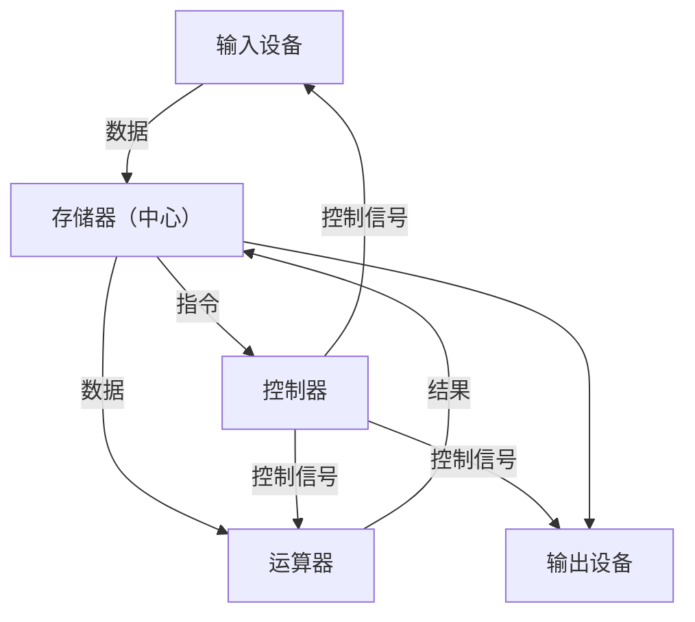
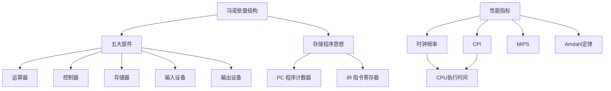

> 📌 本章建立计算机系统的整体框架：冯·诺依曼结构告诉你计算机由哪些部件组成、存储程序思想如何运转；性能指标（CPI、MIPS、Amdahl 定律）是计算题的常考点。


## 📋 前置知识

- [[408_COA_overview]] — 先阅读全书导航，建立整体知识地图
- 无其他硬性前置，本章从零开始


## 🧠 核心概念


### 1.1 冯·诺依曼结构（⭐ 必考！）

> 🎯 **类比**：把计算机想象成一个自动化工厂。工厂由五个部门组成：图纸库（存储器）、流水线（运算器）、调度室（控制器）、原料入口（输入设备）、成品出口（输出设备）。调度室读取图纸（程序），指挥流水线（运算器）按步骤加工原料（数据）。

**冯·诺依曼（Von Neumann）计算机的三个核心思想**：

1. **采用二进制**表示数据和指令
2. **存储程序**：程序（指令序列）和数据一起存放在存储器中，CPU 自动取出并执行
3. **五大部件**：运算器、控制器、存储器、输入设备、输出设备

**五大部件及功能**：

| 部件 | 英文 | 功能 | 现代对应 |
|------|------|------|---------|
| **运算器** | ALU（Arithmetic Logic Unit） | 执行算术和逻辑运算 | CPU 内部 |
| **控制器** | CU（Control Unit） | 解释指令，发出控制信号协调各部件 | CPU 内部 |
| **存储器** | Memory | 存放程序和数据 | 内存（RAM） |
| **输入设备** | Input Device | 将外部信息输入计算机 | 键盘、鼠标、摄像头 |
| **输出设备** | Output Device | 将结果输出到外部 | 显示器、打印机、音箱 |

> ⚠️ **考点**：运算器 + 控制器 = **CPU**（中央处理器）。主机 = CPU + 内存。外设 = 输入设备 + 输出设备 + 外存（磁盘）。

**冯·诺依曼结构的核心特征——以存储器为中心**：



**冯·诺依曼结构的瓶颈**：

CPU 和存储器之间的数据传输速度（"内存墙"）是现代计算机性能的主要瓶颈。CPU 越来越快，但访问主存的速度相对跟不上，导致 CPU 大量时间在等内存。这催生了 Cache 的发明。


### 1.2 计算机的层次结构

计算机系统可以从不同抽象层次来理解，从下往上抽象程度逐渐增加：

| 层次 | 名称 | 实现方式 | 程序员视角 |
|------|------|---------|----------|
| 第 0 层 | 微程序机器级 | 硬件（微操作） | 不可见 |
| 第 1 层 | 机器语言级 | 微程序解释执行 | 机器码 |
| 第 2 层 | 操作系统级 | 机器语言实现 | 系统调用 |
| 第 3 层 | 汇编语言级 | 汇编器翻译 | 汇编程序员 |
| 第 4 层 | 高级语言级 | 编译器翻译 | 普通程序员 |
| 第 5 层 | 应用程序级 | 高级语言实现 | 用户 |

**408 考纲主要关注第 1-2 层**（机器语言级和操作系统级之间的硬件行为）。


### 1.3 计算机的工作过程（存储程序工作方式）

以执行 `a = b + c`（假设 b 在地址 100，c 在地址 104，结果存入地址 108）为例：

CPU 内部的关键寄存器：

| 寄存器 | 名称 | 作用 |
|--------|------|------|
| **PC** | 程序计数器（Program Counter） | 存放下一条要执行指令的**地址**，每次自动加 1（或指令长度） |
| **IR** | 指令寄存器（Instruction Register） | 存放当前正在执行的**指令** |
| **MAR** | 存储器地址寄存器 | 存放要访问的内存地址 |
| **MDR** | 存储器数据寄存器 | 存放从内存读出或要写入内存的数据 |
| **ACC** | 累加器 | 存放运算的操作数和结果 |

**一条加法指令的执行步骤**（取指→译码→执行，简化版）：

```
取指（Fetch）：
  MAR ← PC           // 把指令地址送到MAR
  MDR ← M[MAR]       // 从内存读取指令到MDR
  IR  ← MDR           // 指令存入IR
  PC  ← PC + 1       // PC自动指向下一条指令

译码（Decode）：
  CU 分析 IR 中的操作码，识别这是一条"加法"指令
  CU 分析地址码，得知操作数在地址 100 和 104

执行（Execute）：
  MAR ← 100          // 读第一个操作数 b
  MDR ← M[MAR]
  ACC ← MDR
  
  MAR ← 104          // 读第二个操作数 c
  MDR ← M[MAR]
  ACC ← ACC + MDR    // 执行加法
  
  MAR ← 108          // 写回结果
  MDR ← ACC
  M[MAR] ← MDR
```

> ⚠️ **考点**：PC 的作用是**自动更新**，保证 CPU 按顺序执行指令，这是"存储程序"思想的核心体现。跳转指令本质上是修改 PC 的值。


### 1.4 计算机的性能指标（⭐⭐ 计算题！）

#### 时间相关概念

**时钟频率（Clock Rate）**：CPU 每秒钟振荡的次数，单位 Hz（赫兹）。如 3GHz = $3 \times 10^9$ 次/秒。

**时钟周期（Clock Cycle Time）**：相邻两次时钟脉冲的时间间隔。

$$\text{时钟周期} = \frac{1}{\text{时钟频率}}$$

例：3GHz CPU 的时钟周期 = $\frac{1}{3 \times 10^9} \approx 0.33 \text{ns}$

**机器周期（Machine Cycle）**：又叫 CPU 周期，完成一个基本操作（如取指、访存）所需的时间，通常包含若干个时钟周期。

**指令周期（Instruction Cycle）**：CPU 取出并执行一条指令所需的时间，包含若干个机器周期。

$$\text{指令周期} \geq \text{机器周期} \geq \text{时钟周期}$$

**层次关系**：

```
指令周期 = 若干个 机器周期
机器周期 = 若干个 时钟周期
```

#### CPI（每条指令的平均时钟周期数）

$$CPI = \frac{\text{执行程序所需的总时钟周期数}}{\text{程序的总指令数}}$$

**CPU 执行时间**：

$$T_\text{CPU} = \text{指令数} \times CPI \times \text{时钟周期}= \frac{\text{指令数} \times CPI}{\text{时钟频率}}$$

**例题**：一个程序共 $10^6$ 条指令，平均 CPI = 2，时钟频率 500MHz，求 CPU 执行时间。

$$T = \frac{10^6 \times 2}{500 \times 10^6} = \frac{2 \times 10^6}{5 \times 10^8} = 4 \times 10^{-3} \text{s} = 4\text{ms}$$

#### MIPS（每秒百万条指令数）

$$MIPS = \frac{\text{指令数}}{\text{执行时间} \times 10^6} = \frac{\text{时钟频率}}{CPI \times 10^6}$$

**例题**：时钟频率 2GHz，CPI = 4，求 MIPS。

$$MIPS = \frac{2 \times 10^9}{4 \times 10^6} = 500 \text{ MIPS}$$

> ⚠️ **MIPS 的局限性**：MIPS 只反映指令执行速度，不考虑指令功能的强弱——CISC 的一条指令可能完成 RISC 需要多条指令才能完成的操作，单纯比较 MIPS 不公平。

#### MFLOPS、GFLOPS、TFLOPS（浮点运算速度）

$$MFLOPS = \frac{\text{浮点运算次数}}{\text{执行时间} \times 10^6}$$

用于衡量科学计算性能（矩阵运算、AI 训练等）。

#### Amdahl 定律（⭐ 必考！）

**问题**：对系统某个部分进行改进，整体性能能提升多少？

> 🎯 **类比**：一个 10 人的工厂，其中 8 人负责生产，2 人负责质检。如果把生产效率提升到无限快，整体速度最多提升 $\frac{10}{2} = 5$ 倍（因为质检是瓶颈，不能超过质检的速度）。

设改进部分占原来执行时间的比例为 $\alpha$（$0 \leq \alpha \leq 1$），改进后该部分性能提升倍数为 $k$，则系统整体加速比为：

$$S = \frac{1}{(1 - \alpha) + \frac{\alpha}{k}}$$

当 $k \to \infty$（被改进部分速度无限快）时，最大加速比：

$$S_\text{max} = \frac{1}{1 - \alpha}$$

**例题**：程序中 80% 的时间在做浮点运算，将 FPU 加速 4 倍，整体加速比是多少？

$$S = \frac{1}{(1 - 0.8) + \frac{0.8}{4}} = \frac{1}{0.2 + 0.2} = \frac{1}{0.4} = 2.5$$

虽然 FPU 提升了 4 倍，整体只提升了 2.5 倍。原因：另外 20% 的非浮点运算仍然是瓶颈。

> ⚠️ **Amdahl 定律的启示**：要提升整体性能，应该优化**占比最大的瓶颈部分**，而不是对已经很快的部分继续优化。


### 1.5 计算机的存储层次（简要预览）

从快到慢、从小到大：

```
寄存器（Registers）     ← 在 CPU 内部，纳秒级，容量极小（几十个）
    ↓
Cache（高速缓存）       ← 在 CPU 芯片上，纳秒级，KB~MB 级
    ↓
主存（RAM）             ← 内存条，约100ns，GB 级
    ↓
辅存（磁盘/SSD）        ← 硬盘，毫秒级，TB 级
    ↓
外存（磁带/光盘）       ← 备份存储，秒级，无限大
```

**层次存储的核心原理**：利用**局部性原理**（常用数据放在快速的上层存储中），使平均访问速度接近上层存储，而容量接近下层存储的最优折中。

→ 详细内容见 [[408_COA_ch3_存储系统]]


## ⚠️ 常见误区与踩坑点

> ❌ **误区 1：CPU = 计算机**
> CPU 只是计算机的核心部件（运算器 + 控制器），不等于整台计算机。计算机还需要内存、I/O 设备、存储设备等。

> ⚠️ **踩坑 2：时钟频率越高，CPU 越快**
> 时钟频率只是影响性能的一个因素。还需要考虑 CPI（每条指令需要几个时钟周期）。同样 3GHz 的 CPU，如果 CPI 差异很大，实际性能可能相差悬殊。

> ❌ **误区 3：PC 存放的是当前指令的内容**
> PC（程序计数器）存放的是**下一条要执行指令的地址**，不是指令本身。当前指令存放在 IR（指令寄存器）中。

> ⚠️ **踩坑 4：Amdahl 定律中 α 是"改进后占比"还是"改进前占比"**
> $\alpha$ 是该部分在**改进前**占总执行时间的比例。例如"80% 时间在做浮点"，就用 $\alpha = 0.8$。


## 🔄 关键概念对比

| 概念 | 含义 | 单位 |
|------|------|------|
| 时钟周期 | 一次时钟振荡的时间 | ns、μs |
| 机器周期 | 完成一个基本操作的时间 | = 若干时钟周期 |
| 指令周期 | 取出并执行一条指令的时间 | = 若干机器周期 |
| CPI | 每条指令平均需要的时钟周期数 | 无单位（比值） |
| MIPS | 每秒执行百万条指令数 | 百万条/秒 |
| MFLOPS | 每秒执行百万次浮点运算 | 百万次/秒 |


## 🏋️ 动手练习

### 练习 1：CPU 执行时间计算（⭐ 难度）

**题目**：某计算机时钟频率为 1GHz，运行某程序时共执行了 $2 \times 10^9$ 条指令，其中：

- 整数运算指令：占 60%，每条需要 1 个时钟周期
- 访存指令：占 30%，每条需要 3 个时钟周期
- 分支指令：占 10%，每条需要 2 个时钟周期

求该程序的平均 CPI 和 CPU 执行时间。

**参考答案**：

**平均 CPI** = 各类指令的 CPI 按比例加权：

$$CPI = 0.6 \times 1 + 0.3 \times 3 + 0.1 \times 2 = 0.6 + 0.9 + 0.2 = 1.7$$

**CPU 执行时间**：

$$T = \frac{\text{指令数} \times CPI}{\text{时钟频率}} = \frac{2 \times 10^9 \times 1.7}{1 \times 10^9} = 3.4 \text{s}$$


### 练习 2：Amdahl 定律（⭐⭐ 难度）

**题目**：某程序在原计算机上运行需 100s，其中 40s 用于浮点运算。

(a) 若希望整体速度提升 1.5 倍（运行时间缩短到 $100/1.5 \approx 66.7\text{s}$），浮点运算需提升多少倍？

(b) 整体速度最多能提升多少倍（浮点部分提升到无限快）？

**参考答案**：

$\alpha = 40/100 = 0.4$（浮点运算占比 40%）

**(a)** 设浮点提升 $k$ 倍，整体加速比 = 1.5：

$$1.5 = \frac{1}{(1 - 0.4) + \frac{0.4}{k}} = \frac{1}{0.6 + \frac{0.4}{k}}$$

$$0.6 + \frac{0.4}{k} = \frac{1}{1.5} = 0.667$$

$$\frac{0.4}{k} = 0.067 \Rightarrow k = \frac{0.4}{0.067} \approx 6$$

浮点运算需提升约 **6 倍**。

**(b)** 最大加速比：

$$S_\text{max} = \frac{1}{1 - 0.4} = \frac{1}{0.6} \approx 1.67 \text{ 倍}$$

即使浮点运算无限快，整体最多也只能提升约 **1.67 倍**（因为非浮点的 60% 是瓶颈）。


### 练习 3：指令周期组成分析（⭐ 难度）

**题目**：某计算机取指需要 1 个机器周期，分析操作数地址需要 1 个机器周期，取操作数需要 1 个机器周期，执行需要 1 个机器周期，写回结果需要 1 个机器周期。每个机器周期包含 4 个时钟周期，时钟频率为 800MHz。求：(a) 一条指令的指令周期；(b) 该指令的执行时间。

**参考答案**：

**(a)** 指令周期 = 5 个机器周期

**(b)** 每个时钟周期 = $\frac{1}{800 \times 10^6} = 1.25\text{ns}$

每个机器周期 = $4 \times 1.25 = 5\text{ns}$

执行时间 = $5 \times 5 = 25\text{ns}$


## 📝 总结

### 本章要点回顾

1. **冯·诺依曼结构**：五大部件（运算器、控制器、存储器、输入、输出），以存储器为中心，采用二进制，存储程序思想（程序和数据统一存储在内存中，CPU 顺序取指执行）。

2. **关键寄存器**：PC（下一条指令地址，自动更新）、IR（当前指令）、MAR（内存地址）、MDR（内存数据）。

3. **性能计算三公式**：
   - $T = \text{指令数} \times CPI / \text{时钟频率}$
   - $MIPS = \text{时钟频率} / (CPI \times 10^6)$
   - Amdahl：$S = 1 / [(1-\alpha) + \alpha/k]$

4. **存储层次**：寄存器 → Cache → 主存 → 辅存，越上层越快越小越贵。

### 知识图谱




## 🔗 相关链接

- 上级：[[408_COA_overview]]
- 下一章：[[408_COA_ch2_数制编码]]
- 关联：[[408_OS_ch1_概述]]（操作系统与计组的接口）


## 📚 参考资料

- 唐朔飞《计算机组成原理（第3版）》第一章 — 官方教材
- 王道考研《计算机组成原理》第一章 — 性能指标计算真题
