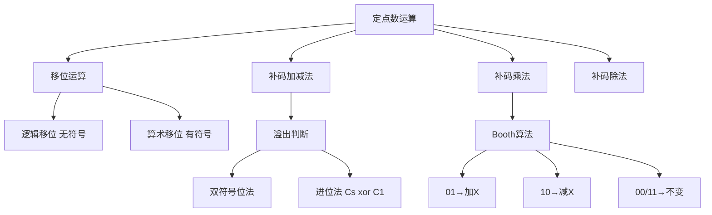

# 408 计组 第二章：定点数运算

> 📌 定点数运算是 408 计组的最重要考点之一，必须能手算补码加减法（含溢出判断）、移位运算，以及 Booth 算法（补码乘法）。这些都是每年大题的常客。


## 📋 前置知识

- [[408_COA_ch2_数制编码]] — 必须先掌握原码/反码/补码的转换规则


## 🧠 核心概念


### 2.7 移位运算（⭐⭐ 必考！）

移位就是把二进制数的各位整体向左或向右移动若干位。不同的编码和移位方向，填充规则不同。

> 🎯 **类比**：把数字向左移一位，就像十进制数乘以 10（如 $123 \to 1230$）；向右移一位，就像除以 10（$123 \to 12$）。二进制移位也类似，左移乘以 2，右移除以 2。

#### 逻辑移位（无符号数）

- **逻辑左移**：左边高位移出（丢弃），右边低位补 0
- **逻辑右移**：右边低位移出（丢弃），左边高位补 0

逻辑移位不区分符号，把操作数视为无符号数。

**例**：$1011\ 0110$ 逻辑左移 2 位 → $1101\ 1000$（左移出去 $10$，右边补 $00$）

#### 算术移位（有符号数，补码）

算术移位保持符号位不变（不能改变数的正负性）。

| 操作 | 移出位 | 填充位 | 效果 |
|------|--------|--------|------|
| **算术左移** | 高位（丢弃） | 低位补 0 | $\times 2$（可能溢出） |
| **算术右移** | 低位（丢弃） | 高位补**符号位** | $\div 2$（向下取整，保留符号） |

**例**：

- $[x]_\text{补} = 0110\ 1010$（正数，真值 = $+106$）
  - 算术左移 1 位：$1101\ 0100$，真值变成 $-44$，发生了溢出！（$106 \times 2 = 212$ 超出 8 位补码范围 $[-128,127]$）
  - 算术右移 1 位：$0011\ 0101$，真值 = $+53 = \lfloor 106/2 \rfloor$，正确

- $[x]_\text{补} = 1001\ 0110$（负数，真值 = $-106$）
  - 算术右移 1 位：$1100\ 1011$，高位补 1（补符号位），真值 = $-53 = \lceil (-106)/2 \rceil$，正确

> ⚠️ **算术移位的溢出**：算术左移时，若移出的位（高位）与符号位不同，则发生溢出。例如正数（符号位 0）左移，若最高数值位是 1 被移入符号位，溢出。

#### 循环移位

移出的位不丢弃，而是补入另一端。

- **不带进位的循环移位**：移出的位直接补入另一端
- **带进位的循环移位（ROL/ROR）**：通过进位标志位 CF 参与循环

循环移位常用于密码学和特殊位操作，408 了解概念即可。


### 2.8 补码加减法（⭐⭐⭐ 最重要！）

**补码加减法的核心原理**：

$$[A + B]_\text{补} = [A]_\text{补} + [B]_\text{补} \pmod{2^n}$$

$$[A - B]_\text{补} = [A]_\text{补} + [-B]_\text{补} \pmod{2^n}$$

其中 $[-B]_\text{补}$ 由 $[B]_\text{补}$ 取反加 1 得到。

**关键点**：
1. 符号位参与运算（和数值位一起处理）
2. 结果超出 $n$ 位自动丢弃（模 $2^n$ 运算）
3. 需要判断是否溢出

**手算步骤**：

1. 把两个操作数转化为补码（若题目已给补码直接用）
2. 若是减法，求减数的补码的相反数（取反加 1）
3. 按二进制加法逐位相加（含符号位）
4. 判断溢出
5. 若无溢出，结果即为补码形式

**例题 1**：设机器字长 8 位，$A = +53$，$B = +70$，求 $A + B$。

$[A]_\text{补} = 0011\ 0101$

$[B]_\text{补} = 0100\ 0110$

```
  0011 0101
+ 0100 0110
-----------
  0111 1011
```

结果 $= 0111\ 1011 = +123$，在 $[-128, 127]$ 范围内，无溢出。$53 + 70 = 123$ ✅

**例题 2**：$A = +100$，$B = +50$，求 $A + B$（8 位）。

$[A]_\text{补} = 0110\ 0100$

$[B]_\text{补} = 0011\ 0010$

```
  0110 0100
+ 0011 0010
-----------
  1001 0110
```

结果符号位为 1，但两个正数相加结果应该是正数——**溢出！** 真实结果 $150 > 127$。

**例题 3**：$A = +53$，$B = -70$，求 $A - B$（即 $A + 70$）。

等价于 $A + (-B) = A + 70$。

$[A]_\text{补} = 0011\ 0101$

$[-B]_\text{补} = [-(-70)]_\text{补} = [70]_\text{补} = 0100\ 0110$

```
  0011 0101
+ 0100 0110
-----------
  0111 1011   = +123
```

$53 - (-70) = 123$ ✅

**例题 4**：$A = +100$，$B = -100$，求 $A - B = 200$（溢出情形）。

$[A]_\text{补} = 0110\ 0100$

$[-B]_\text{补} = [100]_\text{补} = 0110\ 0100$

```
  0110 0100
+ 0110 0100
-----------
  1100 1000
```

两个正数相加结果符号位为 1，**溢出！** 真实结果 $200 > 127$。


### 2.9 溢出的判断方法（⭐⭐ 必考！）

溢出是指运算结果超出了 $n$ 位补码的表示范围 $[-2^{n-1},\ 2^{n-1}-1]$。

**何时会溢出**：只有**同号数相加**或**异号数相减**才可能溢出（两个正数相加超过最大正数，两个负数相加超过最小负数）。

**判断方法一：双符号位法（变形补码）**（⭐ 推荐）

用 **2 位符号位**来扩展补码（正数符号扩展为 00，负数符号扩展为 11）：

| 双符号位结果 | 含义 |
|------------|------|
| $\mathbf{00}$xxxx | 正数，**无溢出** |
| $\mathbf{11}$xxxx | 负数，**无溢出** |
| $\mathbf{01}$xxxx | 正溢出（两正相加超过上限） |
| $\mathbf{10}$xxxx | 负溢出（两负相加超过下限） |

**规律**：两个符号位相同 → 无溢出；两个符号位不同 → 溢出（且 01 是正溢，10 是负溢）。

**手算示例**（用双符号位重新做例题 2）：

$A = +100$：双符号位补码 = $00\ 0110\ 0100$

$B = +50$：双符号位补码 = $00\ 0011\ 0010$

```
  00 0110 0100
+ 00 0011 0010
-------------
  00 1001 0110  → 双符号位 00，无溢出？
```

等等，单符号位结果是 $1001\ 0110$（负数），但双符号位是 $00\ 1001\ 0110$，这里……

重新算：$100 + 50 = 150$：

```
  00 0110 0100   (100)
+ 00 0011 0010   (50)
-------------
  00 1001 0110
```

双符号位 $00$，但结果 $1001\ 0110$ 符号位（取后8位的最高位）是 $1$，出现矛盾——

正确用法：双符号位法的最终结果中，真正的符号位是**高符号位**，低符号位只是用来检测溢出的。

$00\ 1001\ 0110$：高符号位 $0$，低符号位 $0$，两者相同 → **无溢出**，真值由高符号位决定是正数，真值 = $01001\ 0110_2 = 150$（超出 8 位范围，应该是溢出！）

问题出在哪？双符号位法需要用**足够宽**的位数，如果只用 9 位（8 位数值 + 1 位额外符号），$150 = 10010110_2$ 超出 8 位，产生进位到第 9 位，正确。

让我重新演示（用清晰格式）：

原操作数 $A = +100$：8 位补码 = $0110\ 0100$，扩展为双符号位 = $00\ 110\ 0100$（共9位）

$B = +50$：$00\ 011\ 0010$

```
  00 1100100   ← 这是不对的，让我重新写
```

**正确方式**：双符号位是在原补码前再加一位符号位，变成 $(n+1)$ 位，但符号位占 2 位，数值位仍是 $n-1$ 位：

$n = 8$ 位字长，双符号位法：**最高2位是符号位，低6位是数值位**，共8位（$\underbrace{S_1 S_0}_{符号} \underbrace{d_5 d_4 d_3 d_2 d_1 d_0}_{数值}$）。

$+100 = +1100100_2$（7位数值），但 6 位放不下 100（$100 = 1100100_2$，7位）……

实际上，对于 8 位字长，双符号位法扩展为 **10 位**（2 位符号 + 8 位数值）：

$[+100]_\text{双} = 00\ 0110\ 0100$（10位）

$[+50]_\text{双} = 00\ 0011\ 0010$（10位）

```
  00 0110 0100
+ 00 0011 0010
-------------
  00 1001 0110   ← 双符号位 = 00，无溢出！
```

结果为 $00\ 1001\ 0110$，去掉前面扩展的符号位，8位结果 = $1001\ 0110$。高符号位 $0$ 说明是正数，但 $1001\ 0110$ 符号位是 $1$（看起来是负数）—— **发生了矛盾**！

这里的矛盾正说明了 $100 + 50 = 150$ 超出了 8 位有符号数的范围，**溢出**！

结论：如果去掉额外符号位后，8位结果的符号位与额外符号位（高符号位）不一致，则溢出。双符号位 $01$ 或 $10$ 才表示溢出，而这里双符号位是 $00$，但结果数值位的最高位是 1，符号位看起来不对……

> 解析：双符号位法中，如果结果的两个符号位相同（$00$ 或 $11$），说明**正常情况下没有溢出**；但如果最终 8 位结果（含符号）落在错误的区间，说明数值位溢出到了符号位——这正是双符号位要检测的。

重新用更清晰的例子：

$A = +100$（8位补码：$0110\ 0100$），$B = +50$（$0011\ 0010$）：

双符号位：把每个数的符号位复制一份，最高两位都是符号位：

$$[+100]_{变形补码} = \underbrace{00}_{符号}\ \underbrace{110\ 0100}_{数值}$$

$$[+50]_{变形补码} = \underbrace{00}_{符号}\ \underbrace{011\ 0010}_{数值}$$

```
   00 110 0100
 + 00 011 0010
 ------------
   01 001 0110   ← 双符号位 = 01，正溢出！
```

双符号位 $01$ → **正溢出** ✅

这才是正确的格式：变形补码是 $(n+1)$ 位，其中**前两位是符号位**，后 $(n-1)$ 位是数值位。

**判断方法二：进位判断法**

设加法最高数值位（向符号位）的进位为 $C_1$，符号位本身产生的进位为 $C_0$：

$$\text{溢出} V = C_0 \oplus C_1$$

（$C_0$ 是符号位加法的进位，$C_1$ 是数值最高位的进位）

- 两个进位相同（$V=0$）：无溢出
- 两个进位不同（$V=1$）：溢出

**用例题 2 验证**（$100 + 50$，8位）：

```
  0110 0100
+ 0011 0010
----------
  1001 0110
```

数值位最高位（第7位）的进位 $C_1 = 1$（$1 + 0 = 1$，进位 0... 实际上要仔细看是否有进位到符号位）

符号位（第8位）的进位 $C_0 = 0$（没有进位出去）

$V = C_0 \oplus C_1 = 0 \oplus 1 = 1$，**溢出** ✅


### 2.10 原码乘法（了解原理）

两个原码数相乘：

1. 符号位单独处理：同号为正，异号为负（$S = S_A \oplus S_B$）
2. 数值位相乘（都是正数乘法）

数值位乘法用**部分积累加**实现（类似竖式乘法，但每次只加一位乘数对应的部分积）。


### 2.11 补码乘法——Booth 算法（⭐⭐ 大题必考！）

Booth 算法直接对补码进行乘法运算，不需要先转原码，适合有符号数乘法。

> 🎯 **类比**：Booth 算法像一个聪明的加法方案——观察乘数的每一位，若遇到 $01$（从 0 变到 1）就**加**被乘数，遇到 $10$（从 1 变到 0）就**减**被乘数（加被乘数的补码的相反数），遇到 $00$ 或 $11$ 就什么都不做，然后算术右移。

**Booth 算法步骤**（设被乘数 $X$，乘数 $Y$，均为 $n$ 位补码）：

1. 设部分积 $P = 0$，在乘数 $Y$ 末尾附加一位 $Y_{-1} = 0$
2. 检查 $Y$ 的最低位 $Y_0$ 和附加位 $Y_{-1}$：
   - $Y_0 Y_{-1} = 00$ 或 $11$：部分积不变（$P = P$）
   - $Y_0 Y_{-1} = 01$：$P = P + [X]_\text{补}$（加被乘数）
   - $Y_0 Y_{-1} = 10$：$P = P + [-X]_\text{补}$（减被乘数，即加被乘数补码的负数）
3. 将 $P$ 和 $Y$（含 $Y_{-1}$）一起**算术右移**一位
4. 重复步骤 2-3，共执行 $n$ 次
5. 最终 $P$ 就是乘积的补码

**手算示例**：$X = -3$，$Y = +5$，设 4 位字长（含符号位）。

$[X]_\text{补} = 1101$（$-3$ 的补码）

$[-X]_\text{补} = 0011$（$+3$ 的补码，即对 $1101$ 取反加 1）

$[Y]_\text{补} = 0101$（$+5$ 的补码）

初始：$P = 0000$，$Y = 0101$，$Y_{-1} = 0$

**使用双倍精度累加**（部分积扩展为 5 位，避免溢出）：

| 步骤 | $Y_0$ | $Y_{-1}$ | 操作 | 部分积 $P$（5位） | $Y$（含 $Y_{-1}$） |
|------|--------|---------|------|-----------------|-----------------|
| 初始 | — | — | — | $00\ 0000$ | $0101\ \mathbf{0}$ |
| 第1次 | 1 | 0 | $P + [-X]$ | $00000 + 00011 = 00011$ | — |
| 右移 | — | — | 算术右移 | $00001$ | $1010\ \mathbf{1}$ |
| 第2次 | 0 | 1 | $P + [X]$ | $00001 + 11101 = 11110$ | — |
| 右移 | — | — | 算术右移 | $11111$ | $0101\ \mathbf{0}$ |
| 第3次 | 1 | 0 | $P + [-X]$ | $11111 + 00011 = 00010$ | — |
| 右移 | — | — | 算术右移 | $00001$ | $0010\ \mathbf{1}$ |
| 第4次 | 0 | 1 | $P + [X]$ | $00001 + 11101 = 11110$ | — |
| 右移 | — | — | 算术右移 | $11111$ | $0001\ \mathbf{0}$ |

> 实际的 Booth 算法手算较为复杂，考试通常用更简化的格式。下面给出标准格式：

**标准 Booth 算法手算格式**（$n = 4$ 位，用 5 位（含一位扩展符号位）的部分积）：

被乘数 $X = -3$：$[X]_\text{补} = 1101$，$[-X]_\text{补} = 0011$

乘数 $Y = +5$：$[Y]_\text{补} = 0101$，附加位 $y_{-1} = 0$

| 步骤 | $y_i y_{i-1}$ | 操作 | 部分积（高5位） | 乘数寄存器 |
|------|-------------|------|-------------|---------|
| 初始 | — | — | `00 0000` | `0101 0` |
| 1 | $1, 0$ | $+[-X]=+0011$ | `00 0000 + 00 0011 = 00 0011` | |
| | | →右移1 | `00 0001` | `1010 1` |
| 2 | $0, 1$ | $+[X]=+1101$ | `00 0001 + 11 1101 = 11 1110` | |
| | | →右移1 | `11 1111` | `0101 0` |
| 3 | $1, 0$ | $+[-X]=+0011$ | `11 1111 + 00 0011 = 00 0010` | |
| | | →右移1 | `00 0001` | `0010 1` |
| 4 | $0, 1$ | $+[X]=+1101$ | `00 0001 + 11 1101 = 11 1110` | |
| | | →右移1 | `11 1111` | `0001 0` |

最终乘积（8位）= 高 4 位 `1111` + 低 4 位 `0001` = `11110001`

验证：$-3 \times 5 = -15$，$-15$ 的 8 位补码 = $1111\ 0001$ ✅

> ⚠️ **Booth 算法考试关键**：
> - 判断 $y_i y_{i-1}$（当前位和右侧位）：$01$ 加 $X$，$10$ 加 $-X$，$00$/$11$ 不变
> - 每次操作后**算术右移 1 位**（符号位保持）
> - 共执行 $n$ 次（$n$ 是乘数的位数，含符号位）
> - 最终结果取高 $n$ 位和低 $n$ 位拼合，是 $2n$ 位结果


### 2.12 补码除法（了解原理）

408 考纲包含除法，但考题频率低于乘法。了解两种方法的基本思路即可。

**恢复余数法**：

1. 商初始为 0，余数为被除数
2. 余数 $- $ 除数（符号相反则加），若结果符号与被除数同 → 商 1，保留新余数；否则 → 商 0，恢复原余数
3. 余数左移 1 位，重复，共 $n$ 步

**加减交替法（不恢复余数法）**：

更高效：根据余数符号决定下一步是加还是减除数，无需恢复步骤。规则：

- 余数与除数**同号**：商 1，下一步**减**除数（即加 $[-D]_\text{补}$）
- 余数与除数**异号**：商 0，下一步**加**除数

最后一步余数若需调整，额外进行一次修正。


### 2.13 ALU（算术逻辑单元）的组成

ALU 是 CPU 中执行算术和逻辑运算的核心部件。

**全加器（Full Adder）**：基本的 1 位加法单元，有三个输入（$A_i$，$B_i$，进位 $C_{i-1}$），两个输出（和 $S_i$，进位 $C_i$）。

$$S_i = A_i \oplus B_i \oplus C_{i-1}$$

$$C_i = A_i B_i + (A_i \oplus B_i) C_{i-1}$$

**串行进位加法器**：$n$ 个全加器串联，简单但慢（低位进位必须先算出，才能算高位）。

**超前进位加法器（CLA）**：预先计算所有位的进位，所有位并行计算，速度快但电路复杂。408 以概念了解为主。

**ALU 的功能**：

- 算术运算：加、减（转化为加）、乘（移位加）、除（移位减）
- 逻辑运算：AND、OR、NOT、XOR
- 移位操作：算术/逻辑/循环移位
- 比较：通过减法判断大小关系


## ⚠️ 常见误区与踩坑点

> ❌ **误区 1：算术右移是除以 2（精确）**
> 算术右移对有符号数实现的是**向下取整的除以 2**，对负奇数结果会"偏小"。例如 $-3$ 算术右移一位：补码 $1101 \to 1110$（$-2$），不是 $-1.5$，是 $\lfloor -3/2 \rfloor = -2$。

> ⚠️ **踩坑 2：Booth 算法的最后一步不右移**
> Booth 算法的最后（第 $n$ 次）操作：执行加/减操作后**不再右移**，直接取结果作为乘积的高半部分。考生常忘记这一点，多做了一次右移。

> ❌ **误区 3：两个正数相加一定不会溢出**
> 两个正数相加如果结果超过 $2^{n-1} - 1$ 就会正溢出（如 8 位补码：$100 + 50 = 150 > 127$）。溢出不只发生在负数运算中。

> ⚠️ **踩坑 3：双符号位法中忘记扩展符号位**
> 使用双符号位法时，必须先把两个操作数都扩展到双符号位格式（正数补 $00$，负数补 $11$），再做加法。直接在原补码前面看结果是不对的。

> ❌ **误区 4：溢出和进位是同一回事**
> 溢出（Overflow）和进位（Carry）是不同的概念。无符号数加法产生进位不一定溢出；有符号数加法可能溢出但符号位没有进位。具体：有符号加法的溢出用 $V = C_0 \oplus C_1$ 判断，无符号加法的进位用最高位 $C_0$ 判断。


## 🔄 移位运算对比

| 类型 | 左移填充 | 右移填充 | 适用 |
|------|---------|---------|------|
| 逻辑左移 | 右补 0 | — | 无符号数 |
| 逻辑右移 | — | 左补 0 | 无符号数 |
| 算术左移 | 右补 0 | — | 有符号数（可能溢出） |
| 算术右移 | — | 左补**符号位** | 有符号数（$\div 2$，向下取整） |
| 循环移位 | 移出位循环补入 | 移出位循环补入 | 特殊用途 |


## 🏋️ 动手练习

### 练习 1：补码加减法与溢出判断（⭐⭐ 难度）

**题目**：设机器字长 8 位，用变形补码（双符号位）计算以下各式，并判断是否溢出。

(a) $A = +75$，$B = +60$，求 $A + B$

(b) $A = -75$，$B = -60$，求 $A + B$

(c) $A = +75$，$B = -60$，求 $A - B$（即 $A + 60$）

**参考答案**：

$75 = 64 + 8 + 2 + 1 = 0100\ 1011$

$60 = 32 + 16 + 8 + 4 = 0011\ 1100$

**(a) $+75 + (+60)$**：

$[+75]_{变形} = 00\ 100\ 1011$

$[+60]_{变形} = 00\ 011\ 1100$

```
  00 1001011
+ 00 0111100
-----------
  01 0000111
```

双符号位 = $01$，**正溢出**！（$75 + 60 = 135 > 127$）

**(b) $-75 + (-60)$**：

$[-75]_\text{补} = 1011\ 0101$（$75$ 的补码 $0100\ 1011$ 取反加 1）

$[-60]_\text{补} = 1100\ 0100$（$60$ 的补码 $0011\ 1100$ 取反加 1）

$[-75]_{变形} = 11\ 011\ 0101$

$[-60]_{变形} = 11\ 100\ 0100$

```
  11 0110101
+ 11 1000100
-----------
 [1]10 1111001   ← 进位丢弃（模运算）
```

双符号位 = $10$，**负溢出**！（$-75 + (-60) = -135 < -128$）

**(c) $+75 - (-60) = +75 + 60$（同 (a)，正溢出）**

$A - B = A + (-B)$，$-B = -(-60) = +60$

同 (a)，**正溢出**。

（若 (c) 改为 $A = +75$，$B = +60$，求 $A - B = 75 - 60 = 15$：

$[+75]_{变形} = 00\ 100\ 1011$

$[-60]_{变形} = 11\ 100\ 0100$（$-60$ 变形补码）

```
  00 1001011
+ 11 1000100
-----------
 [1]00 0001111   ← 进位丢弃
```

双符号位 $00$，**无溢出**，结果 $= 0000\ 1111 = +15$ ✅）


### 练习 2：Booth 算法手算（⭐⭐⭐ 难度）

**题目**：$X = +6$，$Y = -5$，设字长 4 位（含符号位），用 Booth 算法求 $X \times Y$。

**参考答案**：

$[X]_\text{补} = 0110$，$[-X]_\text{补} = 1010$

$[Y]_\text{补} = 1011$，附加位 $y_{-1} = 0$

乘数 $Y$ 的各位从低到高：$y_0=1, y_1=1, y_2=0, y_3=1$，$y_{-1}=0$

| 步骤 | $y_i y_{i-1}$ | 操作 | 部分积（5位双符号） | 移位后 |
|------|------------|------|-----------------|--------|
| 初始 | — | — | `00 0000` | `1011 0` |
| 1 | $1,0$ | $+[-X]=1010$ | `00 0000 + 11 1010 = 11 1010` | →右移：`11 1101` `0101 1` |
| 2 | $1,1$ | 不操作 | `11 1101` | →右移：`11 1110` `1010 1` |
| 3 | $0,1$ | $+[X]=0110$ | `11 1110 + 00 0110 = 00 0100` | →右移：`00 0010` `0101 0` |
| 4 | $1,0$ | $+[-X]=1010$ | `00 0010 + 11 1010 = 11 1100` | →右移：`11 1110` `0010 1` |

**注意**：最后一步（第 $n$ 步，$n=4$）**不右移**。

乘积高 4 位（去掉扩展符号位）：`1110`，低 4 位：`0010`

8 位结果 = `1110 0010`

验证：$6 \times (-5) = -30$，$-30$ 的 8 位补码 = $1110\ 0010$ ✅

> ⚠️ 考试时注意每一步的进位处理，高位符号扩展要做算术右移（符号位复制）。


## 📝 总结

### 本章要点回顾

1. **移位**：算术右移补符号位（$\div 2$ 向下取整），算术左移补 0（$\times 2$，可能溢出）。

2. **补码加减法**：减法转化为加负数的补码；符号位参与运算；结果超出 $n$ 位自动丢弃（模运算）。

3. **溢出判断**：
   - 双符号位法：$01$ → 正溢，$10$ → 负溢，$00$/$11$ → 无溢出
   - 进位法：$V = C_0 \oplus C_1$，1 = 溢出，0 = 不溢出

4. **Booth 算法**：$01 \to +X$，$10 \to -X$，$00/11 \to$ 不变；每次算术右移；共 $n$ 步；最后一步不右移。

### 知识图谱




## 🔗 相关链接

- 上一篇：[[408_COA_ch2_数制编码]]
- 下一篇：[[408_COA_ch2_浮点数]]
- 关联：[[408_COA_ch5_CPU]]（ALU 是 CPU 的核心部件）


## 📚 参考资料

- 唐朔飞《计算机组成原理（第3版）》第二章 — 运算方法与运算器
- 王道考研《计算机组成原理》定点运算专题 — Booth 算法真题精讲
