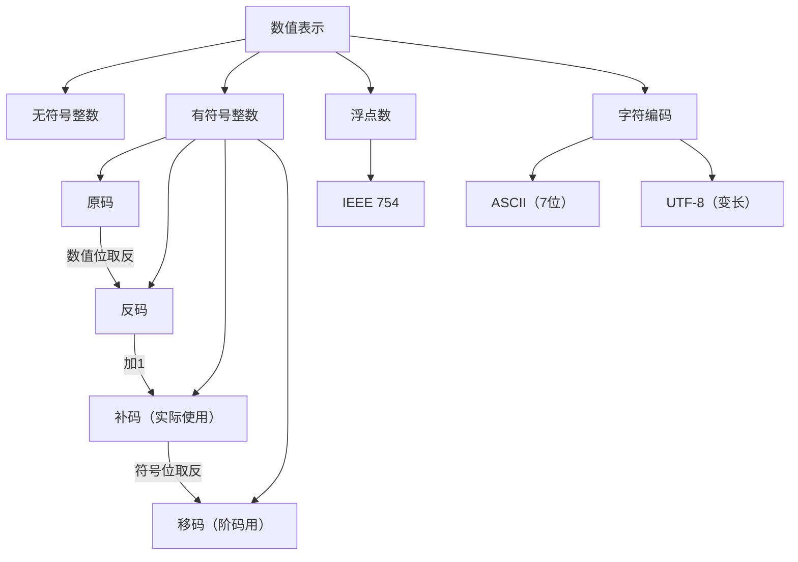

# 408 计组 第二章：数制与编码

> 📌 计算机用二进制表示一切——整数、小数、负数、字符。原码/反码/补码/移码是表示有符号整数的四种编码，补码是计算机实际使用的编码，也是后续运算的基础。这是整个第二章最重要的前置知识。


## 📋 前置知识

- [[408_COA_ch1_概述]] — 了解计算机基本结构
- 无其他硬性前置，从零开始讲起


## 🧠 核心概念


### 2.1 进制系统与相互转换

> 🎯 **类比**：进制就像计数的"进位规则"。十进制满 10 进一位，二进制满 2 进一位，十六进制满 16 进一位。本质都是"位置值（权）× 数码"的求和。

**各进制的表示**：

| 进制                 | 数码       | 基数  | 表示方法                 |
| ------------------ | -------- | --- | -------------------- |
| 二进制（B）Binary       | 0, 1     | 2   | $1010B$ 或 $(1010)_2$ |
| 八进制（O）Octal        | 0-7      | 8   | $17O$ 或 $(17)_8$     |
| 十进制（D）Decimal      | 0-9      | 10  | $25$ 或 $(25)_{10}$   |
| 十六进制（H）Hexadecimal | 0-9, A-F | 16  | $1AH$ 或 $(1A)_{16}$  |

**十六进制与十进制的对应**：A=10，B=11，C=12，D=13，E=14，F=15

#### 任意进制 → 十进制（按权展开）

$$N = \sum_{i} d_i \times r^i$$

其中 $d_i$ 是第 $i$ 位的数码，$r$ 是基数，$i$ 从小数点右边第一位算起（整数部分 $i \geq 0$，小数部分 $i < 0$）。

**例**：$(1101.01)_2 \to$ 十进制

$$= 1 \times 2^3 + 1 \times 2^2 + 0 \times 2^1 + 1 \times 2^0 + 0 \times 2^{-1} + 1 \times 2^{-2}$$
$$= 8 + 4 + 0 + 1 + 0 + 0.25 = 13.25$$

#### 十进制 → 二进制（整数部分：除 2 取余；小数部分：乘 2 取整）

**整数部分（除 2 取余，余数从下往上读）**：

```
13 ÷ 2 = 6 余 1   ↑（最高位）
 6 ÷ 2 = 3 余 0
 3 ÷ 2 = 1 余 1
 1 ÷ 2 = 0 余 1   ↓（最低位）
```

$13_{10} = (1101)_2$（从下往上读余数）

**小数部分（乘 2 取整，整数从上往下读）**：

```
0.25 × 2 = 0.5  → 取整数 0  ↓（最高位，紧跟小数点）
0.5  × 2 = 1.0  → 取整数 1
0.0  × 2 = 0    → 结束
```

$0.25_{10} = (0.01)_2$

所以 $13.25_{10} = (1101.01)_2$ ✅

> ⚠️ **踩坑**：小数部分可能永远不能精确表示（如 $0.1_{10}$ 的二进制是无限循环小数），这是浮点数精度误差的根本原因。

#### 二进制 ↔ 十六进制（每 4 位一组，直接对应）

二进制转十六进制：从小数点向两侧，每 4 位一组（不足补 0），每组直接转换。

```
二进制：  0001  1010  1111  .  0110
十六进制:   1    A     F       6
```

$(11010111.011)_2 = ?_{16}$

**以小数点为中心，向两边散开**

重新分组从右边：$1101\ 0111 \to D7$

小数部分：$0110 \to 6$

$(11010111.011)_2 = (D7.6)_{16}$

**十六进制转二进制**：每一位十六进制数展开为 4 位二进制。

$(3A.F)_{16} = 0011\ 1010.\ 1111 = (0011\ 1010.1111)_2$


### 2.2 有符号整数的四种编码（⭐⭐⭐ 核心！）

计算机中，整数有正有负，但电路只能处理 0 和 1。如何用二进制表示负数？这就需要编码约定。

设机器字长为 $n$ 位（含 1 位符号位），真值 $x$（真正的数学值）。

以 **4 位字长**为例（1 位符号位 + 3 位数值位），真值范围通常是 $-8 \sim +7$（补码）。

#### 原码（Sign-Magnitude）

**规则**：符号位 0 代表正，1 代表负；数值位就是真值的绝对值的二进制表示。

$$[x]_\text{原} = \begin{cases} x & \text{若 } x \geq 0 \\ 2^{n-1} + |x| & \text{若 } x < 0 \end{cases}$$

（也就是：正数符号位为 0，负数符号位为 1，数值位不变）

**例**（4 位原码）：

| 真值 | 原码 |
|------|------|
| $+5$ | $0101$ |
| $-5$ | $1101$ |
| $+0$ | $0000$ |
| $-0$ | $1000$ |

**原码的问题**：

1. 有两个零（$+0$ 和 $-0$）
2. 加减法需要分情况讨论（同号相加，异号相减），电路复杂

#### 反码（One's Complement）

**规则**：正数反码 = 原码（不变）；负数反码 = 原码的数值位全部取反（符号位不变）。

**例**：

| 真值 | 原码 | 反码 |
|------|------|------|
| $+5$ | $0101$ | $0101$（正数不变） |
| $-5$ | $1101$ | $1010$（数值位取反） |
| $+0$ | $0000$ | $0000$ |
| $-0$ | $1000$ | $1111$ |

**反码的问题**：仍然有两个零（$+0 = 0000$，$-0 = 1111$）。反码主要作为原码到补码的中间步骤。

#### 补码（Two's Complement）（⭐ 最重要！）

**补码是计算机实际使用的有符号整数编码。**

**规则**：

$$[x]_\text{补} = \begin{cases} x & \text{若 } x \geq 0 \\ 2^n + x & \text{若 } -2^{n-1} \leq x < 0 \end{cases}$$

更实用的记忆方式：

- **正数**：补码 = 原码（符号位 0，数值位不变）
- **负数**：补码 = 原码取反加 1（即：先求反码，再在最低位加 1）

**例**（4 位补码）：

| 真值 | 原码 | 补码 | 计算过程 |
|------|------|------|---------|
| $+5$ | $0101$ | $0101$ | 正数不变 |
| $-5$ | $1101$ | $1011$ | $1101$ 取反 $\to 1010$，加 1 $\to 1011$ |
| $+7$ | $0111$ | $0111$ | 正数不变 |
| $-8$ | — | $1000$ | 4 位补码的最小值，无对应原码！ |
| $0$ | $0000$ 或 $1000$ | $0000$ | **补码的零唯一！** |

**4 位补码的表示范围**：$-8 \sim +7$（$-2^3 \sim 2^3 - 1$），共 $2^4 = 16$ 个不同编码，没有重复。

**$n$ 位补码的范围**：$-2^{n-1} \sim 2^{n-1} - 1$

**补码 → 真值**（还原）：

- 符号位为 0（正数）：直接读出数值
- 符号位为 1（负数）：再次取反加 1，得到绝对值，前面加负号

**例**：$[x]_\text{补} = 1011$，求真值 $x$。

符号位为 1，是负数。对 $1011$ 取反加 1：$0100 + 1 = 0101 = 5$，所以真值 $x = -5$。

**补码的核心优势**：

1. **零唯一**（$[0]_\text{补} = 0000\cdots0$，没有 $-0$ 的问题）
2. **加减法统一**：减法 $a - b$ 等价于 $a + (-b)$，而 $[-b]_\text{补}$ 可以直接由 $[b]_\text{补}$ 取反加 1 得到。**加法器就能同时做加减法**，无需额外的减法电路。
3. **范围多一个**：$n$ 位补码可以表示 $-2^{n-1}$，而原码和反码不能表示这个数。

> ⚠️ **重要特例**：$n$ 位补码中，$1\underbrace{00\cdots0}_{n-1}$ 是最小负数 $-2^{n-1}$，它**没有对应的原码**（因为 $+2^{n-1}$ 超出了 $n$ 位原码的范围）。

#### 移码（Excess-N / Biased Representation）

移码主要用于表示浮点数的**阶码（指数部分）**，方便比较大小。

**规则**：移码 = 补码的符号位取反（其余位不变）

$$[x]_\text{移} = 2^{n-1} + x \quad (-2^{n-1} \leq x < 2^{n-1})$$

**例**（4 位移码，偏置值 $2^3 = 8$）：

| 真值 $x$ | 补码 | 移码（符号位取反） |
|---------|------|----------------|
| $+5$ | $0101$ | $1101$ |
| $-5$ | $1011$ | $0011$ |
| $+7$ | $0111$ | $1111$ |
| $-8$ | $1000$ | $0000$ |

**移码的特点**：

- 移码的大小顺序和真值的大小顺序**完全一致**（移码越大，对应真值越大）——这使得浮点数的阶码比较可以直接按无符号数比较
- 零有唯一表示（$[0]_\text{移} = 1000\cdots0$，符号位为 1）
- 移码不能直接做加减运算（结果需要修正）

**IEEE 754 中的移码**：偏置值是 $2^{n-1} - 1$（比如 8 位阶码偏置值是 127，不是 128），这是一个细节区别，后面浮点数章节会详细讲。


### 2.3 四种编码对比总结（⭐ 必记！）

以 4 位字长为例（$n=4$）：

| 真值 | 原码 | 反码 | 补码 | 移码 |
|------|------|------|------|------|
| $+7$ | 0111 | 0111 | 0111 | 1111 |
| $+6$ | 0110 | 0110 | 0110 | 1110 |
| $+1$ | 0001 | 0001 | 0001 | 1001 |
| $+0$ | 0000 | 0000 | 0000 | 1000 |
| $-0$ | 1000 | 1111 | 0000 | — |
| $-1$ | 1001 | 1110 | 1111 | 0111 |
| $-6$ | 1110 | 1001 | 1010 | 0010 |
| $-7$ | 1111 | 1000 | 1001 | 0001 |
| $-8$ | 无法表示 | 无法表示 | 1000 | 0000 |

**表示范围**（$n$ 位字长）：

| 编码 | 最小值 | 最大值 | 零的个数 |
|------|--------|--------|---------|
| 原码 | $-(2^{n-1}-1)$ | $+(2^{n-1}-1)$ | 2 个（$\pm 0$） |
| 反码 | $-(2^{n-1}-1)$ | $+(2^{n-1}-1)$ | 2 个 |
| 补码 | $-2^{n-1}$ | $+(2^{n-1}-1)$ | 1 个 |
| 移码 | $-2^{n-1}$ | $+(2^{n-1}-1)$ | 1 个 |


### 2.4 无符号整数与有符号整数

**无符号整数（Unsigned）**：$n$ 位全部用于表示数值，没有符号位。

- $n$ 位无符号整数范围：$0 \sim 2^n - 1$
- 例：8 位无符号整数：$0 \sim 255$

**有符号整数（Signed）**：最高位为符号位，用补码表示。

- $n$ 位有符号整数（补码）范围：$-2^{n-1} \sim 2^{n-1} - 1$
- 例：8 位有符号整数（补码）：$-128 \sim 127$

**C 语言中的对应**：

| C 类型 | 位宽 | 是否有符号 | 范围 |
|--------|------|-----------|------|
| `unsigned char` | 8 | 无 | $0 \sim 255$ |
| `char` / `signed char` | 8 | 有 | $-128 \sim 127$ |
| `unsigned short` | 16 | 无 | $0 \sim 65535$ |
| `short` | 16 | 有 | $-32768 \sim 32767$ |
| `unsigned int` | 32 | 无 | $0 \sim 2^{32}-1$ |
| `int` | 32 | 有 | $-2^{31} \sim 2^{31}-1$ |


### 2.5 BCD 码（二进制编码的十进制）

BCD（Binary Coded Decimal）用 4 位二进制编码一位十进制数字（0-9）。

**8421 BCD 码**（最常用）：直接用 0000-1001 表示 0-9，1010-1111 无效。

| 十进制 | 8421 BCD |
|--------|---------|
| 0 | 0000 |
| 5 | 0101 |
| 9 | 1001 |

**例**：$93_{10}$ 的 8421 BCD = $1001\ 0011$（9 → 1001，3 → 0011，分开编码）

> ⚠️ **区分 BCD 和二进制**：$93_{10}$ 的二进制是 $01011101$，BCD 是 $10010011$，完全不同！BCD 码用于需要直接按十进制显示的场合（计算器、钟表）。


### 2.6 字符编码（了解即可）

**ASCII 码**（7 位，共 128 个字符）：

| 字符类别 | 范围 | 例子 |
|----------|------|------|
| 控制字符 | 0-31 | 换行（10），回车（13） |
| 数字 '0'-'9' | 48-57 | '0'=48=0x30 |
| 大写字母 A-Z | 65-90 | 'A'=65=0x41 |
| 小写字母 a-z | 97-122 | 'a'=97=0x61 |

**记忆规律**：

- '0' 的 ASCII = 48（$0x30$），数字字符 = 48 + 数字值
- 'A' 的 ASCII = 65（$0x41$）
- 'a' 的 ASCII = 97（$0x61$），小写 = 大写 + 32

**Unicode 与 UTF-8**：

- Unicode 是字符集（收录了全世界 14 万多个字符，包括中文、阿拉伯文等）
- UTF-8 是 Unicode 的一种**变长编码**方式：ASCII 字符用 1 字节，中文通常用 3 字节
- UTF-16：中文通常用 2 字节

> ⚠️ **考点**：ASCII 是 7 位编码（有时扩展到 8 位），不是 8 位；'A' = 65 不是 64，注意不要记错。


## ⚠️ 常见误区与踩坑点

> ❌ **误区 1：原码和真值一样**
> 负数的原码符号位是 1，不等于真值（真值是负数，有负号）。原码是一种编码格式，不是直接的数学值。

> ⚠️ **踩坑 2：负数补码取反加 1 的进位处理**
> 求负数补码时，"取反加 1"可能产生进位，需要正确处理。
> 例：求 $-8$ 的 4 位补码。$-8$ 的原码不存在（超出范围），直接由定义：$[- 8]_\text{补} = 2^4 + (-8) = 16 - 8 = 8 = 1000$。
> 另一种算法：$+8$ 的补码是 $1000$（但这超出了有符号范围！），实际上 $-8$ 是 4 位补码的特殊情况，只能靠定义或记忆。

> ❌ **误区 3：移码 = 补码 + 偏置值（加法）**
> 移码不是补码加某个数，而是补码的**符号位取反**。这两种说法在结果上等价（对正数和非最小负数），但"符号位取反"更准确。

> ⚠️ **踩坑 4：小数的二进制转换可能无限循环**
> 十进制小数 $0.1$、$0.3$、$0.7$ 等在二进制中都是无限循环小数，计算机存储时会截断，产生精度误差。这是 $0.1 + 0.2 \neq 0.3$（在浮点运算中）的根本原因。

> ❌ **误区 5：补码的绝对最小值可以直接求原码**
> $n$ 位补码中，$1\underbrace{00\cdots0}_{n-1}$（如 4 位补码的 $1000$）表示 $-2^{n-1} = -8$，对它取反加 1 得到 $1000$，还是它自己——这是补码的特殊情况，说明这个数没有对应的原码（正 $2^{n-1}$ 超出了 $n$ 位原码的范围）。


## 🏋️ 动手练习

### 练习 1：进制转换（⭐ 难度）

**题目**：将 $(175.6875)_{10}$ 转换为二进制和十六进制。

**参考答案**：

**整数部分 175**（除 2 取余，从下向上读）：

$$175 \div 2 = 87 \cdots 1$$
$$87 \div 2 = 43 \cdots 1$$
$$43 \div 2 = 21 \cdots 1$$
$$21 \div 2 = 10 \cdots 1$$
$$10 \div 2 = 5 \cdots 0$$
$$5 \div 2 = 2 \cdots 1$$
$$2 \div 2 = 1 \cdots 0$$
$$1 \div 2 = 0 \cdots 1$$

从下到上读：$10101111$，所以 $175 = (10101111)_2$

**小数部分 0.6875**（乘 2 取整，从上向下读）：

$$0.6875 \times 2 = 1.375 \to 1$$
$$0.375 \times 2 = 0.75 \to 0$$
$$0.75 \times 2 = 1.5 \to 1$$
$$0.5 \times 2 = 1.0 \to 1$$

$0.6875 = (0.1011)_2$

所以 $(175.6875)_{10} = (10101111.1011)_2$

**转十六进制**（每 4 位一组）：

$$\underbrace{1010}_{A}\ \underbrace{1111}_{F}\ .\ \underbrace{1011}_{B}$$

$(175.6875)_{10} = (AF.B)_{16}$


### 练习 2：四种编码互转（⭐⭐ 难度）

**题目**：设机器字长为 8 位，求以下真值的原码、反码、补码、移码。

(a) $x = +105$　　(b) $x = -105$　　(c) $x = -128$

**参考答案**：

$105 = 64 + 32 + 8 + 1 = 1101001_2$

**(a) $x = +105$**：

| 编码 | 结果 | 说明 |
|------|------|------|
| 原码 | $0110\ 1001$ | 正数，符号位 0 |
| 反码 | $0110\ 1001$ | 正数，同原码 |
| 补码 | $0110\ 1001$ | 正数，同原码 |
| 移码 | $1110\ 1001$ | 补码符号位取反：$0 \to 1$ |

**(b) $x = -105$**：

| 编码 | 结果 | 说明 |
|------|------|------|
| 原码 | $1110\ 1001$ | 负数，符号位 1，数值位同 $|105|$ |
| 反码 | $1001\ 0110$ | 负数，数值位取反 |
| 补码 | $1001\ 0111$ | 反码加 1：$1001\ 0110 + 1 = 1001\ 0111$ |
| 移码 | $0001\ 0111$ | 补码符号位取反：$1 \to 0$ |

**(c) $x = -128$**：

8 位补码的最小值是 $-128 = -2^7$，这是特殊情况。

| 编码 | 结果 | 说明 |
|------|------|------|
| 原码 | **不存在** | $+128$ 超出 8 位原码范围 |
| 反码 | **不存在** | 同原码 |
| 补码 | $1000\ 0000$ | 由定义：$2^8 + (-128) = 128 = 1000\ 0000$ |
| 移码 | $0000\ 0000$ | 补码符号位取反 |


### 练习 3：补码还原真值（⭐ 难度）

**题目**：以下 8 位补码各代表什么真值（作为有符号整数）？

(a) $1010\ 0101$　　(b) $1000\ 0000$　　(c) $0111\ 1111$

**参考答案**：

**(a) $1010\ 0101$**：符号位为 1，负数。

取反加 1：$0101\ 1010 + 1 = 0101\ 1011 = 64 + 16 + 8 + 2 + 1 = 91$

真值 = $-91$

**(b) $1000\ 0000$**：8 位补码的特殊情况，真值 = $-128$

（取反加 1 得 $0000\ 0000 + 1 = 0000\ 0001 = 1$？错！这里加 1 后进位超出 8 位，应正确处理为 $1000\ 0000$，循环回来说明是特殊值 $-128$）

**(c) $0111\ 1111$**：符号位为 0，正数。

真值 = $0111\ 1111 = 64+32+16+8+4+2+1 = 127$

8 位补码的最大正数。


## 📝 总结

### 本章要点回顾

1. **进制转换**：十进制→二进制（整数除2取余，小数乘2取整）；二进制↔十六进制（4位一组直接对应）。

2. **四种编码**：
   - 正数：原=反=补，移码=补码符号位取反
   - 负数补码：原码数值位取反加 1
   - 补码是计算机实际使用的有符号整数编码

3. **补码的优势**：零唯一，加减法统一，多表示一个最小负数。

4. **表示范围**：$n$ 位补码 $[-2^{n-1},\ 2^{n-1}-1]$；8 位补码 $[-128, 127]$；$-128$ 没有原码对应。

5. **移码**：补码符号位取反，用于浮点数阶码，大小顺序与真值一致。

### 知识图谱




## 🔗 相关链接

- 上一章：[[408_COA_ch1_概述]]
- 本章续篇：[[408_COA_ch2_定点运算]] | [[408_COA_ch2_浮点数]]
- 关联知识：[[408_COA_ch3_Cache]]（地址中的位数计算同样用到二进制）


## 📚 参考资料

- 唐朔飞《计算机组成原理（第3版）》第二章 — 数据表示
- 王道考研《计算机组成原理》编码专题 — 真题汇编
