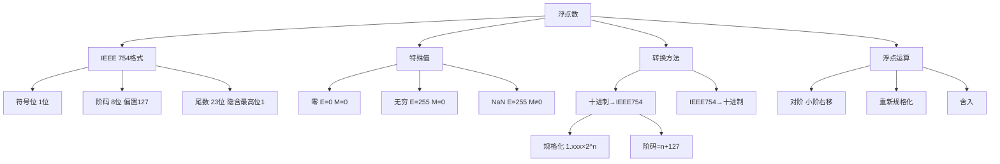

# 408 计组 第二章：浮点数

> 📌 浮点数用来表示很大或很小的数（如科学计数法中的 $6.02 \times 10^{23}$）。IEEE 754 是计算机中最广泛使用的浮点数标准，掌握它的格式和十进制 ↔ IEEE 754 的手算转换，是 408 大题的必考内容。

## 📋 前置知识

- [[408_COA_ch2_数制编码]] — 需要理解补码和移码
- [[408_COA_ch2_定点运算]] — 需要理解移位运算和加减法

## 🤔 为什么需要浮点数？

定点数（如 32 位补码）能表示 $-2^{31} \sim 2^{31}-1$，大约 $\pm 21$ 亿，但：

- 物理常量阿伏伽德罗数 $\approx 6.02 \times 10^{23}$，远超定点数范围
- 普朗克常量 $\approx 6.63 \times 10^{-34}$，远小于定点数能表示的最小正数

同时，定点数无法直接表示小数（只能用缩放约定，不灵活）。

**浮点数**采用科学计数法思想，用**阶码**表示数量级，用**尾数**表示有效位数，从而用有限的位数覆盖极大的数值范围。

## 🧠 核心概念

### 2.14 浮点数的一般格式

浮点数的数学表示：

$$N = M \times r^E$$

其中：

- $M$（Mantissa）：**尾数**，决定数的**精度**（有效位数）
- $E$（Exponent）：**阶码**，决定数的**范围**（数量级）
- $r$（Radix）：**基数**，计算机中通常为 2

浮点数的二进制存储格式：

$$\underbrace{S}_{符号位} \underbrace{E_1 E_2 \cdots E_m}_{阶码（m位）} \underbrace{M_1 M_2 \cdots M_n}_{尾数（n位）}$$

- **符号位 $S$**：0 为正，1 为负（整个浮点数的符号）
- **阶码**：用**移码**表示（方便比较大小），决定小数点的位置
- **尾数**：用**原码**表示（规格化后的有效数字）

> ⚠️ **注意**：阶码用移码表示，但尾数用的不是补码，而是**原码**（规格化后的小数）。这是浮点数和定点补码的重要区别。

### 2.15 IEEE 754 浮点数标准（⭐⭐⭐ 大题核心！）

IEEE 754 是目前最通用的浮点数标准（C 语言的 `float` 和 `double` 都遵循此标准）。

#### 单精度浮点数（32 位，`float`）

$$\underbrace{S}_{1位} \underbrace{E}_{8位阶码} \underbrace{M}_{23位尾数}$$

- **符号位 $S$**：1 位，0=正，1=负
- **阶码 $E$**：8 位，用**移码**表示，**偏置值（Bias） = 127**
  - 阶码真值 $e = E - 127$（$E$ 是存储的无符号整数，$e$ 是真正的指数）
  - 阶码范围：$E \in [1, 254]$（$E = 0$ 和 $E = 255$ 是特殊情况）
  - 对应真值指数 $e \in [-126, +127]$
- **尾数 $M$**：23 位，存储小数点后的位（**省略最高位的 1**，隐含位）
  - 规格化浮点数的尾数形式：$1.M$（即实际尾数 = $1.M_{23位}$，最高位的 1 省略不存）
  - 这 23 位实际上提供了 24 位精度

**真值** = $(-1)^S \times 1.M \times 2^{E-127}$

#### 双精度浮点数（64 位，`double`）

$$\underbrace{S}_{1位} \underbrace{E}_{11位阶码} \underbrace{M}_{52位尾数}$$

- 偏置值 = $1023$，阶码范围 $e \in [-1022, +1023]$

#### IEEE 754 特殊值

| 阶码 $E$ | 尾数 $M$ | 值 |
|----------|---------|-----|
| $0$ ($00000000$) | $= 0$ | $\pm 0$（正零或负零） |
| $0$ | $\neq 0$ | 非规格化数（subnormal，极小数） |
| $255$ ($11111111$) | $= 0$ | $\pm \infty$（无穷大） |
| $255$ | $\neq 0$ | NaN（Not a Number，非数字，如 $0/0$） |

> ⚠️ **考点**：NaN 和 $\pm\infty$ 的判断就是看阶码是否全 1，和尾数是否全 0。

### 2.16 十进制 → IEEE 754 单精度的转换（⭐ 手算必会！）

**步骤模板**：

1. 确定符号位 $S$（正数 $S=0$，负数 $S=1$）
2. 求绝对值，转换为二进制（整数部分除 2 取余，小数部分乘 2 取整）
3. **规格化**：调整为 $1.xxxxx \times 2^n$ 的形式（即小数点移到最高位 1 的后面）
4. 阶码 $E = n + 127$，转换为 8 位二进制
5. 尾数 $M$ = 小数点后的 $xxxxx$，补足 23 位（不够补 0，超出截断/舍入）
6. 拼合：$S + E + M$

**例题 1**：将 $(-0.75)_{10}$ 转换为 IEEE 754 单精度浮点数。

**第一步**：负数，$S = 1$

**第二步**：$|{-0.75}| = 0.75$

$0.75 = 0.5 + 0.25 = 2^{-1} + 2^{-2} = (0.11)_2$

**第三步**：规格化

$(0.11)_2 = 1.1 \times 2^{-1}$

$n = -1$，尾数小数部分 = $1$（只有一位）

**第四步**：阶码

$E = -1 + 127 = 126 = (0111\ 1110)_2$

**第五步**：尾数 $M$

$M = 1\underbrace{00\cdots0}_{22个0}$（只有 $1$，后面补 22 个 0，共 23 位）

**第六步**：拼合

$$\underbrace{1}_{S} \underbrace{0111\ 1110}_{E} \underbrace{100\ 0000\ 0000\ 0000\ 0000\ 0000}_{M}$$

十六进制：$BF40\ 0000_{16}$

**例题 2**：将 $(178.125)_{10}$ 转换为 IEEE 754 单精度浮点数。

**第一步**：正数，$S = 0$

**第二步**：转二进制

整数部分 $178$：

$178 = 128 + 32 + 16 + 2 = 2^7 + 2^5 + 2^4 + 2^1 = (1011\ 0010)_2$

小数部分 $0.125 = 2^{-3} = (0.001)_2$

所以 $178.125 = (1011\ 0010.001)_2$

**第三步**：规格化

$(1011\ 0010.001)_2 = 1.011\ 0010\ 001 \times 2^7$

$n = 7$，尾数小数部分 = $011\ 0010\ 001$（10 位）

**第四步**：阶码

$E = 7 + 127 = 134 = (1000\ 0110)_2$

**第五步**：尾数 $M$

$M = 011\ 0010\ 001\underbrace{00\cdots0}_{13个0}$（共 23 位）

即 $0110\ 0100\ 0100\ 0000\ 0000\ 000$

**第六步**：拼合

$$\underbrace{0}_{S} \underbrace{1000\ 0110}_{E} \underbrace{011\ 0010\ 001\ 0000\ 0000\ 0000}_{M}$$

整理为十六进制：

$0\ 10000110\ 01100100010000000000000$

$= 0100\ 0011\ 0011\ 0010\ 0010\ 0000\ 0000\ 0000$

$= 43\ 32\ 20\ 00_{16}$

### 2.17 IEEE 754 → 十进制的转换

**步骤**：

1. 读出 $S$、$E$（无符号整数）、$M$（23 位小数部分）
2. 计算真值指数 $e = E - 127$
3. 还原尾数：$1.M$（在 $M$ 前面加隐含的 $1.$）
4. 真值 = $(-1)^S \times 1.M \times 2^e$
5. 计算十进制值

**例题**：将 IEEE 754 单精度浮点数 $C0A0\ 0000_{16}$ 转换为十进制。

十六进制 → 二进制：

$C = 1100$，$0 = 0000$，$A = 1010$，$0 = 0000$

$C0A0\ 0000 = 1100\ 0000\ 1010\ 0000\ 0000\ 0000\ 0000\ 0000$

读出各字段：

$$\underbrace{1}_{S} \underbrace{1000\ 0001}_{E=129} \underbrace{010\ 0000\ 0000\ 0000\ 0000\ 0000}_{M}$$

$e = 129 - 127 = 2$

$1.M = 1.010\ 0000\cdots = 1.01$（二进制）$ = 1 + 0.25 = 1.25$

真值 = $(-1)^1 \times 1.25 \times 2^2 = -1.25 \times 4 = -5.0$

验证：$-5.0$ 的 IEEE 754 = $C0A0\ 0000$ ✅

### 2.18 浮点数的规格化（⭐ 必考！）

**为什么要规格化？**

同一个数有多种浮点表示（如 $1.5$ 可以是 $1.1 \times 2^0 = 0.11 \times 2^1 = 11.0 \times 2^{-1}$），规格化统一规定标准形式，避免歧义，并最大化利用尾数的精度。

**IEEE 754 的规格化形式**：尾数为 $1.M$，即整数部分恰好是 1（最高位是 1）。

等价地：小数点左边有且只有一位 $1$。

**规格化操作**：

- 若尾数 $\geq 2$（即 $10.xxx$ 或更大）：右移尾数，阶码 +1
- 若尾数 $< 1$（即 $0.0xxx$）：左移尾数，阶码 -1（直到最高位变为 1）

**非规格化数（Subnormal Numbers）**：

当阶码 $E = 0$（全零）且尾数 $M \neq 0$ 时，IEEE 754 用非规格化数表示非常接近 0 的数：

真值 = $(-1)^S \times 0.M \times 2^{-126}$（注意没有隐含位 1，而是 $0.M$）

非规格化数使得浮点数在 0 附近的精度更平滑，但 408 对此考察较少。

### 2.19 浮点运算（加减法）

浮点加减法比整数加减法复杂，需要额外的**对阶**步骤。

**浮点加减法的步骤**：

**第一步：对阶（Alignment）**

两个浮点数的阶码必须相同才能直接做尾数加减。将阶码小的那个数的尾数右移，直到两者阶码相同。

$$\text{若 } e_A < e_B：M_A \text{ 右移 } (e_B - e_A) \text{ 位，阶码变为 } e_B$$

> ⚠️ **对阶规则**：**小阶码向大阶码对齐**（小数的尾数右移），因为右移损失的是低位（精度损失小），左移会损失高位（精度损失大）。

**第二步：尾数加减**

将对齐后的两个尾数做加减运算。

**第三步：规格化**

若结果不满足规格化条件，进行调整：

- 若结果 $\geq 2$（即 $10.xxx$，尾数溢出）：右移一位，阶码 +1（**右规**）
- 若结果 $< 1$（即 $0.0xxx$，尾数太小）：左移直到最高位为 1，阶码相应减小（**左规**）
- 若阶码上溢（$> 127$）：**浮点数溢出**，按无穷大处理
- 若阶码下溢（$< -126$）：处理为 0 或非规格化数

**第四步：舍入（Rounding）**

对阶或右规时，低位被移出，需要舍入处理。常见方式：

| 舍入方式 | 规则 |
|----------|------|
| **就近舍入（截断）** | 直接丢弃多余位 |
| **向偶舍入（Round to Even）** | 若丢弃位恰好是 $0.1$，则保留位凑成偶数（银行家舍入，IEEE 754 默认） |
| **恒置 1** | 被丢弃的位只要非 0，最后保留位就置 1 |

### 2.20 浮点数的精度与误差

**精度**：由尾数位数决定。单精度 23 位尾数（+1 隐含位 = 24 位有效位），约等于十进制 $24 \times \log_{10}2 \approx 7.2$ 位有效数字。

**范围**：由阶码决定。单精度范围约 $\pm 3.4 \times 10^{38}$，双精度约 $\pm 1.8 \times 10^{308}$。

**常见精度问题**（了解即可）：

- $0.1 + 0.2 \neq 0.3$（因为 $0.1$ 和 $0.2$ 的二进制表示是无限循环小数，存储时截断产生误差）
- 大数 + 小数 = 大数（小数对阶后被截断为 0）
- 浮点数不满足结合律：$(a + b) + c \neq a + (b + c)$（舍入误差不同）

### 2.21 浮点数的范围与精度对比

| 类型 | 总位数 | 符号位 | 阶码位 | 尾数位 | 偏置值 | 有效十进制位 | 最大值约 |
|------|--------|--------|--------|--------|--------|------------|---------|
| 单精度 `float` | 32 | 1 | 8 | 23 | 127 | 约 7 位 | $3.4 \times 10^{38}$ |
| 双精度 `double` | 64 | 1 | 11 | 52 | 1023 | 约 15 位 | $1.8 \times 10^{308}$ |

## ⚠️ 常见误区与踩坑点

> ❌ **误区 1：浮点数的阶码用补码表示**
> IEEE 754 的阶码用**移码（偏置码）**表示，偏置值是 $127$（单精度），不是补码！移码的好处是阶码比较可以直接按无符号整数比较，方便硬件实现浮点数大小比较。

> ⚠️ **踩坑 2：隐含位 1 的处理**
> IEEE 754 规格化浮点数的尾数有一个**隐含的最高位 1**，存储时省略。因此：
> - **解码时要加回来**：$M = 1.$ + 存储的 23 位
> - **编码时要去掉**：只存小数点后的 23 位

> ❌ **误区 3：阶码可以取 0 或 255（单精度）**
> $E = 0$（全 0）和 $E = 255$（全 1）是特殊情况（表示 0、非规格化数、无穷大、NaN），**不能用于正常的规格化浮点数**。正常阶码范围是 $[1, 254]$，对应真值 $[-126, 127]$。

> ⚠️ **踩坑 3：对阶时只能小阶向大阶对齐**
> 不能让大阶的数左移尾数（会损失高位，精度损失大）。必须让小阶的数右移尾数（损失低位，精度损失相对小）。

> ❌ **误区 4：浮点数下溢 = 浮点数溢出**
> **上溢（Overflow）**：阶码超过最大值（$> 127$），结果太大，真正意义上的溢出，按无穷大处理。
> **下溢（Underflow）**：阶码小于最小值（$< -126$），结果极小，接近于 0，IEEE 754 用非规格化数或 0 处理，**不算溢出**。

## 🔄 定点数 vs 浮点数

| 特性 | 定点数 | 浮点数 |
|------|--------|--------|
| **表示方式** | 固定小数点位置 | 科学计数法，小数点浮动 |
| **范围** | 小（受位数限制） | 大（阶码决定量级） |
| **精度** | 固定（均匀分布） | 不均匀（大数精度低，小数精度高） |
| **运算** | 简单，速度快 | 复杂（需要对阶、规格化） |
| **硬件** | 整数 ALU | 专用 FPU（浮点运算单元） |
| **用途** | 整数、地址 | 科学计算、图形处理 |

## 🏋️ 动手练习

### 练习 1：十进制转 IEEE 754（⭐⭐ 难度）

**题目**：将以下数转换为 IEEE 754 单精度浮点数（用十六进制表示结果）。

(a) $-118.625$

(b) $+0.1$（转换后说明为什么结果不精确）

**参考答案**：

**(a) $-118.625$**：

$S = 1$（负数）

$118 = 64 + 32 + 16 + 4 + 2 = (111\ 0110)_2$

$0.625 = 0.5 + 0.125 = 2^{-1} + 2^{-3} = (0.101)_2$

$118.625 = (111\ 0110.101)_2$

规格化：$= 1.110\ 1101\ 01 \times 2^6$，$n = 6$

阶码：$E = 6 + 127 = 133 = (1000\ 0101)_2$

尾数：$M = 110\ 1101\ 01\underbrace{0\cdots0}_{13}$（共 23 位）

拼合：

$$1\ |\ 1000\ 0101\ |\ 110\ 1101\ 010\ 0000\ 0000\ 0000$$

转十六进制：

$1100\ 0010\ 1110\ 1101\ 0100\ 0000\ 0000\ 0000$

= $C2\ ED\ 40\ 00_{16}$

**(b) $+0.1$**：

$S = 0$

$0.1$ 的二进制（乘 2 取整，循环）：

$$0.1 \times 2 = 0.2 \to 0$$
$$0.2 \times 2 = 0.4 \to 0$$
$$0.4 \times 2 = 0.8 \to 0$$
$$0.8 \times 2 = 1.6 \to 1$$
$$0.6 \times 2 = 1.2 \to 1$$
$$0.2 \times 2 = 0.4 \to 0 \leftarrow \text{（从这里开始循环！）}$$

$(0.1)_{10} = (0.0001\ 1001\ 1001\ 1001\cdots)_2$（$1001$ 无限循环）

规格化：$= 1.1001\ 1001\ 1001\cdots \times 2^{-4}$

阶码：$E = -4 + 127 = 123 = (0111\ 1011)_2$

尾数（截取 23 位）：$1001\ 1001\ 1001\ 1001\ 1001\ 100$（循环截断）

**不精确的原因**：$0.1$ 的二进制是无限循环小数，只能存储 23 位（有效位 24 位），截断产生舍入误差。这就是 `0.1 + 0.2 != 0.3` 的根本原因。

### 练习 2：IEEE 754 转十进制（⭐⭐ 难度）

**题目**：将 IEEE 754 单精度浮点数 $4120\ 0000_{16}$ 转换为十进制真值。

**参考答案**：

$4120\ 0000_{16}$ → 二进制：

$4 = 0100$，$1 = 0001$，$2 = 0010$，$0 = 0000$

$= 0100\ 0001\ 0010\ 0000\ 0000\ 0000\ 0000\ 0000$

读出字段：

$$\underbrace{0}_{S=0} \underbrace{1000\ 0010}_{E=130} \underbrace{010\ 0000\ 0000\ 0000\ 0000\ 0000}_{M}$$

$e = 130 - 127 = 3$

$1.M = 1.010\ 0000\cdots = (1.01)_2 = 1 + 0.25 = 1.25$

真值 = $(-1)^0 \times 1.25 \times 2^3 = 1.25 \times 8 = 10.0$

### 练习 3：浮点数范围与特殊值判断（⭐ 难度）

**题目**：判断以下 32 位模式各表示什么（IEEE 754 单精度）。

(a) $0000\ 0000_{16}$（全零）

(b) $7F80\ 0000_{16}$

(c) $FF80\ 0000_{16}$

(d) $7FC0\ 0000_{16}$

**参考答案**：

**(a) $0000\ 0000_{16}$**：

全 32 位为 0：$S=0$，$E=0$（全 0），$M=0$ → **正零 $+0$**

**(b) $7F80\ 0000_{16}$**：

$= 0\ 1111\ 1111\ 0000\ 0000\ 0000\ 0000\ 0000\ 0$

$S=0$，$E = 1111\ 1111 = 255$（全 1），$M = 0$ → **正无穷 $+\infty$**

**(c) $FF80\ 0000_{16}$**：

$= 1\ 1111\ 1111\ 0000\cdots$

$S=1$，$E=255$（全 1），$M=0$ → **负无穷 $-\infty$**

**(d) $7FC0\ 0000_{16}$**：

$= 0\ 1111\ 1111\ 100\cdots$

$S=0$，$E=255$（全 1），$M \neq 0$ → **NaN（非数字）**

（例如 $0/0$、$\sqrt{-1}$ 等未定义运算的结果）

## 📝 总结

### 本章要点回顾

1. **浮点数格式**：$S$（1 位）+ $E$（阶码，移码）+ $M$（尾数，省略最高位 1）

2. **IEEE 754 单精度**：$1+8+23$ 位，偏置值 127；有效阶码 $E \in [1,254]$，特殊值：$E=0$ 或 $E=255$。

3. **十进制 → IEEE 754**：确定符号 → 转二进制 → 规格化（$1.xxx \times 2^n$）→ 阶码 $E=n+127$ → 尾数取小数部分填 23 位 → 拼合。

4. **浮点加减法**：对阶（小阶向大阶对齐，尾数右移）→ 尾数加减 → 规格化 → 舍入。

5. **精度与范围的权衡**：尾数位数决定精度，阶码位数决定范围；$0.1$ 等小数二进制表示有限位截断误差。

### 知识图谱

## 🔗 相关链接

- 上一篇：[[408_COA_ch2_定点运算]]
- 下一章：[[408_COA_ch3_存储系统]]
- 关联：[[408_COA_ch5_CPU]]（FPU 是 CPU 的浮点运算部件）

## 📚 参考资料

- 唐朔飞《计算机组成原理（第3版）》第二章 — 浮点数表示与运算
- 王道考研《计算机组成原理》浮点数专题 — IEEE 754 转换真题精讲
- [IEEE 754 在线计算器](https://www.h-schmidt.net/FloatConverter/IEEE754.html) — 用于验证手算结果
