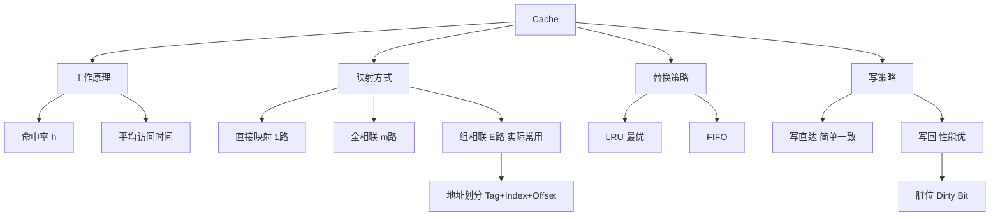

# 408 计组 第三章：Cache

> 📌 Cache（高速缓存）是 CPU 和主存之间的缓冲层，利用局部性原理让 CPU 大多数时候都能快速取到数据。三种映射方式（直接/全相联/组相联）的地址划分和手算是 408 大题的必考内容。


## 📋 前置知识

- [[408_COA_ch3_存储系统]] — 需要理解主存的基本概念
- [[408_COA_ch2_数制编码]] — 地址划分需要二进制位数计算


## 🤔 为什么需要 Cache？

CPU 的时钟频率已达 3GHz 以上，而 DRAM 主存的访问时间约 $50\sim200\text{ns}$。以 3GHz CPU 为例：

$$\text{CPU 一个时钟周期} = \frac{1}{3\times10^9} \approx 0.33\text{ns}$$

访问主存需要约 100ns，相当于等待 **300 个时钟周期**！如果每条指令都要访存，CPU 有 99% 的时间在空等内存，性能灾难。

**解决方案**：在 CPU 和主存之间加一层 SRAM 做的 Cache。SRAM 访问约 $1\sim2\text{ns}$，只需等待 $3\sim6$ 个时钟周期。

**Cache 工作的理论基础——局部性原理**：

- **时间局部性**：刚访问的数据，很快会再次访问（如循环体中的变量）
- **空间局部性**：访问某地址后，其邻近地址也很快会被访问（如数组的顺序遍历）

基于此，把最近使用的主存块整块复制到 Cache，CPU 下次访问时直接从 Cache 取，概率很高。


## 🧠 核心概念


### 3.6 Cache 的基本工作原理

**Cache 的工作流程**：

```
CPU 发出主存地址
        ↓
先查 Cache
        ├── 命中（Hit）→ 直接从 Cache 读取数据（快！）
        └── 未命中（Miss）→ 从主存读取该地址所在的整块数据到 Cache
                                    → 再从 Cache 读取 CPU 需要的数据
```

**基本术语**：

| 术语 | 含义 |
|------|------|
| **块（Block/Line）** | Cache 和主存之间数据传输的基本单位，通常 64B 或 128B |
| **命中（Hit）** | CPU 要的数据在 Cache 中找到了 |
| **缺失（Miss）** | CPU 要的数据不在 Cache 中，需要从主存取 |
| **命中率（Hit Rate, h）** | 命中次数 / 总访问次数 |
| **缺失率（Miss Rate）** | $1 - h$ |

**平均访问时间（Average Access Time）**：

$$t_{avg} = h \times t_c + (1-h) \times (t_c + t_m)$$

其中 $t_c$ 是 Cache 访问时间，$t_m$ 是主存访问时间。

化简（先查 Cache，未命中再查主存）：

$$t_{avg} = t_c + (1-h) \times t_m$$

**例题**：$t_c = 5\text{ns}$，$t_m = 100\text{ns}$，命中率 $h = 0.95$，求平均访问时间。

$$t_{avg} = 5 + (1-0.95) \times 100 = 5 + 5 = 10\text{ns}$$

没有 Cache 时访问时间是 $100\text{ns}$，有 Cache 后降低到 $10\text{ns}$，提升 **10 倍**！


### 3.7 Cache 的映射方式（⭐⭐⭐ 大题核心！）

映射方式决定主存中的哪些块可以放到 Cache 的哪些行（Line）中。

**基本概念**：

- 主存被分成若干**块（Block）**，每块大小 = Cache 行大小
- Cache 被分成若干**行（Line）**，行数远少于主存块数
- **标记（Tag）**：Cache 行中记录当前存放的是哪个主存块的标识

#### 直接映射（Direct Mapping）

> 🎯 **类比**：停车场有 4 个车位（Cache 行），地下室有 100 辆车（主存块）。规则是：车牌号 % 4 决定停哪个车位——每辆车只能停固定的一个车位。

**规则**：主存块 $i$ 只能映射到 Cache 行 $j = i \mod 2^c$（其中 $2^c$ 是 Cache 总行数）。

**地址划分**（设主存地址 $n$ 位，Cache 共 $2^c$ 行，每行 $2^b$ 字节）：

$$\underbrace{\text{Tag（标记）}}_{n-c-b\text{位}} \quad \underbrace{\text{Index（Cache 行号）}}_{c\text{位}} \quad \underbrace{\text{Offset（块内字节偏移）}}_{b\text{位}}$$

**访问过程**：

1. 用地址的中间 $c$ 位（Index）找到 Cache 对应的行
2. 比较该行的 Tag 与地址的高位（Tag）：相等且有效位 V=1 → 命中
3. 用低 $b$ 位（Offset）在 Cache 行中定位具体字节

**例题**：主存 $2^{20}$ 字节（地址 20 位），Cache 共 64 行（$c = 6$），每行 16 字节（$b = 4$）。

主存地址划分：

$$\underbrace{\text{Tag}}_{20-6-4=10\text{位}} \underbrace{\text{Index}}_{6\text{位}} \underbrace{\text{Offset}}_{4\text{位}}$$

**直接映射的缺点**：

若程序频繁访问两个映射到同一行的主存块（如块 0 和块 64 都映射到 Cache 行 0），会反复替换，命中率极低（**抖动**）。

#### 全相联映射（Fully Associative Mapping）

> 🎯 **类比**：停车场的任意车位可以停任意车辆——最灵活，但要找车时必须把所有车位的车牌都看一遍。

**规则**：主存块可以放到 Cache 的**任意**行中，没有固定对应关系。

**地址划分**（无 Index 字段）：

$$\underbrace{\text{Tag（标记）}}_{n-b\text{位}} \quad \underbrace{\text{Offset（块内字节偏移）}}_{b\text{位}}$$

**访问过程**：

1. 用地址的高位（Tag）与 Cache 中**所有行**的 Tag 同时比较（并行比较）
2. 有匹配且有效 → 命中；否则 → 缺失

**优点**：无抖动，命中率最高（灵活度最大）。

**缺点**：需要并行比较所有 Cache 行的 Tag，硬件复杂、成本高，适合 Cache 容量较小时使用（TLB 采用全相联）。

#### 组相联映射（Set Associative Mapping）（⭐ 最重要！）

**直接映射和全相联的折中**，实际处理器 L1/L2 Cache 普遍采用此方式。

> 🎯 **类比**：停车场分成若干组（每组有 4 个车位），车辆按规则只能停在固定的组（减少搜索范围），但在组内可以停任意车位（灵活避免抖动）。

**规则**：

- Cache 被分成 $S = 2^s$ 组，每组 $E$ 行（$E$ 路，E-way）
- 主存块 $i$ 映射到组 $j = i \mod 2^s$（组号固定，但在组内可以放任意行）

**地址划分**：

$$\underbrace{\text{Tag（标记）}}_{n-s-b\text{位}} \quad \underbrace{\text{Set Index（组号）}}_{s\text{位}} \quad \underbrace{\text{Offset（块内偏移）}}_{b\text{位}}$$

**访问过程**：

1. 用 $s$ 位组号找到对应的组（共 $E$ 行）
2. 在该组的 $E$ 行中**并行比较** Tag（只比较 $E$ 行，不是所有行）
3. 匹配且有效 → 命中；否则 → 缺失，从主存取块，放入该组某行（按替换策略）

**直接映射 = 1 路组相联**（每组只有 1 行）

**全相联 = $m$ 路组相联**（只有 1 组，包含所有行）

**例题**：主存地址 32 位，Cache 容量 32KB，每行（块）大小 64B，采用 4 路组相联。求地址各字段位数，以及 Cache 的组数。

**计算过程**：

块内偏移：$64\text{B} = 2^6$，$b = 6$ 位

Cache 总行数 = $32\text{KB} / 64\text{B} = 512$ 行

每组 4 行（4 路），所以组数 = $512 / 4 = 128 = 2^7$，$s = 7$ 位

Tag 位数 = $32 - 7 - 6 = 19$ 位

**地址划分**：Tag（19位）| Set Index（7位）| Offset（6位）

**Cache 总容量（含标记位）**：

每行实际存储：$1\text{位（有效位 V）} + 1\text{位（脏位 D）} + 19\text{位（Tag）} + 64 \times 8\text{位（数据）}= 21 + 512 = 533\text{位}$

总容量 = $512 \text{行} \times 533\text{位}$（比纯数据 32KB 稍大）


### 3.8 三种映射方式对比（⭐ 选择题必考！）

| 特性 | 直接映射 | 全相联 | 组相联（$E$ 路）|
|------|----------|--------|----------------|
| **每块可放位置** | 固定 1 行 | 任意行 | 固定组内 $E$ 行 |
| **标记位数** | $n-c-b$（较少）| $n-b$（最多）| $n-s-b$（中等）|
| **比较硬件** | 比较 1 个 Tag | 比较所有 Tag（最复杂）| 比较 $E$ 个 Tag（折中）|
| **抖动可能性** | 高 | 无 | 低 |
| **命中率** | 低 | 最高 | 高（实际最优）|
| **硬件成本** | 低 | 最高 | 中等 |
| **实际应用** | TLB（小容量全相联）| L1/L2/L3 Cache | L1/L2/L3 Cache |

> 💡 **记忆口诀**：直接映射最简单（每块只能去一个地方），全相联最灵活（去哪都行，但要全部找），组相联是折中（先找组，组内再找）。**组相联是实际 CPU 采用的方案。**


### 3.9 Cache 的替换策略

Cache 满了需要替换时，选哪行换出？

| 策略 | 全称 | 原理 | 优缺点 |
|------|------|------|--------|
| **随机替换（RAND）** | Random | 随机选一行替换 | 实现简单，命中率较低 |
| **先进先出（FIFO）** | First In First Out | 替换最早装入的行 | 简单，可能出现 Belady 异常 |
| **最近最少使用（LRU）** | Least Recently Used | 替换最久未被访问的行 | 命中率高（符合时间局部性），需要计数器 |
| **最不常用（LFU）** | Least Frequently Used | 替换访问次数最少的行 | 适合频率稳定的访问模式 |

> ⚠️ **408 考点**：LRU 是最常考的替换算法，也是实际处理器最常用的策略（直接映射不需要替换策略，因为每块只有一个固定位置）。


### 3.10 Cache 的写策略（⭐ 必考！）

CPU 向 Cache 写入数据时，何时将修改同步到主存？

#### 写命中时

**① 写直达（Write-Through）**：

每次写 Cache 的同时，**立即**也写主存。

- 优点：主存永远是最新数据，一致性好，实现简单
- 缺点：每次写都要访问主存，速度慢（写操作变慢）
- 改进：加写缓冲区（Write Buffer），CPU 写入缓冲区后立即返回，缓冲区异步写主存

**② 写回（Write-Back）**：

只写 Cache，**不立即**写主存；被修改的 Cache 行设置**脏位（Dirty Bit = 1）**，只有该行被替换时，才将数据写回主存。

- 优点：减少主存访问次数，速度快（大多数写操作只写 Cache）
- 缺点：主存中的数据可能不是最新的（缓存不一致问题），实现复杂（需要脏位）

#### 写缺失时

若 CPU 要写的地址不在 Cache 中，有两种处理方式：

| 策略 | 名称 | 原理 |
|------|------|------|
| **写分配（Write-Allocate）** | 先将主存块调入 Cache，再在 Cache 中写 | 通常与写回配合使用 |
| **非写分配（No-Write-Allocate）** | 直接写主存，不调入 Cache | 通常与写直达配合使用 |

> ⚠️ **组合规律**：
> - **写回 + 写分配**：写操作尽量在 Cache 完成，主存写次数最少，**实际 CPU（L1/L2 Cache）普遍采用**
> - **写直达 + 非写分配**：写操作直接到主存，Cache 只用于读，实现简单


### 3.11 多级 Cache

现代处理器通常有三级 Cache：

| 级别 | 特点 | 容量 | 速度 |
|------|------|------|------|
| **L1 Cache** | 每个 CPU 核独有，速度最快 | 32KB~128KB | $1\sim4$ 个时钟周期 |
| **L2 Cache** | 每个 CPU 核独有（有时共享） | 256KB~4MB | $10\sim30$ 个时钟周期 |
| **L3 Cache** | 所有 CPU 核共享 | 4MB~64MB | $30\sim100$ 个时钟周期 |

**访问顺序**：L1 → L2 → L3 → 主存，逐级查找，在哪级命中就从哪级返回数据。


### 3.12 Cache 一致性问题（了解）

多核 CPU 中，每个核有自己的 L1/L2 Cache。若核 A 修改了某数据，核 B 的 Cache 中可能还是旧版本——这就是**缓存一致性（Cache Coherence）**问题。

解决方案：**MESI 协议**（Modified/Exclusive/Shared/Invalid），通过总线监听（Bus Snooping）维护各核 Cache 的状态一致。408 了解概念即可。


## ⚠️ 常见误区与踩坑点

> ⚠️ **踩坑 1：组相联中先找组再比较 Tag，不要搞混顺序**
> 地址中间的 $s$ 位是组号，用来**定位到哪个组**，然后在该组的 $E$ 行中比较高位 Tag。很多同学把组号当成 Tag 来比较，这是错的。

> ❌ **误区 2：Cache 的标记（Tag）就是块号**
> Tag 只是主存地址的高位部分，用来区分映射到同一组（或同一行）的不同主存块。完整的块号 = Tag + Index（组相联）或 Tag + 行号（直接映射）。

> ⚠️ **踩坑 2：计算 Cache 总容量时忘记加标记位**
> Cache 的容量除了数据位（即块大小 × 行数），还包括每行的 Tag 位、有效位（V）、脏位（D）。题目若问"Cache 的实际存储容量"，要把这些开销一起算进去。

> ❌ **误区 3：写直达 = 每次都写两遍（Cache 和主存），速度减半**
> 使用写缓冲区后，CPU 写入写缓冲区即可立即返回执行，写缓冲区异步地把数据写到主存。CPU 感知到的写延迟只有写缓冲区的时间（很短），不需要等主存写完。

> ⚠️ **踩坑 3：命中率计算题中访问次数的计数**
> 若题目说"程序执行时访问了以下地址序列……"，每个地址访问算一次。命中率 = 命中次数 / 总访问次数。注意**第一次访问某块必然缺失**（冷缺失），不管映射方式如何。


## 🔄 三种映射方式地址划分速查

设主存地址 $n$ 位，Cache 总行数 $m$，块大小 $2^b$ 字节：

| 映射方式 | Tag 位数 | Index 位数 | Offset 位数 |
|----------|---------|-----------|------------|
| 直接映射 | $n - \log_2 m - b$ | $\log_2 m$ | $b$ |
| 全相联 | $n - b$ | 0（无 Index）| $b$ |
| $E$ 路组相联（$S=m/E$ 组）| $n - \log_2 S - b$ | $\log_2 S$ | $b$ |


## 🏋️ 动手练习

### 练习 1：Cache 地址划分（⭐⭐ 难度）

**题目**：主存地址 32 位，Cache 共 256 行，每行（块）64 字节。

(a) 直接映射：求 Tag、Index、Offset 的位数，以及主存地址 $0x00001A40$ 映射到 Cache 第几行？

(b) 8 路组相联：求 Tag、Set Index、Offset 的位数，以及组数。

**参考答案**：

**公共参数**：块内偏移 $b = \log_2(64) = 6$ 位

**(a) 直接映射**：

Cache 行数 = 256，$\log_2(256) = 8$ 位

- Offset：6 位
- Index：8 位
- Tag：$32 - 8 - 6 = 18$ 位

地址 $0x00001A40 = 0000\ 0000\ 0000\ 0000\ 0001\ 1010\ 0100\ 0000$

取中间 8 位（Index，位 6~13）：

$0x00001A40 = \cdots\ \underbrace{0001\ 1010}_{Index=0x1A=26}\ \underbrace{01\ 0000}_{Offset}$

所以 $0x00001A40$ 映射到 Cache **第 26 行**。

**(b) 8 路组相联**：

总行数 = 256，每组 8 行，组数 = $256/8 = 32 = 2^5$，$s = 5$ 位

- Offset：6 位
- Set Index：5 位
- Tag：$32 - 5 - 6 = 21$ 位


### 练习 2：Cache 命中率与平均访问时间（⭐⭐ 难度）

**题目**：某程序循环访问数组 `A[0..63]`（每个元素 4 字节），Cache 行大小 32 字节（可放 8 个 int 元素），Cache 共 4 行，采用直接映射。求访问 `A[0]~A[63]` 一轮的命中率（假设初始 Cache 为空）。

**参考答案**：

数组共 64 个元素 × 4B = 256B，需要 $256/32 = 8$ 个 Cache 块（主存块 0~7）。

Cache 只有 4 行，直接映射：

- 主存块 0 → Cache 行 0
- 主存块 1 → Cache 行 1
- 主存块 2 → Cache 行 2
- 主存块 3 → Cache 行 3
- 主存块 4 → Cache 行 0（与块 0 冲突！）
- 主存块 5 → Cache 行 1（与块 1 冲突！）
- 主存块 6 → Cache 行 2（与块 2 冲突！）
- 主存块 7 → Cache 行 3（与块 3 冲突！）

访问过程（64 次访问 = 8 块 × 8 元素/块）：

- 第 1 次访问每个新块（`A[0], A[8], A[16], ..., A[56]`）：共 **8 次缺失**，每次缺失后该块 8 个元素全部装入 Cache
- 访问同一块内后续元素（`A[1]~A[7]`, `A[9]~A[15]`, ...）：共 $8 \times 7 = 56$ 次**命中**

命中率 = $56 / 64 = 87.5\%$

> 注：若数组是 256 行，Cache 只有 4 行，且主存块 0~3 和 4~7 都映射到相同 4 行，则第二轮访问（块 4~7）会把第一轮装的块 0~3 全部换掉，接下来再访问块 0~3 又全部缺失——出现直接映射的"抖动"现象。


### 练习 3：写策略判断（⭐ 难度）

**题目**：判断以下哪种场景适合用写回（Write-Back）策略，哪种适合用写直达（Write-Through）策略，并说明理由。

A. 嵌入式系统，内存资源极为有限，要求主存与 Cache 始终一致

B. 高性能服务器，写操作频繁，要求最大化 CPU 吞吐量

C. 多核处理器，各核共享同一主存，需要严格的缓存一致性

**参考答案**：

**A → 写直达**：嵌入式系统资源有限，通常无复杂 MESI 协议支持，写直达实现简单，且保证主存始终最新，适合对一致性要求高、写操作不频繁的场景。

**B → 写回**：写操作频繁时，写直达每次都访问主存，带宽成本很高。写回只在替换脏行时才写主存，大幅减少主存访问次数，最大化吞吐量。

**C → 写直达 + 总线监听**：多核环境中，各核 Cache 需要维持一致。写直达让主存时刻是权威数据，配合总线监听（Snooping）可以简化一致性实现。（实际上现代多核 CPU 更多采用写回 + MESI 协议，但对于一致性要求的场景，写直达更直观。）


## 📝 总结

### 本章要点回顾

1. **Cache 的原理**：基于局部性原理，将主存块缓存到 SRAM，使平均访问时间接近 Cache 速度。$t_{avg} = t_c + (1-h) \times t_m$。

2. **三种映射方式**：直接映射（一对一，简单易抖动），全相联（灵活贵），组相联（折中，实际最常用）。地址划分：Tag + Index（组号） + Offset（块内偏移）。

3. **地址位数口诀**：Offset = $\log_2$（块大小），Index = $\log_2$（组数），Tag = 总位数 - Index - Offset。

4. **替换策略**：LRU 命中率最高，直接映射不需要替换策略。

5. **写策略**：写回（只写 Cache，脏位标记，替换时写回）+ 写分配（缺失时调块）是实际 CPU 最常用组合；写直达简单但每次都访问主存。

### 知识图谱




## 🔗 相关链接

- 上一篇：[[408_COA_ch3_存储系统]]
- 下一章：[[408_COA_ch4_指令系统]]
- 操作系统关联：[[408_OS_ch3_内存管理]]（TLB 是全相联 Cache 的应用）


## 📚 参考资料

- 唐朔飞《计算机组成原理（第3版）》第三章 — Cache 存储器
- 王道考研《计算机组成原理》Cache 专题 — 地址划分与映射手算真题
- [CS:APP 配套实验 Cache Lab](http://csapp.cs.cmu.edu/3e/labs.html) — 深入理解 Cache 行为
