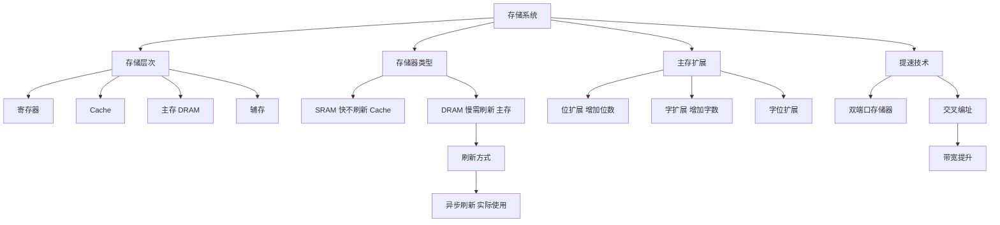

# 408 计组 第三章：存储系统

> 📌 存储系统研究数据如何在计算机中存储与读写。主存是 CPU 直接访问的存储器；SRAM 快而贵，DRAM 慢而便宜——组合成存储层次，Cache 作为桥梁解决速度差。本篇重点是主存扩展的计算。


## 📋 前置知识

- [[408_COA_ch1_概述]] — 了解存储层次结构的整体概念
- [[408_COA_ch2_数制编码]] — 地址计算需要二进制运算能力


## 🧠 核心概念


### 3.1 存储器的分类

> 🎯 **类比**：存储器层次就像你的学习资料存放方式——最常用的公式写在便利贴贴桌上（寄存器），次常用的放在桌面（Cache），一般的放在书架（主存），不常用的归档到柜子（磁盘）。越靠近你（CPU）的越贵越小越快。

**按层次分类**：

| 层次 | 名称 | 速度 | 容量 | 价格/bit | 是否掉电丢失 |
|------|------|------|------|---------|------------|
| 第 0 层 | 寄存器 | $< 1\text{ns}$ | 几十个 | 最贵 | 是（易失） |
| 第 1 层 | Cache | $1\sim 10\text{ns}$ | KB~MB | 很贵 | 是（易失） |
| 第 2 层 | 主存（RAM） | $50\sim 200\text{ns}$ | GB | 中等 | 是（易失） |
| 第 3 层 | 磁盘（辅存） | $5\sim 20\text{ms}$ | TB | 便宜 | 否（非易失） |
| 第 4 层 | 磁带（外存） | 秒级 | PB | 极便宜 | 否（非易失） |

**按存取方式分类**：

| 类型 | 全称 | 访问方式 | 代表 |
|------|------|---------|------|
| **RAM** | Random Access Memory | 随机存取（任意地址等时间访问） | 内存条（DRAM）、Cache（SRAM） |
| **ROM** | Read-Only Memory | 只读，随机存取 | BIOS 芯片、固件 |
| **SAM** | Sequential Access Memory | 顺序存取 | 磁带 |
| **DAM** | Direct Access Memory | 直接存取（磁道随机，道内顺序） | 磁盘 |

**按信息可改写性分类**：

- **RAM（随机存取存储器）**：可读可写，断电丢失，用作主存
- **ROM（只读存储器）**：只读（或有限次写），断电不丢，用于固件
  - MROM：出厂固化，完全不可改写
  - PROM：一次可编程，写后不可改
  - EPROM：紫外线可擦除，可多次重写
  - EEPROM：电可擦除，速度慢，用于配置存储
  - Flash（闪存）：EEPROM 的改进，U 盘、SSD 的基础


### 3.2 SRAM 与 DRAM（⭐ 选择题必考！）

主存（内存条）用 DRAM，Cache 用 SRAM，这是最常考的区别。

| 特性 | SRAM（静态 RAM） | DRAM（动态 RAM） |
|------|----------------|----------------|
| **存储原理** | 用触发器（6 个晶体管）存储一位 | 用电容（1 个晶体管+1 个电容）存储一位 |
| **是否需要刷新** | **不需要**（触发器状态稳定） | **需要**（电容会慢慢放电，需定期刷新） |
| **速度** | 快（纳秒级） | 慢（约 SRAM 的 1/4~1/10） |
| **集成度** | 低（每位 6 个晶体管） | 高（每位 1~2 个晶体管） |
| **功耗** | 大 | 小 |
| **成本** | 贵 | 便宜 |
| **典型用途** | Cache | 主存（内存条） |

> 🎯 **类比**：SRAM 像一盏开着的电灯（触发器维持状态，不会自动关），DRAM 像一个充好电的手机（电容慢慢放电，需要定期"刷新"充电才不会丢数据）。

**DRAM 的刷新**：

DRAM 必须定期刷新（典型刷新周期 2ms）。刷新方式：

| 方式 | 原理 | 特点 |
|------|------|------|
| **集中刷新** | 在一段时间内集中刷新所有行 | 有"死区"（刷新期间 CPU 无法访存） |
| **分散刷新** | 每次存取操作后刷新一行 | 无死区，但系统周期加倍（速度慢） |
| **异步刷新** | 把刷新分散，每隔固定时间刷新一行（不集中也不每次）| 折中，**实际系统常用** |

> ⚠️ **考点**：集中刷新有**死区**（CPU 停止访存等待刷新），这是性能瓶颈。异步刷新是实际系统采用的方式，死区很短（每次只刷新一行）。


### 3.3 主存的技术指标

**存储容量**：存储器能存放的二进制信息总量。

$$\text{容量} = \text{存储单元数} \times \text{每单元位数}$$

常见单位：$1\text{KB} = 2^{10}\text{B} = 1024\text{B}$，$1\text{MB} = 2^{20}\text{B}$，$1\text{GB} = 2^{30}\text{B}$

**存储周期（存取周期）**：连续两次存取操作之间的最小时间间隔。

**存取时间（存取速度）**：从发出读写信号到数据稳定输出的时间。存取时间 $\leq$ 存储周期（周期包含恢复时间）。

**存储带宽**：单位时间内存储器传输的数据量（字节/秒）。

$$\text{带宽} = \frac{\text{数据宽度（字节）}}{\text{存储周期}}$$


### 3.4 主存的扩展（⭐⭐ 大题必考！）

实际系统中，单片存储芯片的容量和位宽往往不满足需求，需要多片芯片组合扩展。

> 🎯 **类比**：如果每本书（芯片）只有 100 页（存储量），你要存放 400 页内容，就需要 4 本书（多片扩展）。如果每本书每次只能翻 1 页（1 位宽），你想每次翻 8 页（8 位），就要 8 本书并排翻（位扩展）。

扩展前，先明确两个参数：

- 芯片的**容量**（地址线决定字数，数据线决定位数）：如 $1K \times 4\text{位}$ 表示有 $2^{10} = 1024$ 个地址，每个地址存 4 位数据
- 系统要求的**总容量**

#### 位扩展（增加数据位宽，字数不变）

**适用场景**：芯片的字数够，但位数不够。

**方法**：多片芯片的**地址线并联**（接相同地址），**数据线分别接到数据总线的不同位**。

**例**：用 $1K \times 4\text{位}$ 的芯片，构建 $1K \times 8\text{位}$ 的存储器。

- 需要芯片数 = $8 / 4 = 2$ 片
- 两片地址线并联，片 1 的 4 条数据线接数据总线低 4 位（$D_0 \sim D_3$），片 2 的 4 条数据线接高 4 位（$D_4 \sim D_7$）
- 读取一个字节时，两片同时被选中，各出 4 位，拼合为 8 位

```
地址总线（10位）→ [芯片1: 1K×4位] → D0~D3
地址总线（10位）→ [芯片2: 1K×4位] → D4~D7
两片的片选信号（CS）接在一起（同时选中）
```

#### 字扩展（增加地址空间，位数不变）

**适用场景**：芯片的位数够，但地址空间不够。

**方法**：多片芯片的**数据线并联**，**地址线的低位并联，高位地址通过译码器控制各片的片选（CS）信号**——某时刻只有一片被选中。

**例**：用 $1K \times 8\text{位}$ 的芯片，构建 $4K \times 8\text{位}$ 的存储器。

- 需要芯片数 = $4K / 1K = 4$ 片
- 系统地址总线需要 $\log_2(4K) = 12$ 位
- 芯片内部地址需要 $\log_2(1K) = 10$ 位
- **低 10 位地址**：接所有芯片的地址引脚（并联）
- **高 2 位地址**：接 $2 \to 4$ 译码器，译码器的 4 个输出分别接 4 片芯片的 $\overline{CS}$（片选，低电平有效）

```
地址总线高2位(A11 A10) → 2:4译码器 → 分别控制片0/片1/片2/片3的CS
地址总线低10位(A9~A0) → 4片芯片的地址引脚（并联）
数据总线8位           → 4片芯片的数据引脚（并联）
某时刻高2位=00→片0被选,其余三片不被选
```

#### 字位同时扩展

同时扩展字数和位数，是前两种的组合。

**例**：用 $1K \times 4\text{位}$ 的芯片，构建 $4K \times 8\text{位}$ 的存储器。

- 先做位扩展：$1K \times 4 \to 1K \times 8$，需 2 片（1 组）
- 再做字扩展：$1K \times 8 \to 4K \times 8$，需 4 组
- 总芯片数 = $2 \times 4 = 8$ 片

$$\text{所需芯片数} = \frac{\text{目标字数}}{\text{芯片字数}} \times \frac{\text{目标位数}}{\text{芯片位数}}$$

#### 地址分配与片选逻辑（⭐ 手算核心）

**例题**：设 CPU 地址总线 16 位（寻址范围 $0000H \sim FFFFH$），数据总线 8 位。现有如下芯片可用：

- RAM 芯片：$4K \times 8\text{位}$（地址线 12 位）
- ROM 芯片：$2K \times 8\text{位}$（地址线 11 位）

要求：RAM 占 $0000H \sim 0FFFH$（4KB），ROM 占 $F800H \sim FFFFH$（2KB）。

**解题步骤**：

**第一步**：确定各区域需要的芯片数。

RAM 区：$4K / 4K = 1$ 片（已满）

ROM 区：$2K / 2K = 1$ 片（已满）

**第二步**：分析地址线的分配。

RAM 芯片需要 12 位地址线，CPU 地址总线 16 位。

低 12 位（$A_0 \sim A_{11}$）接 RAM 芯片的地址引脚。

高 4 位（$A_{12} \sim A_{15}$）用于片选。

RAM 的地址范围 $0000H \sim 0FFFH$：

$A_{15} A_{14} A_{13} A_{12} = 0000$（高四位全 0）

所以 RAM 的片选条件：$A_{15} = A_{14} = A_{13} = A_{12} = 0$

片选逻辑：$\overline{CS_{RAM}} = A_{15} + A_{14} + A_{13} + A_{12}$（任一高位为 1 则不选）

ROM 的地址范围 $F800H \sim FFFFH$：

$F800H = 1111\ 1000\ 0000\ 0000$

$FFFFH = 1111\ 1111\ 1111\ 1111$

高 5 位 $A_{15} \sim A_{11} = 11111$（高 5 位全 1），低 11 位接 ROM 地址引脚。

片选条件：$A_{15} = A_{14} = A_{13} = A_{12} = A_{11} = 1$

片选逻辑：$\overline{CS_{ROM}} = \overline{A_{15} \cdot A_{14} \cdot A_{13} \cdot A_{12} \cdot A_{11}}$


### 3.5 提高主存访问速度的技术

#### 双端口存储器

两个端口（各有独立的地址线、数据线、控制线），允许两个 CPU 或 CPU 与 DMA 同时访问同一存储器。

若两个端口同时访问**同一地址**，需要仲裁（通常优先一个端口）。

#### 多模块存储器

将主存分成若干个独立的**模块（Bank）**，每个模块有自己的地址寄存器、数据寄存器和读写控制，可以**并行工作**。

**顺序编址（高位交叉）**：

地址的高位决定模块号（$M_0, M_1, M_2, \ldots$），低位是模块内地址。

```
M0: 0000~0FFF
M1: 1000~1FFF
M2: 2000~2FFF
```

缺点：连续访问只用一个模块，其他空闲。

**交叉编址（低位交叉）**（⭐ 重点！）：

地址的低位决定模块号，高位是模块内地址。

```
M0: 0, 4, 8, 12, 16, ...（所有地址模4余0的）
M1: 1, 5, 9, 13, 17, ...（所有地址模4余1的）
M2: 2, 6, 10, 14, 18, ...
M3: 3, 7, 11, 15, 19, ...
```

**优点**：连续访问时，相邻地址在不同模块，可以**流水线方式**并行读取——当 CPU 正在读 $M_0$ 的数据时，$M_1, M_2, M_3$ 已经在准备下一批数据，大幅提高吞吐率。

**交叉模块存储器的带宽计算**：

设存储器有 $m$ 个模块，存储周期为 $T$，总线传输周期为 $\tau$（$\tau \ll T$），则：

- **单模块**带宽：$W_0 = \frac{\text{字长}}{\tau}$（每 $\tau$ 秒传一个字）
- **$m$ 模块交叉**带宽：$W = \frac{m \times \text{字长}}{T + (m-1)\tau} \approx m \times W_0$（当 $T \approx m\tau$ 时达到最优）

**最优模块数**：$m = T / \tau$，此时每个模块的存取周期恰好是总线传输时间的整数倍，流水线完美衔接。


## ⚠️ 常见误区与踩坑点

> ❌ **误区 1：DRAM 需要刷新是因为有"电流泄漏"**
> 更准确说是电容的**电荷泄漏**（电容存储的电荷会通过漏电流慢慢消失），不是电流泄漏。每次刷新本质是重新向电容充电。

> ⚠️ **踩坑 2：位扩展 vs 字扩展搞混**
> **位扩展**：多片芯片同时被选中，地址相同，数据线并排（位数加宽），片选信号接在一起。
> **字扩展**：任一时刻只有一片被选中，通过高位地址译码选片，数据线并联（相同数据总线），地址空间扩大。

> ⚠️ **踩坑 3：计算需要芯片数时忘记同时考虑字和位**
> 总芯片数 = (目标字数 ÷ 芯片字数) × (目标位数 ÷ 芯片位数)。两个维度都要扩展时，结果是两者的乘积，不要只算一个方向。

> ❌ **误区 4：地址译码器输出高电平有效**
> 大多数存储芯片的片选（$\overline{CS}$）是**低电平有效**（有上划线的信号），译码器输出低电平时该芯片被选中。设计片选逻辑时注意有效电平方向。


## 🏋️ 动手练习

### 练习 1：存储器扩展芯片数计算（⭐⭐ 难度）

**题目**：用 $16K \times 1\text{位}$ 的 DRAM 芯片，构成 $64K \times 8\text{位}$ 的存储器，需要多少片芯片？地址总线需要多少位？

**参考答案**：

芯片数 = $\frac{64K}{16K} \times \frac{8}{1} = 4 \times 8 = 32$ 片

地址总线位数：$64K = 2^{16}$，需要 **16 位**地址总线

**扩展方式**：先用 8 片做位扩展（$16K \times 1 \to 16K \times 8$），形成 1 组；再用 4 组做字扩展（$16K \times 8 \to 64K \times 8$）。共 $8 \times 4 = 32$ 片。

高 2 位地址（$A_{15}, A_{14}$）经 $2 \to 4$ 译码器选择 4 组之一，低 14 位（$A_{13} \sim A_0$）接各组芯片的地址引脚。


### 练习 2：交叉存储器带宽计算（⭐⭐ 难度）

**题目**：主存由 4 个模块交叉编址，存储周期 $T = 200\text{ns}$，总线传输时间 $\tau = 50\text{ns}$，每次传输 32 位（4 字节）。求交叉存储器的带宽，并与单模块存储器比较。

**参考答案**：

**单模块带宽**：每 $T = 200\text{ns}$ 传 4 字节

$$W_0 = \frac{4\text{B}}{200\text{ns}} = 0.02\text{B/ns} = 20\text{MB/s}$$

**4 模块交叉带宽**：

$$W = \frac{4 \times 4\text{B}}{T + (m-1)\tau} = \frac{16\text{B}}{200 + 3 \times 50} = \frac{16}{350}\text{B/ns} \approx 45.7\text{MB/s}$$

交叉存储器带宽约为单模块的 **2.3 倍**（理想最大倍数为 $m=4$ 倍，实际受总线周期限制）。

当 $m = T/\tau = 200/50 = 4$ 时，恰好是最优模块数，流水线完美衔接，每 $\tau = 50\text{ns}$ 完成一次传输，带宽 = $4\text{B}/50\text{ns} = 80\text{MB/s}$。


## 📝 总结

### 本章要点回顾

1. **SRAM vs DRAM**：SRAM 快不刷新用于 Cache，DRAM 慢需刷新用于主存。异步刷新是实际系统采用的折中方案。

2. **存储扩展**：位扩展增加数据位宽（片选并联，数据线分段），字扩展增加地址空间（高位地址译码选片），字位扩展两者相乘。

3. **芯片数公式**：$N = \dfrac{\text{目标字数}}{\text{芯片字数}} \times \dfrac{\text{目标位数}}{\text{芯片位数}}$

4. **交叉编址**：低位地址决定模块号，连续访问可并行，带宽大幅提升；最优模块数 $m = T/\tau$。

### 知识图谱




## 🔗 相关链接

- 上一章：[[408_COA_ch2_浮点数]]
- 本章续篇：[[408_COA_ch3_Cache]]
- 操作系统关联：[[408_OS_ch3_内存管理]]（虚拟内存是软件层面的存储扩展）


## 📚 参考资料

- 唐朔飞《计算机组成原理（第3版）》第三章 — 存储系统
- 王道考研《计算机组成原理》存储器扩展专题 — 真题计算汇编
