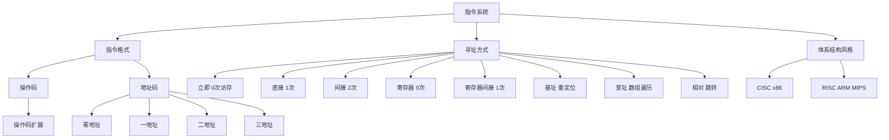

# 408 计组 第四章：指令系统

> 📌 指令系统定义了 CPU 能执行哪些操作、操作数从哪里来。寻址方式是每年必考的选择题考点（共 8 种，必须全部掌握），操作码扩展是计算题考点。

## 📋 前置知识

- [[408_COA_ch2_数制编码]] — 理解二进制地址表示
- [[408_COA_ch1_概述]] — 了解 CPU 的基本工作方式（PC、IR 等寄存器）

## 🧠 核心概念

### 4.1 指令的基本格式

一条机器指令由两部分组成：

$$\underbrace{\text{操作码（OP Code）}}_{指令做什么} \quad \underbrace{\text{地址码（Address Field）}}_{操作数在哪里}$$

**操作码（Operation Code）**：告诉 CPU 执行什么操作（加法？跳转？加载？），是 CU（控制器）的输入。

**地址码**：指定操作数的位置（可以是内存地址、寄存器号、立即数等）。

#### 按地址码个数分类

| 类型 | 格式 | 含义 | 典型指令 |
|------|------|------|---------|
| **零地址指令** | OP | 无操作数或操作数隐含（如堆栈操作） | `NOP`（空操作），`HLT`（停机），堆栈机的 `PUSH/POP` |
| **一地址指令** | OP + A1 | 单操作数（或双操作数隐含一个，如 ACC）| `INC A1`（A1 自增），`NOT A1` |
| **二地址指令** | OP + A1 + A2 | 两个操作数（目的操作数 + 源操作数）| `ADD A1, A2`（A1 = A1 + A2）|
| **三地址指令** | OP + A1 + A2 + A3 | 结果存 A1，A2 和 A3 是两个源操作数 | `ADD A1, A2, A3`（A1 = A2 + A3）|

**地址码数量 vs 指令长度的权衡**：

地址码越多，一条指令能完成的操作越丰富，但指令位数越长（指令字长增加，存储开销大）。现代 RISC 架构倾向三地址，CISC 架构大量使用二地址。

#### 指令长度

**定长指令字**：所有指令等长（如 MIPS、ARM 的 32 位指令），取指方便，便于流水线。

**变长指令字**：指令可以是不同长度（如 x86：1~15 字节），编码密度高，但取指复杂。

**指令字长 vs 机器字长 vs 存储字长**：

- **机器字长**：CPU 一次能处理的数据宽度（ALU 的位数）
- **指令字长**：一条指令的二进制位数
- **存储字长**：存储器一次读写的数据宽度

三者不一定相等，现代系统中常见 32 位机器字长但指令变长。

### 4.2 操作码扩展技术（⭐ 计算题！）

**问题**：指令字长固定时，若操作码位数固定，则操作种类受限；若要增加操作种类，操作码占位增多，地址码位数减少，寻址能力下降。

**解决方案：操作码扩展（Variable-Length Opcode）**——让不同类型的指令使用不同长度的操作码，短操作码对应地址多的指令，长操作码对应地址少的指令。

> 🎯 **类比**：Huffman 编码的思想——常用的指令（如加法）操作码短，稀少的指令（如特殊功能）操作码长，总体平均指令长度最短。

**例题**：设指令字长 16 位，地址码每个 4 位，按以下要求设计操作码扩展方案：

- 三地址指令 15 条（操作码剩余位：$16 - 3\times4 = 4$ 位，能编码 $2^4 = 16$ 种，留出 1 种扩展）
- 二地址指令 15 条
- 一地址指令 15 条
- 零地址指令 16 条

**设计方案**：

**三地址指令**（操作码 4 位，$0000 \sim 1110$，共 15 条）：

$$\underbrace{XXXX}_{4位操作码（0000\sim1110）} \underbrace{AAAA}_{A1} \underbrace{AAAA}_{A2} \underbrace{AAAA}_{A3}$$

**二地址指令**（操作码 8 位，高 4 位 = $1111$，低 4 位 $0000\sim1110$，共 15 条）：

$$\underbrace{1111\ XXXX}_{8位操作码（11110000\sim11111110）} \underbrace{AAAA}_{A1} \underbrace{AAAA}_{A2}$$

**一地址指令**（操作码 12 位，高 8 位 = $1111\ 1111$，低 4 位 $0000\sim1110$，共 15 条）：

$$\underbrace{1111\ 1111\ XXXX}_{12位操作码} \underbrace{AAAA}_{A1}$$

**零地址指令**（操作码 16 位，高 12 位 = $1111\ 1111\ 1111$，低 4 位 $0000\sim1111$，共 16 条）：

$$\underbrace{1111\ 1111\ 1111\ XXXX}_{16位操作码}$$

**验证**：$15 + 15 + 15 + 16 = 61$ 条指令，共 $61 < 2^4 + 2^8 + 2^{12} + 2^{16}$（远小于极限）。

> ⚠️ **考点**：操作码扩展的关键是**短操作码编码要留出"扩展标志"**（如高 4 位全为 $1111$ 表示"这不是三地址指令，请看后面的位"）。计算可以编多少条指令时，要注意每级留出若干种给下一级扩展。

### 4.3 寻址方式（⭐⭐⭐ 选择题大题必考！）

寻址方式（Addressing Mode）决定如何根据指令中的地址码找到真正的操作数。

设指令中的地址码字段为 $A$（形式地址），最终操作数所在地址为**有效地址（EA，Effective Address）**。

> ⚠️ **约定**：以下用 $R$ 表示寄存器，$M[EA]$ 表示内存地址 EA 处的内容，$(R)$ 表示寄存器 R 的内容，$[A]$ 表示地址 A 对应的内存内容。

#### 寻址方式 1：立即寻址（Immediate Addressing）

**操作数本身就在指令中**，不需要额外的内存访问。

$$\text{操作数} = A \quad \text{（A 本身就是数值，不是地址）}$$

- 优点：**速度最快**（无需访存），最节省时间
- 缺点：操作数大小受指令字长限制，不灵活
- 例：`MOV R0, #5`（把立即数 5 装入 R0）

#### 寻址方式 2：直接寻址（Direct Addressing）

**地址码 $A$ 就是操作数的内存地址**。

$$EA = A, \quad \text{操作数} = M[A]$$

- 需要 1 次访存（访问内存地址 $A$）
- 例：`LOAD R0, 1000H`（从内存地址 1000H 取数到 R0）

#### 寻址方式 3：间接寻址（Indirect Addressing）

**地址码 $A$ 所指向的内存单元中，存放的才是操作数的地址**。

$$EA = M[A], \quad \text{操作数} = M[M[A]]$$

- 需要 **2 次访存**（第一次取地址，第二次取数据）
- 可以多级间接（理论上无限，但代价极高）
- 优点：可以表示比指令地址码更大的地址空间（地址码扩展）
- 例：若内存 1000H 处存放 2000H，`LOAD R0, @1000H` 会从 2000H 取数（先读 1000H 得到 2000H，再读 2000H 得到数据）

#### 寻址方式 4：寄存器寻址（Register Addressing）

**操作数在寄存器中**，地址码 $A$ 是寄存器号。

$$EA = R_A, \quad \text{操作数} = (R_A)$$

- **无需访存**（寄存器在 CPU 内部），速度仅次于立即寻址
- 寄存器数量有限（通常 16~32 个），寄存器号只需 4~5 位
- 例：`ADD R0, R1`（R0 = R0 + R1，两个操作数都在寄存器）

#### 寻址方式 5：寄存器间接寻址（Register Indirect Addressing）

**寄存器中存放的是操作数的内存地址**。

$$EA = (R_A), \quad \text{操作数} = M[(R_A)]$$

- 需要 1 次访存（寄存器中取地址，然后访问内存）
- 比直接寻址灵活（地址可以运行时动态修改）
- 例：`LOAD R0, (R1)`（把 R1 中存放的地址对应的内存内容取到 R0）

#### 寻址方式 6：基址寻址（Base Addressing）

**有效地址 = 基址寄存器（BR）的内容 + 形式地址 $A$（偏移量）**。

$$EA = (BR) + A$$

- 基址寄存器（BR）存放程序的起始地址（或段基址），$A$ 是相对于基址的偏移
- 优点：程序浮动（装入内存的不同位置）时，只需修改 BR，程序内部 $A$ 不变，实现程序重定位
- 典型应用：操作系统的多道程序，每个进程的 BR 不同，实现地址隔离
- 例：BR = $2000H$，$A = 100H$，$EA = 2100H$

#### 寻址方式 7：变址寻址（Index Addressing）

**有效地址 = 变址寄存器（IX）的内容 + 形式地址 $A$（基地址）**。

$$EA = (IX) + A$$

看起来和基址寻址公式一样，但用途和变化的主体不同：

| 对比 | 基址寻址 | 变址寻址 |
|------|----------|---------|
| 固定的量 | $A$（偏移，不变） | $A$（基地址，不变） |
| 变化的量 | BR（程序重定位时改） | IX（遍历数组时改） |
| 典型用途 | 程序重定位、多道程序 | 数组遍历、循环计数 |

- 变址寄存器 IX 由程序员控制，随循环自动递增
- 例：$A = \text{数组首地址}$，IX = 循环变量 $i$，$EA = A + (IX)$ 每次自动访问下一个元素

#### 寻址方式 8：相对寻址（PC-Relative Addressing）

**有效地址 = 程序计数器（PC）的当前值 + 形式地址 $A$（位移量）**。

$$EA = (PC) + A$$

- $A$ 是相对于当前指令（PC 指向的位置）的偏移，可正可负
- 主要用于**跳转指令**（BEQ、BNE 等条件跳转），跳转目标用相对当前位置的偏移表示
- 优点：程序与位置无关（Position Independent Code），整个程序搬移后跳转仍然正确（相对距离不变）
- 例：ARM 的 `B label`，跳转目标地址 = PC + 偏移量

#### 寻址方式汇总对比（⭐ 速查表）

| 寻址方式 | 有效地址 EA | 访存次数 | 特点 |
|----------|-----------|---------|------|
| 立即寻址 | 操作数 = A（不是地址）| 0 | 最快，操作数受限 |
| 直接寻址 | $A$ | 1 | 简单直接 |
| 间接寻址 | $M[A]$ | 2（单级）| 可扩大地址空间 |
| 寄存器寻址 | $R_A$（寄存器）| 0 | 快，操作数在寄存器 |
| 寄存器间接寻址 | $(R_A)$ | 1 | 灵活，支持指针 |
| 基址寻址 | $(BR) + A$ | 1 | 程序重定位 |
| 变址寻址 | $(IX) + A$ | 1 | 数组访问，循环 |
| 相对寻址 | $(PC) + A$ | 1 | 跳转指令，位置无关代码 |

### 4.4 CISC vs RISC（⭐ 选择题/简答题）

计算机体系结构的两大设计哲学：

| 特性 | CISC（复杂指令集）| RISC（精简指令集）|
|------|-----------------|-----------------|
| **全称** | Complex Instruction Set Computer | Reduced Instruction Set Computer |
| **指令数量** | 多（几百条）| 少（几十条）|
| **指令长度** | 变长 | 定长（通常 32 位）|
| **寻址方式** | 多种复杂寻址方式 | 少（通常只有寄存器和基址）|
| **访存操作** | 指令可以直接访存（`ADD [mem], R0`）| 只有 Load/Store 指令访存，其他指令只操作寄存器 |
| **通用寄存器** | 少（x86 只有 8 个）| 多（32 个）|
| **微程序控制器** | 通常用微程序（指令复杂，硬连线难）| 通常用硬连线（指令简单，速度快）|
| **流水线** | 难以流水（变长指令，周期不等）| 易于流水（定长指令，各阶段时间均匀）|
| **代表** | Intel x86（PC、服务器）| ARM（手机）、MIPS（路由器）、RISC-V（新兴）|

> 💡 **现代发展**：x86（CISC）内部实际上把复杂指令"翻译"成类 RISC 的微操作（$\mu$ops）执行，外表是 CISC，内核是 RISC；ARM（RISC）也在增加复杂指令（如 NEON SIMD）。纯粹的 CISC 和 RISC 界限已经模糊。

> ⚠️ **408 考点**：RISC 强调 Load/Store 结构（访存指令只有 Load 和 Store 两种，其他运算指令只在寄存器间进行）；CISC 允许运算指令直接对内存操作数进行计算。

## ⚠️ 常见误区与踩坑点

> ❌ **误区 1：基址寻址和变址寻址是同一回事**
> 公式虽然形式相同（都是寄存器 + 偏移），但语义不同：基址寄存器由操作系统设置（程序员不直接改），用于支持多进程和程序重定位；变址寄存器由程序员（编译器）控制，用于遍历数组等循环操作。

> ⚠️ **踩坑 2：相对寻址中 PC 的值**
> 相对寻址的 EA = (PC) + A，但 PC 的值已经是**取完当前指令后**自动增加到下一条指令的值（因为取指后 PC 自动加 1），不是当前指令的地址。这个细节在计算跳转目标时容易出错。

> ❌ **误区 3：间接寻址只有 2 次访存**
> 单级间接寻址需要 2 次访存，但多级间接（$@@@A$，三级间接）需要 4 次访存（3 次取地址 + 1 次取数据）。题目给的间接级数决定访存次数。

> ⚠️ **踩坑 3：立即寻址的"访存次数"**
> 立即寻址的操作数在指令中，取指时操作数已经取出，**不需要额外访存**（访存次数 = 0）。但取指本身是一次访存（取指令），有些题目不把取指算在内，有些算，注意题目要求。

## 🏋️ 动手练习

### 练习 1：操作码扩展计算（⭐⭐ 难度）

**题目**：指令字长 12 位，地址码每个 3 位，设计一个操作码扩展方案，使得：三地址指令 4 条，二地址指令 8 条，一地址指令 12 条，零地址指令数量尽可能多。共有多少条零地址指令？

**参考答案**：

指令总位数 12 位，地址码每个 3 位。

- 三地址：操作码 = $12 - 3\times3 = 3$ 位，可编 $2^3 = 8$ 种，用 4 条，留 $8-4=4$ 种扩展
  - 操作码 $000\sim011$：三地址指令 4 条
  - $100\sim111$：扩展标志（给二地址使用）

- 二地址：高 3 位 = $100\sim111$（4 种前缀），加 3 位扩展 = 6 位操作码，可编 $4\times2^3 = 32$ 种，用 8 条，留 $32-8=24$ 种扩展
  - 操作码 $100\ 000\sim100\ 111$（8条），其余 24 种给一地址扩展
  - 实际：$100\ 000\sim100\ 111$（8条），$101\ 000\sim111\ 111$（24种扩展给一地址）

- 一地址：前缀 $101\sim111$（3种）的全部 + $100\ 1XX$（4种），共 $3\times8 + 4 = 28$ 种前缀，加 3 位 = 9 位操作码，可编多条...

这里重新更清晰地用标准方法计算：

三地址 4 条 → 占用操作码 $000, 001, 010, 011$（3 位，从 8 中用 4，剩余 $100\sim111$ 共 4 种给后续扩展）

二地址 → 高 3 位取 $100\sim111$ 中的某些，低 3 位扩展 = 6 位操作码

用高 3 位 $100$ + 低 3 位 $000\sim111$ 给二地址，共可有 8 条，恰好用完 $100\ XXX$（8种）。

一地址 → 高 6 位从 $101\ 000\sim111\ 111$ 中取，低 3 位扩展 = 9 位操作码

用 $101\ 000\sim101\ 011$（4种前缀的 9 位）给一地址：$101\ 000\ XXX$（4+4+4=12条，用 $101\ 000, 101\ 001, 101\ 010$ 的各 4 种 = 12 条）

零地址 → 剩余所有组合，高 9 位取剩余，低 3 位全用 = 12 位操作码

剩余的 9 位前缀：$101\ 011, 101\ 1XX, 110\ XXX, 111\ XXX$ 等，每个 9 位前缀对应 $2^3 = 8$ 种零地址 → 需要精确数剩余 9 位前缀的个数

剩余 9 位 = 所有可能 $2^9 = 512$ 种 - 已用的：4（三地址）+8（二地址用前 6 位 $100\ XXX$）+12 条一地址（各占 1 个 9 位前缀）= $512 - 4\times2^6 - 8\times2^3 - 12 = 512 - 256 - 64 - 12 = 180$ 种 9 位前缀 → $180 \times 2^3 / 2^3$... 

**简洁版答案**：

操作码扩展计算套路——每级用掉的编码数从全集中扣除：

- 三地址（3 位 OP）：$4$ 条用掉 4 个 3 位编码
- 二地址（6 位 OP）：$8$ 条用掉 8 个 6 位编码（但高 3 位消耗了 $8/8 = 1$ 个 3 位扩展槽）
- 一地址（9 位 OP）：$12$ 条用掉 12 个 9 位编码
- 零地址（12 位 OP）：剩余所有 12 位编码

总 12 位编码数 = $2^{12} = 4096$

被占用的 12 位编码数 = $4 \times 2^9 + 8 \times 2^6 + 12 \times 2^3 = 2048 + 512 + 96 = 2656$

**零地址指令数 = $4096 - 2656 = 1440$ 条**

### 练习 2：寻址方式判断（⭐ 难度）

**题目**：设 PC = $200H$，某指令在地址 $200H$，内容为 `LOAD R0, [400H]`，地址码 $A = 400H$，内存 $400H$ 处的内容是 $600H$，内存 $600H$ 处的内容是 $99$。

判断以下操作数分别对应哪种寻址方式：

A. 操作数 = $400H$（立即数形式）

B. 操作数 = 内存 $[400H]$ 的内容 = $600H$

C. 操作数 = 内存 $[600H]$ 的内容 = $99$

D. R1 中存放 $400H$，操作数 = 内存 $[(R1)]$ 的内容 = $600H$

**参考答案**：

A → **立即寻址**（操作数 $400H$ 直接编码在指令中，是数值而非地址）

B → **直接寻址**（$EA = 400H$，访问内存 $[400H]$ 得 $600H$，这里 $600H$ 是数据而非地址）

> 注：若 $600H$ 被视为操作数则是直接寻址；若视为再下一层的地址，则是间接寻址。

C → **间接寻址**（$EA = M[400H] = 600H$，最终从 $M[600H] = 99$ 取数，共 2 次访存）

D → **寄存器间接寻址**（R1 中存地址 $400H$，$EA = (R1) = 400H$，取 $M[400H] = 600H$）

## 📝 总结

### 本章要点回顾

1. **指令格式**：操作码 + 地址码；按地址码数量分为零/一/二/三地址指令；定长指令便于流水，变长编码密度高。

2. **操作码扩展**：短 OP 留扩展位给下级，长 OP 用于地址码少的指令；计算可用指令数 = 总编码数 - 各级已用编码数。

3. **八种寻址方式**（访存次数是关键）：立即和寄存器寻址 0 次，直接/寄存器间接/基址/变址/相对 1 次，间接（单级）2 次。

4. **CISC vs RISC**：CISC 指令复杂变长，RISC 定长精简 Load/Store 结构；现代 CPU 内部已趋近融合。

### 知识图谱

## 🔗 相关链接

- 上一章：[[408_COA_ch3_Cache]]
- 下一章：[[408_COA_ch5_CPU]]
- 操作系统关联：[[408_OS_ch1_概述]]（系统调用与指令系统的关联）

## 📚 参考资料

- 唐朔飞《计算机组成原理（第3版）》第四章 — 指令系统
- 王道考研《计算机组成原理》寻址方式专题 — 8 种寻址方式真题汇编
