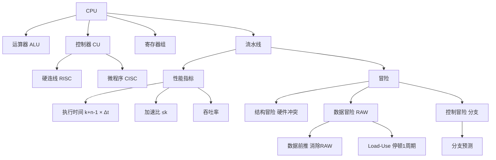

# 408 计组 第五章：CPU 与流水线

> 📌 CPU 是计算机的核心，执行指令的完整过程（取指→译码→执行→写回）构成数据通路。流水线让多条指令重叠执行，是现代 CPU 提高性能的核心技术。流水线的性能计算（吞吐率、加速比）和冒险处理是 408 大题必考内容。


## 📋 前置知识

- [[408_COA_ch4_指令系统]] — 需要理解指令格式和寻址方式
- [[408_COA_ch3_Cache]] — 理解取指时的 Cache 访问
- [[408_OS_ch1_概述]] — 了解中断机制（与 CPU 控制密切相关）


## 🧠 核心概念


### 5.1 CPU 的功能与组成

**CPU（Central Processing Unit）**的四大功能：

| 功能 | 说明 |
|------|------|
| **指令控制** | 控制指令的执行顺序（程序计数器 PC 的维护） |
| **操作控制** | 向各部件发出控制信号，协调操作时序 |
| **时间控制** | 为每个微操作规定时序 |
| **数据加工** | 对数据进行算术和逻辑运算（ALU）|

**CPU 的内部组成**：

```
CPU
├── 运算器（ALU）
│   ├── 算术逻辑单元 ALU（加减乘除、AND/OR/NOT/XOR）
│   ├── 累加器 ACC（存放运算结果）
│   ├── 移位器
│   └── 状态寄存器 PSW（进位、溢出、零标志等）
└── 控制器（CU）
    ├── 程序计数器 PC（下一条指令地址）
    ├── 指令寄存器 IR（当前正在执行的指令）
    ├── 指令译码器 ID（分析 IR 中的操作码）
    ├── 存储器地址寄存器 MAR
    ├── 存储器数据寄存器 MDR
    └── 时序发生器（产生节拍信号，控制操作时序）
```

**通用寄存器**（用户可见，用于存放操作数和中间结果）：

- x86：EAX/EBX/ECX/EDX（通用），ESP（栈指针），EBP（帧指针），ESI/EDI（变址）
- MIPS：$0~$31（32 个 32 位通用寄存器），$0 恒为 0，$31 为返回地址


### 5.2 指令的执行过程（数据通路）

一条典型的二地址内存操作指令（如 `ADD R0, [1000H]`）的完整执行过程：

**阶段一：取指（Instruction Fetch, IF）**

```
PC → MAR          // 把PC的值送到MAR（当前指令的地址）
M[MAR] → MDR      // 从内存读出指令到MDR（经过Cache）
MDR → IR           // 指令送入指令寄存器
PC ← PC + 1       // PC自动加1（指向下一条指令）
```

**阶段二：指令译码（Instruction Decode, ID）**

```
IR → 指令译码器    // 分析操作码，确定执行什么操作
                   // 分析地址码，确定操作数来源
```

**阶段三：取操作数/执行（Execute/Memory Access, EX/MEM）**

（以访存加法为例）

```
IR[地址码] → MAR  // 把操作数地址送MAR
M[MAR] → MDR      // 从内存取操作数
MDR → ALU 输入    // 把操作数送ALU
R0 → ALU 输入     // 另一个操作数来自R0
ALU 执行加法      // 计算 R0 + M[1000H]
```

**阶段四：写回（Write Back, WB）**

```
ALU 结果 → R0     // 把计算结果写回目的寄存器
（或写回内存）
```

> ⚠️ **考点**：不同指令需要的阶段数不同。简单的寄存器运算指令（如 `ADD R0, R1`）不需要访存阶段（直接取寄存器操作数），只需 IF → ID → EX → WB 四个阶段。访存指令（如 `LOAD`/`STORE`）需要额外的 MEM 阶段。


### 5.3 控制器的两种实现方式（⭐ 选择题！）

控制器负责根据指令产生正确的控制信号序列，有两种实现方式：

#### 硬连线控制器（Hardwired Controller）

**原理**：用组合逻辑电路直接产生控制信号，控制信号 = 指令操作码 + 时序信号的逻辑函数。

```
操作码 → 译码电路 → 控制信号
时序信号 ↗
```

- **优点**：速度快（纯组合电路，延迟小）
- **缺点**：设计复杂，修改困难（增加新指令需要重新设计电路）
- **适用**：RISC 处理器（指令少，规整，易于硬连线实现）

#### 微程序控制器（Microprogrammed Controller）

> 🎯 **类比**：把每条机器指令（宏操作）翻译成一段"微程序"（一系列微操作序列），微程序存储在控制存储器（ROM）中。执行一条机器指令，就是取出并执行对应的微程序。

**基本概念**：

| 术语 | 含义 |
|------|------|
| **微操作（Micro-operation）** | 最基本的硬件操作，如"MAR ← PC"、"MDR ← M[MAR]" |
| **微命令（Micro-command）** | 实现微操作的控制信号 |
| **微指令（Micro-instruction）** | 一条微指令，包含若干个可以并行执行的微命令 |
| **微程序（Micro-program）** | 实现一条机器指令的微指令序列 |
| **控制存储器（CM/ROM）** | 存放所有微程序的只读存储器（位于 CPU 内部）|
| **微程序计数器（μPC）** | 类似 PC，指向下一条微指令的地址 |

**微程序控制器的执行过程**：

1. 取机器指令（同硬连线），放入 IR
2. 根据操作码，在 CM 中找对应微程序的入口地址 → 送入 $\mu$PC
3. 从 CM 取出第一条微指令，执行（发出控制信号）
4. $\mu$PC 自动更新，取下一条微指令
5. 重复直到该微程序执行完毕（遇到结束标志）

- **优点**：设计规整，易于实现复杂指令集（增加指令只需在 CM 中增加微程序），便于修改
- **缺点**：每条机器指令需要多条微指令，速度慢于硬连线
- **适用**：CISC 处理器（x86）

#### 微指令的编码方式

| 编码方式 | 原理 | 优缺点 |
|----------|------|--------|
| **直接编码（水平型）** | 每位对应一个微命令，1=有效 | 并行度高，速度快；微指令字很长 |
| **字段直接编码（混合型）** | 将互斥的微命令分组，组内编码 | 缩短微指令字长；组间仍可并行 |
| **字段间接编码** | 某字段的值受另一字段约束 | 进一步压缩，但需要再次译码 |

**互斥微命令**：不能同时执行的微命令放在同一字段中（如"MAR←PC"和"MAR←IR"不能同时做，放同组）。

**相容微命令**：可以并行执行的微命令放在不同字段（如"PC+1"和"MDR←M[MAR]"可以并行）。


### 5.4 中断系统（⭐ 必考！）

中断是 CPU 对外部或内部突发事件的响应机制，是操作系统实现进程调度、I/O 处理的硬件基础。

**中断的基本概念**（→ 与 [[408_OS_ch1_概述]] 紧密关联）：

- **外中断（硬件中断）**：来自 CPU 外部（I/O 设备、时钟）
- **内中断（异常）**：CPU 执行指令时内部产生（溢出、除零、非法指令）

**中断响应过程**（硬件完成）：

1. 检查中断标志（每条指令执行完后检测）
2. 若有中断请求且中断未屏蔽，保存断点（PC → 栈或专用寄存器）
3. 保存 CPU 状态（PSW → 栈）
4. 关中断（防止嵌套中断打乱流程）
5. 识别中断源，获取中断服务程序入口地址（查中断向量表）
6. 跳转到中断服务程序

**中断服务程序执行**（软件完成）：

7. 保存现场（保存通用寄存器等）
8. 开中断（允许更高优先级中断嵌套）
9. 执行中断服务（如读取键盘数据）
10. 关中断
11. 恢复现场
12. `IRET`（中断返回），恢复 PSW 和 PC，继续被中断的程序

**中断优先级与嵌套中断**：

多个中断同时发生时，需要按优先级排序。典型优先级：

$$\text{内部异常} > \text{DMA} > \text{I/O 中断} > \text{时钟中断}$$

允许高优先级中断嵌套（打断低优先级中断服务程序），通过**中断屏蔽字**控制。


### 5.5 流水线（Pipeline）（⭐⭐⭐ 大题必考！）

> 🎯 **类比**：洗衣服需要四步——洗（30min）+ 漂（30min）+ 脱水（30min）+ 晾（30min）。如果一次洗一件，4 件衣服要 $4 \times 4 \times 30 = 480\text{min}$。但如果流水线操作——第 1 件在晾的同时第 2 件在脱水、第 3 件在漂、第 4 件在洗，4 件只需 $4 \times 30 + 3 \times 30 = 210\text{min}$，几乎快了一倍！

**流水线原理**：将指令执行过程分成若干**阶段（Stage）**，每个阶段由独立的硬件单元负责，多条指令在不同阶段**重叠执行**（时间上并行）。

**典型五级流水线**（MIPS 经典结构）：

$$\text{IF（取指）} \to \text{ID（译码）} \to \text{EX（执行）} \to \text{MEM（访存）} \to \text{WB（写回）}$$

**流水线时空图**（执行 5 条指令，5 级流水，每级 1 个时钟周期）：

```
时钟周期:  1   2   3   4   5   6   7   8   9
指令 I1:  IF  ID  EX  MEM  WB
指令 I2:      IF  ID  EX  MEM  WB
指令 I3:          IF  ID  EX  MEM  WB
指令 I4:              IF  ID  EX  MEM  WB
指令 I5:                  IF  ID  EX  MEM  WB
```

5 条指令，非流水线需 $5 \times 5 = 25$ 个周期，流水线只需 **9** 个周期。


### 5.6 流水线性能指标（⭐⭐ 必须手算！）

设流水线共 $k$ 级，每级时间 $\Delta t$（设各级时间相同），执行 $n$ 条指令。

#### 流水线执行时间

$$T_\text{流水} = (k + n - 1) \times \Delta t$$

推导：前 $k$ 个周期"灌满"流水线，之后每个周期完成 1 条指令，$n$ 条指令共 $n-1$ 个额外周期，总计 $k + n - 1$ 个周期。

**不流水（顺序执行）的时间**：

$$T_\text{顺序} = n \times k \times \Delta t$$

#### 吞吐率（Throughput Rate, TP）

单位时间内完成的指令数：

$$TP = \frac{n}{T_\text{流水}} = \frac{n}{(k+n-1)\Delta t}$$

当 $n \gg k$ 时（流水线稳定），最大吞吐率：

$$TP_\text{max} = \frac{1}{\Delta t}$$

即每个时钟周期完成一条指令（理想情况）。

#### 加速比（Speedup, Sp）

$$Sp = \frac{T_\text{顺序}}{T_\text{流水}} = \frac{nk\Delta t}{(k+n-1)\Delta t} = \frac{nk}{k+n-1}$$

当 $n \gg k$ 时：

$$Sp \approx k$$

最大加速比约等于流水线级数 $k$（不能超过 $k$ 倍，因为每条指令至少要经过 $k$ 级）。

#### 效率（Efficiency, E）

流水线各阶段的利用率（流水线时空图中有效方格占总方格的比例）：

$$E = \frac{Sp}{k} = \frac{n}{k+n-1} \to 1 \text{（当 } n \to \infty \text{）}$$

**例题**：5 级流水线，每级 $\Delta t = 2\text{ns}$，执行 $100$ 条指令，求执行时间、吞吐率、加速比。

$$T_\text{流水} = (5 + 100 - 1) \times 2 = 104 \times 2 = 208\text{ns}$$

$$T_\text{顺序} = 100 \times 5 \times 2 = 1000\text{ns}$$

$$TP = \frac{100}{208\text{ns}} \approx 0.481 \text{ 条/ns} = 481\text{ MIPS}$$

$$Sp = \frac{1000}{208} \approx 4.81$$

$$E = \frac{4.81}{5} = 96.2\%$$

#### 各级时间不等时（瓶颈级）

实际流水线各级时间往往不相等。流水线的时钟周期由**最慢的一级**决定（瓶颈级）：

$$\Delta t = \max(\Delta t_1, \Delta t_2, \ldots, \Delta t_k)$$

**解决瓶颈的方法**：

- 将瓶颈级拆分为多个子级（增加流水级数）
- 在瓶颈级并联多个功能部件


### 5.7 流水线冒险（Hazard）（⭐⭐ 大题必考！）

流水线冒险是指由于各种原因，下一条指令**不能在预期的时钟周期内执行**，流水线必须**停顿（Stall）**。

#### 结构冒险（Structural Hazard）

**原因**：不同指令需要同一硬件资源（同一时钟周期内发生冲突）。

**典型场景**：

- 只有一个内存端口：取指（IF）和访存（MEM）同时要用内存
- 只有一个写端口：两条指令同时要写回寄存器

**解决方案**：

- 硬件重复（如哈佛架构：指令存储器和数据存储器分离，IF 和 MEM 不冲突）
- 增加内存端口或总线
- 流水线停顿（简单但性能损失大）

#### 数据冒险（Data Hazard）（⭐ 最重要！）

**原因**：后续指令依赖前面指令尚未完成写入的数据（RAW 相关最常见）。

**三种数据相关类型**：

| 类型 | 全称 | 含义 | 是否产生真实冒险 |
|------|------|------|----------------|
| **RAW**（先写后读）| Read After Write | 读操作需要前面写操作的结果 | **是，最常见** |
| **WAR**（先读后写）| Write After Read | 写操作覆盖了后面读操作需要的数据 | 顺序流水线中不会（读先于写）|
| **WAW**（先写后写）| Write After Write | 后面的写覆盖了前面的写 | 乱序执行时可能 |

**RAW 的例子**：

```
I1: ADD R1, R2, R3   // R1 = R2 + R3（WB 阶段写 R1）
I2: SUB R4, R1, R5   // R4 = R1 - R5（ID 阶段需要读 R1）
```

在 5 级流水线中，I1 在第 5 周期才写回 R1，而 I2 在第 3 周期（EX 阶段）就需要读 R1——产生 **3 个周期的停顿**（如果不处理）。

**解决 RAW 冒险的方法**：

**① 流水线停顿（Stall/Bubble）**：

插入空泡（NOP），等待前面指令写回后再继续。性能损失大（每个 RAW 可能停顿 1~3 周期）。

**② 数据前推/旁路（Data Forwarding / Bypassing）**（⭐ 最重要！）：

不等 WB 写回寄存器，而是直接把 ALU 的输出（或 MEM 的输出）**转发**给需要它的后续指令的 EX 阶段。

```
I1: ADD R1, R2, R3
         ↓（EX 结果直接转发）
I2: SUB R4, R1, R5   // EX 阶段直接用 I1 的 EX 结果，无需等待 WB
```

数据前推可以消除大部分 RAW 冒险，但遇到 Load-Use 冒险（`LOAD` 后紧跟使用该寄存器的指令）无法完全消除（需要停顿 1 个周期）：

```
I1: LOAD R1, [1000H]   // MEM 阶段才能从内存取得 R1 的值
I2: ADD R4, R1, R5    // EX 阶段就需要 R1（比 I1 的 MEM 还早 1 周期）
```

Load-Use 必须停顿 1 个周期（插入气泡），即使有前推也无法消除。

**③ 编译器指令重排（Code Scheduling）**：

编译器在不改变程序语义的前提下，把无关指令插入到相关指令之间，填充停顿槽：

```
// 原始（有 RAW）：
LOAD R1, [1000H]
ADD R4, R1, R5    // Load-Use 停顿

// 重排后（无停顿）：
LOAD R1, [1000H]
ADD R6, R7, R8    // 插入无关指令（填充停顿槽）
ADD R4, R1, R5    // 此时 R1 已可用
```

#### 控制冒险（Control Hazard）

**原因**：分支（跳转）指令改变了 PC，但流水线已经取了分支后的若干条指令（这些指令可能是错的）。

**问题场景**：

```
地址 100: BEQ R1, R0, 200H   // 若 R1=0 则跳到 200H
地址 104: ADD ...              // 流水线在 BEQ 还未判断时已取了这条
地址 108: SUB ...              // 又取了这条
地址 200: AND ...              // 实际应该跳到这里
```

**解决方法**：

| 方法 | 原理 | 效果 |
|------|------|------|
| **分支停顿（Flush）** | 等分支结果确定后再取指，期间停顿 | 简单，但停顿 $k-1$ 个周期 |
| **延迟槽（Delay Slot）** | 分支后的 1~2 条指令总是执行（无论跳转与否），编译器填充无关指令 | MIPS 采用，节省停顿 |
| **分支预测（Branch Prediction）** | 猜测分支方向（通常猜"不跳"），若预测错误则清空流水线 | 简单预测命中率约 50~80% |
| **动态分支预测（BHT/BTB）** | 用历史记录预测跳转方向，命中率 90%+ | 现代 CPU 采用，高效 |

**静态预测策略**：

- **预测不跳转**：继续顺序执行，若实际跳转则清空已取的指令
- **预测总跳转**：预取跳转目标处的指令，若实际不跳则清空
- **BTFN（Backward Taken, Forward Not-taken）**：后向分支（循环）预测跳转，前向分支预测不跳转（命中率高于简单静态预测）


### 5.8 超标量与超流水

**超流水线（Super-pipelining）**：将流水线阶段进一步细分（如 10 级、20 级），每级更短，时钟频率更高。代价：冒险停顿的惩罚更大。

**超标量（Superscalar）**：每个时钟周期发射多条指令（需要多个功能部件）。IPC（每周期执行指令数）> 1。

**乱序执行（Out-of-Order Execution）**：CPU 动态重排指令执行顺序，让准备好的指令先执行，减少等待数据的停顿。现代高性能 CPU（Intel、AMD）都采用。


## ⚠️ 常见误区与踩坑点

> ⚠️ **踩坑 1：流水线执行时间公式的 $\Delta t$**
> 公式 $T = (k + n - 1) \times \Delta t$ 中，$\Delta t$ 是**单个流水阶段的时间**，而不是一整条指令的执行时间。若各阶段时间不等，$\Delta t$ 取最慢阶段（瓶颈）的时间。

> ❌ **误区 2：加速比最大是无限大**
> 流水线加速比最大约等于 $k$（流水级数），当 $n \to \infty$ 时趋近 $k$。不能无限提高，因为每条指令至少要经过 $k$ 个阶段。

> ⚠️ **踩坑 2：Load-Use 冒险即使有数据前推也必须停顿 1 周期**
> 普通 RAW（如 ADD 后跟 SUB）可以用前推消除；但 LOAD 的结果在 MEM 阶段末才出来，而后续指令的 EX 阶段需要在 MEM 阶段**同时或更早**开始——时间上不可能前推，必须停顿 1 个周期。

> ❌ **误区 3：WAR 和 WAW 在顺序流水线中都会产生冒险**
> WAR（先读后写）在顺序流水线中不会产生冒险，因为读操作在前（先 ID 读寄存器），写操作在后（后 WB 写寄存器），顺序天然保证了读在写之前完成。只有在乱序执行中 WAR 才可能成为问题。

> ⚠️ **踩坑 3：微程序控制器的控制存储器是主存的一部分**
> 控制存储器（CM）在 **CPU 内部**，独立于主存，是专用的 ROM/RAM，存放微程序。不是主存的地址空间，不参与普通的内存访问。


## 🔄 硬连线 vs 微程序控制器

| 特性 | 硬连线控制器 | 微程序控制器 |
|------|------------|------------|
| **速度** | 快（组合逻辑，无需取微指令）| 慢（每步都要取微指令）|
| **修改难度** | 难（需重新设计电路）| 易（修改控制存储器中的微程序）|
| **规整性** | 差（复杂指令难以实现）| 好（每条指令对应一段微程序）|
| **适用** | RISC（指令少而简单）| CISC（指令多而复杂）|
| **代表** | ARM、MIPS | x86（内部有微码层）|


## 🏋️ 动手练习

### 练习 1：流水线性能计算（⭐⭐ 难度）

**题目**：一条 5 级流水线（IF/ID/EX/MEM/WB），各级执行时间分别为：$2\text{ns}, 3\text{ns}, 4\text{ns}, 3\text{ns}, 2\text{ns}$。

(a) 流水线的时钟周期是多少？

(b) 执行 100 条指令，流水线执行时间和顺序执行时间各是多少？

(c) 加速比和效率各是多少？

**参考答案**：

**(a)** 时钟周期由最慢级决定：$\Delta t = \max(2,3,4,3,2) = 4\text{ns}$

**(b)** 流水线执行时间：

$$T_\text{流水} = (5 + 100 - 1) \times 4 = 104 \times 4 = 416\text{ns}$$

顺序执行时间（每条指令完整经过 5 级，每级 4ns）：

$$T_\text{顺序} = 100 \times 5 \times 4 = 2000\text{ns}$$

**(c)** 加速比：$Sp = 2000 / 416 \approx 4.81$

效率：$E = 4.81 / 5 = 96.2\%$

> 注：顺序执行时间应该用各阶段实际时间之和，而非都按 $\Delta t = 4\text{ns}$ 计算。实际顺序执行单条指令时间 = $2+3+4+3+2 = 14\text{ns}$，100 条 = $1400\text{ns}$，加速比 = $1400/416 \approx 3.37$。题目有时统一用 $\Delta t$ 简化计算，注意审题。


### 练习 2：数据冒险分析（⭐⭐ 难度）

**题目**：以下 MIPS 指令序列在 5 级流水线中执行（支持数据前推，但 Load-Use 需停顿 1 周期）。分析每处数据冒险，说明是否需要停顿，以及可以用前推解决还是必须停顿。

```assembly
I1: add  $t1, $t2, $t3    # $t1 = $t2 + $t3
I2: sub  $t4, $t1, $t5    # $t4 = $t1 - $t5  (读 $t1)
I3: lw   $t6, 100($t1)    # $t6 = MEM[$t1+100] (读 $t1)
I4: add  $t7, $t6, $t8    # $t7 = $t6 + $t8  (读 $t6)
I5: sw   $t7, 200($t1)    # MEM[$t1+200] = $t7 (读 $t7,$t1)
```

**参考答案**：

**I1 → I2**（RAW，$t1$）：I1 EX 阶段产生 $t1$，I2 EX 阶段需要 $t1$。**数据前推可以解决**（EX→EX 前推），无需停顿。

**I1 → I3**（RAW，$t1$）：I1 WB 时，I3 已经在 EX 了（相差 2 条），前推 EX→EX 可以解决（I1 MEM 输出前推给 I3 EX 输入）。**数据前推可以解决**，无需停顿。

**I3 → I4**（Load-Use，$t6$）：I3 是 Load 指令，$t6$ 在 I3 的 MEM 阶段末才从内存取出；I4 紧跟在 I3 后，需要在 I4 的 EX 阶段使用 $t6$，但此时 I3 的 MEM 阶段还没完成。**必须停顿 1 个周期**（插入气泡），然后用 MEM→EX 前推。

**I4 → I5**（RAW，$t7$）：I4 EX 输出 $t7$，I5 EX 需要 $t7$（相差 1 条，EX→EX 前推）。**数据前推可以解决**。

**总结**：序列中 I3→I4 处有 Load-Use 冒险，必须停顿 1 周期，其余用前推解决。


### 练习 3：控制冒险分析（⭐ 难度）

**题目**：5 级流水线，分支指令在 ID 阶段（第 2 级）就能确定跳转结果（相对早），若预测错误需要清空已取的 IF 阶段（1 条指令）。采用"预测不跳转"策略，假设分支指令有 40% 的概率跳转，求每条分支指令的平均 CPI。

**参考答案**：

- 预测不跳转：若实际不跳转（60%），预测正确，无惩罚，CPI = 1
- 若实际跳转（40%），预测错误，清空 IF 阶段 1 条指令（惩罚 1 周期），CPI = 2

平均 CPI = $0.6 \times 1 + 0.4 \times 2 = 0.6 + 0.8 = 1.4$

若改用"预测总跳转"策略：

- 实际跳转（40%）：正确，CPI = 1
- 实际不跳转（60%）：错误，CPI = 2

平均 CPI = $0.4 \times 1 + 0.6 \times 2 = 0.4 + 1.2 = 1.6$

**结论**："预测不跳转"在本例中更优（平均 CPI 1.4 < 1.6），因为不跳转的概率（60%）更高。


## 📝 总结

### 本章要点回顾

1. **CPU 组成**：ALU（运算）+ CU（控制）；关键寄存器：PC、IR、MAR、MDR、ACC、PSW。

2. **指令执行过程**：IF（取指）→ ID（译码）→ EX（执行）→ MEM（访存）→ WB（写回）。

3. **控制器**：硬连线（快，修改难，用于 RISC）vs 微程序（慢，修改易，用于 CISC）。

4. **流水线性能**：$T = (k+n-1)\Delta t$；$Sp = nk/(k+n-1)$；$n \gg k$ 时 $Sp \approx k$。

5. **流水线冒险**：结构冒险（硬件冲突）、数据冒险（RAW 最常见，前推解决，Load-Use 需停顿 1 周期）、控制冒险（分支预测解决）。

### 知识图谱




## 🔗 相关链接

- 上一章：[[408_COA_ch4_指令系统]]
- 下一章：[[408_COA_ch6_总线]]
- 操作系统关联：[[408_OS_ch1_概述]]（中断机制）| [[408_OS_ch2_进程线程]]（上下文切换与 CPU 状态保存）


## 📚 参考资料

- 唐朔飞《计算机组成原理（第3版）》第五章 — 中央处理器
- 王道考研《计算机组成原理》流水线专题 — 性能计算与冒险真题精讲
- 《Computer Organization and Design》Patterson & Hennessy — 流水线经典教材
