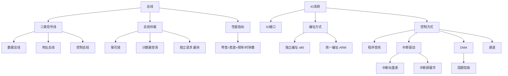

# 408 计组 第六章：总线 / 第七章：I/O 系统

> 📌 总线是连接各部件的"高速公路"，决定系统的数据传输瓶颈；I/O 系统解决 CPU 与外设速度不匹配问题。本章以选择题和简答题为主，总线带宽计算和 DMA 工作原理是常考考点。两章内容量适中，合并为一篇。


## 📋 前置知识

- [[408_COA_ch5_CPU]] — 理解 CPU 如何发出和响应总线信号
- [[408_OS_ch5_IO管理]] — OS 层面的 I/O 控制方式（与本章硬件层面互补）


## 第六章：总线


### 6.1 总线的基本概念

> 🎯 **类比**：总线就像城市里的主干道——所有车辆（数据）必须按照交通规则共享这条路，任何时候只有一辆车可以占用道路传输数据。

**总线（Bus）**：连接计算机各部件（CPU、内存、I/O 设备）的公共传输通道，是一组**共享**的信号线。

**总线的三类信号线**：

| 信号线类型 | 作用 | 方向 |
|-----------|------|------|
| **数据总线（DB）** | 传输数据（双向）| CPU ↔ 内存/设备 |
| **地址总线（AB）** | 指定内存地址或 I/O 端口（单向）| CPU → 内存/设备 |
| **控制总线（CB）** | 传输控制信号（读/写/中断等）| 双向（各信号单向）|

**地址总线宽度决定寻址范围**：$n$ 位地址总线 → 最大寻址 $2^n$ 个地址单元。

**数据总线宽度决定每次传输的数据量**（也叫总线宽度/字长）。

**总线的性能指标**：

- **总线时钟频率**（Bus Clock Rate）：总线工作的时钟频率，单位 MHz
- **总线周期**（Bus Cycle）：完成一次总线传输所需的时间，通常 = 若干个时钟周期
- **总线带宽（Bus Bandwidth）**：单位时间内总线能传输的最大数据量

$$\text{总线带宽} = \frac{\text{数据总线位宽（字节）}}{\text{总线周期（秒）}} = \text{数据总线字节宽} \times \text{总线频率（Hz）} / \text{每次传输时钟数}$$

**例题**：总线频率 133MHz，总线宽度 32 位（4 字节），每次传输需 1 个总线时钟周期，求总线带宽。

$$\text{带宽} = 4\text{B} \times 133\text{MHz} = 532\text{MB/s}$$


### 6.2 总线的分类

**按连接的部件层次分**：

| 类型 | 连接部件 | 例子 |
|------|---------|------|
| **片内总线** | CPU 芯片内部（寄存器、ALU 间）| CPU 内部互连 |
| **系统总线** | CPU、主存、I/O 控制器 | ISA、PCI、PCIe |
| **通信总线** | 计算机与外设（长距离）| USB、串口、SATA |

**按时序分**：

| 类型 | 特点 |
|------|------|
| **同步总线** | 所有设备按统一时钟工作，简单但频率受最慢设备限制 |
| **异步总线** | 用握手信号（握手协议）协调，适合速度差异大的设备 |
| **半同步总线** | 同步为主，支持插入等待周期（兼顾两者） |


### 6.3 总线仲裁（⭐ 选择题必考！）

多个设备同时请求总线时，需要仲裁（决定谁先用）。

**集中式仲裁**（由专用仲裁器控制）：

#### 菊花链仲裁（Daisy Chain）

```
仲裁器 → 设备1 → 设备2 → 设备3 → ...
         （总线允许信号串行传播）
```

- 优先级：越靠近仲裁器的设备优先级越高
- 优点：简单，需要的控制线少
- 缺点：高优先级设备可能使低优先级设备**永久饥饿**；一个设备故障可能阻断整个链

#### 计数器定时查询

- 仲裁器用计数器轮询各设备，计数值达到某设备地址时，若该设备请求总线，则授权
- 优点：通过计数器起始值可以调整优先级
- 缺点：需要设备地址线，速度慢于菊花链

#### 独立请求仲裁（Independent Request）

每个设备有独立的总线请求（BR）和总线授权（BG）信号线：

```
设备1: BR1 → 仲裁器 → BG1 → 设备1
设备2: BR2 → 仲裁器 → BG2 → 设备2
...
```

- 仲裁器同时看到所有请求，按优先级给出授权
- 优点：速度最快，灵活性高
- 缺点：需要 $2n$ 条控制线（每设备 2 条），成本高

**分布式仲裁**：各设备自行竞争总线，无中央仲裁器（如以太网 CSMA/CD）。

#### 三种集中仲裁方式对比

| 特性 | 菊花链 | 计数器查询 | 独立请求 |
|------|--------|----------|---------|
| 速度 | 最慢（串行传播）| 中等 | **最快** |
| 优先级 | 固定（位置决定）| 可调 | 可调 |
| 饥饿问题 | 有（低优先级）| 可避免（循环计数）| 可编程 |
| 控制线数 | 少（串行）| 中（地址线）| 多（$2n$ 条）|
| 故障影响 | 链断则后续设备失效 | 局部 | 互不影响 |


### 6.4 总线通信协议

**同步通信**：

双方按固定时钟传输，无需应答信号。

```
时钟周期 1: 发送地址
时钟周期 2: 目标准备数据
时钟周期 3: 传输数据
```

- 优点：简单，高速
- 缺点：所有设备必须以最慢设备的速度工作

**异步通信（握手协议）**：

发送方发出请求，等待应答信号后才继续——不依赖时钟，设备速度不同也没问题。

三种握手方式（考纲要求了解）：

| 方式 | 特点 |
|------|------|
| 不互锁 | 发出请求后等固定时间，不等应答，速度快但不可靠 |
| 半互锁 | 发出请求，等到应答信号才撤销请求 |
| 全互锁（完全握手）| 发请求→等应答→撤请求→等应答撤销→发下一个请求；最可靠 |


## 第七章：I/O 系统（硬件视角）


### 7.1 I/O 系统的组成

**I/O 系统 = I/O 设备 + I/O 接口 + I/O 控制方式**

**I/O 接口（I/O Interface / Device Controller）**：

> 🎯 **类比**：I/O 接口就像翻译官——CPU 说的是"高层次语言"（逻辑操作），硬件设备只懂"硬件信号"（电气信号），接口负责翻译和缓冲。

I/O 接口（设备控制器）的功能：

| 功能 | 说明 |
|------|------|
| **数据缓冲** | 暂存数据，平衡 CPU 和设备的速度差 |
| **信号转换** | 串/并转换（串行设备 ↔ 并行总线），电平转换 |
| **设备状态监控** | 维护状态寄存器（忙/就绪/错误） |
| **设备控制** | 接收 CPU 命令，驱动设备工作 |
| **中断请求** | 设备完成时向 CPU 发中断 |

**I/O 接口的内部寄存器**（CPU 通过端口地址访问）：

| 寄存器 | 作用 |
|--------|------|
| **数据寄存器（Data Register）** | 暂存 CPU 写入的数据或设备读出的数据 |
| **状态寄存器（Status Register）** | 记录设备状态（忙标志 BSY、完成标志 DONE、错误标志 ERR）|
| **控制寄存器（Control Register）** | 接收 CPU 的命令（开始传输、中断允许等）|


### 7.2 I/O 端口的编址方式

CPU 如何区分访问内存还是访问 I/O 端口？有两种方案：

**① 独立编址（I/O 映射，Isolated I/O）**：

内存和 I/O 端口有各自独立的地址空间，用专用的 I/O 指令（`IN`/`OUT`）访问 I/O 端口。

- 优点：两个地址空间互不干扰，内存空间不被 I/O 占用
- 缺点：需要专用 I/O 指令，灵活性低
- 代表：x86（用 `IN AL, 0x60` 读键盘端口）

**② 统一编址（内存映射，Memory-Mapped I/O）**：

I/O 端口占用部分内存地址空间，用普通的内存读写指令（`LOAD`/`STORE`）访问 I/O 端口。

- 优点：可以用所有内存寻址方式操作 I/O 端口，编程灵活
- 缺点：占用了部分内存地址空间
- 代表：ARM、MIPS（大多数 RISC 架构）


### 7.3 I/O 控制方式（⭐⭐ 必考！）

与操作系统的内容高度重合，此处从**硬件机制**角度重点阐述，与 [[408_OS_ch5_IO管理]] 互补。

#### 程序查询方式（Polling）

CPU 主动不断查询设备状态寄存器的 DONE 位（忙等）。

```c
// 硬件层面的实现
while (status_reg & BUSY) {}    // 等设备就绪
data = data_reg;                // 读数据
```

- CPU 利用率：趋近于 0（全程忙等）
- 数据传输路径：设备 → 数据寄存器 → CPU 寄存器 → 内存（**经过 CPU**）

#### 中断驱动方式

CPU 发出 I/O 命令后去做其他事，设备完成时发中断通知 CPU。

**中断驱动 I/O 的硬件支持**：

- **中断请求线（IRQ）**：设备向 CPU 发出中断请求的信号线
- **中断控制器（如 8259A）**：管理多个中断源的优先级和屏蔽
- **中断向量表**：存放每个中断号对应的中断服务程序入口地址

**中断的类型（硬件角度）**：

- **可屏蔽中断（INTR）**：可以被 CPU 的中断屏蔽寄存器屏蔽
- **不可屏蔽中断（NMI）**：不能被屏蔽（硬件故障、掉电等）

**中断优先级处理**：

多个中断同时发生时，中断控制器按优先级向 CPU 报告。CPU 正在处理某中断时，更高优先级的中断可以打断（嵌套中断），低优先级的必须等待。

**中断屏蔽字（Interrupt Mask）**：每个中断源一个屏蔽位，为 1 表示屏蔽（不响应）。

> ⚠️ **408 考题模板**：给出几个中断源的优先级和中断屏蔽字，问：当 $X$ 中断正在被处理时，$Y$ 中断发生，CPU 是否会响应 $Y$？
>
> 答：看 $X$ 的中断服务程序中，$Y$ 对应的屏蔽位是否为 1（屏蔽则不响应）；还要看 $Y$ 的优先级是否高于 $X$。两者都满足才响应。

#### DMA 方式（Direct Memory Access）

DMA 控制器（DMAC）直接在**内存和设备之间**传输数据，不经过 CPU。

**DMA 的四个专用寄存器**：

| 寄存器 | 作用 |
|--------|------|
| **内存地址寄存器（MAR）** | 当前传输到/从内存的哪个地址 |
| **字节计数寄存器（WC）** | 还剩多少字节没传完（每传一个字节自动减 1）|
| **数据寄存器（DR）** | 暂存正在传输的一个字的数据 |
| **DMA 控制/状态寄存器** | 记录 DMA 工作状态，启动/停止控制 |

**DMA 的完整工作流程**：

1. CPU 初始化 DMAC（设置内存起始地址、传输字节数、传输方向）
2. CPU 发出 I/O 命令给设备，启动 DMA 传输，**CPU 继续执行其他程序**
3. DMAC 接管总线，直接控制设备和内存之间的数据传输（**CPU 暂时让出总线**）
4. 每传输一个字，DMAC 自动更新 MAR（+1）和 WC（-1）
5. WC 减为 0 时，DMAC 向 CPU 发出一次中断（"传输完成"）
6. CPU 响应中断，做结束处理（验证数据等）

**DMA 与 CPU 的总线竞争**：

DMA 访问总线时，CPU 不能访问总线（暂停），但 CPU 可以继续执行不访存的指令（如在寄存器间运算）。

**DMA 的传输方式**：

| 方式 | 特点 |
|------|------|
| **停止 CPU 访问主存** | DMA 传输期间 CPU 完全停止访存，简单但 CPU 浪费 |
| **周期窃取（Cycle Stealing）** | DMA 每次只占用一个总线周期，然后释放给 CPU，交替进行 |
| **透明 DMA（Burst Mode）** | DMA 在 CPU 不需要总线时传输（CPU 内部运算时），完全并行 |


### 7.4 中断的完整处理过程（⭐ 必考！）

（从硬件角度，与 OS 章节互补）

**单重中断（不允许嵌套）的处理过程**：

```
① 设备完成 I/O，DMAC 或设备控制器发出中断请求（IRQ 线置高）
② CPU 在当前指令执行完毕后检测中断请求
③ CPU 关中断（清除 IF 标志，防止新中断打乱处理）
④ 保存断点：PC → 栈；PSW → 栈
⑤ 识别中断源（查中断向量表）
⑥ 加载中断服务程序（ISR）地址 → PC
⑦ ISR 开始执行：保存通用寄存器（保护现场）
⑧ 开中断（允许更高优先级中断嵌套）
⑨ 执行中断服务（读数据、处理事件）
⑩ 关中断
⑪ 恢复通用寄存器（恢复现场）
⑫ IRET 指令：恢复 PSW（含中断标志）、恢复 PC（返回断点）
⑬ 继续执行被中断的程序
```

**多重中断（嵌套中断）**：

第 ⑧ 步开中断后，若有更高优先级的中断发生，CPU 可以再次响应，形成嵌套。中断服务程序的**中断屏蔽字**控制哪些中断可以在此时打断当前 ISR。

**中断向量表（Interrupt Vector Table）**：

内存中固定位置（如 x86 实模式从 $0000H$ 开始）存放的表格，每个中断号对应一个条目，内容是对应 ISR 的入口地址（中断向量）。


### 7.5 I/O 控制方式综合对比（与 OS 章节联动）

| 方式 | CPU 利用率 | 适用设备 | 数据路径 | 中断频率 |
|------|-----------|---------|---------|---------|
| 程序查询 | 极低（忙等）| 慢速（键盘）| 经 CPU | 无 |
| 中断驱动 | 较高 | 低中速 | 经 CPU | 每字节一次 |
| DMA | 高 | 高速（磁盘、网卡）| 不经 CPU | 每块一次 |
| 通道 | 最高 | 超高速（大型机）| 不经 CPU | 每批一次 |


## ⚠️ 常见误区与踩坑点

> ❌ **误区 1：总线宽度 = CPU 字长**
> 总线宽度（数据总线位数）和 CPU 字长（机器字长）不一定相同。早期 CPU 字长 32 位，但数据总线只有 16 位（如 386SX），外部带宽受限。

> ⚠️ **踩坑 1：总线带宽计算要注意"总线周期"而非"时钟周期"**
> 一次总线传输可能需要多个时钟周期。带宽 = 数据宽度 / 总线周期，而不是 / 时钟周期。若一次传输占 2 个时钟周期，则带宽减半。

> ❌ **误区 2：DMA 传输时 CPU 完全停止工作**
> DMA 只占用总线（内存总线），CPU 的不需要访存的操作（如寄存器间运算）仍然可以执行。"停止 CPU 访问主存"模式下，CPU 可以继续做不访存的工作。

> ⚠️ **踩坑 2：中断响应是在"当前指令执行完毕后"**
> CPU 不会在指令执行中途响应中断（除非是异常），而是在**当前指令执行完毕**（一个指令周期结束）后才检测中断请求。这保证了指令执行的原子性。

> ❌ **误区 3：独立编址和统一编址的指令区别**
> 独立编址（I/O 映射）需要专用 I/O 指令（x86 的 `IN`/`OUT`）；统一编址（内存映射）直接用 `LOAD`/`STORE` 等普通内存指令即可访问 I/O 端口。


## 🏋️ 动手练习

### 练习 1：总线带宽计算（⭐⭐ 难度）

**题目**：某系统总线参数如下：时钟频率 200MHz，数据总线宽度 64 位，地址线 32 位，每次总线传输占用 4 个时钟周期（1 个周期寻址 + 2 个周期等待 + 1 个周期传数据）。

(a) 总线周期时间是多少？

(b) 总线的最大带宽是多少？

**参考答案**：

时钟周期 = $\frac{1}{200\text{MHz}} = 5\text{ns}$

**(a)** 总线周期 = $4 \times 5\text{ns} = 20\text{ns}$

**(b)** 每次传输数据 = $64\text{位} = 8\text{B}$

$$\text{带宽} = \frac{8\text{B}}{20\text{ns}} = 0.4\text{B/ns} = 400\text{MB/s}$$


### 练习 2：中断优先级与屏蔽字（⭐⭐ 难度）

**题目**：系统有 4 个中断源（$L_1 > L_2 > L_3 > L_4$，优先级递减）。各中断服务程序的屏蔽字如下（1=屏蔽，0=允许）：

| ISR 处理 \\ 屏蔽 | $L_1$ | $L_2$ | $L_3$ | $L_4$ |
|-----------------|-------|-------|-------|-------|
| $L_1$ 的 ISR   | 1 | 1 | 1 | 1 |
| $L_2$ 的 ISR   | 0 | 1 | 1 | 1 |
| $L_3$ 的 ISR   | 0 | 0 | 1 | 1 |
| $L_4$ 的 ISR   | 0 | 0 | 0 | 1 |

若 $L_3$ 的 ISR 正在执行时，$L_2$ 和 $L_4$ 同时发出中断请求，问：

(a) $L_2$ 会被响应吗？

(b) $L_4$ 会被响应吗？

(c) 若响应，响应哪个？

**参考答案**：

查 $L_3$ 的 ISR 的屏蔽字（第三行）：$L_1=0$（允许），$L_2=0$（允许），$L_3=1$（屏蔽自身），$L_4=1$（屏蔽）

**(a) $L_2$**：$L_3$ 的 ISR 对 $L_2$ 的屏蔽位 = 0（允许），且 $L_2$ 优先级高于 $L_3$ → **会被响应**。

**(b) $L_4$**：$L_3$ 的 ISR 对 $L_4$ 的屏蔽位 = 1（屏蔽）→ **不会被响应**（$L_4$ 必须等 $L_3$ 的 ISR 结束后才能被响应）。

**(c)** $L_2$ 和 $L_4$ 同时请求时，$L_4$ 被屏蔽，只有 $L_2$ 能响应，CPU 响应 **$L_2$ 的中断**，$L_3$ 的 ISR 被打断，转去执行 $L_2$ 的 ISR。


### 练习 3：DMA 传输过程分析（⭐ 难度）

**题目**：磁盘每次读一个扇区（512B），DMA 采用"周期窃取"方式，每次窃取一个总线周期（$100\text{ns}$）传输 4 字节。磁盘数据传输率为 $10\text{MB/s}$，求 DMA 占用 CPU 总线时间的比例（CPU 总线使用率损失了多少）。

**参考答案**：

DMA 传输 512B，每次 4B，需要 $512/4 = 128$ 次周期窃取。

每次窃取 $100\text{ns}$，共需 $128 \times 100\text{ns} = 12800\text{ns} = 12.8\mu\text{s}$

磁盘传输速率 $10\text{MB/s}$，传输 512B 需要时间 = $512\text{B} / (10 \times 10^6\text{B/s}) = 51.2\mu\text{s}$

CPU 总线被 DMA 占用比例 = $\frac{12.8}{51.2} = 25\%$

也就是说，DMA 传输期间，CPU 有 25% 的时间无法访问总线（但 CPU 仍可以执行不需要访存的指令）。


## 📝 总结

### 第六章要点回顾

1. **总线三类线**：数据总线（传数据，双向）、地址总线（选地址，单向）、控制总线（控制信号，双向）。

2. **总线带宽**：= 数据宽度（字节）× 总线频率 / 每次传输时钟数。

3. **总线仲裁**：菊花链（简单，有饥饿）、计数器查询（优先级可调）、独立请求（最快，需要 $2n$ 条线）。

4. **同步 vs 异步**：同步简单高速，异步用握手协议，适合速度差异大的设备。

### 第七章要点回顾

1. **I/O 接口**：设备与总线的桥梁，含数据/状态/控制三类寄存器。

2. **编址方式**：独立编址（专用 I/O 指令，x86）vs 统一编址（普通访存指令，ARM）。

3. **I/O 控制方式**：程序查询（忙等，CPU 利用率低）→ 中断驱动（每字节中断，提高 CPU 效率）→ DMA（不经 CPU 传数据，每块中断一次，高效）→ 通道（专用 CPU 处理 I/O）。

4. **中断处理全流程**：检测请求 → 保存断点/PSW → 识别中断源 → 执行 ISR → IRET 返回。中断屏蔽字控制嵌套。

### 知识图谱




## 🔗 相关链接

- 上一章：[[408_COA_ch5_CPU]]
- 操作系统关联：[[408_OS_ch5_IO管理]]（OS 视角的 I/O 控制）
- 总览：[[408_COA_overview]]


## 📚 参考资料

- 唐朔飞《计算机组成原理（第3版）》第六章（总线）、第七章（I/O 系统）
- 王道考研《计算机组成原理》总线与 I/O 专题 — 选择题汇编与带宽计算
