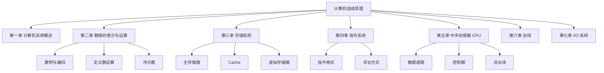
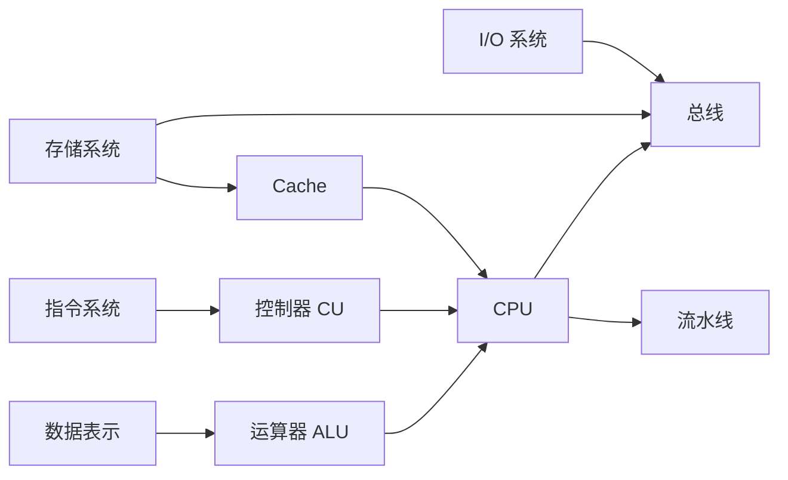

# 408 计算机组成原理 · 全书导航总览

> 📌 计算机组成原理研究的是**计算机硬件系统的内部工作原理**——数据在机器里怎么表示、怎么运算、CPU 如何执行指令、存储器如何组织、I/O 如何运作。它是理解计算机"从外部命令到电路执行"全链路的基础学科。

## 📋 前置知识

- [[数字逻辑基础]] — 需要了解二进制、十六进制、基本逻辑门（AND/OR/NOT）的概念
- [[C语言基础]] — 部分内容（如数据类型的位宽）需要 C 语言常识

## 🗺️ 全书知识版图

计算机组成原理围绕一个核心问题展开：

> **"一条 C 语言语句 `a = b + c` 在计算机硬件里，从数据存储到最终运算完成，经历了怎样的过程？"**

沿着这个问题，全书分为五大模块：

## 📖 各章核心考点速览

### 第一章：计算机系统概述

**核心问题**：计算机由哪些部件组成，它们如何协作？性能如何衡量？

| 考点 | 重要程度 | 题型 |
|------|----------|------|
| 冯·诺依曼结构的五大部件 | ⭐⭐⭐ | 选择、简答 |
| 存储程序的工作原理 | ⭐⭐⭐ | 选择 |
| 计算机的层次结构（微程序级→机器语言级→操作系统级→……） | ⭐⭐ | 选择 |
| CPU 时钟周期、机器周期、指令周期的关系 | ⭐⭐⭐⭐ | 选择、计算 |
| 性能指标：CPI、MIPS、MFLOPS | ⭐⭐⭐⭐ | 计算题 |
| Amdahl 定律 | ⭐⭐⭐ | 计算题 |

→ 详细笔记：[[408_COA_ch1_概述]]

### 第二章：数据的表示与运算（最重考章！）

**核心问题**：整数、小数、负数、超大数在机器里怎么用 0/1 表示？运算时怎么处理溢出？

| 考点 | 重要程度 | 题型 |
|------|----------|------|
| 进制转换（二/八/十/十六进制互转） | ⭐⭐⭐ | 选择、计算 |
| 原码、反码、补码、移码的定义与转换 | ⭐⭐⭐⭐⭐ | 选择、大题 |
| 补码加减法（含溢出判断） | ⭐⭐⭐⭐⭐ | 大题（手算！） |
| 移位运算（算术移位、逻辑移位、循环移位） | ⭐⭐⭐⭐ | 选择、大题 |
| 补码乘法（Booth 算法） | ⭐⭐⭐⭐ | 大题（手算！） |
| 补码除法（恢复余数法/加减交替法） | ⭐⭐⭐ | 大题 |
| IEEE 754 浮点数格式与运算 | ⭐⭐⭐⭐⭐ | 大题（手算！） |
| 浮点数的规格化与舍入 | ⭐⭐⭐⭐ | 大题 |
| 字符编码（ASCII、Unicode） | ⭐⭐ | 选择 |

**一句话记忆**：正数原=反=补；负数补码 = 原码取反加 1；移码 = 补码符号位取反。浮点数 = 符号 + 阶码（移码）+ 尾数（原码规格化）。

→ 详细笔记：[[408_COA_ch2_数制编码]] | [[408_COA_ch2_定点运算]] | [[408_COA_ch2_浮点数]]

### 第三章：存储系统（分值第二高）

**核心问题**：数据存在哪里？CPU 怎么快速取到数据？

| 考点 | 重要程度 | 题型 |
|------|----------|------|
| 存储器的层次结构（寄存器→Cache→主存→磁盘） | ⭐⭐⭐ | 选择 |
| SRAM vs DRAM 的区别 | ⭐⭐⭐ | 选择 |
| 主存的扩展（位扩展、字扩展、字位扩展） | ⭐⭐⭐⭐ | 计算、大题 |
| Cache 的基本原理与命中率计算 | ⭐⭐⭐⭐⭐ | 选择、大题 |
| Cache 的映射方式（直接映射、全相联、组相联） | ⭐⭐⭐⭐⭐ | 大题（手算！） |
| Cache 的替换策略（LRU、FIFO、随机） | ⭐⭐⭐ | 选择 |
| Cache 的写策略（写直达、写回） | ⭐⭐⭐⭐ | 选择、简答 |
| 虚拟存储器（页式、段式、段页式） | ⭐⭐⭐⭐ | 选择、简答 |

**一句话记忆**：Cache 解决 CPU 与主存的速度差；命中率越高越好；三种映射方式的组地址位数是关键手算。

→ 详细笔记：[[408_COA_ch3_存储系统]] | [[408_COA_ch3_Cache]]

### 第四章：指令系统

**核心问题**：CPU 能执行哪些操作？指令怎么编码？操作数从哪里来？

| 考点 | 重要程度 | 题型 |
|------|----------|------|
| 指令的格式（操作码 + 地址码） | ⭐⭐⭐ | 选择 |
| 指令的分类（零/一/二/三地址指令） | ⭐⭐⭐ | 选择 |
| 操作码扩展技术 | ⭐⭐⭐⭐ | 计算题 |
| 寻址方式（立即/直接/间接/寄存器/寄存器间接/基址/变址/相对） | ⭐⭐⭐⭐⭐ | 选择、大题 |
| CISC vs RISC 的对比 | ⭐⭐⭐ | 简答 |

→ 详细笔记：[[408_COA_ch4_指令系统]]

### 第五章：中央处理器 CPU（最核心！）

**核心问题**：CPU 怎么一步步执行一条指令？怎么提高执行速度？

| 考点 | 重要程度 | 题型 |
|------|----------|------|
| CPU 的功能与组成（ALU、寄存器、控制器） | ⭐⭐⭐ | 选择、简答 |
| 指令执行的完整过程（取指→译码→执行→写回） | ⭐⭐⭐⭐ | 选择、简答 |
| 数据通路的基本结构 | ⭐⭐⭐ | 简答 |
| 控制器：硬连线控制器 vs 微程序控制器 | ⭐⭐⭐⭐ | 选择、简答 |
| 微指令的编码方式（直接编码、字段直接编码、字段间接编码） | ⭐⭐⭐ | 选择 |
| 流水线的基本概念与性能指标 | ⭐⭐⭐⭐⭐ | 大题（计算！） |
| 流水线的冒险（结构/数据/控制冒险）及解决方法 | ⭐⭐⭐⭐⭐ | 选择、简答 |
| 超标量、超流水线、乱序执行 | ⭐⭐⭐ | 选择 |
| 中断系统（中断请求、判优、响应、处理） | ⭐⭐⭐⭐ | 选择、简答 |

→ 详细笔记：[[408_COA_ch5_CPU]] | [[408_COA_ch5_流水线]]

### 第六章：总线

**核心问题**：各部件之间如何连接通信？

| 考点 | 重要程度 | 题型 |
|------|----------|------|
| 总线的分类（数据/地址/控制总线） | ⭐⭐⭐ | 选择 |
| 总线的仲裁方式（集中式：菊花链/计数器/独立请求） | ⭐⭐⭐⭐ | 选择、简答 |
| 总线的通信方式（同步/异步/半同步） | ⭐⭐⭐ | 选择 |
| 总线的性能指标（总线带宽的计算） | ⭐⭐⭐⭐ | 计算题 |

→ 详细笔记：[[408_COA_ch6_总线]]

### 第七章：I/O 系统

**核心问题**：CPU 如何与外部设备交换数据？

| 考点 | 重要程度 | 题型 |
|------|----------|------|
| I/O 接口的功能与组成 | ⭐⭐⭐ | 选择 |
| I/O 控制方式（程序查询/中断/DMA/通道） | ⭐⭐⭐⭐⭐ | 选择、简答 |
| DMA 的工作原理与传输过程 | ⭐⭐⭐⭐ | 简答 |
| 中断的响应与处理过程 | ⭐⭐⭐⭐ | 简答 |
| 中断优先级与中断屏蔽 | ⭐⭐⭐⭐ | 选择、大题 |

→ 详细笔记：[[408_COA_ch7_IO系统]]

## 🔥 408 高频必考专题汇总

### 专题一：补码运算与溢出判断（大题必考）

**补码加减法**：直接按二进制相加，减法转化为加负数的补码。

**溢出判断**（两种等价方法，记一种即可）：

**方法一：双符号位法（变形补码）**

用两位符号位表示数，正数符号位为 00，负数为 11。

运算结果的双符号位：
- $00$：正数，无溢出
- $11$：负数，无溢出
- $01$：正溢出（结果超过最大正数）
- $10$：负溢出（结果超过最小负数）

**方法二：进位判断法**

符号位产生的进位 $C_s$ 与最高数值位产生的进位 $C_1$：

$$\text{溢出} = C_s \oplus C_1$$

若两个进位相同：无溢出；若不同：溢出。

→ 详细：[[408_COA_ch2_定点运算]]

### 专题二：IEEE 754 浮点数（大题必考）

**单精度格式**（32位）：

$$\underbrace{S}_{1\text{位符号}} \quad \underbrace{E}_{8\text{位阶码（移码，偏置值127）}} \quad \underbrace{M}_{23\text{位尾数（隐含最高位1）}}$$

**真值** = $(-1)^S \times 1.M \times 2^{E-127}$

**十进制 → IEEE 754 的步骤**：

1. 转二进制
2. 规格化（写成 $1.xxx \times 2^n$ 的形式）
3. 阶码 = $n + 127$，转 8 位二进制
4. 尾数 = 小数点后的 $xxx$ 部分（补足 23 位）
5. 拼合：符号位 + 阶码 + 尾数

→ 详细：[[408_COA_ch2_浮点数]]

### 专题三：Cache 映射与地址划分（大题必考）

给定主存地址，划分 Cache 地址的标记/组号/块内偏移字段。

$$\text{主存地址} = \underbrace{\text{Tag（标记）}}_{\text{高位}} \quad \underbrace{\text{Index（组号）}}_{\text{中位，仅组相联/直接映射有}} \quad \underbrace{\text{Offset（块内偏移）}}_{\text{低位}}$$

$$\text{块内偏移位数} = \log_2(\text{块大小（字节）})$$

$$\text{组号位数} = \log_2(\text{Cache 总组数})$$

$$\text{标记位数} = \text{地址总位数} - \text{组号位数} - \text{偏移位数}$$

→ 详细：[[408_COA_ch3_Cache]]

### 专题四：流水线性能计算（大题必考）

**流水线执行时间**（$n$ 条指令，$k$ 级流水，每级时间 $\Delta t$）：

$$T_\text{流水} = (k + n - 1) \times \Delta t$$

**流水线吞吐率（TP）**：

$$TP = \frac{n}{T_\text{流水}} = \frac{n}{(k + n - 1) \times \Delta t}$$

**加速比（Sp）**：

$$Sp = \frac{T_\text{顺序}}{T_\text{流水}} = \frac{n \times k \times \Delta t}{(k + n - 1) \times \Delta t} = \frac{nk}{k + n - 1}$$

当 $n \gg k$ 时，$Sp \approx k$（最大加速比等于流水级数）。

→ 详细：[[408_COA_ch5_流水线]]

### 专题五：总线带宽计算

$$\text{总线带宽} = \frac{\text{数据总线位宽（字节）}}{\text{总线时钟周期}} = \text{数据总线位宽（字节）} \times \text{总线频率（Hz）}$$

注意数据宽度换算：数据总线 32 位 = 4 字节；每次传输 1 个字（4B）。

→ 详细：[[408_COA_ch6_总线]]

## 📊 408 计算机组成原理历年分值分布参考

| 章节 | 典型分值占比 | 高频题型 |
|------|------------|---------|
| 第二章 数据表示与运算 | 约 30% | 选择 + 大题（编码转换、补码运算、浮点数） |
| 第三章 存储系统 | 约 25% | 选择 + 大题（Cache 映射） |
| 第五章 CPU | 约 25% | 选择 + 大题（流水线计算） |
| 第四章 指令系统 | 约 10% | 选择（寻址方式） |
| 第六章 总线 | 约 5% | 选择 + 计算 |
| 第七章 I/O 系统 | 约 5% | 选择 |
| 第一章 概述 | 约 5% | 选择 + 计算（性能指标） |

> 💡 **备考策略**：第二、三、五章合计约 80% 分值，是绝对重点。第二章的补码运算和浮点数必须能手算；第三章 Cache 映射必须能手算地址划分；第五章流水线必须能算吞吐率和加速比。

## 🧠 计组核心概念关系总图

## 🗓️ 建议学习路线

1. **第一章 概述**（0.5 周）→ 冯·诺依曼结构，性能指标
2. **第二章 数制编码**（0.5 周）→ 原码/反码/补码/移码转换
3. **第二章 定点运算**（1.5 周）→ 补码加减、溢出判断、Booth 乘法（重点！）
4. **第二章 浮点数**（1 周）→ IEEE 754 格式、浮点运算（重点！）
5. **第三章 主存**（0.5 周）→ 主存扩展（位扩展 vs 字扩展）
6. **第三章 Cache**（1.5 周）→ 三种映射方式、命中率计算（重点！）
7. **第四章 指令系统**（1 周）→ 寻址方式（必须全部掌握）
8. **第五章 CPU**（1 周）→ 指令执行流程、控制器
9. **第五章 流水线**（1 周）→ 流水线性能计算、冒险（重点！）
10. **第六章 总线**（0.5 周）→ 仲裁方式、带宽计算
11. **第七章 I/O**（0.5 周）→ I/O 控制方式（与 OS 联合复习）
12. **全书刷题**（2 周）→ 历年真题

## 🔗 相关链接

- 并列科目：[[408_OS_overview]] | [[408_数据结构_总览]] | [[408_计算机网络_总览]]
- 下级章节：[[408_COA_ch1_概述]] | [[408_COA_ch2_数制编码]] | [[408_COA_ch2_定点运算]] | [[408_COA_ch2_浮点数]] | [[408_COA_ch3_存储系统]] | [[408_COA_ch3_Cache]] | [[408_COA_ch4_指令系统]] | [[408_COA_ch5_CPU]] | [[408_COA_ch5_流水线]] | [[408_COA_ch6_总线]] | [[408_COA_ch7_IO系统]]

## 📚 参考资料

- [唐朔飞《计算机组成原理》（第3版）](https://book.douban.com/subject/27000250/) — 408 官方指定教材
- [王道考研计算机组成原理](https://www.cskaoyan.com/) — 配套习题与历年真题解析
- [小林 coding 图解系统](https://xiaolincoding.com/) — 辅助理解硬件概念
