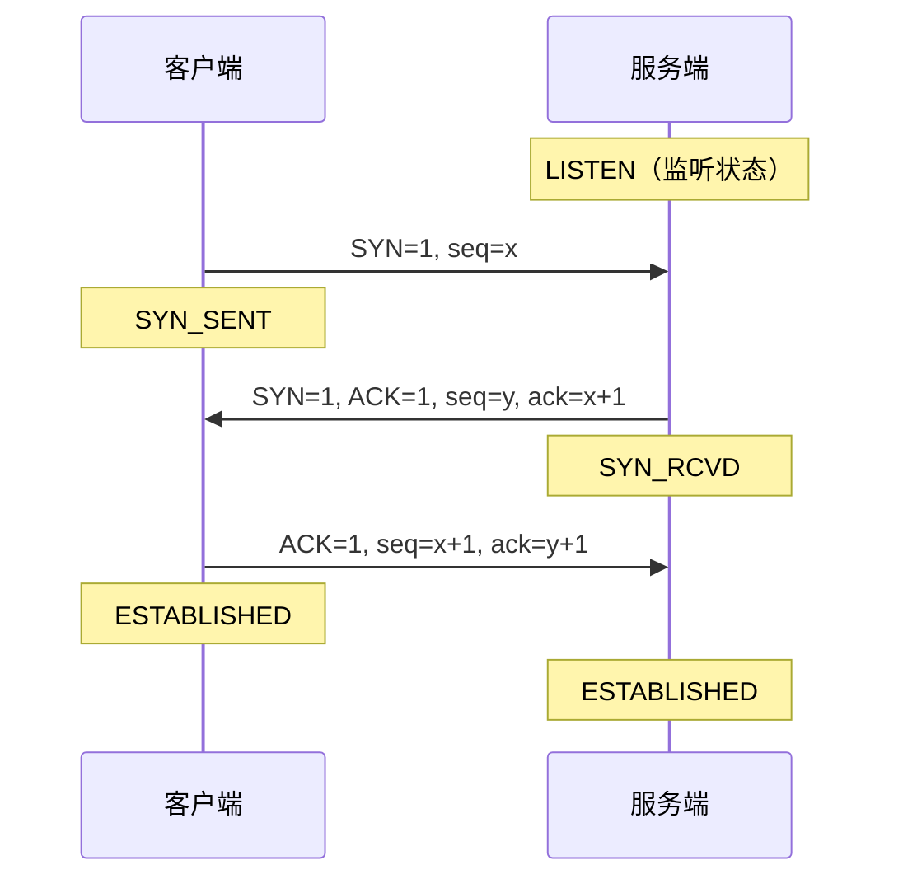
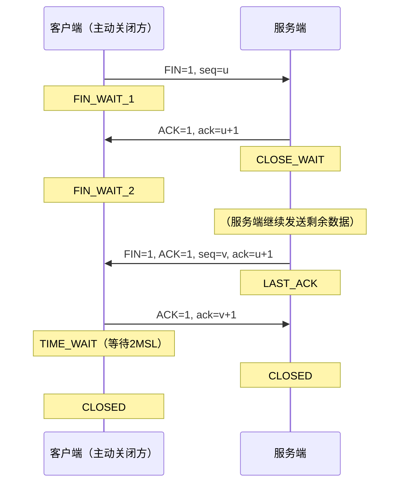
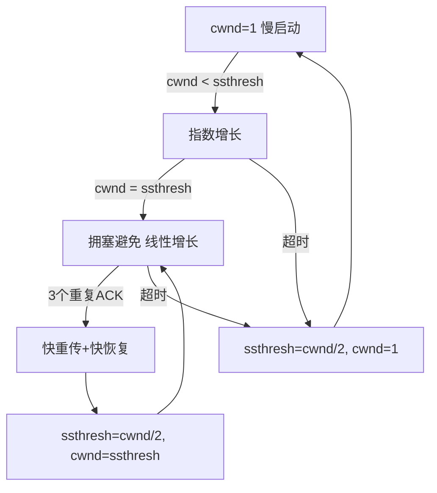
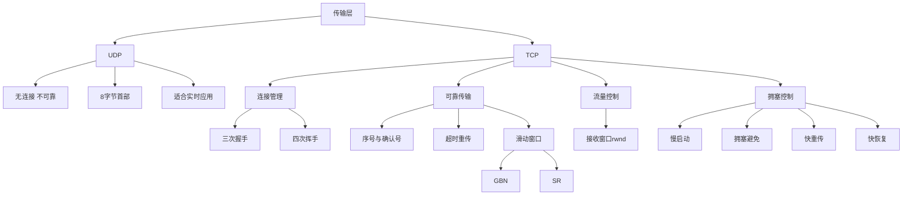

# 计算机网络·传输层

> 📌 传输层是"端到端通信的真正实现者"——网络层负责把数据包从一台主机送到另一台主机，而传输层进一步把数据送到**目标主机上的某个具体进程**，是整个网络通信中最贴近应用的一层。

---

## 📋 前置知识

在开始之前，你需要了解这些概念：

- [[计算机网络·概述与体系结构]] — 理解 OSI 七层模型 / TCP-IP 四层模型的分层思想，知道每层的职责边界
- [[计算机网络·网络层]] — 理解 IP 地址、路由、数据报的转发，传输层建立在网络层提供的"尽力而为"交付之上
- [[进程与端口号]] — 传输层用端口号区分同一主机上的不同进程，必须先理解"进程"的概念

---

## 🤔 为什么要学这个？

想象你在一台电脑上同时开着三个应用：微信、浏览器、QQ。数据包从互联网进来之后，操作系统怎么知道这个包该给微信还是浏览器？

网络层只管"送到哪台机器"，它不管这台机器上有哪些进程在等待数据。**传输层就是那个"快递分拣员"**，它在数据包上贴标签（端口号），把数据准确地送到对应的应用进程手里。

408 考试中，传输层是**整张试卷的重头戏之一**，TCP 可靠传输机制、拥塞控制和流量控制几乎每年必考，理解透彻的同学可以在大题上拿满分，一知半解则容易因为细节失分。

---

## 🧠 核心概念

### 传输层的两大核心职责

传输层在整个网络体系结构中扮演两个角色：

1. **复用（Multiplexing）与分用（Demultiplexing）**：多个应用进程共享同一个网络接口，传输层通过"端口号"区分它们
2. **端到端的通信质量控制**：网络层"尽力而为"但不保证可靠，传输层可以在此之上提供可靠传输（TCP）或不提供（UDP）

> 🎯 **类比**：把网络层比作一家快递公司，它只负责把包裹送到你家楼下。传输层就是你们楼里的快递柜管理员——他把包裹按照房间号（端口号）分好，你（应用进程）凭取件码（端口号）来取自己的包裹。

---

### 端口号（Port Number）

**端口号**是传输层用来区分同一台主机上不同应用进程的 16 位整数，范围是 $0 \sim 65535$。

分类如下：

|范围|名称|说明|
|---|---|---|
|$0 \sim 1023$|熟知端口（Well-known Port）|分配给固定服务，如 HTTP=80、HTTPS=443、FTP=21、DNS=53、SMTP=25|
|$1024 \sim 49151$|注册端口（Registered Port）|可由应用申请注册|
|$49152 \sim 65535$|动态/私有端口（Ephemeral Port）|客户端发起连接时由 OS 临时分配|

> ⚠️ **408 考点**：熟知端口号必须背熟，常考的包括 HTTP(80)、HTTPS(443)、FTP(20/21)、SMTP(25)、POP3(110)、DNS(53)、Telnet(23)、SSH(22)。FTP 有两个端口：20 用于数据传输，21 用于控制连接。

一个"套接字"（Socket）= IP 地址 + 端口号，它唯一标识网络中某台主机上的某个进程。一条 TCP 连接由**两个套接字**组成：

$$\text{TCP连接} = (\text{源IP}, \text{源端口}) + (\text{目的IP}, \text{目的端口})$$

---

### 传输层的两大协议：UDP 与 TCP

传输层只有两个协议是 408 考试范围：

- **UDP（User Datagram Protocol，用户数据报协议）** — 无连接、不可靠、快
- **TCP（Transmission Control Protocol，传输控制协议）** — 面向连接、可靠、慢

---

## UDP 详解

### UDP 的特点

> 🎯 **类比**：UDP 像发明信片。你写好地址扔进邮筒，不知道对方有没有收到，也没有回执，但速度快、成本低。

UDP 的核心特点：

1. **无连接**：发送前不需要建立连接，直接发送
2. **不可靠**：不保证数据一定到达，不保证顺序
3. **面向报文**：应用层给多少数据，UDP 就装多少，不拆分不合并
4. **头部开销小**：只有 8 字节固定首部
5. **支持广播、多播**：TCP 不支持

**适用场景**：视频通话、直播、DNS 查询、DHCP、游戏（对实时性要求高，少量丢包可接受）

### UDP 首部格式

UDP 首部只有 **8 字节**，极其简洁：

```
 0      7 8     15 16    23 24    31
+--------+--------+--------+--------+
|   源端口号       |   目的端口号      |
+--------+--------+--------+--------+
|   UDP长度        |   校验和         |
+--------+--------+--------+--------+
```

- **源端口号**（16 bit）：发送方端口，可选字段，不用时填 0
- **目的端口号**（16 bit）：接收方端口，必填
- **长度**（16 bit）：UDP 数据报的总长度（首部 + 数据），最小值 8
- **校验和**（16 bit）：检错用，计算时需要加上"伪首部"（包含源/目的 IP）

> ⚠️ **踩坑**：UDP 的校验和计算需要引入一个"伪首部"（Pseudo Header），伪首部包含源 IP、目的 IP、协议号、UDP 长度，但伪首部**不会被发送**，仅用于计算校验和。408 大题可能考你画出计算过程。

---

## TCP 详解

TCP 是传输层的"大 Boss"，408 考试中占比最重，必须逐字段、逐机制地理解。

### TCP 的特点

> 🎯 **类比**：TCP 像打电话。你先拨号（三次握手建立连接），通话中双方都能确认对方有没有听到（确认应答 ACK），通话结束时互相说再见（四次挥手断开连接）。整个过程有保障，但比发明信片（UDP）更耗资源。

TCP 的核心特点：

1. **面向连接**：通信前必须先建立连接（三次握手）
2. **可靠传输**：通过确认、重传、序号保证数据不丢、不乱序、不重复
3. **全双工**：两端可以同时互相发送数据
4. **面向字节流**：TCP 把应用数据看作字节流，可以拆分、合并
5. **流量控制**：防止发送方把接收方"压垮"
6. **拥塞控制**：防止发送方把整个网络"压垮"

### TCP 首部格式

TCP 首部**最小 20 字节**，最大 60 字节（有选项时）：

```
 0                   1                   2                   3
 0 1 2 3 4 5 6 7 8 9 0 1 2 3 4 5 6 7 8 9 0 1 2 3 4 5 6 7 8 9 0 1
+-+-+-+-+-+-+-+-+-+-+-+-+-+-+-+-+-+-+-+-+-+-+-+-+-+-+-+-+-+-+-+-+
|          源端口号               |          目的端口号            |
+-+-+-+-+-+-+-+-+-+-+-+-+-+-+-+-+-+-+-+-+-+-+-+-+-+-+-+-+-+-+-+-+
|                         序号（Sequence Number）                 |
+-+-+-+-+-+-+-+-+-+-+-+-+-+-+-+-+-+-+-+-+-+-+-+-+-+-+-+-+-+-+-+-+
|                      确认号（Acknowledgment Number）            |
+-+-+-+-+-+-+-+-+-+-+-+-+-+-+-+-+-+-+-+-+-+-+-+-+-+-+-+-+-+-+-+-+
|数据偏移| 保留  |U|A|P|R|S|F|           窗口大小               |
+-+-+-+-+-+-+-+-+-+-+-+-+-+-+-+-+-+-+-+-+-+-+-+-+-+-+-+-+-+-+-+-+
|            校验和               |          紧急指针             |
+-+-+-+-+-+-+-+-+-+-+-+-+-+-+-+-+-+-+-+-+-+-+-+-+-+-+-+-+-+-+-+-+
|                     选项（可选，0~40字节）                       |
+-+-+-+-+-+-+-+-+-+-+-+-+-+-+-+-+-+-+-+-+-+-+-+-+-+-+-+-+-+-+-+-+
```

各字段含义（**每个字段都是 408 考点**）：

|字段|长度|含义|
|---|---|---|
|源/目的端口号|各 16 bit|标识进程|
|序号（seq）|32 bit|本报文段第一个字节的编号|
|确认号（ack）|32 bit|期望收到对方下一个报文段的第一个字节的序号|
|数据偏移|4 bit|TCP 首部长度，单位 4 字节，最大值 15，即最大 60 字节|
|URG|1 bit|紧急位，=1 时启用紧急指针|
|ACK|1 bit|确认位，=1 时确认号有效（连接建立后必须为 1）|
|PSH|1 bit|推送位，=1 时接收方立即上交数据，不等缓冲区满|
|RST|1 bit|复位位，=1 时强制断开连接|
|SYN|1 bit|同步位，建立连接时使用|
|FIN|1 bit|终止位，释放连接时使用|
|窗口大小|16 bit|接收方的接收窗口大小，用于流量控制|
|校验和|16 bit|同 UDP，也需要伪首部|
|紧急指针|16 bit|URG=1 时有效，指示紧急数据的末尾位置|

> ⚠️ **踩坑**：**序号（seq）**和**确认号（ack）**概念极易混淆！
> 
> - 序号：**我**发出去的数据，第一个字节的编号
> - 确认号：**我期望**收到对方的下一个字节的编号，即"我已经收到你的第 X-1 号字节，现在期待第 X 号"

---

### 三次握手（建立连接）

> 🎯 **类比**：三次握手就像两个人确认通话质量。A 说"你能听到我吗？"（SYN），B 说"能听到，你能听到我吗？"（SYN+ACK），A 说"能听到。"（ACK）——双方都确认了自己的发送和接收都正常。



三次握手的每一步：

**第一次握手**：客户端发送 $\text{SYN}=1, \text{seq}=x$（$x$ 是客户端随机选择的初始序号 ISN）

- 客户端状态：$\text{CLOSED} \rightarrow \text{SYN_SENT}$

**第二次握手**：服务端返回 $\text{SYN}=1, \text{ACK}=1, \text{seq}=y, \text{ack}=x+1$

- $\text{ack}=x+1$ 表示"我收到了你到第 $x$ 号字节，期待 $x+1$"
- 服务端状态：$\text{LISTEN} \rightarrow \text{SYN_RCVD}$

**第三次握手**：客户端发送 $\text{ACK}=1, \text{seq}=x+1, \text{ack}=y+1$

- 双方状态：$\rightarrow \text{ESTABLISHED}$

> ❌ **误区：为什么不是两次握手？** 两次握手无法防止**历史连接**（过期的 SYN 报文）被误处理。如果服务端只要收到 SYN 就建立连接，那么一个网络中延迟很久的旧 SYN 报文到达后，服务端会建立一个客户端根本不知道的"幽灵连接"，浪费资源。

> ❌ **误区：为什么不是四次握手？** 服务端在第二步可以把 SYN 和 ACK 合并发送，没必要分两次，所以三次已经足够。

### 四次挥手（释放连接）

> 🎯 **类比**：四次挥手像打电话结束时的告别。A 说"我说完了"（FIN），B 说"好的，我知道了"（ACK），过一会儿 B 说"我也说完了"（FIN），A 说"好的，再见"（ACK）。因为 TCP 是全双工的，两个方向的关闭需要分别确认。



**第一次挥手**：客户端发 $\text{FIN}=1, \text{seq}=u$，表示"我不再发数据了"

- 客户端：$\text{ESTABLISHED} \rightarrow \text{FIN_WAIT_1}$

**第二次挥手**：服务端回 $\text{ACK}=1, \text{ack}=u+1$，表示"收到，但我还有数据要发"

- 服务端：$\rightarrow \text{CLOSE_WAIT}$，客户端：$\rightarrow \text{FIN_WAIT_2}$

**第三次挥手**：服务端数据发完后，发 $\text{FIN}=1, \text{seq}=v$

- 服务端：$\rightarrow \text{LAST_ACK}$

**第四次挥手**：客户端回 $\text{ACK}=1, \text{ack}=v+1$，然后等待 $2\text{MSL}$

- 客户端：$\rightarrow \text{TIME_WAIT}$，等待 $2\text{MSL}$ 后 $\rightarrow \text{CLOSED}$
- 服务端：收到 ACK 后 $\rightarrow \text{CLOSED}$

> ⚠️ **踩坑：TIME_WAIT 为什么要等 2MSL？** MSL（Maximum Segment Lifetime，最长报文寿命）是一个报文在网络中能存活的最长时间，通常设为 2 分钟。等待 $2\text{MSL}$ 有两个原因：
> 
> 1. 保证客户端最后的 ACK 能到达服务端（万一丢失，服务端会重传 FIN，客户端还能再次 ACK）
> 2. 让网络中残留的旧连接报文消散，避免影响新连接

> ❌ **误区：为什么挥手是四次而握手只有三次？** 握手时服务端可以把 SYN 和 ACK 合并；但挥手时，服务端的 ACK（"我知道你要关了"）和 FIN（"我也发完了"）之间可能有时间差（服务端还有数据要发），所以**不能合并**，必须分两次。

---

### 可靠传输机制

TCP 用三个机制组合保证可靠传输：**确认应答 + 序号 + 超时重传**。

#### 停止等待协议（Stop-and-Wait）

最简单的可靠传输协议：发一个包，等 ACK，收到后再发下一个。

效率极低，信道利用率 $\eta$ 为：

$$\eta = \frac{T_D}{T_D + RTT + T_A}$$

其中 $T_D$ 是发送时延，$RTT$ 是往返时延，$T_A$ 是 ACK 传输时延。

> 这就是为什么实际 TCP 使用**滑动窗口**而不是停等协议。

#### 滑动窗口协议（Sliding Window）

> 🎯 **类比**：停等协议像独木桥上只能走一个人，等前面的人过去了下一个人才能上桥。滑动窗口像一条宽马路，可以同时有多辆车在路上行驶，大幅提高通行效率。

发送方维护一个"发送窗口"，窗口内的报文段可以**连续发送**，不需要逐一等待 ACK。

设窗口大小为 $W$，则信道利用率为：

$$\eta = \frac{W \cdot T_D}{T_D + RTT + T_A} \quad (\text{当 } W \cdot T_D < T_D + RTT + T_A \text{ 时})$$

$$\eta = 1 \quad (\text{当 } W \cdot T_D \geq T_D + RTT + T_A \text{ 时，信道满载})$$

**GBN（Go-Back-N，回退 N 帧）**：出错时，从出错帧开始**重传后续所有帧**。发送窗口 $\leq 2^n - 1$（$n$ 为序号位数）。

**SR（Selective Repeat，选择重传）**：只重传**出错的那一帧**，接收方缓存后续正确到达的帧。发送窗口 $\leq 2^{n-1}$。

> ⚠️ **408 常考计算**：窗口大小的最大值为什么受序号位数限制？因为如果窗口太大，接收方无法区分"新一轮的第 0 帧"和"未到达的旧帧第 0 帧"，会导致混淆。GBN 和 SR 的最大窗口大小公式不同，必须记牢。

---

### 流量控制（Flow Control）

> 🎯 **类比**：流量控制像给水管装调节阀。接收方（水桶）的容量有限，发送方（水管）的流速必须根据水桶的剩余容量来调节，不然水会溢出（接收缓冲区溢出导致丢包）。

TCP 用接收方首部中的**窗口字段（rwnd）**来通知发送方自己当前的接收能力。

- 接收方缓冲区满时，发送 $\text{rwnd}=0$，发送方停止发送
- 缓冲区腾出空间后，接收方发送新窗口大小通知发送方继续

> ⚠️ **踩坑：窗口为 0 后的"死锁"问题** 如果接收方发送 $\text{rwnd}=0$ 后，接着发送的窗口更新报文丢失了，发送方会永远等待，接收方也永远等待——死锁！
> 
> **解决方法**：发送方在窗口为 0 时，启动一个**持续计时器（Persistence Timer）**，超时后发送一个 1 字节的"探测报文"（零窗口探测报文），促使接收方重新通告窗口大小。

---

### 拥塞控制（Congestion Control）

流量控制解决"接收方来不及"，拥塞控制解决"网络来不及"。

> 🎯 **类比**：拥塞控制像高速公路的限速和限流。道路（网络）的容量有限，如果所有车（数据包）都全速涌入，堵车（网络拥塞）只会让所有人更慢。TCP 会根据网络状况主动调节发送速率。

TCP 发送方维护一个**拥塞窗口（cwnd）**，实际发送窗口 $= \min(\text{rwnd}, \text{cwnd})$。

拥塞控制有四个算法，必须全部掌握：

#### 慢启动（Slow Start）

初始 $\text{cwnd}=1$（以最大报文段 MSS 为单位），每收到一个 ACK，$\text{cwnd}$ 加 1，**每轮 RTT 指数增长**（1→2→4→8→…）。

设有一个**慢启动阈值 ssthresh**：

- $\text{cwnd} < \text{ssthresh}$：慢启动，指数增长
- $\text{cwnd} \geq \text{ssthresh}$：进入拥塞避免

#### 拥塞避免（Congestion Avoidance）

每轮 RTT，$\text{cwnd}$ 只加 1，**线性增长**。更保守，避免增长过快导致拥塞。

#### 快重传（Fast Retransmit）

发送方收到**3 个重复 ACK**（即 4 个相同的 ACK），立即重传丢失报文，**不等超时计时器触发**。

> 收到 3 个重复 ACK 说明网络只是丢了一个包，并不是严重拥塞，不需要像超时那样大幅削减 cwnd。

#### 快恢复（Fast Recovery）

配合快重传使用：

- 收到 3 个重复 ACK 时：$\text{ssthresh} = \text{cwnd} / 2$，$\text{cwnd} = \text{ssthresh}$（不重置为 1），然后进入拥塞避免
- 发生超时时（更严重的拥塞）：$\text{ssthresh} = \text{cwnd} / 2$，$\text{cwnd} = 1$，重新慢启动

**完整变化图示：**



> ⚠️ **408 必考计算题模板**：给你初始 cwnd、ssthresh，以及某些轮次发生超时或重复 ACK，让你画出 cwnd 的变化曲线，并回答第 N 轮 RTT 的 cwnd 是多少。这类题一定要**逐轮画表格**，不要试图心算，极易出错。

---

## 💻 代码示例

下面用 Python 模拟 TCP 拥塞控制的 cwnd 变化，帮助你直观理解每个阶段的行为。

```python
# 模拟 TCP 拥塞控制 cwnd 变化
# 运行: python3 tcp_congestion.py

def simulate_tcp_congestion(ssthresh_init, max_rtt, events):
    """
    ssthresh_init: 初始慢启动阈值
    max_rtt: 最大模拟轮次
    events: 字典，key=轮次, value='timeout' 或 'dup_ack'
    """
    cwnd = 1          # 初始拥塞窗口
    ssthresh = ssthresh_init  # 慢启动阈值
    
    print(f"{'RTT':<6} {'cwnd':<8} {'ssthresh':<10} {'阶段'}")
    print("-" * 40)
    
    for rtt in range(1, max_rtt + 1):
        # 打印当前状态
        if cwnd < ssthresh:
            phase = "慢启动"
        elif cwnd == ssthresh:
            phase = "临界点→拥塞避免"
        else:
            phase = "拥塞避免"
        print(f"{rtt:<6} {cwnd:<8} {ssthresh:<10} {phase}")
        
        # 处理本轮事件
        if rtt in events:
            event = events[rtt]
            if event == 'timeout':
                print(f"       ⚠️ 超时！ssthresh={cwnd//2}, cwnd→1")
                ssthresh = max(cwnd // 2, 1)
                cwnd = 1
            elif event == 'dup_ack':
                print(f"       ⚠️ 3个重复ACK！快重传+快恢复")
                ssthresh = max(cwnd // 2, 1)
                cwnd = ssthresh  # 快恢复：不回到1
            continue  # 事件发生时不更新 cwnd
        
        # 更新 cwnd
        if cwnd < ssthresh:
            cwnd *= 2       # 慢启动：指数增长
        else:
            cwnd += 1       # 拥塞避免：线性增长

# 示例：ssthresh=16，第9轮超时，第17轮3个重复ACK
events = {
    9: 'timeout',
    17: 'dup_ack'
}
simulate_tcp_congestion(ssthresh_init=16, max_rtt=22, events=events)
```

运行命令：

```bash
python3 tcp_congestion.py
```

预期输出（前几行）：

```
RTT    cwnd     ssthresh   阶段
----------------------------------------
1      1        16         慢启动
2      2        16         慢启动
3      4        16         慢启动
4      8        16         慢启动
5      16       16         临界点→拥塞避免
6      17       16         拥塞避免
7      18       16         拥塞避免
8      19       16         拥塞避免
       ⚠️ 超时！ssthresh=9, cwnd→1
10     1        9          慢启动
...
```

---

## ⚠️ 常见误区与踩坑点

> ❌ **误区 1：确认号 ack 是对方已收到的最后一个字节序号** 很多同学以为 ack 表示"我收到了第 ack 号字节"，但实际上 ack 表示"我期望收到第 ack 号字节"，即已成功接收到第 $\text{ack}-1$ 号字节。例如 $\text{ack}=501$ 表示"我已收到前 500 字节，请发第 501 字节"。

> ❌ **误区 2：TCP 三次握手第三次不需要带数据** 第三次握手（ACK）本身不携带数据，但它确实可以携带数据。许多操作系统在第三次握手时就附带 HTTP 请求报文，以减少延迟。

> ⚠️ **踩坑 3：滑动窗口中 GBN 和 SR 的窗口大小上限** GBN 发送窗口最大 $= 2^n - 1$，SR 发送窗口最大 $= 2^{n-1}$（$n$ 为序号位数）。考试时注意题目问的是哪种协议，两者结论不同，不能混用。

> ⚠️ **踩坑 4：拥塞控制中快恢复后进入哪个阶段** 快恢复后，$\text{cwnd} = \text{ssthresh}$，此时 $\text{cwnd} \geq \text{ssthresh}$，所以直接进入**拥塞避免**（线性增长），而非慢启动！这是大题中最常丢分的细节。

> ⚠️ **踩坑 5：TIME_WAIT 状态只在主动关闭方存在** 四次挥手中，主动发送第一个 FIN 的一方（通常是客户端）最终进入 TIME_WAIT，等待 $2\text{MSL}$。服务端（被动关闭方）收到最后 ACK 后直接进入 CLOSED，不经过 TIME_WAIT。

---

## 🔄 概念对比

### UDP vs TCP

|特性|UDP|TCP|
|---|---|---|
|连接性|无连接|面向连接（三次握手）|
|可靠性|不可靠|可靠（确认、重传、序号）|
|传输方式|面向报文|面向字节流|
|首部开销|8 字节|最小 20 字节|
|速度|快|较慢|
|流量控制|无|有（滑动窗口）|
|拥塞控制|无|有|
|广播/多播|支持|不支持|
|适用场景|视频、DNS、游戏|HTTP、文件传输、邮件|

> 💡 **一句话总结**：UDP 追求速度，TCP 追求可靠。能接受少量丢包的实时应用用 UDP，不能丢包的应用用 TCP。

### GBN vs SR

|特性|Go-Back-N|Selective Repeat|
|---|---|---|
|出错时重传范围|出错帧及其后所有帧|只重传出错帧|
|接收方缓冲区|不需要（只接受顺序到达的帧）|需要（缓存乱序帧）|
|发送窗口上限|$2^n - 1$|$2^{n-1}$|
|信道利用率|出错时损失大|出错时损失小|
|实现复杂度|简单|复杂|

> 💡 **一句话总结**：GBN 简单但浪费带宽，SR 高效但实现复杂；TCP 实际使用的是类 SR 机制。

---

## 🏋️ 动手练习

### 练习 1：计算信道利用率（⭐ 难度）

**题目**：已知数据帧长 1000 bit，传播速率 1 Mbps，单向传播时延 270 ms，ACK 帧长忽略不计，采用停止等待协议，求信道利用率。

**提示**：套用公式 $\eta = T_D / (T_D + 2T_P)$，其中 $T_D$ 是发送时延，$T_P$ 是单向传播时延。

<details> <summary>💡 点击查看参考答案</summary>

$T_D = 1000 \text{ bit} / 1 \times 10^6 \text{ bps} = 1 \text{ ms}$

$T_P = 270 \text{ ms}$

$$\eta = \frac{T_D}{T_D + 2T_P} = \frac{1}{1 + 2 \times 270} = \frac{1}{541} \approx 0.185%$$

结论：停止等待协议在高延迟链路上效率极低，信道利用率不足 0.2%！

</details>

### 练习 2：TCP 三次握手序号追踪（⭐⭐ 难度）

**题目**：客户端初始序号 $x = 1000$，服务端初始序号 $y = 2000$。完成三次握手后，客户端发送 200 字节数据，服务端正确接收并回复 ACK。写出每个报文段的 seq 和 ack 值。

**提示**：注意 SYN 和 FIN 各占 1 个序号，数据占实际字节数。

<details> <summary>💡 点击查看参考答案</summary>

**三次握手：**

|步骤|方向|SYN|ACK|seq|ack|
|---|---|---|---|---|---|
|第1次|C→S|1|0|1000|—|
|第2次|S→C|1|1|2000|1001|
|第3次|C→S|0|1|1001|2001|

**数据传输：**

客户端发送 200 字节数据：$\text{seq}=1001, \text{ack}=2001$，数据范围 1001~1200

服务端回复 ACK：$\text{seq}=2001, \text{ack}=1201$（期待客户端第 1201 字节）

</details>

### 练习 3：拥塞控制 cwnd 变化（⭐⭐⭐ 难度）

**题目**：TCP 初始 $\text{ssthresh}=8$，$\text{cwnd}=1$。第 5 轮 RTT 结束后发生超时，超时后第 8 轮 RTT 结束后收到 3 个重复 ACK。画出前 13 轮 RTT 的 cwnd 变化表格，并说明每轮处于哪个阶段。

**提示**：按轮次逐行列表，注意事件发生在"该轮结束后"意味着下一轮才反映变化。

<details> <summary>💡 点击查看参考答案</summary>

|RTT|cwnd|ssthresh|阶段|事件|
|---|---|---|---|---|
|1|1|8|慢启动||
|2|2|8|慢启动||
|3|4|8|慢启动||
|4|8|8|拥塞避免||
|5|9|8|拥塞避免|超时！ssthresh=4, cwnd→1|
|6|1|4|慢启动||
|7|2|4|慢启动||
|8|4|4|拥塞避免|3个重复ACK！ssthresh=2, cwnd→2|
|9|2|2|拥塞避免||
|10|3|2|拥塞避免||
|11|4|2|拥塞避免||
|12|5|2|拥塞避免||
|13|6|2|拥塞避免||

注：第 5 轮 cwnd=9 是本轮正常传输的结果（8+1），超时后下一轮（第 6 轮）才从 1 重新开始。

</details>

---

## 📝 总结

### 本篇要点回顾

1. **端口号**是传输层区分进程的机制，熟知端口（0~1023）必须背熟，Socket = IP + 端口
2. **UDP** 无连接、不可靠、8 字节首部，适合实时应用；**TCP** 面向连接、可靠、最小 20 字节首部，适合需要精确传输的应用
3. **三次握手**建立连接，**四次挥手**释放连接，每步的状态转移和序号变化都是考点；TIME_WAIT 等待 $2\text{MSL}$ 的原因必须能解释
4. **流量控制**用接收窗口 rwnd 防止接收方溢出；**拥塞控制**用拥塞窗口 cwnd 防止网络拥塞；实际发送窗口 $= \min(\text{rwnd}, \text{cwnd})$
5. 拥塞控制四算法：**慢启动**（指数增长）→ **拥塞避免**（线性增长）→ **快重传**（3个重复ACK立即重传）→ **快恢复**（不回到1，直接进入拥塞避免）

### 知识图谱



---

## 🔗 相关链接

- 上级概念：[[计算机网络·体系结构]]
- 同级概念：[[计算机网络·网络层]]、[[计算机网络·应用层]]
- 下级概念：[[TCP三次握手详解]]、[[TCP拥塞控制计算专题]]、[[套接字编程]]
- 实际应用：[[HTTP与HTTPS]]、[[DNS解析过程]]

## 📚 参考资料

- [谢希仁《计算机网络》第8版](https://book.douban.com/subject/35498776/) — 408 官方指定教材，传输层对应第5章，本篇知识点均来源于此
- [王道考研计算机网络](https://www.cskaoyan.com/) — 408 复习必备，例题丰富，拥塞控制计算题解析详细
- [RFC 793 - Transmission Control Protocol](https://www.rfc-editor.org/rfc/rfc793) — TCP 原始规范文档，理解设计动机的最佳来源