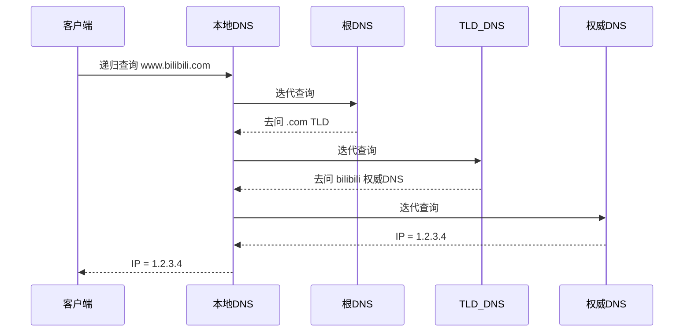
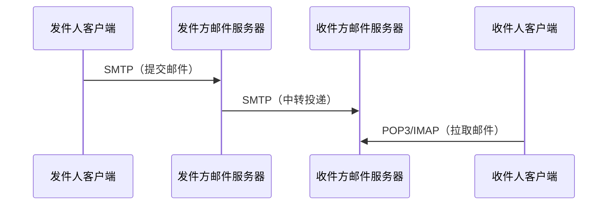
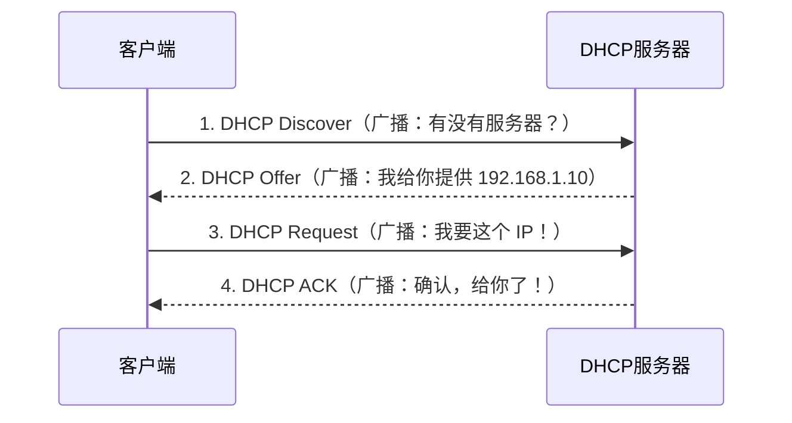
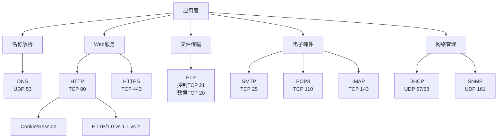

# 计算机网络——应用层

> 📌 应用层是网络体系结构的最顶层，它直接面向用户，定义了不同应用程序之间**如何交换数据**的规则——你每天用的网页浏览、收发邮件、文件下载，背后都是应用层协议在驱动。

## 📋 前置知识

在开始之前，你需要了解这些概念（如果不熟悉，先点击链接去补课）：

- [[传输层——TCP与UDP]] — 应用层数据最终要交给传输层发送，需要知道 TCP（可靠）和 UDP（快速）的区别
- [[IP地址与端口号]] — 应用层协议通过端口号来区分不同服务（HTTP 是 80，HTTPS 是 443……）
- [[DNS基础概念]] — 域名解析是应用层的核心服务，很多协议依赖它

## 🤔 为什么要学这个？

想象你在浏览器里输入 `https://www.bilibili.com`，然后页面就出现了。这背后发生了什么？

- 浏览器要先把 `bilibili.com` 这个域名翻译成 IP 地址——这是 **DNS** 在工作
- 然后浏览器用 **HTTP/HTTPS** 协议向服务器请求网页内容
- 服务器返回 HTML 页面……

如果你不懂应用层，面试官问你"从输入 URL 到页面显示发生了什么"，你就会卡壳。

**408 考试中**，应用层的考点非常集中：DNS、HTTP、FTP、SMTP/POP3、DHCP 这几个协议每年必考，尤其是它们**使用 TCP 还是 UDP**、**工作原理**、**各阶段报文**是高频大题。

## 🧠 核心概念

### 一、应用层的基本模型

应用层的通信模型有两种：

> 🎯 **类比**：把网络上的通信想象成开餐厅。
> 
> - **C/S 模式**（客户端/服务器）：你去餐厅吃饭，厨房（服务器）固定在那里，你（客户端）去点餐。服务器 24 小时待命，客户端随时来连。
> - **P2P 模式**（对等模式）：像朋友聚餐，大家都带菜，互相分享，没有固定的"厨房"。每个节点既是客户端也是服务器。

|特性|C/S 模式|P2P 模式|
|---|---|---|
|服务器|固定、长期在线|无固定服务器|
|扩展性|差（服务器是瓶颈）|好（节点越多越强）|
|典型应用|HTTP、FTP、SMTP|BitTorrent、区块链|
|管理难度|容易|难|

408 考试中 **C/S 模式考得更多**，P2P 了解概念即可。

### 二、DNS——域名系统

> 🎯 **类比**：DNS 就是互联网的"电话簿"。你知道朋友叫"李明"，但打电话要用手机号。DNS 就是帮你把"李明"翻译成"138xxxxxxxx"的那本书。

#### 2.1 DNS 的层级结构

DNS 采用**分布式、层级化**的数据库结构，不是一台服务器存所有记录。

```text
根域名服务器（Root DNS）
     ├── 顶级域名服务器（TLD DNS）
     │       ├── .com  .cn  .org  .edu ……
     └── 权威域名服务器（Authoritative DNS）
                 ├── bilibili.com 的 IP
                 └── baidu.com 的 IP
```

#### 2.2 DNS 解析过程（重点！）

解析 `www.bilibili.com` 的完整流程：

1. 浏览器先查**本地缓存**（之前访问过就直接用）
2. 查**本机 hosts 文件**（`/etc/hosts`）
3. 向**本地 DNS 服务器**（运营商提供，如 `114.114.114.114`）发出查询
4. 本地 DNS 服务器不知道，向**根域名服务器**问：`.com` 在哪里？
5. 根域名服务器回复：去找 `.com` 顶级域名服务器
6. 本地 DNS 再问 `.com` 顶级域名服务器：`bilibili.com` 在哪？
7. `.com` 服务器回复：去找 bilibili 的权威服务器
8. 本地 DNS 最终从权威服务器拿到 `www.bilibili.com` 的 IP
9. 把结果返回给你的浏览器，并**缓存**起来（有 TTL 时效）

> ⚠️ **408 高频考点**：本地 DNS 服务器采用的是**递归查询**（它替你跑腿），而它与上级服务器之间用的是**迭代查询**（上级只告诉你去哪问，不帮你去问）。



#### 2.3 DNS 使用的传输协议

- **通常用 UDP**，端口 53（查询报文短，追求速度）
- **报文超过 512 字节时改用 TCP**（如区域传输、超长响应）

> ❌ **误区**：很多同学以为 DNS 只用 UDP。错！DNS 在区域传输（主从服务器同步数据）和超大报文时会用 TCP。这是 408 的送分陷阱题。

### 三、HTTP——超文本传输协议

> 🎯 **类比**：HTTP 就像你在餐厅点菜的流程。你（客户端）说"我要一碗面"（Request），服务员（服务器）说"好的，这是你的面"然后端上来（Response）。每次点菜都是独立的，服务员不记得你上次点了什么——这就是 HTTP 的无状态特性。

#### 3.1 HTTP 报文结构

**请求报文**：

```text
GET /index.html HTTP/1.1        ← 请求行：方法 + URL + 版本
Host: www.bilibili.com          ← 请求头
Connection: keep-alive
                                ← 空行（必须有！）
                                ← 请求体（GET 通常为空，POST 有数据）
```

**响应报文**：

```text
HTTP/1.1 200 OK                 ← 状态行：版本 + 状态码 + 短语
Content-Type: text/html         ← 响应头
Content-Length: 1024
                                ← 空行
<html>...</html>                ← 响应体
```

#### 3.2 HTTP 状态码（必背）

|状态码|含义|记忆口诀|
|---|---|---|
|1xx|信息性，继续处理|还没完，继续|
|200|OK，请求成功|完美|
|301|永久重定向|我搬家了，以后去新地址|
|302|临时重定向|今天临时去别处|
|400|Bad Request，客户端请求有误|你说的什么意思？|
|403|Forbidden，无权限|禁止入内|
|404|Not Found，资源不存在|找不到|
|500|Internal Server Error|服务器崩了|
|503|Service Unavailable|服务器太忙/宕机|

#### 3.3 HTTP/1.0 vs HTTP/1.1 vs HTTP/2

|特性|HTTP/1.0|HTTP/1.1|HTTP/2|
|---|---|---|---|
|连接方式|非持久连接|**持久连接**（默认）|多路复用|
|每个对象需要几次握手|每次都要|复用同一连接|并行传输|
|队头阻塞|有|有（流水线方式有所缓解）|解决|
|头部压缩|无|无|HPACK 压缩|

> ⚠️ **踩坑点**：HTTP/1.1 的**持久连接**是 408 高频考点。非持久连接（HTTP/1.0）每请求一个对象需要 **2 个 RTT**（1个RTT建立TCP连接 + 1个RTT发请求收响应）；持久连接后，后续对象只需 **1 个 RTT**。

**RTT 计算**是大题常客，公式要熟记：

$$ \text{非持久连接总时间} = 2 \times RTT + \text{文件传输时间} $$

$$ \text{持久连接（流水线）总时间} \approx RTT + \text{所有对象传输时间之和} $$

#### 3.4 Cookie 与 Session

HTTP 是无状态的，Cookie 和 Session 是"让服务器记住你"的两种方案：

- **Cookie**：服务器在响应头中设置 `Set-Cookie`，客户端浏览器保存，之后每次请求都带上——存在客户端
- **Session**：服务器端保存用户状态，给客户端一个 Session ID，客户端下次带着这个 ID 来——主要存在服务端

### 四、FTP——文件传输协议

> 🎯 **类比**：FTP 像一个图书馆的借书系统。你先去前台（控制连接）办理借书手续，前台会告诉你去几号书架（数据连接）取书。前台始终开着，但每次取书都打开一个新通道。

**FTP 的最大特点：使用两个 TCP 连接**

|连接类型|端口|作用|生命周期|
|---|---|---|---|
|控制连接|21|发送命令（ls、get、put……）|整个会话期间保持|
|数据连接|20（主动）/ 随机（被动）|传输实际文件数据|每次传输完毕就关闭|

**主动模式 vs 被动模式**：

- **主动模式**：服务器主动用端口 20 连接客户端（客户端在NAT/防火墙后面时容易失败）
- **被动模式**：服务器开放一个随机端口，由客户端来连（现在更常用，穿越防火墙友好）

> ❌ **误区**：不要把 FTP 的控制连接（端口 21）和数据连接（端口 20）搞反。**21 是控制，20 是数据**。另外，被动模式下数据连接不是 20 号端口。

### 五、电子邮件协议——SMTP / POP3 / IMAP

> 🎯 **类比**：邮件系统就像现实中的邮局体系。
> 
> - **SMTP**（发邮件）= 你把信交给邮局寄出去（发送方到邮件服务器，或服务器之间传递）
> - **POP3**（收邮件）= 你去邮局把信全部取回家，邮局不再保留
> - **IMAP**（收邮件）= 你在邮局开了个私人邮箱，可以在线管理，邮件同步在服务器上

|协议|端口|传输层|方向|特点|
|---|---|---|---|---|
|SMTP|25|TCP|发送/中转|推协议，只能发 ASCII 文本（附件用 MIME 扩展）|
|POP3|110|TCP|接收|下载到本地，默认删除服务器副本|
|IMAP|143|TCP|接收|在线管理，邮件保留在服务器|

**邮件发送完整流程**（很重要，大题常考）：



> ⚠️ **踩坑点**：发件人客户端到邮件服务器用 **SMTP**，收件人客户端从服务器取邮件用 **POP3 或 IMAP**。两端都用 SMTP 是常见错误！

### 六、DHCP——动态主机配置协议

> 🎯 **类比**：DHCP 就像酒店前台给住客分配房间号。你一进酒店（连上网络），前台（DHCP 服务器）就自动分配给你一个房间号（IP 地址），告诉你楼栋（子网掩码）、酒店大门（默认网关）、联系前台的电话（DNS 服务器地址）。退房时（租约到期或断开连接），房间号收回，分配给下一个人。

**DHCP 工作过程（四步握手，要会画图）**：



**关键细节**：

- 全程使用 **UDP**，端口 67（服务器）和 68（客户端）
- 全程使用**广播**，因为客户端还没有 IP，无法单播
- DHCP 分配的 IP 有**租约期限**，快到期时客户端主动续租

> ❌ **误区**：有同学以为 DHCP 用 TCP（因为"配置这么重要肯定要可靠传输"）。其实 DHCP 用 **UDP**！原因是：客户端还没有 IP，无法建立 TCP 连接；而且即使丢包，重广播一次就好，不需要 TCP 的复杂机制。

### 七、各协议端口与传输层协议汇总（必背表格）

|应用层协议|端口号|传输层协议|记忆要点|
|---|---|---|---|
|DNS|53|**UDP**（常用）/ TCP（区域传输）|53，双协议|
|HTTP|80|TCP|最常用|
|HTTPS|443|TCP|HTTP + TLS|
|FTP（控制）|21|TCP|控制 21|
|FTP（数据）|20|TCP|数据 20|
|SMTP|25|TCP|发邮件|
|POP3|110|TCP|收邮件（取走）|
|IMAP|143|TCP|收邮件（在线）|
|DHCP（服务端）|67|**UDP**|67/68，UDP|
|DHCP（客户端）|68|**UDP**||
|Telnet|23|TCP|远程登录（明文，不安全）|
|SSH|22|TCP|安全远程登录|
|SNMP|161|**UDP**|网络管理协议|

## ⚠️ 常见误区与踩坑点

> ❌ **误区 1：DNS 只用 UDP** 很多同学死记"DNS 用 UDP"，但实际上 DNS 在**区域传输**（主从 DNS 服务器同步）以及响应报文超过 512 字节时会切换到 TCP。408 真题中出现过这个陷阱。

> ❌ **误区 2：DHCP 用 TCP** DHCP 使用 UDP，因为客户端在获得 IP 之前无法建立 TCP 连接，只能广播。

> ❌ **误区 3：FTP 数据连接端口是 21** FTP **控制连接用 21，数据连接用 20**（主动模式下）。被动模式下数据连接用随机端口。

> ❌ **误区 4：收发邮件都用 SMTP** SMTP 只负责"发送和中转"。收件人从服务器**取**邮件用的是 POP3 或 IMAP。

> ⚠️ **踩坑 5：HTTP 非持久连接的 RTT 计算** 非持久连接请求一个 HTML 文件（含 N 个对象）的总时间很容易算错。
> 
> - 基础 HTML 文件：$2 \times RTT + T_{传输}$（1 RTT 建TCP + 1 RTT HTTP请求）
> - 每个内嵌对象（图片等）：又需要 $2 \times RTT + T_{传输}$
> - 共 $1+N$ 个对象，总计 $(2+2N) \times RTT + \text{所有传输时间}$

> ⚠️ **踩坑 6：HTTP 报文中的空行不可省略** 请求头/响应头 与 请求体/响应体 之间**必须有一个空行**（即 `\r\n\r\n`），这是 HTTP 协议规定的分隔符。这是应用层大题手写报文时的常见扣分点。

## 🏋️ 动手练习

### 练习 1：DNS 解析流程画图（⭐ 难度）

**题目**：用户在浏览器输入 `www.tsinghua.edu.cn`，本地 DNS 服务器中没有缓存。请画出完整的 DNS 解析过程，标明递归查询和迭代查询发生的位置。

**提示**：想想客户端和本地 DNS 之间是什么查询方式？本地 DNS 和根/TLD/权威 DNS 之间是什么方式？

<details> <summary>💡 点击查看参考答案</summary>

```text
客户端 --[递归查询]--> 本地DNS服务器
    本地DNS --[迭代查询]--> 根域名服务器（问：.cn 在哪）
    根域名服务器 --[回复]--> 本地DNS（去问 .cn TLD）
    本地DNS --[迭代查询]--> .cn 顶级域名服务器（问：edu.cn 在哪）
    .cn TLD --[回复]--> 本地DNS（去问 edu.cn 权威DNS）
    本地DNS --[迭代查询]--> edu.cn 权威DNS（问：tsinghua.edu.cn 在哪）
    edu.cn 权威DNS --[回复]--> 本地DNS（IP = x.x.x.x）
本地DNS --[返回结果]--> 客户端
```

关键点：

1. 客户端 ↔ 本地DNS：递归查询（本地DNS全权负责）
2. 本地DNS ↔ 各级DNS：迭代查询（每级只告诉你下一步去哪）
3. 本地DNS会缓存结果，减少下次查询开销

</details>

### 练习 2：HTTP 连接时间计算（⭐⭐ 难度）

**题目**：一个 Web 页面由 1 个 HTML 文件和 5 张图片组成，RTT = 50ms，所有文件传输时间忽略不计。分别计算以下两种情况的总访问时间：

1. HTTP/1.0（非持久连接，串行请求）
2. HTTP/1.1（持久连接 + 流水线）

**提示**：非持久连接每个对象需要几个 RTT？持久连接建立后，后续对象流水线下需要几个 RTT？

<details> <summary>💡 点击查看参考答案</summary>

**情况1：HTTP/1.0 非持久连接**

每个对象需要：1 RTT（TCP握手） + 1 RTT（HTTP请求/响应） = 2 RTT

共 1 + 5 = 6 个对象，总时间：

$$6 \times 2 \times RTT = 12 \times 50ms = 600ms$$

**情况2：HTTP/1.1 持久连接 + 流水线**

- 首次建立 TCP 连接：1 RTT
- 请求 HTML 文件：1 RTT
- 流水线并行请求 5 张图片：1 RTT（流水线下所有请求同时发出）

总时间：

$$（1 + 1 + 1）\times RTT = 3 \times 50ms = 150ms$$

对比：非持久 600ms vs 持久流水线 150ms，性能提升 4 倍！

</details>

### 练习 3：邮件系统综合题（⭐⭐⭐ 难度）

**题目**：Alice（使用 foxmail 客户端，邮件服务器为 `mail.alice.com`）给 Bob（使用 Gmail，邮件服务器为 `mail.bob.com`）发一封邮件。请回答：

1. Alice 的客户端与 `mail.alice.com` 之间用什么协议？
2. `mail.alice.com` 与 `mail.bob.com` 之间用什么协议？
3. Bob 的 Gmail 客户端从 `mail.bob.com` 收信时用什么协议？
4. 全程涉及哪些端口号？

**提示**：区分"客户端发送"、"服务器中转"、"客户端接收"三个阶段分别用什么协议。

<details> <summary>💡 点击查看参考答案</summary>

```text
1. Alice客户端 → mail.alice.com：SMTP（端口 25）
2. mail.alice.com → mail.bob.com：SMTP（端口 25）
3. Bob的Gmail客户端 → mail.bob.com：POP3（端口110）或 IMAP（端口143）
4. 涉及端口：25（SMTP两次用到）、110（POP3）或 143（IMAP）
```

核心结论：

- SMTP 负责"推送"（发件方 → 服务器 → 服务器）
- POP3/IMAP 负责"拉取"（客户端从服务器取信）
- 整个链路 SMTP 用了两次，最后一环（收件人取信）换协议

</details>

## 📝 总结

### 本篇要点回顾

1. **DNS** 使用分层迭代查询，客户端与本地DNS之间是递归查询，通常用 UDP（端口53），区域传输用 TCP
2. **HTTP** 无状态，1.1 默认持久连接；非持久连接每个对象耗费 $2 \times RTT$，持久连接流水线极大提升性能
3. **FTP** 使用两个 TCP 连接：控制连接（21端口，全程保持）+ 数据连接（20端口，按需开关）
4. **邮件三剑客**：SMTP 发送/中转，POP3 取走到本地，IMAP 在线管理；三者均用 TCP
5. **DHCP** 全程广播 + UDP，四步握手（Discover → Offer → Request → ACK）动态分配 IP

### 知识图谱



## 🔗 相关链接

- 上级概念：[[计算机网络体系结构]]
- 同级概念：[[传输层——TCP与UDP]]、[[网络层——IP协议]]
- 下级概念：[[HTTP报文详解]]、[[DNS资源记录类型]]、[[HTTPS与TLS握手]]
- 实际应用：[[408真题——应用层历年考点整理]]

## 📚 参考资料

- [谢希仁《计算机网络》第8版](https://book.douban.com/subject/35498215/) — 408 官方指定教材，应用层章节是第6章
- [王道《计算机网络》考研复习指导](https://book.douban.com/subject/35498216/) — 配套习题和历年真题解析，强烈推荐
- [MDN HTTP 文档](https://developer.mozilla.org/zh-CN/docs/Web/HTTP) — HTTP 报文格式和状态码的权威参考，中文版