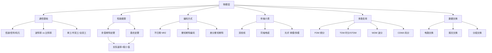

# 计算机网络：物理层

> 📌 物理层是计算机网络的最底层，负责把一串 0 和 1 的比特流，通过物理介质（网线、光纤、空气）从一台机器搬运到另一台机器。它不关心这些数据是什么意思，只管"运"过去。

## 📋 前置知识

- [[二进制与信息编码]] —— 物理层传输的本质是二进制比特，需要知道数据是如何用 0/1 表示的
- [[信号与波形基础]] —— 物理层的核心是信号传输，了解模拟信号与数字信号的概念有帮助
- [[分贝与功率概念]] —— 计算信噪比时会用到，不熟悉的话看到公式不要慌，本篇会解释

本篇无需编程基础，从概念讲起。

## 🤔 为什么要学物理层？

想象你要给远在北京的朋友发一条消息"Hello"。在你的电脑里，这条消息是一串二进制数据：`01001000 01100101 01101100 01101100 01101111`。

问题来了：**这串 0 和 1 怎么从你的网卡，穿越几千公里的光纤，到达朋友的电脑？**

这就是物理层要解决的问题。它规定了：

- 用什么物理介质传输（双绞线？光纤？无线电波？）
- 0 和 1 用什么物理信号表示（高电压是 1，低电压是 0？）
- 传得多快？传多远？会不会出错？

**408 考试中，物理层的考点集中在**：奈奎斯特定理、香农定理、编码方式、传输介质、多路复用。这几个知识点几乎每年必考，务必深入理解而不是死记公式。

## 🧠 核心概念

### 一、通信基础术语

在讲物理层技术之前，先把这几个最基础的概念搞清楚，后面全靠它们。

#### 1.1 信道、信号、码元

> 🎯 **类比**：把信道（Channel）想象成一条高速公路，信号就是跑在路上的车，码元就是车厢里装的货物单元。

|术语|正式定义|大白话|
|---|---|---|
|**信道**|信号传输的物理通路|数据走的"路"|
|**信号**|数据在信道上的物理表现形式|电压高低、光的有无、无线电波强弱|
|**码元**|信号在信道上的一个符号单位|信号每"变化一次"就是一个码元|
|**波特率**|每秒传输的码元个数，单位 Baud|信道每秒"变化几次"|
|**比特率**|每秒传输的比特数，单位 bps|每秒传多少个 0/1|

**波特率与比特率的关系**，这是 408 必考换算：

$$\text{比特率} = \text{波特率} \times \log_2 N$$

其中 $N$ 是码元的状态数（每个码元能表示几种值）。

举个例子：如果每个码元有 4 种状态（00、01、10、11），那么 $\log_2 4 = 2$，每个码元携带 2 个比特。波特率 1000 Baud 对应比特率 2000 bps。

> ⚠️ **踩坑**：波特率（Baud）和比特率（bps）不是一回事！很多初学者把它们混用。只有当每个码元只有 2 种状态（0 和 1）时，波特率在数值上才等于比特率。

#### 1.2 模拟信号 vs 数字信号

> 🎯 **类比**：模拟信号像水龙头的水流，可以是任意流量大小，连续变化；数字信号像电灯的开关，只有"开"和"关"两种状态。

- **模拟信号**：连续变化的物理量，如电话中传统的声音信号
- **数字信号**：离散的物理量，只取有限几个值，如网线中的高低电平

#### 1.3 数据通信方向

|通信方式|说明|生活类比|
|---|---|---|
|**单工** Simplex|只能单向传输|广播、电视|
|**半双工** Half-Duplex|双向，但同一时刻只能一个方向|对讲机|
|**全双工** Full-Duplex|双向，可同时传输|打电话|

> 💡 408 考试中，以太网早期（集线器时代）用半双工，交换机时代用全双工，这个区别在后面数据链路层还会用到。

### 二、奈奎斯特定理（无噪声信道的极限）

理解了码元和波特率，我们自然会问：**在一条信道上，最快能传多快？**

奈奎斯特（Nyquist）给出了**理想无噪声信道**下的答案。

> 🎯 **类比**：把信道想象成一条车道，车道有宽度限制（带宽）。奈奎斯特定理告诉你：就算道路再好、车技再高，每秒钟最多只能让这么多辆车通过——这是物理极限，不是技术问题。

**奈奎斯特定理公式**：

$$C_{Nyquist} = 2W\log_2 N \quad \text{（bps）}$$

其中：

- $W$ 是信道带宽，单位 Hz
- $N$ 是每个码元的状态数
- $C_{Nyquist}$ 是最大数据传输速率

**举例**：带宽为 3000 Hz 的信道，若使用 4 种状态的信号：

$$C = 2 \times 3000 \times \log_2 4 = 2 \times 3000 \times 2 = 12000 \text{ bps}$$

> ⚠️ **误区**：奈奎斯特定理假设信道**完全没有噪声**。现实中的信道都有噪声，所以奈奎斯特定理给出的是理论上限，实际传输速率会更低。这时候就需要香农定理了。

### 三、香农定理（有噪声信道的极限）

香农（Shannon）考虑了噪声的影响，给出了**有噪声信道**的容量极限。

> 🎯 **类比**：你在嘈杂的咖啡馆里跟朋友说话。噪音（噪声）越大，你朋友能听清楚的字数（信息量）就越少，你不得不说得更慢、更清晰。香农定理就是在量化这个"噪声对通信的限制"。

**香农定理公式**：

$$C_{Shannon} = W\log_2\left(1 + \frac{S}{N}\right) \quad \text{（bps）}$$

其中：

- $W$ 是信道带宽，单位 Hz
- $S/N$ 是信噪比（Signal-to-Noise Ratio），是功率之比（无单位纯数字）
- $C_{Shannon}$ 是信道容量（理论最大值）

**信噪比的单位换算**（408 必考）：

信噪比常用分贝（dB）表示：

$$\frac{S}{N}\text{（dB）} = 10\log_{10}\frac{S}{N}$$

如果题目给的是 $30\text{ dB}$，则：

$$\frac{S}{N} = 10^{30/10} = 10^3 = 1000$$

**举例**：带宽 3000 Hz，信噪比 30 dB：

$$C = 3000 \times \log_2(1 + 1000) \approx 3000 \times \log_2(1000) \approx 3000 \times 9.97 \approx 29910 \text{ bps}$$

#### 奈奎斯特 vs 香农：两个定理如何配合使用？

这是 408 真题最爱考的综合题型。两个定理同时存在时，**实际速率取两者中的较小值**：

$$C_{实际} = \min(C_{Nyquist},\ C_{Shannon})$$

因为：

- 奈奎斯特给了码元速率上限
- 香农给了信息量上限
- 两个限制都必须满足

> 💡 **解题口诀**：先用香农算出信道容量上限，再用奈奎斯特算出码元速率上限，取小值，就是信道的实际传输极限。

### 四、数字基带信号的编码方式

数字信号在物理介质上传输时，需要用特定的电气信号来表示 0 和 1。不同的编码方式有不同的特性，408 重点考查以下几种。

> 🎯 **类比**：编码就像用旗语传递信号。举右手是 1，举左手是 0，这是一种编码方式。但如果两人约好"旗子抖动一次"代表 1、"不动"代表 0，这是另一种编码方式。不同约定有不同的优缺点。

#### 4.1 单极性不归零码（NRZ）

- 高电平表示 1，低电平（零电平）表示 0
- **缺点**：连续的 0 或 1 看不到时钟信号，接收方不知道传了几个

```
比特流：  1   1   0   0   1
电平：  ‾‾‾‾‾‾‾‾         ‾‾‾
       __________
            0         0   1
```

#### 4.2 曼彻斯特编码（Manchester）

- 每个比特周期**中间**必须发生一次跳变
- 中间从低到高 = 1，中间从高到低 = 0（IEEE 802.3 以太网标准）
- **优点**：自带时钟信号（每个码元必有跳变，接收方可以同步）
- **缺点**：效率只有 50%（带宽利用率低，每传 1 bit 需要 2 次信号变化）

#### 4.3 差分曼彻斯特编码（Differential Manchester）

- 每个比特周期中间也有跳变（用于同步）
- 区别在于：**看码元开始处有无跳变**来区分 0 和 1
    - 码元开始处有跳变 = 0
    - 码元开始处无跳变 = 1
- **优点**：抗干扰能力强，令牌环网（Token Ring）使用

> ⚠️ **踩坑**：曼彻斯特编码和差分曼彻斯特编码经常在选择题里互相干扰。记住区别：普通曼彻斯特靠**中间跳变方向**判断 0/1；差分曼彻斯特靠**开头是否跳变**判断 0/1，中间跳变只用来同步。

### 五、物理层传输介质

传输介质是物理层的"公路"，不同介质有不同的特性。

#### 5.1 有线传输介质

|介质|传输距离|带宽|抗干扰|典型用途|
|---|---|---|---|---|
|**双绞线**|100 m（以太网）|中等|一般|局域网、电话|
|**同轴电缆**|较远|较高|较好|有线电视、早期以太网|
|**光纤**|数十公里|极高|极强|主干网、长距离传输|

**双绞线**的绞合是为了减少电磁干扰（相邻导线相反方向的电流产生的磁场相互抵消）。

**光纤**分两种：

- **单模光纤**：纤芯细（约 $9\ \mu\text{m}$），只有一条光路，传输距离远，用于长距离
- **多模光纤**：纤芯粗（约 $50\ \mu\text{m}$），多条光路并行，传输距离短，用于楼内

> 💡 记忆口诀：单模=单一路径=传得远；多模=多条路径=传得近（因为多条路径的光到达时间不同，会产生色散，导致信号失真）

#### 5.2 无线传输介质

|介质|频段|典型应用|
|---|---|---|
|无线电波|低频宽带|广播、Wi-Fi|
|微波|高频|卫星通信、5G|
|红外线|红外频段|遥控器、早期无线局域网|

### 六、多路复用技术

多路复用（Multiplexing）解决的问题是：**一条物理链路太"宽"，只给一对用户用太浪费，能不能让多对用户同时共享？**

> 🎯 **类比**：多路复用就像高速公路的多车道。你可以在一条公路上规划多条车道（频分），或者让车辆排队轮流使用同一条车道（时分），或者让不同代码的车混行互不干扰（码分）。

#### 6.1 频分多路复用（FDM，Frequency Division Multiplexing）

- 把信道的**频率范围**划分成多个子频段，每对用户占一个子频段
- 用户同时传，但频率不同，互不干扰
- **类比**：广播电台，每个台占一个频段，你调到哪个频段就收哪个台

#### 6.2 时分多路复用（TDM，Time Division Multiplexing）

- 把时间划分成固定长度的时间槽，轮流分给不同用户
- 每个用户在自己的时间槽内独占全部带宽
- **类比**：食堂的微波炉，大家排队，每人用 2 分钟，轮流使用

**统计时分多路复用（STDM）**：TDM 的改进版。普通 TDM 是固定分配时间槽（就算某个用户没数据发，时间槽也空着白白浪费），STDM 是**按需分配**，有数据才给时间槽，提高了信道利用率。

#### 6.3 波分多路复用（WDM，Wavelength Division Multiplexing）

- 光纤专用，把不同波长的光信号同时在一根光纤里传输
- 本质上是光频率版本的 FDM
- **密集波分复用（DWDM）** 可以在一根光纤上复用几十到上百路信号

#### 6.4 码分多路复用（CDMA，Code Division Multiple Access）

- 每个用户分配一个唯一的**码片序列**（Chip Sequence）
- 所有用户同时、同频传输，靠码片序列区分
- **类比**：一个大房间里大家同时说话，但每个人说的是不同语言，你懂哪种语言就能听懂哪个人

CDMA 的核心：码片序列之间**正交**（内积为 0），所以接收方可以用自己的码片序列从混合信号中"提取"出属于自己的数据。

> ⚠️ **踩坑**：CDMA 的计算题是 408 的难点。发送 1 时发送本码片序列，发送 0 时发送**码片序列的反码**（每一位取反）。不发送时发送全零序列。接收方将收到的信号与自己的码片序列做内积，正数表示收到 1，负数表示收到 0，零表示对方未发送。

### 七、数据交换方式

在更大的网络里，数据从源头到目的地往往要经过多个节点（路由器/交换机）。这些节点之间如何传递数据？

#### 7.1 电路交换（Circuit Switching）

> 🎯 **类比**：打固定电话。拨通之后，电话公司帮你"接"了一条专用线路从你到对方，这条线路在通话期间被你独占，挂断后释放。

- 通信前**建立专用连接**，通信中独占资源，结束后释放
- 优点：延迟小，实时性好
- 缺点：建立连接耗时；空闲时信道浪费

#### 7.2 报文交换（Message Switching）

- 将整个消息作为一个整体，在每个节点**存储后转发**
- 不需要建立专用线路
- 缺点：消息可能很大，节点需要大缓存；延迟高

#### 7.3 分组交换（Packet Switching）

> 🎯 **类比**：快递公司把一个大箱子拆成几个小包裹（分组），每个包裹独立走不同路线到达目的地，最后在目的地重新组装。

- 将消息切割成小的**分组（Packet）**，每个分组独立路由
- 每个节点**存储-转发**一个分组
- 优点：资源利用率高；延迟相对报文交换小
- 缺点：分组到达可能乱序，需要重组

分组交换是现代互联网的基础。

|对比项|电路交换|报文交换|分组交换|
|---|---|---|---|
|是否建立连接|✅ 需要|❌ 不需要|❌ 不需要|
|资源独占|✅ 独占|❌ 共享|❌ 共享|
|时延|小（实时）|大|中等|
|适用场景|实时语音|电子邮件|互联网数据|

## ⚠️ 常见误区与踩坑点

> ❌ **误区 1：带宽越大，速率就越快（无上限）** 很多初学者认为提高带宽就能无限提速，但实际上香农定理给出了有噪声信道的理论极限——信道容量同时受带宽和信噪比双重限制。

> ❌ **误区 2：奈奎斯特定理和香农定理只要会一个就行** 两个定理描述不同角度的极限，考试的综合题经常要你用两个定理分别算出各自的上限，然后取小值作为答案。缺一不可。

> ⚠️ **踩坑 3：混淆"带宽"的两种含义** 在物理层中，带宽的单位是 **Hz**（赫兹），指的是信道能传输的频率范围。 在日常口语和计算机网络上层中，"带宽"常被用来表示数据传输速率，单位是 **bps**。 408 考试中要看上下文判断：出现 Hz 就是频率意义，出现 bps 就是速率意义。

> ⚠️ **踩坑 4：信噪比分贝与真实比值的换算** $30\ \text{dB}$ 不等于 30，而是 $10^3 = 1000$！每次题目给信噪比用 dB，都要先换算成真实比值再代入香农公式。

> ⚠️ **踩坑 5：曼彻斯特编码效率** 曼彻斯特编码的带宽利用率是 50%，也就是说要传 1 Mbps 的数据，实际需要 2 MHz 的带宽。这在选择题里是高频考点。

> ❌ **误区 6：CDMA 中"不发送"等于发送 0** 在 CDMA 中，"不发送"时发送的是全零序列，接收方内积为 0；"发送比特 0"时发送的是码片的反码，接收方内积为负数。这两种情况截然不同，绝对不能混淆。

## 🏋️ 动手练习

### 练习 1：奈奎斯特 + 香农联合计算（⭐⭐ 难度）

**题目**：某信道带宽为 4000 Hz，信噪比为 $S/N = 255$（真实比值，非 dB）。

1. 求香农定理给出的信道容量上限
2. 若要达到香农容量，至少需要多少种信号状态？
3. 若实际使用 8 种信号状态，奈奎斯特定理给出的最大速率是多少？
4. 最终该信道的实际最大传输速率是多少？

**提示**：先用香农算容量，再用奈奎斯特算码元速率上限，想想两个结果哪个是瓶颈。

<details> <summary>💡 点击查看参考答案</summary>

**第 1 步：香农定理**

$$C_{Shannon} = W\log_2(1 + S/N) = 4000 \times \log_2(1 + 255) = 4000 \times \log_2(256) = 4000 \times 8 = 32000 \text{ bps}$$

**第 2 步：至少需要多少种状态？**

奈奎斯特最大速率 $= 2W\log_2 N \geq 32000$

$$\log_2 N \geq \frac{32000}{2 \times 4000} = 4 \implies N \geq 2^4 = 16$$

至少需要 **16 种**信号状态。

**第 3 步：实际用 8 种状态时的奈奎斯特上限**

$$C_{Nyquist} = 2 \times 4000 \times \log_2 8 = 8000 \times 3 = 24000 \text{ bps}$$

**第 4 步：取小值**

$$C_{实际} = \min(32000, 24000) = 24000 \text{ bps}$$

此时瓶颈在奈奎斯特（码元状态数不够），信道还有余量但用不上。

</details>

### 练习 2：曼彻斯特编码波形识别（⭐ 难度）

**题目**：以下比特流使用曼彻斯特编码（IEEE 802.3 标准：中间从低到高 = 1，中间从高到低 = 0）：

```
比特流：1 0 1 1 0
```

请画出对应的信号波形，标出每个比特周期的中间跳变方向。

**提示**：每个比特周期分为前半段和后半段，中间必须发生跳变。先确定中间跳变方向，再补全前半段和后半段的电平。

<details> <summary>💡 点击查看参考答案</summary>

```
比特：   1        0        1        1        0
        ┌──┐   ┌──┐┌──┐  ┌──┐    ┌──┐   ┌──┐
        │  │   │  ││  │  │  │    │  │   │  │
────────┘  └───┘  └┘  └──┘  └────┘  └───┘  └────
        前↑后   前↑后    前↑后    前↑后   前↑后
         ↑       ↓       ↑       ↑        ↓
        (1=低→高)(0=高→低)(1)(1)(0)
```

- 比特 1：中间从低跳高（↑）
- 比特 0：中间从高跳低（↓）
- 相邻比特之间，若跳变方向不连续，需要在边界处补一个额外跳变

关键点：曼彻斯特编码每个比特周期必有且仅有一次跳变在中间（用于同步），边界处的跳变是"为了让下一个比特从正确电平开始"而附加的，不携带信息。

</details>

### 练习 3：CDMA 编码解码（⭐⭐⭐ 难度）

**题目**：网络中有三个用户 A、B、C，码片序列如下：

- A 的码片：$(+1, +1, +1, -1)$
- B 的码片：$(+1, -1, +1, +1)$
- C 的码片：$(+1, +1, -1, +1)$

某时刻，信道上叠加的信号为 $(+3, +1, -1, +1)$。

请判断：A、B、C 分别发送了比特 0、比特 1 还是没有发送？

**提示**：将叠加信号与每个用户的码片做内积，结果 $> 0$ 表示发送了 1，$< 0$ 表示发送了 0，$= 0$ 表示未发送。内积计算：对应位相乘后求和，再除以码片长度。

<details> <summary>💡 点击查看参考答案</summary>

叠加信号 $\mathbf{r} = (+3, +1, -1, +1)$，码片长度 $n = 4$。

**用户 A**（码片 $(+1, +1, +1, -1)$）：

$$\mathbf{r} \cdot \mathbf{A} = \frac{1}{4}[(3)(1) + (1)(1) + (-1)(1) + (1)(-1)] = \frac{1}{4}[3+1-1-1] = \frac{2}{4} = \frac{1}{2}$$

等等，内积结果为 $+\frac{1}{2}$，不是整数？这意味着 A 发送了比特 1（结果 $> 0$）。

> 实际上在 CDMA 题目中，结果为 $+1$ 表示发了 1，$-1$ 表示发了 0，$0$ 表示未发送。非整数时需要根据实际题目条件判断，但本题结果为正，说明 **A 发送了比特 1**。

**用户 B**（码片 $(+1, -1, +1, +1)$）：

$$\mathbf{r} \cdot \mathbf{B} = \frac{1}{4}[(3)(1) + (1)(-1) + (-1)(1) + (1)(1)] = \frac{1}{4}[3-1-1+1] = \frac{2}{4} = \frac{1}{2}$$

结果 $> 0$，**B 发送了比特 1**。

**用户 C**（码片 $(+1, +1, -1, +1)$）：

$$\mathbf{r} \cdot \mathbf{C} = \frac{1}{4}[(3)(1) + (1)(1) + (-1)(-1) + (1)(1)] = \frac{1}{4}[3+1+1+1] = \frac{6}{4} = \frac{3}{2}$$

结果 $> 0$，**C 发送了比特 1**。

（本题所有用户均发送了 1，叠加信号 $= \mathbf{A} + \mathbf{B} + \mathbf{C} = (3,1,-1,1)$，验证正确。）

</details>

## 📝 总结

### 本篇要点回顾

1. **波特率与比特率**：$\text{比特率} = \text{波特率} \times \log_2 N$，两者只在 $N=2$ 时数值相等
2. **奈奎斯特定理**：无噪声信道最大速率 $= 2W\log_2 N$，受带宽和状态数限制
3. **香农定理**：有噪声信道容量 $= W\log_2(1 + S/N)$，信噪比越大、带宽越宽则容量越大；两个定理取小值
4. **编码方式**：曼彻斯特编码自带时钟信号（100% 跳变），但效率只有 50%；差分曼彻斯特靠开头跳变区分 0/1
5. **多路复用**：FDM 按频率分，TDM 按时间分，WDM 是光纤的 FDM，CDMA 按码片正交分

### 知识图谱



## 🔗 相关链接

- 上级概念：[[计算机网络体系结构]]
- 同级概念：[[数据链路层]]、[[网络层]]
- 下级概念：[[信道编码理论]]、[[调制解调技术]]
- 实际应用：[[以太网标准演变]]、[[光纤通信原理]]
- 考试专题：[[408真题-物理层计算题汇总]]

## 📚 参考资料

- [谢希仁《计算机网络》第 8 版](https://book.douban.com/subject/35498218/) —— 408 官方参考教材，物理层在第 2 章，公式推导清晰
- [王道考研计算机网络](https://www.cskaoyan.com/) —— 408 考研辅导，习题讲解细致，适合配合真题使用
- [RFC 793 等相关标准](https://www.rfc-editor.org/) —— 了解协议标准原文（物理层主要参考 IEEE 802 系列）