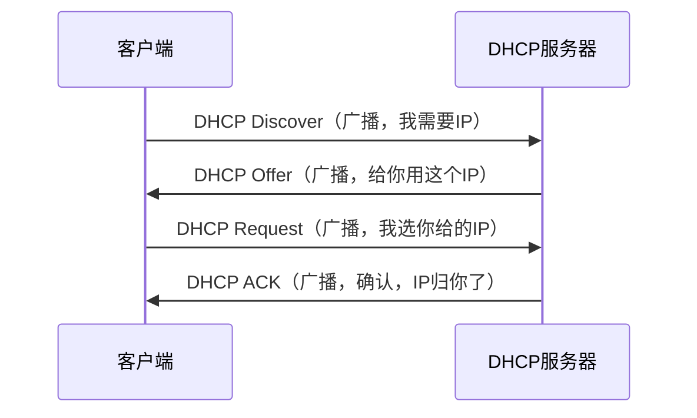
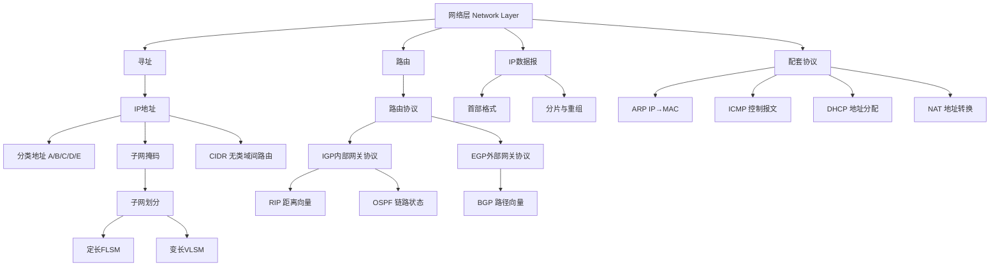

# 计算机网络：网络层详解（408考研）

> 📌 网络层解决的核心问题只有一个：**我在北京，数据怎么找路送到上海？** 它负责给数据包规划"路线图"，是互联网能够互联互通的灵魂所在。

---

## 📋 前置知识

在开始之前，你需要了解这些概念（如果不熟悉，先点击链接去补课）：

- [[数据链路层]] — 网络层的下一层，负责相邻两个节点之间的数据传输；网络层在它的基础上实现跨网络传输
- [[物理层]] — 最底层，负责比特流的传输；理解它有助于理解为什么需要分层
- [[二进制与子网划分]] — IP地址的计算全是二进制运算，这是408的重点计算题

---

## 🤔 为什么要学这个？

想象一下，你在北京想给上海的朋友发一封信。你只需要写上收件人地址，然后交给邮局，邮局会帮你规划：北京→济南→南京→上海，经过多个中转站，信件最终到达。

**没有网络层时的世界**：每台电脑只能和直接相连的电脑通信。你的电脑只能和同一根网线上的设备说话，想和隔壁城市的服务器通信？做梦吧。

**有了网络层之后**：全球数以亿计的设备，每台都有唯一的 IP 地址，数据包可以穿越无数个路由器，跨越大洲大洋，最终精准投递到目标设备。

对于 408 考研，网络层是**分值最重的一层**，涉及：

- IP 地址计算（必考，经常出大题）
- 子网划分与 CIDR（每年必考）
- 路由算法（RIP、OSPF、BGP 原理）
- ICMP、ARP、DHCP 等配套协议

---

## 🧠 核心概念

### 一、网络层的两大核心功能

> 🎯 **类比**：把网络层想象成一个快递公司的调度中心。它干两件事：①给每个地址贴上**唯一编号**（寻址），②规划**最优路线**让包裹送到（路由）。

网络层的两大核心功能：

**1. 寻址（Addressing）**：给网络中每台设备分配唯一的逻辑地址（IP 地址），就像每栋楼有唯一的门牌号。

**2. 路由（Routing）**：当数据包要从源地址到达目的地址，路由器负责一跳一跳地转发，选择最佳路径。

### 二、IP 地址（最重点）

#### 2.1 什么是 IP 地址？

IP 地址（IPv4）是一个 **32 位二进制数**，为了方便人类阅读，写成四组十进制，用点分隔，例如：

$$192.168.1.100$$

其二进制形式为：

$$11000000.10101000.00000001.01100100$$

每组叫一个**字节（octet）**，范围是 $0 \sim 255$。

#### 2.2 IP 地址的结构：网络号 + 主机号

> 🎯 **类比**：IP 地址就像你的身份证号。前 6 位是地区编码（网络号），后几位是个人编号（主机号）。同一个城市的人地区编码相同，同一个网络的设备网络号相同。

IP 地址 = **网络号（Net ID）** + **主机号（Host ID）**

- **网络号**：标识这台设备属于哪个网络
- **主机号**：标识在该网络内的具体设备

**分类 IP 地址（传统方式，408 必考）**：

|类别|首位特征|网络号位数|主机号位数|范围|适用场景|
|---|---|---|---|---|---|
|A 类|$0$ 开头|8 位|24 位|$1.0.0.0 \sim 126.255.255.255$|超大型网络|
|B 类|$10$ 开头|16 位|16 位|$128.0.0.0 \sim 191.255.255.255$|大中型网络|
|C 类|$110$ 开头|24 位|8 位|$192.0.0.0 \sim 223.255.255.255$|小型网络|
|D 类|$1110$ 开头|—|—|$224.0.0.0 \sim 239.255.255.255$|多播（组播）|
|E 类|$1111$ 开头|—|—|$240.0.0.0 \sim 255.255.255.255$|保留实验用|

> ⚠️ **特殊地址记忆**：
> 
> - $127.x.x.x$：回环地址，$127.0.0.1$ 表示本机，不属于 A 类的可用范围
> - 主机号全 $0$：表示网络地址本身（如 $192.168.1.0$）
> - 主机号全 $1$：广播地址（如 $192.168.1.255$）

#### 2.3 子网掩码（Subnet Mask）——408 计算大题核心

> 🎯 **类比**：子网掩码是一把"刻字模板"，盖在 IP 地址上，$1$ 的部分留下来就是网络号，$0$ 的部分就是主机号。

子网掩码也是 32 位，**左边全是连续的 $1$，右边全是连续的 $0$**，例如：

$$255.255.255.0 = 11111111.11111111.11111111.00000000$$

**用子网掩码求网络地址**：IP 地址 AND（按位与）子网掩码

举例：IP 为 $192.168.1.100$，掩码为 $255.255.255.0$

$$192.168.1.100 \mathbin{&} 255.255.255.0 = 192.168.1.0$$

所以该主机属于 $192.168.1.0$ 这个网络。

#### 2.4 CIDR 无类域间路由（现代互联网实际使用）

CIDR（Classless Inter-Domain Routing）不再按 ABC 类划分，用 **斜线表示法** 直接指明网络号位数：

$$192.168.1.0/24$$

$/24$ 表示前 24 位是网络号，剩余 8 位是主机号，可用主机数为 $2^8 - 2 = 254$ 台（减去全 $0$ 和全 $1$）。

**CIDR 的核心公式**（考试必背）：

- 子网数 = $2^{借用位数}$
- 每个子网的主机数 = $2^{主机号位数} - 2$
- 子网掩码的前 $n$ 位为 $1$，对应 $/n$

### 三、子网划分——408 必考计算题

我们通过一道经典例题来掌握方法。

**例题**：将 $192.168.1.0/24$ 划分为 4 个等大子网，求每个子网的网络地址、广播地址、可用主机范围。

**解题步骤**：

**第一步**：确定需要借用几位主机号 $$4 = 2^2 \Rightarrow \text{借用 2 位}$$

**第二步**：新的子网掩码 $$/24 + 2 = /26 \Rightarrow 255.255.255.192$$

**第三步**：每个子网的主机数 $$2^{8-2} - 2 = 2^6 - 2 = 62 \text{ 台}$$

**第四步**：列出四个子网（步长 = $2^6 = 64$）

|子网|网络地址|可用主机范围|广播地址|
|---|---|---|---|
|子网1|$192.168.1.0$|$192.168.1.1 \sim 192.168.1.62$|$192.168.1.63$|
|子网2|$192.168.1.64$|$192.168.1.65 \sim 192.168.1.126$|$192.168.1.127$|
|子网3|$192.168.1.128$|$192.168.1.129 \sim 192.168.1.190$|$192.168.1.191$|
|子网4|$192.168.1.192$|$192.168.1.193 \sim 192.168.1.254$|$192.168.1.255$|

### 四、IP 数据报格式（408 必背）

> 🎯 **类比**：IP 数据报就像一个快递包裹，外面的快递单就是"首部"，里面的货物就是"数据部分"。快递公司（路由器）只看快递单，不关心里面装的什么。

IP 数据报 = **首部（Header）** + **数据部分（Data）**

首部固定部分为 **20 字节**，重要字段：

|字段|长度|作用|
|---|---|---|
|版本|4 位|$IPv4 = 0100$，$IPv6 = 0110$|
|首部长度|4 位|单位是 4 字节，最小值 5（即 20 字节）|
|总长度|16 位|首部 + 数据，最大 $65535$ 字节|
|TTL（生存时间）|8 位|每经过一个路由器减 $1$，为 $0$ 时丢弃，防止死循环|
|协议|8 位|上层协议：$6 = TCP$，$17 = UDP$，$1 = ICMP$|
|源 IP 地址|32 位|发送方地址|
|目的 IP 地址|32 位|接收方地址|
|标识、标志、片偏移|共 32 位|用于**分片与重组**|

**分片重组三字段详解**（408 爱考计算）：

- **标识（Identification）**：同一个原始数据报的所有分片标识相同
- **标志（Flags）**：3 位，中间位 $DF=1$ 表示不允许分片，最低位 $MF=1$ 表示后面还有分片
- **片偏移（Fragment Offset）**：该分片在原始数据中的起始位置，单位是 **8 字节**

**分片计算例题**： 一个数据报数据部分为 3800 字节，MTU 为 1500 字节，如何分片？

首部固定 20 字节，每片最多携带数据 $1500 - 20 = 1480$ 字节，且必须是 8 的倍数（$1480$ 已满足）。

|分片|数据字节数|片偏移（÷8）|MF 标志|
|---|---|---|---|
|第1片|1480|0|1|
|第2片|1480|185|1|
|第3片|840|370|0|

### 五、路由算法（原理层面，408 考选择和简答）

#### 5.1 路由器的工作原理

路由器维护一张**路由表**，每一行记录：目的网络、子网掩码、下一跳地址、出接口。

数据包到来时，路由器查路由表，做**最长前缀匹配**，找到匹配项后转发到下一跳。

#### 5.2 三大路由协议

**协议按范围分为两类**：

- **IGP（内部网关协议）**：在一个自治系统（AS）内部使用
    - RIP（距离向量算法）
    - OSPF（链路状态算法）
- **EGP（外部网关协议）**：自治系统之间使用
    - BGP（路径向量算法）

**RIP（Routing Information Protocol）**

> 🎯 **类比**：RIP 像在办公室里传八卦。A 告诉 B "我到 C 要 2 步"，B 告诉 C "我到 A 要 1 步，所以你到 A 要 3 步"，这样一传十、十传百，大家都知道去哪里要走多少步了。

核心特点：

- 度量标准：**跳数（Hop Count）**，每经过一个路由器 +1
- 最大跳数：**15**，16 表示不可达（这也是 RIP 不适合大网络的原因）
- 更新方式：每 **30 秒**广播一次路由表
- 算法：**Bellman-Ford（距离向量）**
- 缺点：**收敛慢**，有"路由环路"和"无穷计数"问题

**OSPF（Open Shortest Path First）**

> 🎯 **类比**：OSPF 像是每个人都把自己周边的地图贡献出来，汇总之后每个人都有全局地图，然后各自用导航算最短路。

核心特点：

- 度量标准：**链路代价（cost）**，通常与带宽成反比
- 算法：**Dijkstra（链路状态）**
- 每个路由器知道整个网络拓扑
- 更新触发：**链路状态发生变化时**立即发送（不是定期）
- 收敛速度**快**，支持**区域划分**（Area），适合大型网络
- 使用 **IP 直接封装**（协议号 89），不是 TCP 也不是 UDP

**BGP（Border Gateway Protocol）**

- 用于**自治系统（AS）之间**的路由，是互联网的"骨干路由协议"
- 使用 **TCP 端口 179** 建立连接
- 关注的是**路由策略**而非最短路径（政治、商业因素影响路由选择）
- 408 考点：了解其是路径向量协议，理解 AS 概念

**三大路由协议对比**：

|特性|RIP|OSPF|BGP|
|---|---|---|---|
|类型|IGP|IGP|EGP|
|算法|距离向量|链路状态|路径向量|
|度量|跳数|代价|策略|
|最大规模|小型网络（≤15跳）|大型网络|互联网级别|
|更新方式|定期广播（30s）|触发更新|TCP可靠传输|
|收敛速度|慢|快|慢但稳定|
|传输协议|UDP|直接用IP|TCP|

### 六、重要的网络层配套协议

#### 6.1 ARP（地址解析协议）

> 🎯 **类比**：ARP 就像在教室里喊"身份证号是 110xxxxx 的同学，请举手告诉我你坐哪里（MAC 地址）"。

**作用**：已知 IP 地址，求对应的 **MAC 地址**（数据链路层地址）。

**工作过程**：

1. 发送方广播 ARP Request："谁是 $192.168.1.1$？把你的 MAC 告诉我。"
2. 目标主机单播回复 ARP Reply："我是，我的 MAC 是 xx:xx:xx:xx:xx:xx。"
3. 发送方将结果缓存在 **ARP 缓存表**（有时效，通常几分钟）

> ⚠️ **ARP 只在同一局域网内有效**，跨网段通信时，主机发 ARP 请求的是**默认网关**的 IP，而非目标主机的 IP。

#### 6.2 ICMP（网际控制报文协议）

**作用**：传递网络控制和错误信息，是诊断网络问题的重要工具。

ICMP 报文分两类：

- **差错报告报文**：目的不可达、超时、参数问题等
- **询问报文**：回声请求与回答（就是 `ping` 命令！）

**`ping` 的工作原理**：发送 ICMP Echo Request，目标主机回复 ICMP Echo Reply，统计往返时间（RTT）和丢包率。

**`traceroute` 的工作原理**：利用 TTL 字段，从 TTL=1 开始逐渐增大，每次当某个路由器将 TTL 减为 0 时，它会返回一个 ICMP Time Exceeded 报文，从而探测出路径上的每一跳。

#### 6.3 DHCP（动态主机配置协议）

**作用**：自动为主机分配 IP 地址、子网掩码、默认网关、DNS 服务器。

**工作过程（DORA，408考简答）**：



> ⚠️ 四个阶段全程使用**广播**，因为客户端还没有 IP 地址，无法单播。DHCP 使用 **UDP，端口 67（服务器）和 68（客户端）**。

#### 6.4 NAT（网络地址转换）

> 🎯 **类比**：一栋公司大楼里有几百个员工（私有 IP），但对外只有一个门牌号（公网 IP）。快递来了，门卫（NAT 路由器）记下是谁订的，收到后转交给对应的人。

**作用**：将私有 IP 地址转换为公网 IP 地址，解决 IPv4 地址枯竭问题。

**私有地址范围**（不会在公网出现）：

- $10.0.0.0/8$（A 类私有）
- $172.16.0.0/12$（B 类私有）
- $192.168.0.0/16$（C 类私有）

---

## 💻 代码示例

下面用 Python 编写一些与网络层相关的实用小工具，帮助你直观理解上面的概念：

### 示例 1：IP 地址与二进制转换

```python
import ipaddress

def ip_to_binary(ip_str):
    """将点分十进制 IP 地址转换为二进制表示"""
    ip = ipaddress.IPv4Address(ip_str)  # 解析 IP 地址
    # 转为整数后格式化为32位二进制，每8位加点
    binary = format(int(ip), '032b')
    # 每8位用点分隔，更直观
    return '.'.join(binary[i:i+8] for i in range(0, 32, 8))

def get_network_info(ip_str, prefix_len):
    """计算子网信息"""
    # strict=False 允许主机位不为0
    network = ipaddress.IPv4Network(f"{ip_str}/{prefix_len}", strict=False)
    
    print(f"网络地址:   {network.network_address}")
    print(f"广播地址:   {network.broadcast_address}")
    print(f"子网掩码:   {network.netmask}")
    print(f"可用主机数: {network.num_addresses - 2}")
    print(f"地址范围:   {network[1]} ~ {network[-2]}")

# 示例：分析 192.168.1.100/26
ip = "192.168.1.100"
print(f"IP 地址: {ip}")
print(f"二进制:  {ip_to_binary(ip)}")
print("---")
get_network_info(ip, 26)
```

```bash
python3 network_layer.py
```

**预期输出**：

```
IP 地址: 192.168.1.100
二进制:  11000000.10101000.00000001.01100100
---
网络地址:   192.168.1.64
广播地址:   192.168.1.127
子网掩码:   255.255.255.192
可用主机数: 62
地址范围:   192.168.1.65 ~ 192.168.1.126
```

### 示例 2：子网划分计算器

```python
import ipaddress

def subnet_divider(network_str, num_subnets):
    """将一个网络等分为指定数量的子网"""
    import math
    
    # 计算需要借用多少位
    borrow_bits = math.ceil(math.log2(num_subnets))
    
    network = ipaddress.IPv4Network(network_str)
    new_prefix = network.prefixlen + borrow_bits  # 新的掩码长度
    
    # 生成子网列表
    subnets = list(network.subnets(new_prefix=new_prefix))
    
    print(f"原始网络: {network_str}")
    print(f"借用位数: {borrow_bits} 位")
    print(f"新掩码:   /{new_prefix} ({ipaddress.IPv4Network(f'0.0.0.0/{new_prefix}').netmask})")
    print(f"每子网可用主机: {subnets[0].num_addresses - 2} 台")
    print()
    
    # 只打印前 num_subnets 个
    for i, subnet in enumerate(subnets[:num_subnets]):
        print(f"子网{i+1}: 网络地址={subnet.network_address}  "
              f"广播={subnet.broadcast_address}  "
              f"可用={subnet[1]}~{subnet[-2]}")

# 将 192.168.1.0/24 划分为 4 个子网
subnet_divider("192.168.1.0/24", 4)
```

```bash
python3 subnet_divider.py
```

**预期输出**：

```
原始网络: 192.168.1.0/24
借用位数: 2 位
新掩码:   /26 (255.255.255.192)
每子网可用主机: 62 台

子网1: 网络地址=192.168.1.0  广播=192.168.1.63  可用=192.168.1.1~192.168.1.62
子网2: 网络地址=192.168.1.64  广播=192.168.1.127  可用=192.168.1.65~192.168.1.126
子网3: 网络地址=192.168.1.128  广播=192.168.1.191  可用=192.168.1.129~192.168.1.190
子网4: 网络地址=192.168.1.192  广播=192.168.1.255  可用=192.168.1.193~192.168.1.254
```

### 示例 3：用 ping 理解 ICMP（macOS 终端直接运行）

```bash
# 基本 ping，发送 4 个包
ping -c 4 8.8.8.8

# traceroute：查看数据包经过的每一跳路由器
traceroute 8.8.8.8

# 用 ARP 查看本机的 ARP 缓存表
arp -a
```

---

## ⚠️ 常见误区与踩坑点

> ❌ **误区 1：以为 127.0.0.1 属于 A 类地址** 很多同学看到 $127$ 开头就认为是 A 类地址（A 类范围 $1\sim126$），但 $127.x.x.x$ 是**回环地址**，专门保留，不属于任何一类可分配地址。**记忆口诀：A 类是 $1\sim126$，$127$ 是回环，$128$ 开始是 B 类。**

> ❌ **误区 2：子网掩码一定是 255.255.255.0 这样的形式** 初学者常以为掩码只有 $/8$、$/16$、$/24$ 三种。实际上掩码可以是任意 $1\sim32$，比如 $/26 = 255.255.255.192$，$/20 = 255.255.240.0$。考试出现 $/27$、$/29$ 之类的不要慌。

> ⚠️ **踩坑 3：片偏移的单位是 8 字节，不是字节！** 分片计算中，片偏移字段记录的是该分片数据部分在原始数据中的偏移量，单位是 **8 字节**。例如第二片从第 1480 字节开始，片偏移 = $1480 \div 8 = 185$，不是 $1480$。这是408计算题里最常丢分的地方。

> ⚠️ **踩坑 4：ARP 请求是广播，ARP 回复是单播** 很多同学记混了。ARP Request 用广播（因为不知道对方 MAC），ARP Reply 用**单播**（已经知道发送方 MAC 了），不要两个都写广播。

> ❌ **误区 5：RIP 和 OSPF 都用 UDP** RIP 用 UDP（端口 520）✅，但 **OSPF 直接封装在 IP 中**（协议号 89），不使用 TCP 或 UDP。而 BGP 使用 TCP（端口 179）。这三个传输方式是高频考点。

> ⚠️ **踩坑 6：可用主机数的计算要减 2** $n$ 位主机号能表示 $2^n$ 个地址，但网络地址（全0）和广播地址（全1）不能分配给主机，所以可用主机数 = $2^n - 2$。当 $n=1$ 时，可用主机数 = $0$，所以 $/31$ 和 $/32$ 在传统意义上无法使用（点对点链路是例外）。

---

## 🔄 概念对比

### 路由协议对比（高频考点）

|特性|RIP|OSPF|BGP|
|---|---|---|---|
|协议类型|IGP|IGP|EGP|
|路由算法|距离向量（Bellman-Ford）|链路状态（Dijkstra）|路径向量|
|度量标准|跳数（最大15）|链路代价|策略|
|更新方式|每30秒广播|拓扑变化时触发|TCP可靠传输|
|收敛速度|慢|快|慢（但稳定）|
|传输层协议|UDP（端口520）|直接用IP（协议号89）|TCP（端口179）|
|适用规模|小型网络|大中型网络|互联网AS间|
|知道全局拓扑？|❌ 不知道|✅ 知道|❌ 不知道|

> 💡 **一句话总结区别**：RIP 是"凭感觉走"（只知道距离），OSPF 是"有完整地图"（知道全局拓扑），BGP 是"按规则走"（考虑政策和商业协议）。

---

## 🏋️ 动手练习

### 练习 1：IP 地址类型判断与网络地址计算（⭐ 难度）

**题目**：判断以下 IP 地址的类型（A/B/C/D/E类），并计算在给定子网掩码下的网络地址和广播地址：

1. $172.16.50.100$，掩码 $255.255.240.0$
2. $10.1.2.3$，掩码 $255.255.255.128$
3. $224.0.0.5$，无掩码

**提示**：先看第一个字节判断类型；求网络地址用 AND 运算；广播地址是把主机号全部置 1。

<details> <summary>💡 点击查看参考答案</summary>

**第1题**：$172$ 在 $128\sim191$ 范围内，B 类地址。

掩码 $255.255.240.0$ 即 $/20$，主机号占 12 位。

第三字节：$50 = 00110010$，掩码对应位 $11110000$，AND 结果 $00110000 = 48$。

- 网络地址：$172.16.48.0$
- 广播地址：$172.16.63.255$（主机号12位全置1：$0000.11111111111 = 15.255$，加到 $172.16.48$ 上）

**第2题**：$10$ 在 $1\sim126$ 范围内，A 类地址。

掩码 $255.255.255.128$ 即 $/25$，主机号占 7 位。

第四字节：$3 = 00000011$，掩码对应位 $10000000$，AND 结果 $00000000 = 0$。

- 网络地址：$10.1.2.0$
- 广播地址：$10.1.2.127$（主机号7位全1 = $0111 1111 = 127$）

**第3题**：$224$ 开头，D 类地址（多播地址），不分网络号和主机号，没有子网掩码的概念。

</details>

### 练习 2：IP 分片计算（⭐⭐ 难度）

**题目**：一个 IP 数据报总长度为 4020 字节（首部 20 字节，数据 4000 字节），经过一条 MTU 为 1500 字节的链路，需要分片。请求出每个分片的：数据长度、片偏移值、MF 标志。

**提示**：每片最多携带数据 = MTU - 20 字节首部；数据长度必须是 8 的倍数；最后一片 MF=0，其他 MF=1；片偏移 = 该片数据起始位置 ÷ 8。

<details> <summary>💡 点击查看参考答案</summary>

每片最多数据 = $1500 - 20 = 1480$ 字节（$1480$ 是 8 的倍数 ✅）

共分 3 片：

|分片|数据长度|片偏移（字节位置÷8）|MF|总长度|
|---|---|---|---|---|
|第1片|1480 字节|$0 \div 8 = 0$|1|1500|
|第2片|1480 字节|$1480 \div 8 = 185$|1|1500|
|第3片|1040 字节|$2960 \div 8 = 370$|0|1060|

验证：$1480 + 1480 + 1040 = 4000$ ✅

</details>

### 练习 3：综合子网划分题（⭐⭐⭐ 难度）

**题目**：某公司分配到 $192.168.10.0/24$ 的地址块，需要划分为满足以下要求的子网：

- 部门A：需要 60 台主机
- 部门B：需要 25 台主机
- 部门C：需要 10 台主机

要求使用**变长子网掩码（VLSM）**，尽量节省地址空间，给出每个部门的子网分配方案。

**提示**：VLSM 就是不同子网用不同的掩码长度。先给最大的部门分配，再依次分配小的。每个子网的主机数要满足 $2^n - 2 \geq$ 需求数。

<details> <summary>💡 点击查看参考答案</summary>

**部门A（需60台）**：$2^6 - 2 = 62 \geq 60$，需要 6 位主机号，掩码 $/26$

分配：$192.168.10.0/26$（$192.168.10.1 \sim 192.168.10.62$）

**部门B（需25台）**：$2^5 - 2 = 30 \geq 25$，需要 5 位主机号，掩码 $/27$

分配：$192.168.10.64/27$（$192.168.10.65 \sim 192.168.10.94$）

**部门C（需10台）**：$2^4 - 2 = 14 \geq 10$，需要 4 位主机号，掩码 $/28$

分配：$192.168.10.96/28$（$192.168.10.97 \sim 192.168.10.110$）

剩余地址：$192.168.10.112 \sim 192.168.10.255$ 留作备用。

</details>

---

## 📝 总结

### 本篇要点回顾

1. **网络层的核心**是寻址（IP 地址）和路由（路由算法），解决跨网络通信问题。
2. **IP 地址计算是重中之重**：掌握子网掩码、CIDR 表示法、子网划分（包括 VLSM），能熟练做各类计算题。
3. **IP 数据报格式**：记住 TTL、协议字段的含义，以及分片三字段（标识/标志/片偏移）的计算，特别注意片偏移单位是 **8 字节**。
4. **三大路由协议**：RIP（距离向量、UDP、跳数、小网络）、OSPF（链路状态、直接IP、大网络）、BGP（路径向量、TCP、AS间）的区别是高频选择题。
5. **配套协议**：ARP（IP→MAC，同一局域网）、ICMP（ping/traceroute）、DHCP（DORA四步）、NAT（私网→公网）各司其职，理解其工作原理和适用场景。

### 知识图谱



---

## 🔗 相关链接

- 上级概念：[[计算机网络体系结构]]、[[OSI七层模型]]
- 同级概念：[[传输层 TCP与UDP]]、[[数据链路层]]、[[应用层]]
- 下级概念：[[IPv6基础]]、[[OSPF区域划分详解]]、[[BGP高级特性]]
- 实际应用：[[408真题网络层专题]]、[[Wireshark抓包分析IP数据报]]

## 📚 参考资料

- [谢希仁《计算机网络》第8版](https://book.douban.com/subject/35498948/) — 408 官方指定教材，本篇内容以此为准，章节对应第四章
- [王道考研计算机网络](https://book.douban.com/subject/35498948/) — 408 复习必备，例题丰富，讲解清晰
- [RFC 791 - Internet Protocol](https://www.rfc-editor.org/rfc/rfc791) — IP 协议原始规范，了解 IP 数据报格式的权威来源
- [Cisco 子网划分教程](https://www.cisco.com/c/en/us/support/docs/ip/routing-information-protocol-rip/13788-3.html) — RIP 协议的官方解释