# 计算机网络_第一章_概述

> 📌 本章是整个计算机网络的"地图"——搞清楚网络是什么、为什么要分层、OSI 和 TCP/IP 有什么区别，后续每一章（物理层、数据链路层……）才有全局坐标。408 考试中本章考点集中在分层模型、性能指标计算。

---

## 📋 前置知识

- [[408_COA_overview]] — 计算机组成原理的基础概念，理解"主机"的含义
- [[数据链路层]] — 本章之后的第一个详细层次
- [[物理层]] — 本章之后的最底层

---

## 🤔 为什么需要计算机网络？

一台计算机能做很多事，但有些事必须靠"协作"：
- 发一封邮件给远在上海的朋友
- 从服务器下载一个文件
- 多人同时编辑同一份文档

这些都需要计算机之间**互相通信**。计算机网络就是把分散的计算机用通信线路连接起来，实现资源共享和信息传递的系统。

---

## 🧠 第一节：基本概念

### 1.1 计算机网络的定义

**计算机网络**：将地理上分散的、具有独立功能的计算机，通过通信线路和通信设备相互连接，在网络软件（网络协议、操作系统等）的管理和协调下，实现资源共享和信息传递的系统。

三个关键词：
- **独立**：每台计算机可以单独运行，不依赖网络
- **互联**：通过通信线路（有线/无线）连接
- **共享**：硬件、软件、数据均可共享

### 1.2 网络的分类

**按覆盖范围**：

| 类型 | 英文 | 覆盖范围 | 典型场景 |
|------|------|---------|---------|
| 个人区域网 | PAN | $\sim$ 10 m | 蓝牙耳机、手机与电脑 |
| 局域网 | LAN | $\sim$ 1 km | 学校、公司内部网络 |
| 城域网 | MAN | $\sim$ 100 km | 城市宽带网络 |
| 广域网 | WAN | 跨城市/国家 | 互联网骨干网 |

**按拓扑结构**：总线型、星型、环型、网状型

> 💡 **408 重点**：LAN 通常采用星型拓扑（以太网交换机为中心），WAN 通常采用网状拓扑（路由器互连）。

### 1.3 网络的组成

**边缘部分**：主机（端系统）——用户直接使用的设备，如 PC、手机、服务器

**核心部分**：由路由器、交换机等网络设备组成的通信子网，负责数据转发

**通信方式**：

- **电路交换**：通信前建立专用物理通路，通话期间独占线路（传统电话网）
- **报文交换**：整个报文作为一个整体存储转发，不建立专用链路
- **分组交换**：将报文切割成若干**分组**（packet），每个分组独立路由转发——**互联网采用此方式**

> 🎯 **分组交换的优势**：多个用户共享链路（统计复用），链路利用率高；单个分组出错只需重传该分组，不必重传整个报文。

---

## 🧠 第二节：网络性能指标

这是 408 计算题的高频考点，必须理解每个概念并能代入计算。

### 2.1 速率（带宽）

**速率**（也叫**带宽**）：单位时间内传输的**比特数**，单位 bit/s（bps）。

$$1\text{ Kbps} = 10^3\text{ bps}, \quad 1\text{ Mbps} = 10^6\text{ bps}, \quad 1\text{ Gbps} = 10^9\text{ bps}$$

> ⚠️ **注意**：网络中的 K/M/G 是 $10^3/10^6/10^9$（十进制），而存储中的 KB/MB/GB 是 $2^{10}/2^{20}/2^{30}$（二进制）。408 题目中两者都会出现，要看清单位。

### 2.2 时延（延迟）

**总时延 $= $ 发送时延 $+$ 传播时延 $+$ 处理时延 $+$ 排队时延**

**① 发送时延**（传输时延）：主机将数据帧发送到链路所需时间

$$t_{\text{发送}} = \frac{\text{数据帧长度（bit）}}{\text{信道带宽（bps）}}$$

**② 传播时延**：电磁波在信道中传播所需时间

$$t_{\text{传播}} = \frac{\text{信道长度（m）}}{\text{电磁波传播速度（m/s）}}$$

> 💡 **传播速度参考值**：光纤中约 $2 \times 10^8$ m/s（光速的 $\frac{2}{3}$），铜线中约 $2.3 \times 10^8$ m/s，电磁波在真空中 $3 \times 10^8$ m/s。

**③ 处理时延**：路由器、交换机处理分组所需时间（一般题目中忽略或给定）

**④ 排队时延**：分组在路由器输入/输出队列等待的时间（与网络负载有关，一般忽略）

> 🎯 **两种时延的本质区别**：
> - 发送时延 $\propto$ 数据大小，与距离无关
> - 传播时延 $\propto$ 距离，与数据大小无关

### 2.3 时延带宽积

$$\text{时延带宽积} = \text{传播时延} \times \text{带宽}$$

**物理意义**：链路上"正在飞行"的比特数，即链路可以容纳多少比特。

> 🎯 **类比**：把链路想象成一根水管，时延带宽积就是水管里能装多少水。若发送方的数据量小于时延带宽积，则发送完毕时第一个比特还没到达接收方。

### 2.4 吞吐量

**吞吐量**：单位时间内通过某网络的实际数据量。受到**瓶颈链路**（最慢链路）的限制。

$$\text{吞吐量} = \min(\text{各链路带宽})$$

### 2.5 往返时延（RTT）

**RTT（Round-Trip Time）**：从发送方发出数据到收到对方确认的时间。

$$\text{RTT} = 2 \times \text{传播时延} \quad (\text{忽略处理时延时})$$

> 💡 **RTT 在 TCP 中的作用**：TCP 用 RTT 来估计超时重传时间（RTO），是可靠传输的核心参数。

### 2.6 信道利用率

$$U = \frac{T_0}{T_0 + \text{RTT}} = \frac{T_0}{T_0 + 2t_p}$$

其中 $T_0$ 是发送时延，$t_p$ 是单程传播时延。（停止等待协议下的信道利用率）

---

## 🧠 第三节：网络体系结构与协议

### 3.1 为什么要分层？

> 🎯 **类比**：国际快递公司把寄送包裹分成多个独立环节：取件员 → 分拣中心 → 航空运输 → 目的地分拣 → 派送员。每个环节只关心自己的工作，上下层通过标准接口协作。改变某个环节（比如换航空公司）不影响其他环节。

网络分层的好处：
- **各层独立**：每层只实现本层功能，不关心其他层的实现细节
- **灵活替换**：某层的技术更新不影响其他层（如 WiFi 替换以太网，对上层透明）
- **标准化**：不同厂商的设备只要遵守同一层的协议，就能互联互通

### 3.2 协议、接口、服务

**协议**：对等层之间通信的规则（水平方向），包含**语法**（格式）、**语义**（含义）、**同步**（时序）三要素。

**接口**：相邻层之间交互的规范（垂直方向），下层向上层提供服务。

**服务**：下层通过接口为上层提供的功能（对上层透明）。

### 3.3 OSI 七层参考模型

> 🎯 **记忆口诀（从下到上）**："物数网传会表应"——物理层、数据链路层、网络层、传输层、会话层、表示层、应用层

| 层次 | 名称 | 主要功能 | 协议数据单元（PDU） | 典型协议/设备 |
|------|------|---------|-------------------|-------------|
| 7 | 应用层 | 为应用程序提供网络服务 | 报文（Message） | HTTP、FTP、SMTP、DNS |
| 6 | 表示层 | 数据格式转换、加密、压缩 | 报文 | SSL/TLS（部分） |
| 5 | 会话层 | 建立/管理/终止会话 | 报文 | — |
| 4 | 传输层 | 端到端可靠传输，流量控制 | 报文段（Segment） | TCP、UDP |
| 3 | 网络层 | 路由选择，逻辑寻址（IP） | 数据报（Datagram） | IP、ICMP、路由器 |
| 2 | 数据链路层 | 帧传输，差错检测，MAC 寻址 | 帧（Frame） | 以太网、交换机、网桥 |
| 1 | 物理层 | 比特流传输，物理介质 | 比特（Bit） | 集线器、中继器 |

> ⚠️ **OSI 是理论模型**，现实中并未得到完整实现。真正统治互联网的是 TCP/IP 模型。

### 3.4 TCP/IP 四层模型

| TCP/IP 层 | 对应 OSI 层 | 主要协议 |
|----------|-----------|---------|
| 应用层 | 应用层 + 表示层 + 会话层 | HTTP、FTP、DNS、SMTP、Telnet |
| 传输层 | 传输层 | TCP、UDP |
| 网际层（网络层） | 网络层 | IP、ICMP、ARP、RARP |
| 网络接口层 | 数据链路层 + 物理层 | 以太网、WiFi |

> 💡 **考研常考的"五层模型"**：很多教材和考题采用折中的**五层模型**（物理层、数据链路层、网络层、传输层、应用层），去掉了 OSI 中独立的会话层和表示层，与 TCP/IP 的应用层合并。

### 3.5 OSI 与 TCP/IP 对比

| 特性 | OSI 模型 | TCP/IP 模型 |
|------|---------|-----------|
| 层数 | 7层 | 4层（或5层） |
| 产生背景 | 先有模型，后有协议 | 先有协议，后有模型 |
| 实际应用 | 理论参考，未被广泛实现 | 互联网实际使用 |
| 网络层协议 | 无连接 + 有连接均支持 | 仅无连接（IP） |
| 传输层 | 有连接（TP4）为主 | TCP（有连接）+ UDP（无连接）|

> 💡 **一句话总结**：OSI 是"应该怎么做"的理想标准，TCP/IP 是"实际怎么做"的工业标准。

---

## 🧠 第四节：数据封装与解封

### 4.1 封装过程

数据从发送方应用层开始，每经过一层就加上该层的**首部**（有时还有尾部），称为**封装**。

```
应用层：    [数据]
传输层：    [TCP/UDP首部 | 数据]          → 报文段/数据报
网络层：    [IP首部 | TCP/UDP首部 | 数据]  → IP数据报
数据链路层：[帧首部 | IP数据报 | 帧尾部]  → 帧
物理层：    比特流
```

### 4.2 解封装过程

接收方从物理层开始，每层**去掉对应首部**，将数据传给上层，直至应用层获得原始数据。

> 🎯 **类比**：封装就像套娃——每层套一个壳，接收方从外到内逐层拆壳。

### 4.3 各层设备与对应层次

| 设备 | 工作层次 | 功能 |
|------|---------|------|
| 中继器 | 物理层 | 放大/再生信号，延伸传输距离 |
| 集线器 | 物理层 | 多端口中继器，广播方式转发 |
| 网桥 | 数据链路层 | 根据 MAC 地址过滤/转发帧 |
| 交换机 | 数据链路层 | 多端口网桥，独立转发，建 MAC 地址表 |
| 路由器 | 网络层 | 根据 IP 地址路由转发，连接不同网络 |
| 网关 | 传输层及以上 | 协议转换，连接异构网络 |

> ⚠️ **踩坑**：集线器是物理层设备，交换机是数据链路层设备，路由器是网络层设备——这是 408 选择题的高频考点，不能混淆。

---

## 💻 性能指标计算示例

```python
# 计算机网络性能指标计算器
# 408 考试中常见的时延计算

def calc_transmission_delay(data_bits, bandwidth_bps):
    """发送时延 = 数据帧大小(bit) / 信道带宽(bps)"""
    return data_bits / bandwidth_bps

def calc_propagation_delay(distance_m, speed_mps=2e8):
    """传播时延 = 距离(m) / 传播速度(m/s)，默认光纤速度 2×10^8 m/s"""
    return distance_m / speed_mps

def calc_total_delay(data_bits, bandwidth_bps, distance_m, speed_mps=2e8):
    t_trans = calc_transmission_delay(data_bits, bandwidth_bps)
    t_prop  = calc_propagation_delay(distance_m, speed_mps)
    return t_trans, t_prop, t_trans + t_prop

# ---- 例题 1：基本时延计算 ----
print("=== 例题 1：基本时延计算 ===")
# 1000 bit 数据帧，带宽 1 Mbps，距离 1000 km，光纤
data = 1000          # bits
bw   = 1e6           # bps
dist = 1000e3        # m
t_t, t_p, total = calc_total_delay(data, bw, dist)
print(f"发送时延  = {data}/{bw:.0e} = {t_t*1e3:.3f} ms")
print(f"传播时延  = {dist:.0e}/{2e8:.0e} = {t_p*1e3:.3f} ms")
print(f"总时延    = {total*1e3:.3f} ms")

print()

# ---- 例题 2：停止等待协议信道利用率 ----
print("=== 例题 2：停止等待协议信道利用率 ===")
# 帧长 1000 bit，带宽 1 Mbps，单程传播时延 20 ms
frame_bits = 1000
bw2 = 1e6
t_prop_ms = 20e-3   # 20 ms

T0 = frame_bits / bw2          # 发送时延
RTT = 2 * t_prop_ms
U = T0 / (T0 + RTT)
print(f"发送时延 T0 = {T0*1e3:.2f} ms")
print(f"RTT         = {RTT*1e3:.2f} ms")
print(f"信道利用率  = T0/(T0+RTT) = {U:.4f} = {U*100:.2f}%")

print()

# ---- 例题 3：时延带宽积 ----
print("=== 例题 3：时延带宽积 ===")
# 带宽 10 Mbps，单程传播时延 20 ms
bw3 = 10e6
t_p3 = 20e-3
bdp = bw3 * t_p3
print(f"时延带宽积 = {bw3:.0e} × {t_p3} = {bdp:.0f} bits = {bdp/8:.0f} bytes")
```

```bash
python3 network_ch1.py
```

**预期输出**：

```text
=== 例题 1：基本时延计算 ===
发送时延  = 1000/1e+06 = 1.000 ms
传播时延  = 1e+06/2e+08 = 5.000 ms
总时延    = 6.000 ms

=== 例题 2：停止等待协议信道利用率 ===
发送时延 T0 = 1.00 ms
RTT         = 40.00 ms
信道利用率  = T0/(T0+RTT) = 0.0244 = 2.44%

=== 例题 3：时延带宽积 ===
时延带宽积 = 1e+07 × 0.02 = 200000 bits = 25000 bytes
```

---

## ⚠️ 常见误区与踩坑点

> ❌ **误区 1：带宽越大，传播时延越小**
> 带宽（速率）影响的是**发送时延**，传播时延只与**距离和介质**有关，与带宽无关。卫星通信带宽可以很大，但传播时延因距离极远而极大。

> ⚠️ **踩坑 2：OSI 七层与 TCP/IP 四层的对应**
> TCP/IP 的应用层对应 OSI 的应用层 + 表示层 + 会话层；TCP/IP 的网络接口层对应 OSI 的数据链路层 + 物理层。考试中五层模型更常用，注意题目用的是哪个模型。

> ❌ **误区 3：交换机工作在网络层**
> 普通交换机工作在**数据链路层**（根据 MAC 地址转发）；三层交换机才具有网络层功能（但 408 考试通常指普通二层交换机）。

> ⚠️ **踩坑 3：网络带宽单位换算**
> 网络速率单位：$1$ Gbps $= 10^9$ bps（十进制）；存储容量单位：$1$ GB $= 2^{30}$ B（二进制）。题目问"传输 1 GB 数据需要多少秒"时，$1$ GB $= 8 \times 2^{30}$ bit $\approx 8.59 \times 10^9$ bit，不能直接用 $8 \times 10^9$。

> ⚠️ **踩坑 4：发送时延与传播时延混淆**
> 发送时延发生在**发送端**，数据还没离开网卡就在消耗；传播时延发生在**链路上**，第一个 bit 已经发出去了在路上飞。二者并行：发送时延结束不意味着接收方已收到数据。

> ❌ **误区 5：集线器与交换机功能相同**
> 集线器（Hub）是物理层设备，所有端口共享同一冲突域，收到数据后向所有端口广播；交换机（Switch）是数据链路层设备，每个端口独立冲突域，根据 MAC 地址表定向转发，效率远高于集线器。

---

## 🔄 五层模型知识点速查

| 层次 | PDU 名称 | 关键协议 | 关键设备 | 核心功能 |
|------|---------|---------|---------|---------|
| 应用层 | 报文 | HTTP/FTP/DNS/SMTP | — | 为应用提供服务 |
| 传输层 | 报文段/用户数据报 | TCP/UDP | — | 端到端传输，复用分用 |
| 网络层 | IP数据报 | IP/ICMP/ARP | 路由器 | 路由转发，逻辑寻址 |
| 数据链路层 | 帧 | Ethernet/PPP | 交换机/网桥 | 帧传输，差错检测 |
| 物理层 | 比特流 | — | 集线器/中继器 | 比特传输 |

---

## 🏋️ 动手练习

### 练习 1：时延计算（⭐⭐ 中等）

**题目**：主机 A 向主机 B 发送一个大小为 $10^6$ bit 的文件，链路带宽为 $1$ Mbps，单程传播时延为 $20$ ms。若采用**停止等待协议**，求信道利用率。若要使信道利用率不低于 $50\%$，每次至少应发送多少 bit 的数据帧？

**参考答案**：

发送时延 $T_0 = \dfrac{10^6}{10^6} = 1$ s $= 1000$ ms

RTT $= 2 \times 20 = 40$ ms

信道利用率 $U = \dfrac{T_0}{T_0 + \text{RTT}} = \dfrac{1000}{1000 + 40} \approx 96.2\%$

（注意：这里帧长就是整个文件大小，所以利用率很高。）

若每次发送的帧长为 $L$ bit，要求 $U \geq 50\%$：

$$\frac{L/10^6}{L/10^6 + 40\times10^{-3}} \geq 0.5$$

$$L/10^6 \geq 40\times10^{-3}$$

$$L \geq 40\times10^{-3} \times 10^6 = 4\times10^4 \text{ bit} = 40000 \text{ bit}$$

每次至少发送 **40000 bit**（即 5000 字节 = 5 KB）。

---

### 练习 2：OSI 分层判断（⭐ 基础）

**题目**：以下各项分别属于哪一层的功能？
1. 将 IP 数据报封装成帧，添加 MAC 地址
2. 将域名 `www.baidu.com` 解析为 IP 地址
3. 保证数据从发送方可靠地传输到接收方
4. 将 bit 流转换为电信号在网线上传输
5. 根据目的 IP 地址选择转发路径

**参考答案**：

1. **数据链路层**（帧封装、MAC 地址）
2. **应用层**（DNS 协议属于应用层）
3. **传输层**（TCP 提供可靠传输）
4. **物理层**（比特流与电信号转换）
5. **网络层**（IP 路由选择）

---

### 练习 3：时延带宽积与"管道模型"（⭐⭐⭐ 较难）

**题目**：一条带宽为 $10$ Mbps、长度为 $3000$ km 的光纤链路（传播速度 $2\times10^8$ m/s）。
1. 求该链路的时延带宽积。
2. 若发送方以 $10$ Mbps 连续发送数据，发完前多少 bit 第一个 bit 才能到达接收方？
3. 若数据帧大小为 $1000$ bit，第一个帧发完时，帧头已到达距发送端多远处？

**参考答案**：

传播时延 $t_p = \dfrac{3000 \times 10^3}{2 \times 10^8} = 0.015$ s $= 15$ ms

**1. 时延带宽积**：

$$\text{BDP} = 10 \times 10^6 \times 0.015 = 150000 \text{ bit} = 150 \text{ Kbit}$$

意义：链路上同时"在飞"的数据量最多为 $150000$ bit。

**2. 发送多少 bit 后，第一个 bit 到达接收方**：

第一个 bit 经过传播时延 $15$ ms 后到达。在这 $15$ ms 内，发送方以 $10$ Mbps 发送：

$$10 \times 10^6 \times 0.015 = 150000 \text{ bit}$$

即发完第 **150000 bit** 时，第一个 bit 恰好到达接收方。

**3. 帧头到达位置**：

发送 $1000$ bit 帧的发送时延 $T_0 = \dfrac{1000}{10 \times 10^6} = 10^{-4}$ s $= 0.1$ ms

帧头在链路上传播时间 $= T_0 = 0.1$ ms（发送结束时帧头已经出发了 $0.1$ ms）

帧头传播距离 $= 2 \times 10^8 \times 10^{-4} = 20000$ m $= 20$ km

距发送端 **20 km** 处。

---

## 📝 总结

### 本章要点回顾

1. **分组交换**是互联网的基础交换方式；与电路交换的区别（独占 vs 共享链路）是选择题高频点。

2. **五种性能指标**必须会计算：速率、发送时延（$=$ 帧长 $/$ 带宽）、传播时延（$=$ 距离 $/$ 速度）、时延带宽积（$=$ 带宽 $\times$ 传播时延）、信道利用率（停止等待协议下 $= T_0/(T_0 + \text{RTT})$）。

3. **五层模型**（物理层→数据链路层→网络层→传输层→应用层）及各层的 PDU 名称、典型协议、代表设备必须背熟。

4. **OSI vs TCP/IP**：OSI 七层是理论模型，TCP/IP 四层是实际标准；考试多用折中的五层模型。

5. **设备与层次对应**：集线器（物理层）、交换机（数据链路层）、路由器（网络层）——是选择题必考项。

### 知识图谱

```mermaid
graph TD
    A["计算机网络概述"] --> B["基本概念"]
    B --> B1["定义：独立+互联+共享"]
    B --> B2["分类：LAN/MAN/WAN"]
    B --> B3["交换方式：分组交换（互联网）"]
    A --> C["性能指标"]
    C --> C1["速率/带宽 bps"]
    C --> C2["发送时延 = 帧长/带宽"]
    C --> C3["传播时延 = 距离/速度"]
    C --> C4["时延带宽积 = 带宽×传播时延"]
    C --> C5["信道利用率 = T0/(T0+RTT)"]
    A --> D["体系结构"]
    D --> D1["OSI七层模型（理论）"]
    D --> D2["TCP/IP四层模型（实际）"]
    D --> D3["五层模型（教学）"]
    D --> D4["协议/接口/服务的区别"]
    A --> E["数据封装"]
    E --> E1["逐层加首部（发送方）"]
    E --> E2["逐层去首部（接收方）"]
    A --> F["设备与层次"]
    F --> F1["物理层：集线器/中继器"]
    F --> F2["链路层：交换机/网桥"]
    F --> F3["网络层：路由器"]
    F --> F4["传输层以上：网关"]
```



---

## 🔗 相关链接

- 下一章：[[物理层]]
- 关联章节：[[数据链路层]]、[[网络层]]、[[传输层]]、[[应用层]]
- 关联科目：[[408_COA_overview]]（计算机组成原理总览）

## 📚 参考资料

- 谢希仁《计算机网络》（第八版）第一章 —— 408 指定教材，概念定义权威
- 王道《计算机网络考研复习指导》— 性能指标计算题汇总，历年真题详解
- 天勤《计算机网络高分笔记》— OSI/TCP-IP 对比表格整理清晰
