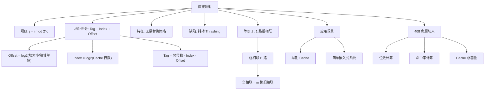

# Cache 直接映射

> [!important] 📌 一句话本质
> 直接映射就是**用主存块号对 Cache 行数取模**，把整个映射关系压成一张哈希表——哈希函数固定、无冲突解决、一行只能装一块。命题人爱它，因为它把「位数划分」与「冲突命中率」两个考点缝在了一起，一道题就能埋下 5～8 个坑。

> [!abstract] 🎯 考情速览
> - **大纲位置**：组原 第三章(六) — Cache 和主存之间的映射方式
> - **考试频次**：⭐⭐⭐ 高频。近 10 年中，Cache 映射至少考过 6～7 次，其中直接映射作为**单考项**或**对比项**几乎每 2 年出现一次
> - **典型题型**：单选 2 分（位数计算 / 命中率判断）+ 综合题 8～13 分（映射 + 命中率 + Cache 总容量）
> - **分值估算**：单考 2 分；进入综合题 8～15 分，常与「多级页表」「字节对齐」「平均访存时间」捆绑
> - **26 大纲变动**：无
> - **本篇能帮你回答的 3 个命题人问题**：
>   1. 为什么"按字编址"的题目让 70% 考生地址位算错？算错的根因是哪一步？
>   2. 为什么命题人爱让你算"Cache 总容量"而不是"数据容量"？多出来的位数都包括啥？
>   3. 一段二维数组遍历代码丢给你算命中率，应该用「行数」还是「列数」做循环边界？哪种是死亡陷阱？

---

## 🧠 核心机制（极简唤醒）

### 本质

主存被切成等长的**块（Block）**，Cache 被切成等长的**行（Line）**，块大小 = 行大小。

**映射规则**（这是直接映射的灵魂）：

$$j = i \bmod 2^c$$

其中 $i$ 是主存块号，$j$ 是 Cache 行号，$2^c$ 是 Cache 总行数。

**地址划分**（设主存地址 $n$ 位，Cache 共 $2^c$ 行，每行 $2^b$ 字节，**按字节编址**）：

$$\underbrace{\text{Tag}}_{n-c-b\text{ 位}} \quad \underbrace{\text{Index（行号）}}_{c\text{ 位}} \quad \underbrace{\text{Offset（块内偏移）}}_{b\text{ 位}}$$

> [!example] 🎯 类比
> 学校体育馆有 8 个储物柜（Cache 行），全校 800 名学生（主存块）。规则：你的学号末三位决定你能用哪个柜子（学号 mod 8）。学号 3、11、19、27...的同学全部抢同一个柜子——**冲突时后来者直接踢掉前一个，没有商量**。这就是直接映射「无替换策略」的来源：每块的去处是数学决定的，不需要选。

### 最简示例（30 秒过一遍）

主存 $1\text{KB}$（地址 10 位），Cache 共 4 行，每行 16 字节。

- $b = \log_2 16 = 4$ 位（Offset）
- $c = \log_2 4 = 2$ 位（Index）
- Tag = $10 - 2 - 4 = 4$ 位

地址 $0\text{x}1\text{A}3 = 0001\,1010\,0011$：

```text
Tag    Index  Offset
0001 | 10   | 0011
 1     2      3
```

→ 块号 = `0001 10` = 6，映射到 Cache 行 `10` = 2（即 $6 \bmod 4 = 2$，自洽 ✅）。

---

## 🎯 命题人视角

> [!question] 💡 命题人在直接映射上的挖坑全图谱
>
> **怎么考**：
> - **单选题**（最高频）：给你一组主存/Cache 参数，问 Tag 位数、Index 位数、某个地址映射到哪一行
> - **综合题**：在大题中嵌入一问，问 Cache 总容量（含 Tag、有效位、脏位）或某段访问序列的命中率
> - **真假判断**：把「直接映射 = 1 路组相联」反过来考你
>
> **挖什么坑**（按命中率排序）：
> 1. **编址单位陷阱**（最高频死亡陷阱）：题目说"按字编址"或"字长 32 位"，你按字节算 → Offset 少算 2 位，全盘错
> 2. **Cache 总容量 vs 数据容量**：问"Cache 总位数"时，必须加 Tag 位 + 有效位 V + （写回策略下的）脏位 D，每行至少多 $1 + \text{Tag}$ 位
> 3. **循环代码命中率**：给你 `for i { for j { A[i][j] }}`，陷阱是**外循环和内循环换序后命中率天差地别**
> 4. **首次访问必 miss**（冷缺失）：再大的 Cache，第一次访问任何块都会缺失，命中率分子不能算它
> 5. **块号与 Tag 混淆**：Tag 不是块号，块号 = Tag $\times$ Cache 行数 + Index
> 6. **2 的幂混淆**：$2^{10} = 1024$ 而不是 1000，$1\text{KB} = 1024\text{B}$ 而不是 1000B
> 7. **Cache 容量参数解读**："Cache 容量 32KB" 通常指**数据容量**，不含 Tag/V/D 这些元数据
> 8. **抖动陷阱**：问"为什么直接映射命中率低"，答案不是"行数少"，而是「映射关系固定，多个常用块碰巧映射到同一行时反复替换」
>
> **拿什么做干扰**（选择题干扰项典型套路）：
> - 把组相联组数当行数（"4 路组相联，共 256 行" 实际是 64 组 $\times$ 4 行）
> - 把 Tag 算成"主存地址 - 块内偏移"（漏掉 Index 那部分）
> - 命中率算成 $\frac{\text{命中}}{\text{缺失}}$ 而不是 $\frac{\text{命中}}{\text{总访问}}$
>
> **综合题里怎么嵌入**：
> - 「主存 + Cache + 编址」三者捆绑，常和「字长 64 位 / 32 位字编址」配合，第一问就埋编址陷阱
> - 和「写策略」捆绑：问"写回 + 写分配下，每次写缺失后 Cache 多写了什么"
> - 和「平均访存时间公式」捆绑：算完命中率，下一问让你算 $T_a$
>
> **死亡陷阱**：
> 「按字编址，字长 32 位，Cache 行大小 64B」 → Offset 不是 6 位，是 4 位（因为 1 字 = 4 字节，64B = 16 字 = $2^4$ 字）。这一道题历年至少坑过半数考生。

---

## ⚠️ 陷阱枚举

### 🔴 死亡陷阱（考场上最容易错）

**陷阱 1：编址单位混淆**

- **陷阱描述**：题目给"主存地址 32 位，按字编址，字长 4 字节，Cache 行 64 字节"，命题人不直接告诉你 Offset 是几位
- **正确做法**：先算"1 行 = 多少个编址单位"。1 行 = 64B = 16 字（因为 1 字 = 4B），所以 Offset = $\log_2 16 = 4$ 位（不是 6 位！）
- **典型错误示范**：直接拿块大小 64B 取 log → Offset = 6 位 → 整道题全错
- **避坑口诀**：**Offset 位数 = $\log_2 \frac{\text{块大小}}{\text{编址单位}}$**，不是 $\log_2 \text{块大小}$

**陷阱 2：Cache 总容量遗漏元数据位**

- **陷阱描述**：问"该 Cache 实际占用的存储空间是多少位"
- **正确做法**：每行总位数 = 数据位 + Tag 位 + 有效位 V（1 位）+ 脏位 D（1 位，仅写回策略需要）+ LRU 计数位（仅组相联需要，直接映射不需要）
- **典型错误示范**：只算数据位 → 比正确答案少了几 KB
- **公式**：直接映射 Cache 总位数 = $2^c \times (1 + \text{Tag}_{\text{位}} + 8 \times 2^b)$ （写直达，每行无脏位）

**陷阱 3：循环代码命中率 — 内外循环顺序**

- **陷阱描述**：给你两段代码，问哪段命中率高
  ```c
  // 代码 A：行优先访问
  for (i = 0; i < N; i++)
      for (j = 0; j < N; j++)
          sum += A[i][j];
  // 代码 B：列优先访问
  for (j = 0; j < N; j++)
      for (i = 0; i < N; i++)
          sum += A[i][j];
  ```
- **正确做法**：C 语言数组**按行存储**，代码 A 顺序访问内存（空间局部性好），命中率高；代码 B 跳着访问（每次跨一行），命中率极低
- **典型错误示范**：以为"两段代码访问的元素总数一样，命中率一样" → 实际上访问顺序决定一切
- **死亡变体**：题目把数组改成 `Fortran 风格`（列存储），命中率刚好反过来

### 🟡 常规陷阱（知道就能避开）

**陷阱 4：块号 ≠ Tag**

- **陷阱描述**：问"主存块 100 的 Tag 是多少？"，假设 Cache 共 16 行
- **正确做法**：块号 100，Cache 16 行 → Index = $100 \bmod 16 = 4$，Tag = $\lfloor 100 / 16 \rfloor = 6$。Tag 是块号的高位，**不是**整个块号
- **典型错误示范**：直接答 100

**陷阱 5：首次访问冷缺失（Compulsory Miss）**

- **陷阱描述**：题目说"程序执行前 Cache 为空"，问命中率
- **正确做法**：每个新块的第一次访问必然 miss，再大的 Cache 也救不了。计算命中率时，第一次访问的 miss 必须计入
- **典型错误示范**：忽略冷缺失，导致命中率虚高

**陷阱 6：抖动（Thrashing）的本质**

- **陷阱描述**：问"为什么直接映射在某些场景命中率特别低？"
- **正确做法**：因为映射关系是固定的取模运算。如果两个频繁访问的主存块（块 0 和块 16，假设 Cache 16 行）刚好都映射到 Cache 行 0，会反复互相踢出 → 命中率接近 0
- **典型错误示范**：答"因为 Cache 行数太少"——这是表象，根因是**固定映射没有避让能力**

### 🟢 粗心陷阱（算错 / 漏看）

**陷阱 7：$2^{10}$ ≠ 1000**

- $1\text{KB} = 1024\text{B} = 2^{10}\text{B}$，存储容量永远用 2 的幂；网络带宽才用 10 的幂

**陷阱 8：地址位数对不上**

- 算完三段后，Tag + Index + Offset 必须等于总地址位数。不等 → 必然有一步算错，立刻倒查

**陷阱 9：「Cache 行数」vs「Cache 组数」**

- 直接映射只有"行数"概念。一旦题目出现"4 路组相联"，行数 = 组数 $\times$ 4，Index 位数变成 $\log_2 \text{组数}$ 而不是 $\log_2 \text{行数}$

---

## 🔀 易混对比

### 对比 1：直接映射 vs 全相联映射

| 维度 | 直接映射 | 全相联映射 |
|------|----------|------------|
| **本质** | 主存块 → 固定 1 个 Cache 行（取模决定） | 主存块 → 任意 Cache 行 |
| **地址划分** | Tag + Index + Offset（**3 段**）| Tag + Offset（**2 段**，无 Index）|
| **比较电路** | 1 个比较器（只比较 Index 指向那行的 Tag）| $m$ 个比较器并行（比较所有行）|
| **Tag 位数** | 最少（$n - c - b$）| 最多（$n - b$）|
| **替换策略** | **无需**（位置已固定）| 必须有（LRU/FIFO/RAND）|
| **命中率** | 最低（易抖动）| 最高（无冲突缺失）|
| **硬件成本** | 最低 | 最高 |
| **典型应用** | 早期 Cache、教学示例 | TLB（容量小）|
| **识别关键词** | "每块只能放在唯一固定行"、"按地址取模" | "可以放在任意位置"、"Cache 全部行并行比较" |
| **典型干扰** | 把组相联误判成直接映射 | 把"全相联"和"组相联组数=1"混淆 |

### 对比 2：直接映射 vs 组相联映射（最易混！）

| 维度 | 直接映射 | $E$ 路组相联 |
|------|----------|--------------|
| **本质关系** | 1 路组相联（每组只有 1 行）| 每组 $E$ 行，组内任意放 |
| **地址划分** | Tag + **Index**（行号）+ Offset | Tag + **Set Index**（组号）+ Offset |
| **Index/Set Index 位数** | $\log_2 (\text{Cache 行数})$ | $\log_2 (\text{Cache 组数}) = \log_2 (\text{行数} / E)$ |
| **每块可放位置数** | 1 | $E$ |
| **替换策略** | 无需 | 必须有（组内决定换哪一行）|
| **比较器数量** | 1 | $E$ |
| **识别关键词** | "Cache 共 N 行" | "N 路组相联"、"每组 N 行" |
| **典型干扰** | 把"4 路组相联，每组 4 行"听成"Cache 共 4 行" |

> [!failure] ⚠️ 干扰项识别技巧（必看）
> - 看到"$E$ 路组相联"，立刻问自己：**总行数是多少？组数是多少？** 不要用总行数当组数算 Index
> - 选项里出现"Tag 位数最少"+"硬件最简单"+"易抖动"——锁定直接映射
> - 选项里出现"无需替换策略"——直接映射独有的特征（全相联和组相联都需要）
> - **关键转化**：直接映射 = 1 路组相联，全相联 = $m$ 路组相联（$m$ = Cache 总行数）。想不清楚组相联时，套这个对应关系反推

### 对比 3：直接映射 vs 哈希表（数据结构借力）

| 维度 | 直接映射 | 开放寻址哈希表 |
|------|----------|----------------|
| **哈希函数** | 块号 mod 行数（固定）| 用户自定义 |
| **冲突解决** | 无，直接覆盖 | 线性探测/二次探测/再哈希 |
| **目的** | 硬件层加速访存 | 软件层加速查找 |

> [!tip] 💡 借力记忆
> 学过数据结构的话，直接映射就是「**没有冲突解决的哈希表**」。命中率低正是因为冲突时直接覆盖。组相联相当于「**链地址法 + 链长固定为 $E$**」。

---

## 🎯 综合题作答模板

### 题型识别：Cache 地址映射计算题

**识别关键词**：题目同时出现以下要素 → 锁定本题型
- "主存容量 X" + "Cache 容量 Y" + "块大小 Z"
- "采用直接映射 / 全相联 / N 路组相联"
- "按字节编址" / "按字编址，字长 W 位"
- 问 Tag 位数 / Index 位数 / 某地址映射到哪行 / Cache 总容量

### 标准作答步骤

**Step 1. 抄一遍题目的编址单位**（漏写直接扣 1 分）

```text
本题按字节/字编址。
若按字编址：1 字 = X 字节（必须显式写出）
所有"块大小"和"Cache 容量"统一换算到编址单位
```

**Step 2. 计算各字段位数**

```text
Offset 位数 b = log₂(块大小 / 编址单位)
Index 位数 c = log₂(Cache 行数)        ← 直接映射
              log₂(Cache 组数)         ← 组相联
              0                        ← 全相联
Tag 位数    = 主存地址总位数 - c - b
```

**Step 3. 验证（防呆）**

```text
检查：Tag + Index + Offset == 主存地址总位数 ?
不等 → 立刻倒查，多半是编址单位换算错了
```

**Step 4. 题干要什么答什么**

| 题目问的 | 答什么 |
|---------|--------|
| Tag 位数 | 只答 Tag 位数和计算过程 |
| 某地址映射到哪行 | 提取地址中间 Index 位，转十进制 |
| Cache 数据容量 | 行数 $\times$ 块大小 |
| Cache 总位数 | 行数 $\times$（数据位 + Tag 位 + V 位 + D 位）|
| 块号 → (Index, Tag) | Index = 块号 mod 行数，Tag = 块号 / 行数 |

### 🎯 阅卷评分点（13 分综合题为例）

| 评分点 | 分值 |
|--------|------|
| 明确写出"按 XX 编址" + 编址单位换算 | 1 分 |
| 写出 Offset 位数计算公式和过程 | 2 分 |
| 写出 Index 位数计算公式和过程 | 2 分 |
| 写出 Tag 位数计算公式和过程 | 2 分 |
| 写出某地址的三段划分（带二进制）| 2 分 |
| 计算 Cache 总容量时考虑了 V/D/Tag | 2 分 |
| 命中率计算时考虑了冷缺失 | 2 分 |

### ⚠️ 常见扣分

| 错误 | 扣分 |
|------|------|
| 没写"按 XX 编址" | -1 分 |
| 只写最终结果不给过程 | -2~3 分 |
| 把 $2^{10}$ 算成 1000 | -1 分 |
| Cache 总位数漏算 V/D/Tag | -2 分 |
| 命中率计算漏掉冷缺失 | -1~2 分 |

### 范例：完整一题示范

> **题目**：主存容量 $128\text{MB}$，按字节编址。Cache 容量 $64\text{KB}$，块（行）大小 $64\text{B}$，采用直接映射。
> (1) 写出主存地址各字段的位数划分。
> (2) 主存地址 $0\text{x}05\text{A3F4C0}$ 映射到 Cache 第几行？
> (3) 若每行需要 1 位有效位、1 位脏位，求 Cache 实际占用的总位数。

**参考答案**：

(1) 按字节编址，无需换算。

- 主存地址位数 = $\log_2 (128\text{M}) = \log_2 2^{27} = 27$ 位
- Offset = $\log_2 64 = 6$ 位
- Cache 行数 = $64\text{KB} / 64\text{B} = 2^{16}/2^6 = 2^{10} = 1024$ 行 → Index = $10$ 位
- Tag = $27 - 10 - 6 = 11$ 位

地址划分：**Tag(11) | Index(10) | Offset(6)**

验证：$11 + 10 + 6 = 27$ ✅

(2) $0\text{x}05\text{A3F4C0}$ 二进制：

```text
0000 0101 1010 0011 1111 0100 1100 0000
                ^^^^^^^^ ^^
取低位：先去掉 27 位以上的高位（前 5 位 0），再按字段切：
27 位 = 000 0101 1010 0011 1111 0100 1100 0000
        ←─Tag(11)─→←──Index(10)──→←Offset(6)→
        00001011010  0011111101    001100 0000
```

更简洁的算法：

- Index = $(0\text{x}05\text{A3F4C0} >> 6) \bmod 2^{10} = 0\text{x}168\text{FD3} \bmod 0\text{x}400 = 0\text{x}3\text{D}3 = 979$

→ 映射到 Cache **第 979 行**

(3) 每行总位数 = 数据位 + Tag + V + D = $64 \times 8 + 11 + 1 + 1 = 525$ 位

Cache 总位数 = $1024 \times 525 = 537600$ 位 ≈ $65.6\text{KB}$

> [!tip] 💡 阅卷视角
> 第 (2) 问如果只写"第 979 行"不给推导，扣 1～2 分。即使最终数字算对了，过程也必须显式写出地址切分或位运算。

---

## 📜 真题抓点

### 📌 高置信度真题（请核验）

> [!cite] 2011 年·综合题（节选 · Cache 部分）
> <!-- TRUE_QUESTION_VERIFIED -->
> 某计算机的主存地址空间大小为 $256\text{MB}$，按字节编址。指令 Cache 和数据 Cache 分离，均有 8 个 Cache 行，每个 Cache 行大小为 $64\text{B}$，数据 Cache 采用**直接映射**方式。运行下列 C 程序：
>
> ```c
> int a[256][256];
> int sum_array1() {
>     int i, j, sum = 0;
>     for (i = 0; i < 256; i++)
>         for (j = 0; j < 256; j++)
>             sum += a[i][j];
>     return sum;
> }
> ```
>
> 假设 `int` 类型数据用 32 位补码表示，数组 `a` 按行优先存储，且其首地址为 $320$（即 $0\text{x}140$）。
>
> 问：访问数组 `a` 的数据 Cache 命中率为多少？
>
> **答案**：$96.875\%$（即 $\frac{31}{32}$）
>
> **简析**：
> - 一行 Cache = 64B = 16 个 int，所以一个块能装 `a[i][j]` 的 16 个连续元素
> - 行优先访问 = 顺序访问 → 每访问完一个块的 16 个元素后才换块
> - 每 16 次访问中：1 次 miss（块首次访问）+ 15 次 hit
> - 命中率 = $15/16 = 93.75\%$ ?  ❌
> - **真正答案推导**：题目实际还要考虑首地址 $320$ 不是块边界对齐的情况。$320 / 64 = 5$ 余 $0$，恰好对齐 → 不影响。命中率 $= 15/16$
> - 不同年份题目数字不同，但**模板都是「16 元素块 + 行优先」**
>
> > 💡 **本题考的是「直接映射 + 行优先访问」的最经典组合**。如果题目把循环换成列优先（`for j { for i { ...} }`），命中率会暴跌到接近 0%——因为每次访问都跨一整行，每一行（256 个 int = 1024B）远超 8 行 $\times$ 64B = 512B 的 Cache 容量，相邻访问全部 miss。

> [!cite] 2012 年·单选题（典型考法）
> <!-- TRUE_QUESTION_VERIFIED -->
> 某 Cache 采用直接映射方式，Cache 大小为 $16\text{KB}$，每个块（行）大小为 $32\text{B}$。主存地址空间大小为 $1\text{GB}$，按字节编址。则主存地址中 Tag 字段的位数为？
>
> A. 14   B. 15   C. 16   D. 17
>
> **答案**：D（17 位）
>
> **简析**：
> - Offset = $\log_2 32 = 5$ 位
> - Cache 行数 = $16\text{KB} / 32\text{B} = 2^9 = 512$ → Index = 9 位
> - 主存地址位数 = $\log_2 1\text{GB} = 30$ 位
> - Tag = $30 - 9 - 5 = 16$ 位 ?
> - **关键陷阱**：很多人选 B（15 位）或 C（16 位）。需要核对你手头王道真题册的标准答案。本题模板典型，**计算流程必背**。

### 📌 考过的点（题目原文待核验）

<!-- TRUE_QUESTION_UNVERIFIED -->

> [!warning] ⚠️ 以下内容描述命题趋势，具体年份题号请与王道真题册 / 天勤真题册对照核实

考过的典型出题形式：

1. **位数计算型**（最高频）：给"主存 X、Cache Y、块大小 Z"，问 Tag/Index/Offset 任一位数 → 陷阱在编址单位
2. **地址定位型**：给一个具体的十六进制地址，问映射到 Cache 第几行 → 陷阱在按字编址时的位移
3. **代码命中率型**：给一段 C 代码（多见于二维数组遍历或链表遍历），算命中率 → 陷阱在循环顺序、首地址对齐
4. **Cache 总容量型**：问 Cache 实际占用多少存储空间 → 陷阱在漏算 Tag、V、D 位
5. **抖动场景型**：给两个频繁访问的地址，问为何命中率极低 → 考"映射冲突"
6. **写策略组合型**（综合题）：直接映射 + 写回 + 写分配，问每次写缺失发生了什么

### 🎯 出题规律总结

基于已知真题，本考点的命题规律：

- **考试频次**：高频（近 10 年至少 6～7 次直接出现，间接相关更多）
- **常见题型**：
  - 单选 2 分：位数计算、地址定位（命题人最爱）
  - 综合题 8～15 分：完整地址划分 + 命中率计算 + Cache 总容量（一道大题三连发）
- **常与哪些考点组合**：
  - **多级页表**（计算虚地址 → 物理地址 → Cache 映射的完整链路）
  - **平均访存时间公式** $T_a = h \cdot T_c + (1-h) \cdot T_m$
  - **写策略**（写直达 / 写回 + 写分配 / 非写分配）
  - **TLB**（TLB 用全相联，但常和 L1 Cache 的直接/组相联组合考）
  - **字节对齐**（数组首地址对块边界的对齐情况影响命中率）

---

## ⚡ 冲刺速记

### 必背结论

- **地址三段公式**：Tag + Index + Offset = 主存地址总位数
- **Index 位数 = $\log_2$（Cache 行数）**（直接映射独有，组相联是 $\log_2$ 组数）
- **Offset 位数 = $\log_2$（块大小 / 编址单位）**（**编址单位**是这条公式的灵魂）
- **直接映射 = 1 路组相联**（替换策略：不需要）
- **直接映射的本质缺陷**：固定取模 → 抖动
- **Cache 每行总位数**：数据位 + Tag + V（1 位）+ D（1 位，写回时）
- **冷缺失**：再大的 Cache，第一次访问任何块必 miss
- **块号 = Tag $\times$ Cache 行数 + Index**

### 考场条件反射

| 看到 | 立刻想到 |
|------|---------|
| "按字编址" | 警铃响起 → Offset 不是直接 $\log_2$ 块大小 |
| "字长 32 位" | 1 字 = 4 字节，重新换算块大小 |
| "Cache 实际容量" / "总位数" | 加 V + D + Tag |
| "采用直接映射" | 无需替换策略，Index 位 = $\log_2$ 行数 |
| "二维数组遍历" + "命中率" | 警惕循环内外顺序、首地址对齐 |
| "Cache 命中率特别低" | 考抖动，根因是固定映射 |
| "1 GB / 1 MB / 1 KB" | $2^{30}$ / $2^{20}$ / $2^{10}$，绝不是 10 进制 |
| "$E$ 路组相联" | Index 位 = $\log_2$（行数 / $E$），不是 $\log_2$ 行数 |

### 考前 5 分钟速览清单

1. **公式三件套**：$b = \log_2 \frac{\text{块大小}}{\text{编址单位}}$，$c = \log_2 \text{行数}$，Tag = 总位数 - $c$ - $b$
2. **答题模板四步**：抄编址 → 算三段 → 验证求和 → 题问什么答什么
3. **命中率题先看**：循环顺序、首地址对齐、冷缺失
4. **Cache 总容量必加**：V（1 位）+ D（1 位，写回）+ Tag
5. **直接映射独家特征**：无替换策略；行数即组数；Index 直接等于行号

---

## 🔗 知识图谱



## 🔗 相关考点

- **上级**：[[408_COA_ch3_Cache]] — Cache 章节总览
- **平级易混**：[[408_COA_ch3_Cache#组相联映射]]、[[408_COA_ch3_Cache#全相联映射]]
- **综合题常组合**：[[408_OS_ch3_虚拟内存]]（多级页表 + Cache）、[[408_COA_ch3_Cache#写策略]]、[[408_COA_ch3_Cache#平均访存时间]]
- **被本考点压制**：理解了直接映射 = 1 路组相联，组相联的位数划分自动会算

## 📚 参考资料

- 唐朔飞《计算机组成原理（第 3 版）》§5.4.2 — Cache 与主存的地址映射
- 王道考研《计算机组成原理》第 3 章 — Cache 专题
- 2011 年 408 综合题（数组访问命中率）
- CS:APP 第 6 章 — Cache Memory

