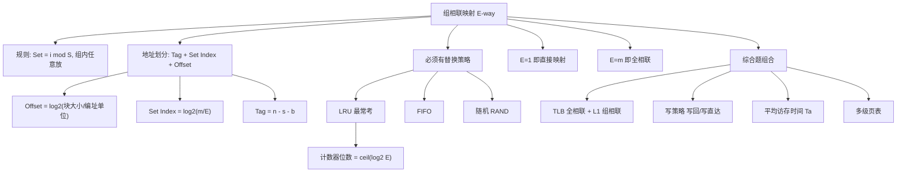

# Cache 组相联映射

> [!important] 📌 一句话本质
> 组相联 = **组间直接映射 + 组内全相联**。先用块号取模锁定组，再在组内任意位置放置。它是直接映射和全相联的精确折中，也是**现代 CPU L1/L2/L3 Cache 的唯一实际采用方案**。命题人在此考点上既能考位数划分（计算题），又能考 LRU 替换序列（模拟题），还能和 TLB / 写策略 / 命中率组合成综合大题，是 408 组原中出题密度最高的单一知识点。

> [!abstract] 🎯 考情速览
> - **大纲位置**：组原 第三章(六) — Cache 和主存之间的映射方式
> - **考试频次**：⭐⭐⭐ 高频。近 10 年中组相联至少出现 8 次以上（含单选 + 综合题子问）
> - **典型题型**：单选 2 分（位数计算 / 映射判断 / 替换策略）+ 综合题 8～15 分（地址划分 + LRU 模拟 + 命中率 + Cache 总容量）
> - **分值估算**：综合题中占 10～15 分时，组相联相关部分通常占 6～10 分
> - **26 大纲变动**：无
> - **本篇能帮你回答的 3 个命题人问题**：
>   1. "4 路组相联"的 **4 到底是组数还是每组行数**？为什么 70% 考生第一次做这种题会搞反？
>   2. LRU 替换在组内怎么用计数器实现？$E$ 路需要多少位 LRU 计数？
>   3. 组相联的 Set Index 位数和直接映射的 Index 位数相差几位？差值的 $\log_2$ 恰好等于什么？


---


## 🧠 核心机制（极简唤醒）

### 本质

Cache 共 $m$ 行，被分成 $S = 2^s$ 个**组（Set）**，每组 $E$ 行（$E$ **路，E-way**）。

$$S = \frac{m}{E} \qquad s = \log_2 S$$

主存块 $i$ 映射到的组号：

$$\text{Set} = i \bmod S$$

在该组的 $E$ 行中**任意选一行**存放（如果组内有空行直接放；满了按替换策略选一行换出）。

### 地址划分（按字节编址）

设主存地址 $n$ 位，块大小 $2^b$ 字节：

$$\underbrace{\text{Tag}}_{n - s - b\text{ 位}} \quad \underbrace{\text{Set Index（组号）}}_{s\text{ 位}} \quad \underbrace{\text{Offset（块内偏移）}}_{b\text{ 位}}$$

### 访问过程（三步走）

```text
CPU 发出地址 → 取中间 s 位 → 定位到第 j 组
  → 在第 j 组的 E 行中并行比较 Tag
     ├── 某行 Tag 匹配且 V=1 → 命中，用 Offset 取字节
     └── 全部不匹配 → 缺失，从主存调块入组（按替换策略）
```

### 两个极端情况（必须条件反射记住）

| 特殊情况 | 等价于 |
|---------|--------|
| $E = 1$（每组 1 行）| **直接映射**（组数 = 行数，Set Index = 行号）|
| $E = m$（只有 1 组）| **全相联**（组数 = 1，Set Index = 0 位）|

> [!example] 🎯 类比
> 把图书馆的书架想象成 Cache。每个书架有 4 层（4 路），整个图书馆有 128 个书架（128 组）。你的书按 ISBN 末 7 位决定放哪个书架（$s = 7$），但放在这个书架的哪一层随便——空的直接放，满了把最久没翻过的一本换出去（LRU）。

### 最简示例

主存地址 32 位，Cache 容量 $32\text{KB}$，块大小 $64\text{B}$，采用 **4 路组相联**。

- Offset $b = \log_2 64 = 6$ 位
- Cache 总行数 = $32\text{KB} / 64\text{B} = 512$
- 组数 $S = 512 / 4 = 128 = 2^7$ → Set Index $s = 7$ 位
- Tag = $32 - 7 - 6 = 19$ 位

地址划分：**Tag(19) | Set Index(7) | Offset(6)**

验证：$19 + 7 + 6 = 32$ ✅


---


## 🎯 命题人视角

> [!question] 💡 命题人在组相联映射上的挖坑全图谱
>
> ### 1. 怎么考
>
> - **单选题**（最常见）：给参数算 Tag/Set Index/Offset 位数；给一段访问序列问命中次数
> - **综合题子问**：整道大题考 Cache，其中一到两个子问涉及组相联的位数划分、命中率、LRU 替换过程
> - **判断/辨析**：「组相联与直接映射在地址划分上有何区别」→ Set Index 位数不同
>
> ### 2. 挖什么坑（按致命程度排序）
>
> 1. **"路"和"组"搞反**（🔴 死亡级）：「4 路组相联」的"4"是每组行数，不是组数。组数 = 总行数 / 路数
> 2. **Set Index 位数用了行数而不是组数**（🔴 死亡级）：$s = \log_2 S = \log_2 (m/E)$，不是 $\log_2 m$
> 3. **编址单位陷阱**（🔴 死亡级，和直接映射同款）：按字编址时 Offset 位数要除以字长
> 4. **替换策略漏分析**（🟡 常规级）：直接映射不需要替换策略，但组相联必须指定 LRU/FIFO/RAND
> 5. **LRU 计数器位数算错**（🟡 常规级）：$E$ 路组相联的 LRU 需要 $\lceil \log_2 E \rceil$ 位计数器，不是 $\log_2 m$ 位
> 6. **Cache 总容量遗漏 LRU 位**（🟡 常规级）：每行总位数 = 数据 + Tag + V + D + LRU 计数器
> 7. **Tag 位数和直接映射搞混**（🟢 粗心级）：组相联 Tag 位 = $n - s - b$，直接映射 Tag 位 = $n - c - b$；$s < c$（因为 $S < m$），所以**组相联的 Tag 位比直接映射多**
> 8. **比较器数量搞错**（🟢 粗心级）：$E$ 路组相联需要 $E$ 个比较器并行比较，不是 $S$ 个也不是 $m$ 个
>
> ### 3. 拿什么做干扰
>
> - 选项 A：Tag 用直接映射的算法算（少了几位）
> - 选项 B：Set Index 用总行数算（多了几位）
> - 选项 C：正确答案
> - 选项 D：把"路"当"组"代入（全盘错）
>
> ### 4. 综合题里怎么嵌入
>
> - **Cache + TLB**：TLB 用全相联，L1 Cache 用组相联，两级映射串联考
> - **Cache + 多级页表**：虚拟地址 → 页号查页表 → 物理地址 → 组相联 Cache 查找
> - **Cache + 写策略**：写回 + 写分配 + 组相联 LRU 替换综合场景
> - **Cache + 平均访存时间**：先算命中率（要模拟 LRU 替换过程），再代公式算 $T_a$
>
> ### 5. 死亡陷阱
>
> 综合题给出"$E$ 路组相联，Cache 总行数 $m$，块大小 $2^b$"，然后问 Tag 位数。
> 60% 以上考生的错误链条是：**直接用 $\log_2 m$ 当 Set Index → Tag 少算了 $\log_2 E$ 位 → 整道题后续全错**。
> 
> **避坑铁律**：看到「$E$ 路组相联」，**第一件事就是算组数 $S = m / E$**。这一步做对，后面不会错。


---


## ⚠️ 陷阱枚举

### 🔴 死亡陷阱（考场上最容易错）

**陷阱 1：「路数」与「组数」搞反**

- **陷阱描述**：「4 路组相联，Cache 共 256 行」。命题人期望你算出组数 = $256/4 = 64$，但很多人把 4 当成组数
- **正确做法**：**路数 $E$ = 每组的行数**。$E$ 路组相联 → 每组 $E$ 行 → 组数 $S = m / E$
- **典型错误示范**：组数 = 4，每组 64 行 → Set Index = 2 位（实际应该是 6 位）→ Tag 算错 4 位
- **记忆法**：**"路 = 行 / 组"**，E-**way** 的 way 是「每组内有几条路可走」，不是「有几组」

**陷阱 2：Set Index 位数用总行数而非组数**

- **陷阱描述**：Cache 共 $2^{10} = 1024$ 行，4 路组相联 → 组数 = $256 = 2^8$
- **正确做法**：$s = \log_2 256 = 8$ 位
- **典型错误示范**：$s = \log_2 1024 = 10$ 位（这是直接映射的算法，不是组相联的）
- **验证技巧**：直接映射的 Index 位数应该**大于**同规模组相联的 Set Index 位数，差值 = $\log_2 E$。验算时如果组相联的 $s$ 和直接映射一样大，说明你算错了

**陷阱 3：按字编址时 Offset 换算错**

- 和直接映射完全相同的陷阱，参见 [[cache_direct_mapping#🔴 死亡陷阱（考场上最容易错）]]
- **公式**：$b = \log_2 \frac{\text{块大小（字节）}}{\text{编址单位（字节/字）}}$

### 🟡 常规陷阱（知道就能避开）

**陷阱 4：替换策略只在组相联/全相联下才需要**

- **陷阱描述**：问「采用直接映射时，LRU 替换策略如何工作？」
- **正确做法**：直接映射**不需要**替换策略（每块位置唯一固定）。只有组相联和全相联才需要在组内（或所有行）选择替换哪一行
- **典型错误示范**：开始分析 LRU 在直接映射下的流程 → 浪费时间且答偏

**陷阱 5：LRU 计数器位数**

- **正确公式**：$E$ 路组相联 → 每行 LRU 计数器需 $\lceil \log_2 E \rceil$ 位
  - 2 路 → 1 位（用 0/1 表示谁最近被访问）
  - 4 路 → 2 位
  - 8 路 → 3 位
  - 16 路 → 4 位
- **典型错误示范**：用总行数 $m$ 取 log → 位数远大于实际需要
- **原因**：LRU 只在**组内**排序，组内只有 $E$ 行需要排序

**陷阱 6：Cache 总容量忘加 LRU 计数位**

- 直接映射每行：V(1) + D(1) + Tag + 数据
- 组相联每行：V(1) + D(1) + Tag + LRU($\lceil \log_2 E \rceil$) + 数据
- **差距来源**：多了 LRU 计数位。题目问"Cache 实际存储空间"时必须算入

**陷阱 7：Tag 位数比较**

- 同一配置下：**全相联 Tag 最多，直接映射 Tag 最少，组相联居中**
- 原因：$\text{Tag} = n - s - b$，$s$ 越小 → Tag 越大。全相联 $s=0$，直接映射 $s = \log_2 m$，组相联 $s = \log_2(m/E)$
- **反直觉点**：Tag 位数多 = 硬件开销更大（每行需要存更长的 Tag），但命中率更高

### 🟢 粗心陷阱（算错 / 漏看）

**陷阱 8：比较器数量**

- $E$ 路组相联需要 $E$ 个比较器（组内并行比较 $E$ 个 Tag）
- 不是 $S$ 个（组数），也不是 $m$ 个（总行数）

**陷阱 9：$m / E$ 不是整数**

- 极少数题目故意给非整除的参数（例如 Cache 30 行，3 路组相联 → 10 组）。正常不出现，但一旦出现就是在考你是否真的会算


---


## 🔀 易混对比

### 对比 1：组相联 vs 直接映射（核心消歧 · 必考）

| 维度 | 直接映射 | $E$ 路组相联 |
|------|----------|--------------|
| **本质** | 1 路组相联 | 每组 $E$ 行 |
| **地址中间字段** | Index = $\log_2 m$（行号）| Set Index = $\log_2 (m/E)$（组号）|
| **Tag 位数** | $n - \log_2 m - b$（最少）| $n - \log_2(m/E) - b$（多 $\log_2 E$ 位）|
| **每块可放位置** | 1 个 | $E$ 个 |
| **替换策略** | 不需要 | 必须有（LRU/FIFO/RAND）|
| **比较器** | 1 个 | $E$ 个 |
| **抖动可能性** | 高 | 低（$E$ 越大越不容易抖动）|
| **硬件成本** | 最低 | 多 $E-1$ 个比较器 + LRU 计数器 |
| **考题识别关键词** | "每块固定行"、"无替换策略" | "$E$ 路"、"组内任意"、"LRU" |

> [!failure] ⚠️ 干扰项识别技巧
> 看到 Tag 位数的选项时，**较大的那个通常是组相联的答案**，较小的通常是直接映射的答案。命题人常把两者互换作为干扰选项。
> 
> **快速判定法**：组相联 Tag 比直接映射 Tag 正好多 $\log_2 E$ 位（因为 Set Index 比 Index 少了 $\log_2 E$ 位）。

### 对比 2：组相联 vs 全相联

| 维度 | $E$ 路组相联 | 全相联 |
|------|-------------|--------|
| **本质** | $m$ 路组相联的"弱化版" | $m$ 路组相联（只有 1 组）|
| **Set Index 位数** | $\log_2(m/E)$ | $0$（无此字段）|
| **比较器** | $E$ 个（远少于 $m$）| $m$ 个（所有行并行比较）|
| **硬件可行性** | ✅ 实际 CPU 普遍采用 | ❌ 大容量 Cache 不可行 |
| **命中率** | 接近全相联（$E \geq 4$ 时差距极小）| 理论最高 |
| **典型应用** | L1/L2/L3 Cache | TLB（只有 16～256 条目）|
| **考题识别关键词** | "$E$ 路组相联" | "任意位置"、"全部行并行比较" |

> [!tip] 💡 工业甜点
> 实际 CPU 中 L1 Cache 通常采用 **4～8 路组相联**。路数再增大，命中率提升微乎其微，但比较器成本线性增长，得不偿失。这就是为什么 32 路、64 路组相联在实际中几乎不存在。

### 对比 3：三种映射的位数速查（考试抄到草稿纸上）

设主存地址 $n$ 位，Cache 总行数 $m$，块大小 $2^b$ 字节，$E$ 路组相联，$S = m/E$ 组：

| 字段 | 直接映射 | $E$ 路组相联 | 全相联 |
|------|----------|--------------|--------|
| **Offset** | $b$ | $b$ | $b$ |
| **Index / Set Index** | $\log_2 m$ | $\log_2 S = \log_2(m/E)$ | $0$ |
| **Tag** | $n - \log_2 m - b$ | $n - \log_2 S - b$ | $n - b$ |
| **比较器数** | $1$ | $E$ | $m$ |
| **替换策略** | 无 | 有（LRU 等）| 有（LRU 等）|

> [!warning] ⚠️ 记住关系
> Tag$_\text{全相联}$ > Tag$_\text{组相联}$ > Tag$_\text{直接映射}$
>
> Index$_\text{直接映射}$ > Set Index$_\text{组相联}$ > 0$_\text{全相联}$
>
> **总地址位数不变**，Tag 增大则 Index 减小，两者此消彼长。


---


## 🎯 综合题作答模板

### 题型识别：组相联 Cache 地址划分 + 命中率 + 总容量

**识别关键词**：题目出现 "$E$ 路组相联" + "Cache 容量 / 行数" + "主存地址 $n$ 位" + "块大小"

### 标准作答步骤

**Step 1. 读题提取 6 个数并显式写出**

```text
主存地址 n 位 = ?
按 XX 编址（1 字 = ? 字节）
Cache 数据容量 = ?
块大小 = ?
路数 E = ?
写策略 = ?（写回有脏位 D，写直达无）
```

> **必须先写编址单位**。漏写扣 1 分，算错扣全题。

**Step 2. 算组数和各字段位数**

```text
Offset b = log₂(块大小 / 编址单位)
Cache 总行数 m = Cache 数据容量 / 块大小
组数 S = m / E
Set Index s = log₂(S)
Tag = n − s − b
```

**Step 3. 验证**

```text
Tag + Set Index + Offset == n ?
不等 → 倒查编址单位或路数是否代入错误
```

**Step 4. 若题目问 Cache 总容量**

```text
每行总位数 = 数据位(8×2^b) + Tag + V(1) + D(0或1) + LRU(⌈log₂E⌉)
Cache 总位数 = m × 每行总位数
```

**Step 5. 若题目给访问序列问命中率（含 LRU 模拟）**

```text
① 为每一组画一个 E 格的"小表格"
② 逐个地址：算出 Set Index → 定位到哪个组 → 查组内 E 行的 Tag
   ├── 匹配 → Hit，更新 LRU 计数
   └── 不匹配 → Miss
        ├── 组内有空行 → 直接装入
        └── 组内已满 → LRU 换出最久未访问的行，装入新块
③ 统计 Hit / Miss 次数，命中率 = Hit / 总访问次数
```

### 🎯 阅卷评分点（综合题 13 分为例）

| 评分点 | 分值 |
|--------|------|
| 写出编址单位 + 编址换算 | 1 分 |
| 正确算出组数 $S = m / E$ | 2 分 |
| 写出 $b$、$s$、Tag 各自的计算过程 | 3 分 |
| 写出地址三段划分（带具体值） | 2 分 |
| Cache 每行总位数含 V/D/Tag/LRU | 2 分 |
| LRU 替换过程模拟（每步画表）| 2 分 |
| 命中率计算结果正确 | 1 分 |

### ⚠️ 常见扣分

| 错误 | 扣分 |
|------|------|
| 组数算成路数（$S$ 和 $E$ 搞反）| -3～5 分（全盘错）|
| Set Index 用 $\log_2 m$ 代替 $\log_2 S$ | -2～3 分 |
| 没写编址单位 | -1 分 |
| Cache 总位数漏算 LRU 计数位 | -1～2 分 |
| LRU 模拟过程中忘记更新计数器 | -1 分 |
| 只写答案不给中间过程 | -2～3 分 |

### 范例：完整一题示范

> **题目**：某计算机主存地址 32 位，按字节编址。Cache 容量 $64\text{KB}$，块大小 $128\text{B}$，采用 **8 路组相联**，写回策略。
> (1) 求地址中 Tag、Set Index、Offset 各多少位？
> (2) 若每行设 1 位有效位、1 位脏位，且使用 LRU 替换，Cache 的实际总位数为多少？

**参考答案**：

(1) 按字节编址，无需换算。

- Offset $b = \log_2 128 = 7$ 位
- 总行数 $m = 64\text{KB} / 128\text{B} = 2^{16}/2^7 = 2^9 = 512$
- 组数 $S = 512 / 8 = 64 = 2^6$ → Set Index $s = 6$ 位
- Tag = $32 - 6 - 7 = 19$ 位

验证：$19 + 6 + 7 = 32$ ✅

地址划分：**Tag(19) | Set Index(6) | Offset(7)**

(2) LRU 计数器位数 = $\lceil \log_2 8 \rceil = 3$ 位

每行总位数 = 数据 + Tag + V + D + LRU = $128 \times 8 + 19 + 1 + 1 + 3 = 1048$ 位

Cache 总位数 = $512 \times 1048 = 536576$ 位 $= 65.5\text{KB}$（比纯数据 $64\text{KB}$ 多约 $1.5\text{KB}$ 的元数据开销）


---


## 📖 LRU 替换策略深入（组相联的灵魂配件）

### 为什么直接映射不需要替换策略而组相联需要？

直接映射：每个主存块的位置是数学确定的（$j = i \bmod m$），来了新块就踢掉旧块，没有"选谁踢"的问题。

组相联：一个块到了目标组后，组内有 $E$ 个位置可以放。组满时必须从 $E$ 行中选一行踢出 → **需要替换策略**。

### LRU 在组相联中的工作方式

以 **4 路组相联** 为例，每组 4 行。每行有一个 **2 位 LRU 计数器**（$\lceil \log_2 4 \rceil = 2$ 位），表示"最近访问排名"：

- 计数器值 $0$：最近刚访问过（最新）
- 计数器值 $3$：最久没被访问（最老 → 替换候选）

**命中时**：将命中行的计数器设为 $0$，其他比它原来小的行计数器 +1

**缺失且组满时**：替换计数器值为 $3$（最大值）的那一行

### LRU 模拟示例

4 路组相联，某组初始为空。访问的主存块号依次映射到该组：$A, B, C, D, A, E, B$

| 步骤 | 访问 | 行0 | 行1 | 行2 | 行3 | 结果 |
|------|------|-----|-----|-----|-----|------|
| 1 | $A$ | $A^0$ | — | — | — | Miss（冷缺失）|
| 2 | $B$ | $A^1$ | $B^0$ | — | — | Miss |
| 3 | $C$ | $A^2$ | $B^1$ | $C^0$ | — | Miss |
| 4 | $D$ | $A^3$ | $B^2$ | $C^1$ | $D^0$ | Miss（组满）|
| 5 | $A$ | $A^0$ | $B^3$ | $C^2$ | $D^1$ | **Hit**（$A$ 在行0，计数器归 0）|
| 6 | $E$ | $A^1$ | ~~$B$~~→$E^0$ | $C^3$ | $D^2$ | Miss（$B$ 计数器最大=3，被替换）|
| 7 | $B$ | $A^2$ | $E^1$ | ~~$C$~~→$B^0$ | $D^3$ | Miss（$C$ 计数器最大=3，被替换）|

上标 = LRU 计数器值。命中率 = $1/7 \approx 14.3\%$

> [!question] 🎯 命题人在 LRU 模拟上的挖坑方式
> 1. **计数器更新遗漏**：命中时只把命中行归 0，忘记把其他行的计数器 +1 → 后续替换选错
> 2. **FIFO 和 LRU 混淆**：FIFO 看"谁最早装入"，LRU 看"谁最久未被访问"。命中后 LRU 会重新排序，FIFO 不会
> 3. **空行优先**：组内有空行时直接装入，**不触发替换**。有些学生组没满也在做 LRU 替换

### LRU 计数器位数速查

| 路数 $E$ | LRU 位数 $\lceil \log_2 E \rceil$ |
|----------|-----------------------------------|
| 2 路 | 1 位 |
| 4 路 | 2 位 |
| 8 路 | 3 位 |
| 16 路 | 4 位 |

### LRU vs FIFO 在组内的本质区别

| 维度 | LRU | FIFO |
|------|-----|------|
| **排序依据** | 最近一次**访问**时间 | **装入** Cache 的时间 |
| **命中时是否重排** | ✅ 命中行重新回到"最新" | ❌ 命中不改变任何顺序 |
| **Belady 异常** | ❌ 不会发生 | ✅ 可能发生（Cache 增大反而命中率降低）|
| **考场识别法** | 找"最久没被**访问**的行" | 找"最早**装入**的行" |


---


## 📜 真题抓点

### 📌 高置信度真题（请核验）

> [!cite] 2015 年 · 综合题（节选 · Cache 组相联部分）
> <!-- TRUE_QUESTION_VERIFIED -->
> 某计算机采用 32 位地址，按字节编址。L1 数据 Cache 容量为 $32\text{KB}$，采用 **8 路组相联**映射，块大小为 $64\text{B}$。
>
> (1) Cache 有多少组？
> (2) 地址中 Tag、Set Index、Offset 各多少位？
> (3) 若每行有 1 位有效位和 1 位脏位，Cache 的实际总位数为多少？
>
> **答案**：
>
> (1) 总行数 = $32\text{KB} / 64\text{B} = 512$，组数 = $512 / 8 = 64$
>
> (2) Offset = $\log_2 64 = 6$，Set Index = $\log_2 64 = 6$，Tag = $32 - 6 - 6 = 20$
>
> (3) 每行 LRU = $\lceil \log_2 8 \rceil = 3$ 位
> 每行总位数 = $64 \times 8 + 20 + 1 + 1 + 3 = 537$ 位
> Cache 总位数 = $512 \times 537 = 274944$ 位
>
> **简析**：
> 本题是组相联位数划分的标准模板。死亡陷阱在 (1)：如果把 8 当成组数 → 每组 64 行 → 全盘错。第二个陷阱在 (3)：遗漏 LRU 3 位会导致答案少 $512 \times 3 = 1536$ 位。

### 📌 考过的点（题目原文待核验）

<!-- TRUE_QUESTION_UNVERIFIED -->

> [!warning] ⚠️ 以下内容描述命题趋势，具体年份题号请与王道真题册 / 天勤真题册对照核实

考过的典型出题形式：

1. **位数计算型**（最高频）：给主存容量、Cache 容量、块大小、路数 → 问 Tag / Set Index / Offset 位数 → 陷阱在"路 vs 组"和"编址单位"
2. **LRU 模拟型**：给一段访问序列（通常 8～12 次），4 路组相联 → 画出每步组内状态 → 统计命中次数 → 陷阱在计数器更新和 FIFO/LRU 混淆
3. **Cache 总容量型**：问"每行需要多少位"或"Cache 实际占用空间" → 陷阱在漏算 LRU 位
4. **混合映射判断型**：给一个 Cache 配置，问"这等价于哪种映射方式" → 考"$E=1$ → 直接映射"、"$E=m$ → 全相联"
5. **Cache + TLB 联合型**（综合大题）：TLB 查页号 → 得到物理地址 → 再用组相联查 Cache → 陷阱在两级映射的 Tag 计算基于不同的地址
6. **命中率 + 平均访存时间型**：LRU 模拟完后算命中率，再代入 $T_a = h \cdot T_c + (1-h) \cdot T_m$ → 陷阱在冷缺失遗漏

### 🎯 出题规律总结

- **考试频次**：高频（单独或组合几乎每年出现）
- **常见题型**：
  - 单选 2 分：位数计算、映射等价判断
  - 综合题 8～15 分：位数 + LRU 模拟 + 总容量 + 命中率/平均访存时间
- **常与哪些考点组合**：
  - **写策略**（写回/写直达 → 脏位是否计入每行总位数）
  - **替换策略**（LRU/FIFO → 模拟替换过程）
  - **TLB**（全相联 TLB + 组相联 L1 Cache 串联）
  - **多级页表**（虚地址 → 物理地址 → Cache）
  - **平均访存时间公式**


---


## ⚡ 冲刺速记

### 必背结论

- **组数公式**：$S = m / E$（总行数 / 路数）
- **Set Index 位数**：$s = \log_2 S = \log_2(m/E)$（**不是** $\log_2 m$！）
- **Tag 位数**：$n - s - b$（组相联 Tag 比直接映射多 $\log_2 E$ 位）
- **每行总位数**：数据 + Tag + V(1) + D(0 或 1) + LRU($\lceil \log_2 E \rceil$)
- **比较器数量** = 路数 $E$（不是组数 $S$，不是总行数 $m$）
- **直接映射 = 1 路组相联，全相联 = $m$ 路组相联**
- **LRU 只在组内排序**，$E$ 行排序需要 $\lceil \log_2 E \rceil$ 位
- **$E \geq 4$ 时命中率已接近全相联**，继续增大路数收益递减

### 考场条件反射

| 看到 | 立刻想到 |
|------|---------|
| "$E$ 路组相联" | **第一步算组数 $S = m/E$**，不要碰 $\log_2 m$ |
| "Cache 总行数 $m$" + "$E$ 路" | Set Index = $\log_2(m/E)$，不是 $\log_2 m$ |
| "每行实际位数" / "Cache 总容量" | Tag + V + D + LRU + 数据 → **LRU 位别忘** |
| "LRU 替换" | 组内排序，不是全局排序；计数器位数 = $\lceil \log_2 E \rceil$ |
| "按字编址" | Offset 要除以字长 |
| "直接映射不需要替换策略" | 因为 $E=1$，每块位置唯一 |
| Tag 选项有两个相近值 | 大的是组相联，小的是直接映射（差 $\log_2 E$ 位）|
| "全相联 Cache 有 16 项" | 多半在考 TLB（TLB 就是一个小型全相联 Cache）|

### 考前 5 分钟速览清单

1. **核心公式**：$S = m/E$，$s = \log_2 S$，Tag = $n - s - b$
2. **路 = 每组行数**，不是组数。看到"$E$ 路"第一件事算 $S$
3. **每行总位数** = 数据 + Tag + V + D + LRU($\lceil \log_2 E \rceil$)
4. **LRU 模拟时**：命中 → 命中行计数器归 0，其余较小者 +1；缺失且满 → 替换计数器最大的行；缺失未满 → 直接装入空行
5. **两个极端**：$E=1$ → 直接映射，$E=m$ → 全相联
6. **LRU vs FIFO 关键区别**：LRU 命中会重排，FIFO 命中不重排


---


## 🔗 知识图谱




## 🔗 相关考点

- **上级**：[[408_COA_ch3_Cache]] — Cache 章节总览
- **平级易混**：[[cache_direct_mapping]]、[[408_COA_ch3_Cache#全相联映射]]
- **综合题常组合**：[[408_OS_ch3_虚拟内存]]（TLB + Cache）、[[408_COA_ch3_Cache#写策略]]、[[408_COA_ch3_Cache#替换策略]]
- **被本考点压制**：掌握了组相联，直接映射和全相联都是它的特例，自动理解


## 📚 参考资料

- 唐朔飞《计算机组成原理（第 3 版）》§5.4.2 — Cache 与主存的地址映射
- 王道考研《计算机组成原理》第 3 章 — Cache 映射与替换策略
- CS:APP 第 6 章 — Storage Hierarchy, Set Associative Caches
- 2015 年 408 综合题（组相联位数划分 + 总容量）
