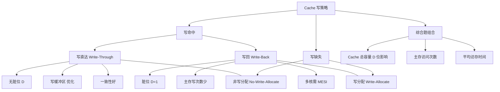

# Cache 写策略

> [!important] 📌 一句话本质
> 写策略解决的问题只有一个：**CPU 写数据时，Cache 和主存什么时候同步？** 这个问题分两种场景——写命中（数据在 Cache 里）和写缺失（数据不在 Cache 里），共产生 $2 \times 2 = 4$ 种策略组合，但实际只有两种合理搭配。命题人最爱考的不是策略本身，而是**策略对 Cache 每行元数据（脏位）和主存访问次数的影响**——这直接关联 Cache 总容量计算和平均访存时间计算。

> [!abstract] 🎯 考情速览
> - **大纲位置**：组原 第三章(六)3 — Cache 中主存块的替换算法和写策略
> - **考试频次**：⭐⭐⭐ 高频。近 10 年至少出现 5～6 次（含单选判断 + 综合题子问）
> - **典型题型**：单选 2 分（写策略判断 / 脏位相关 / 一致性）+ 综合题子问 2～4 分（嵌入 Cache 总容量或平均访存时间的计算中）
> - **分值估算**：单独出 2 分；嵌入综合题时影响 2～4 分的脏位 / 主存访问次数计算
> - **26 大纲变动**：无
> - **本篇能帮你回答的 3 个命题人问题**：
>   1. 「写回」策略下 Cache 每行为什么**必须**有脏位？脏位对 Cache 总容量的影响是多少？
>   2. 「写直达 + 写缓冲」和纯写直达有什么区别？CPU 感知到的写延迟差多少？
>   3. 为什么「写回 + 写分配」是实际 CPU 的标配？为什么不能「写回 + 非写分配」？


---


## 🧠 核心机制（极简唤醒）

### 问题拆解

CPU 写数据到某地址时，有两种情况：

```text
CPU 写地址 X
  ├── X 在 Cache 中 → 写命中（Write Hit）
  │     ├── 写直达（Write-Through）：同时写 Cache + 主存
  │     └── 写回（Write-Back）：只写 Cache，标记脏位 D=1
  │
  └── X 不在 Cache 中 → 写缺失（Write Miss）
        ├── 写分配（Write-Allocate）：先调块入 Cache，再在 Cache 中写
        └── 非写分配（No-Write-Allocate）：直接写主存，不调块
```

### 写命中：两种策略

**① 写直达（Write-Through）**

$$\text{每次写操作} \rightarrow \text{同时写 Cache + 写主存}$$

- 优点：主存**永远是最新数据**，一致性最好
- 缺点：每次写都访问主存，写操作慢
- 改进：加**写缓冲区（Write Buffer）**，CPU 写入缓冲区后立即返回，缓冲区异步写主存
- **不需要脏位**（主存始终是最新的，替换时直接丢弃 Cache 行即可）

**② 写回（Write-Back）**

$$\text{每次写操作} \rightarrow \text{只写 Cache，设 D=1}$$

$$\text{被替换时} \rightarrow \text{若 D=1，将整行写回主存（再替换）}$$

- 优点：大幅减少主存访问次数，写操作只需 Cache 访问时间
- 缺点：主存中的数据可能**不是最新的**（一致性差），需要脏位
- **必须有脏位 D**（每行 1 位，标记该行是否被修改过）

### 写缺失：两种策略

| 策略 | 动作 | 常搭配 |
|------|------|--------|
| **写分配（Write-Allocate）** | 先从主存调块入 Cache → 在 Cache 中写 | 写回 |
| **非写分配（No-Write-Allocate）** | 直接写主存 → 不调块入 Cache | 写直达 |

### 两种合理组合（必背）

| 组合 | 写命中 | 写缺失 | 特点 | 应用 |
|------|--------|--------|------|------|
| **写回 + 写分配** | 只写 Cache（D=1）| 调块入 Cache 再写 | 主存写次数最少，性能最高 | **实际 CPU 的 L1/L2 Cache** |
| **写直达 + 非写分配** | 同时写 Cache 和主存 | 直接写主存 | 一致性好，实现简单 | 嵌入式系统、I/O 设备缓存 |

> [!warning] ⚠️ 为什么没有「写回 + 非写分配」和「写直达 + 写分配」？
> - **写回 + 非写分配**：写缺失时直接写主存（非写分配），但 Cache 里这块都没有，下次写命中时怎么"只写 Cache"？语义矛盾，效率低下
> - **写直达 + 写分配**：写缺失时调块入 Cache（写分配），但写命中时又同时写主存（写直达）——调入 Cache 的意义被削弱。不是不能用，但收益不大
>
> 408 考试中默认只考上述两种合理组合。


---


## 🎯 命题人视角

> [!question] 💡 命题人在写策略上的挖坑全图谱
>
> ### 1. 怎么考
>
> - **单选题**（最常见）：判断某种写策略下是否需要脏位 / 写缓冲区的作用 / 一致性比较
> - **综合题子问**：计算 Cache 每行总位数时，写回策略需要加脏位（1 位），写直达不需要
> - **概念辨析**：「写直达和写回哪个一致性更好？」「写缓冲区能完全消除写直达的性能缺陷吗？」
>
> ### 2. 挖什么坑（按致命程度排序）
>
> 1. **脏位是否计入 Cache 总容量**（🔴 死亡级）：写回策略需要脏位 D（每行 1 位），写直达不需要。综合题问"Cache 实际存储位数"时，忘加或多加脏位都会扣分
> 2. **写直达 ≠ 每次都等主存写完**（🟡 常规级）：有写缓冲区时 CPU 不等主存，只等缓冲区。很多学生以为写直达性能极差 → 实际有写缓冲后没那么差
> 3. **写缺失时的动作混淆**（🟡 常规级）：写分配 = 先调块再写（和读缺失类似）；非写分配 = 直接写主存不调块。搞反则后续分析全错
> 4. **组合搭配搞错**（🟡 常规级）：写回**搭配**写分配；写直达**搭配**非写分配。命题人可能给出其他组合让你判断合理性
> 5. **替换时脏行的额外写操作**（🟢 粗心级）：写回策略下，替换一行时如果 D=1，需要先写回主存再调入新块 → 两次主存访问（一写一读）。题目问"总共访问主存几次"时容易漏掉这次写
> 6. **写直达下的读缺失**（🟢 粗心级）：写直达策略下，**读操作**的缺失处理和写回策略完全一样（都要从主存调块）。写策略只影响"写"操作的处理方式
>
> ### 3. 拿什么做干扰
>
> - 选项混淆"写分配"和"写回"（两个概念名字相似，但含义完全不同）
> - 选项说"写直达不需要写缓冲区"（不需要 ≠ 不能有，写缓冲是优化手段不是必需品）
> - 选项说"写回策略主存永远是最新的"（错，写回策略主存可能不是最新的）
>
> ### 4. 综合题里怎么嵌入
>
> - **Cache 总容量计算**：问"每行总位数" → 写回多 1 位脏位
> - **平均访存时间**：写回的写命中只需 $T_c$；写直达的写命中需 $T_c + T_m$（无缓冲）或 $T_c + T_{\text{buf}}$（有缓冲）
> - **主存访问次数统计**：给一段读写混合序列，问"共访问主存几次" → 写回只在缺失和脏行替换时访问主存，写直达每次写都访问主存
> - **多核一致性**：问"哪种写策略更容易维护多核 Cache 一致性" → 写直达（主存永远最新）
>
> ### 5. 死亡陷阱
>
> 综合题问"Cache 每行总位数"，题目说"采用写回策略"。学生算出 Tag + V + 数据 = X 位，**忘了脏位 D 的 1 位** → 整行差 1 位 → Cache 总位数差 $m$ 位（$m$ 是行数）→ 答案错。
>
> **避坑铁律**：看到"写回" → 立刻在草稿纸上写 "D=1 位"。看到"写直达" → 标记 "无 D 位"。


---


## ⚠️ 陷阱枚举

### 🔴 死亡陷阱（考场上最容易错）

**陷阱 1：写回策略的脏位漏算**

- **陷阱描述**：综合题问 Cache 每行总位数或 Cache 总存储空间
- **正确做法**：
  - 写回：每行 = 数据位 + Tag + V(1) + **D(1)** + LRU（如果组相联）
  - 写直达：每行 = 数据位 + Tag + V(1) + LRU（如果组相联）→ **无 D 位**
- **典型错误示范**：写回策略下漏掉 D 位 → 每行少 1 位 → 总容量差 $m$ 位
- **记忆法**：**写回 = 回头再写 = 脏了才写 = 需要脏位 D**

**陷阱 2：替换脏行时的额外主存写操作**

- **陷阱描述**：题目问"CPU 执行某段代码共访问主存多少次"
- **正确做法**：写回策略下，替换一行时如果 D=1：
  - 写回脏行 → 1 次主存写
  - 调入新块 → 1 次主存读
  - **共 2 次主存访问**
- **典型错误示范**：只算了调入新块的 1 次读 → 漏掉脏行写回的 1 次写
- **公式**：写回策略一次替换的主存访问次数 = $1_\text{读} + D_\text{脏位} \times 1_\text{写}$

### 🟡 常规陷阱（知道就能避开）

**陷阱 3：写直达 ≠ 写操作速度减半**

- **陷阱描述**：问"写直达策略下写操作的延迟是多少"
- **正确做法**：
  - 无写缓冲：$T_\text{write} = T_c + T_m$（CPU 等主存写完）
  - **有写缓冲**：$T_\text{write} = T_c + T_{\text{buf}}$（CPU 只等写入缓冲区，$T_{\text{buf}} \approx T_c$，几乎感知不到主存延迟）
- **典型错误示范**：不区分有无写缓冲，一律按 $T_c + T_m$ 算

**陷阱 4：写分配 vs 写回 名称混淆**

- **写回（Write-Back）**：写命中时只写 Cache → 处理的是"**命中**"场景
- **写分配（Write-Allocate）**：写缺失时先调块入 Cache → 处理的是"**缺失**"场景
- 两者名字有 "Write" 前缀，容易搞混。**写回管命中，写分配管缺失**
- **记忆法**：
  - Write-**Back** → 数据暂时留在 Cache，**回头**再写主存（命中时的策略）
  - Write-**Allocate** → Cache 里没有这块，先**分配**一行装进来（缺失时的策略）

**陷阱 5：读操作不受写策略影响**

- 无论写直达还是写回，**读缺失**的处理方式完全一样：从主存调块入 Cache
- 写策略只影响写操作（写命中 + 写缺失）
- 题目可能问"该策略下读缺失如何处理" → 和写策略无关，按正常读缺失流程

### 🟢 粗心陷阱（算错 / 漏看）

**陷阱 6：写缓冲区溢出**

- 如果写操作频率 > 写缓冲区向主存排空的速率，缓冲区会满 → CPU 被迫**等待**缓冲区有空位 → 写直达性能退化
- 选择题可能问"写直达 + 写缓冲在什么条件下性能下降"

**陷阱 7：MESI 和写策略的关系**

- 多核 CPU 中，写回策略需要 **MESI 协议**来维护各核 Cache 的一致性
- 写直达策略下一致性更容易维护（主存永远最新，其他核可以监听总线上的写操作）
- 408 了解概念即可，不需要深入 MESI 状态转换


---


## 🔀 易混对比

### 对比 1：写直达 vs 写回（核心消歧 · 必考！）

| 维度 | 写直达（Write-Through）| 写回（Write-Back）|
|------|----------------------|-------------------|
| **写命中动作** | 同时写 Cache + 主存 | 只写 Cache，设 D=1 |
| **主存何时更新** | 每次写操作都更新 | 被替换时才更新（D=1 时）|
| **脏位 D** | ❌ 不需要 | ✅ 必须有（每行 1 位）|
| **一致性** | ✅ 主存永远最新 | ❌ 主存可能过时 |
| **主存写次数** | 多（每次写命中都写）| 少（仅替换脏行时写）|
| **写缓冲区** | 常用（优化性能）| 不需要（不频繁写主存）|
| **实现复杂度** | 简单 | 复杂（需脏位 + 替换时写回逻辑）|
| **适用场景** | 一致性优先、嵌入式 | 性能优先、实际 CPU |
| **考题识别关键词** | "同时写"、"主存始终最新" | "只写 Cache"、"脏位"、"替换时写回" |

> [!failure] ⚠️ 干扰项识别技巧
> - 看到"脏位" → 一定是写回策略
> - 看到"写缓冲区" → 一定是写直达策略的优化（写回不需要写缓冲）
> - 看到"主存永远是最新数据" → 写直达
> - 看到"替换时需要先写回主存" → 写回

### 对比 2：写分配 vs 非写分配

| 维度 | 写分配（Write-Allocate）| 非写分配（No-Write-Allocate）|
|------|----------------------|---------------------------|
| **触发场景** | 写缺失 | 写缺失 |
| **动作** | 先调块入 Cache → 在 Cache 中写 | 直接写主存 → 不调块入 Cache |
| **和读缺失的关系** | 写缺失处理类似读缺失 | 写缺失不影响 Cache 内容 |
| **常搭配** | 写回（写入的块留在 Cache，后续命中就不写主存）| 写直达（反正每次写都写主存，不调块也无妨）|
| **考题识别关键词** | "缺失时先调块" | "缺失时直接写主存" |

### 对比 3：Cache 写策略 vs 虚拟内存写策略（跨科对比）

| 维度 | Cache 写策略 | 虚拟内存写策略 |
|------|-------------|---------------|
| **层次** | Cache ↔ 主存 | 主存 ↔ 磁盘 |
| **写回策略的名字** | Write-Back | 脏页回写（Dirty Page Writeback）|
| **脏标记** | 脏位 D（Cache 行）| 修改位 D（页表项）|
| **何时写回** | Cache 行被替换时 | 页面被置换时（或 OS 定期刷盘）|
| **实际采用** | 写回 + 写分配 | 类似写回（OS 不会每次写操作都写磁盘）|
| **一致性问题** | 多核 Cache 一致性（MESI）| 不存在（只有一份页表）|

> [!tip] 💡 跨科记忆法
> 虚拟内存**天然就是写回策略**——每次写只改内存中的页（设 D=1），只有被置换时（或 OS 定期扫描时）才把脏页写回磁盘。这和 Cache 写回的思路完全一致，只是粒度不同（页 4KB vs Cache 行 64B）。

### 对比 4：两种合理组合速查

| 维度 | 写回 + 写分配 | 写直达 + 非写分配 |
|------|-------------|-----------------|
| **脏位** | ✅ 需要 | ❌ 不需要 |
| **写缓冲** | ❌ 不需要 | ✅ 常用 |
| **主存写次数** | 最少 | 最多 |
| **一致性** | 差（需 MESI）| 好（主存永远最新）|
| **实际应用** | CPU L1/L2/L3 Cache | 嵌入式、I/O 缓冲 |
| **综合题中影响** | 每行多 1 位 D | 每行无 D 位 |


---


## 🎯 综合题作答模板

### 题型识别：写策略在综合题中的出现方式

写策略**很少独立出综合题**，通常作为子问嵌入 Cache 映射的综合大题中。识别方式：

1. 题目说"采用写回策略" → Cache 每行**加 D 位**
2. 题目问"共访问主存几次" → 考虑写回时脏行替换的额外写操作
3. 题目问"写直达的平均写延迟" → 区分有无写缓冲

### 标准处理步骤

**Step 1. 确认写策略类型**

```text
写回（Write-Back）→ 脏位 D = 1 位/行 ✅
写直达（Write-Through）→ 脏位 D = 0 位/行 ❌，可能有写缓冲
```

**Step 2. 计算 Cache 每行总位数**

```text
写回：每行 = 数据位 + Tag + V(1) + D(1) + LRU(⌈log₂E⌉)
写直达：每行 = 数据位 + Tag + V(1) + LRU(⌈log₂E⌉)
差异 = 1 位 / 行
```

**Step 3. 若题目问主存访问次数（写回策略）**

```text
逐步模拟访问序列：
  读缺失 → 1 次主存读（调块入 Cache）
  读命中 → 0 次主存访问
  写缺失（写分配）→ 1 次主存读（调块）+ 在 Cache 中写（0 次主存）
  写命中 → 0 次主存访问（只写 Cache）
  替换脏行 → 1 次主存写（写回）+ 1 次主存读（调新块）
  替换干净行 → 0 次主存写 + 1 次主存读

统计总主存访问次数 = Σ(读缺失次数) + Σ(脏行替换的写次数)
```

**Step 4. 若题目问主存访问次数（写直达策略）**

```text
  读缺失 → 1 次主存读
  读命中 → 0 次主存访问
  写缺失（非写分配）→ 1 次主存写（直接写主存）
  写命中 → 1 次主存写（每次写都写主存）
  替换时 → 无需写回（主存已是最新），仅 1 次主存读（调新块）

统计总主存访问次数 = Σ(读缺失) + Σ(所有写操作)
```

### 范例：写策略影响主存访问次数

> **题目**：Cache 采用写回 + 写分配策略，4 路组相联。以下访问序列（R=读，W=写）均映射到同一组，初始为空，帧数 = 4：
> `R:A, R:B, W:C, R:D, W:A, W:E, R:B`
> 问：共访问主存几次？

**解**：

| 步 | 操作 | 组内状态 | 缺/命中 | 主存访问 | 说明 |
|----|------|---------|---------|---------|------|
| 1 | R:A | {A} | 缺（冷）| 1 读 | 调 A 入 Cache |
| 2 | R:B | {A,B} | 缺 | 1 读 | 调 B 入 Cache |
| 3 | W:C | {A,B,C*} | 缺 | 1 读 | 写分配：调 C 入 Cache，写 C → D=1 |
| 4 | R:D | {A,B,C*,D} | 缺 | 1 读 | 组满 |
| 5 | W:A | {A*,B,C*,D} | 命中 | 0 | A 已在组内，只写 Cache → D=1 |
| 6 | W:E | {A*,E*,C*,D} | 缺 | 1 写+1 读 | LRU 替换 B（D=0，不写回），调 E → 等等 B 干净则 0 写+1 读 |
| 7 | R:B | {A*,E*,B,D} | 缺 | 1 写+1 读 | LRU 替换 C*（D=1，写回 C）+ 调 B |

主存访问次数统计：
- 步 1～4：各 1 次读 → 4 次
- 步 5：0 次
- 步 6：B 的 D=0（只被读过）→ 不写回 + 1 次读 = 1 次
- 步 7：C 的 D=1 → 写回 C(1 次写) + 调 B(1 次读) = 2 次

**总计 = $4 + 0 + 1 + 2 = 7$ 次主存访问**

> [!tip] 💡 关键判断
> 每次替换时的主存写操作取决于**被替换行的脏位**，不是新调入行的读写类型。


---


## 📜 真题抓点

### 📌 高置信度真题（请核验）

> [!cite] 2013 年 · 单选题
> <!-- TRUE_QUESTION_VERIFIED -->
> 关于 Cache 写策略，下列说法正确的是？
>
> 选项涉及：写直达是否需要脏位 / 写回策略替换时是否需要写主存 / 写分配是否在写缺失时调块
>
> **答案**：写回策略在替换脏行时需要将数据写回主存
>
> **简析**：
> - 干扰项 A："写直达需要脏位" → 错，写直达主存永远最新，不需要脏位
> - 干扰项 B："写回策略替换时不需要写主存" → 错，脏行（D=1）必须写回
> - 干扰项 D："写分配是在写命中时调块" → 错，写分配是**写缺失**时调块

### 📌 考过的点（题目原文待核验）

<!-- TRUE_QUESTION_UNVERIFIED -->

> [!warning] ⚠️ 以下内容描述命题趋势，具体年份题号请与王道真题册 / 天勤真题册对照核实

1. **概念判断型**（高频）：判断写直达/写回的特征（脏位、一致性、主存访问次数）
2. **Cache 总容量型**（嵌入综合题）：写回策略每行多 1 位脏位 → 影响总容量计算
3. **主存访问次数型**（嵌入综合题）：给读写混合序列 → 统计主存访问次数 → 陷阱在脏行替换
4. **组合判断型**：问"写回搭配什么写缺失策略" → 写分配
5. **写缓冲作用型**：问"写缓冲区的作用" → 减少 CPU 等待主存写完的时间
6. **一致性比较型**：问"多核系统中哪种写策略更容易维护一致性" → 写直达

### 🎯 出题规律总结

- **考试频次**：高频（几乎每 2 年出现一次，单选或综合题子问）
- **常见题型**：
  - 单选 2 分：策略特征判断、脏位判断、组合搭配
  - 综合题子问 2～4 分：嵌入 Cache 总容量计算、主存访问次数统计
- **常与哪些考点组合**：
  - **映射方式**（直接/组相联 + 写策略 = 综合题的经典框架）
  - **替换策略**（LRU + 写回 → 替换脏行时要写主存）
  - **Cache 总容量**（脏位影响每行位数）
  - **平均访存时间**（写直达 vs 写回的写延迟不同）
  - **多核 Cache 一致性**（MESI 协议 + 写策略的关系）


---


## ⚡ 冲刺速记

### 必背结论

- **写回**：只写 Cache + D=1 → 替换时写回（D=1 才写主存）→ **需要脏位**
- **写直达**：同时写 Cache + 主存 → 主存永远最新 → **不需要脏位**
- **写分配**：写缺失 → 先调块入 Cache → 搭配写回
- **非写分配**：写缺失 → 直接写主存 → 搭配写直达
- **写回 + 写分配** = 实际 CPU 标配（性能最优）
- **写直达 + 非写分配** = 一致性最好（实现最简）
- **写缓冲区** = 写直达的性能优化（CPU 不等主存，只等缓冲区）
- **替换脏行** = 额外 1 次主存写（$1_\text{写} + 1_\text{读}$ 共 2 次主存访问）
- **读操作不受写策略影响**

### 考场条件反射

| 看到 | 立刻想到 |
|------|---------|
| "写回策略" | 脏位 D = 1 位/行 → 加入 Cache 每行总位数 |
| "写直达策略" | 无脏位 D → Cache 每行少 1 位 |
| "写缓冲区" | 写直达的优化 → CPU 延迟 ≈ $T_c$ |
| "Cache 每行总位数" | 先看写策略 → 决定是否有 D 位 |
| "共访问主存几次" | 写回：替换脏行时 +1 次写；写直达：每次写都 +1 |
| "主存始终最新" | 写直达 |
| "替换时才写回" | 写回 |
| "写缺失调块" | 写分配 → 配写回 |
| "写缺失直接写主存" | 非写分配 → 配写直达 |
| "MESI" / "多核一致性" | 写回更复杂，写直达更简单 |

### 考前 5 分钟速览清单

1. **写命中两种**：写直达（同时写 Cache+主存，无 D）vs 写回（只写 Cache，D=1）
2. **写缺失两种**：写分配（调块入 Cache，配写回）vs 非写分配（直接写主存，配写直达）
3. **合理组合**：写回+写分配（实际 CPU）；写直达+非写分配（嵌入式）
4. **脏位**：写回必须有，写直达不需要 → 影响 Cache 总容量
5. **替换脏行**：额外 1 次主存写 → 总访问次数容易漏算
6. **写缓冲**：写直达的优化，CPU 写完缓冲区即返回


---


## 🔗 知识图谱




## 🔗 相关考点

- **上级**：[[408_COA_ch3_Cache]] — Cache 章节总览
- **平级**：[[cache_direct_mapping]]、[[cache_set_associative]]（写策略影响每行总位数）
- **综合题常组合**：[[cache_set_associative#LRU 替换策略深入]]（LRU 替换时可能触发脏行写回）
- **跨科对应**：[[408_OS_ch3_虚拟内存]]（虚拟内存天然采用"写回"：脏页回写）、[[page_replacement_algorithms]]（脏页换出的 I/O 次数）


## 📚 参考资料

- 唐朔飞《计算机组成原理（第 3 版）》§5.4.4 — Cache 的写策略
- 王道考研《计算机组成原理》第 3 章 — Cache 写策略
- CS:APP 第 6 章 — Writing Cache-Friendly Code
- 2013 年 408 单选（写策略特征判断）
