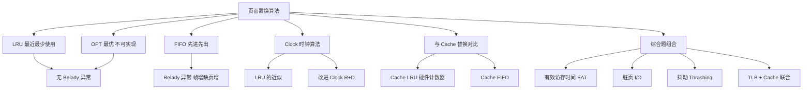

# 页面置换算法

> [!important] 📌 一句话本质
> 页面置换算法解决的问题极其纯粹：**内存帧满了，新页要进来，踢谁出去？** 四种算法（OPT / FIFO / LRU / Clock）本质上只是用不同的信息来预测"谁最不值得留"。OPT 用未来（不可实现），FIFO 用装入时间（最粗糙），LRU 用最近访问时间（最精确但昂贵），Clock 用访问位近似 LRU（实际 OS 采用）。408 综合题的核心是**手算替换过程并统计缺页次数**，命题人在这个过程中埋了至少 6 个坑。

> [!abstract] 🎯 考情速览
> - **大纲位置**：操系 第三章(二)3 — 页面置换算法
> - **考试频次**：⭐⭐⭐ 高频。近 10 年几乎每年出现（单选或综合题子问）
> - **典型题型**：单选 2 分（算法判断 / Belady 异常）+ 综合题 8～15 分（给访问序列，手算缺页次数 + 缺页率 + 判断算法特性）
> - **分值估算**：综合题出现时通常占 8～12 分
> - **26 大纲变动**：无
> - **本篇能帮你回答的 3 个命题人问题**：
>   1. 为什么 FIFO 有 Belady 异常而 LRU 没有？"栈算法"到底是什么？
>   2. LRU 手算中最容易出错的一步是什么？（提示：命中时的顺序更新）
>   3. Clock 算法转一圈后还没找到 R=0 的页怎么办？（提示：不可能，因为第一轮全部清零了）

> [!tip] 💡 与 Cache 替换策略的联系
> 页面置换和 Cache 替换本质是**同一个问题在不同层次上的实例**：
> - **Cache 替换**：主存块争抢 Cache 行（SRAM），替换粒度 = Cache 块（64B 量级），硬件实现
> - **页面置换**：虚拟页争抢物理页框（DRAM），替换粒度 = 页面（4KB 量级），OS 软件实现
> 
> 两者共享相同的算法名字（LRU / FIFO / OPT），但 **Belady 异常只在页面置换的 FIFO 中讨论**，Cache 替换不考这个。Clock 算法是页面置换独有的（Cache 不用 Clock）。


---


## 🧠 核心机制（极简唤醒）

### 问题场景

进程分配到 $N$ 个物理页框，访问序列为 $r_1, r_2, r_3, \ldots$。当访问页 $r_i$ 不在内存时 → **缺页（Page Fault）**→ 需要从磁盘调入 → 若 $N$ 帧全满 → 必须选一帧换出。

### 约定（手算必记）

1. **页面第一次装入也算一次缺页**（冷缺失 / Compulsory Miss）
2. **缺页率** $p = \frac{\text{缺页次数}}{\text{总访问次数}}$
3. 换出**脏页**（修改位 D=1）需要额外一次磁盘写 I/O

### 四种算法一句话

| 算法 | 一句话策略 | 可实现？ | Belady 异常？ |
|------|-----------|---------|--------------|
| **OPT** | 换**未来最久不用**的 | ❌ 不可实现 | ❌ 无 |
| **FIFO** | 换**最早装入**的 | ✅ 队列即可 | ✅ **有！** |
| **LRU** | 换**最久未被访问**的 | ✅ 但开销大 | ❌ 无 |
| **Clock** | 用访问位 R 近似 LRU | ✅ 实际 OS 用 | ❌ 无 |


---


## 🎯 命题人视角

> [!question] 💡 命题人在页面置换上的挖坑全图谱
>
> ### 1. 怎么考
>
> - **单选题**（最常见）：判断某算法是否存在 Belady 异常；给一段序列问某算法缺页次数
> - **综合题**（高分值）：给 12～20 个访问序列 + 帧数，要求完整画出替换过程表 + 统计缺页次数 + 算缺页率 + 判断算法特性
> - **概念辨析**：「LRU 和 FIFO 在什么情况下缺页次数相同？」「Clock 算法为什么是 LRU 的近似？」
>
> ### 2. 挖什么坑（按致命程度排序）
>
> 1. **LRU 命中时忘记更新顺序**（🔴 死亡级）：LRU 命中后必须把命中页移到"最近使用"端；FIFO 命中时**不动**。这是 LRU 和 FIFO 在手算中的唯一区别，但 60% 考生在此犯错
> 2. **OPT 手算"未来最远"找错**（🔴 死亡级）：OPT 要看每个在内存中的页，下次出现在序列的**哪个位置**，选位置最远（或不再出现）的换出。很多人只看"离当前最远"而不考虑"永不再出现"的页
> 3. **FIFO 首次装入不算"队头更新"**（🟡 常规级）：首次装入是添加到队尾，不影响已有队列顺序
> 4. **Belady 异常的精确条件**（🟡 常规级）：只有 FIFO 会出现；增加帧数后缺页次数**反而增多**（不是"不变"，是"增多"）
> 5. **"栈算法"概念混淆**（🟡 常规级）：OPT 和 LRU 是栈算法，帧数增加时缺页次数单调不增；FIFO 不是栈算法
> 6. **Clock 算法的指针位置**（🟢 粗心级）：替换后指针停在被替换位置的**下一个**，不是停在被替换位置
> 7. **改进 Clock 的 (R,D) 优先级搞混**（🟢 粗心级）：(0,0) > (0,1) > (1,0) > (1,1)，优先换出"未访问 + 未修改"的页
> 8. **缺页率分母**（🟢 粗心级）：分母是**总访问次数**，不是缺页次数
>
> ### 3. 拿什么做干扰
>
> - 把 LRU 和 FIFO 的缺页次数互换（利用学生在命中时不更新 LRU 顺序的错误）
> - OPT 的结果作为选项 A，LRU 的结果作为选项 B，FIFO 的结果作为选项 C → 学生算的是 LRU 但犯了 FIFO 的错
> - 给出"帧数增多后缺页次数不变"的选项（Belady 异常是"增多"，不是"不变"）
>
> ### 4. 综合题里怎么嵌入
>
> - **置换 + 缺页率 + EAT**：先手算缺页次数 → 算缺页率 → 代入 $\text{EAT} = (1-p) \times t_\text{mem} + p \times t_\text{fault}$
> - **置换 + 脏页 I/O**：问"共产生几次磁盘 I/O"，换入 1 次读 + 脏页换出 1 次写 = 2 次
> - **置换 + 工作集/抖动**：给多进程共享内存场景，问抖动条件和解决方案
> - **置换 + TLB/Cache**（跨科组合）：虚拟地址 → TLB → 页表 → 物理地址 → Cache，中途可能触发缺页置换
>
> ### 5. 死亡陷阱
>
> 综合题给一段 15 步的访问序列，要求分别用 FIFO 和 LRU 手算。学生在 LRU 的第 8 步命中了一次，**但没把命中页移到最近使用端** → 从第 9 步开始整个替换决策全错 → 后半段缺页次数全算错。
>
> **避坑铁律**：LRU 每一步都要问自己——「这一步是命中还是缺页？如果命中，我把这个页移到最近端了吗？」


---


## ⚠️ 陷阱枚举

### 🔴 死亡陷阱（考场上最容易错）

**陷阱 1：LRU 命中时不更新使用顺序**

- **陷阱描述**：LRU 和 FIFO 的手算表格看起来几乎一模一样。唯一区别：**LRU 命中时，命中页要移到"最近使用"端；FIFO 命中时，队列不动**
- **正确做法**：LRU 每一步，不管命中还是缺页，都要重新排列"最近使用顺序"。画表时用「左=最久未用，右=最近使用」的约定
- **典型错误示范**：把 LRU 当 FIFO 做（命中时不动）→ 后续替换选错
- **记忆法**：**LRU 的 R = Recently，每次访问都更新"最近"，不分命中和缺页**

**陷阱 2：OPT 手算"未来最远"判断错**

- **陷阱描述**：内存中有页 A、B、C，后续序列是 `... B A ... C ...`。OPT 应该换出 C（最远），但很多人误换 A
- **正确做法**：逐一查看内存中每个页在**剩余序列**中的下次出现位置。**永不再出现的页最优先换出**（视为"无穷远"）
- **典型错误示范**：只看紧接的几步，不扫描完整剩余序列 → 判断错
- **手算技巧**：在序列上方标注每个页的"下次出现位置"，写成数字方便比较

**陷阱 3：FIFO 的 Belady 异常方向搞错**

- **陷阱描述**：选择题问"Belady 异常是指什么？"
- **正确做法**：Belady 异常 = **帧数增加，缺页次数反而增多**（不是减少，也不是不变）
- **典型错误示范**：选择"帧数增加后缺页次数不变"→ 这不叫异常，这叫"没效果"
- **经典例证**：序列 `1 2 3 4 1 2 5 1 2 3 4 5`，帧数 3 → 缺页 9 次；帧数 4 → 缺页 10 次

### 🟡 常规陷阱（知道就能避开）

**陷阱 4：栈算法 vs 非栈算法**

- **栈算法定义**：如果用 $n$ 帧时内存中的页集合 $\subseteq$ 用 $n+1$ 帧时的页集合（包含关系），则为栈算法
- **结论**：OPT ✅ 栈算法，LRU ✅ 栈算法，FIFO ❌ 非栈算法
- **推论**：栈算法**不会**出现 Belady 异常。FIFO 不是栈算法，所以可能出现
- **考题识别法**：看到"增加帧数是否一定减少缺页"→ 栈算法是，FIFO 不一定

**陷阱 5：Clock 指针的停留位置**

- **正确规则**：替换完成后，指针指向被替换位置的**下一个**位置（不是停在原地）
- **典型错误示范**：指针停在刚替换的位置 → 下次扫描从错误位置开始

**陷阱 6：改进 Clock 的优先级顺序**

- (R=0, D=0)：最近未访问 + 未修改 → **最先换出**
- (R=0, D=1)：最近未访问 + 已修改 → 次优先（换出需写磁盘）
- (R=1, D=0)：最近访问过 + 未修改 → 再次
- (R=1, D=1)：最近访问过 + 已修改 → **最后换出**
- **记忆法**：**R 权重高于 D**（先看是否"最近用过"，再看是否"脏"）

### 🟢 粗心陷阱（算错 / 漏看）

**陷阱 7：缺页率分母**

- $p = \frac{\text{缺页次数}}{\text{总访问次数}}$，分母是**总访问次数**，不是"缺页次数"也不是"命中次数"

**陷阱 8：首次访问必缺页**

- 无论什么算法，初始内存为空时，每个新页的第一次访问必然缺页（冷缺失），和 Cache 完全一样

**陷阱 9：脏页换出的 I/O 次数**

- 换入新页 = 1 次磁盘读
- 被换出页如果 D=1（脏页）= 额外 1 次磁盘写
- 总计 = 1 或 2 次磁盘 I/O（题目问"总共多少次磁盘 I/O"时必须考虑）


---


## 🔀 易混对比

### 对比 1：FIFO vs LRU（最核心消歧 · 必考！）

| 维度 | FIFO | LRU |
|------|------|-----|
| **排序依据** | 页**装入**内存的时间 | 页**最后被访问**的时间 |
| **命中时是否重排** | ❌ **不动**（这是命题人最爱考的区别）| ✅ **移到最近端** |
| **Belady 异常** | ✅ 有 | ❌ 无（栈算法）|
| **实现复杂度** | 极低（一个队列）| 高（需记录每次访问时间）|
| **性能** | 较差 | 接近 OPT |
| **考题识别法** | "最早**进入**" | "最久未**使用**" |
| **与 Cache 的对应** | Cache 的 FIFO 替换 | Cache 的 LRU 替换（组内计数器）|

> [!failure] ⚠️ 干扰项识别技巧
> 选择题给一段短序列，问 "用 LRU 算法缺页几次"。如果你的答案和 FIFO 算出来一样 → **高度警惕**：很可能是因为序列中没有"命中后重排"的场景（短序列中 FIFO 和 LRU 经常巧合相同）。但如果你的答案和 FIFO 不同 → 检查是不是在命中步骤忘了更新。

### 对比 2：LRU vs OPT

| 维度 | LRU | OPT |
|------|-----|-----|
| **依据** | 过去的访问历史（向后看）| 未来的访问序列（向前看）|
| **可实现** | ✅（但硬件开销大）| ❌（需预知未来）|
| **缺页次数** | ≥ OPT（OPT 是下界）| 最少（理论最优）|
| **用途** | 实际系统近似实现 | 作为比较基准 |
| **考题出现方式** | 手算 + 选择 | 手算（常和 LRU 对比）|

### 对比 3：Clock vs LRU

| 维度 | Clock | LRU |
|------|-------|-----|
| **信息量** | 只有 1 位访问位 R（0/1）| 精确的时间戳或排序 |
| **精度** | 粗糙（只知"最近是否访问"，不知"何时访问"）| 精确 |
| **实现成本** | 低（OS 维护，硬件置 R 位）| 高（需完整 LRU 栈或计数器）|
| **实际应用** | ✅ Linux 等实际 OS 使用 | ❌ 纯 LRU 太贵，用 Clock 近似 |
| **和 Cache 的关系** | Cache 不用 Clock（硬件直接实现 LRU 计数器）| Cache 硬件直接实现 |

### 对比 4：页面置换 vs Cache 替换（跨科对比 · 高分必会）

| 维度 | 页面置换 | Cache 替换 |
|------|---------|-----------|
| **层次** | 磁盘 ↔ 内存（DRAM）| 内存 ↔ Cache（SRAM）|
| **替换粒度** | 页面（$4\text{KB}$）| Cache 块（$64\text{B}$ 量级）|
| **实现者** | 操作系统（软件）| 硬件 |
| **缺失代价** | 极高（磁盘 I/O，$10\text{ms}$ 级）| 较低（访存，$100\text{ns}$ 级）|
| **共有算法** | OPT / FIFO / LRU | OPT / FIFO / LRU / RAND |
| **独有机制** | Clock 算法、改进 Clock | 组相联 LRU 计数器 |
| **Belady 异常** | FIFO 有 | Cache 替换不讨论此问题 |
| **脏数据处理** | 脏页写回磁盘（修改位 D）| 脏行写回主存（脏位 D）|

> [!tip] 💡 跨科记忆法
> 把页面置换想象成 Cache 替换的**放大版**：同样的思路，不同的尺度。Cache 的 LRU 在硬件里用计数器实现（因为组内只有 4～8 行，计数器很小）；页面的 LRU 在操作系统里太贵（页框成千上万），所以用 Clock 近似。

> [!failure] ⚠️ 跨科对比必考点
> 选择题可能问"以下关于替换策略的说法正确的是"，选项混杂 Cache 和页面置换的特征：
> - "直接映射不需要替换策略" → 正确（Cache 独有特征）
> - "FIFO 在 Cache 中也会出现 Belady 异常" → **通常不讨论**（408 只在页面置换中考 Belady）
> - "Clock 算法用于 Cache 替换" → 错误（Clock 是页面置换独有的）


---


## 🎯 综合题作答模板

### 题型识别：页面置换序列模拟

**识别关键词**：题目出现 "访问序列 / 引用串" + "内存帧数 / 物理块数" + "OPT / FIFO / LRU / Clock" + "缺页次数 / 缺页率"

### 标准作答步骤

**Step 1. 提取关键信息**

```text
访问序列 = [r₁, r₂, ..., rₙ]（总共 n 次访问）
帧数 = N
算法 = OPT / FIFO / LRU / Clock
初始状态 = 空（除非题目另说）
```

**Step 2. 画替换表（每步一行）**

```text
| 步骤 | 访问页 | 帧1 | 帧2 | ... | 帧N | 缺页？ | 换出页 | 说明 |
```

> **必须每步都写完整内存状态**，不能跳步。阅卷老师按每步给分，跳步直接扣分。

**Step 3. 按算法规则逐步填表**

**FIFO**：维护队列，队头 = 最早装入 → 换出。命中不动队列。

**LRU**：维护使用顺序，左 = 最久未用 → 换出。**命中时必须把命中页移到最近端**。

**OPT**：每次缺页时，查看剩余序列，找内存中"下次出现最远"或"不再出现"的页换出。

**Clock**：维护循环链表 + 指针。扫到 R=1 → 清零并跳过；扫到 R=0 → 换出。

**Step 4. 统计并计算**

```text
缺页次数 = 表中"✅"的总数
缺页率 p = 缺页次数 / 总访问次数 n
```

**Step 5. 若题目问 EAT（有效访问时间）**

$$\text{EAT} = (1-p) \times t_\text{mem} + p \times t_\text{fault}$$

### 🎯 阅卷评分点（综合题 12 分为例）

| 评分点 | 分值 |
|--------|------|
| 替换表每步正确（通常按"块"给分，每 3～4 步 1 分）| 6～8 分 |
| 缺页次数统计正确 | 1 分 |
| 缺页率计算正确 | 1 分 |
| EAT 公式正确 + 计算正确 | 2 分 |

### ⚠️ 常见扣分

| 错误 | 扣分 |
|------|------|
| LRU 命中时没更新顺序 → 后续替换全错 | -3～6 分 |
| OPT 找错"最远页" | -2～4 分 |
| 替换表跳步不写中间状态 | -1～2 分 |
| 缺页率分母写错 | -1 分 |
| 忘记首次装入算缺页 | -1 分 |


---


## 📖 四种算法手算详解（考场模板）

### OPT 手算要领

```text
每次缺页且帧满时：
  ① 列出当前帧内所有页
  ② 逐一查"在剩余序列中，该页下次出现在第几步"
  ③ 不再出现 → 标记为 ∞
  ④ 选 ∞ 或最大步数的页换出
  ⑤ 若多个页都不再出现 → 任选一个即可
```

### FIFO 手算要领

```text
维护一个队列（先进先出）：
  缺页时：
    帧未满 → 新页入队尾
    帧已满 → 队头出队（换出），新页入队尾
  命中时：
    ❌ 不做任何操作，队列不动
```

### LRU 手算要领

```text
维护一个"使用顺序列表"（左旧右新）：
  缺页时：
    帧未满 → 新页加到最右（最近使用）
    帧已满 → 删除最左（最久未用），新页加到最右
  命中时：
    ⭐ 将命中页从当前位置移到最右（最近使用端）
       （这是 LRU 和 FIFO 的唯一区别！！！）
```

### Clock 手算要领

```text
维护循环链表，每页有访问位 R，一个指针 ptr：
  访问某页时：
    若在内存中 → 命中，设 R=1（不移指针）
    若不在内存中 → 缺页：
      帧未满 → 装入空帧，R=1
      帧已满 → 从 ptr 开始扫描：
        R=1 → 清零(R=0)，ptr 前移
        R=0 → 换出此页，装入新页(R=1)，ptr 前移到下一位
```

### LRU vs FIFO 关键步骤对比示例

访问序列：`1 2 3 2 4 1`，帧数 = 3

**FIFO**（命中不动）：

| 步 | 访问 | 队列（左旧→右新）| 缺页 |
|----|------|----|------|
| 1 | 1 | [1] | ✅ |
| 2 | 2 | [1,2] | ✅ |
| 3 | 3 | [1,2,3] | ✅ |
| 4 | 2 | [1,2,3]（**命中，不动**）| — |
| 5 | 4 | [2,3,4]（换出 1，最老）| ✅ |
| 6 | 1 | [3,4,1]（换出 2）| ✅ |

缺页 = 5

**LRU**（命中要重排）：

| 步 | 访问 | 顺序（左久→右近）| 缺页 |
|----|------|----|------|
| 1 | 1 | [1] | ✅ |
| 2 | 2 | [1,2] | ✅ |
| 3 | 3 | [1,2,3] | ✅ |
| 4 | 2 | [1,3,**2**]（**命中，2 移到最近端**）| — |
| 5 | 4 | [3,2,4]（换出 1，最久未用）| ✅ |
| 6 | 1 | [2,4,1]（换出 3）| ✅ |

缺页 = 5（此例两者恰好相同，但第 5 步换出的页不同：FIFO 换 1，LRU 也换 1；第 6 步 FIFO 换 2，LRU 换 3）

> [!warning] ⚠️ 关键区别在第 4 步
> FIFO 的第 4 步：命中 2，队列不变，仍然是 [1,2,3]。
> LRU 的第 4 步：命中 2，**把 2 移到最右**，变成 [1,3,2]。
> 
> 这一步的差异会导致后续换出的页不同。序列越长，这个差异的雪球效应越大。


---


## 📜 真题抓点

### 📌 高置信度真题（请核验）

> [!cite] 2010 年 · 综合题（页面置换部分）
> <!-- TRUE_QUESTION_VERIFIED -->
> 给定页面访问序列和物理块数，要求分别用 FIFO 和 LRU 算法画出页面替换过程，统计缺页次数，并说明 FIFO 在什么条件下会出现 Belady 异常。
>
> **答案要点**：
> - FIFO 手算：维护队列，命中不动
> - LRU 手算：维护使用顺序，命中要移到最近端
> - Belady 异常条件：FIFO 算法下，增加物理块数后缺页次数反而增多
> - 原因：FIFO 不是栈算法（不具有栈包含性质）
>
> **简析**：本题是页面置换的标准综合题，核心考点就是 FIFO 和 LRU 的手算差异 + Belady 异常概念。

> [!cite] 2016 年 · 单选题
> <!-- TRUE_QUESTION_VERIFIED -->
> 关于页面置换算法，下列说法正确的是？
>
> 选项涉及：LRU 是否存在 Belady 异常 / OPT 是否可实现 / FIFO 性能是否一定差于 LRU / Clock 是否精确等价于 LRU
>
> **答案**：LRU 不存在 Belady 异常（LRU 是栈算法）
>
> **简析**：干扰项通常是"FIFO 性能一定差于 LRU"（错，某些特定序列下可以相同）和"Clock 等价于 LRU"（错，是近似不是等价）。

### 📌 考过的点（题目原文待核验）

<!-- TRUE_QUESTION_UNVERIFIED -->

> [!warning] ⚠️ 以下内容描述命题趋势，具体年份题号请与王道真题册 / 天勤真题册对照核实

1. **手算对比型**（最高频）：给同一序列 + 帧数，要求同时用 FIFO 和 LRU 画表 → 对比缺页次数 → 陷阱在 LRU 命中时的重排
2. **Belady 验证型**：给特定序列，帧数 3 和 4 分别用 FIFO 算 → 验证缺页次数帧数 4 > 帧数 3
3. **OPT 基准型**：给序列 + 帧数 → 用 OPT 算最少缺页次数 → 作为其他算法的比较基准
4. **Clock 模拟型**：给序列 + 帧数 + 初始访问位 → 模拟 Clock 替换过程 → 统计缺页
5. **EAT 计算型**：算完缺页率后代入公式算有效访问时间
6. **跨科联合型**（综合大题）：虚拟地址 → 查 TLB（全相联）→ 查页表 → 可能触发缺页置换 → 得到物理地址 → 查 Cache（组相联）

### 🎯 出题规律总结

- **考试频次**：高频（几乎每年以某种形式出现）
- **常见题型**：
  - 单选 2 分：Belady 异常判断、算法特性判断
  - 综合题 8～15 分：手算替换表 + 缺页次数 + 缺页率（+ EAT）
- **常与哪些考点组合**：
  - **缺页中断处理流程**（缺页是 Fault 型异常 → 重新执行引发缺页的指令）
  - **TLB + Cache**（地址转换的完整链路）
  - **工作集 + 抖动**（帧数不足 → 频繁缺页 → 抖动 → 解决方案）
  - **脏页 I/O**（修改位 D → 换出需额外写磁盘）


---


## ⚡ 冲刺速记

### 必背结论

- **OPT**：缺页最少，不可实现，无 Belady 异常
- **FIFO**：最简单，**唯一有 Belady 异常的算法**，非栈算法
- **LRU**：性能接近 OPT，无 Belady 异常，栈算法，实现开销大
- **Clock**：LRU 的近似，用 1 位访问位 R，实际 OS 采用，无 Belady 异常
- **改进 Clock**：同时考虑 R 和 D，优先换出 (0,0)，最后换出 (1,1)
- **栈算法**：OPT 和 LRU 是，FIFO 不是。栈算法帧数增加 → 缺页不增
- **Belady 异常**：帧数增加 → 缺页次数反而**增多**（不是不变）
- **缺页率** $p = \frac{\text{缺页次数}}{\text{总访问次数}}$
- **首次装入算缺页**（冷缺失）
- **脏页换出**：额外 1 次磁盘写 I/O

### 考场条件反射

| 看到 | 立刻想到 |
|------|---------|
| "增加帧数缺页增多" | Belady 异常 → 只有 FIFO |
| "最近最久未使用" | LRU → 命中时要重排！|
| "最先进入" | FIFO → 命中时不动 |
| "未来最久不用" | OPT → 不可实现，作基准 |
| "访问位 R" / "时钟" | Clock 算法 |
| "栈算法" | OPT 和 LRU 是；FIFO 不是 |
| "缺页中断" | 内中断（Fault）→ **重新执行**引发缺页的指令 |
| "修改位 D=1" | 脏页 → 换出需额外写磁盘 |
| "EAT 公式" | $(1-p) \times t_\text{mem} + p \times t_\text{fault}$ |
| "抖动 / Thrashing" | 帧数 < 工作集 → 频繁缺页 → CPU 利用率暴跌 |

### 考前 5 分钟速览清单

1. **四种算法一句话**：OPT 看未来（不可实现），FIFO 看装入（有 Belady），LRU 看最近访问（命中要重排），Clock 用 R 位近似 LRU
2. **FIFO vs LRU 唯一区别**：命中时 FIFO 不动，LRU 移到最近端
3. **Belady**：FIFO 独有，帧数↑ 缺页↑
4. **栈算法**：OPT ✅ LRU ✅ FIFO ❌ → 栈算法帧数↑ 缺页不↑
5. **首次装入 = 缺页**，脏页换出 = 额外 1 次磁盘写
6. **Clock**：R=1 → 清零跳过，R=0 → 换出，替换后指针移到下一位


---


## 🔗 知识图谱




## 🔗 相关考点

- **上级**：[[408_OS_ch3_虚拟内存]] — 虚拟内存章节总览
- **平级易混**：[[cache_set_associative#LRU 替换策略深入]]（Cache 的 LRU vs 页面的 LRU）
- **综合题常组合**：[[408_OS_ch3_内存管理]]（页表 + TLB）、[[408_COA_ch3_Cache]]（Cache 替换）
- **跨科对应**：Cache 替换策略 = 同问题不同层次的实例


## 📚 参考资料

- 汤子瀛《操作系统（第四版）》第五章 — 虚拟存储器
- 王道考研《操作系统》虚拟内存专题 — 置换算法手算真题
- 2010 年 408 综合题（FIFO vs LRU 对比 + Belady 异常）
- 2016 年 408 单选（页面置换算法特性判断）
