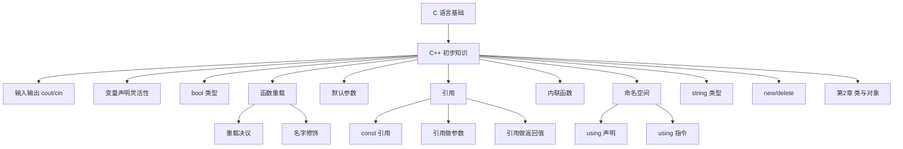

# C++ 的初步知识（谭浩强第1章）

> 📌 这一章是从 C 语言过渡到 C++ 的桥梁。你将了解 C++ 相对于 C 新增了哪些"便利工具"——这些工具本身不是面向对象的，但它们是后续理解类、继承、多态的**基础设施**。就像学开车之前得先认识仪表盘上的按钮。


## 📋 前置知识

在开始之前，你需要了解这些概念（如果不熟悉，先点击链接去补课）：

- [[C 语言基础]] — 你需要会写 C 程序：变量声明、`printf`/`scanf`、`if-else`、`for`/`while` 循环、函数定义与调用
- [[指针与数组基础]] — 了解指针的基本概念（`int *p`、`&` 取地址、`*` 解引用），因为 C++ 的引用是和指针密切相关的概念
- [[C 语言函数]] — 了解函数的声明、定义、调用，以及参数传递（值传递）的机制


## 🤔 为什么要学这个？

如果你已经学过 C 语言，可能会想："C 不是已经能写程序了吗？为什么还要学 C++？"

让我用一个场景来说明。假设你用 C 语言写一个数学工具库，需要求绝对值：

```c
// C 语言的痛苦：不同类型要用不同名字的函数
int abs_int(int x) { return x < 0 ? -x : x; }
double abs_double(double x) { return x < 0 ? -x : x; }
long abs_long(long x) { return x < 0 ? -x : x; }
```

三个函数的**逻辑完全一样**，只是参数类型不同，你却不得不取三个不同的名字。调用时你还得记住：`int` 用 `abs_int`，`double` 用 `abs_double`……如果再加个 `float` 版本呢？再取一个名字。

C++ 的**函数重载**解决了这个问题——三个函数都叫 `myAbs`，编译器自动根据你传入的参数类型选正确的版本。

再比如，C 语言中交换两个变量必须传指针：

```c
// C 语言：必须传指针，写起来繁琐
void swap(int *a, int *b) {
    int temp = *a;
    *a = *b;
    *b = temp;
}
// 调用时：swap(&x, &y);  // 必须取地址
```

而 C++ 的**引用**让你可以更自然地写：

```cpp
// C++：引用让代码更清爽
void swap(int &a, int &b) {
    int temp = a;
    a = b;
    b = temp;
}
// 调用时：swap(x, y);  // 不需要取地址，看起来和普通变量一样
```

这一章要学的就是这些让 C++ "更好用"的基础设施。它们不是面向对象的核心（那是后面章节的事），但如果你不了解它们，后面的代码你会看不懂。


## 🧠 核心概念


### 1.1 C++ 的诞生与"面向对象"概述

> 🎯 **类比**：如果说 C 语言是一套手动工具（锤子、螺丝刀、锯子），面向对象编程就是把这些工具按功能分类装进不同的工具箱。你需要电工工具？拿"电工工具箱"就行，里面有你需要的一切，而且工具之间不会互相干扰。

#### 面向过程 vs 面向对象

**面向过程编程**（Procedural Programming）的核心思想是：程序 = 数据 + 函数。你把数据放在这边，函数放在那边，函数操作数据。这在小程序中没问题，但当程序变大时，数据和函数的关系变得像一团乱麻——你不知道哪个函数会修改哪个数据，改了一个数据可能导致五个函数出错。

**面向对象编程**（Object-Oriented Programming，简称 OOP）的核心思想是：程序 = 对象的集合。把数据和操作这些数据的函数**打包在一起**，形成一个"对象"。对象之间通过公开的接口（公有函数）交互，内部细节互相不知道。

C++ 是 Bjarne Stroustrup（本贾尼·斯特劳斯特鲁普）在 $1979$ 年在 C 语言基础上开发的，最初叫"C with Classes"（带类的 C）。它**完全兼容 C 语言**——所有合法的 C 程序（几乎）都是合法的 C++ 程序。但 C++ 在 C 的基础上增加了大量新特性，其中最重要的就是面向对象的支持。

OOP 有四大核心特性，本书后续章节会逐一深入：

- **封装**（Encapsulation）— 把数据和函数打包在一起，隐藏内部细节（第 $2$、$3$ 章）
- **继承**（Inheritance）— 从已有类派生新类，复用代码（第 $5$ 章）
- **多态**（Polymorphism）— 同一操作对不同对象有不同行为（第 $6$ 章）
- **抽象**（Abstraction）— 用接口定义规范，隐藏实现（贯穿全书）

> ❌ **误区**：很多初学者以为"学 C++ = 学面向对象"。实际上 C++ 是一门**多范式语言**——你可以用面向过程风格写 C++，也可以用面向对象风格，还可以用泛型编程（模板）风格。面向对象只是 C++ 的一个重要方面，不是全部。

理解了 C++ 的定位之后，我们来看具体的语法新特性。第一个要认识的就是 C++ 程序的基本骨架。


### 1.2 最简单的 C++ 程序与输入输出

> 🎯 **类比**：如果 C 语言的 `printf` 和 `scanf` 像"给你一个固定模板的表格让你填"（你得写格式字符串 `%d`、`%f`），那 C++ 的 `cout` 和 `cin` 就像"智能语音助手"——你直接把东西丢给它，它自己知道怎么处理，不需要你告诉它类型。

#### C++ 程序的基本结构

我们先看一个最简单的 C++ 程序，然后逐行解析：

```cpp
#include <iostream>  // C++ 的输入输出头文件（注意没有 .h）
using namespace std; // 使用标准命名空间

int main() {
    cout << "Hello, C++!" << endl;
    return 0;
}
```

```bash
clang++ -std=c++17 -o hello hello.cpp && ./hello
```

预期输出：

```text
Hello, C++!
```

我们来逐行拆解这个程序中每一个和 C 不同的地方：

**`#include <iostream>` 而不是 `#include <stdio.h>`**

C 语言用 `<stdio.h>` 来做输入输出（`printf`、`scanf`）。C++ 用 `<iostream>`（input/output stream，输入输出流）。注意 C++ 标准头文件**没有 `.h` 后缀**。实际上 C++ 也能用 `<stdio.h>`（为了兼容 C），但更推荐使用 C++ 自己的 `<cstdio>`（在前面加个 `c`，去掉 `.h`）。不过在 C++ 中，我们通常直接用 `<iostream>` 的 `cout`/`cin`，不再用 `printf`/`scanf`。

**`using namespace std;`**

这行的意思是"使用标准命名空间 `std`"。命名空间（Namespace）是 C++ 用来避免名字冲突的机制，我们在本章后面会详细讲。现在你只需要知道：`cout`、`cin`、`endl`、`string` 等 C++ 标准库中的东西都在 `std` 命名空间里。如果不写这行，你就得写 `std::cout`、`std::cin`，比较麻烦。

**`cout << "Hello, C++!" << endl;`**

- `cout` — "Console Output"（控制台输出）的缩写，是一个**对象**（虽然你现在还不知道什么是对象，没关系，后面会讲，现在把它理解为"屏幕输出工具"）
- `<<` — 插入运算符（Insertion Operator），把右边的数据"送入"左边的 `cout`，就像把东西放上传送带
- `endl` — "End Line"的缩写，作用相当于 `\n`（换行），但它还会刷新输出缓冲区（Flush Buffer，确保数据立刻显示在屏幕上）

**`cout` 的最大优势：不需要格式说明符**

在 C 语言中，输出不同类型的数据需要不同的格式说明符：

```c
int n = 42;
double pi = 3.14;
printf("n = %d, pi = %f\n", n, pi);  // 必须记住 %d 和 %f
```

在 C++ 中，`cout` 自动识别类型：

```cpp
int n = 42;
double pi = 3.14;
cout << "n = " << n << ", pi = " << pi << endl;  // 不需要格式说明符！
```

编译器知道 `n` 是 `int`，`pi` 是 `double`，会自动选择正确的输出方式。这是因为 `<<` 运算符针对每种类型都做了**重载**（Overloading）——这个概念我们稍后会详细讲。


#### `cin` 输入

`cin` 是 `cout` 的对应物，用 `>>` 提取运算符（Extraction Operator）从键盘读取数据：

```cpp
#include <iostream>
using namespace std;

int main() {
    int age;
    double height;
    
    cout << "请输入你的年龄: ";
    cin >> age;    // 从键盘读取一个 int，自动识别类型
    
    cout << "请输入你的身高(m): ";
    cin >> height;  // 从键盘读取一个 double
    
    cout << "你 " << age << " 岁，身高 " << height << " 米" << endl;
    
    return 0;
}
```

```bash
clang++ -std=c++17 -o input_demo input_demo.cpp && ./input_demo
```

假设你输入 `20` 和 `1.75`，预期输出：

```text
请输入你的年龄: 20
请输入你的身高(m): 1.75
你 20 岁，身高 1.75 米
```

`cin` 同样不需要格式说明符，它根据变量类型自动解析输入。你也可以连续读取多个值：`cin >> age >> height;`（用空格或回车分隔输入）。

> ⚠️ **踩坑**：`cin >> str` 读字符串时，遇到空格就会停止。如果你想读一整行（包含空格），要用 `getline(cin, str)`。而且如果你在 `cin >>` 之后紧接着用 `getline()`，`getline` 可能会读到上一次遗留在缓冲区中的换行符，导致读到空字符串。解决方法是在中间加一行 `cin.ignore()` 来清除残留的换行符。

```cpp
#include <iostream>
#include <string>
using namespace std;

int main() {
    int age;
    string fullName;
    
    cout << "请输入年龄: ";
    cin >> age;
    
    cin.ignore();  // 清除缓冲区中残留的换行符！
    
    cout << "请输入全名: ";
    getline(cin, fullName);  // 读取一整行，包含空格
    
    cout << fullName << "，" << age << " 岁" << endl;
    return 0;
}
```

输入 `20` 然后输入 `Zhang San`，预期输出：

```text
请输入年龄: 20
请输入全名: Zhang San
Zhang San，20 岁
```

如果不加 `cin.ignore()`，`getline` 会直接读到空字符串，跳过了你输入全名的机会。这是 C++ 初学者最常遇到的 bug 之一。

理解了 C++ 的基本输入输出后，我们来看 C++ 在变量和数据类型方面的新特性。


### 1.3 C++ 中变量声明的灵活性与 `bool` 类型

#### 变量可以在任意位置声明

在 C89 标准中（很多教材教的 C 语言版本），所有变量必须在函数体的**开头**集中声明，不能在中间穿插声明：

```c
// C89 风格：变量必须在开头全部声明
int main() {
    int a, b, c;   // 必须在这里声明
    float x, y;    // 不能放到后面去
    
    a = 10;
    b = 20;
    c = a + b;
    // ...
}
```

C++ 从一开始就允许在**任何需要的地方**声明变量，而且推荐在**首次使用时才声明**（就近原则）：

```cpp
int main() {
    int a = 10;       // 需要用时才声明
    int b = 20;       // 紧挨着使用的地方
    int c = a + b;    // 声明的同时就初始化
    
    // 100 行代码之后...
    
    double pi = 3.14; // 在需要时才声明，不必放到函数开头
    
    // for 循环中声明循环变量 —— C++ 最常见的写法
    for (int i = 0; i < 10; i++) {
        cout << i << " ";
    }
    // 注意：i 在 for 循环外部不可用（作用域仅限循环内）
    
    return 0;
}
```

**为什么这很重要**？因为变量就近声明有两个好处：一是代码可读性更好（你不需要跑到函数开头去找变量类型），二是变量的**作用域**更小（减少了不小心误用变量的可能性）。


#### `bool` 类型

C 语言没有原生的布尔类型（C99 才加了 `_Bool`），通常用 `int` 来表示真/假（$0$ 为假，非 $0$ 为真）。C++ 原生支持 `bool` 类型，只有两个值：`true`（真，值为 $1$）和 `false`（假，值为 $0$）。

```cpp
#include <iostream>
using namespace std;

int main() {
    bool isRaining = true;
    bool isSunny = false;
    
    cout << "isRaining = " << isRaining << endl;  // 输出 1
    cout << "isSunny = " << isSunny << endl;      // 输出 0
    
    // bool 可以参与算术运算（但不推荐）
    cout << "true + true = " << (true + true) << endl;  // 输出 2
    
    // 用 boolalpha 操纵符可以输出 "true"/"false" 而不是 1/0
    cout << boolalpha;
    cout << "isRaining = " << isRaining << endl;  // 输出 true
    
    return 0;
}
```

预期输出：

```text
isRaining = 1
isSunny = 0
true + true = 2
isRaining = true
```

> 💡 **建议**：始终使用 `bool` 来表示逻辑值，不要用 `int`。`bool isValid = true;` 比 `int isValid = 1;` 语义清晰得多。

这些是比较简单的增强。接下来我们进入本章最重要的内容之一——函数相关的新特性。


### 1.4 函数重载（Function Overloading）

> 🎯 **类比**：函数重载就像现实中的"多义词"。"打"这个字可以"打篮球"、"打电话"、"打车"——**同一个字，根据后面跟的东西（上下文）意思不同**。函数重载就是：同一个函数名，根据你传入的参数（个数或类型不同）自动执行不同的版本。

#### 什么是函数重载

在 C 语言中，同一个作用域内不能有两个同名函数，即使参数不同也不行。在 C++ 中，只要**参数列表不同**（参数个数不同、参数类型不同、或参数类型的顺序不同），就可以定义多个同名函数。编译器会根据调用时传入的**实参**（Actual Argument，就是你实际传进去的值）来选择匹配的版本，这个过程叫**重载决议**（Overload Resolution）。

#### 为什么需要函数重载

没有函数重载的世界很痛苦。比如你要写一个"打印"工具：

```c
// C 语言：必须给每个版本取不同名字
void printInt(int x) { printf("%d\n", x); }
void printDouble(double x) { printf("%f\n", x); }
void printString(const char *s) { printf("%s\n", s); }
```

用户必须记住三个函数名。如果类型增加到 $10$ 种呢？就需要 $10$ 个不同名字的函数。

有了函数重载：

```cpp
#include <iostream>
using namespace std;

// 三个函数名字相同，参数类型不同 —— 合法的重载
void print(int x) {
    cout << "整数: " << x << endl;
}

void print(double x) {
    cout << "浮点数: " << x << endl;
}

void print(const char *s) {
    cout << "字符串: " << s << endl;
}

// 参数个数不同 —— 也是合法的重载
void print(int x, int y) {
    cout << "两个整数: " << x << " 和 " << y << endl;
}

int main() {
    print(42);           // 匹配 print(int)
    print(3.14);         // 匹配 print(double)
    print("hello");      // 匹配 print(const char*)
    print(10, 20);       // 匹配 print(int, int)
    return 0;
}
```

```bash
clang++ -std=c++17 -o overload overload.cpp && ./overload
```

预期输出：

```text
整数: 42
浮点数: 3.14
字符串: hello
两个整数: 10 和 20
```

用户只需要记住一个名字 `print`，编译器自动根据参数选版本。

#### 重载的判定规则

函数重载的**合法性**取决于参数列表是否不同，而不是返回值类型：

```cpp
// ✅ 合法：参数类型不同
int    process(int x);
double process(double x);

// ✅ 合法：参数个数不同
void show(int x);
void show(int x, int y);

// ✅ 合法：参数类型顺序不同
void func(int a, double b);
void func(double a, int b);

// ❌ 非法：仅返回值不同，参数列表一样
int    compute(int x);    // ❌ 编译错误！
double compute(int x);    // 和上面的参数列表一模一样
```

**为什么仅返回值不同不算重载**？因为 C++ 允许你忽略函数的返回值（即调用函数但不用返回值），比如 `compute(5);`。这时编译器看到的只有函数名和参数，没有返回值信息，无法判断你想调用哪个版本。

#### 重载解析中的隐式类型转换陷阱

当没有精确匹配时，编译器会尝试**隐式类型转换**（Implicit Type Conversion）来找最佳匹配。这有时会导致意想不到的结果：

```cpp
#include <iostream>
using namespace std;

void func(int x) {
    cout << "int 版本: " << x << endl;
}

void func(double x) {
    cout << "double 版本: " << x << endl;
}

int main() {
    func(42);      // 精确匹配 int 版本
    func(3.14);    // 精确匹配 double 版本
    func(3.14f);   // float → 传给谁？float 可以转 int 也可以转 double
                   // 实际上 float→double 是"提升"，优先级更高，所以匹配 double 版本
    func('A');     // char → int 是标准提升，匹配 int 版本（'A' = 65）
    return 0;
}
```

预期输出：

```text
int 版本: 42
double 版本: 3.14
double 版本: 3.14
int 版本: 65
```

> ⚠️ **踩坑**：如果编译器找到两个同样好的匹配（二义性），会直接报错而不是随便选一个。比如你定义了 `void f(int, double)` 和 `void f(double, int)`，然后调用 `f(1, 1)`——两个版本都需要做一次类型转换，编译器不知道选哪个，直接报"ambiguous call"（二义调用）错误。

#### 底层原理：名字修饰（Name Mangling）

你可能好奇：编译器怎么区分同名函数？答案是**名字修饰**（Name Mangling）。编译器在编译时会给每个函数的内部名字加上参数类型信息。比如 `print(int)` 可能被编译为 `_Z5printi`，`print(double)` 被编译为 `_Z5printd`——它们在底层其实是不同名字的函数。这也解释了为什么 C 语言不支持重载——C 编译器不做名字修饰。

了解了函数重载后，自然会想到一个问题：如果一个函数的大部分调用都用相同的参数值，每次都写一遍这些参数是不是很烦？这就引出了下一个特性——默认参数。


### 1.5 函数的默认参数（Default Arguments）

> 🎯 **类比**：默认参数就像咖啡店的"默认选项"。你点一杯拿铁，店员会问"大杯还是中杯？加糖吗？"如果你什么都不说（不传参数），默认就给你**中杯、不加糖**。如果你明确说"大杯、加糖"（传了参数），就按你说的来。**你不指定，就用默认的；你指定了，就用你的。**

#### 基本用法

在函数声明（或定义）中，可以给参数指定一个默认值。调用时如果不传这个参数，就自动使用默认值：

```cpp
#include <iostream>
using namespace std;

// area 函数：width 没有默认值（必须传），height 默认为 1.0
double area(double width, double height = 1.0) {
    return width * height;
}

int main() {
    cout << area(5.0, 3.0) << endl;   // 两个参数都传了：5.0 × 3.0 = 15
    cout << area(5.0) << endl;         // 只传一个参数，height 用默认值 1.0：5.0 × 1.0 = 5
    return 0;
}
```

预期输出：

```text
15
5
```

#### 默认参数的规则

**规则一：默认参数必须从右往左连续设置**

这意味着你不能"跳着"给默认值。原因很直观：调用时参数是从左往右匹配的，如果中间有"洞"，编译器不知道你传的值是给哪个参数的。

```cpp
// ✅ 合法：从右往左连续
void f(int a, int b = 10, int c = 20);

// ❌ 非法：中间有"洞"（b 没有默认值，但 c 有）
void g(int a, int b, int c = 20, int d);  // ❌ d 没有默认值，但它在 c 右边

// ❌ 非法：跳着给
void h(int a = 1, int b, int c = 3);  // ❌ b 没有默认值，但 a 和 c 有
```

**规则二：默认参数只在声明中写一次**

如果函数先声明后定义（比如声明在头文件中、定义在 `.cpp` 文件中），默认参数只能写在**声明**中，定义中不能重复写。如果重复写，编译器会报"重定义默认参数"错误。

```cpp
// 声明（通常在 .h 头文件中）—— 默认参数写在这里
void display(int x, int y = 0);

// 定义（通常在 .cpp 文件中）—— 不能再写默认值！
void display(int x, int y) {   // ✅ 不重复写 y = 0
    cout << x << ", " << y << endl;
}
```

> ❌ **误区**：默认参数和函数重载结合使用时可能产生**二义性**。比如：

```cpp
void print(int x) { cout << x << endl; }
void print(int x, int y = 0) { cout << x << " " << y << endl; }

// print(42);  // ❌ 编译器报错！两个函数都能匹配 print(42)
```

这时编译器不知道你想调用一个参数的版本还是两个参数的版本（第二个用默认值）。所以设计函数接口时，要避免默认参数和重载产生冲突。

一个更完整的例子来巩固：

```cpp
#include <iostream>
#include <string>
using namespace std;

// 一个"格式化输出"函数
// prefix 默认 ">>"，suffix 默认 "<<"，newline 默认 true
void prettyPrint(const string &text, 
                 const string &prefix = ">> ", 
                 const string &suffix = " <<", 
                 bool newline = true) {
    cout << prefix << text << suffix;
    if (newline) cout << endl;
}

int main() {
    prettyPrint("Hello");                        // 全用默认
    prettyPrint("Hello", "** ");                 // 自定义 prefix
    prettyPrint("Hello", "[ ", " ]");            // 自定义 prefix 和 suffix
    prettyPrint("A", "( ", " )", false);         // 全部自定义
    prettyPrint("B", "( ", " )", false);         // 不换行，两个连在一起
    cout << endl;
    return 0;
}
```

预期输出：

```text
>> Hello <<
** Hello <<
[ Hello ]
( A )( B )
```

函数重载和默认参数解决了"接口易用性"的问题。接下来我们看另一个重要的 C++ 新特性——引用。


### 1.6 引用（Reference）

> 🎯 **类比**：引用就像一个人的"外号"或"别名"。"小明"和"明哥"是同一个人，不管你叫他什么名字，你操作的都是同一个人。**引用就是给一个变量起一个别名，引用和原变量指向同一块内存**。修改引用就是修改原变量，修改原变量也会影响引用——因为它们就是同一个东西。

#### 引用的基本概念

引用用 `&` 符号声明（注意：这里的 `&` 不是取地址运算符，虽然长得一样，但语境不同）：

```cpp
#include <iostream>
using namespace std;

int main() {
    int x = 42;
    int &ref = x;   // ref 是 x 的引用（别名）
    
    cout << "x = " << x << endl;       // 42
    cout << "ref = " << ref << endl;    // 42（和 x 一样）
    
    ref = 100;  // 修改 ref 就是修改 x
    cout << "修改 ref 后，x = " << x << endl;  // 100
    
    x = 200;    // 修改 x 也会反映在 ref 上
    cout << "修改 x 后，ref = " << ref << endl;  // 200
    
    // 验证它们的地址相同
    cout << "&x   = " << &x << endl;
    cout << "&ref = " << &ref << endl;  // 和 &x 完全一样！
    
    return 0;
}
```

```bash
clang++ -std=c++17 -o ref_basic ref_basic.cpp && ./ref_basic
```

预期输出：

```text
x = 42
ref = 42
修改 ref 后，x = 100
修改 x 后，ref = 200
&x   = 0x16d39b1c8
&ref = 0x16d39b1c8
```

地址完全一样——它们确实是同一块内存。

#### 引用的三条铁律

**铁律一：引用必须在声明时初始化**

```cpp
int x = 10;
int &ref = x;   // ✅ 声明时就绑定
// int &ref2;   // ❌ 编译错误！引用必须初始化
```

指针可以先声明后赋值（`int *p; p = &x;`），但引用不行。这保证了引用从一出生就有明确的"身份"。

**铁律二：引用一旦绑定，不能改指向**

```cpp
int a = 10, b = 20;
int &ref = a;   // ref 绑定到 a
ref = b;        // ⚠️ 这不是让 ref 改指向 b！
                // 这是把 b 的值赋给 a（通过 ref 这个别名）
cout << a << endl;  // 输出 20（a 被修改了）
```

很多初学者在这里搞混。`ref = b;` 不是"让 ref 变成 b 的别名"，而是"把 b 的值赋给 ref 所引用的变量（也就是 a）"。引用一旦绑定，终生不变。

**铁律三：没有"引用的引用"、"指向引用的指针"、"引用数组"**

引用不是一个独立的对象，它没有自己的地址和大小。所以不能创建引用的数组（`int &arr[3]` ❌），也不能有指向引用的指针（`int &*p` ❌）。但是可以有"指针的引用"（`int *&rp` ✅ —— rp 是一个引用，它引用一个 `int*` 类型的指针）。


#### 引用作为函数参数 —— 最核心的用途

引用最常见的用途就是作为函数参数，实现**传引用调用**（Pass by Reference）。让我们对比三种参数传递方式：

```cpp
#include <iostream>
using namespace std;

// 方式 1：值传递 —— 函数内部修改的是副本，原变量不变
void swapByValue(int a, int b) {
    int temp = a;
    a = b;
    b = temp;
    // a 和 b 是 x 和 y 的副本，修改副本不影响原变量
}

// 方式 2：指针传递 —— C 语言的经典方式
void swapByPointer(int *a, int *b) {
    int temp = *a;
    *a = *b;
    *b = temp;
    // 通过指针间接修改原变量
}

// 方式 3：引用传递 —— C++ 推荐方式
void swapByReference(int &a, int &b) {
    int temp = a;
    a = b;
    b = temp;
    // a 和 b 就是原变量的别名，直接修改
}

int main() {
    int x = 10, y = 20;
    
    swapByValue(x, y);
    cout << "值传递后:   x=" << x << ", y=" << y << endl;   // 没变
    
    swapByPointer(&x, &y);
    cout << "指针传递后: x=" << x << ", y=" << y << endl;   // 交换了
    
    // 先换回来
    x = 10; y = 20;
    
    swapByReference(x, y);
    cout << "引用传递后: x=" << x << ", y=" << y << endl;   // 交换了
    
    return 0;
}
```

```bash
clang++ -std=c++17 -o swap_demo swap_demo.cpp && ./swap_demo
```

预期输出：

```text
值传递后:   x=10, y=20
指针传递后: x=20, y=10
引用传递后: x=20, y=10
```

引用传递的**调用方式和值传递一模一样**（`swapByReference(x, y)`），但**效果和指针传递一样**（能修改原变量）。这是引用的最大优势——语法简洁 + 功能强大。


#### `const` 引用

如果你想传引用（避免复制大对象，提高效率），但又不希望函数修改原变量，就用 `const` 引用：

```cpp
#include <iostream>
#include <string>
using namespace std;

// const 引用：不会复制 str（高效），但也不能修改 str（安全）
void printLength(const string &str) {
    cout << "长度: " << str.length() << endl;
    // str[0] = 'X';  // ❌ 编译错误！const 引用不允许修改
}

int main() {
    string message = "Hello, World!";
    printLength(message);  // 不会复制整个字符串，只传一个引用
    return 0;
}
```

预期输出：

```text
长度: 13
```

`const` 引用在 C++ 中使用极其广泛。当你看到函数参数写成 `const Type &param` 的形式，意思就是"我要高效地读取这个对象，但保证不修改它"。这是 C++ 函数参数传递的**最佳实践**：

- 小类型（`int`、`double`、`char`、`bool`）→ 直接值传递
- 大类型（`string`、`vector`、自定义类）→ 用 `const &` 传递（只读时）或 `&` 传递（需要修改时）


#### 引用作为函数返回值

函数也可以返回引用，这意味着函数调用的结果可以放在赋值号的**左边**（作为左值）：

```cpp
#include <iostream>
using namespace std;

int arr[5] = {10, 20, 30, 40, 50};

// 返回数组元素的引用
int& getElement(int index) {
    return arr[index];  // 返回 arr[index] 本身（不是副本）
}

int main() {
    cout << getElement(2) << endl;  // 输出 30
    
    getElement(2) = 999;  // 函数调用出现在赋值号左边！修改了 arr[2]
    cout << arr[2] << endl;  // 输出 999
    
    return 0;
}
```

预期输出：

```text
30
999
```

> ⚠️ **致命踩坑：不要返回局部变量的引用！**

```cpp
int& dangerous() {
    int local = 42;
    return local;  // ❌ 极其危险！local 在函数返回后就被销毁了
                   // 返回的引用指向一块已经不存在的内存
}
```

这叫**悬垂引用**（Dangling Reference），和悬垂指针一样是未定义行为。编译器可能会给你警告，但不会阻止你。返回引用时，确保被引用的对象在函数返回后仍然存在（比如全局变量、静态变量、堆上的对象、或传入的引用参数）。

引用和函数重载是 C++ 最常用的基础特性。接下来我们看一个性能优化相关的特性——内联函数。


### 1.7 内联函数（Inline Function）

> 🎯 **类比**：普通函数调用就像"打电话订外卖"——你拨号（压栈）、等接通（跳转）、说你要什么（传参）、等做好（执行）、外卖送到（返回值）、挂电话（弹栈）。这个过程本身就有开销。如果你每次只是问"现在几点了？"（函数体只有一行），打电话的开销可能比回答问题本身还大。**内联函数就像你直接把手表戴在手上——不打电话了，直接看**。编译器把函数体"嵌入"到调用处，省去了调用的开销。

#### 基本用法

在函数定义前加上 `inline` 关键字，**建议**编译器在调用处直接展开函数体：

```cpp
#include <iostream>
using namespace std;

// inline 函数：编译器会尝试在调用处展开
inline int square(int x) {
    return x * x;
}

int main() {
    int a = 5;
    // 编译器可能会把下面这行优化成：int result = 5 * 5;
    int result = square(a);
    cout << result << endl;  // 25
    return 0;
}
```

预期输出：

```text
25
```

#### 内联函数的注意事项

**注意一：`inline` 是建议，不是命令**

编译器有权忽略 `inline` 请求。如果函数体太长、有循环、有递归、有 `switch` 等复杂控制流，编译器通常会拒绝内联。反过来，现代编译器（如 clang++）在开启优化（`-O2`）时，即使你**不写** `inline`，也可能自动内联短小的函数。所以 `inline` 更多是一种"提示"。

**注意二：内联函数通常放在头文件中**

因为内联函数需要在每个调用处展开，编译器在编译每个 `.cpp` 文件时都需要看到函数体。所以内联函数的定义（不仅是声明）通常放在头文件 `.h` 中。普通函数如果放在头文件中定义，多个 `.cpp` 文件包含这个头文件会导致"重复定义"错误，但 `inline` 函数不会。

**注意三：什么时候该用内联**

- ✅ 函数体很短（$1$-$5$ 行）且调用频繁 → 适合内联
- ❌ 函数体很长或有复杂逻辑 → 不适合内联（展开后代码膨胀，反而降低性能）
- ❌ 递归函数 → 不能内联（无法展开无限递归）

> ❌ **误区**："内联函数比普通函数快"这句话**不总是对的**。如果一个函数体有 $100$ 行，被调用 $1000$ 次，内联展开后代码会膨胀 $100 \times 1000 = 100000$ 行，可能导致指令缓存（Instruction Cache）溢出，反而更慢。内联只适合短小函数。

了解了基础的函数特性后，我们来看 C++ 的一个重要组织机制——命名空间。


### 1.8 命名空间（Namespace）

> 🎯 **类比**：命名空间就像"姓氏"。你们班有两个叫"小明"的人——一个是"张小明"，一个是"李小明"。只说"小明"会造成歧义，但加上姓氏就清楚了。命名空间就是给名字（变量名、函数名、类名等）加上一个"姓氏"前缀，避免不同库之间的名字冲突。

#### 为什么需要命名空间

想象你同时用了两个第三方库，一个库里有个 `print()` 函数用来打印文档，另一个库里也有个 `print()` 函数用来在屏幕上输出文字。如果没有命名空间，这两个 `print()` 就冲突了——编译器不知道你要调用哪个。

```cpp
#include <iostream>
using namespace std;

// 库 A 的命名空间
namespace LibA {
    void print() {
        cout << "LibA 的 print()" << endl;
    }
    int version = 1;
}

// 库 B 的命名空间
namespace LibB {
    void print() {
        cout << "LibB 的 print()" << endl;
    }
    int version = 2;
}

int main() {
    LibA::print();   // 明确调用 LibA 的 print
    LibB::print();   // 明确调用 LibB 的 print
    
    cout << "LibA version: " << LibA::version << endl;
    cout << "LibB version: " << LibB::version << endl;
    
    return 0;
}
```

```bash
clang++ -std=c++17 -o ns_demo ns_demo.cpp && ./ns_demo
```

预期输出：

```text
LibA 的 print()
LibB 的 print()
LibA version: 1
LibB version: 2
```

`::` 叫**作用域解析运算符**（Scope Resolution Operator），用来指明一个名字属于哪个命名空间（或哪个类，后面章节会遇到）。

#### `using` 声明与 `using` 指令

每次都写 `std::cout`、`std::endl` 太啰嗦，有两种简化方式：

**方式一：`using namespace std;`（using 指令）**

把 `std` 命名空间中的**所有**名字都引入当前作用域。这是最省事的写法，适合小程序和学习阶段。

```cpp
using namespace std;   // 引入 std 的所有名字
cout << "Hello" << endl;  // 不需要写 std::
```

**方式二：`using std::cout;`（using 声明）**

只引入你需要的**特定**名字，更精确，不会引入不需要的名字。适合大型项目。

```cpp
using std::cout;   // 只引入 cout
using std::endl;   // 只引入 endl
cout << "Hello" << endl;  // 可以
// string s = "hi";  // ❌ 如果没有 using std::string，需要写 std::string
```

> ⚠️ **踩坑：不要在头文件中使用 `using namespace std;`！**
>
> 头文件会被很多 `.cpp` 文件 `#include`。如果头文件中写了 `using namespace std;`，所有包含这个头文件的文件都会被"污染"——`std` 中的所有名字都被引入全局作用域，可能和你自己定义的名字冲突。
>
> 在 `.cpp` 文件的顶部写 `using namespace std;` 没问题（影响范围有限），但在 `.h` 头文件中**坚决不要写**。


### 1.9 `string` 类型

> 🎯 **类比**：C 语言的字符串（`char[]`）就像一串用铁丝穿起来的珠子——你得自己数有多少颗（`strlen`）、自己小心翼翼地往后加珠子（`strcat`，还要确保空间够）、比较两串珠子也得一颗一颗比（`strcmp`）。C++ 的 `string` 就像一条**智能项链**——它自己知道有多少珠子，你想加珠子它自动变长，比较两条项链直接用 `==` 就行。

#### 从 `char[]` 到 `string`

```cpp
#include <iostream>
#include <string>  // 必须包含这个头文件
using namespace std;

int main() {
    // ========== C 风格字符串（不推荐在 C++ 中使用）==========
    char cstr1[20] = "Hello";
    char cstr2[20] = "World";
    // 拼接需要 strcat，还要确保 cstr1 有足够空间
    // 比较需要 strcmp，不能用 ==
    // 长度需要 strlen
    
    // ========== C++ string（推荐）==========
    string s1 = "Hello";
    string s2 = "World";
    
    // 拼接：直接用 +
    string s3 = s1 + ", " + s2 + "!";
    cout << s3 << endl;
    
    // 长度：.length() 或 .size()（两者完全一样）
    cout << "长度: " << s3.length() << endl;
    
    // 比较：直接用 ==、!=、<、>
    if (s1 == "Hello") {
        cout << "s1 等于 Hello" << endl;
    }
    if (s1 < s2) {
        cout << s1 << " 在 " << s2 << " 前面（字典序）" << endl;
    }
    
    // 访问单个字符：用下标 []
    cout << "第一个字符: " << s3[0] << endl;
    
    // 修改单个字符
    s3[0] = 'h';
    cout << "修改后: " << s3 << endl;
    
    // 查找子串
    size_t pos = s3.find("World");
    if (pos != string::npos) {  // npos 表示"没找到"
        cout << "World 在位置 " << pos << endl;
    }
    
    // 提取子串
    string sub = s3.substr(7, 5);  // 从位置 7 开始，取 5 个字符
    cout << "子串: " << sub << endl;
    
    return 0;
}
```

```bash
clang++ -std=c++17 -o string_demo string_demo.cpp && ./string_demo
```

预期输出：

```text
Hello, World!
长度: 13
s1 等于 Hello
Hello 在 World 前面（字典序）
第一个字符: H
修改后: hello, World!
World 在位置 7
子串: World
```

#### `string` 的常用操作一览

| 操作 | 语法 | 说明 |
|------|------|------|
| 创建 | `string s = "abc";` | 用字面量初始化 |
| 拼接 | `s1 + s2` | 返回新字符串 |
| 追加 | `s1 += s2;` 或 `s1.append(s2);` | 在 s1 末尾追加 |
| 长度 | `s.length()` 或 `s.size()` | 返回字符数 |
| 是否为空 | `s.empty()` | 返回 `bool` |
| 访问字符 | `s[i]` 或 `s.at(i)` | `at` 会检查越界 |
| 查找 | `s.find("sub")` | 返回位置或 `npos` |
| 子串 | `s.substr(pos, len)` | 从 pos 开始取 len 个字符 |
| 插入 | `s.insert(pos, "text")` | 在 pos 位置插入 |
| 删除 | `s.erase(pos, len)` | 从 pos 开始删 len 个字符 |
| 替换 | `s.replace(pos, len, "new")` | 替换子串 |
| 比较 | `==`、`!=`、`<`、`>` | 字典序比较 |

> ⚠️ **踩坑**：`s[i]` 不做越界检查——如果 `i` 超出范围，行为是未定义的（可能读到垃圾值或直接崩溃）。如果你想要安全的越界检查，用 `s.at(i)`，越界时会抛出 `out_of_range` 异常。

> ⚠️ **踩坑**：`string` 字面量 `"hello"` 的类型其实是 `const char*`（C 风格字符串），不是 `string`。两个 C 风格字符串**不能直接用 `+` 拼接**：

```cpp
// ❌ 编译错误！两个 const char* 不能用 + 拼接
string s = "Hello" + "World";

// ✅ 至少有一个是 string 类型就可以
string s = string("Hello") + "World";
// 或者
string s = "Hello"s + "World";  // C++14 的 string 字面量后缀
```


### 1.10 `new` 和 `delete` —— C++ 的动态内存管理

> 🎯 **类比**：C 语言的 `malloc`/`free` 就像去酒店前台"要一间房"——前台只负责给你钥匙（分配内存），房间里什么都没有（不初始化），退房时你也只是还钥匙（释放内存），打不打扫不管。C++ 的 `new`/`delete` 就像"智能酒店"——入住时房间已经布置好了（调用构造函数初始化），退房时自动打扫干净（调用析构函数清理资源）。

#### 基本用法

```cpp
#include <iostream>
using namespace std;

int main() {
    // ===== 分配单个变量 =====
    int *p = new int(42);      // 分配一个 int，初始化为 42
    cout << *p << endl;        // 42
    delete p;                  // 释放内存
    
    // ===== 分配数组 =====
    int *arr = new int[5];     // 分配 5 个 int 的数组（未初始化）
    for (int i = 0; i < 5; i++) {
        arr[i] = i * 10;
    }
    for (int i = 0; i < 5; i++) {
        cout << arr[i] << " ";
    }
    cout << endl;
    delete[] arr;              // 释放数组，注意是 delete[] 不是 delete
    
    // ===== C++11 列表初始化 =====
    int *arr2 = new int[3]{10, 20, 30};  // 分配并初始化
    for (int i = 0; i < 3; i++) {
        cout << arr2[i] << " ";
    }
    cout << endl;
    delete[] arr2;
    
    return 0;
}
```

```bash
clang++ -std=c++17 -o new_demo new_demo.cpp && ./new_demo
```

预期输出：

```text
42
0 10 20 30 40 
10 20 30 
```

#### `new`/`delete` vs `malloc`/`free`

| 对比项 | `malloc`/`free` (C) | `new`/`delete` (C++) |
|--------|---------------------|----------------------|
| 类型安全 | 返回 `void*`，需要强制转换 | 返回正确类型的指针 |
| 初始化 | 不初始化（垃圾值） | 可以初始化，对象会调用构造函数 |
| 清理 | 不调用析构函数 | 调用析构函数 |
| 数组 | `malloc(n * sizeof(int))` | `new int[n]` |
| 释放数组 | `free(p)` | `delete[] p`（注意 `[]`） |
| 失败行为 | 返回 `NULL` | 抛出 `bad_alloc` 异常 |

> 💡 **一句话总结**：在 C++ 中，永远用 `new`/`delete` 代替 `malloc`/`free`。尤其是对象（类的实例），`new` 会调用构造函数，`delete` 会调用析构函数，而 `malloc`/`free` 不会。

> ⚠️ **踩坑：`new[]` 必须用 `delete[]` 释放！**

```cpp
int *arr = new int[10];
delete arr;    // ❌ 未定义行为！应该用 delete[] arr
delete[] arr;  // ✅ 正确
```

用 `new[]` 分配的数组如果用 `delete`（没有 `[]`）释放，对于基本类型可能"碰巧"没事，但对于有析构函数的类对象，只会调用第一个元素的析构函数，其他元素的析构函数不会执行，导致资源泄漏。**这是一个经典的 C++ bug，编译器不会报错，运行时也可能不立刻崩溃，但后果不可预测。**

> ⚠️ **踩坑：释放后不要忘记把指针置空**

```cpp
int *p = new int(42);
delete p;
p = nullptr;  // 好习惯：释放后置空，防止"悬垂指针"
// 如果之后不小心又 delete p，delete nullptr 是安全的（什么都不做）
```


## ⚠️ 常见误区与踩坑点

> ❌ **误区 1：C++ 是 C 的"升级版"，学了 C++ 就不需要 C 了**  
> C++ 确实兼容大部分 C 代码，但两者的设计哲学不同。C 强调简洁和底层控制，C++ 强调抽象和高层组织。很多系统底层（操作系统内核、嵌入式）仍然用纯 C。学 C++ 不是替代 C，而是多了一套更强大的工具。

> ❌ **误区 2：`endl` 和 `\n` 完全一样**  
> `endl` = 换行 + 刷新缓冲区（Flush），`\n` 只是换行。在频繁输出的场景（比如循环中输出百万行数据），`endl` 比 `\n` **慢得多**，因为每次都要刷新缓冲区。日常使用无所谓，但如果你遇到输出性能问题，试试把 `endl` 换成 `"\n"`。

> ⚠️ **踩坑 3：函数重载 + 默认参数导致二义性**  
> 当重载函数和默认参数结合使用时，同一个调用可能匹配多个版本，编译器会报二义性错误。设计函数接口时要提前考虑这种冲突。

> ⚠️ **踩坑 4：`cin` 和 `getline` 混用的缓冲区残留问题**  
> `cin >>` 读完数据后，换行符 `\n` 留在缓冲区中。紧接着调用 `getline()` 会读到这个残留的换行符，导致读到空字符串。解决方法：在 `cin >>` 之后加一行 `cin.ignore();`。

> ⚠️ **踩坑 5：macOS (M3) 上编译 C++ 的注意事项**  
> Apple Clang 和标准 GCC 的 clang++ 有些许差异。始终加上 `-std=c++17` 确保使用现代标准。如果遇到 `clang++: command not found`，执行 `xcode-select --install` 安装 Xcode 命令行工具。


## 🔄 概念对比

### C vs C++ 常用特性对比

| 特性 | C 语言 | C++ |
|------|--------|-----|
| 输出 | `printf("%d", x);` | `cout << x;` |
| 输入 | `scanf("%d", &x);` | `cin >> x;` |
| 字符串 | `char str[20]; strcpy(str, "hi");` | `string str = "hi";` |
| 动态内存 | `malloc`/`free` | `new`/`delete` |
| 同名函数 | 不允许 | 函数重载 |
| 默认参数 | 不支持 | 支持 |
| 引用 | 无（只有指针） | 支持（`int &ref = x;`） |
| 布尔类型 | `int`（0/1） | `bool`（`true`/`false`） |
| 变量声明位置 | 必须在块开头（C89） | 任意位置 |
| 名字冲突管理 | 无内建机制 | 命名空间 |

> 💡 **一句话总结**：C++ 在 C 的基础上增加了更安全（引用、`bool`）、更方便（重载、默认参数、`string`）、更有组织（命名空间）的特性，但核心的语法和思维模型和 C 一脉相承。

### 引用 vs 指针

| 对比项 | 引用 (`int &r = x;`) | 指针 (`int *p = &x;`) |
|--------|----------------------|----------------------|
| 是否可为空 | 不可以（必须绑定有效变量） | 可以（`nullptr`） |
| 是否可改指向 | 不可以（终生绑定） | 可以（`p = &y;`） |
| 语法 | 直接用变量名（`r = 10;`） | 需要解引用（`*p = 10;`） |
| 是否占内存 | 通常不占（编译器优化） | 占（存储地址值） |
| 是否需要声明时初始化 | 必须 | 不必须 |
| 能否做数组 | 不能（`int &arr[3]` ❌） | 可以（`int *arr[3]` ✅） |
| 适用场景 | 函数参数传递、运算符重载 | 动态内存管理、数据结构（链表等） |

> 💡 **一句话总结**：引用更安全更简洁，适合大多数"传参"场景；指针更灵活更底层，适合需要"可空"或"可改指向"的场景。


## 🏋️ 动手练习

### 练习 1：函数重载实现计算器（⭐ 难度）

**题目**：用函数重载实现一个 `add` 函数，支持以下调用方式：
- `add(3, 5)` → 返回 $8$（两个 `int` 相加）
- `add(1.5, 2.3)` → 返回 $3.8$（两个 `double` 相加）
- `add(1, 2, 3)` → 返回 $6$（三个 `int` 相加）

**参考答案**：

```cpp
#include <iostream>
using namespace std;

int add(int a, int b) {
    return a + b;
}

double add(double a, double b) {
    return a + b;
}

int add(int a, int b, int c) {
    return a + b + c;
}

int main() {
    cout << "add(3, 5) = " << add(3, 5) << endl;
    cout << "add(1.5, 2.3) = " << add(1.5, 2.3) << endl;
    cout << "add(1, 2, 3) = " << add(1, 2, 3) << endl;
    return 0;
}
```

```bash
clang++ -std=c++17 -o calc calc.cpp && ./calc
```

预期输出：

```text
add(3, 5) = 8
add(1.5, 2.3) = 3.8
add(1, 2, 3) = 6
```


### 练习 2：引用实现数组排序（⭐⭐ 难度）

**题目**：编写一个 `sortThree(int &a, int &b, int &c)` 函数，用引用参数将三个整数**从小到大**排序（修改原变量）。不使用数组，只用 `if` 和交换。

**参考答案**：

```cpp
#include <iostream>
using namespace std;

// 用引用交换两个变量
void mySwap(int &x, int &y) {
    int temp = x;
    x = y;
    y = temp;
}

// 用引用将三个数从小到大排序
void sortThree(int &a, int &b, int &c) {
    if (a > b) mySwap(a, b);  // 确保 a <= b
    if (a > c) mySwap(a, c);  // 确保 a 是最小的
    if (b > c) mySwap(b, c);  // 确保 b <= c
}

int main() {
    int x = 30, y = 10, z = 20;
    cout << "排序前: " << x << " " << y << " " << z << endl;
    
    sortThree(x, y, z);  // 直接修改原变量
    cout << "排序后: " << x << " " << y << " " << z << endl;
    
    return 0;
}
```

```bash
clang++ -std=c++17 -o sort3 sort3.cpp && ./sort3
```

预期输出：

```text
排序前: 30 10 20
排序后: 10 20 30
```


### 练习 3：用 `string` 和默认参数实现格式化问候语（⭐⭐ 难度）

**题目**：编写函数 `greet(string name, string greeting = "你好", string punctuation = "！")`，返回格式化后的问候语字符串。然后在 `main` 中分别调用：
- `greet("小明")` → `"你好，小明！"`
- `greet("Alice", "Hello")` → `"Hello，Alice！"`
- `greet("Bob", "Hi", "~")` → `"Hi，Bob~"`

**参考答案**：

```cpp
#include <iostream>
#include <string>
using namespace std;

string greet(string name, string greeting = "你好", string punctuation = "！") {
    return greeting + "，" + name + punctuation;
}

int main() {
    cout << greet("小明") << endl;
    cout << greet("Alice", "Hello") << endl;
    cout << greet("Bob", "Hi", "~") << endl;
    return 0;
}
```

```bash
clang++ -std=c++17 -o greet greet.cpp && ./greet
```

预期输出：

```text
你好，小明！
Hello，Alice！
Hi，Bob~
```


## 📝 总结

### 本篇要点回顾

1. **C++ 的输入输出用 `cout`/`cin` + `<<`/`>>`**：不需要格式说明符，类型自动识别。`endl` 会刷新缓冲区，频繁输出时用 `"\n"` 更高效。

2. **函数重载让同名函数处理不同类型**：根据参数列表（类型、个数、顺序）区分，仅返回值不同不构成重载。底层靠名字修饰实现。

3. **默认参数减少重复传参**：从右往左连续设置，只在声明中写一次，注意和重载的二义性冲突。

4. **引用是变量的别名**：必须初始化、不能改绑、没有"空引用"。最核心用途是函数参数传递（`const &` 是最佳实践）。不要返回局部变量的引用。

5. **`string` 类型比 `char[]` 强大得多**：支持 `+` 拼接、`==` 比较、`.find()` 查找等，是 C++ 字符串处理的首选。

6. **`new`/`delete` 取代 `malloc`/`free`**：类型安全、支持构造/析构。`new[]` 必须配 `delete[]`，这是铁律。

7. **命名空间解决名字冲突**：`using namespace std;` 方便但不要写在头文件中。


### 知识图谱




## 🔗 相关链接

- 上级概念：[[C++ 面向对象程序设计全书精要]]、[[C++ 语言体系]]
- 同级概念：[[C 语言基础]]
- 下级概念：[[C++ 类和对象的基本概念（第2章）]]、[[C++ 函数重载详解]]、[[C++ 引用详解]]、[[C++ string 类详解]]
- 实际应用：[[C++ 编程环境搭建 macOS]]


## 📚 参考资料

- 谭浩强《C++ 面向对象程序设计（第四版）》第 $1$ 章，清华大学出版社，2024
- [C++ Reference - iostream](https://en.cppreference.com/w/cpp/header/iostream) — 标准输入输出流的完整文档
- [C++ Reference - string](https://en.cppreference.com/w/cpp/string/basic_string) — string 类的所有成员函数详解
- [Learn C++ - Chapter 1](https://www.learncpp.com/) — 英文教程，对初学者非常友好
