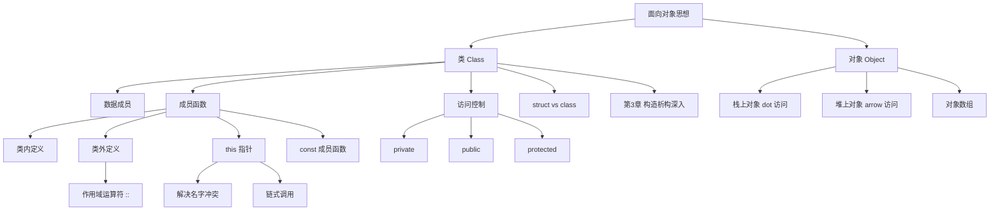

# 类和对象的基本概念（谭浩强第2章）

> 📌 这一章是面向对象编程的**正式起点**。你将学会把"数据"和"操作数据的函数"打包在一起，形成一个独立的、可复用的模块——这就是"类"。如果说第 $1$ 章是认识汽车仪表盘上的按钮，这一章就是学会造一辆汽车。


## 📋 前置知识

在开始之前，你需要了解这些概念（如果不熟悉，先点击链接去补课）：

- [[C++ 的初步知识（谭浩强第1章）]] — 引用、函数重载、`string`、`cout`/`cin` 等基础你得会
- [[C 语言结构体 struct]] — 类是在 `struct` 基础上进化而来的，你需要知道 `struct` 怎么把多个变量组合在一起
- [[指针与数组基础]] — 后面会讲到对象指针、`this` 指针，需要指针基础


## 🤔 为什么要学这个？

想象你在用 C 语言写一个"学生管理系统"。每个学生有姓名、年龄、成绩，你可能会这样组织代码：

```c
// C 语言风格：数据和函数是分离的
struct Student {
    char name[50];
    int age;
    float score;
};

void setStudent(struct Student *s, const char *n, int a, float sc) {
    strcpy(s->name, n);
    s->age = a;
    s->score = sc;
}

void printStudent(struct Student *s) {
    printf("%s, %d岁, %.1f分\n", s->name, s->age, s->score);
}
```

这段代码有几个问题：

**问题一：数据"裸奔"**。任何人都能直接写 `s.age = -100;` 或 `s.score = 99999;`，没有任何保护。一个不合法的值悄悄溜进来，可能在几百行之后才爆发 bug，你根本不知道是在哪里被改坏的。

**问题二：函数和数据的关系是隐性的**。`setStudent` 和 `printStudent` 是专门操作 `Student` 的，但它们只是普通函数——语法上看不出它们和 `Student` 有什么特殊关系。如果你的项目有 $50$ 个结构体，每个有 $10$ 个操作函数，那就是 $500$ 个散落的函数，找都找不到。

**问题三：无法控制初始化**。你创建了一个 `Student` 变量但忘了调用 `setStudent`，它的 `name` 就是一堆乱码，`age` 是个随机数。程序不会提醒你"嘿，你忘了初始化"——它就带着垃圾值继续跑，直到崩溃。

"类"就是为了解决这三个问题而生的：封装（保护数据）、绑定（函数和数据打包）、构造函数（自动初始化）。


## 🧠 核心概念


### 2.1 面向对象的基本思想

> 🎯 **类比**：面向过程编程就像一条**流水线**——你把原材料（数据）放上去，按顺序经过不同的加工步骤（函数），最后得到产品。你关注的是"先做什么、再做什么"。面向对象编程就像一个**工厂**——工厂里有不同的车间（对象），每个车间自己管自己的设备和工人（数据和函数），车间之间通过接口（公有函数）协作。你关注的是"有哪些角色、每个角色能做什么"。

面向对象的核心思路可以用三句话概括：

1. **把数据和操作打包**（封装）— 不让外面随便碰内部数据
2. **通过接口交互**（消息传递）— 对象之间只通过公开的函数沟通
3. **用已有的类创建新类**（继承和多态）— 后面章节会讲

在 C++ 中，实现面向对象的核心工具就是**类（Class）**和**对象（Object）**。


### 2.2 类的声明与定义

> 🎯 **类比**：**类就像一张建筑图纸**。图纸上画了这栋楼有几层、每层有几个房间、每个房间多大。但图纸本身不是楼——你不能住在图纸里。**对象就是按照图纸盖出来的实际的楼**。一张图纸可以盖很多栋一模一样的楼（一个类可以创建多个对象），每栋楼里住的人不同（每个对象的数据不同），但结构完全一样（成员变量和成员函数的定义相同）。

#### 类的声明语法

```cpp
class 类名 {
private:
    // 私有成员：外部不能直接访问
    数据类型 成员变量1;
    数据类型 成员变量2;

public:
    // 公有成员：外部可以访问
    返回类型 成员函数1(参数列表);
    返回类型 成员函数2(参数列表);
};  // ← 注意这个分号！很多人忘记
```

让我们用一个完整的例子来说明。我们要建模一个"时钟"——它有小时、分钟、秒（数据），可以设置时间和显示时间（操作）：

```cpp
#include <iostream>
#include <iomanip>  // 用于 setfill 和 setw，格式化输出
using namespace std;

class Clock {
private:
    // 私有数据成员：只有 Clock 自己的成员函数能访问
    int hour;
    int minute;
    int second;

public:
    // 公有成员函数：这是外部和 Clock 交互的唯一通道
    
    // 设置时间
    void setTime(int h, int m, int s) {
        // 在这里可以做数据验证！这就是封装的价值
        if (h >= 0 && h < 24) hour = h;
        else { cout << "小时不合法！" << endl; hour = 0; }
        
        if (m >= 0 && m < 60) minute = m;
        else { cout << "分钟不合法！" << endl; minute = 0; }
        
        if (s >= 0 && s < 60) second = s;
        else { cout << "秒不合法！" << endl; second = 0; }
    }
    
    // 显示时间
    void showTime() {
        // setfill('0') 用 0 填充，setw(2) 固定宽度 2
        cout << setfill('0') << setw(2) << hour << ":"
             << setw(2) << minute << ":"
             << setw(2) << second << endl;
    }
    
    // 推进一秒
    void tick() {
        second++;
        if (second >= 60) {
            second = 0;
            minute++;
            if (minute >= 60) {
                minute = 0;
                hour++;
                if (hour >= 24) {
                    hour = 0;
                }
            }
        }
    }
};

int main() {
    Clock myClock;               // 创建一个 Clock 对象
    myClock.setTime(23, 59, 58); // 通过公有函数设置时间
    
    myClock.showTime();   // 显示时间
    myClock.tick();       // 推进一秒
    myClock.showTime();
    myClock.tick();       // 再推进一秒
    myClock.showTime();
    myClock.tick();       // 再推进一秒（跨越午夜）
    myClock.showTime();
    
    // myClock.hour = -5;  // ❌ 编译错误！hour 是 private
    
    return 0;
}
```

```bash
clang++ -std=c++17 -o clock clock.cpp && ./clock
```

预期输出：

```text
23:59:58
23:59:59
00:00:00
00:00:01
```

让我们仔细分析这个例子中的每一个关键点。

#### `class` 关键字

`class` 声明了一个新的数据类型。`Clock` 不是一个变量，它是一个**类型**——和 `int`、`double` 一样，是一种类型。你可以用这个类型来创建变量（对象）：`Clock myClock;` 就像 `int x;` 一样。

#### `private` 和 `public`

这是**访问控制**（Access Control），也叫**访问修饰符**（Access Specifier）。它们控制类的成员（数据和函数）谁能访问：

- `private`：只有**本类的成员函数**能访问。外部代码（比如 `main` 函数）不能直接读写。这就是"封装"的核心——把数据保护起来。
- `public`：**任何代码**都能访问。这是类对外暴露的"接口"。

如果你不写任何访问修饰符，`class` 的成员**默认是 `private`**（这和 `struct` 不同——`struct` 默认是 `public`）。

> ❌ **误区**："`private` 意味着每个对象都有自己的私有空间，别的对象不能访问"——**错！**`private` 是**类级别**的限制，不是对象级别的。同一个类的不同对象之间，在成员函数内部可以互相访问 `private` 成员。比如：

```cpp
class Point {
private:
    double x, y;
public:
    Point(double a, double b) : x(a), y(b) {}
    
    // other 也是 Point 类型，虽然 x、y 是 private，
    // 但在 Point 的成员函数中可以访问 other 的 private 成员！
    double distanceTo(const Point &other) {
        double dx = x - other.x;  // ✅ 合法！同类访问
        double dy = y - other.y;
        return sqrt(dx * dx + dy * dy);
    }
};
```

#### 为什么封装如此重要

回到 Clock 的例子。如果 `hour` 是 `public` 的，任何人都能写 `myClock.hour = -999;`，时钟就废了。但通过 `setTime` 函数，我们在入口处做了**验证**——不合法的值进不来。

这就像银行不会让你直接走进金库改账本上的数字。你只能通过柜台（公有函数）办理业务，柜台会验证你的身份和金额是否合法。

封装的好处：
1. **数据安全** — 不合法的值被拦截在入口
2. **便于修改** — 以后如果 `hour` 的存储方式变了（比如改成 $24$ 小时制改 $12$ 小时制），只需要改类内部，外部调用 `setTime`/`showTime` 的代码完全不用改
3. **降低耦合** — 外部代码只依赖公有接口，不依赖内部实现细节

理解了类的声明和访问控制后，我们来看成员函数可以在哪里定义。


### 2.3 成员函数的定义方式

成员函数有两种定义方式：**类内定义**和**类外定义**。

#### 方式一：类内定义（Inline Definition）

直接在类的声明体内写出函数体。上面 Clock 的例子就是这种方式。类内定义的函数会被编译器**隐式地当作内联函数**（`inline`），适合短小的函数。

```cpp
class Rect {
private:
    double width, height;
public:
    // 类内定义 —— 自动被当作 inline
    double area() {
        return width * height;
    }
};
```

#### 方式二：类外定义（Out-of-Class Definition）

在类内只写函数**声明**（函数原型），在类外面写函数**定义**（函数体）。这是更常见的做法，尤其当函数体比较长的时候。类外定义需要用**作用域解析运算符 `::`** 来指明函数属于哪个类。

```cpp
#include <iostream>
using namespace std;

class Rect {
private:
    double width, height;

public:
    void setSize(double w, double h);  // 类内只写声明
    double area();                      // 类内只写声明
    double perimeter();                 // 类内只写声明
    void display();                     // 类内只写声明
};

// 类外定义：用 类名::函数名 的形式
void Rect::setSize(double w, double h) {
    if (w > 0 && h > 0) {
        width = w;
        height = h;
    } else {
        cout << "尺寸必须为正数！" << endl;
        width = height = 1.0;
    }
}

double Rect::area() {
    return width * height;
}

double Rect::perimeter() {
    return 2 * (width + height);
}

void Rect::display() {
    cout << "矩形: " << width << " x " << height
         << ", 面积 = " << area()           // 成员函数内部可以直接调用其他成员函数
         << ", 周长 = " << perimeter() << endl;
}

int main() {
    Rect r1;
    r1.setSize(5.0, 3.0);
    r1.display();
    
    Rect r2;
    r2.setSize(10.0, 4.0);
    r2.display();
    
    return 0;
}
```

```bash
clang++ -std=c++17 -o rect rect.cpp && ./rect
```

预期输出：

```text
矩形: 5 x 3, 面积 = 15, 周长 = 16
矩形: 10 x 4, 面积 = 40, 周长 = 28
```

#### `::` 作用域解析运算符

`Rect::area()` 的意思是"属于 `Rect` 这个类的 `area` 函数"。没有 `Rect::` 前缀的话，编译器会把 `area()` 当作一个普通的全局函数，而不是 `Rect` 的成员函数。

一个很好的类比：`Rect::area()` 就像说"数学系的张老师"，而不是只说"张老师"（可能有很多张老师）。`::` 就是那个"数学系的"修饰。

> ⚠️ **踩坑**：类外定义的函数不再自动 `inline`。如果你希望类外定义的函数也是内联的，需要**显式加 `inline` 关键字**。但一般来说，短函数类内定义，长函数类外定义，不需要刻意加 `inline`。

#### 实际项目中的文件组织

在实际项目中，通常把类的**声明**放在头文件 `.h` 中，把成员函数的**定义**放在源文件 `.cpp` 中：

```text
Rect.h  — class Rect { ... };     （声明）
Rect.cpp — void Rect::setSize(...) { ... }  （定义）
main.cpp — #include "Rect.h"      （使用）
```

这样做的好处是：使用 `Rect` 的代码只需要 `#include "Rect.h"`，不需要看到函数体的实现细节，真正做到了"接口与实现分离"。

了解了类的声明和成员函数的定义方式后，最重要的问题来了：怎么创建和使用对象？


### 2.4 对象的创建与使用

> 🎯 **类比**：如果类是"饼干模具"，对象就是"用模具压出来的饼干"。每块饼干形状一样（结构相同），但上面的巧克力豆可以不同（数据值不同）。模具本身不能吃（类本身不存储数据），只有压出来的饼干才有实体（对象才占内存空间）。

#### 创建对象的几种方式

```cpp
#include <iostream>
#include <string>
using namespace std;

class Dog {
private:
    string name;
    int age;

public:
    void setInfo(string n, int a) {
        name = n;
        age = a;
    }
    
    void bark() {
        cout << name << "（" << age << "岁）: 汪汪汪！" << endl;
    }
};

int main() {
    // 方式 1：直接声明（栈上创建，最常用）
    Dog dog1;
    dog1.setInfo("旺财", 3);
    dog1.bark();
    
    // 方式 2：创建对象数组
    Dog dogs[3];
    dogs[0].setInfo("小白", 2);
    dogs[1].setInfo("大黄", 5);
    dogs[2].setInfo("花花", 1);
    for (int i = 0; i < 3; i++) {
        dogs[i].bark();
    }
    
    // 方式 3：用 new 在堆上创建（返回指针）
    Dog *pDog = new Dog;       // 动态创建
    pDog->setInfo("阿福", 4);  // 指针用 -> 访问成员
    pDog->bark();
    delete pDog;               // 用完必须 delete，否则内存泄漏
    
    return 0;
}
```

```bash
clang++ -std=c++17 -o dog dog.cpp && ./dog
```

预期输出：

```text
旺财（3岁）: 汪汪汪！
小白（2岁）: 汪汪汪！
大黄（5岁）: 汪汪汪！
花花（1岁）: 汪汪汪！
阿福（4岁）: 汪汪汪！
```

#### `.` 和 `->` 的区别

访问对象的成员有两种语法：

- **对象用 `.`（点号）**：`dog1.bark();`
- **指针用 `->`（箭头）**：`pDog->bark();`

`pDog->bark()` 实际上是 `(*pDog).bark()` 的简写——先解引用指针得到对象，再用 `.` 访问成员。`->` 只是一个语法糖（Syntactic Sugar，让代码写起来更方便的语法）。

> ⚠️ **踩坑**：用 `new` 创建的对象必须手动 `delete`，否则内存泄漏。栈上创建的对象（如 `Dog dog1;`）不需要手动释放——离开作用域时自动销毁。这个"自动销毁"的机制和后面要学的析构函数（[[关于类和对象的进一步讨论（谭浩强第3章）]]）密切相关。


### 2.5 对象的内存结构

一个很自然的问题：每个对象在内存中占多少空间？成员函数占不占对象的空间？

**答案是：对象只存储数据成员，不存储成员函数。**

```cpp
#include <iostream>
using namespace std;

class Empty {
    // 空类
};

class OnlyData {
private:
    int x;
    double y;
};

class WithFunctions {
private:
    int x;
    double y;
public:
    void setX(int val) { x = val; }
    void setY(double val) { y = val; }
    void display() { cout << x << " " << y << endl; }
};

int main() {
    cout << "空类的大小: " << sizeof(Empty) << " 字节" << endl;
    cout << "只有数据的类: " << sizeof(OnlyData) << " 字节" << endl;
    cout << "有数据+函数的类: " << sizeof(WithFunctions) << " 字节" << endl;
    return 0;
}
```

```bash
clang++ -std=c++17 -o size_demo size_demo.cpp && ./size_demo
```

预期输出（在 macOS M3 上，$64$ 位系统）：

```text
空类的大小: 1 字节
只有数据的类: 16 字节
有数据+函数的类: 16 字节
```

**关键发现**：

1. **空类的大小是 $1$ 字节**——不是 $0$。C++ 标准规定每个对象都必须有独立的地址，所以空类至少占 $1$ 字节，这样两个不同的空类对象才能有不同的地址。

2. **`OnlyData` 和 `WithFunctions` 大小一样**——说明成员函数**不占对象的内存空间**。所有同类的对象共享同一份函数代码（函数代码存在代码段，不在对象里）。

3. **`OnlyData` 是 $16$ 字节而不是 $12$ 字节**（$4$ + $8$ = $12$）——这是因为**内存对齐**（Memory Alignment）。`double` 要求 $8$ 字节对齐，所以 `int`（$4$ 字节）后面填充了 $4$ 字节的 padding，让 `double` 的起始地址是 $8$ 的倍数。内存对齐是为了提高 CPU 访问效率。

> 💡 **为什么成员函数不占对象空间**：想想看，$1000$ 个 `Dog` 对象的 `bark()` 函数逻辑完全一样，只是操作的数据不同。如果每个对象都存一份函数代码，那就浪费了 $999$ 份空间。所以编译器只存一份函数代码，每次调用时通过隐藏的 `this` 指针告诉函数"你现在操作的是哪个对象的数据"。


### 2.6 `this` 指针 —— "我是谁？"

> 🎯 **类比**：你和你的同事都有一个"打印自己工牌"的技能。你打印出来的是你的名字，同事打印出来的是同事的名字——同一个技能，但结果不同。为什么？因为每次使用这个技能时，你心里知道"我是我自己"。`this` 指针就是成员函数心里的那个"我"——它指向**调用这个函数的那个对象**。

#### `this` 是什么

每个成员函数（非静态的）都有一个隐藏的参数叫 `this`，它是一个指针，指向**调用该函数的对象**。编译器自动传入，你不需要显式声明，但可以在函数体内使用它。

```cpp
#include <iostream>
using namespace std;

class Student {
private:
    string name;
    int score;

public:
    void setInfo(string name, int score) {
        // 这里的 name 和 score 既是参数名，也是成员变量名，产生了"名字冲突"
        // 编译器默认使用参数（局部变量优先）
        // 要访问成员变量，必须用 this-> 明确指定
        this->name = name;     // this->name 是成员变量，name 是参数
        this->score = score;   // this->score 是成员变量，score 是参数
    }
    
    void display() {
        // 这里没有名字冲突，this-> 可以省略（但写了也没错）
        cout << name << ": " << score << "分" << endl;
        // 等价于：cout << this->name << ": " << this->score << "分" << endl;
    }
    
    // 返回对象自身的引用 —— this 的经典用法，可以实现"链式调用"
    Student& addScore(int bonus) {
        score += bonus;
        return *this;  // *this 就是"当前对象本身"（解引用 this 指针）
    }
};

int main() {
    Student s;
    s.setInfo("小明", 80);
    
    // 链式调用：addScore 返回对象自身的引用，所以可以连续调用
    s.addScore(5).addScore(10).addScore(3);
    
    s.display();
    return 0;
}
```

```bash
clang++ -std=c++17 -o this_demo this_demo.cpp && ./this_demo
```

预期输出：

```text
小明: 98分
```

#### `this` 的本质

编译器在编译成员函数时，会自动给每个非静态成员函数加上一个隐藏参数。比如：

```cpp
// 你写的代码
void Student::setInfo(string name, int score) {
    this->name = name;
}

// 编译器实际处理的（伪代码，帮助理解）
void Student::setInfo(Student *this, string name, int score) {
    this->name = name;
}
```

调用 `s.setInfo("小明", 80)` 时，编译器实际上调用的是 `Student::setInfo(&s, "小明", 80)`。所以 `this` 就是 `&s`——指向调用对象的指针。

#### `this` 的三个常见用途

1. **解决成员变量和参数同名的冲突**（上面例子中的 `this->name = name;`）
2. **返回对象自身的引用，实现链式调用**（上面例子中的 `return *this;`）
3. **把当前对象作为参数传给其他函数**（`someFunction(*this);`）

> ⚠️ **踩坑**：`this` 是一个**常量指针**——你不能修改 `this` 本身的值（`this = nullptr;` ❌），但可以通过 `this` 修改它所指向的对象的成员。在 `const` 成员函数中，`this` 的类型是 `const 类名 *`，连指向的对象也不能修改。

> 💡 **命名规范建议**：为了避免参数和成员变量同名的麻烦，很多 C++ 程序员会给成员变量加前缀或后缀，比如 `m_name`（前缀 `m_`）或 `name_`（后缀 `_`），这样就不需要到处写 `this->`。谭浩强的书中没有使用这个规范，但它在实际项目中非常常见。


### 2.7 `struct` 与 `class` 的关系

> 🎯 **类比**：`struct` 和 `class` 就像"商务舱"和"经济舱"——飞机是同一架，座位也差不多，只是**默认服务不同**。`struct` 默认什么都公开（`public`），`class` 默认什么都私有（`private`）。除此之外，它们**几乎完全一样**。

```cpp
#include <iostream>
using namespace std;

struct PointS {
    // struct 的成员默认是 public
    double x, y;
    
    void display() {
        cout << "(" << x << ", " << y << ")" << endl;
    }
};

class PointC {
    // class 的成员默认是 private
    double x, y;   // 这两个默认是 private！

public:
    void setXY(double a, double b) { x = a; y = b; }
    void display() {
        cout << "(" << x << ", " << y << ")" << endl;
    }
};

int main() {
    PointS ps;
    ps.x = 3.0;    // ✅ struct 默认 public，可以直接访问
    ps.y = 4.0;
    ps.display();
    
    PointC pc;
    // pc.x = 3.0;  // ❌ class 默认 private，不能直接访问
    pc.setXY(3.0, 4.0);  // ✅ 通过 public 函数访问
    pc.display();
    
    return 0;
}
```

预期输出：

```text
(3, 4)
(3, 4)
```

在 C++ 中，`struct` 也可以有成员函数、构造函数、析构函数、继承——它和 `class` 的唯一区别就是默认访问权限。实际项目中的惯例是：**纯数据容器用 `struct`**（所有成员 `public`），**有封装逻辑的用 `class`**（有 `private` 数据 + `public` 接口）。

> ❌ **误区**："`struct` 只能有数据不能有函数"——这是 C 语言的限制，在 C++ 中不成立。C++ 的 `struct` 和 `class` 功能完全一样。


### 2.8 类的综合示例：学生成绩管理

我们用一个更完整的例子来综合运用本章学到的所有知识点。这个例子展示了封装、成员函数、`this` 指针、对象数组的综合应用：

```cpp
#include <iostream>
#include <string>
#include <iomanip>
using namespace std;

class Student {
private:
    string name;
    int id;
    float scores[3];       // 三门课成绩
    float average;          // 平均分（内部计算，不对外暴露计算过程）

    // 私有成员函数：只在类内部使用的工具函数
    void calcAverage() {
        float sum = 0;
        for (int i = 0; i < 3; i++) {
            sum += scores[i];
        }
        average = sum / 3.0f;
    }

public:
    // 设置学生信息
    void setInfo(string n, int i, float s1, float s2, float s3) {
        name = n;
        id = i;
        
        // 验证分数范围
        float temp[3] = {s1, s2, s3};
        for (int j = 0; j < 3; j++) {
            if (temp[j] >= 0 && temp[j] <= 100) {
                scores[j] = temp[j];
            } else {
                cout << name << " 的第 " << (j + 1) << " 门成绩不合法，设为 0" << endl;
                scores[j] = 0;
            }
        }
        
        calcAverage();  // 设置完成绩后自动计算平均分
    }
    
    // 获取平均分
    float getAverage() {
        return average;
    }
    
    // 获取姓名
    string getName() {
        return name;
    }
    
    // 显示详细信息
    void display() {
        cout << "学号: " << id << "  姓名: " << left << setw(8) << name
             << "  成绩: " << scores[0] << " / " << scores[1] << " / " << scores[2]
             << "  平均分: " << fixed << setprecision(1) << average << endl;
    }
    
    // 比较两个学生的平均分（用到了同类对象访问 private 成员）
    bool isBetterThan(Student &other) {
        return this->average > other.average;  // 同类可以访问 private！
    }
};

int main() {
    const int N = 4;
    Student students[N];
    
    students[0].setInfo("张三", 1001, 85, 92, 78);
    students[1].setInfo("李四", 1002, 90, 88, 95);
    students[2].setInfo("王五", 1003, 76, 81, 70);
    students[3].setInfo("赵六", 1004, 95, 98, 92);
    
    cout << "\n===== 学生成绩表 =====" << endl;
    for (int i = 0; i < N; i++) {
        students[i].display();
    }
    
    // 找出平均分最高的学生
    int bestIndex = 0;
    for (int i = 1; i < N; i++) {
        if (students[i].isBetterThan(students[bestIndex])) {
            bestIndex = i;
        }
    }
    
    cout << "\n成绩最好的学生是: " << students[bestIndex].getName()
         << "，平均分: " << fixed << setprecision(1) 
         << students[bestIndex].getAverage() << endl;
    
    return 0;
}
```

```bash
clang++ -std=c++17 -o student_mgr student_mgr.cpp && ./student_mgr
```

预期输出：

```text

===== 学生成绩表 =====
学号: 1001  姓名: 张三        成绩: 85 / 92 / 78  平均分: 85.0
学号: 1002  姓名: 李四        成绩: 90 / 88 / 95  平均分: 91.0
学号: 1003  姓名: 王五        成绩: 76 / 81 / 70  平均分: 75.7
学号: 1004  姓名: 赵六        成绩: 95 / 98 / 92  平均分: 95.0

成绩最好的学生是: 赵六，平均分: 95.0
```

这个例子中有几个值得注意的设计：

1. **`calcAverage()` 是私有函数**——外部不需要知道平均分是怎么算的，调用 `setInfo` 时会自动计算。这就是封装的体现。
2. **`isBetterThan` 函数访问了另一个 `Student` 对象的 `private` 成员** `average`——合法，因为是同类。
3. **数据验证在 `setInfo` 中完成**——不合法的成绩被拦截在入口，后续的计算和比较都不需要担心数据质量。


### 2.9 对象的赋值与拷贝（初步）

当你写 `Student s2 = s1;` 或 `Student s2; s2 = s1;` 时，会发生什么？

默认情况下，C++ 会做**成员逐一复制**——把 `s1` 的每个数据成员的值复制给 `s2` 对应的成员。这叫**浅拷贝**（Shallow Copy）。

```cpp
#include <iostream>
using namespace std;

class Box {
public:
    double width, height;
    
    void display() {
        cout << width << " x " << height << endl;
    }
};

int main() {
    Box b1;
    b1.width = 5.0;
    b1.height = 3.0;
    
    Box b2 = b1;   // 拷贝：b2 的 width 和 height 和 b1 一样
    b2.display();   // 5 x 3
    
    b2.width = 10.0;  // 修改 b2 不影响 b1（它们是独立的副本）
    b1.display();      // 5 x 3（b1 没变）
    b2.display();      // 10 x 3
    
    return 0;
}
```

预期输出：

```text
5 x 3
5 x 3
10 x 3
```

对于简单类（成员都是基本类型或 `string`），默认的浅拷贝没有问题。但如果类中有**指针成员**（指向动态分配的内存），浅拷贝就会出大问题——两个对象共享同一块内存，析构时双重释放导致崩溃。这个问题将在 [[关于类和对象的进一步讨论（谭浩强第3章）]] 中深入讨论拷贝构造函数和深拷贝。

> 💡 **提醒**：目前阶段你只需要知道"默认赋值是逐成员复制"就够了，深拷贝的问题留到第 $3$ 章。


### 2.10 类的封装设计原则

在学完了类的基本语法后，让我们总结一下"怎样设计一个好的类"——这比语法更重要。

**原则一：数据成员一律 `private`**

除非有非常充分的理由（比如纯数据容器 `struct`），否则所有数据成员都应该是 `private`。通过公有的 `get`/`set` 函数来访问数据。

```cpp
class Temperature {
private:
    double celsius;  // 内部统一用摄氏度存储

public:
    // getter：获取温度
    double getCelsius() const { return celsius; }
    double getFahrenheit() const { return celsius * 9.0 / 5.0 + 32; }
    
    // setter：设置温度（带验证）
    void setCelsius(double c) {
        if (c >= -273.15) {  // 绝对零度检查
            celsius = c;
        } else {
            cout << "温度不能低于绝对零度！" << endl;
        }
    }
    
    void setFahrenheit(double f) {
        setCelsius((f - 32) * 5.0 / 9.0);  // 转成摄氏度存储
    }
};
```

这个设计的巧妙之处在于：内部只存摄氏度，但对外同时提供摄氏和华氏两种接口。以后如果内部改成存华氏度，只要 `getCelsius` 和 `setCelsius` 的逻辑改一下，外部代码完全不受影响。

**原则二：`const` 成员函数**

如果一个成员函数**不修改任何数据成员**，就应该在函数声明后加 `const`。这不仅是一种文档（告诉调用者"这个函数不会改变对象状态"），还能让 `const` 对象调用这个函数。

```cpp
class Circle {
private:
    double radius;
public:
    Circle(double r) : radius(r) {}
    
    // const 成员函数：不修改对象的任何数据
    double area() const {
        return 3.14159 * radius * radius;
        // radius = 10;  // ❌ 编译错误！const 函数不能修改成员
    }
    
    // 非 const 函数：可以修改数据
    void setRadius(double r) {
        radius = r;
    }
};

int main() {
    const Circle c(5.0);  // const 对象
    cout << c.area() << endl;  // ✅ const 对象可以调用 const 函数
    // c.setRadius(10);         // ❌ const 对象不能调用非 const 函数
    return 0;
}
```

> ⚠️ **踩坑**：如果你忘记给 `area()` 加 `const`，那 `const Circle c(5.0);` 调用 `c.area()` 会编译报错——编译器不确定 `area()` 是否会修改对象，为了安全就禁止了。**养成习惯：所有不修改对象状态的成员函数都加 `const`。**

**原则三：接口最小化**

只暴露必要的公有函数，不要把所有函数都 `public`。每多一个公有函数，就多一个你需要永远维护的接口。用户看到的接口越少，你修改内部实现的自由度就越大。


## ⚠️ 常见误区与踩坑点

> ❌ **误区 1：对象和类搞混**  
> 初学者经常分不清"类"和"对象"。记住：**类是类型（图纸），对象是变量（实体）**。`int` 是类型，`int x = 5;` 中的 `x` 是变量。`Student` 是类型，`Student s1;` 中的 `s1` 是对象。你不能 `Student.display();`——类型本身不能调用成员函数，只有对象才能。

> ❌ **误区 2：以为 `private` 的数据"不存在"**  
> `private` 只是限制了**访问权限**，数据仍然在对象中占内存。`sizeof(对象)` 包含所有数据成员（不管是 `private` 还是 `public`），不包含成员函数。

> ⚠️ **踩坑 3：类定义末尾忘记加分号**  
> `class Foo { ... }` 后面必须有分号 `;`。忘了的话，编译器会给出一个看起来完全不相关的错误提示（通常指向下面几行），让你一头雾水。这是 C++ 从 C 的 `struct` 继承来的语法规则。

> ⚠️ **踩坑 4：未初始化的成员变量**  
> 在没有构造函数的情况下（构造函数是第 $3$ 章的内容），创建一个对象后，它的成员变量是**未初始化的垃圾值**。如果你在 `setInfo` 之前就调用 `display`，打印出的是随机乱码。这就是为什么我们在后面要学构造函数——它保证对象一出生就有合法的值。

> ⚠️ **踩坑 5：在类内定义函数时的编译依赖问题**  
> 如果类 `A` 的函数体内使用了类 `B`，而类 `B` 在类 `A` 之后才定义，编译会失败。解决方法：用**前向声明**（Forward Declaration）`class B;` 告诉编译器"B 是一个类，我后面会定义"，然后把 `A` 中需要用到 `B` 细节的函数放到类外（`B` 定义之后）去定义。


## 🔄 概念对比

### 面向过程 vs 面向对象

| 对比项 | 面向过程（C 风格） | 面向对象（C++ 类） |
|--------|-------------------|--------------------|
| 核心单位 | 函数 | 对象（数据 + 函数） |
| 数据保护 | 无（全局变量谁都能改） | 有（`private` 封装） |
| 数据和函数的关系 | 分离的（你得记住哪个函数操作哪个数据） | 绑定的（函数属于类） |
| 初始化保障 | 无（靠程序员自觉） | 有（构造函数自动调用） |
| 代码组织 | 按功能拆分函数 | 按实体/角色拆分类 |
| 适用场景 | 小程序、底层系统 | 中大型程序、GUI、游戏 |

> 💡 **一句话总结**：面向过程关注"怎么做"（动词），面向对象关注"谁来做"（名词）。

### `class` vs `struct`

| 对比项 | `class` | `struct` |
|--------|---------|----------|
| 默认访问权限 | `private` | `public` |
| 默认继承方式 | `private` 继承 | `public` 继承 |
| 能否有成员函数 | 可以 | 可以 |
| 能否有构造/析构函数 | 可以 | 可以 |
| 能否继承 | 可以 | 可以 |
| 使用习惯 | 有封装逻辑的"真正的类" | 纯数据容器（POD 类型） |

> 💡 **一句话总结**：在 C++ 中 `struct` 和 `class` 功能完全一样，唯一区别是默认的访问权限和继承方式。


## 🏋️ 动手练习

### 练习 1：设计一个日期类（⭐ 难度）

**题目**：创建一个 `Date` 类，包含私有成员 `year`、`month`、`day`。提供 `setDate` 函数（带合法性验证：月 $1$-$12$，日 $1$-$31$）和 `display` 函数（格式：`YYYY-MM-DD`）。

**参考答案**：

```cpp
#include <iostream>
#include <iomanip>
using namespace std;

class Date {
private:
    int year, month, day;

public:
    void setDate(int y, int m, int d) {
        year = y;
        
        if (m >= 1 && m <= 12) month = m;
        else { cout << "月份不合法！" << endl; month = 1; }
        
        if (d >= 1 && d <= 31) day = d;
        else { cout << "日期不合法！" << endl; day = 1; }
    }
    
    void display() const {
        cout << year << "-" 
             << setfill('0') << setw(2) << month << "-" 
             << setw(2) << day << endl;
    }
};

int main() {
    Date d1;
    d1.setDate(2026, 4, 5);
    d1.display();
    
    Date d2;
    d2.setDate(2026, 13, 5);  // 月份不合法
    d2.display();
    
    return 0;
}
```

```bash
clang++ -std=c++17 -o date date.cpp && ./date
```

预期输出：

```text
2026-04-05
月份不合法！
2026-01-05
```


### 练习 2：用 `this` 指针实现链式调用（⭐⭐ 难度）

**题目**：创建一个 `StringBuilder` 类，包含私有成员 `string content`。提供 `append(string s)` 和 `prepend(string s)` 函数，都返回 `StringBuilder&`（自身引用），实现链式调用。最后提供 `toString()` 函数返回最终字符串。

**参考答案**：

```cpp
#include <iostream>
#include <string>
using namespace std;

class StringBuilder {
private:
    string content;

public:
    // 返回自身引用，支持链式调用
    StringBuilder& append(const string &s) {
        content += s;
        return *this;
    }
    
    StringBuilder& prepend(const string &s) {
        content = s + content;
        return *this;
    }
    
    string toString() const {
        return content;
    }
};

int main() {
    StringBuilder sb;
    
    // 链式调用：每个函数返回 *this，所以可以连续调用
    string result = sb.append("World")
                      .prepend("Hello, ")
                      .append("!")
                      .toString();
    
    cout << result << endl;
    return 0;
}
```

```bash
clang++ -std=c++17 -o sb sb.cpp && ./sb
```

预期输出：

```text
Hello, World!
```


### 练习 3：对象数组与查找（⭐⭐ 难度）

**题目**：创建一个 `Product` 类（名称、价格），创建 $5$ 个产品的对象数组，编写一个**非成员函数** `findMostExpensive(Product products[], int n)` 来找出最贵的产品并输出。思考：这个函数能否直接访问 `Product` 的 `private` 成员？如果不能，怎么解决？

**参考答案**：

```cpp
#include <iostream>
#include <string>
using namespace std;

class Product {
private:
    string name;
    double price;

public:
    void setInfo(const string &n, double p) {
        name = n;
        price = (p >= 0) ? p : 0;
    }
    
    // 提供 public 的 getter 函数 —— 让外部函数能获取信息
    string getName() const { return name; }
    double getPrice() const { return price; }
    
    void display() const {
        cout << name << ": ¥" << price << endl;
    }
};

// 非成员函数：不能直接访问 private，但可以通过 public 的 getter 访问
void findMostExpensive(Product products[], int n) {
    int maxIndex = 0;
    for (int i = 1; i < n; i++) {
        // 通过 getPrice() 获取价格，而不是直接访问 price
        if (products[i].getPrice() > products[maxIndex].getPrice()) {
            maxIndex = i;
        }
    }
    cout << "最贵的产品是: ";
    products[maxIndex].display();
}

int main() {
    Product products[5];
    products[0].setInfo("键盘", 299);
    products[1].setInfo("鼠标", 149);
    products[2].setInfo("显示器", 2499);
    products[3].setInfo("耳机", 599);
    products[4].setInfo("摄像头", 399);
    
    cout << "===== 产品列表 =====" << endl;
    for (int i = 0; i < 5; i++) {
        products[i].display();
    }
    
    cout << endl;
    findMostExpensive(products, 5);
    
    return 0;
}
```

```bash
clang++ -std=c++17 -o product product.cpp && ./product
```

预期输出：

```text
===== 产品列表 =====
键盘: ¥299
鼠标: ¥149
显示器: ¥2499
耳机: ¥599
摄像头: ¥399

最贵的产品是: 显示器: ¥2499
```

这个练习的核心教训是：**非成员函数不能直接访问类的 `private` 成员，必须通过 `public` 的 getter 函数间接访问**。如果你不想写 getter，另一种选择是把外部函数声明为类的**友元函数**（`friend`），但那样会破坏封装性——[[C++ 面向对象程序设计（第四版）全书精要]] 中有介绍友元。


## 📝 总结

### 本篇要点回顾

1. **类 = 数据 + 函数的打包体**。类是用户自定义的数据类型，对象是类的实例（变量）。类是图纸，对象是按图纸盖出来的楼。

2. **封装是 OOP 的第一大支柱**。`private` 保护数据不被外部随意修改，`public` 提供受控的访问接口。数据验证在 `setter` 函数中完成，保证数据始终合法。

3. **成员函数可以类内定义或类外定义**。类外定义用 `类名::函数名` 语法。实际项目中声明放 `.h`、定义放 `.cpp`，做到接口与实现分离。

4. **对象的内存只包含数据成员，不包含函数**。所有对象共享一份函数代码，通过隐藏的 `this` 指针区分"当前是哪个对象在调用"。

5. **`this` 指针指向调用函数的对象**。三个用途：解决名字冲突、实现链式调用、把自身传给其他函数。

6. **`struct` 和 `class` 在 C++ 中几乎一样**，唯一区别是默认访问权限（`struct` 默认 `public`，`class` 默认 `private`）。

7. **`const` 成员函数不修改对象状态**——养成习惯：所有不改数据的函数都加 `const`。


### 知识图谱




## 🔗 相关链接

- 上级概念：[[C++ 面向对象程序设计全书精要]]、[[面向对象编程思想]]
- 前置章节：[[C++ 的初步知识（谭浩强第1章）]]
- 后续章节：[[关于类和对象的进一步讨论（谭浩强第3章）]] — 构造函数、析构函数、拷贝构造函数、静态成员、友元
- 同级概念：[[C 语言结构体 struct]]
- 下级概念：[[C++ 封装设计原则]]、[[C++ this 指针详解]]、[[C++ const 成员函数]]


## 📚 参考资料

- 谭浩强《C++ 面向对象程序设计（第四版）》第 $2$ 章，清华大学出版社，2024
- [C++ Reference - Classes](https://en.cppreference.com/w/cpp/language/classes) — 类的完整语法参考
- [Learn C++ - Classes and Objects](https://www.learncpp.com/cpp-tutorial/introduction-to-classes/) — 英文教程，有大量练习
- [C++ Core Guidelines - C.1-C.9](https://isocpp.github.io/CppCoreGuidelines/CppCoreGuidelines#S-class) — 类的设计指南
