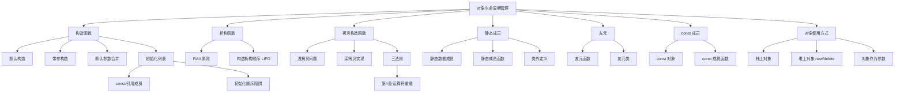

# 关于类和对象的进一步讨论（谭浩强第3章）

> 📌 如果说第 $2$ 章教你"怎么造一辆车"，这一章教你"怎么让车自动启动（构造函数）、自动熄火（析构函数）、克隆一辆一模一样的车（拷贝构造函数）、所有车共享同一个 GPS 信号（静态成员）、以及给修理工开特殊权限（友元）"。这是 C++ 面向对象中**细节最多、坑最密集**的一章。


## 📋 前置知识

在开始之前，你需要了解这些概念（如果不熟悉，先点击链接去补课）：

- [[类和对象的基本概念（谭浩强第2章）]] — 类的声明、`private`/`public`、成员函数、`this` 指针你得会
- [[C++ 的初步知识（谭浩强第1章）]] — 引用、函数重载、`new`/`delete`
- [[指针与动态内存基础]] — 本章的拷贝构造函数、析构函数与动态内存管理密切相关


## 🤔 为什么要学这个？

在第 $2$ 章中，我们每次创建一个对象后，都需要手动调用 `setInfo()` 来初始化数据。这有三个问题：

**问题一：容易忘记初始化。** 你创建了 `Student s;` 然后直接调用 `s.display()`——打印出来的是垃圾值。程序不会提醒你"你忘了初始化"。

**问题二：无法在创建时直接赋值。** 你不能写 `Student s("张三", 20, 95);` 这样优雅的一行代码来创建并初始化对象——第 $2$ 章的类还做不到这一点。

**问题三：如果对象持有动态内存，谁来释放？** 假设你的类内部用 `new` 分配了一块内存，当对象销毁时，如果没人调用 `delete`，这块内存就泄漏了。你能指望用户记住每次手动释放吗？不能。

构造函数解决了问题一和问题二（对象一出生就自动初始化），析构函数解决了问题三（对象销毁时自动清理资源）。这一章的所有知识点都围绕着一个核心主题：**对象的生命周期管理**。


## 🧠 核心概念


### 3.1 构造函数（Constructor）

> 🎯 **类比**：构造函数就像医院的**出生登记处**。每个新生儿（对象）一出生，护士（编译器）就自动带 ta 去登记处填写出生信息（初始化数据成员）。你不需要自己去——**这是强制的、自动的**。不管你记不记得要初始化，构造函数都会执行。

#### 构造函数的基本规则

构造函数有四个特殊之处：

1. **函数名与类名相同** — `class Student` 的构造函数就叫 `Student()`
2. **没有返回值类型** — 连 `void` 都不写（不是返回 `void`，是压根没有返回值这个概念）
3. **对象创建时自动调用** — 你不能手动调用构造函数（`s.Student()` ❌）
4. **可以重载** — 可以有多个构造函数，参数列表不同

```cpp
#include <iostream>
#include <string>
using namespace std;

class Student {
private:
    string name;
    int age;
    float score;

public:
    // 构造函数 1：无参数（默认构造函数）
    Student() {
        name = "未命名";
        age = 0;
        score = 0;
        cout << "[构造] 默认构造: " << name << endl;
    }
    
    // 构造函数 2：带全部参数
    Student(string n, int a, float s) {
        name = n;
        age = a;
        score = s;
        cout << "[构造] 带参构造: " << name << endl;
    }
    
    // 构造函数 3：只有名字，其他用默认值
    Student(string n) {
        name = n;
        age = 18;     // 默认 18 岁
        score = 0;    // 默认 0 分
        cout << "[构造] 只有名字: " << name << endl;
    }
    
    void display() const {
        cout << name << ", " << age << "岁, " << score << "分" << endl;
    }
};

int main() {
    Student s1;                         // 调用构造函数 1（无参）
    Student s2("李四", 20, 88.5);      // 调用构造函数 2（三个参数）
    Student s3("王五");                 // 调用构造函数 3（一个参数）
    
    cout << "\n--- 信息展示 ---" << endl;
    s1.display();
    s2.display();
    s3.display();
    
    return 0;
}
```

```bash
clang++ -std=c++17 -o ctor ctor.cpp && ./ctor
```

预期输出：

```text
[构造] 默认构造: 未命名
[构造] 带参构造: 李四
[构造] 只有名字: 王五

--- 信息展示 ---
未命名, 0岁, 0分
李四, 20岁, 88.5分
王五, 18岁, 0分
```

> ⚠️ **致命踩坑：调用无参构造函数时不要加括号！**

```cpp
Student s1;      // ✅ 正确：调用无参构造函数
Student s2();    // ❌ 这不是创建对象！编译器会把它当成一个"函数声明"
                 //    声明了一个叫 s2 的函数，返回值类型是 Student，没有参数
```

这是 C++ 最臭名昭著的语法陷阱之一，叫 **Most Vexing Parse**（最令人烦恼的解析）。编译器不会报错，但 `s2` 根本不是一个对象，后续用 `s2.display()` 会报错。


#### 默认构造函数与编译器的隐式行为

**如果你一个构造函数都不写**，编译器会自动生成一个**默认构造函数**——它什么都不做（不初始化任何成员变量，成员变量保持垃圾值）。

**但是！一旦你写了任何一个构造函数**，编译器就**不再自动生成**默认构造函数。这时如果你想用 `Student s;`（无参创建），就必须自己显式地写一个无参构造函数。

```cpp
class Foo {
public:
    Foo(int x) { /* ... */ }  // 写了一个带参构造函数
    // 编译器不再提供默认构造函数！
};

int main() {
    // Foo f;     // ❌ 编译错误！没有默认构造函数
    Foo f(42);    // ✅ 只能这样创建
    return 0;
}
```

> 💡 **C++11 技巧**：如果你写了带参构造函数，但仍然想保留默认构造函数，可以用 `= default`：

```cpp
class Foo {
public:
    Foo() = default;       // 显式要求编译器生成默认构造函数
    Foo(int x) { /* ... */ }
};
```


#### 用默认参数减少构造函数数量

上面的例子写了三个构造函数，用**默认参数**可以合并成一个：

```cpp
#include <iostream>
#include <string>
using namespace std;

class Student {
private:
    string name;
    int age;
    float score;

public:
    // 一个构造函数搞定所有情况：用默认参数
    Student(string n = "未命名", int a = 0, float s = 0)
        : name(n), age(a), score(s) {   // 初始化列表（下面会详细讲）
        cout << "[构造] " << name << endl;
    }
    
    void display() const {
        cout << name << ", " << age << "岁, " << score << "分" << endl;
    }
};

int main() {
    Student s1;                        // 全部用默认值
    Student s2("李四");                // 只指定名字
    Student s3("王五", 20);            // 指定名字和年龄
    Student s4("赵六", 21, 95.0);     // 全部指定
    
    s1.display();
    s2.display();
    s3.display();
    s4.display();
    
    return 0;
}
```

预期输出：

```text
[构造] 未命名
[构造] 李四
[构造] 王五
[构造] 赵六
未命名, 0岁, 0分
李四, 0岁, 0分
王五, 20岁, 0分
赵六, 21岁, 95分
```

> ⚠️ **踩坑**：使用默认参数的构造函数时，要确保它不会和其他构造函数产生**二义性**。如果你同时有 `Student()` 和 `Student(string n = "未命名")`，调用 `Student s;` 时编译器不知道选哪个——两个都能匹配。

构造函数中出现了一个新语法——初始化列表。这是非常重要的知识点，我们接下来详细讲。


### 3.2 初始化列表（Member Initializer List）

> 🎯 **类比**：假设你要搬进新家，有两种方式布置家具。方式一：先搬进一堆空家具（默认构造），然后再一件一件替换成你想要的（赋值）。方式二：搬家公司直接按你的清单把你想要的家具一次到位（初始化列表）。**方式二更高效，因为只做一次，不需要先默认再替换。**

#### 什么是初始化列表

初始化列表写在构造函数的**参数列表和函数体之间**，用冒号 `:` 开始，每个成员用 `成员名(初始值)` 的形式初始化，多个成员之间用逗号分隔：

```cpp
class Point {
private:
    double x, y;
public:
    // 初始化列表：冒号后面的部分
    Point(double a, double b) : x(a), y(b) {
        // 函数体内可以做其他事情（验证、打印等）
        // 但初始化已经在进入函数体之前完成了！
    }
};
```

#### 初始化列表 vs 函数体内赋值

这两种方式看起来效果一样，但**底层行为不同**：

```cpp
class Demo {
private:
    string name;
    int value;
public:
    // 方式 A：函数体内赋值
    Demo(string n, int v) {
        name = n;     // 这里发生了两步：
                      // 1. name 先被默认构造（空字符串 ""）
                      // 2. 然后被赋值为 n 的值
        value = v;    // 同理：先默认初始化为 0，再赋值
    }
    
    // 方式 B：初始化列表（推荐）
    Demo(string n, int v) : name(n), value(v) {
        // name 直接用 n 的值构造，只做一步
        // value 直接初始化为 v，只做一步
    }
};
```

对于 `int` 这样的基本类型，两种方式性能差不多。但对于 `string`、`vector` 这样的**复杂类型**，方式 A 多做了一次"默认构造 + 赋值"，而方式 B 只做了一次"直接构造"。当你的类有很多复杂类型的成员时，初始化列表的性能优势就很明显了。

#### 必须使用初始化列表的三种情况

有些成员**只能用初始化列表，不能在函数体内赋值**：

**情况一：`const` 成员变量**

`const` 成员一旦初始化就不能再修改，所以不能在函数体内"先默认再赋值"：

```cpp
class Config {
private:
    const int maxSize;  // const 成员
public:
    // Config(int m) { maxSize = m; }  // ❌ 编译错误！不能给 const 赋值
    Config(int m) : maxSize(m) {}      // ✅ 必须用初始化列表
};
```

**情况二：引用成员变量**

引用必须在声明时绑定，不能先声明再绑定：

```cpp
class Wrapper {
private:
    int &ref;           // 引用成员
public:
    // Wrapper(int &r) { ref = r; }  // ❌ 引用不能先声明再绑定
    Wrapper(int &r) : ref(r) {}      // ✅ 必须用初始化列表
};
```

**情况三：没有默认构造函数的成员对象**

如果成员是一个类类型，而那个类**没有无参构造函数**，就不能在函数体内"先默认构造再赋值"（因为默认构造这一步就过不去）：

```cpp
class Engine {
public:
    Engine(int hp) { /* ... */ }  // 只有带参构造函数，没有默认构造
};

class Car {
private:
    Engine engine;     // Engine 没有默认构造函数
public:
    // Car() { engine = Engine(200); }  // ❌ Engine 没有默认构造函数，第一步就失败
    Car() : engine(200) {}              // ✅ 用初始化列表直接构造
};
```

> ⚠️ **致命踩坑：初始化顺序由声明顺序决定，不由初始化列表的书写顺序决定！**

```cpp
class Trap {
private:
    int a;
    int b;
public:
    // 初始化列表写的是 b(val), a(b)
    // 但实际初始化顺序是 a 先、b 后（因为 a 先声明）
    Trap(int val) : b(val), a(b) {
        // a 先初始化，用了此时还未初始化的 b → a 是垃圾值！
        // b 后初始化为 val → b 是正确的
        cout << "a = " << a << ", b = " << b << endl;
    }
};
```

这个 bug 极其隐蔽——代码看起来逻辑清晰（先给 `b` 赋值，再用 `b` 初始化 `a`），但实际执行顺序取决于**成员变量在类中的声明顺序**，不是你在初始化列表中的书写顺序。编译器通常会给一个警告（`-Wreorder`），但默认不是错误。**建议：初始化列表的顺序和成员变量声明的顺序保持一致。**


### 3.3 析构函数（Destructor）

> 🎯 **类比**：析构函数就像**退房时的清洁工**。你住酒店（对象存活），退房时（对象销毁）清洁工自动来打扫——清理垃圾（释放动态内存）、关灯关水（关闭文件句柄）、恢复原样（归还系统资源）。**你不需要记得打扫，退房时自动执行。**

#### 析构函数的基本规则

1. **名字是 `~类名`** — `class Student` 的析构函数是 `~Student()`
2. **没有参数，没有返回值** — 因此**不能重载**（每个类只能有一个析构函数）
3. **对象销毁时自动调用** — 栈上对象离开作用域时销毁，堆上对象被 `delete` 时销毁
4. **如果你不写，编译器自动生成一个空的析构函数**

```cpp
#include <iostream>
#include <string>
using namespace std;

class FileHandler {
private:
    string filename;
    bool isOpen;

public:
    // 构造函数："打开"文件
    FileHandler(string name) : filename(name), isOpen(true) {
        cout << "[构造] 打开文件: " << filename << endl;
    }
    
    // 析构函数："关闭"文件
    ~FileHandler() {
        if (isOpen) {
            cout << "[析构] 关闭文件: " << filename << endl;
            isOpen = false;
        }
    }
    
    void write(string content) {
        if (isOpen) {
            cout << "  写入 \"" << content << "\" 到 " << filename << endl;
        }
    }
};

int main() {
    cout << "--- 进入 main ---" << endl;
    
    FileHandler f1("report.txt");
    f1.write("Hello");
    
    {   // 一个内部作用域
        FileHandler f2("log.txt");
        f2.write("Debug info");
        cout << "--- 离开内部作用域 ---" << endl;
        // f2 在这里被销毁，析构函数自动调用
    }
    
    f1.write("World");
    cout << "--- 离开 main ---" << endl;
    // f1 在这里被销毁
    
    return 0;
}
```

```bash
clang++ -std=c++17 -o dtor dtor.cpp && ./dtor
```

预期输出：

```text
--- 进入 main ---
[构造] 打开文件: report.txt
  写入 "Hello" 到 report.txt
[构造] 打开文件: log.txt
  写入 "Debug info" 到 log.txt
--- 离开内部作用域 ---
[析构] 关闭文件: log.txt
  写入 "World" 到 report.txt
--- 离开 main ---
[析构] 关闭文件: report.txt
```


#### 构造与析构的顺序

**核心规则：后构造的先析构（LIFO，后进先出）。** 就像一叠盘子，最后放上去的最先拿走。

```cpp
#include <iostream>
using namespace std;

class Block {
    string label;
public:
    Block(string l) : label(l) { cout << "构造 " << label << endl; }
    ~Block() { cout << "析构 " << label << endl; }
};

int main() {
    Block a("A");   // 第 1 个构造
    Block b("B");   // 第 2 个构造
    Block c("C");   // 第 3 个构造
    // 离开 main 时，按相反顺序析构：C → B → A
    return 0;
}
```

预期输出：

```text
构造 A
构造 B
构造 C
析构 C
析构 B
析构 A
```


#### 析构函数与动态内存——最核心的用途

析构函数**最重要的用途**是释放构造函数中用 `new` 分配的动态内存，防止内存泄漏：

```cpp
#include <iostream>
#include <cstring>
using namespace std;

class MyString {
private:
    char *data;    // 指向动态分配的字符数组
    int length;

public:
    // 构造函数：用 new 分配内存
    MyString(const char *s = "") {
        length = strlen(s);
        data = new char[length + 1];  // 动态分配
        strcpy(data, s);
        cout << "[构造] \"" << data << "\" (地址: " << (void*)data << ")" << endl;
    }
    
    // 析构函数：用 delete 释放内存
    ~MyString() {
        cout << "[析构] \"" << data << "\" (释放地址: " << (void*)data << ")" << endl;
        delete[] data;  // 释放构造函数中 new 的内存！
        data = nullptr; // 防止悬垂指针
    }
    
    void display() const {
        cout << data << " (长度: " << length << ")" << endl;
    }
};

int main() {
    MyString s1("Hello");
    MyString s2("World");
    s1.display();
    s2.display();
    // 离开 main 时，s2 先析构，s1 后析构
    // 每个对象的 delete[] 释放各自 new 的内存，不会泄漏
    return 0;
}
```

```bash
clang++ -std=c++17 -o mystr mystr.cpp && ./mystr
```

预期输出：

```text
[构造] "Hello" (地址: 0x600000004010)
[构造] "World" (地址: 0x600000004020)
Hello (长度: 5)
World (长度: 5)
[析构] "World" (释放地址: 0x600000004020)
[析构] "Hello" (释放地址: 0x600000004010)
```

如果没有析构函数中的 `delete[] data;`，每创建一个 `MyString` 对象就泄漏一块内存。程序运行时间越长，泄漏越多，最终耗尽系统内存。

> 💡 **黄金法则：如果构造函数中有 `new`，析构函数中就必须有对应的 `delete`。** 如果用了 `new[]`，析构中就要用 `delete[]`。这叫 **RAII**（Resource Acquisition Is Initialization，资源获取即初始化）——C++ 最重要的编程范式之一。

接下来的问题是：如果我们用一个已有的 `MyString` 对象来创建一个新的 `MyString` 对象，会发生什么？


### 3.4 拷贝构造函数（Copy Constructor）

> 🎯 **类比**：想象你有一把房间钥匙（指针 `data`），你用**复印机**复制了一把。现在你和你的朋友各有一把钥匙，但打开的是**同一个房间**。如果你先退房了（析构，释放内存），你朋友再用钥匙开门——门已经不存在了，崩溃。这就是**浅拷贝**的问题。正确做法是给你朋友**重新开一间一模一样的房间**——这就是**深拷贝**。

#### 什么时候会调用拷贝构造函数

拷贝构造函数在以下三种场景下**自动被调用**：

```cpp
MyString s1("Hello");

// 场景 1：用一个对象初始化另一个新对象
MyString s2 = s1;        // 拷贝构造
MyString s3(s1);          // 拷贝构造（另一种写法）

// 场景 2：函数参数按值传递
void func(MyString s) {   // s 是 s1 的副本，调用拷贝构造
    // ...
}
func(s1);

// 场景 3：函数返回对象（可能被编译器优化掉）
MyString createString() {
    MyString temp("Hi");
    return temp;           // 返回时可能调用拷贝构造
}
```

#### 浅拷贝的致命问题

如果你不写拷贝构造函数，编译器会自动生成一个**默认拷贝构造函数**，它做的是**逐成员复制**（浅拷贝）。对于指针成员，只复制了指针的值（地址），不复制指针指向的数据：

```cpp
#include <iostream>
#include <cstring>
using namespace std;

class DangerousString {
private:
    char *data;

public:
    DangerousString(const char *s) {
        data = new char[strlen(s) + 1];
        strcpy(data, s);
        cout << "[构造] \"" << data << "\" at " << (void*)data << endl;
    }
    
    ~DangerousString() {
        cout << "[析构] \"" << data << "\" free " << (void*)data << endl;
        delete[] data;
    }
    
    // ⚠️ 没有自定义拷贝构造函数！编译器生成的浅拷贝会出事！
};

int main() {
    DangerousString s1("Hello");
    
    {
        DangerousString s2 = s1;  // 浅拷贝！s2.data 和 s1.data 指向同一块内存
        // s2 析构时释放了那块内存
    }
    // s1.data 现在指向已释放的内存 → 悬垂指针！
    // s1 析构时再次释放同一块内存 → 双重释放（Double Free）→ 崩溃！
    
    return 0;
}
```

这段代码**会崩溃**（或产生未定义行为）。让我们用图来理解：

```text
浅拷贝后的内存状态：
s1.data ──┐
          ├──→ [H][e][l][l][o][\0]  ← 只有这一块内存
s2.data ──┘

s2 析构：delete[] data → 内存被释放
s1.data ──→ ？？？  ← 已释放的内存（悬垂指针）
s1 析构：delete[] data → 再次释放 → 💥 崩溃
```

#### 深拷贝拷贝构造函数——正确做法

自定义拷贝构造函数，**为新对象分配独立的内存**，然后**复制内容**（而不是复制地址）：

```cpp
#include <iostream>
#include <cstring>
using namespace std;

class SafeString {
private:
    char *data;
    int length;

public:
    // 普通构造函数
    SafeString(const char *s = "") {
        length = strlen(s);
        data = new char[length + 1];
        strcpy(data, s);
        cout << "[构造] \"" << data << "\" at " << (void*)data << endl;
    }
    
    // 深拷贝构造函数 —— 关键！
    SafeString(const SafeString &other) {
        length = other.length;
        data = new char[length + 1];    // 分配新的内存（深拷贝的核心！）
        strcpy(data, other.data);       // 复制内容到新内存
        cout << "[拷贝构造] \"" << data << "\" at " << (void*)data 
             << " (从 " << (void*)other.data << " 拷贝)" << endl;
    }
    
    // 析构函数
    ~SafeString() {
        cout << "[析构] \"" << data << "\" free " << (void*)data << endl;
        delete[] data;
    }
    
    void display() const { cout << data << endl; }
};

int main() {
    SafeString s1("Hello");
    
    {
        SafeString s2 = s1;   // 调用深拷贝构造函数
        s2.display();
        // s2 析构：释放 s2 自己的内存
    }
    
    s1.display();  // s1 完好无损！因为 s1 和 s2 各有各的内存
    // s1 析构：释放 s1 自己的内存
    
    return 0;
}
```

```bash
clang++ -std=c++17 -o safe_copy safe_copy.cpp && ./safe_copy
```

预期输出：

```text
[构造] "Hello" at 0x600000004010
[拷贝构造] "Hello" at 0x600000004020 (从 0x600000004010 拷贝)
Hello
[析构] "Hello" free 0x600000004020
Hello
[析构] "Hello" free 0x600000004010
```

```text
深拷贝后的内存状态：
s1.data ──→ [H][e][l][l][o][\0]  ← s1 自己的内存
s2.data ──→ [H][e][l][l][o][\0]  ← s2 自己的内存（独立的！）

s2 析构：delete[] s2.data → 只释放 s2 的内存
s1.data ──→ [H][e][l][l][o][\0]  ← 完好无损
s1 析构：delete[] s1.data → 安全释放 ✅
```

> 💡 **三法则（Rule of Three）**：如果你的类需要自定义以下三者中的**任何一个**，那你**很可能需要自定义全部三个**：
> 1. 析构函数
> 2. 拷贝构造函数
> 3. 拷贝赋值运算符（`operator=`，第 $4$ 章会讲）
>
> 因为这三者通常都和动态内存管理有关——需要自定义析构就意味着有动态资源，有动态资源就意味着默认的浅拷贝不安全。

接下来让我们看一个经常被考试考到但初学者容易搞混的知识点——拷贝构造 vs 赋值。


### 3.5 拷贝构造 vs 赋值运算符

这两个操作**看起来很像**，但触发的时机完全不同：

```cpp
SafeString s1("Hello");

SafeString s2 = s1;    // 这是【拷贝构造】！s2 正在被创建
SafeString s3("World");
s3 = s1;               // 这是【赋值运算符】！s3 已经存在，正在被覆盖
```

**判断标准**：如果等号左边的对象是**新创建的**（第一次出现），就是拷贝构造；如果对象**已经存在**，就是赋值运算符。

赋值运算符的重载（`operator=`）将在 [[运算符重载（谭浩强第4章）]] 中详细讲解。现在你只需要知道：如果你的类需要深拷贝，除了拷贝构造函数，赋值运算符也需要重载。

我们已经讲完了对象生命周期管理的核心三件套（构造、析构、拷贝构造）。接下来看一些类设计中的"高级工具"。


### 3.6 静态成员（Static Members）

> 🎯 **类比**：一个班级里每个学生（对象）都有自己的名字和成绩（普通成员变量）。但"班级总人数"不属于任何一个学生——它属于**整个班级**（类本身）。不管你问哪个学生"你们班多少人"，答案都一样。这就是**静态成员变量**——所有对象共享的"班级级别"的数据。

#### 静态数据成员

用 `static` 修饰的成员变量，**所有对象共享同一份**数据。它不存在于任何一个对象中，而是存在于一块独立的内存中。

```cpp
#include <iostream>
#include <string>
using namespace std;

class Student {
private:
    string name;
    static int totalCount;     // 静态成员变量：声明（不分配内存）

public:
    Student(string n) : name(n) {
        totalCount++;          // 每创建一个对象，计数器 +1
        cout << "[创建] " << name << "（当前总人数: " << totalCount << "）" << endl;
    }
    
    ~Student() {
        totalCount--;
        cout << "[销毁] " << name << "（当前总人数: " << totalCount << "）" << endl;
    }
    
    // 静态成员函数：通过类名直接调用，不需要对象
    static int getTotalCount() {
        // 静态函数内部只能访问静态成员！不能访问普通成员（因为没有 this 指针）
        return totalCount;
        // cout << name;  // ❌ 编译错误！静态函数没有 this，不知道是哪个对象的 name
    }
};

// ⚠️ 关键步骤：静态成员变量必须在类外单独定义并初始化！
int Student::totalCount = 0;

int main() {
    cout << "初始人数: " << Student::getTotalCount() << endl;  // 用类名调用
    
    Student s1("张三");
    Student s2("李四");
    
    cout << "当前人数: " << Student::getTotalCount() << endl;
    
    {
        Student s3("王五");
        cout << "当前人数: " << Student::getTotalCount() << endl;
    }  // s3 在这里被销毁
    
    cout << "当前人数: " << Student::getTotalCount() << endl;
    
    return 0;
}
```

```bash
clang++ -std=c++17 -o static_demo static_demo.cpp && ./static_demo
```

预期输出：

```text
初始人数: 0
[创建] 张三（当前总人数: 1）
[创建] 李四（当前总人数: 2）
当前人数: 2
[创建] 王五（当前总人数: 3）
当前人数: 3
[销毁] 王五（当前总人数: 2）
当前人数: 2
[销毁] 李四（当前总人数: 1）
[销毁] 张三（当前总人数: 0）
```

#### 静态数据成员的关键规则

**规则一：类内是声明，类外是定义**

```cpp
class Foo {
    static int count;   // 声明（不分配内存）
};
int Foo::count = 0;     // 定义（分配内存 + 初始化），必须写！
```

忘记类外定义是最常见的错误，会导致**链接错误**（Linker Error），错误信息通常是 `undefined reference to 'Foo::count'`。

**规则二：静态成员变量在程序启动时就存在**

它不依赖于任何对象——即使一个对象都没创建，静态变量就已经在内存中了。它的生命周期是**整个程序运行期间**。

**规则三：可以通过类名或对象名访问**

```cpp
cout << Student::getTotalCount();  // ✅ 通过类名（推荐）
cout << s1.getTotalCount();        // ✅ 通过对象名（也行，但不推荐）
```

推荐用类名访问，因为语义更清晰——它不属于某个对象，属于整个类。

#### 静态成员函数

用 `static` 修饰的成员函数。它**没有 `this` 指针**，因此：
- ✅ 可以访问静态成员变量
- ✅ 可以调用其他静态成员函数
- ❌ 不能访问普通成员变量（不知道是哪个对象的）
- ❌ 不能调用普通成员函数

> ⚠️ **踩坑**：静态成员函数不能被声明为 `const`（因为 `const` 修饰的是 `this` 指针所指向的对象，而静态函数没有 `this`）。


### 3.7 友元（Friend）

> 🎯 **类比**：你家大门装了锁（`private` 封装），一般人进不来。但你给了你最好的朋友一把备份钥匙（`friend` 声明）——ta 可以自由进出你家，看你所有东西。**友元就是你授权的"可信任的外部人"**，它打破了封装的限制。

#### 为什么需要友元

有些情况下，严格的封装会导致代码别扭。最典型的例子就是**重载 `<<` 运算符**：

```cpp
class Point {
private:
    double x, y;
public:
    Point(double a, double b) : x(a), y(b) {}
    // 我们想让 cout << p 能工作，但 << 的左操作数是 ostream，不是 Point
    // 所以 operator<< 不能是 Point 的成员函数
    // 但它又需要访问 Point 的 private 成员 x 和 y
    // 怎么办？→ 友元！
};
```

#### 三种友元

**类型一：友元函数（最常用）**

```cpp
#include <iostream>
using namespace std;

class Point {
private:
    double x, y;

public:
    Point(double a = 0, double b = 0) : x(a), y(b) {}
    
    // 声明友元函数：允许 operator<< 访问 private 成员
    friend ostream& operator<<(ostream &os, const Point &p);
    
    // 声明友元函数：允许 distance 访问两个 Point 的 private 成员
    friend double distance(const Point &p1, const Point &p2);
};

// 友元函数定义（不是 Point 的成员函数，没有 Point:: 前缀）
ostream& operator<<(ostream &os, const Point &p) {
    os << "(" << p.x << ", " << p.y << ")";  // 直接访问 private 成员！
    return os;
}

double distance(const Point &p1, const Point &p2) {
    double dx = p1.x - p2.x;  // 可以访问两个 Point 的 private 成员
    double dy = p1.y - p2.y;
    return sqrt(dx * dx + dy * dy);
}

int main() {
    Point a(3, 0), b(0, 4);
    cout << "a = " << a << ", b = " << b << endl;         // 用 <<
    cout << "距离 = " << distance(a, b) << endl;
    return 0;
}
```

```bash
clang++ -std=c++17 -o friend_demo friend_demo.cpp && ./friend_demo
```

预期输出：

```text
a = (3, 0), b = (0, 4)
距离 = 5
```

**类型二：友元类**

一个类可以声明另一个类为友元，这样被声明的友元类的**所有成员函数**都能访问原类的 `private` 成员：

```cpp
class Engine {
private:
    int horsepower;
    friend class Mechanic;  // Mechanic 类可以访问 Engine 的一切
public:
    Engine(int hp) : horsepower(hp) {}
};

class Mechanic {
public:
    void inspect(Engine &e) {
        cout << "马力: " << e.horsepower << endl;  // ✅ 可以访问！
    }
};
```

**类型三：友元成员函数**

只授权另一个类的**某一个**成员函数为友元（比友元类更精确）：

```cpp
class Engine;  // 前向声明

class Mechanic {
public:
    void inspect(Engine &e);  // 声明
};

class Engine {
private:
    int horsepower;
    friend void Mechanic::inspect(Engine &e);  // 只授权这一个函数
public:
    Engine(int hp) : horsepower(hp) {}
};

void Mechanic::inspect(Engine &e) {
    cout << "马力: " << e.horsepower << endl;
}
```

#### 友元的注意事项

1. **友元关系不对称** — A 是 B 的友元，不意味着 B 是 A 的友元
2. **友元关系不传递** — A 是 B 的友元，B 是 C 的友元，不意味着 A 是 C 的友元
3. **友元关系不继承** — 基类的友元不自动成为派生类的友元

> ❌ **误区**：友元是"邪恶的"，应该完全避免。实际上友元是一种**受控的封装突破**——你**主动声明**谁可以访问你的私有成员，控制权仍在你手里。友元最正当的用途是运算符重载（`<<`、`>>`）和需要同时访问多个类私有数据的工具函数。只要不滥用，友元是完全合理的设计工具。


### 3.8 常对象与常成员函数

> 🎯 **类比**：`const` 对象就像博物馆里的展品——你可以看（调用 `const` 成员函数），但不能摸（不能调用修改数据的函数）。这保证了展品（对象状态）永远不会被破坏。

#### `const` 对象

用 `const` 修饰的对象，创建后**不能修改任何数据成员**。它只能调用 `const` 成员函数：

```cpp
#include <iostream>
using namespace std;

class Circle {
private:
    double radius;

public:
    Circle(double r) : radius(r) {}
    
    // const 成员函数：承诺不修改对象状态
    double getArea() const {
        return 3.14159 * radius * radius;
    }
    
    double getRadius() const {
        return radius;
    }
    
    // 非 const 成员函数：会修改对象
    void setRadius(double r) {
        radius = r;
    }
};

int main() {
    const Circle c(5.0);          // const 对象
    cout << c.getArea() << endl;   // ✅ 可以调用 const 成员函数
    cout << c.getRadius() << endl; // ✅ 
    // c.setRadius(10.0);          // ❌ 编译错误！const 对象不能调用非 const 函数
    
    Circle c2(3.0);                // 非 const 对象
    cout << c2.getArea() << endl;  // ✅ 非 const 对象可以调用 const 函数
    c2.setRadius(7.0);             // ✅ 也可以调用非 const 函数
    
    return 0;
}
```

预期输出：

```text
78.5398
5
28.2743
```

> ⚠️ **踩坑**：一个常见的错误是忘记给 getter 函数加 `const`。结果是：`const` 对象连获取数据都做不了。**好习惯：所有不修改数据的成员函数都加 `const`。** 加了 `const` 不影响非 `const` 对象的调用，但让 `const` 对象也能用。

#### `const` 成员函数的原理

当你声明 `double getArea() const;` 时，实际上是把隐含的 `this` 指针从 `Circle *this` 变成了 `const Circle *this`——告诉编译器"这个函数不会通过 `this` 指针修改对象的任何数据成员"。

如果你在 `const` 函数内部尝试修改成员变量，编译器会报错。这是编译期的安全检查。


### 3.9 对象的动态创建与对象指针

在第 $2$ 章我们已经见过用 `new` 创建对象和用指针访问对象。这里我们更系统地总结：

```cpp
#include <iostream>
#include <string>
using namespace std;

class Cat {
private:
    string name;
public:
    Cat(string n) : name(n) {
        cout << "[出生] " << name << endl;
    }
    ~Cat() {
        cout << "[告别] " << name << endl;
    }
    void meow() const {
        cout << name << ": 喵～" << endl;
    }
};

int main() {
    // 栈上创建：离开作用域自动析构
    Cat c1("小白");
    c1.meow();
    
    // 堆上创建：必须手动 delete
    Cat *p = new Cat("小黑");
    p->meow();           // 指针用 -> 访问成员
    (*p).meow();          // 也可以先解引用再用 .（但没人这么写）
    delete p;             // 手动释放，触发析构
    p = nullptr;          // 好习惯
    
    // 动态对象数组
    Cat *cats = new Cat[3]{Cat("花花"), Cat("大橘"), Cat("三花")};
    for (int i = 0; i < 3; i++) {
        cats[i].meow();
    }
    delete[] cats;        // 释放数组，三个对象依次析构
    
    cout << "--- main 结束 ---" << endl;
    return 0;
}
```

```bash
clang++ -std=c++17 -o cat cat.cpp && ./cat
```

预期输出：

```text
[出生] 小白
小白: 喵～
[出生] 小黑
小黑: 喵～
小黑: 喵～
[告别] 小黑
[出生] 花花
[出生] 大橘
[出生] 三花
花花: 喵～
大橘: 喵～
三花: 喵～
[告别] 三花
[告别] 大橘
[告别] 花花
--- main 结束 ---
[告别] 小白
```

注意 `delete[] cats` 析构的顺序是**从最后一个到第一个**（后进先出），和栈上对象的销毁顺序一致。

> ⚠️ **踩坑**：`new Cat[3]` 必须用 `delete[] cats` 释放。如果你用 `delete cats`（没有 `[]`），只会析构第一个对象，其余两个的析构函数不会执行，内存泄漏。编译器**不会**报错或警告。


### 3.10 对象作为函数参数的三种方式

```cpp
#include <iostream>
using namespace std;

class Box {
public:
    double size;
    Box(double s) : size(s) { cout << "[构造] size=" << size << endl; }
    Box(const Box &b) : size(b.size) { cout << "[拷贝] size=" << size << endl; }
    ~Box() { cout << "[析构] size=" << size << endl; }
};

// 方式 1：按值传递（会调用拷贝构造函数，开销大）
void byValue(Box b) {
    cout << "  按值传递: " << b.size << endl;
}

// 方式 2：按引用传递（不拷贝，高效）
void byRef(const Box &b) {
    cout << "  按引用传递: " << b.size << endl;
}

// 方式 3：按指针传递（不拷贝，但语法稍繁琐）
void byPointer(const Box *b) {
    cout << "  按指针传递: " << b->size << endl;
}

int main() {
    Box original(42);
    
    cout << "\n--- 按值传递 ---" << endl;
    byValue(original);    // 会调用拷贝构造，创建副本
    
    cout << "\n--- 按引用传递 ---" << endl;
    byRef(original);      // 不拷贝，直接使用原对象
    
    cout << "\n--- 按指针传递 ---" << endl;
    byPointer(&original); // 不拷贝，传地址
    
    cout << "\n--- main 结束 ---" << endl;
    return 0;
}
```

```bash
clang++ -std=c++17 -o pass pass.cpp && ./pass
```

预期输出：

```text
[构造] size=42

--- 按值传递 ---
[拷贝] size=42
  按值传递: 42
[析构] size=42

--- 按引用传递 ---
  按引用传递: 42

--- 按指针传递 ---
  按指针传递: 42

--- main 结束 ---
[析构] size=42
```

注意按值传递会触发拷贝构造 + 析构（副本在函数结束后销毁），而引用和指针不会。

> 💡 **最佳实践**：对象作为函数参数时，**几乎总是应该用 `const &`（常引用）**。既不拷贝（高效），又不修改原对象（安全）。只有在你**确实需要一份副本**的时候才按值传递。


### 3.11 综合示例：带动态内存的完整类

让我们把构造函数、析构函数、拷贝构造函数、静态成员结合在一起，写一个完整的类。这个例子模拟一个"动态整数数组"：

```cpp
#include <iostream>
using namespace std;

class IntArray {
private:
    int *data;          // 指向动态数组
    int size;           // 数组大小
    static int count;   // 静态成员：跟踪有多少个 IntArray 对象存在

public:
    // 构造函数
    IntArray(int n = 0) : size(n) {
        if (n > 0) {
            data = new int[n]();  // 分配并初始化为 0（注意括号）
        } else {
            data = nullptr;
            size = 0;
        }
        count++;
        cout << "[构造] 大小=" << size << "，当前实例数=" << count << endl;
    }
    
    // 深拷贝构造函数
    IntArray(const IntArray &other) : size(other.size) {
        if (size > 0) {
            data = new int[size];           // 分配新内存
            for (int i = 0; i < size; i++) {
                data[i] = other.data[i];    // 复制每个元素
            }
        } else {
            data = nullptr;
        }
        count++;
        cout << "[拷贝] 大小=" << size << "，当前实例数=" << count << endl;
    }
    
    // 析构函数
    ~IntArray() {
        delete[] data;   // 释放动态内存
        data = nullptr;
        count--;
        cout << "[析构] 大小=" << size << "，当前实例数=" << count << endl;
    }
    
    // 设置元素
    void set(int index, int value) {
        if (index >= 0 && index < size) {
            data[index] = value;
        } else {
            cout << "索引越界！" << endl;
        }
    }
    
    // 获取元素
    int get(int index) const {
        if (index >= 0 && index < size) {
            return data[index];
        }
        cout << "索引越界！" << endl;
        return -1;
    }
    
    // 显示所有元素
    void display() const {
        cout << "[";
        for (int i = 0; i < size; i++) {
            if (i > 0) cout << ", ";
            cout << data[i];
        }
        cout << "]" << endl;
    }
    
    // 获取大小
    int getSize() const { return size; }
    
    // 静态函数
    static int getCount() { return count; }
};

// 静态成员定义
int IntArray::count = 0;

// 按值传递会触发拷贝构造
void printArray(IntArray arr) {
    cout << "  函数内: ";
    arr.display();
}

int main() {
    IntArray a(5);
    for (int i = 0; i < 5; i++) {
        a.set(i, (i + 1) * 10);
    }
    cout << "a: ";
    a.display();
    
    cout << "\n--- 拷贝构造 ---" << endl;
    IntArray b = a;   // 深拷贝
    cout << "b: ";
    b.display();
    
    // 修改 b 不影响 a（因为是深拷贝）
    b.set(0, 999);
    cout << "\n修改 b[0]=999 后:" << endl;
    cout << "a: ";
    a.display();   // a 不变
    cout << "b: ";
    b.display();   // b 变了
    
    cout << "\n--- 按值传递（触发拷贝构造）---" << endl;
    printArray(a);
    
    cout << "\n当前实例数: " << IntArray::getCount() << endl;
    cout << "\n--- main 结束 ---" << endl;
    return 0;
}
```

```bash
clang++ -std=c++17 -o intarray intarray.cpp && ./intarray
```

预期输出：

```text
[构造] 大小=5，当前实例数=1
a: [10, 20, 30, 40, 50]

--- 拷贝构造 ---
[拷贝] 大小=5，当前实例数=2
b: [10, 20, 30, 40, 50]

修改 b[0]=999 后:
a: [10, 20, 30, 40, 50]
b: [999, 20, 30, 40, 50]

--- 按值传递（触发拷贝构造）---
[拷贝] 大小=5，当前实例数=3
  函数内: [10, 20, 30, 40, 50]
[析构] 大小=5，当前实例数=2

当前实例数: 2

--- main 结束 ---
[析构] 大小=5，当前实例数=1
[析构] 大小=5，当前实例数=0
```

这个例子完整展示了构造、深拷贝构造、析构、静态成员计数器的协作。


## ⚠️ 常见误区与踩坑点

> ❌ **误区 1：以为编译器生成的默认构造函数会初始化成员变量**  
> 编译器自动生成的默认构造函数**什么都不做**——`int` 类型的成员是垃圾值，指针是野指针。只有你自己写的构造函数才能保证初始化。

> ❌ **误区 2：以为 `Student s2 = s1;` 是赋值运算**  
> `=` 出现在**声明语句**中时，调用的是**拷贝构造函数**，不是赋值运算符。只有对已经存在的对象赋值（`s2 = s1;`，`s2` 已经构造过了）才是赋值运算。

> ⚠️ **踩坑 3：忘记静态成员变量的类外定义**  
> 类内 `static int count;` 只是声明。必须在类外写 `int MyClass::count = 0;` 才是定义。忘了会导致链接错误。

> ⚠️ **踩坑 4：初始化列表的顺序不等于执行顺序**  
> 初始化的执行顺序取决于**成员变量在类中的声明顺序**，和初始化列表中的书写顺序无关。如果一个成员的初始化依赖另一个成员，一定要确保被依赖的先声明。

> ⚠️ **踩坑 5：有 `new` 的类忘记实现"三法则"**  
> 如果构造函数中用了 `new`，你必须同时实现析构函数（`delete`）、拷贝构造函数（深拷贝）、赋值运算符（深拷贝赋值）。缺任何一个都可能导致内存泄漏或双重释放。

> ⚠️ **踩坑 6：调用无参构造函数时加了括号**  
> `MyClass obj();` 是一个**函数声明**（声明了一个叫 `obj` 的函数），不是创建对象。正确写法是 `MyClass obj;` 或 C++11 的 `MyClass obj{};`。


## 🔄 概念对比

### 构造函数 vs 析构函数

| 对比项 | 构造函数 | 析构函数 |
|--------|---------|---------|
| 名字 | 和类名相同 | `~类名` |
| 调用时机 | 对象创建时 | 对象销毁时 |
| 能否重载 | 可以（多个不同参数的版本） | 不能（只有一个，无参数） |
| 有无返回值 | 无 | 无 |
| 核心用途 | 初始化数据 | 释放资源 |
| 不写会怎样 | 编译器生成空的默认版本 | 编译器生成空的默认版本 |

### 浅拷贝 vs 深拷贝

| 对比项 | 浅拷贝 | 深拷贝 |
|--------|--------|--------|
| 谁做的 | 编译器默认生成 | 程序员手写拷贝构造函数 |
| 指针成员怎么处理 | 只复制指针值（地址） | 分配新内存，复制内容 |
| 两个对象是否独立 | 不独立（共享指针指向的数据） | 完全独立 |
| 析构时是否安全 | 不安全（双重释放） | 安全 |
| 性能 | 快 | 稍慢（需要分配+复制） |
| 何时使用 | 类中无指针/动态内存 | 类中有指针/动态内存 |

> 💡 **一句话总结**：类中有 `new` → 必须深拷贝；类中无 `new` → 默认浅拷贝就够了。

### 静态成员 vs 普通成员

| 对比项 | 普通成员 | 静态成员 |
|--------|---------|---------|
| 属于谁 | 属于每个对象 | 属于类本身 |
| 内存中有几份 | 每个对象各一份 | 全局只有一份 |
| 何时创建 | 对象创建时 | 程序启动时 |
| 访问方式 | 必须通过对象 | 可以通过类名或对象 |
| 是否需要类外定义 | 不需要 | 需要 |
| 有无 `this` 指针 | 有 | 没有 |


## 🏋️ 动手练习

### 练习 1：构造函数与析构函数追踪（⭐ 难度）

**题目**：创建一个 `Tracker` 类，构造函数打印"Tracker #N 创建"，析构函数打印"Tracker #N 销毁"（N 是对象编号，用静态变量递增）。在 `main` 中创建 $3$ 个对象，观察构造和析构顺序。

**参考答案**：

```cpp
#include <iostream>
using namespace std;

class Tracker {
private:
    int id;
    static int nextId;

public:
    Tracker() : id(nextId++) {
        cout << "Tracker #" << id << " 创建" << endl;
    }
    
    ~Tracker() {
        cout << "Tracker #" << id << " 销毁" << endl;
    }
};

int Tracker::nextId = 1;

int main() {
    Tracker t1;
    Tracker t2;
    Tracker t3;
    cout << "--- main 结束 ---" << endl;
    return 0;
}
```

```bash
clang++ -std=c++17 -o tracker tracker.cpp && ./tracker
```

预期输出：

```text
Tracker #1 创建
Tracker #2 创建
Tracker #3 创建
--- main 结束 ---
Tracker #3 销毁
Tracker #2 销毁
Tracker #1 销毁
```


### 练习 2：实现深拷贝的动态字符串类（⭐⭐ 难度）

**题目**：实现一个 `DynString` 类，内部用 `char*` 存储字符串。要求实现：构造函数（`new` 分配）、深拷贝构造函数、析构函数（`delete` 释放）、`display()` 函数。在 `main` 中验证深拷贝后修改一个对象不影响另一个。

**参考答案**：

```cpp
#include <iostream>
#include <cstring>
using namespace std;

class DynString {
private:
    char *str;

public:
    // 构造函数
    DynString(const char *s = "") {
        str = new char[strlen(s) + 1];
        strcpy(str, s);
    }
    
    // 深拷贝构造函数
    DynString(const DynString &other) {
        str = new char[strlen(other.str) + 1];  // 新内存
        strcpy(str, other.str);                  // 复制内容
    }
    
    // 析构函数
    ~DynString() {
        delete[] str;
    }
    
    // 修改第一个字符
    void setFirstChar(char c) {
        if (str && strlen(str) > 0) {
            str[0] = c;
        }
    }
    
    void display() const {
        cout << str << endl;
    }
};

int main() {
    DynString s1("Hello");
    DynString s2 = s1;       // 深拷贝
    
    cout << "拷贝后:" << endl;
    cout << "s1: "; s1.display();
    cout << "s2: "; s2.display();
    
    s2.setFirstChar('J');     // 修改 s2
    
    cout << "\n修改 s2 后:" << endl;
    cout << "s1: "; s1.display();   // s1 不受影响
    cout << "s2: "; s2.display();   // s2 变了
    
    return 0;
}
```

```bash
clang++ -std=c++17 -o dynstr dynstr.cpp && ./dynstr
```

预期输出：

```text
拷贝后:
s1: Hello
s2: Hello

修改 s2 后:
s1: Hello
s2: Jello
```


### 练习 3：静态成员实现简单的对象池统计（⭐⭐⭐ 难度）

**题目**：创建一个 `Connection` 类，模拟数据库连接。用静态成员变量跟踪当前活跃连接数和历史最大连接数。提供静态函数 `getActiveCount()` 和 `getMaxCount()`。在 `main` 中创建和销毁多个连接，验证统计数据的正确性。

**参考答案**：

```cpp
#include <iostream>
#include <string>
using namespace std;

class Connection {
private:
    string name;
    static int activeCount;
    static int maxCount;

public:
    Connection(string n) : name(n) {
        activeCount++;
        if (activeCount > maxCount) {
            maxCount = activeCount;
        }
        cout << "[连接] " << name << " (活跃: " << activeCount 
             << ", 峰值: " << maxCount << ")" << endl;
    }
    
    ~Connection() {
        activeCount--;
        cout << "[断开] " << name << " (活跃: " << activeCount << ")" << endl;
    }
    
    static int getActiveCount() { return activeCount; }
    static int getMaxCount() { return maxCount; }
};

int Connection::activeCount = 0;
int Connection::maxCount = 0;

int main() {
    Connection c1("DB-1");
    Connection c2("DB-2");
    
    {
        Connection c3("DB-3");
        Connection c4("DB-4");
        cout << "\n当前活跃: " << Connection::getActiveCount() 
             << ", 峰值: " << Connection::getMaxCount() << "\n" << endl;
        // c3, c4 在这里销毁
    }
    
    cout << "\n当前活跃: " << Connection::getActiveCount() 
         << ", 峰值: " << Connection::getMaxCount() << "\n" << endl;
    
    Connection c5("DB-5");
    
    cout << "\n最终统计 — 活跃: " << Connection::getActiveCount()
         << ", 历史峰值: " << Connection::getMaxCount() << endl;
    
    return 0;
}
```

```bash
clang++ -std=c++17 -o conn conn.cpp && ./conn
```

预期输出：

```text
[连接] DB-1 (活跃: 1, 峰值: 1)
[连接] DB-2 (活跃: 2, 峰值: 2)
[连接] DB-3 (活跃: 3, 峰值: 3)
[连接] DB-4 (活跃: 4, 峰值: 4)

当前活跃: 4, 峰值: 4

[断开] DB-4 (活跃: 3)
[断开] DB-3 (活跃: 2)

当前活跃: 2, 峰值: 4

[连接] DB-5 (活跃: 3, 峰值: 4)

最终统计 — 活跃: 3, 历史峰值: 4
[断开] DB-5 (活跃: 2)
[断开] DB-2 (活跃: 1)
[断开] DB-1 (活跃: 0)
```


## 📝 总结

### 本篇要点回顾

1. **构造函数保证"对象一出生就合法"**——与类同名、无返回值、自动调用、可以重载。用默认参数可以减少构造函数数量。不写则编译器生成空的默认版本，但一旦你写了任何构造函数，默认版本就消失了。

2. **初始化列表比函数体内赋值更高效**——对 `const` 成员、引用成员、无默认构造函数的成员对象是**唯一选择**。执行顺序取决于成员声明顺序，不是列表书写顺序。

3. **析构函数负责"善后清理"**——`~类名()`，不能重载，自动调用。核心用途：释放 `new` 的内存。记住 RAII：`new` 和 `delete` 成对出现。

4. **有指针成员必须深拷贝**——默认拷贝构造是浅拷贝（只复制指针值），两个对象共享内存，析构时双重释放。三法则：自定义了析构 → 也要自定义拷贝构造和赋值运算符。

5. **静态成员属于类而非对象**——所有对象共享，类外定义必不可少。静态函数没有 `this`，不能访问普通成员。

6. **友元是受控的封装突破**——用于 `<<` 重载和工具函数。不对称、不传递、不继承。

7. **`const` 对象只能调用 `const` 成员函数**——养成习惯：不修改数据的函数都加 `const`。


### 知识图谱




## 🔗 相关链接

- 上级概念：[[C++ 面向对象程序设计全书精要]]
- 前置章节：[[类和对象的基本概念（谭浩强第2章）]]
- 后续章节：[[运算符重载（谭浩强第4章）]] — 拷贝赋值运算符 `operator=` 是本章"三法则"的第三块拼图
- 下级概念：[[C++ 深拷贝与浅拷贝详解]]、[[C++ RAII 与资源管理]]、[[C++ 静态成员详解]]、[[C++ 友元详解]]
- 实际应用：[[C++ 智能指针]] — 现代 C++ 用智能指针替代手动 `new`/`delete`


## 📚 参考资料

- 谭浩强《C++ 面向对象程序设计（第四版）》第 $3$ 章，清华大学出版社，2024
- [C++ Reference - Constructors](https://en.cppreference.com/w/cpp/language/constructor) — 构造函数的完整语法参考
- [C++ Reference - Destructors](https://en.cppreference.com/w/cpp/language/destructor) — 析构函数详解
- [Rule of Three](https://en.cppreference.com/w/cpp/language/rule_of_three) — 三法则/五法则/零法则的权威说明
- [Learn C++ - Constructors](https://www.learncpp.com/cpp-tutorial/constructors/) — 英文教程，有大量练习
