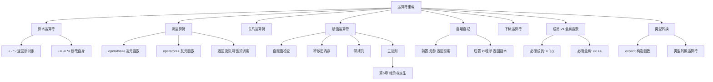

# 运算符重载（谭浩强第4章）

> 📌 运算符重载让你的自定义类型像 `int`、`double` 一样自然地使用 `+`、`-`、`==`、`<<` 等运算符。本质上，运算符就是函数——`a + b` 只是 `operator+(a, b)` 的语法糖。这一章教你怎么定义这些"语法糖"背后的函数。


## 📋 前置知识

在开始之前，你需要了解这些概念（如果不熟悉，先点击链接去补课）：

- [[关于类和对象的进一步讨论（谭浩强第3章）]] — 构造函数、析构函数、拷贝构造函数、友元（`<<` 重载需要友元）
- [[类和对象的基本概念（谭浩强第2章）]] — 类的声明、`this` 指针、成员函数
- [[C++ 的初步知识（谭浩强第1章）]] — 函数重载（运算符重载是函数重载的特殊形式）、引用


## 🤔 为什么要学这个？

假设你写了一个 `Complex`（复数）类，现在要计算两个复数的和：

```cpp
Complex c1(3, 4);   // 3 + 4i
Complex c2(1, 2);   // 1 + 2i

// 没有运算符重载时，你只能这样写：
Complex c3 = c1.add(c2);

// 有了运算符重载，你可以写成：
Complex c3 = c1 + c2;   // 自然、直观、和数学表达一致
```

第一种写法"技术上没错"，但违反了我们的直觉——复数加法在数学里就是 `+`，为什么在代码里变成了 `.add()`？运算符重载的目的就是**让代码的表达方式和问题域的思维方式一致**，让代码更像自然语言或数学公式。

再比如，你想用 `cout << c1` 来打印复数——如果不重载 `<<`，`cout` 根本不认识你的 `Complex` 类型，只会报编译错误。


## 🧠 核心概念


### 4.1 运算符重载的本质

> 🎯 **类比**：运算符重载就像**教一个外国人你们村的方言**。`+` 号本来只会说"普通话"（处理 `int`、`double` 等内置类型），你要"教"它说一种新方言——"当 `+` 遇到两个 `Complex` 对象时，应该把实部加实部、虚部加虚部"。**运算符的符号没变（还是 `+`），但含义你来定义。**

#### 运算符就是函数

C++ 中的运算符调用在底层就是函数调用。编译器看到 `a + b` 时，会把它翻译成两种函数调用之一：

```text
a + b
  → a.operator+(b)      // 如果 operator+ 是成员函数
  → operator+(a, b)     // 如果 operator+ 是全局函数（或友元函数）
```

所以"重载运算符"就是"定义一个名字叫 `operator+` 的函数"。

#### 运算符重载的基本语法

```cpp
// 成员函数形式
返回类型 operator运算符(参数列表) {
    // 实现逻辑
}

// 全局函数形式（通常声明为友元）
返回类型 operator运算符(参数1, 参数2) {
    // 实现逻辑
}
```

让我们从最常用的运算符开始，逐一学习。


### 4.2 算术运算符重载（`+`、`-`、`*`、`/`）

我们用一个完整的 `Complex`（复数）类来演示。复数有实部（Real Part）和虚部（Imaginary Part），数学上记作 $a + bi$，其中 $i$ 是虚数单位（$i^2 = -1$）。

复数加法的规则：$(a + bi) + (c + di) = (a+c) + (b+d)i$

```cpp
#include <iostream>
using namespace std;

class Complex {
private:
    double real;  // 实部
    double imag;  // 虚部

public:
    Complex(double r = 0, double i = 0) : real(r), imag(i) {}
    
    // ========== 成员函数形式重载 + ==========
    // this 是左操作数（c1），other 是右操作数（c2）
    // c1 + c2 → c1.operator+(c2)
    Complex operator+(const Complex &other) const {
        return Complex(real + other.real, imag + other.imag);
        // 注意：返回的是一个新的 Complex 对象（值返回）
        // 不能返回引用，因为这个对象是函数内部创建的临时对象
    }
    
    // 重载 -
    Complex operator-(const Complex &other) const {
        return Complex(real - other.real, imag - other.imag);
    }
    
    // 重载 *（复数乘法：(a+bi)(c+di) = (ac-bd) + (ad+bc)i）
    Complex operator*(const Complex &other) const {
        return Complex(
            real * other.real - imag * other.imag,
            real * other.imag + imag * other.real
        );
    }
    
    // getter（后面会用到）
    double getReal() const { return real; }
    double getImag() const { return imag; }
    
    void display() const {
        cout << real;
        if (imag >= 0) cout << "+";
        cout << imag << "i";
    }
};

int main() {
    Complex c1(3, 4);   // 3 + 4i
    Complex c2(1, -2);  // 1 - 2i
    
    Complex sum = c1 + c2;      // 调用 c1.operator+(c2)
    Complex diff = c1 - c2;     // 调用 c1.operator-(c2)
    Complex prod = c1 * c2;     // 调用 c1.operator*(c2)
    
    cout << "c1 = "; c1.display(); cout << endl;
    cout << "c2 = "; c2.display(); cout << endl;
    cout << "c1 + c2 = "; sum.display(); cout << endl;
    cout << "c1 - c2 = "; diff.display(); cout << endl;
    cout << "c1 * c2 = "; prod.display(); cout << endl;
    
    // 还可以链式运算
    Complex result = c1 + c2 + Complex(10, 0);
    cout << "c1 + c2 + 10 = "; result.display(); cout << endl;
    
    return 0;
}
```

```bash
clang++ -std=c++17 -o complex complex.cpp && ./complex
```

预期输出：

```text
c1 = 3+4i
c2 = 1-2i
c1 + c2 = 4+2i
c1 - c2 = 2+6i
c1 * c2 = 11-2i
c1 + c2 + 10 = 14+2i
```

#### 为什么 `operator+` 返回值而不是引用

`operator+` 创建了一个**新的** `Complex` 对象来存放结果（不修改 `c1` 也不修改 `c2`）。这个新对象是函数内部的临时变量——如果你返回引用，函数结束后临时变量被销毁，引用就变成悬垂引用了。所以算术运算符**必须返回值**。

> ⚠️ **踩坑**：不要在 `operator+` 的实现里修改 `this` 的数据。`c1 + c2` 不应该改变 `c1` 的值——就像 `3 + 5` 不会把 $3$ 变成 $8$。如果你要修改自身，用 `operator+=`。

#### `operator+` 的两种实现形式

上面用的是**成员函数**形式，左操作数必须是当前类的对象。还有一种**全局函数**（友元）形式：

```cpp
// 全局函数形式（需要声明为友元才能访问 private 成员）
class Complex {
    // ...
    friend Complex operator+(const Complex &a, const Complex &b);
};

Complex operator+(const Complex &a, const Complex &b) {
    return Complex(a.real + b.real, a.imag + b.imag);
}
```

**什么时候必须用全局函数形式**？当左操作数不是你的类类型时。比如你想让 `5 + c1` 能工作（`int` + `Complex`）：

```cpp
// 5 + c1 → operator+(5, c1)
// 如果用成员函数：5.operator+(c1) ← 5 不是 Complex 对象，做不到！
// 所以必须用全局函数形式
friend Complex operator+(double d, const Complex &c) {
    return Complex(d + c.real, c.imag);
}
```

我们接下来要学的 `<<` 运算符就**必须**用全局函数形式，因为它的左操作数是 `ostream`，不是我们的类。


### 4.3 流插入/提取运算符重载（`<<` 和 `>>`）

> 🎯 **类比**：`cout` 天生就会输出 `int`、`double`、`string`——因为标准库已经帮这些类型重载好了 `<<`。但 `cout` 不认识你的 `Complex` 类——你得"教"它。重载 `<<` 就是告诉 `cout`："当你遇到 `Complex` 类型时，应该这样输出。"

#### 为什么 `<<` 必须用友元函数

`<<` 运算符的左操作数是 `ostream`（比如 `cout`），右操作数才是你的对象：

```text
cout << c1
  → operator<<(cout, c1)    // 全局函数形式
  → cout.operator<<(c1)     // 成员函数形式？但 cout 不是你的类！你不能给 ostream 加成员函数！
```

所以 `<<` **只能用全局函数形式**，又需要访问类的 `private` 成员，因此声明为**友元**。

```cpp
#include <iostream>
using namespace std;

class Complex {
private:
    double real, imag;

public:
    Complex(double r = 0, double i = 0) : real(r), imag(i) {}
    
    // 声明友元：允许 operator<< 访问 private 成员
    friend ostream& operator<<(ostream &os, const Complex &c);
    
    // 声明友元：允许 operator>> 访问 private 成员
    friend istream& operator>>(istream &is, Complex &c);
};

// 重载 << （输出）
ostream& operator<<(ostream &os, const Complex &c) {
    os << c.real;
    if (c.imag >= 0) os << "+";
    os << c.imag << "i";
    return os;  // 返回 ostream 的引用，支持链式输出
}

// 重载 >> （输入）
istream& operator>>(istream &is, Complex &c) {
    cout << "输入实部和虚部（空格分隔）: ";
    is >> c.real >> c.imag;
    return is;  // 返回 istream 的引用，支持链式输入
}

int main() {
    Complex c1(3, 4), c2(1, -2);
    
    // 链式输出：因为 operator<< 返回 ostream&
    cout << "c1 = " << c1 << ", c2 = " << c2 << endl;
    
    Complex c3;
    cin >> c3;  // 调用 operator>>
    cout << "你输入的复数: " << c3 << endl;
    
    return 0;
}
```

```bash
clang++ -std=c++17 -o stream_op stream_op.cpp && ./stream_op
```

假设输入 `5 -3`，预期输出：

```text
c1 = 3+4i, c2 = 1-2i
输入实部和虚部（空格分隔）: 5 -3
你输入的复数: 5-3i
```

#### 为什么返回 `ostream&` 引用

因为 `cout << c1 << c2` 需要链式调用。第一个 `<<` 返回 `ostream&`（就是 `cout` 本身），然后第二个 `<<` 继续用这个返回的 `cout` 来输出 `c2`。如果不返回引用，链式调用就断了。

```text
cout << c1 << c2
  → (cout << c1) << c2
  → (返回 cout 的引用) << c2
  → cout << c2
```

> ⚠️ **踩坑**：`operator<<` 的第一个参数是 `ostream &os`（不是 `const`），因为输出操作会修改流的内部状态。`operator>>` 的第二个参数是 `Complex &c`（不是 `const`），因为要往 `c` 里写入数据。


### 4.4 关系运算符重载（`==`、`!=`、`<`、`>` 等）

关系运算符返回 `bool`，逻辑简单明了：

```cpp
#include <iostream>
using namespace std;

class Complex {
private:
    double real, imag;

public:
    Complex(double r = 0, double i = 0) : real(r), imag(i) {}
    
    // 重载 ==
    bool operator==(const Complex &other) const {
        return (real == other.real) && (imag == other.imag);
    }
    
    // 重载 !=（通常借助 == 来实现）
    bool operator!=(const Complex &other) const {
        return !(*this == other);  // 复用 operator==
    }
    
    friend ostream& operator<<(ostream &os, const Complex &c);
};

ostream& operator<<(ostream &os, const Complex &c) {
    os << c.real;
    if (c.imag >= 0) os << "+";
    os << c.imag << "i";
    return os;
}

int main() {
    Complex c1(3, 4), c2(3, 4), c3(1, 2);
    
    cout << c1 << " == " << c2 << " ? " << (c1 == c2 ? "是" : "否") << endl;
    cout << c1 << " != " << c3 << " ? " << (c1 != c3 ? "是" : "否") << endl;
    
    return 0;
}
```

预期输出：

```text
3+4i == 3+4i ? 是
3+4i != 1+2i ? 是
```

> 💡 **技巧**：实现关系运算符时，先实现 `==` 和 `<`，其他的都可以用这两个推导出来：
> - `!=` → `!(a == b)`
> - `>` → `b < a`
> - `<=` → `!(b < a)`
> - `>=` → `!(a < b)`

> ⚠️ **踩坑**：浮点数比较用 `==` 可能有精度问题。比如 `0.1 + 0.2 == 0.3` 在大多数计算机上是 `false`（因为浮点数精度误差）。严谨的做法是用一个很小的误差范围（epsilon）来比较：`fabs(a - b) < 1e-9`。


### 4.5 赋值运算符重载（`operator=`）—— 三法则的最后一块拼图

> 🎯 **类比**：赋值运算符就像"搬家"。你已经住在一间房子里（对象已存在），现在要搬到另一间房子里（接收新数据）。搬家前你得先清理旧房子（释放旧内存），然后把新家的东西搬过来（分配新内存 + 复制数据）。如果你不清理旧房子就搬走了——旧房子里的东西就成了垃圾（内存泄漏）。

#### 赋值运算符 vs 拷贝构造函数

再强调一次这个关键区别：

```cpp
MyString s1("Hello");

MyString s2 = s1;    // 这是 【拷贝构造】！s2 正在被创建（第一次出现）
MyString s3("World");
s3 = s1;             // 这是 【赋值运算符】！s3 已经存在，正在被覆盖
```

#### 深拷贝赋值运算符的标准实现

```cpp
#include <iostream>
#include <cstring>
using namespace std;

class MyString {
private:
    char *data;
    int length;

public:
    // 构造函数
    MyString(const char *s = "") {
        length = strlen(s);
        data = new char[length + 1];
        strcpy(data, s);
        cout << "[构造] \"" << data << "\"" << endl;
    }
    
    // 深拷贝构造函数（第 3 章已学）
    MyString(const MyString &other) {
        length = other.length;
        data = new char[length + 1];
        strcpy(data, other.data);
        cout << "[拷贝构造] \"" << data << "\"" << endl;
    }
    
    // ===== 深拷贝赋值运算符 =====
    MyString& operator=(const MyString &other) {
        cout << "[赋值] \"" << other.data << "\" → 覆盖 \"" << data << "\"" << endl;
        
        // 步骤 1：检查自赋值（极其重要！）
        if (this == &other) {
            return *this;   // a = a; 直接返回，不做任何操作
        }
        
        // 步骤 2：释放旧内存
        delete[] data;
        
        // 步骤 3：分配新内存并复制
        length = other.length;
        data = new char[length + 1];
        strcpy(data, other.data);
        
        // 步骤 4：返回 *this（支持链式赋值 a = b = c）
        return *this;
    }
    
    // 析构函数
    ~MyString() {
        cout << "[析构] \"" << data << "\"" << endl;
        delete[] data;
    }
    
    void display() const { cout << data << endl; }
};

int main() {
    MyString s1("Hello");
    MyString s2("World");
    MyString s3("Foo");
    
    cout << "\n--- 赋值操作 ---" << endl;
    s3 = s2 = s1;   // 链式赋值：先 s2 = s1，再 s3 = s2
    
    cout << "\n--- 结果 ---" << endl;
    s1.display();   // Hello
    s2.display();   // Hello
    s3.display();   // Hello
    
    // 修改 s1 不影响 s2 和 s3（深拷贝）
    cout << "\n--- 自赋值测试 ---" << endl;
    s1 = s1;        // 自赋值，应该安全地什么都不做
    s1.display();
    
    cout << "\n--- main 结束 ---" << endl;
    return 0;
}
```

```bash
clang++ -std=c++17 -o assign assign.cpp && ./assign
```

预期输出：

```text
[构造] "Hello"
[构造] "World"
[构造] "Foo"

--- 赋值操作 ---
[赋值] "Hello" → 覆盖 "World"
[赋值] "Hello" → 覆盖 "Foo"

--- 结果 ---
Hello
Hello
Hello

--- 自赋值测试 ---
[赋值] "Hello" → 覆盖 "Hello"
Hello

--- main 结束 ---
[析构] "Hello"
[析构] "Hello"
[析构] "Hello"
```

#### 赋值运算符的四个关键步骤

每一步都有不可忽略的理由：

**步骤一：检查自赋值 `if (this == &other)`**

如果 `a = a;`，不检查的话：先 `delete[] data`（释放了 `a` 自己的内存），再从 `other.data` 复制——但 `other` 就是 `a` 本身，`other.data` 指向的内存已经被释放了！读取已释放的内存是未定义行为。

**步骤二：释放旧内存 `delete[] data;`**

赋值前对象已经有自己的数据。如果不释放旧内存就直接分配新内存，旧内存就泄漏了（没人再能释放它）。

**步骤三：分配新内存并复制**

和拷贝构造函数一样，分配独立的新内存，复制内容——深拷贝。

**步骤四：返回 `*this`**

为了支持链式赋值 `a = b = c`。`b = c` 先执行，返回 `b` 本身的引用，然后 `a = (b 的引用)` 再执行。

> ⚠️ **踩坑**：很多教材的示例会忽略自赋值检查或忘记释放旧内存。这两个错误都不会被编译器发现，运行时也可能"碰巧"不崩溃，但它们是**定时炸弹**——在特定条件下必然爆炸。


### 4.6 复合赋值运算符（`+=`、`-=`、`*=`）

`+=` 修改的是**自身**，不创建新对象，返回自身的引用：

```cpp
class Complex {
    // ...
    
    // 重载 +=（修改自身，返回引用）
    Complex& operator+=(const Complex &other) {
        real += other.real;
        imag += other.imag;
        return *this;   // 返回修改后的自身
    }
};
```

> 💡 **技巧**：先实现 `+=`，再用 `+=` 来实现 `+`。这样代码不重复：

```cpp
// 用 += 来实现 +（优雅且避免代码重复）
Complex operator+(const Complex &other) const {
    Complex temp = *this;    // 拷贝一份自己
    temp += other;           // 调用 +=
    return temp;             // 返回修改后的副本
}
```


### 4.7 自增/自减运算符（`++`、`--`）

`++` 有两种形式：前置（`++i`，先加后用）和后置（`i++`，先用后加）。C++ 用一个**哑参数 `int`** 来区分它们：

```cpp
#include <iostream>
using namespace std;

class Counter {
private:
    int value;

public:
    Counter(int v = 0) : value(v) {}
    
    // 前置 ++（++c）：先加，返回加后的自身引用
    Counter& operator++() {
        value++;
        return *this;   // 返回引用（高效，不创建临时对象）
    }
    
    // 后置 ++（c++）：先保存旧值，再加，返回旧值的副本
    Counter operator++(int) {   // int 是哑参数，仅用于区分前置/后置
        Counter old = *this;    // 保存旧值（拷贝）
        value++;                // 自增
        return old;             // 返回旧值（值返回，不是引用）
    }
    
    friend ostream& operator<<(ostream &os, const Counter &c) {
        os << c.value;
        return os;
    }
};

int main() {
    Counter c(5);
    
    cout << "初始值: " << c << endl;
    cout << "++c = " << ++c << endl;      // 先加到 6，再输出 6
    cout << "现在 c = " << c << endl;     // 6
    cout << "c++ = " << c++ << endl;      // 先输出 6，再加到 7
    cout << "现在 c = " << c << endl;     // 7
    
    return 0;
}
```

```bash
clang++ -std=c++17 -o incr incr.cpp && ./incr
```

预期输出：

```text
初始值: 5
++c = 6
现在 c = 6
c++ = 6
现在 c = 7
```

**前置 vs 后置的性能差异**：

- 前置 `++c`：直接修改自身，返回引用——**不创建临时对象**
- 后置 `c++`：先拷贝一份旧值，修改自身，返回旧值的副本——**创建了临时对象**

所以对于自定义类型，**前置 `++c` 比后置 `c++` 更高效**。如果你不需要"旧值"，优先用前置版本。对于内置类型（`int`），编译器通常会优化掉这个差异，但养成用前置的习惯没有坏处。


### 4.8 下标运算符（`operator[]`）

让自定义容器像数组一样用 `[]` 访问元素：

```cpp
#include <iostream>
using namespace std;

class IntArray {
private:
    int *data;
    int size;

public:
    IntArray(int n) : size(n) {
        data = new int[n]();
    }
    
    ~IntArray() {
        delete[] data;
    }
    
    // 非 const 版本：可以读写（用于 arr[i] = 10;）
    int& operator[](int index) {
        if (index < 0 || index >= size) {
            cerr << "越界！索引 " << index << "，范围 [0, " << size - 1 << "]" << endl;
            // 返回第一个元素作为"安全阀"（不是最佳做法，但比崩溃好）
            return data[0];
        }
        return data[index];  // 返回引用，这样 arr[i] = 10 能修改实际元素
    }
    
    // const 版本：只能读（用于 const IntArray 对象）
    const int& operator[](int index) const {
        if (index < 0 || index >= size) {
            cerr << "越界！" << endl;
            return data[0];
        }
        return data[index];
    }
    
    int getSize() const { return size; }
};

int main() {
    IntArray arr(5);
    
    // 用 [] 写入
    for (int i = 0; i < 5; i++) {
        arr[i] = (i + 1) * 10;   // 调用非 const 版本的 operator[]
    }
    
    // 用 [] 读取
    for (int i = 0; i < 5; i++) {
        cout << "arr[" << i << "] = " << arr[i] << endl;
    }
    
    // 越界访问
    arr[10] = 999;
    
    return 0;
}
```

预期输出：

```text
arr[0] = 10
arr[1] = 20
arr[2] = 30
arr[3] = 40
arr[4] = 50
越界！索引 10，范围 [0, 4]
```

> 💡 **为什么提供 `const` 和非 `const` 两个版本**：当一个 `const IntArray` 对象调用 `[]` 时，编译器会选择 `const` 版本（返回 `const int&`，只能读不能写）。非 `const` 对象则使用非 `const` 版本（返回 `int&`，可读可写）。这是一种常见的重载技巧。


### 4.9 类型转换运算符

C++ 允许你定义**自定义类型到其他类型的隐式/显式转换**。

#### 单参数构造函数的隐式转换

如果一个构造函数只有一个参数（或只有一个必需参数），它会被编译器当作**隐式类型转换**的途径：

```cpp
class Complex {
public:
    Complex(double r) : real(r), imag(0) {}   // 单参数：double → Complex
    // ...
};

Complex c = 3.14;   // 隐式转换：编译器调用 Complex(3.14) 创建对象
```

这有时很方便，但也可能导致意外的隐式转换。用 `explicit` 关键字可以阻止隐式转换：

```cpp
class Complex {
public:
    explicit Complex(double r) : real(r), imag(0) {}
    // ...
};

Complex c1(3.14);       // ✅ 显式构造
Complex c2 = 3.14;      // ❌ 编译错误！explicit 禁止隐式转换
Complex c3 = Complex(3.14);  // ✅ 显式转换可以
```

> 💡 **最佳实践**：除非你有意设计隐式转换，否则**所有单参数构造函数都应该加 `explicit`**。这能防止很多诡异的 bug——比如你不小心把一个 `int` 传给期望 `MyClass` 对象的函数，编译器悄悄帮你转换了，但结果完全不是你想要的。

#### 类型转换运算符（把自定义类型转成其他类型）

```cpp
class Fraction {
private:
    int numerator, denominator;  // 分子、分母
public:
    Fraction(int n, int d) : numerator(n), denominator(d) {}
    
    // 类型转换运算符：Fraction → double
    operator double() const {
        return static_cast<double>(numerator) / denominator;
    }
};

int main() {
    Fraction f(3, 4);
    double d = f;           // 隐式转换：调用 operator double()
    cout << d << endl;      // 0.75
    cout << f + 0.5 << endl;  // Fraction 先转 double，再加 0.5 → 1.25
    return 0;
}
```


### 4.10 不能重载的运算符与重载规则总结

#### 不能重载的 $5$ 个运算符

| 运算符 | 名称 | 不能重载的原因 |
|--------|------|---------------|
| `.` | 成员访问 | 重载会导致无法访问成员 |
| `.*` | 成员指针访问 | 语言内部机制 |
| `::` | 作用域解析 | 编译期确定，不是运行时操作 |
| `sizeof` | 大小运算 | 编译期常量 |
| `?:` | 三元条件 | 涉及控制流，无法用函数表示 |

#### 运算符重载的通用规则

1. **不能创造新运算符** — 不能定义 `operator@`、`operator**` 之类不存在的运算符
2. **不能改变操作数个数** — 一元运算符只能有 $1$ 个操作数，二元只能有 $2$ 个
3. **不能改变优先级和结合性** — `*` 永远比 `+` 优先级高，不管你怎么重载
4. **至少有一个操作数是自定义类型** — 不能重载两个 `int` 之间的 `+`

#### 成员函数 vs 全局函数的选择指南

| 运算符 | 推荐形式 | 原因 |
|--------|---------|------|
| `=`、`[]`、`()`、`->` | **必须**成员函数 | C++ 标准规定 |
| `+=`、`-=`、`*=` | 成员函数 | 修改自身（左操作数） |
| `+`、`-`、`*`、`/` | 成员或全局均可 | 如果需要 `5 + obj` 则用全局 |
| `==`、`!=`、`<`、`>` | 成员或全局均可 | 全局形式更对称 |
| `<<`、`>>` | **必须**全局函数（友元） | 左操作数是流对象 |
| `++`、`--` | 成员函数 | 修改自身 |

> 💡 **一句话总结**：修改左操作数的用成员函数，左操作数不是你的类的用全局函数，标准规定必须成员的就用成员。


### 4.11 综合实战：完整的 String 类

让我们把所有学过的运算符重载技术整合到一个完整的 `String` 类中：

```cpp
#include <iostream>
#include <cstring>
using namespace std;

class String {
private:
    char *str;
    int len;

public:
    // 构造函数
    String(const char *s = "") {
        len = strlen(s);
        str = new char[len + 1];
        strcpy(str, s);
    }
    
    // 拷贝构造函数（深拷贝）
    String(const String &other) {
        len = other.len;
        str = new char[len + 1];
        strcpy(str, other.str);
    }
    
    // 析构函数
    ~String() {
        delete[] str;
    }
    
    // 赋值运算符（深拷贝）
    String& operator=(const String &other) {
        if (this == &other) return *this;
        delete[] str;
        len = other.len;
        str = new char[len + 1];
        strcpy(str, other.str);
        return *this;
    }
    
    // + 拼接
    String operator+(const String &other) const {
        char *temp = new char[len + other.len + 1];
        strcpy(temp, str);
        strcat(temp, other.str);
        String result(temp);
        delete[] temp;
        return result;
    }
    
    // += 拼接赋值
    String& operator+=(const String &other) {
        char *temp = new char[len + other.len + 1];
        strcpy(temp, str);
        strcat(temp, other.str);
        delete[] str;
        str = temp;
        len += other.len;
        return *this;
    }
    
    // == 比较
    bool operator==(const String &other) const {
        return strcmp(str, other.str) == 0;
    }
    
    // != 比较
    bool operator!=(const String &other) const {
        return !(*this == other);
    }
    
    // < 比较（字典序）
    bool operator<(const String &other) const {
        return strcmp(str, other.str) < 0;
    }
    
    // [] 下标访问
    char& operator[](int index) {
        return str[index];
    }
    
    const char& operator[](int index) const {
        return str[index];
    }
    
    // 获取长度
    int length() const { return len; }
    
    // 友元：<< 输出
    friend ostream& operator<<(ostream &os, const String &s);
};

ostream& operator<<(ostream &os, const String &s) {
    os << s.str;
    return os;
}

int main() {
    String s1("Hello");
    String s2(", World");
    String s3 = s1 + s2;        // +
    
    cout << "s1 = " << s1 << endl;
    cout << "s2 = " << s2 << endl;
    cout << "s3 = s1 + s2 = " << s3 << endl;
    
    s1 += "!!!";                 // += （const char* 隐式转换为 String）
    cout << "s1 += \"!!!\" → " << s1 << endl;
    
    cout << "s1 == s2 ? " << (s1 == s2 ? "是" : "否") << endl;
    
    cout << "s3[0] = " << s3[0] << endl;
    s3[0] = 'h';                 // 通过 [] 修改
    cout << "修改后 s3 = " << s3 << endl;
    
    cout << "s3 长度: " << s3.length() << endl;
    
    return 0;
}
```

```bash
clang++ -std=c++17 -o mystring mystring.cpp && ./mystring
```

预期输出：

```text
s1 = Hello
s2 = , World
s3 = s1 + s2 = Hello, World
s1 += "!!!" → Hello!!!
s1 == s2 ? 否
s3[0] = H
修改后 s3 = hello, World
s3 长度: 12
```

这个 `String` 类完整展示了：构造、析构、拷贝构造、赋值运算符（三法则）+ 算术、关系、下标、流运算符重载。这是一个面试和考试中**非常高频**的题目类型。


## ⚠️ 常见误区与踩坑点

> ❌ **误区 1：运算符重载可以改变优先级**  
> 不行。`*` 永远比 `+` 优先级高，不管你怎么重载它们的行为。`a + b * c` 永远先算 `b * c`。

> ❌ **误区 2：`operator+` 应该修改左操作数**  
> `a + b` 不应该改变 `a` 的值（想想 `3 + 5`，$3$ 不会变成 $8$）。要修改自身用 `operator+=`。`operator+` 应该创建并返回一个新对象。

> ⚠️ **踩坑 3：赋值运算符忘记检查自赋值**  
> `a = a;` 如果不检查，会先 `delete` 自己的内存再从自己复制——读取已释放的内存，崩溃。

> ⚠️ **踩坑 4：`operator<<` 写成成员函数**  
> `cout << obj` 要求左操作数是 `ostream`。如果你把 `operator<<` 写成成员函数，调用方式变成 `obj << cout`（左操作数是你的类），语义完全反了。`<<` 和 `>>` **必须用全局函数（友元）形式**。

> ⚠️ **踩坑 5：后置 `++` 忘记哑参数 `int`**  
> 前置 `++` 是 `operator++()`，后置 `++` 是 `operator++(int)`。如果你只写了一个 `operator++()` 而没有 `int` 参数，编译器会把它当作前置版本，后置调用 `c++` 会报错。


## 🔄 概念对比

### 成员函数形式 vs 全局函数形式

| 对比项 | 成员函数 `a.operator+(b)` | 全局函数 `operator+(a, b)` |
|--------|--------------------------|---------------------------|
| 左操作数 | 必须是当前类的对象 | 可以是任何类型 |
| 参数个数 | 二元运算符 $1$ 个参数（左操作数是 `this`） | 二元运算符 $2$ 个参数 |
| 访问权限 | 自动能访问 `private` | 需要 `friend` 才能访问 `private` |
| 适用场景 | 左操作数一定是本类 | 左操作数可能是其他类型（如 `5 + obj`） |
| 必须使用的运算符 | `=`、`[]`、`()`、`->` | `<<`、`>>` |

### 前置 `++` vs 后置 `++`

| 对比项 | 前置 `++c` | 后置 `c++` |
|--------|-----------|-----------|
| 函数签名 | `Counter& operator++()` | `Counter operator++(int)` |
| 语义 | 先加后返回 | 先返回后加 |
| 返回值 | 自身引用 | 旧值的副本 |
| 性能 | 更高效（无临时对象） | 较慢（需要创建副本） |
| 推荐使用 | ✅ 优先使用 | 需要旧值时使用 |

> 💡 **一句话总结**：对自定义类型，前置 `++i` 比后置 `i++` 快，因为后置需要创建临时副本。


## 🏋️ 动手练习

### 练习 1：重载 `Fraction`（分数）类的四则运算（⭐⭐ 难度）

**题目**：创建一个 `Fraction`（分数）类，支持 `+`、`-`、`*`、`==` 运算符和 `<<` 输出。分数以"分子/分母"格式输出（如 `3/4`）。加法公式：$\frac{a}{b} + \frac{c}{d} = \frac{ad + bc}{bd}$。

**参考答案**：

```cpp
#include <iostream>
using namespace std;

class Fraction {
private:
    int num, den;  // 分子、分母
    
    // 辅助函数：求最大公约数（用于约分）
    static int gcd(int a, int b) {
        a = abs(a); b = abs(b);
        while (b) { int t = b; b = a % b; a = t; }
        return a;
    }
    
    // 约分
    void simplify() {
        if (den < 0) { num = -num; den = -den; }  // 分母保持正数
        int g = gcd(num, den);
        if (g > 0) { num /= g; den /= g; }
    }

public:
    Fraction(int n = 0, int d = 1) : num(n), den(d) { simplify(); }
    
    Fraction operator+(const Fraction &f) const {
        return Fraction(num * f.den + f.num * den, den * f.den);
    }
    
    Fraction operator-(const Fraction &f) const {
        return Fraction(num * f.den - f.num * den, den * f.den);
    }
    
    Fraction operator*(const Fraction &f) const {
        return Fraction(num * f.num, den * f.den);
    }
    
    bool operator==(const Fraction &f) const {
        return num == f.num && den == f.den;  // 已约分，直接比较
    }
    
    friend ostream& operator<<(ostream &os, const Fraction &f) {
        if (f.den == 1) os << f.num;
        else os << f.num << "/" << f.den;
        return os;
    }
};

int main() {
    Fraction a(1, 3), b(1, 6);
    cout << a << " + " << b << " = " << (a + b) << endl;
    cout << a << " - " << b << " = " << (a - b) << endl;
    cout << a << " * " << b << " = " << (a * b) << endl;
    cout << Fraction(2, 4) << " == " << Fraction(1, 2) << " ? " 
         << (Fraction(2, 4) == Fraction(1, 2) ? "是" : "否") << endl;
    return 0;
}
```

```bash
clang++ -std=c++17 -o frac frac.cpp && ./frac
```

预期输出：

```text
1/3 + 1/6 = 1/2
1/3 - 1/6 = 1/6
1/3 * 1/6 = 1/18
1/2 == 1/2 ? 是
```


### 练习 2：重载 `[]` 实现安全数组（⭐⭐ 难度）

**题目**：实现一个 `SafeArray` 类，重载 `[]` 并做越界检查。越界时输出错误信息并返回一个"安全"的默认元素。同时实现 `<<` 来打印整个数组。

**参考答案**：

```cpp
#include <iostream>
using namespace std;

class SafeArray {
private:
    int *data;
    int size;
    int dummy;  // 越界时返回的安全引用

public:
    SafeArray(int n) : size(n), dummy(0) {
        data = new int[n]();
    }
    
    ~SafeArray() { delete[] data; }
    
    SafeArray(const SafeArray &other) : size(other.size), dummy(0) {
        data = new int[size];
        for (int i = 0; i < size; i++) data[i] = other.data[i];
    }
    
    SafeArray& operator=(const SafeArray &other) {
        if (this == &other) return *this;
        delete[] data;
        size = other.size;
        data = new int[size];
        for (int i = 0; i < size; i++) data[i] = other.data[i];
        return *this;
    }
    
    int& operator[](int index) {
        if (index < 0 || index >= size) {
            cerr << "越界访问 [" << index << "]！有效范围 [0, " << size - 1 << "]" << endl;
            dummy = 0;
            return dummy;
        }
        return data[index];
    }
    
    friend ostream& operator<<(ostream &os, const SafeArray &arr) {
        os << "[";
        for (int i = 0; i < arr.size; i++) {
            if (i > 0) os << ", ";
            os << arr.data[i];
        }
        os << "]";
        return os;
    }
};

int main() {
    SafeArray arr(5);
    for (int i = 0; i < 5; i++) arr[i] = i * 10;
    cout << "数组: " << arr << endl;
    
    arr[10] = 999;   // 越界
    cout << "越界后数组: " << arr << endl;  // 数组不受影响
    
    return 0;
}
```

```bash
clang++ -std=c++17 -o safe safe.cpp && ./safe
```

预期输出：

```text
数组: [0, 10, 20, 30, 40]
越界访问 [10]！有效范围 [0, 4]
越界后数组: [0, 10, 20, 30, 40]
```


### 练习 3：实现 `Matrix`（$2 \times 2$ 矩阵）的加法和乘法（⭐⭐⭐ 难度）

**题目**：创建一个 $2 \times 2$ 矩阵类 `Matrix2x2`，支持 `+`（矩阵加法）、`*`（矩阵乘法）和 `<<`（格式化输出）。

矩阵乘法公式：$C_{ij} = \sum_{k} A_{ik} \cdot B_{kj}$

**参考答案**：

```cpp
#include <iostream>
#include <iomanip>
using namespace std;

class Matrix2x2 {
private:
    double m[2][2];

public:
    Matrix2x2() {
        for (int i = 0; i < 2; i++)
            for (int j = 0; j < 2; j++)
                m[i][j] = 0;
    }
    
    Matrix2x2(double a, double b, double c, double d) {
        m[0][0] = a; m[0][1] = b;
        m[1][0] = c; m[1][1] = d;
    }
    
    Matrix2x2 operator+(const Matrix2x2 &other) const {
        Matrix2x2 result;
        for (int i = 0; i < 2; i++)
            for (int j = 0; j < 2; j++)
                result.m[i][j] = m[i][j] + other.m[i][j];
        return result;
    }
    
    Matrix2x2 operator*(const Matrix2x2 &other) const {
        Matrix2x2 result;
        for (int i = 0; i < 2; i++)
            for (int j = 0; j < 2; j++)
                for (int k = 0; k < 2; k++)
                    result.m[i][j] += m[i][k] * other.m[k][j];
        return result;
    }
    
    friend ostream& operator<<(ostream &os, const Matrix2x2 &mat) {
        os << "|" << setw(6) << mat.m[0][0] << " " << setw(6) << mat.m[0][1] << " |" << endl;
        os << "|" << setw(6) << mat.m[1][0] << " " << setw(6) << mat.m[1][1] << " |";
        return os;
    }
};

int main() {
    Matrix2x2 A(1, 2, 3, 4);
    Matrix2x2 B(5, 6, 7, 8);
    
    cout << "A =" << endl << A << endl << endl;
    cout << "B =" << endl << B << endl << endl;
    cout << "A + B =" << endl << (A + B) << endl << endl;
    cout << "A * B =" << endl << (A * B) << endl;
    
    return 0;
}
```

```bash
clang++ -std=c++17 -o matrix matrix.cpp && ./matrix
```

预期输出：

```text
A =
|     1      2 |
|     3      4 |

B =
|     5      6 |
|     7      8 |

A + B =
|     6      8 |
|    10     12 |

A * B =
|    19     22 |
|    43     50 |
```


## 📝 总结

### 本篇要点回顾

1. **运算符就是函数**——`a + b` 等价于 `a.operator+(b)` 或 `operator+(a, b)`。重载运算符就是定义这些特殊名字的函数。

2. **算术运算符返回新对象（值返回），不修改操作数**——`operator+` 创建并返回新对象；`operator+=` 修改自身并返回引用。先实现 `+=` 再用它实现 `+` 是优雅的做法。

3. **`<<` 和 `>>` 必须用全局函数（友元）**——因为左操作数是 `ostream`/`istream`，不是你的类。返回流的引用以支持链式调用。

4. **赋值运算符是三法则的最后一块拼图**——四步标准流程：检查自赋值 → 释放旧内存 → 分配新内存复制 → 返回 `*this`。

5. **前置 `++` 比后置 `++` 更高效**——前置返回引用（无临时对象），后置返回副本（有临时对象）。后置用 `int` 哑参数区分。

6. **`operator[]` 提供两个版本**——`const` 版本用于只读访问，非 `const` 版本用于读写访问。

7. **不能重载的运算符有 $5$ 个**——`.`、`.*`、`::`、`sizeof`、`?:`。不能创造新运算符，不能改变优先级和操作数个数。


### 知识图谱




## 🔗 相关链接

- 上级概念：[[C++ 面向对象程序设计全书精要]]
- 前置章节：[[关于类和对象的进一步讨论（谭浩强第3章）]] — 构造/析构/拷贝构造/友元是本章的基础
- 后续章节：[[继承与派生（谭浩强第5章）]]
- 下级概念：[[C++ 赋值运算符深拷贝详解]]、[[C++ 流运算符重载详解]]
- 实际应用：[[C++ 自定义容器设计]]、[[C++ STL 容器的运算符使用]]


## 📚 参考资料

- 谭浩强《C++ 面向对象程序设计（第四版）》第 $4$ 章，清华大学出版社，2024
- [C++ Reference - Operator Overloading](https://en.cppreference.com/w/cpp/language/operators) — 所有可重载运算符的完整列表和规则
- [Learn C++ - Operator Overloading](https://www.learncpp.com/cpp-tutorial/introduction-to-operator-overloading/) — 英文教程，有大量练习
- [C++ Core Guidelines - C.160-C.170](https://isocpp.github.io/CppCoreGuidelines/CppCoreGuidelines#Ro-conventional) — 运算符重载的最佳实践指南
