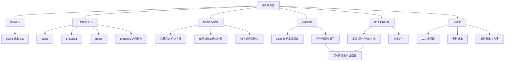

# 继承与派生（谭浩强第5章）

> 📌 继承是面向对象编程的第二大支柱（第一大是封装）。它解决的问题很简单：**如果两个类有大量相同的代码，不要复制粘贴——让新类"继承"旧类的所有成员，只写自己独有的部分**。这一章教你怎么用继承来组织类的层次结构。


## 📋 前置知识

在开始之前，你需要了解这些概念（如果不熟悉，先点击链接去补课）：

- [[运算符重载（谭浩强第4章）]] — 运算符重载在继承体系中经常出现（比如派生类的 `<<` 重载）
- [[关于类和对象的进一步讨论（谭浩强第3章）]] — 构造函数、析构函数、拷贝构造函数的顺序问题在继承中变得更复杂
- [[类和对象的基本概念（谭浩强第2章）]] — `private`/`public`/`protected` 三种访问控制你得会


## 🤔 为什么要学这个？

假设你在写一个学校管理系统，需要建模"学生"和"教师"两种角色。你发现它们有大量重复：

```cpp
// 学生类
class Student {
    string name;     // 和教师一样
    int age;         // 和教师一样
    string id;       // 和教师一样
    void introduce();// 和教师一样
    
    float gpa;       // 学生独有
    string major;    // 学生独有
};

// 教师类
class Teacher {
    string name;     // 和学生一样
    int age;         // 和学生一样
    string id;       // 和学生一样
    void introduce();// 和学生一样
    
    string department;  // 教师独有
    double salary;      // 教师独有
};
```

$70\%$ 的代码是重复的。如果你要修改"自我介绍"的格式，得同时改两个类——万一漏改了一个呢？如果以后再加"行政人员"类，又要复制一遍……

**继承**解决了这个问题：把公共部分抽出来作为**基类**（Base Class，也叫父类），学生和教师作为**派生类**（Derived Class，也叫子类）继承基类的所有成员，只添加自己独有的部分。

```text
      Person（基类）
     ┌──────────────┐
     │ name, age, id │
     │ introduce()   │
     └──────┬───────┘
            │ 继承
     ┌──────┴───────┐
     │              │
  Student        Teacher
  gpa, major     department, salary
```

这样公共代码只写一份，修改一处所有派生类自动生效。


## 🧠 核心概念


### 5.1 继承的基本语法

> 🎯 **类比**：继承就像**族谱传承**。你的父亲有"走路"、"说话"、"吃饭"这些能力（基类的成员），你作为儿子天生就继承了这些能力，不需要重新学。同时你还可以学会"弹吉他"（新增的成员），甚至你"说话"的方式和你父亲不一样——比如你有口音（重写成员函数）。**你不需要从零学走路——你继承了它。**

#### 语法格式

```cpp
class 派生类名 : 继承方式 基类名 {
    // 派生类新增的成员
};
```

```cpp
#include <iostream>
#include <string>
using namespace std;

// 基类：人
class Person {
private:
    string name;
    int age;

public:
    Person(string n, int a) : name(n), age(a) {
        cout << "[Person 构造] " << name << endl;
    }
    
    ~Person() {
        cout << "[Person 析构] " << name << endl;
    }
    
    void introduce() const {
        cout << "我叫" << name << "，今年" << age << "岁。" << endl;
    }
    
    string getName() const { return name; }
    int getAge() const { return age; }
};

// 派生类：学生 "is-a" 人
class Student : public Person {
private:
    string major;
    float gpa;

public:
    // 派生类构造函数：必须调用基类构造函数来初始化继承来的成员
    Student(string n, int a, string m, float g)
        : Person(n, a),       // 先调用基类构造函数
          major(m), gpa(g) {  // 再初始化自己新增的成员
        cout << "[Student 构造] " << getName() << endl;
    }
    
    ~Student() {
        cout << "[Student 析构] " << getName() << endl;
    }
    
    void showInfo() const {
        introduce();  // 调用从基类继承来的函数
        cout << "专业: " << major << "，GPA: " << gpa << endl;
    }
};

// 派生类：教师 "is-a" 人
class Teacher : public Person {
private:
    string department;
    double salary;

public:
    Teacher(string n, int a, string dept, double sal)
        : Person(n, a), department(dept), salary(sal) {
        cout << "[Teacher 构造] " << getName() << endl;
    }
    
    ~Teacher() {
        cout << "[Teacher 析构] " << getName() << endl;
    }
    
    void showInfo() const {
        introduce();
        cout << "院系: " << department << "，月薪: " << salary << endl;
    }
};

int main() {
    Student stu("张三", 20, "计算机科学", 3.8);
    stu.showInfo();
    
    cout << endl;
    
    Teacher tea("李教授", 45, "数学系", 15000);
    tea.showInfo();
    
    cout << "\n--- main 结束 ---" << endl;
    return 0;
}
```

```bash
clang++ -std=c++17 -o inherit inherit.cpp && ./inherit
```

预期输出：

```text
[Person 构造] 张三
[Student 构造] 张三
我叫张三，今年20岁。
专业: 计算机科学，GPA: 3.8

[Person 构造] 李教授
[Teacher 构造] 李教授
我叫李教授，今年45岁。
院系: 数学系，月薪: 15000

--- main 结束 ---
[Teacher 析构] 李教授
[Person 析构] 李教授
[Student 析构] 张三
[Person 析构] 张三
```

#### 构造与析构的顺序

**构造顺序：先基类后派生类**——就像盖楼先打地基（基类），再盖楼层（派生类）。

**析构顺序：先派生类后基类**——就像拆楼先拆楼顶（派生类），再拆地基（基类）。

这个顺序是**自动的、强制的**。你只需要在派生类的初始化列表中调用基类构造函数，编译器会保证先执行基类构造。

> ⚠️ **踩坑**：如果你不在派生类构造函数中显式调用基类构造函数，编译器会尝试调用基类的**默认构造函数**（无参版本）。如果基类没有默认构造函数，编译报错。


### 5.2 三种继承方式与访问控制

C++ 提供了三种继承方式：`public`、`protected`、`private`。它们控制的是**基类的成员在派生类中的访问权限如何变化**。

> 🎯 **类比**：想象一个家族企业。
> - `public` 继承 = 儿子继承家业后，**对外的名声不变**——客户知道的服务（public）还是公开的，内部流程（protected）还是家族内部知道的，绝密配方（private）依然只有父亲自己知道。
> - `protected` 继承 = 儿子继承后，**把所有公开的服务也变成了内部流程**——外人不再能直接使用。
> - `private` 继承 = 儿子继承后，**把所有东西都变成绝密**——连孙子（派生类的派生类）都看不到。

#### 访问权限变化表

| 基类中的访问权限 | `public` 继承 | `protected` 继承 | `private` 继承 |
|-----------------|--------------|-----------------|---------------|
| `public` | → `public` | → `protected` | → `private` |
| `protected` | → `protected` | → `protected` | → `private` |
| `private` | **不可访问** | **不可访问** | **不可访问** |

**无论哪种继承方式，基类的 `private` 成员在派生类中都不能直接访问**。这些成员仍然存在于派生类对象的内存中（被继承了），但派生类的代码不能直接读写它们——只能通过基类提供的 `public` 或 `protected` 的成员函数间接访问。

#### `protected` 访问权限——为继承而生

`protected` 是专门为继承设计的第三种访问级别。它的规则是：

- 对外部（非成员、非友元）：和 `private` 一样，**不能访问**
- 对派生类：和 `public` 一样，**可以访问**

```cpp
#include <iostream>
using namespace std;

class Base {
private:
    int privData;       // 只有 Base 自己能访问
protected:
    int protData;       // Base 和派生类能访问
public:
    int pubData;        // 所有人能访问
    
    Base() : privData(1), protData(2), pubData(3) {}
};

class Derived : public Base {
public:
    void accessTest() {
        // cout << privData;  // ❌ 编译错误！private 在派生类中不可访问
        cout << protData << endl;  // ✅ protected 在派生类中可以访问
        cout << pubData << endl;   // ✅ public 当然可以访问
    }
};

int main() {
    Derived d;
    // cout << d.protData;  // ❌ 编译错误！protected 对外部不可访问
    cout << d.pubData << endl;  // ✅ public 对外部可以访问
    d.accessTest();
    return 0;
}
```

> 💡 **什么时候用 `protected`**：当你确定一个成员**不应该暴露给外部用户，但应该让派生类能用到**时。比如一些内部辅助函数或需要被子类读取的数据。但要谨慎使用——`protected` 数据让你的类层次结构变得更紧密耦合。很多现代 C++ 风格建议：数据成员全部 `private`，必要时通过 `protected` 的 getter/setter 函数让子类访问。

#### `public` 继承是最常用的

在实际开发中，$99\%$ 的继承都是 `public` 继承。它表达的是 **"is-a"（是一种）关系**——"学生是一种人"、"圆形是一种形状"。

`private` 继承和 `protected` 继承很少用，它们表达的是 **"implemented-in-terms-of"（用...来实现）关系**——不是"是一种"，而是"利用它来实现"。如果你发现需要 `private` 继承，先考虑能不能用**组合**（Composition，把基类作为成员变量）替代。

```cpp
// public 继承：学生 "是一种" 人 ✅ 正确使用继承
class Student : public Person { ... };

// 组合（推荐替代 private 继承）：汽车 "有一个" 引擎
class Car {
private:
    Engine engine;  // 组合：Car 内部有一个 Engine 成员
    // ...
};
```


### 5.3 派生类的构造函数详解

派生类的构造函数有一个核心责任：**确保基类部分被正确初始化**。由于基类的 `private` 成员对派生类不可见，派生类**不能直接初始化**这些成员——必须通过调用基类的构造函数来完成。

#### 构造函数的调用链

```cpp
#include <iostream>
using namespace std;

class A {
public:
    A(int x) { cout << "A 构造: " << x << endl; }
    ~A() { cout << "A 析构" << endl; }
};

class B : public A {
public:
    B(int x, int y) : A(x) {  // 在初始化列表中调用基类构造函数
        cout << "B 构造: " << y << endl;
    }
    ~B() { cout << "B 析构" << endl; }
};

class C : public B {
public:
    C(int x, int y, int z) : B(x, y) {  // 调用 B 的构造函数（B 会调用 A 的）
        cout << "C 构造: " << z << endl;
    }
    ~C() { cout << "C 析构" << endl; }
};

int main() {
    cout << "--- 创建 C 对象 ---" << endl;
    C obj(1, 2, 3);
    cout << "\n--- main 结束 ---" << endl;
    return 0;
}
```

```bash
clang++ -std=c++17 -o chain chain.cpp && ./chain
```

预期输出：

```text
--- 创建 C 对象 ---
A 构造: 1
B 构造: 2
C 构造: 3

--- main 结束 ---
C 析构
B 析构
A 析构
```

构造链是 $A \to B \to C$（从最顶层基类到最底层派生类），析构链是 $C \to B \to A$（反过来）。

#### 当派生类有对象成员时

如果派生类不仅继承了基类，还有其他类的对象作为**成员变量**，构造顺序是：

1. **基类**构造函数（先祖最优先）
2. **成员对象**构造函数（按声明顺序）
3. **派生类自身**构造函数体

```cpp
#include <iostream>
using namespace std;

class Engine {
public:
    Engine() { cout << "Engine 构造" << endl; }
    ~Engine() { cout << "Engine 析构" << endl; }
};

class Wheel {
public:
    Wheel() { cout << "Wheel 构造" << endl; }
    ~Wheel() { cout << "Wheel 析构" << endl; }
};

class Vehicle {
public:
    Vehicle() { cout << "Vehicle 构造" << endl; }
    ~Vehicle() { cout << "Vehicle 析构" << endl; }
};

class Car : public Vehicle {
private:
    Engine engine;  // 成员对象 1
    Wheel wheel;    // 成员对象 2

public:
    Car() {
        cout << "Car 构造" << endl;
    }
    ~Car() {
        cout << "Car 析构" << endl;
    }
};

int main() {
    Car myCar;
    return 0;
}
```

```bash
clang++ -std=c++17 -o car_order car_order.cpp && ./car_order
```

预期输出：

```text
Vehicle 构造
Engine 构造
Wheel 构造
Car 构造
Car 析构
Wheel 析构
Engine 析构
Vehicle 析构
```

顺序是：基类 `Vehicle` → 成员 `Engine` → 成员 `Wheel` → 派生类 `Car`。析构完全反过来。

> ⚠️ **踩坑**：成员对象的构造顺序取决于**它们在类中声明的顺序**，和你在初始化列表中写的顺序无关。这个规则和第 $3$ 章讲的初始化列表顺序规则一样。


### 5.4 派生类中的名字隐藏（Name Hiding）

> 🎯 **类比**：你和你父亲都有一项技能叫"做饭"。但你做的是中餐，你父亲做的是西餐。当别人让你"做饭"时，你做的是中餐（派生类的版本）——你父亲的"做饭"技能被你**遮住了**（隐藏了），虽然它还在（可以用 `爸爸::做饭()` 显式调用）。

#### 什么是名字隐藏

如果派生类定义了一个与基类**同名**的成员（变量或函数），那么基类的所有同名成员在派生类的作用域中都被**隐藏**了。注意：这不是重载——重载只在同一个作用域内发生；名字隐藏是跨作用域的。

```cpp
#include <iostream>
using namespace std;

class Base {
public:
    void show() {
        cout << "Base::show()" << endl;
    }
    
    void show(int x) {
        cout << "Base::show(int) = " << x << endl;
    }
};

class Derived : public Base {
public:
    // 派生类定义了自己的 show()
    // 这会隐藏基类的 show() 和 show(int) —— 全部被隐藏！
    void show() {
        cout << "Derived::show()" << endl;
    }
};

int main() {
    Derived d;
    d.show();          // ✅ 调用 Derived::show()
    // d.show(42);     // ❌ 编译错误！Base::show(int) 被隐藏了
    d.Base::show(42);  // ✅ 用作用域运算符显式调用基类版本
    d.Base::show();    // ✅ 也可以显式调用基类的无参版本
    return 0;
}
```

```bash
clang++ -std=c++17 -o hiding hiding.cpp && ./hiding
```

预期输出：

```text
Derived::show()
Base::show(int) = 42
Base::show()
```

**关键点**：派生类的 `show()` 把基类的**所有** `show`（包括 `show(int)`）都隐藏了，不管参数是否相同。这是很多初学者困惑的地方——"我基类明明有 `show(int)`，为什么派生类调不了？"

#### 用 `using` 声明恢复被隐藏的基类函数

如果你希望基类被隐藏的重载版本在派生类中也可用，可以用 `using` 声明：

```cpp
class Derived : public Base {
public:
    using Base::show;  // 把基类的所有 show 函数引入派生类作用域
    
    void show() {
        cout << "Derived::show()" << endl;
    }
};

// 现在 Derived 中有三个 show：
// 1. Derived::show()     — 自己定义的
// 2. Base::show(int)     — 通过 using 引入的
// 这两个构成了重载关系（在同一作用域内）
```

> ❌ **误区**：名字隐藏 ≠ 重写（Override）。名字隐藏是**编译期**的现象，和虚函数无关。重写是**运行时多态**的基础，需要 `virtual` 关键字，在 [[多态性与虚函数（谭浩强第6章）]] 中详细讲。


### 5.5 赋值兼容规则（基类和派生类之间的类型转换）

> 🎯 **类比**：一个快递箱上写着"装水果的箱子"（基类 `Fruit`），你往里放了一个苹果（派生类 `Apple`）——没问题，苹果是一种水果。但如果箱子上写的是"装苹果的箱子"，你往里放一个水果——不行，水果不一定是苹果（可能是橘子）。**派生类对象可以赋给基类变量（向上转换），但反过来不行（向下转换不安全）。**

这是继承中一条极其重要的规则，也是多态的基础：

```cpp
#include <iostream>
using namespace std;

class Animal {
public:
    string name;
    Animal(string n) : name(n) {}
    void speak() { cout << name << " 发出声音" << endl; }
};

class Dog : public Animal {
public:
    string breed;  // 品种
    Dog(string n, string b) : Animal(n), breed(b) {}
    void speak() { cout << name << " 汪汪汪！" << endl; }
    void fetch() { cout << name << " 去捡球！" << endl; }
};

int main() {
    Dog myDog("旺财", "金毛");
    
    // ===== 规则 1：派生类对象可以赋给基类对象（对象切片）=====
    Animal a = myDog;   // ✅ 但会发生"对象切片"——Dog 独有的部分（breed）被丢弃
    a.speak();          // 调用 Animal::speak()，不是 Dog::speak()
    // a.fetch();       // ❌ Animal 没有 fetch()
    
    // ===== 规则 2：基类指针可以指向派生类对象 =====
    Animal *pAnimal = &myDog;  // ✅ 基类指针指向派生类对象
    pAnimal->speak();          // 调用 Animal::speak()（没有 virtual 时是静态绑定）
    // pAnimal->fetch();       // ❌ 基类指针只能看到基类的成员
    
    // ===== 规则 3：基类引用可以引用派生类对象 =====
    Animal &rAnimal = myDog;   // ✅ 基类引用引用派生类对象
    rAnimal.speak();           // 调用 Animal::speak()（没有 virtual 时是静态绑定）
    
    return 0;
}
```

```bash
clang++ -std=c++17 -o compat compat.cpp && ./compat
```

预期输出：

```text
旺财 发出声音
旺财 发出声音
旺财 发出声音
```

三次调用都输出了"发出声音"而不是"汪汪汪"——因为这里还没有用 `virtual`（虚函数），所以是**静态绑定**（编译时根据变量类型决定调用哪个函数）。要实现"基类指针调用派生类版本"的行为，需要**多态**（下一章的内容）。

#### 对象切片（Object Slicing）

当你把派生类对象**赋值**给基类对象（不是指针或引用，而是对象本身）时，派生类特有的数据成员会被**丢弃**——就像把一个大方块硬塞进小模具，多余的部分被切掉了。这就是"对象切片"。

```text
Dog 对象:   [name | age | breed]
                               ↓ 切片
Animal 对象: [name | age]          breed 被丢弃了
```

> ⚠️ **踩坑**：对象切片通常不是你想要的行为。大多数时候，如果你需要基类和派生类之间的互操作，应该使用**指针或引用**而不是对象赋值。指针和引用不会切片——它们只是换了一种"看待"这个对象的视角（只能看到基类部分），但对象本身完好无损。


### 5.6 多继承（Multiple Inheritance）

C++ 允许一个派生类同时继承**多个基类**：

```cpp
#include <iostream>
using namespace std;

class Printer {
public:
    void print() { cout << "打印文档" << endl; }
};

class Scanner {
public:
    void scan() { cout << "扫描文档" << endl; }
};

// 多继承：MultiFunctionDevice 同时继承 Printer 和 Scanner
class MultiFunctionDevice : public Printer, public Scanner {
public:
    void fax() { cout << "发送传真" << endl; }
};

int main() {
    MultiFunctionDevice mfd;
    mfd.print();  // 继承自 Printer
    mfd.scan();   // 继承自 Scanner
    mfd.fax();    // 自己新增的
    return 0;
}
```

预期输出：

```text
打印文档
扫描文档
发送传真
```

多继承的语法很简单，但它引出了一个棘手的问题——**二义性**。


#### 多继承的二义性问题

**问题一：两个基类有同名成员**

```cpp
class A {
public:
    void func() { cout << "A::func" << endl; }
};

class B {
public:
    void func() { cout << "B::func" << endl; }
};

class C : public A, public B {};

int main() {
    C obj;
    // obj.func();  // ❌ 二义性！编译器不知道是 A::func 还是 B::func
    obj.A::func();  // ✅ 显式指定
    obj.B::func();  // ✅ 显式指定
    return 0;
}
```

**问题二：菱形继承（Diamond Inheritance）——最棘手的问题**

```text
       A（基类）
      / \
     B   C     ← B 和 C 都继承了 A
      \ /
       D       ← D 同时继承 B 和 C
```

这时 `D` 中有**两份** `A` 的成员——一份通过 `B` 继承，一份通过 `C` 继承。访问 `A` 的成员时产生二义性。

```cpp
#include <iostream>
using namespace std;

class A {
public:
    int data;
    A() : data(0) { cout << "A 构造" << endl; }
};

class B : public A {
public:
    B() { cout << "B 构造" << endl; }
};

class C : public A {
public:
    C() { cout << "C 构造" << endl; }
};

class D : public B, public C {
public:
    D() { cout << "D 构造" << endl; }
};

int main() {
    D d;
    // d.data = 42;   // ❌ 二义性！是 B::A::data 还是 C::A::data？
    d.B::data = 10;   // ✅ 显式指定通过 B 继承的 A::data
    d.C::data = 20;   // ✅ 显式指定通过 C 继承的 A::data（另一份副本！）
    
    cout << "通过 B 的: " << d.B::data << endl;   // 10
    cout << "通过 C 的: " << d.C::data << endl;   // 20
    // 两个 data 是独立的副本，值不同！
    return 0;
}
```

预期输出：

```text
A 构造
B 构造
A 构造
C 构造
D 构造
通过 B 的: 10
通过 C 的: 20
```

注意 `A` 被构造了**两次**——因为 `D` 中有两份 `A` 的数据。


### 5.7 虚继承（Virtual Inheritance）——解决菱形继承问题

> 🎯 **类比**：菱形继承问题就像一个孩子有两个"爷爷的遗产"——一份从爸爸那继承的，一份从妈妈那继承的。明明是同一个爷爷，遗产却有两份，产生了争议。**虚继承就是让全家约定"爷爷的遗产只保留一份，大家共享"。**

用 `virtual` 关键字修饰继承方式，让 `B` 和 `C` 对 `A` 的继承变成**虚继承**。这样 `D` 中只有一份 `A` 的成员：

```cpp
#include <iostream>
using namespace std;

class A {
public:
    int data;
    A() : data(0) { cout << "A 构造" << endl; }
    A(int d) : data(d) { cout << "A 构造: " << d << endl; }
};

class B : virtual public A {   // 虚继承！
public:
    B() { cout << "B 构造" << endl; }
};

class C : virtual public A {   // 虚继承！
public:
    C() { cout << "C 构造" << endl; }
};

class D : public B, public C {
public:
    // 在虚继承中，最终派生类必须直接调用虚基类的构造函数
    D() : A(42) {   // 直接调用 A 的构造函数
        cout << "D 构造" << endl;
    }
};

int main() {
    D d;
    d.data = 100;  // ✅ 不再有二义性！只有一份 A::data
    cout << "data = " << d.data << endl;
    
    return 0;
}
```

```bash
clang++ -std=c++17 -o virtual_inherit virtual_inherit.cpp && ./virtual_inherit
```

预期输出：

```text
A 构造: 42
B 构造
C 构造
D 构造
data = 100
```

注意 `A` 只构造了**一次**——问题解决了。

#### 虚继承的特殊规则

**规则一：虚基类的构造函数由最终派生类直接调用**

在普通继承中，每个类只负责调用自己直接基类的构造函数。但在虚继承中，最底层的派生类（`D`）必须**直接调用**虚基类（`A`）的构造函数——即使中间还隔着 `B` 和 `C`。如果 `D` 不显式调用，编译器会调用 `A` 的默认构造函数。

**规则二：`B` 和 `C` 中对 `A` 构造函数的调用被忽略**

当 `D` 构造 `B` 和 `C` 时，`B` 和 `C` 各自对 `A` 的构造函数调用会被编译器**跳过**（因为 `A` 已经由 `D` 直接构造了）。

> 💡 **实际建议**：菱形继承和虚继承让代码变得复杂且难以维护。在实际项目中应该**尽量避免多继承**（尤其是菱形继承）。如果你发现设计出了菱形结构，先考虑能不能用**组合**替代继承，或者用 **接口**（纯虚基类，下一章会讲）来减少耦合。


### 5.8 继承中的拷贝构造与赋值

当派生类没有显式定义拷贝构造函数或赋值运算符时，编译器会自动生成默认版本——它们会先调用基类的对应函数，再处理派生类自身的成员。

但如果你在派生类中**自定义**了拷贝构造或赋值运算符，就**必须手动调用基类的对应版本**，否则基类部分不会被正确拷贝：

```cpp
#include <iostream>
#include <string>
using namespace std;

class Base {
protected:
    string baseName;
public:
    Base(string n = "") : baseName(n) {}
    
    Base(const Base &other) : baseName(other.baseName) {
        cout << "[Base 拷贝构造]" << endl;
    }
    
    Base& operator=(const Base &other) {
        baseName = other.baseName;
        cout << "[Base 赋值]" << endl;
        return *this;
    }
};

class Derived : public Base {
private:
    int extraData;
public:
    Derived(string n, int d) : Base(n), extraData(d) {}
    
    // 自定义拷贝构造——必须手动调用基类拷贝构造
    Derived(const Derived &other)
        : Base(other),             // 把 other（Derived类型）传给 Base 的拷贝构造
          extraData(other.extraData) {
        cout << "[Derived 拷贝构造]" << endl;
    }
    
    // 自定义赋值——必须手动调用基类赋值
    Derived& operator=(const Derived &other) {
        if (this == &other) return *this;
        Base::operator=(other);    // 显式调用基类的 operator=
        extraData = other.extraData;
        cout << "[Derived 赋值]" << endl;
        return *this;
    }
    
    void display() const {
        cout << baseName << ", data=" << extraData << endl;
    }
};

int main() {
    Derived d1("Alice", 42);
    
    cout << "--- 拷贝构造 ---" << endl;
    Derived d2 = d1;
    d2.display();
    
    Derived d3("Bob", 0);
    cout << "\n--- 赋值 ---" << endl;
    d3 = d1;
    d3.display();
    
    return 0;
}
```

```bash
clang++ -std=c++17 -o derived_copy derived_copy.cpp && ./derived_copy
```

预期输出：

```text
--- 拷贝构造 ---
[Base 拷贝构造]
[Derived 拷贝构造]
Alice, data=42

--- 赋值 ---
[Base 赋值]
[Derived 赋值]
Alice, data=42
```

> ⚠️ **踩坑**：如果你在 `Derived` 的拷贝构造中忘了写 `: Base(other)`，编译器会调用 `Base` 的**默认构造函数**——基类部分就被初始化成空值了，`other` 的基类数据完全丢失。赋值运算符同理：忘了 `Base::operator=(other)` 就只复制了派生类的部分。


### 5.9 综合示例：图形继承体系

让我们用一个完整的图形类继承体系来综合运用本章所有知识：

```cpp
#include <iostream>
#include <string>
#include <cmath>
using namespace std;

// 基类：形状
class Shape {
protected:
    string color;

public:
    Shape(string c = "黑色") : color(c) {
        cout << "[Shape 构造] " << color << endl;
    }
    
    ~Shape() {
        cout << "[Shape 析构] " << color << endl;
    }
    
    void setColor(string c) { color = c; }
    string getColor() const { return color; }
    
    void describe() const {
        cout << "这是一个" << color << "的形状" << endl;
    }
};

// 派生类：圆形
class Circle : public Shape {
private:
    double radius;

public:
    Circle(double r, string c = "红色") : Shape(c), radius(r) {
        cout << "[Circle 构造] r=" << radius << endl;
    }
    
    ~Circle() {
        cout << "[Circle 析构]" << endl;
    }
    
    double area() const {
        return M_PI * radius * radius;  // M_PI 是 cmath 中定义的圆周率
    }
    
    double perimeter() const {
        return 2 * M_PI * radius;
    }
    
    void describe() const {  // 隐藏了基类的 describe（不是重写）
        cout << "这是一个" << color << "的圆形，半径 = " << radius
             << "，面积 = " << area()
             << "，周长 = " << perimeter() << endl;
    }
};

// 派生类：矩形
class Rectangle : public Shape {
private:
    double width, height;

public:
    Rectangle(double w, double h, string c = "蓝色") 
        : Shape(c), width(w), height(h) {
        cout << "[Rectangle 构造] " << width << "x" << height << endl;
    }
    
    ~Rectangle() {
        cout << "[Rectangle 析构]" << endl;
    }
    
    double area() const {
        return width * height;
    }
    
    double perimeter() const {
        return 2 * (width + height);
    }
    
    void describe() const {
        cout << "这是一个" << color << "的矩形，" << width << " x " << height
             << "，面积 = " << area()
             << "，周长 = " << perimeter() << endl;
    }
};

// 进一步派生：正方形 "is-a" 矩形
class Square : public Rectangle {
public:
    Square(double side, string c = "绿色") 
        : Rectangle(side, side, c) {  // 正方形就是宽高相等的矩形
        cout << "[Square 构造]" << endl;
    }
    
    ~Square() {
        cout << "[Square 析构]" << endl;
    }
};

int main() {
    cout << "===== 创建圆形 =====" << endl;
    Circle c(5.0);
    c.describe();
    
    cout << "\n===== 创建矩形 =====" << endl;
    Rectangle r(4.0, 6.0);
    r.describe();
    
    cout << "\n===== 创建正方形 =====" << endl;
    Square s(3.0);
    s.describe();  // 继承了 Rectangle 的 describe
    
    cout << "\n===== 赋值兼容 =====" << endl;
    Shape *pShape = &c;       // 基类指针指向 Circle
    pShape->describe();       // 调用的是 Shape::describe()（静态绑定，没有 virtual）
    // 下一章学了虚函数后，这里就会调用 Circle::describe()
    
    cout << "\n===== 程序结束 =====" << endl;
    return 0;
}
```

```bash
clang++ -std=c++17 -o shapes shapes.cpp && ./shapes
```

预期输出：

```text
===== 创建圆形 =====
[Shape 构造] 红色
[Circle 构造] r=5
这是一个红色的圆形，半径 = 5，面积 = 78.5398，周长 = 31.4159

===== 创建矩形 =====
[Shape 构造] 蓝色
[Rectangle 构造] 4x6
这是一个蓝色的矩形，4 x 6，面积 = 24，周长 = 20

===== 创建正方形 =====
[Shape 构造] 绿色
[Rectangle 构造] 3x3
[Square 构造]
这是一个绿色的矩形，3 x 3，面积 = 9，周长 = 12

===== 赋值兼容 =====
这是一个红色的形状

===== 程序结束 =====
[Square 析构]
[Rectangle 析构]
[Shape 析构] 绿色
[Rectangle 析构]
[Shape 析构] 蓝色
[Circle 析构]
[Shape 析构] 红色
```

注意最后 `pShape->describe()` 调用的是 `Shape::describe()` 而不是 `Circle::describe()`——因为还没有用 `virtual`。这就是下一章要解决的核心问题：**多态**。


## ⚠️ 常见误区与踩坑点

> ❌ **误区 1：派生类能访问基类的 `private` 成员**  
> 无论哪种继承方式，基类的 `private` 成员在派生类中**都不能直接访问**。它们仍存在于派生类对象的内存中，但只能通过基类的 `public`/`protected` 函数间接访问。

> ❌ **误区 2：名字隐藏就是重写**  
> 名字隐藏是编译期的作用域现象，和多态无关。派生类定义同名函数只是"遮住"了基类的所有同名函数，并不构成运行时多态。真正的重写需要 `virtual` 关键字。

> ⚠️ **踩坑 3：派生类构造函数忘记调用基类构造函数**  
> 如果基类没有默认构造函数，派生类的构造函数**必须**在初始化列表中显式调用基类的某个构造函数。忘了就编译报错。

> ⚠️ **踩坑 4：对象切片**  
> 把派生类对象赋给基类对象（不是指针/引用）会丢掉派生类特有的数据。通常应该用基类指针或引用来操作派生类对象。

> ⚠️ **踩坑 5：派生类的拷贝构造/赋值忘记处理基类部分**  
> 自定义派生类的拷贝构造函数时，初始化列表中必须写 `Base(other)`；自定义赋值运算符时，函数体中必须写 `Base::operator=(other)`。否则基类部分不会被正确拷贝。

> ⚠️ **踩坑 6：菱形继承中虚基类构造的责任**  
> 虚继承中，虚基类的构造函数**由最终派生类负责调用**，中间类对虚基类构造函数的调用会被跳过。如果最终派生类不显式调用，就调用虚基类的默认构造函数。


## 🔄 概念对比

### 三种继承方式对比

| 继承方式 | 基类 `public` → | 基类 `protected` → | 基类 `private` → | 语义 |
|---------|-----------------|--------------------|--------------------|------|
| `public` | `public` | `protected` | 不可访问 | "is-a"（是一种） |
| `protected` | `protected` | `protected` | 不可访问 | 很少用 |
| `private` | `private` | `private` | 不可访问 | "implemented-in-terms-of" |

> 💡 **一句话总结**：$99\%$ 的情况用 `public` 继承。`private` 和 `protected` 继承通常可以用**组合**替代。

### 继承 vs 组合

| 对比项 | 继承（Inheritance） | 组合（Composition） |
|--------|--------------------|--------------------|
| 关系 | "is-a"（是一种） | "has-a"（有一个） |
| 语法 | `class B : public A {}` | `class B { A a; };` |
| 耦合度 | 高（派生类依赖基类实现） | 低（只依赖接口） |
| 基类修改影响 | 大（可能破坏派生类） | 小（通过接口隔离） |
| 代码复用方式 | 自动继承所有成员 | 手动委托调用 |
| 适用场景 | 真正的类型层次结构 | 一个类"使用"另一个类的功能 |

> 💡 **设计原则**："优先使用组合而非继承"（Favor Composition Over Inheritance）。只有当"B 是一种 A"在语义上完全成立时，才使用继承。

### 名字隐藏 vs 重写（Override）

| 对比项 | 名字隐藏（Hiding） | 重写（Override） |
|--------|-------------------|--------------------|
| 是否需要 `virtual` | 不需要 | 必须 |
| 触发条件 | 派生类定义同名成员 | 派生类重新定义虚函数 |
| 绑定方式 | 静态绑定（编译时） | 动态绑定（运行时） |
| 基类指针调用 | 调用基类版本 | 调用实际对象的版本 |
| 隐藏范围 | 基类所有同名函数 | 只替换同签名的虚函数 |

> 💡 **一句话总结**：隐藏看"指针/变量的类型"，重写看"实际对象的类型"。下一章我们就来学重写（多态）。


## 🏋️ 动手练习

### 练习 1：设计一个员工继承体系（⭐ 难度）

**题目**：创建基类 `Employee`（姓名、工号），派生出 `Manager`（新增：部门名称）和 `Engineer`（新增：技术等级 $1$-$5$）。每个类都有 `display()` 函数打印信息。

**参考答案**：

```cpp
#include <iostream>
#include <string>
using namespace std;

class Employee {
protected:
    string name;
    int id;
public:
    Employee(string n, int i) : name(n), id(i) {}
    void display() const {
        cout << "姓名: " << name << ", 工号: " << id;
    }
};

class Manager : public Employee {
private:
    string department;
public:
    Manager(string n, int i, string dept) : Employee(n, i), department(dept) {}
    void display() const {
        Employee::display();
        cout << ", 部门: " << department << " [经理]" << endl;
    }
};

class Engineer : public Employee {
private:
    int level;
public:
    Engineer(string n, int i, int lv) : Employee(n, i), level(lv) {}
    void display() const {
        Employee::display();
        cout << ", 技术等级: " << level << " [工程师]" << endl;
    }
};

int main() {
    Manager m("张总", 1001, "技术部");
    Engineer e("李工", 2001, 4);
    m.display();
    e.display();
    return 0;
}
```

```bash
clang++ -std=c++17 -o emp emp.cpp && ./emp
```

预期输出：

```text
姓名: 张总, 工号: 1001, 部门: 技术部 [经理]
姓名: 李工, 工号: 2001, 技术等级: 4 [工程师]
```


### 练习 2：观察构造与析构顺序（⭐⭐ 难度）

**题目**：创建三层继承链 `A → B → C`，每个类的构造/析构函数都打印自己的名字。`B` 还有一个 `D` 类型的成员对象。创建一个 `C` 对象，观察并解释构造和析构的完整顺序。

**参考答案**：

```cpp
#include <iostream>
using namespace std;

class A {
public:
    A() { cout << "A 构造" << endl; }
    ~A() { cout << "A 析构" << endl; }
};

class D {
public:
    D() { cout << "D 构造(B的成员)" << endl; }
    ~D() { cout << "D 析构(B的成员)" << endl; }
};

class B : public A {
private:
    D memberD;  // B 有一个 D 类型的成员对象
public:
    B() { cout << "B 构造" << endl; }
    ~B() { cout << "B 析构" << endl; }
};

class C : public B {
public:
    C() { cout << "C 构造" << endl; }
    ~C() { cout << "C 析构" << endl; }
};

int main() {
    C obj;
    return 0;
}
```

```bash
clang++ -std=c++17 -o order order.cpp && ./order
```

预期输出：

```text
A 构造
D 构造(B的成员)
B 构造
C 构造
C 析构
B 析构
D 析构(B的成员)
A 析构
```

顺序解释：构造时先基类 `A`，再 `B` 的成员对象 `D`，再 `B` 的函数体，最后 `C`。析构完全反过来。


### 练习 3：用虚继承解决菱形继承（⭐⭐⭐ 难度）

**题目**：设计菱形继承结构 `Animal → FlyingAnimal, SwimmingAnimal → Duck`。`Animal` 有 `name` 和 `breathe()` 方法。`Duck` 应该只有一份 `Animal` 的数据。用虚继承实现，并验证 `Duck` 可以无二义性地访问 `name`。

**参考答案**：

```cpp
#include <iostream>
#include <string>
using namespace std;

class Animal {
protected:
    string name;
public:
    Animal(string n = "未知") : name(n) {
        cout << "[Animal 构造] " << name << endl;
    }
    void breathe() const {
        cout << name << " 在呼吸" << endl;
    }
};

class FlyingAnimal : virtual public Animal {
public:
    FlyingAnimal(string n = "未知") : Animal(n) {
        cout << "[FlyingAnimal 构造]" << endl;
    }
    void fly() const {
        cout << name << " 在飞翔" << endl;
    }
};

class SwimmingAnimal : virtual public Animal {
public:
    SwimmingAnimal(string n = "未知") : Animal(n) {
        cout << "[SwimmingAnimal 构造]" << endl;
    }
    void swim() const {
        cout << name << " 在游泳" << endl;
    }
};

class Duck : public FlyingAnimal, public SwimmingAnimal {
public:
    // 最终派生类必须直接调用虚基类 Animal 的构造函数
    Duck(string n) : Animal(n), FlyingAnimal(n), SwimmingAnimal(n) {
        cout << "[Duck 构造]" << endl;
    }
    
    void quack() const {
        cout << name << " 嘎嘎嘎！" << endl;
    }
};

int main() {
    Duck donald("唐老鸭");
    cout << endl;
    donald.breathe();   // ✅ 不再有二义性，只有一份 Animal
    donald.fly();
    donald.swim();
    donald.quack();
    return 0;
}
```

```bash
clang++ -std=c++17 -o duck duck.cpp && ./duck
```

预期输出：

```text
[Animal 构造] 唐老鸭
[FlyingAnimal 构造]
[SwimmingAnimal 构造]
[Duck 构造]

唐老鸭 在呼吸
唐老鸭 在飞翔
唐老鸭 在游泳
唐老鸭 嘎嘎嘎！
```

注意 `Animal` 只构造了一次——虚继承成功地解决了菱形继承的数据冗余和二义性问题。


## 📝 总结

### 本篇要点回顾

1. **继承让派生类自动拥有基类的所有成员**——派生类只需添加自己独有的部分。`class Derived : public Base {}` 是最常见的写法。

2. **三种继承方式控制访问权限如何变化**——`public` 继承保持原权限，`protected` 继承降为 `protected`，`private` 继承降为 `private`。无论哪种方式，基类 `private` 成员在派生类中都不可直接访问。

3. **构造顺序是"先基后派"，析构顺序是"先派后基"**——基类构造函数在初始化列表中显式调用。如果有成员对象，顺序是：基类 → 成员对象 → 派生类自身。

4. **名字隐藏：派生类同名函数会遮住基类所有同名函数**——不是重载，不是重写。用 `Base::func()` 显式调用或 `using Base::func;` 引入。

5. **赋值兼容规则**——派生类对象可以赋给基类指针/引用（向上转换安全），但对象赋值会发生切片。

6. **多继承容易产生二义性**——菱形继承用虚继承解决。实际项目中尽量避免多继承，优先用组合。

7. **派生类自定义拷贝构造和赋值运算符时，必须手动处理基类部分**——初始化列表写 `Base(other)`，赋值函数写 `Base::operator=(other)`。


### 知识图谱




## 🔗 相关链接

- 上级概念：[[C++ 面向对象程序设计全书精要]]
- 前置章节：[[运算符重载（谭浩强第4章）]]
- 后续章节：[[多态性与虚函数（谭浩强第6章）]] — 虚函数让基类指针能调用派生类的函数版本（动态绑定），是继承最强大的搭档
- 下级概念：[[C++ 虚继承详解]]、[[C++ 多继承设计指南]]、[[C++ 组合 vs 继承]]
- 设计原则：[[Liskov 替换原则]]、[[开闭原则]]


## 📚 参考资料

- 谭浩强《C++ 面向对象程序设计（第四版）》第 $5$ 章，清华大学出版社，2024
- [C++ Reference - Derived Classes](https://en.cppreference.com/w/cpp/language/derived_class) — 继承的完整语法参考
- [C++ Reference - Virtual Base Classes](https://en.cppreference.com/w/cpp/language/derived_class#Virtual_base_classes) — 虚继承详解
- [Learn C++ - Inheritance](https://www.learncpp.com/cpp-tutorial/basic-inheritance-in-c/) — 英文教程，有大量练习
- [C++ Core Guidelines - C.120-C.140](https://isocpp.github.io/CppCoreGuidelines/CppCoreGuidelines#Rh-domain) — 继承的设计指南
