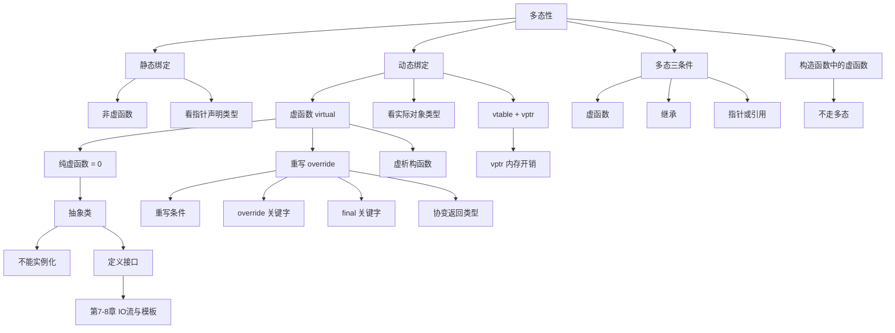

# 多态性与虚函数（谭浩强第6章）

> 📌 多态是面向对象编程的**灵魂**。它解决了一个核心问题：**用一个统一的接口来操作不同类型的对象，让每个对象自动做出自己正确的行为**。学完继承你能写出类的层次结构，学完多态你才能让这个层次结构真正"活"起来。


## 📋 前置知识

在开始之前，你需要了解这些概念（如果不熟悉，先点击链接去补课）：

- [[继承与派生（谭浩强第5章）]] — 基类/派生类、赋值兼容规则（基类指针指向派生类对象）、名字隐藏
- [[关于类和对象的进一步讨论（谭浩强第3章）]] — 构造函数、析构函数、动态内存管理
- [[类和对象的基本概念（谭浩强第2章）]] — `this` 指针、成员函数


## 🤔 为什么要学这个？

在第 $5$ 章末尾我们遇到了一个问题。回顾一下：

```cpp
Shape *pShape = &circle;  // 基类指针指向 Circle 对象
pShape->describe();       // 调用的是 Shape::describe()，不是 Circle::describe()
```

基类指针明明指向的是一个圆形对象，但调用 `describe()` 时执行的却是基类（Shape）的版本——输出的是"这是一个形状"，而不是"这是一个圆形"。这就是**静态绑定**（Static Binding）的行为：编译器在编译时根据**指针的声明类型**（`Shape*`）来决定调用哪个函数，不管指针实际指向什么。

这在实际开发中是一个巨大的痛点。想象你在写一个绘图程序，用户可以画圆形、矩形、三角形。你想用一个数组来统一管理所有图形：

```cpp
Shape* shapes[100];  // 存放各种图形
shapes[0] = new Circle(5);
shapes[1] = new Rectangle(4, 6);
shapes[2] = new Triangle(3, 4, 5);

// 你希望：遍历数组，让每个图形画出自己的样子
for (int i = 0; i < 3; i++) {
    shapes[i]->draw();  // 没有多态时，全部调用 Shape::draw()，画不出任何东西
}
```

没有多态，你不得不用一堆 `if-else` 或 `switch` 来判断每个图形的类型，然后强制转换指针来调用正确的函数——代码丑陋、难维护，每加一种新图形就要改一堆地方。

**多态**解决了这个问题：通过 `virtual` 关键字，让 `shapes[i]->draw()` 在**运行时**自动调用正确的版本——Circle 画圆、Rectangle 画矩形、Triangle 画三角形。添加新图形只需新增一个派生类，完全不需要修改已有的循环和逻辑。


## 🧠 核心概念


### 6.1 静态绑定 vs 动态绑定

> 🎯 **类比**：想象一个遥控器上有一个"开关"按钮。
> - **静态绑定**：遥控器出厂时就焊死了——不管你对着什么设备按，它永远只开电视（因为遥控器**标签上写的是"电视遥控器"**）。
> - **动态绑定**：遥控器是智能的——你对着电视按就开电视，对着空调按就开空调（因为遥控器在按下的瞬间**检测你对着的是什么设备**）。
>
> `virtual` 关键字就是让遥控器变"智能"的开关。

**静态绑定**（Static Binding / Early Binding）：编译时就确定调用哪个函数。依据是**变量/指针/引用的声明类型**。所有非虚函数都是静态绑定。

**动态绑定**（Dynamic Binding / Late Binding）：运行时才确定调用哪个函数。依据是**指针/引用实际指向的对象类型**。虚函数通过动态绑定实现多态。

```cpp
#include <iostream>
using namespace std;

class Animal {
public:
    // 非虚函数：静态绑定
    void speak_static() {
        cout << "动物发出声音（静态绑定）" << endl;
    }
    
    // 虚函数：动态绑定
    virtual void speak_dynamic() {
        cout << "动物发出声音（动态绑定）" << endl;
    }
};

class Dog : public Animal {
public:
    void speak_static() {
        cout << "汪汪汪！（静态绑定）" << endl;
    }
    
    void speak_dynamic() override {
        cout << "汪汪汪！（动态绑定）" << endl;
    }
};

class Cat : public Animal {
public:
    void speak_static() {
        cout << "喵喵喵！（静态绑定）" << endl;
    }
    
    void speak_dynamic() override {
        cout << "喵喵喵！（动态绑定）" << endl;
    }
};

int main() {
    Dog dog;
    Cat cat;
    
    // 基类指针分别指向 Dog 和 Cat
    Animal *p1 = &dog;
    Animal *p2 = &cat;
    
    cout << "===== 静态绑定（非虚函数）=====" << endl;
    p1->speak_static();   // 看指针类型 → Animal* → 调用 Animal::speak_static
    p2->speak_static();   // 看指针类型 → Animal* → 调用 Animal::speak_static
    
    cout << "\n===== 动态绑定（虚函数）=====" << endl;
    p1->speak_dynamic();  // 看实际对象 → Dog → 调用 Dog::speak_dynamic
    p2->speak_dynamic();  // 看实际对象 → Cat → 调用 Cat::speak_dynamic
    
    return 0;
}
```

```bash
clang++ -std=c++17 -o binding binding.cpp && ./binding
```

预期输出：

```text
===== 静态绑定（非虚函数）=====
动物发出声音（静态绑定）
动物发出声音（静态绑定）

===== 动态绑定（虚函数）=====
汪汪汪！（动态绑定）
喵喵喵！（动态绑定）
```

一个 `virtual` 关键字，输出结果完全不同。这就是多态的力量。


### 6.2 虚函数（Virtual Function）

#### 声明虚函数

在基类的函数声明前加上 `virtual` 关键字：

```cpp
class Base {
public:
    virtual void func() {
        cout << "Base::func" << endl;
    }
};
```

**一旦一个函数在基类中被声明为 `virtual`，它在所有派生类中自动也是虚函数**——即使派生类中不写 `virtual` 关键字。但为了代码清晰，推荐在派生类中也显式标注。

#### `override` 关键字（C++11）

C++11 引入了 `override` 关键字，放在派生类函数声明末尾，明确告诉编译器"我要重写基类的虚函数"。如果基类中没有对应签名的虚函数，编译器会**报错**——帮你抓 bug。

```cpp
class Base {
public:
    virtual void func(int x) { cout << "Base" << endl; }
};

class Derived : public Base {
public:
    // 没有 override 时：
    void func(double x) { ... }  // 编译器不报错，但这不是重写！
                                  // 参数类型不同（double vs int），是名字隐藏
    
    // 有 override 时：
    void func(double x) override { ... }  // ❌ 编译错误！基类没有 func(double)
    void func(int x) override { ... }     // ✅ 正确重写
};
```

> 💡 **最佳实践**：所有重写基类虚函数的派生类函数都加 `override`。它不仅是文档（告诉读者"这是重写"），更是编译期安全检查。

#### 重写（Override）的条件

要构成合法的重写，派生类的函数必须满足：

1. **基类中对应函数是 `virtual`**
2. **函数名完全相同**
3. **参数列表完全相同**（类型、个数、顺序）
4. **返回类型相同**（或满足协变返回类型，后面会讲）
5. **`const` 修饰一致**（基类是 `const` 的，派生类也必须是 `const` 的）

如果参数列表不同，就不是重写而是**名字隐藏**——这是上一章讲过的，完全不同的机制。


### 6.3 多态的完整示例——图形系统

这是全书最经典的例子，完整展示多态的威力：

```cpp
#include <iostream>
#include <cmath>
#include <string>
using namespace std;

// 基类：形状
class Shape {
protected:
    string color;

public:
    Shape(string c = "黑色") : color(c) {}
    
    // 虚函数：由派生类重写
    virtual double area() const {
        return 0;  // 基类默认面积为 0
    }
    
    virtual double perimeter() const {
        return 0;
    }
    
    virtual void draw() const {
        cout << "画一个形状" << endl;
    }
    
    virtual string getType() const {
        return "Shape";
    }
    
    // 非虚函数：所有形状共用，不需要重写
    void printInfo() const {
        cout << getType() << "（" << color << "）"
             << " 面积=" << area()
             << " 周长=" << perimeter() << endl;
    }
    
    // 虚析构函数（极其重要！后面详细讲）
    virtual ~Shape() {}
};

// 派生类：圆形
class Circle : public Shape {
private:
    double radius;

public:
    Circle(double r, string c = "红色") : Shape(c), radius(r) {}
    
    double area() const override {
        return M_PI * radius * radius;
    }
    
    double perimeter() const override {
        return 2 * M_PI * radius;
    }
    
    void draw() const override {
        cout << "画一个半径为 " << radius << " 的圆形 ◯" << endl;
    }
    
    string getType() const override {
        return "Circle";
    }
};

// 派生类：矩形
class Rectangle : public Shape {
private:
    double width, height;

public:
    Rectangle(double w, double h, string c = "蓝色") 
        : Shape(c), width(w), height(h) {}
    
    double area() const override {
        return width * height;
    }
    
    double perimeter() const override {
        return 2 * (width + height);
    }
    
    void draw() const override {
        cout << "画一个 " << width << "x" << height << " 的矩形 ▭" << endl;
    }
    
    string getType() const override {
        return "Rectangle";
    }
};

// 派生类：三角形（等腰直角三角形简化版）
class Triangle : public Shape {
private:
    double a, b, c;  // 三条边

public:
    Triangle(double s1, double s2, double s3, string col = "绿色") 
        : Shape(col), a(s1), b(s2), c(s3) {}
    
    double area() const override {
        // 海伦公式
        double s = (a + b + c) / 2.0;
        return sqrt(s * (s - a) * (s - b) * (s - c));
    }
    
    double perimeter() const override {
        return a + b + c;
    }
    
    void draw() const override {
        cout << "画一个边长 " << a << "," << b << "," << c << " 的三角形 △" << endl;
    }
    
    string getType() const override {
        return "Triangle";
    }
};

// ===== 多态的核心价值：这个函数不需要知道具体是什么形状 =====
void processShape(const Shape &s) {
    s.draw();
    s.printInfo();
    cout << endl;
}

int main() {
    Circle cir(5.0);
    Rectangle rect(4.0, 6.0);
    Triangle tri(3.0, 4.0, 5.0);
    
    cout << "===== 通过统一接口处理不同形状 =====" << endl;
    processShape(cir);   // 传入 Circle，自动调用 Circle 的版本
    processShape(rect);  // 传入 Rectangle，自动调用 Rectangle 的版本
    processShape(tri);   // 传入 Triangle，自动调用 Triangle 的版本
    
    cout << "===== 用基类指针数组统一管理 =====" << endl;
    Shape* shapes[] = { &cir, &rect, &tri };
    for (int i = 0; i < 3; i++) {
        shapes[i]->draw();       // 运行时根据实际对象类型调用正确版本
    }
    
    return 0;
}
```

```bash
clang++ -std=c++17 -o poly poly.cpp && ./poly
```

预期输出：

```text
===== 通过统一接口处理不同形状 =====
画一个半径为 5 的圆形 ◯
Circle（红色） 面积=78.5398 周长=31.4159

画一个 4x6 的矩形 ▭
Rectangle（蓝色） 面积=24 周长=20

画一个边长 3,4,5 的三角形 △
Triangle（绿色） 面积=6 周长=12

===== 用基类指针数组统一管理 =====
画一个半径为 5 的圆形 ◯
画一个 4x6 的矩形 ▭
画一个边长 3,4,5 的三角形 △
```

**关键观察**：

1. `processShape` 函数的参数是 `const Shape &`——它完全不知道传进来的是什么形状。但因为 `draw()`、`area()`、`getType()` 都是虚函数，运行时会自动调用正确的派生类版本。

2. `printInfo()` 不是虚函数，但它内部调用了虚函数 `getType()` 和 `area()`。当 `Circle` 对象调用 `printInfo()` 时，`printInfo` 内部的 `this` 指向 `Circle` 对象，所以 `getType()` 和 `area()` 都会调用 `Circle` 的版本。**虚函数的动态绑定在任何通过指针或引用调用的上下文中都有效，包括在基类函数内部。**

3. 如果以后要添加新形状（比如椭圆），只需要新增一个派生类 `Ellipse`，重写虚函数即可。`processShape` 函数和 `shapes` 数组的循环**完全不需要修改**。这就是所谓的**开闭原则**（Open-Closed Principle）——对扩展开放，对修改关闭。


### 6.4 虚析构函数——不写就是定时炸弹

> 🎯 **类比**：你用遥控器（基类指针）关闭了一台多功能设备（派生类对象）。如果遥控器不知道设备的类型（析构函数不是虚的），它只会执行"通用关机"（基类析构），不会执行"关闭打印模块""关闭扫描模块"（派生类析构）。结果：打印模块和扫描模块还在运行，资源没释放——**内存泄漏**。

#### 没有虚析构函数的灾难

```cpp
#include <iostream>
using namespace std;

class Base {
public:
    Base() { cout << "[Base 构造]" << endl; }
    ~Base() { cout << "[Base 析构]" << endl; }  // ⚠️ 不是虚函数！
};

class Derived : public Base {
private:
    int *data;
public:
    Derived() : data(new int[100]) {
        cout << "[Derived 构造] 分配了 100 个 int" << endl;
    }
    ~Derived() {
        delete[] data;
        cout << "[Derived 析构] 释放了内存" << endl;
    }
};

int main() {
    Base *p = new Derived();  // 基类指针指向派生类对象
    delete p;                  // 💥 只调用 Base::~Base()，Derived::~Derived() 没执行！
                               // data 指向的 100 个 int 内存泄漏了！
    return 0;
}
```

预期输出（注意没有 Derived 析构）：

```text
[Base 构造]
[Derived 构造] 分配了 100 个 int
[Base 析构]
```

`Derived` 的析构函数**没有执行**！`data` 指向的内存永远不会被释放——内存泄漏。

#### 加上虚析构函数

```cpp
class Base {
public:
    Base() { cout << "[Base 构造]" << endl; }
    virtual ~Base() { cout << "[Base 析构]" << endl; }  // ✅ 虚析构函数
};
```

现在 `delete p` 会先调用 `Derived::~Derived()`，再调用 `Base::~Base()`。

修复后的预期输出：

```text
[Base 构造]
[Derived 构造] 分配了 100 个 int
[Derived 析构] 释放了内存
[Base 析构]
```

> ⚠️ **铁律：只要一个类有可能被继承（有虚函数），就必须把析构函数声明为 `virtual`。** 更强的版本：**只要一个类有任何虚函数，析构函数就应该是虚的。** 这是 C++ 中最重要的内存安全规则之一。

> 💡 **C++11 简写**：如果你不需要在析构函数中做任何事，可以写 `virtual ~Base() = default;`。


### 6.5 纯虚函数与抽象类

> 🎯 **类比**：纯虚函数就像一份**岗位要求**上的"必备技能"。"所有员工必须会做报告"——这是一个**要求**（纯虚函数声明），但要求本身不包含具体内容（没有函数体）。只有具体的员工（派生类）才能填充"怎么做报告"的细节。如果一个人（类）有任何一项必备技能没填（纯虚函数没实现），他就不能入职（不能实例化）——这样的"职位描述"就是**抽象类**。

#### 纯虚函数的声明

在虚函数声明末尾加上 `= 0`，表示这个函数**没有实现**，派生类**必须**提供实现：

```cpp
class Shape {
public:
    // 纯虚函数：Shape 不知道怎么画自己，由派生类来定义
    virtual void draw() const = 0;
    virtual double area() const = 0;
    virtual ~Shape() = default;
};
```

#### 抽象类

包含**至少一个纯虚函数**的类就是**抽象类**（Abstract Class）。抽象类有以下特性：

1. **不能实例化**——不能创建对象（`Shape s;` ❌ 编译错误）
2. **可以声明指针和引用**——`Shape *p;` ✅、`Shape &r = someCircle;` ✅
3. **派生类必须实现所有纯虚函数才能实例化**——如果派生类漏实现了一个纯虚函数，那这个派生类也是抽象类

```cpp
#include <iostream>
using namespace std;

// 抽象类：不能实例化，只定义接口
class Shape {
public:
    virtual void draw() const = 0;        // 纯虚函数
    virtual double area() const = 0;      // 纯虚函数
    virtual string name() const = 0;      // 纯虚函数
    virtual ~Shape() = default;
    
    // 非纯虚函数（有实现，可选重写）
    void printArea() const {
        cout << name() << " 的面积 = " << area() << endl;
    }
};

// 具体类：实现了所有纯虚函数，可以实例化
class Circle : public Shape {
    double radius;
public:
    Circle(double r) : radius(r) {}
    
    void draw() const override {
        cout << "◯ (r=" << radius << ")" << endl;
    }
    
    double area() const override {
        return 3.14159 * radius * radius;
    }
    
    string name() const override {
        return "Circle";
    }
};

class Square : public Shape {
    double side;
public:
    Square(double s) : side(s) {}
    
    void draw() const override {
        cout << "□ (s=" << side << ")" << endl;
    }
    
    double area() const override {
        return side * side;
    }
    
    string name() const override {
        return "Square";
    }
};

int main() {
    // Shape s;         // ❌ 编译错误！抽象类不能实例化
    
    Circle c(5);
    Square sq(4);
    
    // 基类指针数组——多态的经典用法
    Shape *shapes[] = { &c, &sq };
    
    for (int i = 0; i < 2; i++) {
        shapes[i]->draw();        // 动态绑定
        shapes[i]->printArea();   // printArea 内部调用虚函数 name() 和 area()
        cout << endl;
    }
    
    return 0;
}
```

```bash
clang++ -std=c++17 -o abstract abstract.cpp && ./abstract
```

预期输出：

```text
◯ (r=5)
Circle 的面积 = 78.5398

□ (s=4)
Square 的面积 = 16
```

#### 纯虚函数也可以有函数体

虽然不常见，但 C++ 允许给纯虚函数提供一个实现——派生类仍然必须重写它，但可以在重写版本中用 `Base::func()` 调用基类的默认实现：

```cpp
class Base {
public:
    virtual void func() = 0;  // 纯虚函数
};

// 在类外提供默认实现
void Base::func() {
    cout << "Base 的默认实现" << endl;
}

class Derived : public Base {
public:
    void func() override {
        Base::func();  // 先调用基类的默认实现
        cout << "Derived 的额外逻辑" << endl;
    }
};
```

这种用法比较少见，但在需要"基类提供默认行为，但强制派生类显式选择是否使用"的场景中有用。


### 6.6 虚函数表（vtable）——多态的底层原理

> 🎯 **类比**：想象每种动物脖子上都挂了一个"技能卡片夹"（虚函数表）。卡片夹里有"叫声"、"跑步方式"等技能的卡片，每张卡片上写的是**这种动物**具体的实现方式。当你通过"动物"标签（基类指针）看到一只动物时，你不知道它是猫是狗——但你可以翻看它脖子上的卡片夹（查虚函数表），找到"叫声"那张卡片，按上面写的方式发声。

#### vtable 的工作机制

每个有虚函数的类，编译器会为它生成一张**虚函数表**（Virtual Function Table，简称 vtable）。vtable 是一个**函数指针数组**，存放着该类所有虚函数的**实际地址**。

每个有虚函数的对象内部，会隐含一个指针叫 **vptr**（Virtual Pointer），指向该对象所属类的 vtable。

```text
对象内存布局（含 vptr）：

Circle 对象:
┌────────────────┐
│ vptr ─────────────→ Circle 的 vtable:
│                │    ┌─────────────────────┐
│ color          │    │ [0] Circle::draw     │
│ radius         │    │ [1] Circle::area     │
└────────────────┘    │ [2] Circle::name     │
                      │ [3] Circle::~Circle  │
                      └─────────────────────┘

Rectangle 对象:
┌────────────────┐
│ vptr ─────────────→ Rectangle 的 vtable:
│                │    ┌─────────────────────────┐
│ color          │    │ [0] Rectangle::draw      │
│ width, height  │    │ [1] Rectangle::area      │
└────────────────┘    │ [2] Rectangle::name      │
                      │ [3] Rectangle::~Rectangle│
                      └─────────────────────────┘
```

当你通过基类指针调用虚函数时：

```text
Shape *p = &circle;
p->draw();

编译器生成的代码（伪代码）：
1. 从 p 指向的对象中取出 vptr
2. 在 vtable 中找到 draw() 对应的槽位 [0]
3. 调用槽位中存放的函数地址 → Circle::draw()
```

这个过程在运行时完成，所以叫"动态绑定"。代价是每次虚函数调用多了一次**间接跳转**（通过 vptr 查 vtable），比普通函数调用稍慢——但通常这点开销微不足道。

#### vtable 对对象大小的影响

```cpp
#include <iostream>
using namespace std;

class NoVirtual {
    int x;
};

class HasVirtual {
    int x;
    virtual void func() {}
};

int main() {
    cout << "无虚函数: " << sizeof(NoVirtual) << " 字节" << endl;
    cout << "有虚函数: " << sizeof(HasVirtual) << " 字节" << endl;
    return 0;
}
```

预期输出（$64$ 位系统）：

```text
无虚函数: 4 字节
有虚函数: 16 字节
```

`HasVirtual` 比 `NoVirtual` 多了 $8$ 字节——这就是 vptr 指针的大小（$64$ 位系统上指针是 $8$ 字节）。再加上内存对齐，`int`（$4$ 字节）+ vptr（$8$ 字节）→ 对齐到 $16$ 字节。

> ⚠️ **踩坑**：`sizeof` 的结果因编译器和平台而异。但核心结论不变：有虚函数的类，每个对象会多一个 vptr 指针的开销。


### 6.7 多态的使用条件（三个缺一不可）

要触发多态（动态绑定），必须同时满足以下三个条件：

1. **基类中有虚函数**（`virtual`）
2. **派生类重写了该虚函数**（`override`）
3. **通过基类的指针或引用来调用**

如果直接用对象（不是指针/引用）调用，即使是虚函数也是静态绑定：

```cpp
Dog dog;
Animal animal = dog;     // 对象切片！
animal.speak_dynamic();  // 调用 Animal::speak_dynamic，不是 Dog 的版本！
                         // 因为 animal 是 Animal 类型的对象，不是指针/引用
```

> 💡 **记忆口诀**：多态 = **虚函数 + 继承 + 指针/引用**。三者缺一不可。


### 6.8 构造函数中调用虚函数——违反直觉的行为

在构造函数和析构函数内部调用虚函数时，**不会**发生多态——调用的永远是**当前正在构造/析构的那个类**的版本：

```cpp
#include <iostream>
using namespace std;

class Base {
public:
    Base() {
        cout << "Base 构造中调用 whoAmI: ";
        whoAmI();  // 调用的是 Base::whoAmI，不是 Derived::whoAmI
    }
    
    virtual void whoAmI() {
        cout << "我是 Base" << endl;
    }
    
    virtual ~Base() = default;
};

class Derived : public Base {
public:
    Derived() {
        cout << "Derived 构造中调用 whoAmI: ";
        whoAmI();  // 调用的是 Derived::whoAmI
    }
    
    void whoAmI() override {
        cout << "我是 Derived" << endl;
    }
};

int main() {
    Derived d;
    return 0;
}
```

预期输出：

```text
Base 构造中调用 whoAmI: 我是 Base
Derived 构造中调用 whoAmI: 我是 Derived
```

**为什么**？因为在 `Base` 的构造函数执行时，`Derived` 部分**还没有被构造**——`Derived` 的成员变量可能还是垃圾值。如果此时调用 `Derived::whoAmI()`，那个函数可能访问到还未初始化的数据，导致未定义行为。C++ 的设计者为了安全，规定在构造过程中，对象的类型就是**当前正在构造的类的类型**。

> ⚠️ **踩坑**：这个行为和 Java、C# 不同（Java 中构造函数里调用虚函数会调用派生类版本）。C++ 的这个设计更安全，但容易让从其他语言转来的人困惑。


### 6.9 `final` 关键字（C++11）

`final` 有两个用途：

**用途一：禁止类被继承**

```cpp
class Singleton final {  // 不允许被继承
    // ...
};

// class MySingleton : public Singleton {};  // ❌ 编译错误！
```

**用途二：禁止虚函数被进一步重写**

```cpp
class Base {
public:
    virtual void func() {}
};

class Middle : public Base {
public:
    void func() override final {}  // Middle 的 func 不能被再重写
};

class Bottom : public Middle {
public:
    // void func() override {}  // ❌ 编译错误！func 在 Middle 中是 final 的
};
```


### 6.10 协变返回类型（Covariant Return Type）

重写虚函数时，返回类型通常必须和基类一致。但有一个特例：如果基类虚函数返回**基类指针/引用**，派生类可以返回**派生类指针/引用**——这叫协变返回类型：

```cpp
class Base {
public:
    virtual Base* clone() const {
        return new Base(*this);
    }
    virtual ~Base() = default;
};

class Derived : public Base {
public:
    // 返回类型从 Base* 变成了 Derived* —— 合法的协变
    Derived* clone() const override {
        return new Derived(*this);
    }
};
```

这在实现**原型模式**（clone 方法）时非常有用——调用者通过基类指针调用 `clone()`，得到的指针实际类型是派生类。


### 6.11 综合实战：用多态实现一个简易计算器

这个例子展示了多态在实际设计中的威力——用基类指针数组统一管理不同的运算操作：

```cpp
#include <iostream>
#include <vector>
#include <string>
using namespace std;

// 抽象基类：运算
class Operation {
protected:
    double left, right;
    
public:
    Operation(double l, double r) : left(l), right(r) {}
    
    virtual double calculate() const = 0;   // 纯虚函数
    virtual string symbol() const = 0;      // 纯虚函数
    
    void printResult() const {
        cout << left << " " << symbol() << " " << right 
             << " = " << calculate() << endl;
    }
    
    virtual ~Operation() = default;
};

// 加法
class Add : public Operation {
public:
    Add(double l, double r) : Operation(l, r) {}
    double calculate() const override { return left + right; }
    string symbol() const override { return "+"; }
};

// 减法
class Subtract : public Operation {
public:
    Subtract(double l, double r) : Operation(l, r) {}
    double calculate() const override { return left - right; }
    string symbol() const override { return "-"; }
};

// 乘法
class Multiply : public Operation {
public:
    Multiply(double l, double r) : Operation(l, r) {}
    double calculate() const override { return left * right; }
    string symbol() const override { return "*"; }
};

// 除法
class Divide : public Operation {
public:
    Divide(double l, double r) : Operation(l, r) {}
    double calculate() const override {
        if (right == 0) {
            cout << "错误：除数为零！";
            return 0;
        }
        return left / right;
    }
    string symbol() const override { return "/"; }
};

int main() {
    // 用基类指针的 vector 统一管理所有运算
    vector<Operation*> ops;
    ops.push_back(new Add(10, 3));
    ops.push_back(new Subtract(10, 3));
    ops.push_back(new Multiply(10, 3));
    ops.push_back(new Divide(10, 3));
    ops.push_back(new Divide(10, 0));  // 除以零的情况
    
    // 统一接口处理所有运算
    for (auto op : ops) {
        op->printResult();  // 多态！每种运算自动调用自己的 calculate 和 symbol
    }
    
    // 释放内存（虚析构函数保证派生类被正确析构）
    for (auto op : ops) {
        delete op;
    }
    
    return 0;
}
```

```bash
clang++ -std=c++17 -o calc calc.cpp && ./calc
```

预期输出：

```text
10 + 3 = 13
10 - 3 = 7
10 * 3 = 30
10 / 3 = 3.33333
错误：除数为零！10 / 0 = 0
```

如果将来要添加取模（`%`）或幂运算（`^`），只需新增一个派生类，`main` 函数的循环和 `printResult` 完全不需要修改——**对扩展开放，对修改关闭**。


## ⚠️ 常见误区与踩坑点

> ❌ **误区 1：构造函数可以是虚函数**  
> 构造函数**不能**是虚函数。原因很简单：构造函数的职责是创建对象，在构造函数执行时，对象的 vtable 还没有完全建立，无法进行动态绑定。

> ❌ **误区 2：所有函数都应该声明为 `virtual`**  
> 虚函数有轻微的性能开销（vptr + vtable 间接调用），更重要的是它改变了类的设计语义。只有你**明确期望派生类重写**的函数才应该是虚的。不需要被重写的函数就保持非虚。

> ❌ **误区 3：对象直接调用虚函数也有多态效果**  
> 多态只在通过**指针或引用**调用时生效。`Dog dog; dog.speak();` 没有多态——编译器在编译时就知道 `dog` 是 `Dog` 类型，直接调用 `Dog::speak()`。多态 = 虚函数 + 继承 + 指针/引用。

> ⚠️ **踩坑 4：忘记虚析构函数导致内存泄漏**  
> 通过基类指针 `delete` 派生类对象时，如果基类析构不是虚的，只调用基类析构，派生类资源泄漏。**只要类中有虚函数，析构函数就一定要是虚的。**

> ⚠️ **踩坑 5：重写时参数列表或 `const` 不一致变成了名字隐藏**  
> `void func(int)` 和 `void func(double)` 参数不同，不构成重写而是名字隐藏——基类版本被遮住了，但没有多态效果。用 `override` 关键字可以让编译器帮你检测这种错误。

> ⚠️ **踩坑 6：构造/析构函数中调用虚函数不走多态**  
> 在 `Base` 的构造函数中调用虚函数，调用的永远是 `Base` 的版本（不是 `Derived` 的），因为此时 `Derived` 部分还没构造。析构函数同理。


## 🔄 概念对比

### 静态绑定 vs 动态绑定

| 对比项 | 静态绑定 | 动态绑定 |
|--------|---------|---------|
| 别名 | 早期绑定 / 编译期绑定 | 晚期绑定 / 运行期绑定 |
| 决定因素 | 指针/变量的**声明类型** | 指针指向的**实际对象类型** |
| 适用范围 | 所有非虚函数 | 虚函数 + 指针/引用调用 |
| 性能 | 更快（无间接跳转） | 稍慢（通过 vtable 间接调用） |
| 灵活性 | 低（编译时固定） | 高（运行时决定） |

### 虚函数 vs 纯虚函数

| 对比项 | 虚函数 | 纯虚函数 |
|--------|--------|---------|
| 声明方式 | `virtual void f() {}` | `virtual void f() = 0;` |
| 是否有默认实现 | 有 | 通常没有（可以有） |
| 派生类是否必须重写 | 不必须（可以使用基类版本） | 必须（否则派生类也是抽象类） |
| 基类能否实例化 | 可以 | 不可以（抽象类） |
| 语义 | "你可以重写，但我也提供了默认行为" | "你必须重写，因为只有你知道怎么做" |

### 名字隐藏 vs 重写 vs 重载

| 对比项 | 名字隐藏 | 重写（Override） | 重载（Overload） |
|--------|---------|------------------|--------------------|
| 作用域 | 基类 → 派生类（跨作用域） | 基类 → 派生类（跨作用域） | 同一作用域内 |
| 是否需要 `virtual` | 不需要 | 必须 | 不涉及 |
| 函数签名 | 名字相同即触发 | 名字+参数+const 必须完全相同 | 名字相同但参数不同 |
| 绑定方式 | 静态绑定 | 动态绑定 | 静态绑定 |
| 效果 | 基类同名函数被遮住 | 基类虚函数被替换 | 同名函数多个版本共存 |

> 💡 **一句话总结**：隐藏看"指针类型"，重写看"对象类型"，重载看"参数列表"。


## 🏋️ 动手练习

### 练习 1：用多态实现动物叫声系统（⭐ 难度）

**题目**：创建抽象基类 `Animal`（纯虚函数 `speak()`），派生出 `Dog`、`Cat`、`Bird`。在 `main` 中用基类指针数组存储 $3$ 只不同动物，循环调用 `speak()`。

**参考答案**：

```cpp
#include <iostream>
using namespace std;

class Animal {
public:
    virtual void speak() const = 0;
    virtual ~Animal() = default;
};

class Dog : public Animal {
public:
    void speak() const override { cout << "汪汪汪！" << endl; }
};

class Cat : public Animal {
public:
    void speak() const override { cout << "喵喵喵！" << endl; }
};

class Bird : public Animal {
public:
    void speak() const override { cout << "啾啾啾！" << endl; }
};

int main() {
    Animal *zoo[] = { new Dog(), new Cat(), new Bird() };
    
    for (int i = 0; i < 3; i++) {
        zoo[i]->speak();
        delete zoo[i];
    }
    return 0;
}
```

```bash
clang++ -std=c++17 -o zoo zoo.cpp && ./zoo
```

预期输出：

```text
汪汪汪！
喵喵喵！
啾啾啾！
```


### 练习 2：验证虚析构函数的重要性（⭐⭐ 难度）

**题目**：创建基类 `Resource`（析构时打印"释放基础资源"），派生类 `FileResource`（构造时 `new` 一个数组，析构时 `delete` 并打印"释放文件资源"）。分别用**非虚析构函数**和**虚析构函数**两种版本，通过基类指针 `delete`，观察输出差异。

**参考答案**：

```cpp
#include <iostream>
using namespace std;

// 版本 A：非虚析构（有 bug）
class ResourceA {
public:
    ~ResourceA() { cout << "ResourceA: 释放基础资源" << endl; }
};

class FileResourceA : public ResourceA {
    int *data;
public:
    FileResourceA() : data(new int[50]) {
        cout << "FileResourceA: 分配了 50 个 int" << endl;
    }
    ~FileResourceA() {
        delete[] data;
        cout << "FileResourceA: 释放文件资源" << endl;
    }
};

// 版本 B：虚析构（正确）
class ResourceB {
public:
    virtual ~ResourceB() { cout << "ResourceB: 释放基础资源" << endl; }
};

class FileResourceB : public ResourceB {
    int *data;
public:
    FileResourceB() : data(new int[50]) {
        cout << "FileResourceB: 分配了 50 个 int" << endl;
    }
    ~FileResourceB() override {
        delete[] data;
        cout << "FileResourceB: 释放文件资源" << endl;
    }
};

int main() {
    cout << "===== 非虚析构（有内存泄漏）=====" << endl;
    ResourceA *pa = new FileResourceA();
    delete pa;   // 只调用 ResourceA 的析构！
    
    cout << "\n===== 虚析构（正确）=====" << endl;
    ResourceB *pb = new FileResourceB();
    delete pb;   // 先调用 FileResourceB 析构，再调用 ResourceB 析构
    
    return 0;
}
```

```bash
clang++ -std=c++17 -o vdtor vdtor.cpp && ./vdtor
```

预期输出：

```text
===== 非虚析构（有内存泄漏）=====
FileResourceA: 分配了 50 个 int
ResourceA: 释放基础资源

===== 虚析构（正确）=====
FileResourceB: 分配了 50 个 int
FileResourceB: 释放文件资源
ResourceB: 释放基础资源
```

版本 A 中 `FileResourceA` 的析构没有执行——$50$ 个 `int` 的内存泄漏了。版本 B 完美解决。


### 练习 3：用抽象类设计薪酬计算系统（⭐⭐⭐ 难度）

**题目**：创建抽象基类 `Employee`（纯虚函数 `salary()`），派生出三种员工：
- `FixedEmployee`：固定月薪
- `HourlyEmployee`：时薪 $\times$ 工时
- `CommissionEmployee`：底薪 + 销售额 $\times$ 提成比例

用基类指针数组统一管理，循环计算并输出每个人的薪酬。

**参考答案**：

```cpp
#include <iostream>
#include <string>
#include <vector>
using namespace std;

class Employee {
protected:
    string name;
public:
    Employee(string n) : name(n) {}
    
    virtual double salary() const = 0;
    
    virtual void printPay() const {
        cout << name << " 的薪酬: ¥" << salary() << endl;
    }
    
    virtual ~Employee() = default;
};

class FixedEmployee : public Employee {
    double monthlySalary;
public:
    FixedEmployee(string n, double s) : Employee(n), monthlySalary(s) {}
    double salary() const override { return monthlySalary; }
};

class HourlyEmployee : public Employee {
    double hourlyRate;
    int hoursWorked;
public:
    HourlyEmployee(string n, double rate, int hours) 
        : Employee(n), hourlyRate(rate), hoursWorked(hours) {}
    double salary() const override { return hourlyRate * hoursWorked; }
};

class CommissionEmployee : public Employee {
    double baseSalary;
    double salesAmount;
    double commissionRate;
public:
    CommissionEmployee(string n, double base, double sales, double rate)
        : Employee(n), baseSalary(base), salesAmount(sales), commissionRate(rate) {}
    double salary() const override {
        return baseSalary + salesAmount * commissionRate;
    }
};

int main() {
    vector<Employee*> staff;
    staff.push_back(new FixedEmployee("张经理", 15000));
    staff.push_back(new HourlyEmployee("李实习", 50, 160));
    staff.push_back(new CommissionEmployee("王销售", 5000, 200000, 0.05));
    
    cout << "===== 薪酬报表 =====" << endl;
    double total = 0;
    for (auto emp : staff) {
        emp->printPay();
        total += emp->salary();
    }
    cout << "\n总薪酬支出: ¥" << total << endl;
    
    for (auto emp : staff) delete emp;
    return 0;
}
```

```bash
clang++ -std=c++17 -o payroll payroll.cpp && ./payroll
```

预期输出：

```text
===== 薪酬报表 =====
张经理 的薪酬: ¥15000
李实习 的薪酬: ¥8000
王销售 的薪酬: ¥15000

总薪酬支出: ¥38000
```


## 📝 总结

### 本篇要点回顾

1. **多态 = 虚函数 + 继承 + 指针/引用**——三者缺一不可。通过基类指针/引用调用虚函数时，运行时根据实际对象类型决定调用哪个版本（动态绑定）。

2. **`virtual` 让函数进入动态绑定，`override` 让编译器帮你检查重写是否正确**——所有重写的虚函数都应该加 `override`。

3. **虚析构函数是内存安全的生命线**——只要类中有虚函数，析构函数就必须是虚的。否则通过基类指针 `delete` 派生类对象会导致派生类析构函数不执行。

4. **纯虚函数 `= 0` 让类变成抽象类**——不能实例化，只能作为接口。派生类必须实现所有纯虚函数才能实例化。

5. **底层靠 vtable 和 vptr 实现**——每个有虚函数的类有一张函数指针表（vtable），每个对象有一个指向 vtable 的指针（vptr）。代价是每个对象多一个指针的内存开销。

6. **构造/析构函数中调用虚函数不走多态**——在构造过程中，对象类型是当前正在构造的类，不会调用派生类版本。

7. **`final` 阻止继承或重写**——用于明确设计意图，防止类层次被不恰当地扩展。


### 知识图谱




## 🔗 相关链接

- 上级概念：[[C++ 面向对象程序设计全书精要]]
- 前置章节：[[继承与派生（谭浩强第5章）]]
- 后续章节：[[输入输出流（谭浩强第7章）]]、[[C++ 工具：模板、异常、命名空间（谭浩强第8章）]]
- 下级概念：[[C++ vtable 底层原理]]、[[C++ 抽象类与接口设计]]、[[C++ RTTI 与 dynamic_cast]]
- 设计原则：[[开闭原则]]、[[Liskov 替换原则]]、[[依赖倒置原则]]
- 实际应用：[[C++ 设计模式：策略模式]]、[[C++ 设计模式：工厂模式]]


## 📚 参考资料

- 谭浩强《C++ 面向对象程序设计（第四版）》第 $6$ 章，清华大学出版社，2024
- [C++ Reference - Virtual Functions](https://en.cppreference.com/w/cpp/language/virtual) — 虚函数的完整语法参考
- [C++ Reference - Abstract Classes](https://en.cppreference.com/w/cpp/language/abstract_class) — 抽象类详解
- [Learn C++ - Virtual Functions](https://www.learncpp.com/cpp-tutorial/virtual-functions/) — 英文教程，讲解非常细致
- [C++ Core Guidelines - C.120-C.140](https://isocpp.github.io/CppCoreGuidelines/CppCoreGuidelines#Rh-domain) — 多态和虚函数的设计指南
