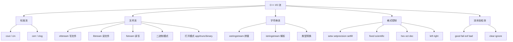

# 输入输出流（谭浩强第7章）

> 📌 C++ 的 I/O 流是一套基于**继承和运算符重载**的精巧类库。你之前用的 `cout`、`cin` 只是冰山一角——这一章你将了解整个流类层次结构，掌握格式化输出、文件读写、字符串流等实用技能。


## 📋 前置知识

在开始之前，你需要了解这些概念（如果不熟悉，先点击链接去补课）：

- [[类和对象的基本概念（谭浩强第2章）]] — 流类本身就是类，`cout` 就是 `ostream` 类的对象
- [[运算符重载（谭浩强第4章）]] — `<<` 和 `>>` 就是重载的运算符
- [[继承与派生（谭浩强第5章）]] — 流类之间构成继承体系


## 🤔 为什么要学这个？

你已经用了很久的 `cout` 和 `cin`，但可能遇到过这些困惑：

- 怎么控制输出小数的位数？（比如 $\pi$ 只显示两位小数）
- 怎么让数字右对齐、左对齐？怎么用 $0$ 填充空位？
- 怎么把输出写到文件里而不是屏幕上？
- 怎么从文件中逐行读取数据？
- 怎么把一个字符串当成"输入源"来解析？

这些都是 I/O 流的功能范围。


## 🧠 核心概念


### 7.1 流类的继承层次

> 🎯 **类比**：C++ 的 I/O 流就像一条**传送带系统**。`cout` 是一条通向屏幕的传送带，`cin` 是一条从键盘来的传送带，文件流是通向文件的传送带。它们的核心操作都一样——放东西上去（`<<`）或从上面取东西（`>>`），只是传送带的目的地不同。

C++ 的流类构成了一个继承体系：

```text
                ios_base
                   │
                  ios
                 /   \
           istream   ostream
              |    ×    |
              iostream
             /    |    \
        ifstream  fstream  ofstream
                  
        istringstream  ostringstream  stringstream
```

关键类说明：

- `ios_base` / `ios` — 所有流的根基类，包含格式控制标志、错误状态等
- `istream` — 输入流基类（`cin` 是它的对象）
- `ostream` — 输出流基类（`cout`、`cerr`、`clog` 是它的对象）
- `iostream` — 同时继承 `istream` 和 `ostream`，可读可写
- `ifstream` — 文件输入流（从文件读）
- `ofstream` — 文件输出流（往文件写）
- `fstream` — 文件输入输出流
- `istringstream` / `ostringstream` / `stringstream` — 字符串流

`cout` 能用 `<<` 输出 `int`、`double`、`string` 等各种类型，是因为 `ostream` 类为每种基本类型都重载了 `operator<<`。你在第 $4$ 章学过怎么为自己的类重载 `<<`——现在你知道了它背后的整个体系。


### 7.2 标准流对象

C++ 预定义了 $4$ 个标准流对象：

| 对象 | 类型 | 用途 | 对应 C 的 |
|------|------|------|----------|
| `cin` | `istream` | 标准输入（键盘） | `stdin` |
| `cout` | `ostream` | 标准输出（屏幕） | `stdout` |
| `cerr` | `ostream` | 标准错误（屏幕，不缓冲） | `stderr` |
| `clog` | `ostream` | 标准日志（屏幕，有缓冲） | `stderr` |

`cerr` 和 `clog` 都输出到屏幕，区别在于 `cerr` 不缓冲（每次输出立刻显示，适合错误信息），`clog` 有缓冲（适合日志，批量写入更高效）。

```cpp
#include <iostream>
using namespace std;

int main() {
    cout << "这是普通输出" << endl;
    cerr << "这是错误信息（不缓冲）" << endl;
    clog << "这是日志信息（有缓冲）" << endl;
    return 0;
}
```


### 7.3 格式化输出

#### 流操纵符（Manipulator）

流操纵符是一些特殊的值，放到 `<<` 或 `>>` 中会改变流的行为。常用的操纵符需要包含 `<iomanip>` 头文件：

```cpp
#include <iostream>
#include <iomanip>   // setw, setprecision, setfill 等
using namespace std;

int main() {
    double pi = 3.14159265358979;
    int num = 42;
    
    // ===== 浮点数精度 =====
    // setprecision(n)：设置有效数字位数（默认模式）
    cout << "默认精度:       " << pi << endl;                    // 3.14159
    cout << "3位有效数字:    " << setprecision(3) << pi << endl; // 3.14
    
    // fixed + setprecision(n)：固定小数点后 n 位
    cout << "小数点后2位:    " << fixed << setprecision(2) << pi << endl;  // 3.14
    cout << "小数点后6位:    " << setprecision(6) << pi << endl;           // 3.141593
    
    // scientific：科学计数法
    cout << "科学计数法:     " << scientific << setprecision(3) << pi << endl;  // 3.142e+00
    
    // 恢复默认格式
    cout << defaultfloat;
    
    // ===== 字段宽度与对齐 =====
    // setw(n)：设置下一个输出的最小宽度（只对紧跟的一个输出有效！）
    cout << "\n--- 字段宽度 ---" << endl;
    cout << "[" << setw(10) << num << "]" << endl;          // [        42]（右对齐）
    cout << "[" << left << setw(10) << num << "]" << endl;  // [42        ]（左对齐）
    cout << "[" << right << setw(10) << num << "]" << endl; // [        42]（右对齐）
    
    // setfill(c)：用字符 c 填充空白位置（持续有效直到再次修改）
    cout << "[" << setfill('0') << setw(6) << num << "]" << endl;  // [000042]
    cout << "[" << setfill('*') << setw(8) << num << "]" << endl;  // [******42]
    cout << setfill(' ');  // 恢复空格填充
    
    // ===== 进制输出 =====
    cout << "\n--- 进制 ---" << endl;
    cout << "十进制: " << dec << 255 << endl;      // 255
    cout << "八进制: " << oct << 255 << endl;      // 377
    cout << "十六进制: " << hex << 255 << endl;    // ff
    cout << "带前缀: " << showbase << hex << 255 << endl;  // 0xff
    cout << dec << noshowbase;  // 恢复十进制，关闭前缀
    
    // ===== 布尔值 =====
    cout << "\n--- 布尔 ---" << endl;
    cout << "默认: " << true << " " << false << endl;            // 1 0
    cout << "文字: " << boolalpha << true << " " << false << endl; // true false
    cout << noboolalpha;
    
    return 0;
}
```

```bash
clang++ -std=c++17 -o fmt fmt.cpp && ./fmt
```

预期输出：

```text
默认精度:       3.14159
3位有效数字:    3.14
小数点后2位:    3.14
小数点后6位:    3.141593
科学计数法:     3.142e+00

--- 字段宽度 ---
[        42]
[42        ]
[        42]
[000042]
[******42]

--- 进制 ---
十进制: 255
八进制: 377
十六进制: ff
带前缀: 0xff

--- 布尔 ---
默认: 1 0
文字: true false
```

#### 操纵符的持久性

| 操纵符 | 持久性 | 说明 |
|--------|--------|------|
| `setw(n)` | **一次性** | 只影响紧跟的一个输出 |
| `setprecision(n)` | 持久 | 直到再次修改 |
| `setfill(c)` | 持久 | 直到再次修改 |
| `fixed` / `scientific` | 持久 | 用 `defaultfloat` 恢复 |
| `left` / `right` | 持久 | 直到再次修改 |
| `hex` / `oct` / `dec` | 持久 | 直到再次修改 |

> ⚠️ **踩坑**：`setw` 是**一次性**的——这是最常被误解的。你以为设了 `setw(10)` 后续所有输出都宽 $10$，实际上只有紧跟的那一个输出有效。如果你要多个输出都用同样的宽度，每个前面都得写一次 `setw`。


### 7.4 流的状态检测

流对象有内部状态标志，表示当前流是否正常：

```cpp
#include <iostream>
using namespace std;

int main() {
    int x;
    cout << "请输入一个整数: ";
    cin >> x;
    
    if (cin.good()) {
        cout << "输入成功: " << x << endl;
    } else if (cin.fail()) {
        cout << "输入错误！不是有效整数" << endl;
        cin.clear();             // 清除错误状态
        cin.ignore(1000, '\n');  // 丢弃缓冲区中的无效输入
    }
    
    // 也可以直接用流对象做条件判断
    cout << "请再输入一个整数: ";
    if (cin >> x) {
        cout << "成功: " << x << endl;
    } else {
        cout << "失败！" << endl;
    }
    
    return 0;
}
```

流状态函数：

| 函数 | 含义 |
|------|------|
| `cin.good()` | 一切正常 |
| `cin.fail()` | 逻辑错误（如输入了字母但期望整数） |
| `cin.bad()` | 严重的 I/O 错误 |
| `cin.eof()` | 已到达文件末尾 |
| `cin.clear()` | 清除错误标志，恢复正常状态 |

> ⚠️ **踩坑**：一旦流进入错误状态（`fail` 或 `bad`），后续所有 `>>` 操作都会直接跳过。必须先 `cin.clear()` 清除错误状态，然后 `cin.ignore(...)` 丢弃缓冲区中的垃圾数据，才能恢复正常输入。


### 7.5 文件流（`fstream`）—— 本章最实用的部分

> 🎯 **类比**：文件流就像把传送带的出口从屏幕换成了文件。`ofstream` 是"写文件的传送带"，`ifstream` 是"读文件的传送带"。操作方式和 `cout`/`cin` 完全一样——只是数据的来源/目的地变了。

#### 写文件（`ofstream`）

```cpp
#include <iostream>
#include <fstream>   // 文件流头文件
#include <string>
using namespace std;

int main() {
    // 创建输出文件流并打开文件
    ofstream outFile("scores.txt");
    
    // 检查是否成功打开
    if (!outFile) {
        cerr << "无法创建文件！" << endl;
        return 1;
    }
    
    // 写入数据——语法和 cout 完全一样
    outFile << "姓名 数学 英语 物理" << endl;
    outFile << "张三 85 90 78" << endl;
    outFile << "李四 92 88 95" << endl;
    outFile << "王五 76 81 70" << endl;
    
    outFile.close();  // 关闭文件（也可以让析构函数自动关闭）
    cout << "数据已写入 scores.txt" << endl;
    
    return 0;
}
```

```bash
clang++ -std=c++17 -o write_file write_file.cpp && ./write_file
cat scores.txt
```

预期输出：

```text
数据已写入 scores.txt
姓名 数学 英语 物理
张三 85 90 78
李四 92 88 95
王五 76 81 70
```

#### 读文件（`ifstream`）

```cpp
#include <iostream>
#include <fstream>
#include <string>
using namespace std;

int main() {
    ifstream inFile("scores.txt");
    
    if (!inFile) {
        cerr << "无法打开文件！" << endl;
        return 1;
    }
    
    // 方式 1：逐行读取（最常用）
    cout << "===== 逐行读取 =====" << endl;
    string line;
    while (getline(inFile, line)) {
        cout << "读到: " << line << endl;
    }
    
    // 如果要重新读取，需要清除 EOF 状态并重置位置
    inFile.clear();            // 清除 eof 状态
    inFile.seekg(0);           // 回到文件开头
    
    // 方式 2：按格式读取
    cout << "\n===== 按格式读取 =====" << endl;
    string header;
    getline(inFile, header);   // 跳过第一行（表头）
    
    string name;
    int math, eng, physics;
    while (inFile >> name >> math >> eng >> physics) {
        double avg = (math + eng + physics) / 3.0;
        cout << name << " 平均分: " << avg << endl;
    }
    
    inFile.close();
    return 0;
}
```

```bash
clang++ -std=c++17 -o read_file read_file.cpp && ./read_file
```

预期输出：

```text
===== 逐行读取 =====
读到: 姓名 数学 英语 物理
读到: 张三 85 90 78
读到: 李四 92 88 95
读到: 王五 76 81 70

===== 按格式读取 =====
张三 平均分: 84.3333
李四 平均分: 91.6667
王五 平均分: 75.6667
```

#### 文件打开模式

`ofstream` 和 `ifstream` 的构造函数可以指定第二个参数控制打开模式：

| 模式标志 | 含义 |
|---------|------|
| `ios::in` | 读模式（`ifstream` 默认） |
| `ios::out` | 写模式（`ofstream` 默认，会清空原内容） |
| `ios::app` | 追加模式（在文件末尾添加，不清空） |
| `ios::ate` | 打开后定位到文件末尾 |
| `ios::trunc` | 打开时清空文件（`out` 模式默认行为） |
| `ios::binary` | 二进制模式（不进行换行符转换） |

```cpp
// 追加写入（不清空原内容）
ofstream appendFile("log.txt", ios::app);
appendFile << "新的一行日志" << endl;

// 同时读写
fstream file("data.txt", ios::in | ios::out);

// 二进制写入
ofstream binFile("data.bin", ios::binary);
```

> ⚠️ **踩坑**：`ofstream` 默认模式是 `ios::out | ios::trunc`——**会清空文件！** 如果你想追加而不是覆盖，必须用 `ios::app`。很多初学者不知道这一点，辛辛苦苦写了半天的数据被一次打开就清空了。

> ⚠️ **踩坑**：文件路径在 macOS 上用 `/`（如 `/Users/你的用户名/Desktop/test.txt`）。如果用相对路径（如 `"test.txt"`），文件会创建在**程序运行时的当前目录**——在 VS Code 终端中通常是你打开的项目文件夹。


### 7.6 二进制文件读写

文本文件以人类可读的字符形式存储数据，二进制文件则直接存储内存中的字节——更紧凑、读写更快，但不能用文本编辑器查看。

```cpp
#include <iostream>
#include <fstream>
#include <string>
using namespace std;

struct Student {
    char name[20];
    int age;
    double gpa;
};

int main() {
    // 写入二进制文件
    Student students[] = {
        {"Zhang San", 20, 3.8},
        {"Li Si", 21, 3.5},
        {"Wang Wu", 19, 3.9}
    };
    
    ofstream outBin("students.dat", ios::binary);
    // write 接受 char* 指针和字节数
    outBin.write(reinterpret_cast<char*>(students), sizeof(students));
    outBin.close();
    cout << "写入了 " << sizeof(students) << " 字节" << endl;
    
    // 读取二进制文件
    Student readBack[3];
    ifstream inBin("students.dat", ios::binary);
    inBin.read(reinterpret_cast<char*>(readBack), sizeof(readBack));
    inBin.close();
    
    cout << "\n读回的数据:" << endl;
    for (int i = 0; i < 3; i++) {
        cout << readBack[i].name << ", " 
             << readBack[i].age << "岁, GPA=" 
             << readBack[i].gpa << endl;
    }
    
    return 0;
}
```

```bash
clang++ -std=c++17 -o binary binary.cpp && ./binary
```

预期输出：

```text
写入了 120 字节

读回的数据:
Zhang San, 20岁, GPA=3.8
Li Si, 21岁, GPA=3.5
Wang Wu, 19岁, GPA=3.9
```

> ⚠️ **踩坑**：二进制文件的数据格式与**编译器、操作系统、CPU 架构**有关（字节序、对齐方式等）。在一台机器上写的二进制文件，在另一台不同架构的机器上可能读不出正确结果。跨平台数据交换应该用文本格式（CSV、JSON）或专门的序列化格式。


### 7.7 字符串流（`stringstream`）

> 🎯 **类比**：字符串流就像一条**虚拟传送带**——数据不走屏幕也不走文件，而是存在一个字符串里。你可以往字符串里"写"数据（和 `cout` 一样），也可以从字符串里"读"数据（和 `cin` 一样）。它最常见的用途是**类型转换**和**字符串拼接**。

```cpp
#include <iostream>
#include <sstream>   // 字符串流头文件
#include <string>
using namespace std;

int main() {
    // ===== ostringstream：拼接字符串 =====
    ostringstream oss;
    string name = "张三";
    int age = 20;
    double gpa = 3.8;
    
    oss << name << "同学，" << age << "岁，GPA=" << fixed << setprecision(1) << gpa;
    string result = oss.str();  // 获取拼接后的字符串
    cout << result << endl;
    
    // ===== istringstream：从字符串中解析数据 =====
    string data = "100 200 300 400 500";
    istringstream iss(data);
    
    int num;
    int sum = 0;
    while (iss >> num) {   // 像 cin 一样从字符串中读取
        sum += num;
    }
    cout << "总和: " << sum << endl;
    
    // ===== stringstream：类型转换 =====
    // int → string
    stringstream ss;
    ss << 42;
    string s;
    ss >> s;
    cout << "int → string: \"" << s << "\"" << endl;
    
    // string → double
    ss.clear();   // 清除状态
    ss.str("3.14");  // 设置新的字符串内容
    double d;
    ss >> d;
    cout << "string → double: " << d << endl;
    
    return 0;
}
```

```bash
clang++ -std=c++17 -o sstream sstream.cpp && ./sstream
```

预期输出：

```text
张三同学，20岁，GPA=3.8
总和: 1500
int → string: "42"
string → double: 3.14
```

> 💡 **现代替代**：C++11 提供了 `to_string(42)` 和 `stoi("42")`、`stod("3.14")` 等更简洁的转换函数。但 `stringstream` 在需要复杂格式化时仍然有用。


## ⚠️ 常见误区与踩坑点

> ❌ **误区 1：`endl` 和 `"\n"` 完全一样**  
> `endl` = 换行 + 刷新缓冲区。在频繁输出时（循环中百万次输出），`endl` 比 `"\n"` 慢得多。日常无所谓，性能敏感场景用 `"\n"`。

> ⚠️ **踩坑 2：`setw` 只影响紧跟的一个输出**  
> 其他操纵符（`setprecision`、`setfill`、`hex` 等）是持久的，但 `setw` 是一次性的。

> ⚠️ **踩坑 3：`cin >>` 和 `getline` 混用**  
> `cin >>` 读完后换行符留在缓冲区，紧接着 `getline` 会读到空字符串。解决：中间加 `cin.ignore();`。

> ⚠️ **踩坑 4：`ofstream` 默认清空文件**  
> 不想清空用 `ios::app`（追加模式）。


## 🔄 概念对比

### 文本文件 vs 二进制文件

| 对比项 | 文本文件 | 二进制文件 |
|--------|---------|-----------|
| 可读性 | 人类可读 | 不可读（需专门工具） |
| 大小 | 较大 | 较小（无格式开销） |
| 读写速度 | 需要格式化/解析，较慢 | 直接内存映射，较快 |
| 跨平台 | 兼容性好 | 可能有字节序/对齐问题 |
| 适用场景 | 配置文件、日志、CSV | 图片、音频、数据库 |

> 💡 **一句话总结**：人要看的用文本文件，程序用的用二进制文件。


## 🏋️ 动手练习

### 练习 1：格式化输出成绩单（⭐ 难度）

**题目**：用 `setw`、`left`、`right`、`setprecision` 输出一个整齐对齐的三人成绩单，包含姓名、三科成绩和平均分（保留 $1$ 位小数）。

**参考答案**：

```cpp
#include <iostream>
#include <iomanip>
using namespace std;

int main() {
    cout << left << setw(8) << "姓名" 
         << right << setw(6) << "数学" << setw(6) << "英语" 
         << setw(6) << "物理" << setw(8) << "平均分" << endl;
    cout << string(34, '-') << endl;
    
    string names[] = {"张三", "李四", "王五"};
    int scores[][3] = {{85, 90, 78}, {92, 88, 95}, {76, 81, 70}};
    
    for (int i = 0; i < 3; i++) {
        double avg = (scores[i][0] + scores[i][1] + scores[i][2]) / 3.0;
        cout << left << setw(8) << names[i]
             << right << setw(6) << scores[i][0] 
             << setw(6) << scores[i][1]
             << setw(6) << scores[i][2]
             << setw(8) << fixed << setprecision(1) << avg << endl;
    }
    return 0;
}
```

```bash
clang++ -std=c++17 -o report report.cpp && ./report
```

预期输出：

```text
姓名        数学    英语    物理    平均分
----------------------------------
张三          85    90    78    84.3
李四          92    88    95    91.7
王五          76    81    70    75.7
```


### 练习 2：文件读写——学生记录管理（⭐⭐ 难度）

**题目**：写一个程序，先把 $3$ 个学生信息写入文件 `students.txt`，再从文件读回并显示。每行格式：`姓名 年龄 成绩`。

**参考答案**：

```cpp
#include <iostream>
#include <fstream>
#include <string>
using namespace std;

int main() {
    // 写入
    ofstream out("students.txt");
    out << "张三 20 85.5" << endl;
    out << "李四 21 92.0" << endl;
    out << "王五 19 78.3" << endl;
    out.close();
    cout << "写入完成" << endl;
    
    // 读取
    ifstream in("students.txt");
    string name;
    int age;
    double score;
    
    cout << "\n读取结果:" << endl;
    while (in >> name >> age >> score) {
        cout << name << "，" << age << "岁，成绩: " << score << endl;
    }
    in.close();
    return 0;
}
```

```bash
clang++ -std=c++17 -o stufile stufile.cpp && ./stufile
```

预期输出：

```text
写入完成

读取结果:
张三，20岁，成绩: 85.5
李四，21岁，成绩: 92
王五，19岁，成绩: 78.3
```


## 📝 总结

### 本篇要点回顾

1. **C++ I/O 流是基于继承和运算符重载的类体系**——`cout` 是 `ostream` 对象，`cin` 是 `istream` 对象，`<<` 和 `>>` 是重载的运算符。

2. **格式化输出用流操纵符**——`setw`（一次性）、`setprecision`（持久）、`setfill`、`fixed`/`scientific`、`hex`/`oct`/`dec`、`left`/`right`。

3. **文件流和标准流用法完全一样**——`ofstream` 替代 `cout` 写文件，`ifstream` 替代 `cin` 读文件。注意 `ofstream` 默认清空文件，用 `ios::app` 追加。

4. **字符串流用于类型转换和字符串拼接**——`ostringstream` 拼接，`istringstream` 解析。

5. **流有状态**——用 `good()`/`fail()`/`eof()` 检测，`clear()` 恢复。


### 知识图谱




## 🔗 相关链接

- 上级概念：[[C++ 面向对象程序设计全书精要]]
- 前置章节：[[多态性与虚函数（谭浩强第6章）]]
- 后续章节：[[C++ 工具：模板、异常、命名空间（谭浩强第8章）]]
- 下级概念：[[C++ 文件操作详解]]、[[C++ 格式化输出详解]]、[[C++ stringstream 应用]]
- 实际应用：[[C++ CSV 文件解析]]、[[C++ 日志系统设计]]


## 📚 参考资料

- 谭浩强《C++ 面向对象程序设计（第四版）》第 $7$ 章，清华大学出版社，2024
- [C++ Reference - iostream](https://en.cppreference.com/w/cpp/io) — I/O 库完整参考
- [C++ Reference - iomanip](https://en.cppreference.com/w/cpp/header/iomanip) — 所有格式操纵符详解
- [Learn C++ - File I/O](https://www.learncpp.com/cpp-tutorial/basic-file-io/) — 英文教程
