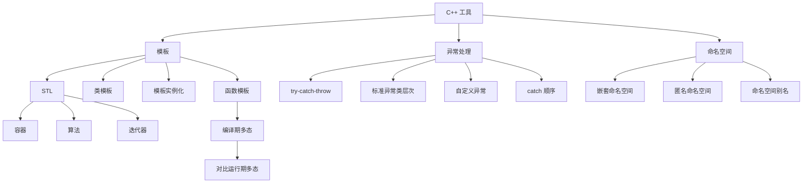

# C++ 工具：模板、异常处理与命名空间（谭浩强第8章）

> 📌 这一章介绍 C++ 的三个"生产力工具"：**模板**让你写一次代码就能处理多种类型（泛型编程），**异常处理**让程序在出错时优雅地恢复而不是直接崩溃，**命名空间**在大型项目中避免名字冲突。模板更是整个 STL（标准模板库）的基础。


## 📋 前置知识

在开始之前，你需要了解这些概念（如果不熟悉，先点击链接去补课）：

- [[多态性与虚函数（谭浩强第6章）]] — 模板提供了另一种"多态"——编译期多态（vs 虚函数的运行期多态）
- [[关于类和对象的进一步讨论（谭浩强第3章）]] — 构造/析构函数在模板类中同样适用
- [[C++ 的初步知识（谭浩强第1章）]] — 函数重载是模板的动机，命名空间在第 $1$ 章已初步介绍


## 🤔 为什么要学这个？

**场景一（模板的动机）**：你写了一个 `swap` 函数交换两个 `int`，然后发现还需要交换 `double`、交换 `string`……逻辑完全一样，只是类型不同，你被迫写了三个版本。模板让你**写一次，适用所有类型**。

**场景二（异常的动机）**：你的程序尝试打开一个文件，但文件不存在。如果不做任何处理，程序可能带着错误数据继续执行，最后在完全不相关的地方崩溃——你根本找不到 bug 的根源。异常处理让你在**错误发生的地方就捕获并处理它**。

**场景三（命名空间的动机）**：你的项目同时用了两个第三方库，它们都定义了 `sort()` 函数——编译器不知道你想用哪个，报"重定义"错误。命名空间让同名函数和平共处。


## 🧠 核心概念


### 8.1 函数模板（Function Template）

> 🎯 **类比**：函数模板就像一个**万能模具**。一个月饼模具可以做豆沙月饼、莲蓉月饼、五仁月饼——模具的形状（逻辑）不变，只是填入的馅料（数据类型）不同。函数模板的"模具"就是算法逻辑，"馅料"就是类型参数。

#### 基本语法

```cpp
template <typename T>   // T 是类型参数，用的时候才确定具体类型
T myMax(T a, T b) {
    return (a > b) ? a : b;
}
```

`template <typename T>` 告诉编译器："下面这个函数中的 `T` 是一个占位符类型，你在调用时根据实参自动推导出 `T` 的具体类型。"

```cpp
#include <iostream>
#include <string>
using namespace std;

template <typename T>
T myMax(T a, T b) {
    return (a > b) ? a : b;
}

// 也可以有多个类型参数
template <typename T1, typename T2>
void printPair(T1 a, T2 b) {
    cout << "(" << a << ", " << b << ")" << endl;
}

int main() {
    // 编译器自动推导 T 的类型
    cout << myMax(3, 7) << endl;             // T = int → 7
    cout << myMax(3.14, 2.71) << endl;       // T = double → 3.14
    cout << myMax('a', 'z') << endl;         // T = char → z
    
    // 显式指定类型
    cout << myMax<string>("apple", "banana") << endl;  // T = string → banana
    
    // 多个类型参数
    printPair(42, "hello");       // T1 = int, T2 = const char*
    printPair(3.14, true);        // T1 = double, T2 = bool
    
    return 0;
}
```

```bash
clang++ -std=c++17 -o func_tpl func_tpl.cpp && ./func_tpl
```

预期输出：

```text
7
3.14
z
banana
(42, hello)
(3.14, 1)
```

#### 模板的实例化

当你调用 `myMax(3, 7)` 时，编译器**自动生成**一个 `int` 版本的 `myMax`：

```cpp
// 编译器为你生成的代码（你看不到，但它确实存在）
int myMax(int a, int b) {
    return (a > b) ? a : b;
}
```

这个过程叫**模板实例化**（Template Instantiation）。每使用一种新类型，编译器就生成一个新的函数版本。所以模板不会减少最终的机器代码量——它减少的是你需要写的**源代码量**。

> ⚠️ **踩坑**：模板函数/类的**定义**（不仅是声明）通常必须放在头文件 `.h` 中，因为编译器在实例化模板时需要看到完整的函数体。如果你把模板的定义放在 `.cpp` 文件中，其他 `.cpp` 文件 `#include` 头文件时只看到声明看不到定义，会导致链接错误。


#### 函数模板 vs 函数重载

| 对比项 | 函数模板 | 函数重载 |
|--------|---------|---------|
| 代码量 | 写一次 | 每种类型各写一次 |
| 适用场景 | 逻辑相同，类型不同 | 逻辑不同（或部分不同） |
| 类型检查 | 实例化时检查 | 编译时直接检查 |
| 特化需求 | 可以为特定类型写特化版本 | 直接写不同实现 |

> 💡 **选择建议**：如果不同类型的逻辑**完全相同**，用模板；如果逻辑**有差异**，用重载。两者可以共存——编译器优先匹配精确的重载版本，匹配不上才尝试模板。


### 8.2 类模板（Class Template）

> 🎯 **类比**：如果说函数模板是"万能工具"，类模板就是"万能收纳箱"。一个收纳箱可以装书、装衣服、装玩具——箱子的结构（类的成员和方法）不变，装什么（类型参数）由你决定。C++ 标准库的 `vector<int>`、`vector<string>`、`map<string, int>` 全部都是类模板的实例。

```cpp
#include <iostream>
using namespace std;

// 类模板：通用的栈（Stack）
template <typename T, int MaxSize = 100>  // T 是类型参数，MaxSize 是非类型参数
class Stack {
private:
    T data[MaxSize];
    int top;

public:
    Stack() : top(-1) {}
    
    bool isEmpty() const { return top < 0; }
    bool isFull() const { return top >= MaxSize - 1; }
    
    bool push(const T &item) {
        if (isFull()) {
            cout << "栈满！" << endl;
            return false;
        }
        data[++top] = item;
        return true;
    }
    
    bool pop(T &item) {
        if (isEmpty()) {
            cout << "栈空！" << endl;
            return false;
        }
        item = data[top--];
        return true;
    }
    
    // 查看栈顶（不弹出）
    T peek() const {
        if (isEmpty()) {
            throw runtime_error("栈空，无法 peek");
        }
        return data[top];
    }
    
    int size() const { return top + 1; }
};

int main() {
    // 使用类模板时必须显式指定类型参数
    Stack<int, 50> intStack;
    intStack.push(10);
    intStack.push(20);
    intStack.push(30);
    
    cout << "栈顶: " << intStack.peek() << endl;
    cout << "大小: " << intStack.size() << endl;
    
    int val;
    while (!intStack.isEmpty()) {
        intStack.pop(val);
        cout << val << " ";
    }
    cout << endl;
    
    // 字符串栈，使用默认 MaxSize = 100
    Stack<string> strStack;
    strStack.push("Hello");
    strStack.push("World");
    
    string s;
    while (!strStack.isEmpty()) {
        strStack.pop(s);
        cout << s << " ";
    }
    cout << endl;
    
    return 0;
}
```

```bash
clang++ -std=c++17 -o stack_tpl stack_tpl.cpp && ./stack_tpl
```

预期输出：

```text
栈顶: 30
大小: 3
30 20 10 
World Hello 
```

#### 类模板的成员函数在类外定义

如果成员函数要在类外定义，每个函数前面都要重复 `template <typename T, int MaxSize>` 前缀：

```cpp
template <typename T, int MaxSize>
bool Stack<T, MaxSize>::push(const T &item) {
    // 注意作用域是 Stack<T, MaxSize>::，不是 Stack::
    if (isFull()) return false;
    data[++top] = item;
    return true;
}
```

> ⚠️ **踩坑**：类外定义模板成员函数时，作用域写 `Stack<T, MaxSize>::` 而不是 `Stack::`。忘了 `<T, MaxSize>` 会编译报错。


### 8.3 STL 简介——模板的最伟大产物

C++ 标准模板库（Standard Template Library，STL）是建立在模板之上的强大工具箱，包含三大组件：

#### 容器（Container）—— 存储数据

```cpp
#include <iostream>
#include <vector>
#include <map>
#include <set>
#include <string>
using namespace std;

int main() {
    // ===== vector：动态数组 =====
    vector<int> nums = {5, 2, 8, 1, 9};
    nums.push_back(3);       // 末尾添加
    
    cout << "vector: ";
    for (int n : nums) cout << n << " ";
    cout << endl;
    cout << "大小: " << nums.size() << ", 第一个: " << nums[0] << endl;
    
    // ===== map：键值对（自动按键排序）=====
    map<string, int> scores;
    scores["张三"] = 85;
    scores["李四"] = 92;
    scores["王五"] = 78;
    
    cout << "\nmap:" << endl;
    for (auto &pair : scores) {
        cout << "  " << pair.first << ": " << pair.second << endl;
    }
    
    // 查找
    if (scores.count("张三")) {
        cout << "张三的成绩: " << scores["张三"] << endl;
    }
    
    // ===== set：不重复的有序集合 =====
    set<int> unique = {3, 1, 4, 1, 5, 9, 2, 6, 5};  // 重复的自动去掉
    
    cout << "\nset: ";
    for (int n : unique) cout << n << " ";
    cout << endl;
    
    return 0;
}
```

```bash
clang++ -std=c++17 -o stl_demo stl_demo.cpp && ./stl_demo
```

预期输出：

```text
vector: 5 2 8 1 9 3 
大小: 6, 第一个: 5

map:
  张三: 85
  李四: 92
  王五: 78
张三的成绩: 85

set: 1 2 3 4 5 6 9 
```

#### 算法（Algorithm）—— 操作数据

```cpp
#include <iostream>
#include <vector>
#include <algorithm>  // sort, find, count, reverse 等
#include <numeric>    // accumulate
using namespace std;

int main() {
    vector<int> v = {5, 2, 8, 1, 9, 3, 7, 4, 6};
    
    // 排序
    sort(v.begin(), v.end());
    cout << "排序后: ";
    for (int n : v) cout << n << " ";
    cout << endl;
    
    // 逆序
    reverse(v.begin(), v.end());
    cout << "逆序后: ";
    for (int n : v) cout << n << " ";
    cout << endl;
    
    // 查找
    auto it = find(v.begin(), v.end(), 7);
    if (it != v.end()) {
        cout << "找到 7，索引: " << (it - v.begin()) << endl;
    }
    
    // 求和
    int sum = accumulate(v.begin(), v.end(), 0);  // 第三个参数是初始值
    cout << "总和: " << sum << endl;
    
    // 最大最小
    auto [minIt, maxIt] = minmax_element(v.begin(), v.end());
    cout << "最小: " << *minIt << ", 最大: " << *maxIt << endl;
    
    // 计数
    vector<int> v2 = {1, 2, 2, 3, 2, 4, 2};
    cout << "2 出现了 " << count(v2.begin(), v2.end(), 2) << " 次" << endl;
    
    return 0;
}
```

```bash
clang++ -std=c++17 -o algo algo.cpp && ./algo
```

预期输出：

```text
排序后: 1 2 3 4 5 6 7 8 9 
逆序后: 9 8 7 6 5 4 3 2 1 
找到 7，索引: 2
总和: 45
最小: 1, 最大: 9
2 出现了 4 次
```

#### 迭代器（Iterator）—— 连接容器和算法的桥梁

迭代器是一种"通用指针"，让你用统一的方式遍历不同类型的容器。`v.begin()` 返回指向第一个元素的迭代器，`v.end()` 返回指向"最后一个元素之后"的迭代器。

```cpp
vector<int> v = {10, 20, 30};

// 传统 for 循环 + 迭代器
for (vector<int>::iterator it = v.begin(); it != v.end(); ++it) {
    cout << *it << " ";  // *it 解引用迭代器，获取元素值
}

// C++11 简化：auto 自动推导类型
for (auto it = v.begin(); it != v.end(); ++it) {
    cout << *it << " ";
}

// C++11 更简化：范围 for 循环（最推荐）
for (int n : v) {
    cout << n << " ";
}
```

> 💡 **日常建议**：优先使用范围 for 循环（`for (auto &x : v)`），除非你需要迭代器的位置信息（比如在遍历中删除元素）。

#### 常用 STL 容器速查

| 容器 | 头文件 | 特点 | 适用场景 |
|------|--------|------|---------|
| `vector<T>` | `<vector>` | 动态数组，随机访问 $O(1)$ | 最通用的容器 |
| `list<T>` | `<list>` | 双向链表，插入删除 $O(1)$ | 频繁在中间插入/删除 |
| `deque<T>` | `<deque>` | 双端队列，两头操作 $O(1)$ | 需要在头尾都操作 |
| `map<K,V>` | `<map>` | 有序键值对，查找 $O(\log n)$ | 字典、按键排序 |
| `unordered_map<K,V>` | `<unordered_map>` | 哈希键值对，查找 $O(1)$ 平均 | 大量查找操作 |
| `set<T>` | `<set>` | 有序不重复集合 | 去重、排序 |
| `stack<T>` | `<stack>` | 栈（后进先出） | 括号匹配、DFS |
| `queue<T>` | `<queue>` | 队列（先进先出） | BFS、任务队列 |
| `priority_queue<T>` | `<queue>` | 优先队列（堆） | Top-K、贪心算法 |


### 8.4 异常处理（Exception Handling）

> 🎯 **类比**：异常处理就像**保险机制**。你开车（执行代码）时可能遇到事故（运行时错误），如果你买了保险（写了 `try-catch`），保险公司会帮你处理善后（`catch` 块执行恢复措施）。如果你没买保险，事故就直接导致车毁人亡（程序崩溃）。

#### `try-catch-throw` 三件套

```cpp
#include <iostream>
#include <stdexcept>   // runtime_error, invalid_argument 等
#include <string>
using namespace std;

// 可能抛出异常的函数
double safeDivide(double a, double b) {
    if (b == 0) {
        throw runtime_error("除数不能为零！");  // 抛出异常
    }
    return a / b;
}

int safeIndex(int arr[], int size, int index) {
    if (index < 0 || index >= size) {
        throw out_of_range("索引 " + to_string(index) + " 越界！有效范围 [0, " 
                           + to_string(size - 1) + "]");
    }
    return arr[index];
}

int main() {
    // ===== 基本的 try-catch =====
    try {
        cout << "10 / 3 = " << safeDivide(10, 3) << endl;   // 正常
        cout << "10 / 0 = " << safeDivide(10, 0) << endl;   // 抛异常
        cout << "这行不会执行" << endl;  // 异常发生后，try 块剩余代码被跳过
    }
    catch (const runtime_error &e) {
        cerr << "捕获到运行时错误: " << e.what() << endl;
    }
    
    cout << "\n程序继续执行（没有崩溃）\n" << endl;
    
    // ===== 多个 catch =====
    try {
        int arr[] = {10, 20, 30};
        cout << safeIndex(arr, 3, 5) << endl;  // 越界
    }
    catch (const out_of_range &e) {
        cerr << "越界错误: " << e.what() << endl;
    }
    catch (const exception &e) {
        // 所有标准异常类都继承自 exception，这个 catch 能捕获任何标准异常
        cerr << "通用错误: " << e.what() << endl;
    }
    catch (...) {
        // ... 能捕获任何类型的异常（包括非 exception 类型）
        cerr << "未知类型的异常！" << endl;
    }
    
    cout << "\n程序正常退出" << endl;
    return 0;
}
```

```bash
clang++ -std=c++17 -o except except.cpp && ./except
```

预期输出：

```text
10 / 3 = 3.33333
捕获到运行时错误: 除数不能为零！

程序继续执行（没有崩溃）

越界错误: 索引 5 越界！有效范围 [0, 2]

程序正常退出
```

#### 异常的执行流程

```text
try {
    代码A;      // 正常执行
    throw X;    // 抛出异常 → 立刻跳到匹配的 catch
    代码B;      // 被跳过！
}
catch (类型1) {
    处理逻辑1;   // 如果 X 的类型匹配类型1，执行这里
}
catch (类型2) {
    处理逻辑2;   // 如果不匹配类型1但匹配类型2，执行这里
}
// catch 执行完后，程序从 catch 块之后继续执行（不会崩溃）
后续代码;        // 正常执行
```

#### C++ 标准异常类层次

```text
exception
├── logic_error
│   ├── invalid_argument
│   ├── out_of_range
│   ├── length_error
│   └── domain_error
├── runtime_error
│   ├── overflow_error
│   ├── underflow_error
│   └── range_error
└── bad_alloc（new 内存分配失败时）
```

所有标准异常类都有 `what()` 方法，返回描述错误的字符串。

#### 自定义异常类

```cpp
#include <iostream>
#include <stdexcept>
#include <string>
using namespace std;

class InsufficientFundsError : public runtime_error {
private:
    double balance;
    double amount;
public:
    InsufficientFundsError(double bal, double amt)
        : runtime_error("余额不足"),
          balance(bal), amount(amt) {}
    
    double getBalance() const { return balance; }
    double getAmount() const { return amount; }
};

class BankAccount {
    double balance;
public:
    BankAccount(double b) : balance(b) {}
    
    void withdraw(double amount) {
        if (amount > balance) {
            throw InsufficientFundsError(balance, amount);
        }
        balance -= amount;
    }
    
    double getBalance() const { return balance; }
};

int main() {
    BankAccount acc(1000);
    
    try {
        acc.withdraw(500);
        cout << "取款 500 成功，余额: " << acc.getBalance() << endl;
        
        acc.withdraw(800);  // 余额不足
    }
    catch (const InsufficientFundsError &e) {
        cerr << "错误: " << e.what() << endl;
        cerr << "当前余额: " << e.getBalance() 
             << "，请求取款: " << e.getAmount() << endl;
    }
    
    return 0;
}
```

```bash
clang++ -std=c++17 -o custom_exc custom_exc.cpp && ./custom_exc
```

预期输出：

```text
取款 500 成功，余额: 500
错误: 余额不足
当前余额: 500，请求取款: 800
```

> ❌ **误区**：不要用异常来控制正常的程序流程（比如用 `throw` 替代 `if-else` 来结束循环）。异常处理的开销比普通条件判断大得多（涉及栈展开），它是为**真正的意外错误**设计的，不是为了替代 `if`。

> ⚠️ **踩坑**：`catch` 的匹配是**从上到下**的，找到第一个匹配就停止。所以**具体的异常类型放前面，通用的（如 `exception`）放后面**。如果你把 `catch(exception &e)` 放在最前面，所有异常都被它捕获了，后面的具体 `catch` 永远执行不到。


### 8.5 命名空间进阶

第 $1$ 章已经介绍了命名空间的基本概念和 `using` 声明。这里补充一些进阶内容。

#### 嵌套命名空间

```cpp
namespace Company {
    namespace Engineering {
        namespace Backend {
            void process() {
                cout << "Company::Engineering::Backend::process()" << endl;
            }
        }
    }
}

// C++17 简化写法
namespace Company::Engineering::Frontend {
    void render() {
        cout << "Company::Engineering::Frontend::render()" << endl;
    }
}

int main() {
    Company::Engineering::Backend::process();
    Company::Engineering::Frontend::render();
    return 0;
}
```

#### 匿名命名空间

没有名字的命名空间，其中的内容只在**当前文件**中可见（相当于 `static` 修饰全局变量/函数）：

```cpp
namespace {
    int internalCounter = 0;   // 只在当前 .cpp 文件中可见
    void helperFunc() { /* ... */ }  // 同上
}
```

#### 命名空间别名

```cpp
namespace VeryLongNamespaceName {
    void func() { cout << "hello" << endl; }
}

namespace Short = VeryLongNamespaceName;  // 别名
Short::func();  // 等价于 VeryLongNamespaceName::func()
```

> 💡 **重要提醒**：**不要在头文件 `.h` 中使用 `using namespace std;`**。它会把 `std` 的所有名字引入全局作用域，所有包含这个头文件的文件都会被"污染"。在 `.cpp` 文件中使用没问题。


## ⚠️ 常见误区与踩坑点

> ❌ **误区 1：模板让代码变少了所以编译后的程序也更小**  
> 模板让源代码变少了，但编译器会为每种使用到的类型生成一份代码。用了 `Stack<int>`、`Stack<double>`、`Stack<string>`，就有三份 `Stack` 的代码。这叫**代码膨胀**（Code Bloat）。

> ⚠️ **踩坑 2：模板的定义必须放在头文件中**  
> 编译器在实例化模板时需要看到完整的函数体。如果定义放在 `.cpp` 中，其他文件看不到，会链接错误。

> ⚠️ **踩坑 3：异常处理中 `catch` 的顺序**  
> 从具体到通用排列。`catch(exception&)` 放在最前面会"吞掉"所有后续的特定异常类型。

> ⚠️ **踩坑 4：`catch` 异常时用引用而不是值**  
> `catch(exception e)` 会发生**对象切片**——如果实际抛出的是 `runtime_error`，用值捕获会丢失 `runtime_error` 特有的信息。用 `catch(const exception &e)` 捕获引用是正确做法。


## 🔄 概念对比

### 编译期多态（模板） vs 运行期多态（虚函数）

| 对比项 | 模板（编译期多态） | 虚函数（运行期多态） |
|--------|-------------------|---------------------|
| 绑定时机 | 编译时 | 运行时 |
| 性能 | 更快（无间接调用） | 稍慢（vtable 间接调用） |
| 类型关系 | 不需要继承关系 | 需要继承关系 |
| 代码生成 | 每种类型生成一份代码 | 只有一份代码 |
| 灵活性 | 类型必须在编译时确定 | 类型可以在运行时确定 |
| 错误信息 | 编译错误通常很长很难读 | 错误信息相对清晰 |

> 💡 **一句话总结**：知道具体类型用模板（编译期决定），不知道具体类型用虚函数（运行期决定）。

### 异常 vs 错误码

| 对比项 | 异常处理 | 错误码返回值 |
|--------|---------|-------------|
| 语法 | `try-catch-throw` | `if (result < 0)` |
| 正常路径可读性 | 高（正常逻辑连续不被打断） | 低（到处是错误检查的 `if`） |
| 性能 | 正常路径无开销，异常路径开销大 | 每次调用都有检查开销 |
| 强制处理 | 不捕获就崩溃（无法忽略） | 可以不检查返回值（容易忘） |
| 适用场景 | 真正的异常情况（文件不存在、网络断开） | 预期的错误（用户输入无效） |


## 🏋️ 动手练习

### 练习 1：函数模板——通用交换和排序（⭐ 难度）

**题目**：写一个模板函数 `mySwap(T &a, T &b)` 和 `bubbleSort(T arr[], int n)`，分别用 `int` 数组和 `string` 数组测试。

**参考答案**：

```cpp
#include <iostream>
#include <string>
using namespace std;

template <typename T>
void mySwap(T &a, T &b) {
    T temp = a;
    a = b;
    b = temp;
}

template <typename T>
void bubbleSort(T arr[], int n) {
    for (int i = 0; i < n - 1; i++) {
        for (int j = 0; j < n - 1 - i; j++) {
            if (arr[j] > arr[j + 1]) {
                mySwap(arr[j], arr[j + 1]);
            }
        }
    }
}

template <typename T>
void printArray(T arr[], int n) {
    for (int i = 0; i < n; i++) {
        cout << arr[i];
        if (i < n - 1) cout << ", ";
    }
    cout << endl;
}

int main() {
    int nums[] = {5, 2, 8, 1, 9};
    bubbleSort(nums, 5);
    cout << "int 排序: ";
    printArray(nums, 5);
    
    string words[] = {"banana", "apple", "cherry", "date"};
    bubbleSort(words, 4);
    cout << "string 排序: ";
    printArray(words, 4);
    
    return 0;
}
```

```bash
clang++ -std=c++17 -o tpl_sort tpl_sort.cpp && ./tpl_sort
```

预期输出：

```text
int 排序: 1, 2, 5, 8, 9
string 排序: apple, banana, cherry, date
```


### 练习 2：类模板——通用动态数组（⭐⭐ 难度）

**题目**：实现一个类模板 `DynArray<T>`，支持 `push_back`、`operator[]`、`size`，内部用动态内存管理（`new`/`delete`），自动扩容。

**参考答案**：

```cpp
#include <iostream>
#include <string>
using namespace std;

template <typename T>
class DynArray {
private:
    T *data;
    int len;       // 当前元素个数
    int capacity;  // 当前容量

    void expand() {
        capacity *= 2;
        T *newData = new T[capacity];
        for (int i = 0; i < len; i++) {
            newData[i] = data[i];
        }
        delete[] data;
        data = newData;
    }

public:
    DynArray() : len(0), capacity(4) {
        data = new T[capacity];
    }
    
    ~DynArray() { delete[] data; }
    
    void push_back(const T &item) {
        if (len >= capacity) expand();
        data[len++] = item;
    }
    
    T& operator[](int index) { return data[index]; }
    const T& operator[](int index) const { return data[index]; }
    int size() const { return len; }
};

int main() {
    DynArray<int> arr;
    for (int i = 0; i < 10; i++) {
        arr.push_back(i * 10);
    }
    
    cout << "int 数组 (大小=" << arr.size() << "): ";
    for (int i = 0; i < arr.size(); i++) {
        cout << arr[i] << " ";
    }
    cout << endl;
    
    DynArray<string> words;
    words.push_back("Hello");
    words.push_back("Template");
    words.push_back("World");
    
    cout << "string 数组: ";
    for (int i = 0; i < words.size(); i++) {
        cout << words[i] << " ";
    }
    cout << endl;
    
    return 0;
}
```

```bash
clang++ -std=c++17 -o dynarr dynarr.cpp && ./dynarr
```

预期输出：

```text
int 数组 (大小=10): 0 10 20 30 40 50 60 70 80 90 
string 数组: Hello Template World 
```


### 练习 3：异常处理——安全的类型转换器（⭐⭐ 难度）

**题目**：编写函数 `int safeStoi(const string &s)`，把字符串转为 `int`。如果字符串不是有效整数，捕获 `invalid_argument` 异常并提示用户重新输入，直到成功为止。

**参考答案**：

```cpp
#include <iostream>
#include <string>
#include <stdexcept>
using namespace std;

int safeStoi(const string &prompt) {
    while (true) {
        cout << prompt;
        string input;
        getline(cin, input);
        
        try {
            int result = stoi(input);  // 可能抛出 invalid_argument 或 out_of_range
            return result;
        }
        catch (const invalid_argument &) {
            cout << "\"" << input << "\" 不是有效整数，请重试。" << endl;
        }
        catch (const out_of_range &) {
            cout << "\"" << input << "\" 超出 int 范围，请重试。" << endl;
        }
    }
}

int main() {
    int age = safeStoi("请输入你的年龄: ");
    cout << "你的年龄是: " << age << endl;
    return 0;
}
```

假设输入序列为 `abc` → `12.5` → `25`，预期输出：

```text
请输入你的年龄: abc
"abc" 不是有效整数，请重试。
请输入你的年龄: 12.5
你的年龄是: 12
```

（注意 `stoi("12.5")` 会成功返回 $12$，它只解析到第一个非数字字符就停止。）


## 📝 总结

### 本篇要点回顾

1. **函数模板用 `template <typename T>` 声明**——编译器根据实参自动推导类型，为每种用到的类型生成一份代码。定义必须放在头文件中。

2. **类模板用 `template <typename T>` 声明**——使用时必须显式指定类型参数（如 `Stack<int>`）。可以有非类型参数（如 `int MaxSize`）和默认值。

3. **STL 是模板的最伟大产物**——`vector`、`map`、`set` 是容器；`sort`、`find` 是算法；迭代器连接两者。优先使用 STL 容器而不是裸数组。

4. **异常处理用 `try-catch-throw`**——`throw` 抛出异常，`try` 包裹可能出错的代码，`catch` 捕获并处理。异常类用引用捕获，具体类型放前面。不要用异常控制正常流程。

5. **命名空间避免名字冲突**——`using namespace std;` 别放头文件中。C++17 支持嵌套命名空间简写 `namespace A::B::C {}`。


### 知识图谱




## 🔗 相关链接

- 上级概念：[[C++ 面向对象程序设计全书精要]]
- 前置章节：[[多态性与虚函数（谭浩强第6章）]]、[[输入输出流（谭浩强第7章）]]
- 下级概念：[[C++ STL 容器详解]]、[[C++ STL 算法详解]]、[[C++ 模板元编程入门]]、[[C++ 异常安全编程]]
- 进阶主题：[[C++ 智能指针]]、[[C++ 移动语义与右值引用]]、[[C++ Lambda 表达式]]
- 实际应用：[[C++ 项目实战]]、[[C++ 设计模式实践]]


## 📚 参考资料

- 谭浩强《C++ 面向对象程序设计（第四版）》第 $8$ 章，清华大学出版社，2024
- [C++ Reference - Templates](https://en.cppreference.com/w/cpp/language/templates) — 模板的完整语法参考
- [C++ Reference - Exceptions](https://en.cppreference.com/w/cpp/language/exceptions) — 异常处理详解
- [C++ Reference - Containers](https://en.cppreference.com/w/cpp/container) — STL 容器完整参考
- [Learn C++ - Templates](https://www.learncpp.com/cpp-tutorial/function-templates/) — 英文教程
