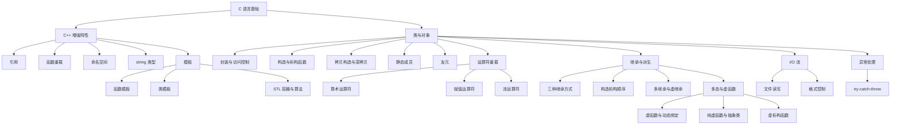

# C++ 面向对象程序设计（第四版）全书精要

> 📌 这是谭浩强《C++ 面向对象程序设计（第四版）》的系统性读书笔记。全书围绕一个核心问题展开：**如何用"面向对象"的思维方式来组织和管理复杂程序**。本笔记覆盖全书所有核心章节，适合有一定基础的读者系统复习和查漏补缺。


## 📋 前置知识

在开始之前，你需要了解这些概念（如果不熟悉，先点击链接去补课）：

- [[C 语言基础]] — 本书假设你已经学过 C 语言，了解变量、函数、数组、指针等基本概念
- [[基本数据类型与控制流]] — `int`、`float`、`char`、`if-else`、`for`、`while` 这些你得会
- [[指针与数组基础]] — C++ 的很多机制（引用、动态内存、多态）都建立在指针理解之上


## 🤔 为什么要学这个？

想象你正在搭一个乐高城市。刚开始只有几十块积木，你随手拼就行了。但当积木变成几千块、上万块时，你会发现：零件散落一地，根本不知道哪个属于哪个建筑；改一栋楼的墙壁，可能把另一栋楼的窗户也弄坏了；想复用"门"的设计来造"大门"，却不得不从头再拼一个。

这就是**面向过程编程**（Procedural Programming）在程序变大后遇到的困境：函数和数据分离，修改一处影响全局，代码无法复用。

**面向对象编程**（Object-Oriented Programming，简称 OOP）就是解决这个问题的。它的核心思路是：**把数据和操作数据的函数打包在一起，形成一个个独立的"对象"**，就像把乐高积木分类装进不同的盒子，每个盒子自成一体，互不干扰，还能用旧盒子改装出新盒子。

谭浩强这本书的价值在于：它从 C 语言过渡到 C++，用大量代码示例把面向对象的每个核心机制讲透。即使你已经有一定基础，系统过一遍仍然能发现自己的知识盲区。


## 🧠 核心概念


### 第一部分：从 C 到 C++ 的过渡

> 🎯 **类比**：如果 C 语言是一辆手动挡汽车，C++ 就是在手动挡基础上加装了自动挡、倒车影像、巡航系统等高级功能。你原来的驾驶技术（C 基础）完全保留，只是多了更多工具可以用。

本书前几章介绍了 C++ 相对于 C 新增的非面向对象特性，这些是后续理解 OOP 的基础设施。


#### 1.1 引用（Reference）

**是什么**：引用是给一个已存在的变量起一个"别名"。声明引用时用 `&` 符号。引用一旦绑定到某个变量，就永远指向那个变量，不能改指向别的。

**为什么需要它**：在 C 语言中，如果想让函数修改外部变量，必须传指针（`int *p`），写起来需要 `*p` 解引用，容易出错。引用提供了一种更直观的方式——语法上看起来就像在操作原变量本身。

```cpp
#include <iostream>
using namespace std;

// 用引用实现交换函数 —— 比指针版本更简洁
void swap(int &a, int &b) {  // a 和 b 是外部变量的别名
    int temp = a;
    a = b;       // 直接赋值，不需要 *a
    b = temp;
}

int main() {
    int x = 10, y = 20;
    swap(x, y);  // 不需要传 &x, &y
    cout << "x = " << x << ", y = " << y << endl;
    return 0;
}
```

```bash
clang++ -std=c++17 -o ref_demo ref_demo.cpp && ./ref_demo
```

预期输出：

```text
x = 20, y = 10
```

> ⚠️ **踩坑**：引用必须在声明时就初始化（`int &r = x;` ✅），不能先声明再绑定（`int &r; r = x;` ❌ 编译报错）。引用不是指针，它没有自己的内存地址，不能为 `nullptr`。


#### 1.2 函数重载（Function Overloading）

**是什么**：允许多个函数拥有相同的函数名，只要它们的**参数列表不同**（参数个数不同、参数类型不同、或参数顺序不同）。编译器会根据调用时传入的实参自动选择匹配的版本。

**为什么需要它**：在 C 语言中，求绝对值需要 `abs()`（整数）、`fabs()`（浮点数）、`labs()`（长整数）三个不同名函数，程序员必须记住哪种类型用哪个名字。有了重载，我们可以让它们都叫 `myAbs()`，编译器自动根据参数类型选正确版本。

```cpp
#include <iostream>
using namespace std;

// 三个同名函数，参数类型不同 —— 这就是函数重载
int myAbs(int n) {
    cout << "调用 int 版本: ";
    return n < 0 ? -n : n;
}

double myAbs(double n) {
    cout << "调用 double 版本: ";
    return n < 0 ? -n : n;
}

long myAbs(long n) {
    cout << "调用 long 版本: ";
    return n < 0 ? -n : n;
}

int main() {
    cout << myAbs(-5) << endl;      // 匹配 int 版本
    cout << myAbs(-3.14) << endl;   // 匹配 double 版本
    cout << myAbs(-100000L) << endl; // 匹配 long 版本
    return 0;
}
```

预期输出：

```text
调用 int 版本: 5
调用 double 版本: 3.14
调用 long 版本: 100000
```

> ❌ **误区**：**仅返回值类型不同不能构成重载**。`int foo()` 和 `double foo()` 不是合法的重载，因为编译器在调用 `foo()` 时无法仅凭返回值判断你想调用哪个。


#### 1.3 内联函数（Inline Function）与默认参数

**内联函数**：用 `inline` 关键字修饰的函数，编译器会尝试在调用处直接展开函数体，而不是进行常规的函数调用（压栈、跳转、返回）。适合函数体很短（$1$-$3$ 行）、调用频繁的函数。注意 `inline` 只是建议，编译器可以忽略。

**默认参数**：在函数声明时给参数一个默认值，调用时如果不传这个参数，就用默认值。默认参数必须从右往左连续设置（不能"跳着"给默认值）。

```cpp
#include <iostream>
using namespace std;

// 默认参数：base 默认为 10
// 如果调用时只传一个参数，base 自动为 10
void printNumber(int num, int base = 10) {
    if (base == 16) {
        cout << hex << num << endl;  // 十六进制输出
    } else {
        cout << dec << num << endl;  // 十进制输出
    }
}

int main() {
    printNumber(255);      // 使用默认 base=10，输出 255
    printNumber(255, 16);  // 指定 base=16，输出 ff
    return 0;
}
```

预期输出：

```text
255
ff
```

> ⚠️ **踩坑**：默认参数只能在函数**声明**中写一次。如果在头文件里声明了默认参数，在 `.cpp` 文件的函数定义中就**不能**再写默认值，否则编译报"重复定义默认参数"错误。


#### 1.4 命名空间（Namespace）与 `string` 类型

**命名空间**：解决名字冲突的机制。`using namespace std;` 的意思是"把标准库的所有名字（`cout`、`cin`、`string` 等）引入当前作用域，这样就不用每次写 `std::cout` 了"。在大型项目中，一般不在头文件中使用 `using namespace std;`，以免污染全局命名空间。

**`string` 类型**：C++ 标准库提供的字符串类，比 C 的 `char[]` 强大得多——可以直接用 `+` 拼接、用 `==` 比较、用 `.length()` 获取长度，不需要手动管理内存。

```cpp
#include <iostream>
#include <string>  // 使用 string 需要包含这个头文件
using namespace std;

int main() {
    string greeting = "Hello";
    string name = "World";
    string message = greeting + ", " + name + "!";  // 直接用 + 拼接
    cout << message << endl;               // 输出完整字符串
    cout << "长度: " << message.length() << endl;  // 获取长度
    
    // 字符串比较：直接用 == ，不需要 strcmp
    if (greeting == "Hello") {
        cout << "相等！" << endl;
    }
    return 0;
}
```

预期输出：

```text
Hello, World!
长度: 13
相等！
```

理解了 C++ 在 C 基础上的这些增强之后，我们就可以正式进入面向对象的世界了。接下来的内容是全书的核心——类与对象。


---

### 第二部分：类与对象 —— OOP 的基石

> 🎯 **类比**：**类（Class）就像一张建筑图纸**，它规定了一栋楼有几层、每层多大、有几个房间。**对象（Object）就是按照图纸盖出来的实际的楼**。一张图纸可以盖出很多栋一模一样的楼，就像一个类可以创建很多个对象。图纸本身不能住人（类不占数据内存），只有盖出来的楼才能住人（对象才有实际数据）。


#### 2.1 类的定义与访问控制

**是什么**：类是一种用户自定义的数据类型，它把**数据**（成员变量 / 数据成员 / Data Members）和**操作数据的函数**（成员函数 / Member Functions / 方法）封装在一起。

**访问控制**是面向对象的核心机制之一。类的成员可以被标记为三种访问级别：

- `public`（公有）：任何外部代码都能访问。通常用于对外提供的接口（成员函数）
- `private`（私有）：只有类自己的成员函数能访问。通常用于保护内部数据
- `protected`（受保护）：自己和子类能访问，外部不能。我们讲到继承时再详细说

**为什么需要访问控制**？想象你去银行，你可以通过柜台窗口（`public` 函数）存钱、取钱，但你不能直接跑到金库里（`private` 数据）自己拿钱。这样银行才能保证每一笔交易都是合法的、经过验证的。如果任何人都能直接修改你的余额，那就乱套了。这就是**封装**（Encapsulation）——把数据藏起来，只通过受控的接口来操作它。

```cpp
#include <iostream>
#include <string>
using namespace std;

class Student {
private:
    // 私有数据：外部不能直接访问
    string name;
    int age;
    float score;

public:
    // 公有接口：外部通过这些函数来操作数据
    
    // 设置学生信息 —— 可以在这里加验证逻辑
    void setInfo(string n, int a, float s) {
        name = n;
        if (a > 0 && a < 150) {  // 年龄验证
            age = a;
        } else {
            cout << "年龄不合法！" << endl;
            age = 0;
        }
        if (s >= 0 && s <= 100) {  // 分数验证
            score = s;
        } else {
            cout << "分数不合法！" << endl;
            score = 0;
        }
    }
    
    // 展示学生信息
    void display() {
        cout << "姓名: " << name 
             << ", 年龄: " << age 
             << ", 成绩: " << score << endl;
    }
};

int main() {
    Student stu1;                      // 创建一个 Student 对象
    stu1.setInfo("张三", 20, 92.5);   // 通过公有接口设置数据
    stu1.display();                    // 通过公有接口展示数据
    
    // stu1.score = -50;  // ❌ 编译错误！score 是 private，外部不能直接访问
    
    return 0;
}
```

```bash
clang++ -std=c++17 -o student student.cpp && ./student
```

预期输出：

```text
姓名: 张三, 年龄: 20, 成绩: 92.5
```

> ❌ **误区**：很多初学者以为 `private` 是"每个对象各自私有"。实际上 `private` 是**类级别**的访问控制，不是对象级别的。同一个类的两个对象之间，是可以在成员函数中访问对方的 `private` 成员的。比如在一个 `compare` 函数中，`this->score` 和 `other.score` 都可以访问。


#### 2.2 构造函数与析构函数

**构造函数（Constructor）**：一个与类同名、没有返回值类型的特殊成员函数，在对象创建时**自动调用**。它的作用是初始化对象的数据成员。你不能手动调用构造函数——它就像出生证明，在"出生"那一刻自动填好。

**析构函数（Destructor）**：名字是 `~类名`，也没有返回值和参数，在对象销毁时**自动调用**。它的作用是做善后清理工作（释放动态内存、关闭文件等）。就像租房退租时的打扫——不管你记不记得，到期了会自动执行。

**为什么需要它们**：如果没有构造函数，每次创建对象后都要手动调用 `setInfo()` 来初始化，很容易忘记，导致对象处于"未初始化"的危险状态（成员变量是随机垃圾值）。构造函数保证**对象一出生就是合法的**。

```cpp
#include <iostream>
#include <string>
using namespace std;

class Student {
private:
    string name;
    int age;
    float score;

public:
    // 默认构造函数（无参数）
    Student() {
        name = "未命名";
        age = 0;
        score = 0;
        cout << "默认构造函数被调用，创建了: " << name << endl;
    }
    
    // 带参数的构造函数（函数重载！）
    Student(string n, int a, float s) : name(n), age(a), score(s) {
        // 上面那个冒号后面的语法叫"初始化列表"（Initializer List）
        // 它比在函数体内赋值更高效，因为是直接初始化而不是先默认构造再赋值
        cout << "带参构造函数被调用，创建了: " << name << endl;
    }
    
    // 析构函数
    ~Student() {
        cout << "析构函数被调用，销毁了: " << name << endl;
    }
    
    void display() {
        cout << name << ", " << age << "岁, " << score << "分" << endl;
    }
};

int main() {
    cout << "--- 进入 main ---" << endl;
    Student s1;                          // 调用默认构造函数
    Student s2("李四", 21, 88.0);       // 调用带参构造函数
    s1.display();
    s2.display();
    cout << "--- 离开 main ---" << endl;
    // 离开 main 时，s2 先析构（后创建的先销毁），s1 后析构
    return 0;
}
```

预期输出：

```text
--- 进入 main ---
默认构造函数被调用，创建了: 未命名
带参构造函数被调用，创建了: 李四
未命名, 0岁, 0分
李四, 21岁, 88分
--- 离开 main ---
析构函数被调用，销毁了: 李四
析构函数被调用，销毁了: 未命名
```

注意析构顺序是**后进先出**（LIFO），就像一叠盘子，最后放上去的最先拿走。

> ⚠️ **踩坑**：初始化列表（`: name(n), age(a)`）的初始化顺序不取决于你在列表中的书写顺序，而是取决于**成员变量在类中声明的顺序**。如果 `name` 在 `age` 前面声明，那不管你初始化列表怎么写，`name` 都先被初始化。


#### 2.3 拷贝构造函数（Copy Constructor）

**是什么**：一种特殊的构造函数，它用一个**已有的同类型对象**来初始化一个新对象。形式为 `类名(const 类名 &other)`。

**什么时候触发**：三种场景——①用一个对象初始化另一个对象（`Student s2 = s1;`），②函数参数是按值传递的对象，③函数返回值是对象。

**为什么需要关注它**：编译器会自动生成一个默认的拷贝构造函数，它做的是**浅拷贝**（Shallow Copy）——逐个成员复制值。对于简单类型这没问题，但如果类里有指针成员，浅拷贝只复制了指针的值（地址），两个对象会指向同一块内存，析构时会**重复释放**同一块内存（Double Free），直接崩溃。

> 🎯 **类比**：浅拷贝就像复印了一张"储物柜钥匙"。你和你朋友手里都有钥匙，但打开的是同一个柜子。如果你把柜子清空了（析构），你朋友再用钥匙去开，发现柜子已经不存在了——程序崩溃。**深拷贝**则是复制了一整个新柜子，各管各的。

```cpp
#include <iostream>
#include <cstring>
using namespace std;

class MyString {
private:
    char *data;    // 指向动态分配的字符数组
    int length;

public:
    // 构造函数：动态分配内存
    MyString(const char *s = "") {
        length = strlen(s);
        data = new char[length + 1];  // +1 为了存 '\0'
        strcpy(data, s);
        cout << "构造: \"" << data << "\"" << endl;
    }
    
    // 深拷贝构造函数 —— 关键！
    MyString(const MyString &other) {
        length = other.length;
        data = new char[length + 1];  // 分配新内存（深拷贝的核心）
        strcpy(data, other.data);     // 复制内容到新内存
        cout << "拷贝构造: \"" << data << "\"" << endl;
    }
    
    // 析构函数：释放动态内存
    ~MyString() {
        cout << "析构: \"" << data << "\"" << endl;
        delete[] data;  // 释放 new[] 分配的数组
    }
    
    void display() { cout << data << endl; }
};

int main() {
    MyString s1("Hello");
    MyString s2 = s1;   // 调用拷贝构造函数（深拷贝）
    s1.display();
    s2.display();
    // 退出时，s1 和 s2 各自释放各自的内存，不会冲突
    return 0;
}
```

预期输出：

```text
构造: "Hello"
拷贝构造: "Hello"
Hello
Hello
析构: "Hello"
析构: "Hello"
```


#### 2.4 静态成员（Static Members）

**是什么**：用 `static` 修饰的成员变量或成员函数，它们属于**类本身**而不是某个具体对象。所有对象共享同一份静态成员变量。

**为什么需要它**：有时候你需要一个"全班共享"的信息。比如你想统计一共创建了多少个 `Student` 对象——这个计数器不属于任何一个学生，而是属于 `Student` 这个类本身。

```cpp
#include <iostream>
using namespace std;

class Student {
private:
    string name;
    static int count;  // 静态成员变量：所有对象共享

public:
    Student(string n) : name(n) {
        count++;  // 每创建一个对象，计数器加 1
        cout << "创建 " << name << "，当前总人数: " << count << endl;
    }
    
    ~Student() {
        count--;
        cout << "销毁 " << name << "，当前总人数: " << count << endl;
    }
    
    // 静态成员函数：可以不通过对象直接调用
    static int getCount() {
        // 静态函数内部只能访问静态成员，不能访问普通成员
        return count;
    }
};

// 静态成员变量必须在类外部单独定义和初始化 —— 这是很多人忘记的一步！
int Student::count = 0;

int main() {
    cout << "初始人数: " << Student::getCount() << endl;  // 用类名直接调用
    Student s1("Alice");
    Student s2("Bob");
    cout << "当前人数: " << Student::getCount() << endl;
    return 0;
}
```

预期输出：

```text
初始人数: 0
创建 Alice，当前总人数: 1
创建 Bob，当前总人数: 2
当前人数: 2
销毁 Bob，当前总人数: 1
销毁 Alice，当前总人数: 0
```

> ⚠️ **踩坑**：忘记在类外定义静态成员变量（`int Student::count = 0;`）是最常见的错误，会导致链接错误（Linker Error）。类内的 `static int count;` 只是**声明**，不是定义，不分配内存。


#### 2.5 友元（Friend）

**是什么**：用 `friend` 关键字声明的外部函数或其他类，可以访问当前类的 `private` 和 `protected` 成员。友元不是类的成员函数，但拥有"特权通行证"。

**为什么需要它**：有时候严格的封装太死板了。比如你要重载 `<<` 运算符（让 `cout << obj` 能工作），这个运算符的第一个操作数是 `ostream`，不是你的类对象，所以它不能是你的类的成员函数，但它又需要访问类的私有数据——这时友元就派上用场了。

```cpp
#include <iostream>
using namespace std;

class Point {
private:
    double x, y;

public:
    Point(double a, double b) : x(a), y(b) {}
    
    // 声明友元函数 —— 允许外部的 distanceBetween 访问私有成员
    friend double distanceBetween(const Point &p1, const Point &p2);
    
    // 声明友元运算符 —— 允许 << 运算符访问私有成员
    friend ostream& operator<<(ostream &os, const Point &p);
};

// 友元函数定义（不是 Point 的成员函数，没有 Point:: 前缀）
double distanceBetween(const Point &p1, const Point &p2) {
    double dx = p1.x - p2.x;  // 可以直接访问 private 成员！
    double dy = p1.y - p2.y;
    return sqrt(dx * dx + dy * dy);
}

// 重载 << 运算符（友元函数）
ostream& operator<<(ostream &os, const Point &p) {
    os << "(" << p.x << ", " << p.y << ")";
    return os;
}

int main() {
    Point a(3.0, 0.0), b(0.0, 4.0);
    cout << "点A: " << a << ", 点B: " << b << endl;
    cout << "距离: " << distanceBetween(a, b) << endl;
    return 0;
}
```

```bash
clang++ -std=c++17 -o friend_demo friend_demo.cpp && ./friend_demo
```

预期输出：

```text
点A: (3, 0), 点B: (0, 4)
距离: 5
```

> ❌ **误区**：友元**破坏了封装性**，应该**谨慎使用**。不要为了图方便把所有外部函数都声明为友元——那样 `private` 就名存实亡了。友元最正当的用途是运算符重载和需要同时访问多个类私有数据的工具函数。

到这里，我们已经掌握了"类与对象"的全部基础设施。接下来的问题很自然：如果我们想创建一个新的类，它和已有的类很像，只是多了一些功能或者修改了一些行为，难道要从头写一遍吗？当然不用——这就是**继承**。


---

### 第三部分：运算符重载 —— 让自定义类型像内置类型一样使用

> 🎯 **类比**：运算符重载就像给一个外国人教你们村的方言。`+` 号本来只会做数字加法（内置类型），但你可以"教"它怎么给两个 `Point` 对象做坐标相加、给两个 `string` 对象做拼接。**运算符的名字没变（还是 `+`），但含义变了（由你定义）**。


#### 3.1 运算符重载的基本语法

运算符本质上就是一个函数，`a + b` 实际上是 `operator+(a, b)` 或 `a.operator+(b)` 的语法糖。重载运算符就是定义一个名为 `operator+`（或 `operator<<`、`operator==` 等）的函数。

运算符重载有两种形式：
- **成员函数形式**：左操作数是当前对象（`this`）
- **友元/全局函数形式**：两个操作数都是参数

```cpp
#include <iostream>
using namespace std;

class Complex {
private:
    double real, imag;  // 实部和虚部

public:
    Complex(double r = 0, double i = 0) : real(r), imag(i) {}
    
    // 成员函数形式重载 + 
    // this->real + c2.real，this 是左操作数
    Complex operator+(const Complex &c2) const {
        return Complex(real + c2.real, imag + c2.imag);
    }
    
    // 成员函数形式重载 ==
    bool operator==(const Complex &c2) const {
        return (real == c2.real) && (imag == c2.imag);
    }
    
    // 友元形式重载 << （必须用友元，因为左操作数是 ostream）
    friend ostream& operator<<(ostream &os, const Complex &c);
};

ostream& operator<<(ostream &os, const Complex &c) {
    os << c.real;
    if (c.imag >= 0) os << "+";
    os << c.imag << "i";
    return os;
}

int main() {
    Complex c1(3, 4), c2(1, -2);
    Complex c3 = c1 + c2;    // 调用 operator+
    cout << c1 << " + " << c2 << " = " << c3 << endl;
    cout << "c1 == c2 ? " << (c1 == c2 ? "是" : "否") << endl;
    return 0;
}
```

预期输出：

```text
3+4i + 1-2i = 4+2i
c1 == c2 ? 否
```


#### 3.2 赋值运算符重载（`operator=`）

当类中有指针成员时，必须重载 `=` 运算符来实现**深拷贝**，道理和拷贝构造函数一样。编译器默认的 `=` 只做浅拷贝（按成员逐个赋值），如果有指针就会出现双重释放的问题。

深拷贝赋值运算符的标准写法需要注意三点：①检查自赋值（`if (this == &other) return *this;`），②先释放旧内存，③分配新内存并复制内容。

> ⚠️ **踩坑**：忘记检查自赋值是一个经典 bug。如果 `a = a;`，先释放了 `a` 的内存再从 `a` 复制数据——此时数据已经被释放了，程序崩溃。


#### 3.3 `++`/`--` 运算符的前置与后置区分

前置版本 `++i` 没有参数，后置版本 `i++` 有一个占位的 `int` 参数（不使用，仅用于区分）：

```cpp
// 前置 ++ ：先加再返回（返回引用，效率更高）
Complex& operator++() {
    real++;
    return *this;
}

// 后置 ++ ：先返回再加（返回旧值的副本）
Complex operator++(int) {  // int 是占位参数
    Complex old = *this;   // 保存旧值
    real++;
    return old;            // 返回旧值
}
```

> 💡 **性能提示**：对于自定义类型，**优先使用前置 `++i`** 而不是后置 `i++`，因为后置需要创建一个临时副本，开销更大。


#### 3.4 不能重载的运算符

有 $5$ 个运算符是不能重载的：`.`（成员访问）、`.*`（成员指针访问）、`::`（作用域解析）、`sizeof`、`?:`（三元运算符）。此外，重载不能改变运算符的操作数个数、优先级和结合性。

学完运算符重载，你的自定义类已经可以像内置类型一样自然地使用各种运算符了。但面向对象最强大的特性还没登场——接下来是**继承与多态**。


---

### 第四部分：继承与派生 —— 代码复用的艺术

> 🎯 **类比**：继承就像族谱。你的父亲有"走路"、"说话"这些能力（基类的成员），你作为儿子（派生类）天生就继承了这些能力，同时你还可以学会"弹吉他"（新增的成员），甚至你"说话"的方式和你父亲不一样（重写成员函数）。**你不需要从零学会走路——你继承了它。**


#### 4.1 继承的基本语法与三种继承方式

```cpp
class 派生类名 : 继承方式 基类名 {
    // 新增的成员
};
```

继承方式决定了基类成员在派生类中的访问权限如何变化：

| 基类成员 | public 继承 | protected 继承 | private 继承 |
|---------|------------|---------------|-------------|
| public | → public | → protected | → private |
| protected | → protected | → protected | → private |
| private | 不可访问 | 不可访问 | 不可访问 |

> 💡 **一句话总结**：`public` 继承是最常用的（"is-a"关系，学生**是**人）。`private` 和 `protected` 继承很少用，主要用于实现层面的复用（"has-a"实现技巧）。

```cpp
#include <iostream>
#include <string>
using namespace std;

// 基类：人
class Person {
protected:          // protected：自己和子类可以访问
    string name;
    int age;
    
public:
    Person(string n, int a) : name(n), age(a) {
        cout << "Person 构造: " << name << endl;
    }
    
    ~Person() {
        cout << "Person 析构: " << name << endl;
    }
    
    void introduce() {
        cout << "我叫" << name << "，今年" << age << "岁" << endl;
    }
};

// 派生类：学生 "is-a" 人
class Student : public Person {
private:
    string school;
    float gpa;

public:
    // 派生类构造函数必须调用基类构造函数来初始化继承来的成员
    Student(string n, int a, string sch, float g)
        : Person(n, a),     // 先调用基类构造函数
          school(sch), gpa(g) {
        cout << "Student 构造: " << name << endl;
    }
    
    ~Student() {
        cout << "Student 析构: " << name << endl;
    }
    
    void showInfo() {
        introduce();  // 调用基类的函数
        cout << "学校: " << school << "，GPA: " << gpa << endl;
    }
};

int main() {
    Student stu("王五", 19, "清华大学", 3.8);
    stu.showInfo();
    return 0;
}
```

预期输出：

```text
Person 构造: 王五
Student 构造: 王五
我叫王五，今年19岁
学校: 清华大学，GPA: 3.8
Student 析构: 王五
Person 析构: 王五
```

注意构造和析构的顺序：**构造时先父后子，析构时先子后父**。就像盖楼先打地基（基类），拆楼先拆楼顶（派生类）。


#### 4.2 继承中的名字隐藏（Name Hiding）

如果派生类定义了一个与基类**同名**的成员函数（不管参数是否相同），基类的所有同名函数都会被**隐藏**。这叫"名字隐藏"，不是重载——重载只在同一个作用域内发生。

```cpp
class Base {
public:
    void show() { cout << "Base::show()" << endl; }
    void show(int x) { cout << "Base::show(int)" << endl; }
};

class Derived : public Base {
public:
    void show() { cout << "Derived::show()" << endl; }
    // 注意：Base 的 show(int) 也被隐藏了！
};

int main() {
    Derived d;
    d.show();       // 调用 Derived::show()
    // d.show(42);  // ❌ 编译错误！Base::show(int) 被隐藏了
    d.Base::show(42);  // ✅ 用作用域运算符显式调用
    return 0;
}
```

> ⚠️ **踩坑**：名字隐藏是很多初学者困惑的点。"我明明在基类里定义了 `show(int)`，为什么派生类调用不了？"——因为派生类的 `show()` 把基类所有叫 `show` 的函数都遮住了。如果你想让基类的重载版本在派生类中也可见，可以用 `using Base::show;` 声明。


#### 4.3 多继承（Multiple Inheritance）

C++ 允许一个派生类同时继承多个基类：

```cpp
class 派生类 : public 基类A, public 基类B {
    // ...
};
```

多继承会带来一个棘手问题——**菱形继承**（Diamond Inheritance）：如果 `B` 和 `C` 都继承了 `A`，而 `D` 同时继承 `B` 和 `C`，那 `D` 中会有**两份** `A` 的数据成员副本，访问时产生二义性。解决方案是**虚继承**（Virtual Inheritance）：

```cpp
class A { public: int data; };
class B : virtual public A {};  // 虚继承
class C : virtual public A {};  // 虚继承
class D : public B, public C {};  // D 中只有一份 A 的 data

int main() {
    D d;
    d.data = 42;  // 不再有二义性
    return 0;
}
```

> 💡 **实际建议**：多继承和菱形继承在实际项目中应该**尽量避免**，它会让代码结构变得复杂难懂。如果你发现需要多继承，先想想能不能用**组合**（Composition，即把一个类作为另一个类的成员变量）来替代。

继承让我们实现了代码复用。但继承最强大的威力要和下一个概念——**多态**——配合使用才能完全发挥。


---

### 第五部分：多态与虚函数 —— OOP 的灵魂

> 🎯 **类比**：多态就像"遥控器上的开关按钮"。你按下电视遥控器的开关，电视打开；按下空调遥控器的开关，空调打开。**同一个操作（按开关），不同的对象（电视/空调）做出不同的响应**。在代码里，就是"通过基类指针/引用调用函数，实际执行的是派生类的版本"。


#### 5.1 为什么需要多态？

考虑一个场景：你有一个图形系统，有 `Circle`、`Rectangle`、`Triangle` 等多种图形，它们都有一个 `draw()` 方法。你想把它们放进一个数组里，然后循环调用每个图形的 `draw()`，让每个图形画出自己的样子。

如果没有多态，你用基类指针调用 `draw()`，永远调用的是**基类**的 `draw()`（即使指针实际指向的是 `Circle` 对象）。这就是所谓的**静态绑定**（Static Binding）——编译时就确定了调用哪个函数。

多态通过**虚函数**实现**动态绑定**（Dynamic Binding）——运行时才确定调用哪个函数。


#### 5.2 虚函数（Virtual Function）

在基类的函数声明前加上 `virtual` 关键字，这个函数就变成了虚函数。当通过基类指针/引用调用虚函数时，实际调用的是指针/引用**所指向的真实对象**的版本。

```cpp
#include <iostream>
using namespace std;

class Shape {
public:
    // virtual 关键字 —— 开启多态的钥匙
    virtual void draw() {
        cout << "画一个形状（Shape 基类版本）" << endl;
    }
    
    virtual double area() {
        return 0;
    }
    
    // 虚析构函数 —— 极其重要！
    virtual ~Shape() {
        cout << "Shape 析构" << endl;
    }
};

class Circle : public Shape {
private:
    double radius;

public:
    Circle(double r) : radius(r) {}
    
    // override 关键字（C++11）：明确表示这是重写基类虚函数
    // 如果基类没有同签名的虚函数，编译器会报错，帮你抓 bug
    void draw() override {
        cout << "画一个圆形，半径 = " << radius << endl;
    }
    
    double area() override {
        return 3.14159 * radius * radius;
    }
    
    ~Circle() override {
        cout << "Circle 析构" << endl;
    }
};

class Rectangle : public Shape {
private:
    double width, height;

public:
    Rectangle(double w, double h) : width(w), height(h) {}
    
    void draw() override {
        cout << "画一个矩形，" << width << " x " << height << endl;
    }
    
    double area() override {
        return width * height;
    }
    
    ~Rectangle() override {
        cout << "Rectangle 析构" << endl;
    }
};

int main() {
    // 基类指针数组，指向不同的派生类对象
    Shape* shapes[3];
    shapes[0] = new Circle(5.0);
    shapes[1] = new Rectangle(4.0, 6.0);
    shapes[2] = new Circle(3.0);
    
    // 多态：同一个循环，同一个 draw() 调用，不同的行为
    for (int i = 0; i < 3; i++) {
        shapes[i]->draw();                    // 运行时决定调用哪个版本
        cout << "面积: " << shapes[i]->area() << endl;
        cout << "---" << endl;
    }
    
    // 释放内存（因为有虚析构函数，会正确调用派生类析构）
    for (int i = 0; i < 3; i++) {
        delete shapes[i];
    }
    
    return 0;
}
```

```bash
clang++ -std=c++17 -o poly poly.cpp && ./poly
```

预期输出：

```text
画一个圆形，半径 = 5
面积: 78.5398
---
画一个矩形，4 x 6
面积: 24
---
画一个圆形，半径 = 3
面积: 28.2743
---
Circle 析构
Shape 析构
Rectangle 析构
Shape 析构
Circle 析构
Shape 析构
```

> ⚠️ **致命踩坑：虚析构函数**  
> 如果基类的析构函数**不是虚函数**，通过基类指针 `delete` 派生类对象时，只会调用基类的析构函数，派生类的析构函数不会执行，导致派生类的资源泄漏。**只要一个类有可能被继承，就应该把析构函数声明为 `virtual`。**


#### 5.3 纯虚函数与抽象类

**纯虚函数**：在虚函数声明末尾加上 `= 0`，表示这个函数没有实现，**必须**由派生类来实现。

```cpp
virtual void draw() = 0;  // 纯虚函数
```

**抽象类**：包含至少一个纯虚函数的类就是抽象类。抽象类**不能实例化**（不能创建对象），只能作为基类被继承。它定义了一个"接口"——所有派生类必须实现这些纯虚函数才能被实例化。

> 🎯 **类比**：抽象类就像一份"岗位要求"——它规定了这个岗位必须具备哪些能力（纯虚函数），但它本身不是一个人（不能实例化）。只有满足所有要求的候选人（派生类实现了所有纯虚函数）才能入职（被实例化）。

多态和虚函数是 OOP 最核心的设计思想。理解了多态，你就能写出"对扩展开放、对修改关闭"的代码——添加新的形状只需要新增一个派生类，完全不需要修改已有的循环和逻辑。


---

### 第六部分：输入输出流（I/O Stream）

> 🎯 **类比**：C++ 的 I/O 流就像一条**传送带**。`cout` 是一条通向屏幕的传送带，你用 `<<` 把数据放上去，它就送到屏幕上显示。`cin` 是一条从键盘来的传送带，你用 `>>` 从传送带上取数据。文件流（`fstream`）则是通向文件的传送带。


#### 6.1 流的类层次结构

C++ 的 I/O 流是一个精心设计的类继承体系：

- `ios` — 所有流的基类（包含格式控制、错误状态等）
- `istream` — 输入流（`cin` 是它的一个对象）
- `ostream` — 输出流（`cout`、`cerr`、`clog` 是它的对象）
- `iostream` — 同时继承 `istream` 和 `ostream`
- `ifstream` — 文件输入流（读文件）
- `ofstream` — 文件输出流（写文件）
- `fstream` — 文件输入输出流

`<<` 和 `>>` 就是运算符重载的典型应用——`ostream` 类为每种基本类型都重载了 `<<` 运算符。


#### 6.2 文件操作

```cpp
#include <iostream>
#include <fstream>   // 文件流需要包含这个头文件
#include <string>
using namespace std;

int main() {
    // ========= 写文件 =========
    ofstream outFile("test.txt");  // 创建输出文件流，打开（或创建）文件
    if (!outFile) {                // 检查是否打开成功
        cerr << "无法打开文件！" << endl;
        return 1;
    }
    outFile << "Hello, File!" << endl;   // 向文件写入，和 cout 一样的语法
    outFile << "第二行内容" << endl;
    outFile.close();  // 关闭文件（也可以让析构函数自动关闭）
    
    // ========= 读文件 =========
    ifstream inFile("test.txt");   // 创建输入文件流
    if (!inFile) {
        cerr << "无法打开文件！" << endl;
        return 1;
    }
    string line;
    while (getline(inFile, line)) {   // 逐行读取
        cout << "读到: " << line << endl;
    }
    inFile.close();
    
    return 0;
}
```

预期输出：

```text
读到: Hello, File!
读到: 第二行内容
```

> ⚠️ **踩坑**：文件路径在 macOS 上用 `/`（如 `/Users/你的用户名/Desktop/test.txt`），不要用 Windows 的 `\`。如果你在 VS Code 终端里运行程序，默认的当前路径是你打开的文件夹路径，`test.txt` 会创建在那里。


#### 6.3 格式控制

C++ 提供了两种方式控制输出格式：**流操纵符**（Manipulator）和成员函数。

```cpp
#include <iostream>
#include <iomanip>  // setw、setprecision 等需要这个头文件
using namespace std;

int main() {
    double pi = 3.14159265358979;
    
    // setprecision 设置有效数字位数
    cout << setprecision(4) << pi << endl;          // 3.142
    
    // fixed + setprecision 设置小数点后位数
    cout << fixed << setprecision(2) << pi << endl;  // 3.14
    
    // setw 设置字段宽度（只对紧跟的一个输出有效）
    cout << setw(10) << 42 << endl;                  //         42
    
    // left/right 对齐
    cout << left << setw(10) << "hello" << "|" << endl;  // hello     |
    
    // 十六进制和八进制
    cout << hex << 255 << endl;    // ff
    cout << oct << 255 << endl;    // 377
    cout << dec << 255 << endl;    // 255（切回十进制）
    
    return 0;
}
```

预期输出：

```text
3.142
3.14
        42
hello     |
ff
377
255
```


---

### 第七部分：模板（Template）—— 泛型编程

> 🎯 **类比**：模板就像一个**万能模具**。一个月饼模具可以做豆沙月饼、莲蓉月饼、五仁月饼——模具的形状（逻辑）不变，只是填入的馅料（数据类型）不同。同样，一个 `swap` 模板函数可以交换 `int`、`double`、`string`——逻辑不变，只是类型不同。


#### 7.1 函数模板

```cpp
#include <iostream>
using namespace std;

// 函数模板：T 是类型参数，用的时候才确定具体是什么类型
template <typename T>
T myMax(T a, T b) {
    return (a > b) ? a : b;
}

int main() {
    cout << myMax(3, 7) << endl;          // T 被推导为 int
    cout << myMax(3.14, 2.71) << endl;    // T 被推导为 double
    cout << myMax('a', 'z') << endl;      // T 被推导为 char
    
    // 也可以显式指定类型
    cout << myMax<string>("apple", "banana") << endl;  // T = string
    
    return 0;
}
```

预期输出：

```text
7
3.14
z
banana
```


#### 7.2 类模板

类模板更强大——可以创建一个"通用容器"，装什么类型的数据都行：

```cpp
#include <iostream>
using namespace std;

// 类模板：一个简单的栈（Stack）
template <typename T, int MaxSize = 100>  // T 是类型参数，MaxSize 是非类型参数
class Stack {
private:
    T data[MaxSize];  // 用数组存储数据
    int top;          // 栈顶索引

public:
    Stack() : top(-1) {}   // 空栈时 top 为 -1
    
    bool push(const T &item) {
        if (top >= MaxSize - 1) {
            cout << "栈满！" << endl;
            return false;
        }
        data[++top] = item;   // 先加 top，再存入
        return true;
    }
    
    bool pop(T &item) {
        if (top < 0) {
            cout << "栈空！" << endl;
            return false;
        }
        item = data[top--];   // 先取出，再减 top
        return true;
    }
    
    bool isEmpty() const { return top < 0; }
};

int main() {
    Stack<int, 50> intStack;        // int 栈，最大容量 50
    Stack<string> strStack;         // string 栈，使用默认容量 100
    
    intStack.push(10);
    intStack.push(20);
    intStack.push(30);
    
    int val;
    while (!intStack.isEmpty()) {
        intStack.pop(val);
        cout << val << " ";
    }
    cout << endl;
    
    strStack.push("Hello");
    strStack.push("World");
    
    string s;
    while (!strStack.isEmpty()) {
        strStack.pop(s);
        cout << s << " ";
    }
    cout << endl;
    
    return 0;
}
```

预期输出（栈是后进先出）：

```text
30 20 10 
World Hello 
```

> ⚠️ **踩坑**：类模板的成员函数如果在类外部定义，每个函数前面都要重复 `template <typename T>` 前缀，而且作用域写法是 `Stack<T>::函数名`，不是 `Stack::函数名`。初学者经常忘记这个 `<T>`。

模板是 C++ 标准模板库（STL）的基础。`vector`、`map`、`set` 等容器全部是类模板的实例。


---

### 第八部分：异常处理（Exception Handling）

> 🎯 **类比**：异常处理就像**保险机制**。你开车（执行代码）时可能遇到事故（错误），如果你买了保险（写了 `try-catch`），保险公司会帮你处理（`catch` 块执行应急措施）。如果你没买保险（没有 `catch`），事故直接导致车毁人亡（程序崩溃）。

C++ 用 `try-catch-throw` 三个关键字来实现异常处理：

- `throw` — 抛出一个异常（发出错误信号）
- `try` — 把可能出错的代码放在 `try` 块中
- `catch` — 捕获并处理异常

```cpp
#include <iostream>
#include <stdexcept>  // 标准异常类
using namespace std;

double safeDivide(double a, double b) {
    if (b == 0) {
        throw runtime_error("除数不能为零！");  // 抛出异常
    }
    return a / b;
}

int main() {
    try {
        cout << safeDivide(10, 3) << endl;   // 正常执行
        cout << safeDivide(10, 0) << endl;   // 这里会抛异常
        cout << "这行不会执行" << endl;       // 跳过
    }
    catch (const runtime_error &e) {
        // 捕获 runtime_error 类型的异常
        cerr << "错误: " << e.what() << endl;
    }
    catch (...) {
        // 捕获所有其他类型的异常
        cerr << "未知错误！" << endl;
    }
    
    cout << "程序继续执行" << endl;  // 异常被处理后，程序不会崩溃
    return 0;
}
```

预期输出：

```text
3.33333
错误: 除数不能为零！
程序继续执行
```

> ❌ **误区**：不要用异常来控制正常的程序流程（比如用 `throw` 来结束循环）。异常的开销比 `if-else` 大得多，它是为**真正的意外情况**设计的。


---

### 第九部分：C++ 标准模板库（STL）简介

STL 是 C++ 最强大的武器库，由三大组件组成：

- **容器（Container）**：存储数据的数据结构（`vector`、`list`、`map`、`set` 等）
- **迭代器（Iterator）**：遍历容器元素的"指针"
- **算法（Algorithm）**：对容器元素进行操作的通用函数（`sort`、`find`、`count` 等）

```cpp
#include <iostream>
#include <vector>
#include <algorithm>  // sort、find 等
using namespace std;

int main() {
    // vector：动态数组，可以自动扩容
    vector<int> nums = {5, 2, 8, 1, 9, 3};
    
    // 添加元素
    nums.push_back(7);
    
    // 排序
    sort(nums.begin(), nums.end());
    
    // 遍历（C++11 范围 for 循环）
    cout << "排序后: ";
    for (int n : nums) {
        cout << n << " ";
    }
    cout << endl;
    
    // 查找
    auto it = find(nums.begin(), nums.end(), 8);
    if (it != nums.end()) {
        cout << "找到 8，位置索引: " << (it - nums.begin()) << endl;
    }
    
    // 大小
    cout << "元素个数: " << nums.size() << endl;
    
    return 0;
}
```

预期输出：

```text
排序后: 1 2 3 5 7 8 9 
找到 8，位置索引: 5
元素个数: 7
```

> 💡 **建议**：STL 是 C++ 日常编程中使用频率最高的部分。优先熟悉 `vector`、`string`、`map`、`set` 这四个容器，它们覆盖了绝大多数场景。


## ⚠️ 常见误区与踩坑点

> ❌ **误区 1：`struct` 和 `class` 完全不同**  
> 很多初学者以为 `struct` 只能有数据没有函数。实际上在 C++ 中，`struct` 和 `class` **几乎一样**，唯一的区别是默认访问权限：`struct` 默认 `public`，`class` 默认 `private`。

> ❌ **误区 2：构造函数可以是虚函数**  
> 构造函数**不能**是虚函数。对象在构造过程中，虚函数表（vtable）还没有完全建立，无法进行多态调用。析构函数**可以而且应该**是虚函数。

> ⚠️ **踩坑 3：忘记虚析构函数**  
> 基类指针指向派生类对象，`delete` 时如果基类析构函数不是 `virtual`，只会调用基类析构函数，派生类资源泄漏。**凡是可能被继承的类，析构函数都加 `virtual`。**

> ⚠️ **踩坑 4：浅拷贝引发的双重释放**  
> 只要类中有 `new` 分配的动态内存，就**必须**自定义拷贝构造函数和赋值运算符（深拷贝）。否则两个对象共享同一块内存，析构时双重 `delete` 导致崩溃。

> ⚠️ **踩坑 5：macOS 上 `clang++` 的 C++ 标准版本**  
> Apple Clang 默认可能不是最新标准。编译时**始终加上 `-std=c++17`**（或更高版本），以确保使用现代 C++ 特性。在 macOS (Apple Silicon M3) 上，`clang++` 由 Xcode Command Line Tools 提供，安装方法：`xcode-select --install`。


## 🔄 概念对比

### OOP 四大特性总览

| 特性 | 含义 | 核心机制 | 关键代码 |
|------|------|---------|---------|
| 封装 | 数据和操作打包，隐藏内部细节 | 访问控制符 | `private` / `public` / `protected` |
| 继承 | 从已有类派生新类，复用代码 | 派生类语法 | `class B : public A {}` |
| 多态 | 同一操作，不同对象有不同行为 | 虚函数 + 基类指针 | `virtual` / `override` |
| 抽象 | 定义接口，隐藏实现 | 纯虚函数 | `virtual void f() = 0;` |

> 💡 **一句话总结**：**封装**管"怎么藏"，**继承**管"怎么传"，**多态**管"怎么变"，**抽象**管"怎么定规矩"。

### 指针 vs 引用

| 对比项 | 指针 | 引用 |
|--------|------|------|
| 语法 | `int *p = &x;` 使用时 `*p` | `int &r = x;` 使用时 `r` |
| 可否为空 | 可以（`nullptr`） | 不可以 |
| 可否改指向 | 可以 | 不可以（绑定后不能改） |
| 有无自己的地址 | 有（指针变量占内存） | 没有（只是别名） |
| 是否需要解引用 | 需要（`*p`） | 不需要 |


## 🏋️ 动手练习

### 练习 1：设计一个银行账户类（⭐ 难度）

**题目**：创建一个 `BankAccount` 类，包含私有成员 `owner`（户主名）和 `balance`（余额），提供 `deposit`（存款）、`withdraw`（取款）、`display`（显示信息）方法。取款时如果余额不足要提示错误。

**参考答案**：

```cpp
#include <iostream>
#include <string>
using namespace std;

class BankAccount {
private:
    string owner;
    double balance;

public:
    BankAccount(string name, double init = 0) 
        : owner(name), balance(init) {}
    
    void deposit(double amount) {
        if (amount > 0) {
            balance += amount;
            cout << owner << " 存入 " << amount << " 元" << endl;
        }
    }
    
    void withdraw(double amount) {
        if (amount > balance) {
            cout << "余额不足！当前余额: " << balance << endl;
        } else if (amount > 0) {
            balance -= amount;
            cout << owner << " 取出 " << amount << " 元" << endl;
        }
    }
    
    void display() {
        cout << "户主: " << owner << "，余额: " << balance << " 元" << endl;
    }
};

int main() {
    BankAccount acc("张三", 1000);
    acc.display();
    acc.deposit(500);
    acc.withdraw(200);
    acc.withdraw(2000);   // 余额不足
    acc.display();
    return 0;
}
```

```bash
clang++ -std=c++17 -o bank bank.cpp && ./bank
```

预期输出：

```text
户主: 张三，余额: 1000 元
张三 存入 500 元
张三 取出 200 元
余额不足！当前余额: 1300
户主: 张三，余额: 1300 元
```


### 练习 2：用继承和多态实现动物叫声（⭐⭐ 难度）

**题目**：创建基类 `Animal`（有纯虚函数 `speak()`），派生出 `Dog`、`Cat`、`Bird`。在 `main` 中用基类指针数组存储不同动物，循环调用 `speak()` 实现多态。

**参考答案**：

```cpp
#include <iostream>
using namespace std;

class Animal {
public:
    virtual void speak() = 0;     // 纯虚函数
    virtual ~Animal() = default;  // 虚析构
};

class Dog : public Animal {
public:
    void speak() override { cout << "汪汪汪！" << endl; }
};

class Cat : public Animal {
public:
    void speak() override { cout << "喵喵喵！" << endl; }
};

class Bird : public Animal {
public:
    void speak() override { cout << "啾啾啾！" << endl; }
};

int main() {
    Animal* zoo[] = { new Dog(), new Cat(), new Bird() };
    
    for (int i = 0; i < 3; i++) {
        zoo[i]->speak();    // 多态调用
        delete zoo[i];      // 释放内存
    }
    return 0;
}
```

```bash
clang++ -std=c++17 -o animal animal.cpp && ./animal
```

预期输出：

```text
汪汪汪！
喵喵喵！
啾啾啾！
```


### 练习 3：实现一个类模板链表（⭐⭐⭐ 难度）

**题目**：用模板实现一个简单的单链表 `LinkedList<T>`，支持 `pushFront`（头插）、`display`（遍历打印）和析构函数（释放所有节点）。

**参考答案**：

```cpp
#include <iostream>
using namespace std;

template <typename T>
class LinkedList {
private:
    struct Node {
        T data;
        Node* next;
        Node(T d, Node* n = nullptr) : data(d), next(n) {}
    };
    Node* head;

public:
    LinkedList() : head(nullptr) {}
    
    // 头插法
    void pushFront(const T &val) {
        head = new Node(val, head);
    }
    
    // 遍历打印
    void display() {
        Node* curr = head;
        while (curr) {
            cout << curr->data << " -> ";
            curr = curr->next;
        }
        cout << "NULL" << endl;
    }
    
    // 析构：释放所有节点
    ~LinkedList() {
        while (head) {
            Node* temp = head;
            head = head->next;
            delete temp;
        }
    }
};

int main() {
    LinkedList<int> list;
    list.pushFront(30);
    list.pushFront(20);
    list.pushFront(10);
    list.display();
    
    LinkedList<string> slist;
    slist.pushFront("World");
    slist.pushFront("Hello");
    slist.display();
    
    return 0;
}
```

```bash
clang++ -std=c++17 -o linklist linklist.cpp && ./linklist
```

预期输出：

```text
10 -> 20 -> 30 -> NULL
Hello -> World -> NULL
```


## 📝 总结

### 本篇要点回顾

1. **从 C 到 C++ 的过渡**：引用、函数重载、内联函数、默认参数、命名空间和 `string` 是 C++ 在 C 基础上的重要增强，也是理解 OOP 的基础设施。

2. **类与对象是 OOP 的基石**：封装（访问控制）、构造/析构函数（生命周期管理）、拷贝构造（深浅拷贝）、静态成员（类级别共享）、友元（受控的封装突破）—— 这五个知识点构成了"类"的完整图景。

3. **运算符重载让自定义类型和内置类型一样自然**：`operator+`、`operator<<`、`operator=` 等的重载是 C++ 代码优雅性的重要来源，但要注意深拷贝和自赋值检查。

4. **继承实现代码复用，多态实现行为变化**：`virtual` 关键字开启多态，`override` 防止重写错误，虚析构函数防止内存泄漏，纯虚函数定义抽象接口。这是 OOP 最核心的设计能力。

5. **模板、异常、STL 是 C++ 的生产力工具**：模板实现泛型编程，异常处理应对错误，STL 提供开箱即用的数据结构和算法。


### 知识图谱




## 🔗 相关链接

- 上级概念：[[C++ 语言体系]]、[[面向对象编程思想]]
- 同级概念：[[C++ Primer 读书笔记]]、[[Effective C++ 读书笔记]]
- 下级概念：[[C++ 类与对象详解]]、[[C++ 继承与多态详解]]、[[C++ 模板与泛型编程]]、[[C++ STL 容器详解]]、[[C++ 智能指针与内存管理]]、[[C++ 移动语义与右值引用]]
- 实际应用：[[C++ 设计模式实践]]、[[C++ 项目实战]]


## 📚 参考资料

- [C++ Reference](https://en.cppreference.com/) — 最权威的 C++ 标准库参考，查函数用法首选
- [Learn C++](https://www.learncpp.com/) — 英文教程网站，讲解非常详细，适合系统学习
- [C++ Core Guidelines](https://isocpp.github.io/CppCoreGuidelines/) — Bjarne Stroustrup 主导的 C++ 编程规范，了解最佳实践
- 谭浩强《C++ 面向对象程序设计（第四版）》清华大学出版社，2024 — 本笔记的主要参考书
