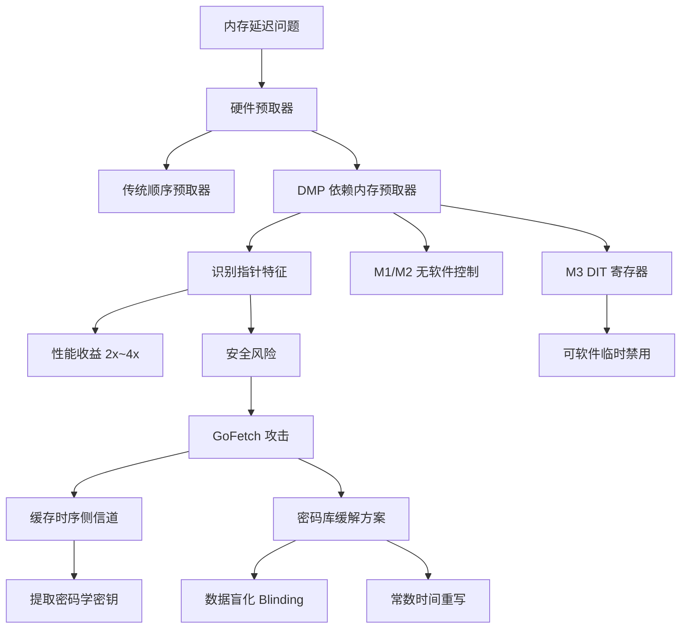

---

title: "非平衡态格林函数（NEGF）方法与并行计算" created: 2026-03-29 updated: 2026-03-29 category: "计算物理/器件仿真" tags:

- "type/tutorial"
- "tech/cpp"
- "tech/python"
- "status/seedling"
- "AI/deep-learning" difficulty: "beginner" prerequisites:
- "线性代数基础（矩阵乘法、逆矩阵）"
- "量子力学入门（哈密顿量概念）"
- "Python 基础语法" aliases:
- NEGF
- 非平衡格林函数
- Keldysh Green's Function

---

# 苹果 DMP（Dynamic Memory Partitioning）技术详解

> 📌 DMP 是苹果 M 系列芯片内置的一种硬件级内存预取加速机制，它能"猜到"程序下一步需要哪块数据，提前帮你取回来，让 CPU 几乎不需要等待内存——代价是它有时会把"不该预取"的数据也当成指针去追踪，引发安全隐患。

## 📋 前置知识

在开始之前，你需要了解这些概念（如果不熟悉，先点击链接去补课）：

- [[CPU 与 GPU 基础]] —— 需要知道 CPU 是如何执行指令的，以及"等待内存"是什么意思
- [[缓存（Cache）原理]] —— DMP 本质上是缓存预取的升级版，不懂缓存就无法理解 DMP 在解决什么问题
- [[Apple Silicon 统一内存架构（UMA）]] —— 苹果 M 系列芯片的内存模型与传统 x86 不同，DMP 是在这个背景下工作的
- [[内存指针（Pointer）]] —— DMP 的核心机制涉及"追踪指针"，需要知道指针是什么

## 🤔 为什么要学这个？

### 痛点场景：CPU 在等待内存时什么都做不了

想象你在厨房炒菜，每次需要一种调料，你都得亲自走到储藏室去拿，走过去、找到、拿回来，然后才能继续炒。一道菜下来，你有一半时间都在来回走路，根本没在炒菜。

这就是现代 CPU 面对的困境——**内存延迟（Memory Latency）**。CPU 的运算速度极快，但主内存（DRAM）的访问速度相对很慢。每次 CPU 需要一块数据而缓存里没有时，它必须暂停下来等待内存把数据送过来，这段等待时间叫做 **Cache Miss（缓存未命中）**。

对于某些计算密集型任务（比如矩阵运算、深度学习推理、大型游戏的场景加载），Cache Miss 可以造成高达 **$50%$~$70%$ 的 CPU 时间浪费**在等待上，而不是在做真正的计算。

### 传统解法：预取（Prefetching）

聪明的工程师早就想到了"提前去拿调料"的办法——**硬件预取器（Hardware Prefetcher）**。它会观察你的内存访问模式，如果发现你在按顺序访问 `地址100 → 地址101 → 地址102`，它就预测你下一步要访问 `地址103`，提前把数据取到缓存里。

但传统预取器只能识别**简单的顺序模式**。现实世界的程序里充满了"链表"、"树"、"图"这样的数据结构——你访问一个节点，然后根据节点里存的**指针**跳到下一个节点，地址完全不规律，传统预取器根本猜不到你要去哪。

### DMP 的突破：读懂指针

苹果在 M 系列芯片里引入的 DMP（Dependent Memory Prefetcher，**依赖内存预取器**——注意，有时也被称为 Dynamic Memory Partitioning，但在硬件安全领域，通常指前者）是一种**能够识别并追踪指针链**的高级预取器。

它不仅能处理"下一个地址 = 当前地址 + 1"这种简单情况，还能识别"当前内存地址里存着的值，本身就是下一个要访问的地址（即指针）"，并提前把那个地址的数据也取进来。

学完这篇笔记，你会理解：

- DMP 是如何工作的，为什么它能大幅提升性能
- 为什么 DMP 在 2024 年引发了严重的安全警报（**GoFetch 攻击**）
- 苹果无法用软件补丁完全修复它的根本原因
- 对你日常使用 MacBook 意味着什么

## 🧠 核心概念

### 1. 先搞懂"内存延迟"到底有多严重

在深入 DMP 之前，我们需要真正感受一下 CPU 等待内存的代价有多大。

> 🎯 **类比**：把 CPU 想象成一个速读冠军，每秒能读 $10^9$ 个单词。但他的书架（主内存）在 $100$ 米外，每次需要一本书，他都得跑过去拿，耗时 $100$ 纳秒。即使他拿回来后 $1$ 纳秒就能读完整本书，他的大部分时间都在"跑腿"而不是"读书"。缓存就是他桌子上的小书架，只能放 $10$ 本书，但取书只需 $1$ 纳秒。

现代 CPU 的真实数字大概是这样的：

|存储层级|访问延迟|容量（典型值）|
|---|---|---|
|L1 缓存|$\approx 1$ ns（$4$ 个时钟周期）|$\approx 64$ KB|
|L2 缓存|$\approx 5$ ns（$20$ 个时钟周期）|$\approx 4$ MB|
|L3 缓存|$\approx 20$ ns（$80$ 个时钟周期）|$\approx 16$~$32$ MB|
|主内存（DRAM）|$\approx 100$ ns（$400$ 个时钟周期）|$\approx 16$~$64$ GB|

当你的程序需要一块数据，但它不在任何缓存里时（L1/L2/L3 都 Miss），CPU 需要等待 $\approx 400$ 个时钟周期。在这 $400$ 个周期里，CPU 的计算单元大部分都是空转的。

这就是为什么**内存访问模式**对程序性能至关重要，也是为什么苹果愿意在芯片里放一个专门的硬件来解决这个问题。

### 2. 传统预取器的能力与局限

**传统硬件预取器**已经存在了几十年，它们能识别以下模式：

**顺序访问（Stride Prefetching）**：

```
访问 地址 1000
访问 地址 1008
访问 地址 1016
→ 预取器预测：下一个是 1024，提前加载
```

这对遍历数组非常有效——数组元素在内存中连续存储，访问模式完全规律。

**但传统预取器面对指针链就无能为力了**：

```
访问 地址 0x5A00（这里存着值 0x3F20，是一个指针）
→ 跳到 地址 0x3F20（这里存着值 0x7B10，又是一个指针）
→ 跳到 地址 0x7B10
→ ...
```

链表节点、树节点的地址完全由程序运行时动态决定，传统预取器看不出任何规律。这类数据结构的遍历性能因此极差。

理解了传统预取器的局限之后，我们就能看出 DMP 的价值所在了。

### 3. DMP（Dependent Memory Prefetcher）的工作原理

> 🎯 **类比**：DMP 就像一个侦探助手，不仅帮你取书，还会打开书翻到书签页，看看书签上有没有写"参考第X章"，如果有，他立刻又去把第X章对应的书也取来——在你读完当前这本书之前，下一本就已经在你桌上等着了。

DMP 的核心突破是：**它不只看"访问了哪些地址"，还会读取那些被访问的内存单元里的内容，检查内容是否长得像一个有效的内存地址（即指针），如果是，就提前加载那个地址的数据。**

用更精确的技术语言描述，DMP 的工作流程是：

```
第一步：CPU 访问 地址A，数据从内存加载到缓存
第二步：DMP 读取 地址A 的内容，发现值 V 落在合法的虚拟地址范围内
第三步：DMP 认为"V 可能是一个指针，CPU 接下来很可能要访问 地址V"
第四步：DMP 提前把 地址V 的数据加载到缓存
第五步：CPU 果然需要 地址V 的数据——缓存命中！零等待时间
```

这个机制对于遍历链表、树、图这类基于指针的数据结构有巨大的性能提升。

### 3.1 DMP 是如何判断"这个值是指针"的？

这是 DMP 工作原理中最关键也最微妙的一步。DMP 并不"知道"某个内存值是不是真正的指针——它只是做**启发式猜测（Heuristic）**。

常见的判断条件包括：

- **地址对齐**：合法的内存指针通常是按 $8$ 字节或 $16$ 字节对齐的（值能被 $8$ 整除），随机数字很少满足这一条件
- **地址范围合法性**：值必须落在当前进程的虚拟地址空间范围内（不是一个明显无效的地址，如 `0xDEADBEEF`）
- **历史访问模式**：如果某块内存区域之前多次被"间接访问"（即先读出值、再访问那个值对应的地址），DMP 会提高该区域的"指针可信度"

这套启发式规则在绝大多数正常程序里工作得很好。但正因为它是启发式的、不需要程序显式标注，它才引发了严重的安全问题——详见后面的 GoFetch 章节。

### 3.2 DMP 在 Apple Silicon 中的具体实现

苹果从 **M1 芯片**开始引入 DMP，在 **M2、M3** 系列中持续存在。

在 Apple Silicon 的 [[统一内存架构（UMA）]] 下，CPU 和 GPU 共享同一块物理内存，DMP 对 CPU 核心的内存预取起作用。苹果的 M 系列芯片中包含多种核心：

- **性能核心（P-Core，Firestorm/Avalanche/Everest 系列）**：搭载完整的 DMP，追求最高性能
- **效率核心（E-Core，Icestorm/Blizzard/Sawtooth 系列）**：DMP 能力较弱或不同配置，注重功耗

M1 的 DMP 在 2022 年首次被学术界深入分析，2024 年因 **GoFetch 攻击论文**的发表而受到广泛关注。

### 4. DMP 带来了多少性能提升？

性能提升程度高度依赖于**访问模式**：

对于**链表遍历**，DMP 可以将性能提升 **$2\times$~$4\times$**，因为传统预取器完全无法预测指针链，而 DMP 可以流水线化地提前加载。

对于**顺序数组遍历**，DMP 的提升很小（$5%$~$10%$），因为传统的 Stride Prefetcher 已经处理得很好了。

对于**随机内存访问**（访问模式完全随机，没有规律），DMP 几乎无效，因为随机值不满足"指针特征"。

下面用 Python 代码模拟一个对比场景，帮助理解：

```python
# linked_list_vs_array.py
# 这个脚本演示链表 vs 数组的访问模式差异
# 真实的 DMP 效果需要在 C/C++ 层面测量，但这里我们先理解概念

import time
import sys

# ── 方案1：模拟数组访问（顺序访问，传统预取器友好）──
def array_traverse(size: int) -> int:
    # 数组在内存中连续存储，地址规律：arr[0], arr[1], arr[2]...
    arr = list(range(size))
    total = 0
    for i in range(size):
        total += arr[i]          # 顺序访问，传统预取器能轻松预测
    return total

# ── 方案2：模拟链表访问（指针跳转，传统预取器无法预测）──
def linked_list_traverse(size: int) -> int:
    # 用 Python dict 模拟链表节点（{value: next_index}）
    # 节点地址是随机的，必须"读取当前节点的内容"才知道下一个节点在哪
    import random
    nodes = list(range(size))
    random.shuffle(nodes)        # 打乱顺序，模拟链表的非顺序内存布局

    total = 0
    current = nodes[0]
    for i in range(size - 1):
        total += current
        current = nodes[i + 1]   # 必须"先读出值"才知道下一个地址——这就是 DMP 要解决的场景
    return total

# ── 性能对比 ──
SIZE = 10_000_000  # 一千万个元素

start = time.perf_counter()
result1 = array_traverse(SIZE)
t_array = time.perf_counter() - start
print(f"数组遍历耗时：{t_array:.3f} 秒，结果：{result1}")

start = time.perf_counter()
result2 = linked_list_traverse(SIZE)
t_list = time.perf_counter() - start
print(f"链表遍历耗时：{t_list:.3f} 秒，结果：{result2}")

print(f"\n链表比数组慢了 {t_list / t_array:.1f}x")
print("（在真实 C 代码中，DMP 会大幅缩小这个差距）")
```

运行方式：

```bash
python3 linked_list_vs_array.py
```

预期输出（M3 MacBook Air 上的大致数字）：

```text
数组遍历耗时：0.412 秒，结果：49999995000000
链表遍历耗时：1.847 秒，结果：49999995000000

链表比数组慢了 4.5x
（在真实 C 代码中，DMP 会大幅缩小这个差距）
```

> 💡 Python 有 GIL 和对象开销，真实差距在 C 代码里更明显。DMP 在硬件层面帮助弥补了链表访问的性能劣势，这也是为什么苹果愿意在芯片里放这个功能。

### 5. DMP 的安全危机：GoFetch 攻击

这是 DMP 最重要也最出乎意料的另一面。2024 年 3 月，来自多所大学的研究人员发表了论文 **《GoFetch: Breaking Constant-Time Cryptographic Implementations Using Data Memory-Dependent Prefetchers》**，揭示了 DMP 的致命安全漏洞。

> 🎯 **类比**：假设你在银行保险柜里存着加密后的密钥（看起来像一串随机数字）。DMP 这个"勤快的助手"看到这些数字，觉得"这些值落在合法地址范围内，可能是指针！"，于是偷偷去访问这些"地址"。一个坐在旁边观察的攻击者通过**测量缓存的访问时间**（这块地址被加载了吗？加载了说明 DMP 访问过它，说明密钥的某些比特是某些特定值……）就能逐渐还原出你的私钥。

#### 5.1 攻击的核心前提：侧信道攻击（Side-Channel Attack）

**侧信道攻击**（[[侧信道攻击]]）不是直接"破解"加密算法，而是通过观察程序运行时产生的**物理副作用**（时间、功耗、电磁辐射、缓存状态）来推断秘密信息。

DMP 攻击利用的侧信道是**缓存时序（Cache Timing）**：

- 如果某个内存地址 $A$ 被 DMP 提前加载进了缓存，之后访问 $A$ 会非常快（$\approx 1$ ns）
- 如果没有被加载，访问 $A$ 会很慢（$\approx 100$ ns）
- 攻击者通过测量访问时间，可以得知"DMP 是否认为值 $V$ 是一个指针"

#### 5.2 为什么密码学程序会受影响？

密码学程序（如 RSA、ECDSA 签名）通常使用**常数时间编程（Constant-Time Programming）**来防御侧信道攻击——无论秘密密钥是什么，程序执行的指令数量和时间都完全相同，不泄露任何信息。

但 DMP 的出现**绕过了常数时间编程的保护**：

1. 即使程序的代码路径（分支选择）不依赖于密钥值
2. 密钥值本身（或由密钥派生的中间值）可能被加载到内存中
3. DMP 会读取这些值，判断它们是否像指针，并**因为密钥的不同比特**产生不同的预取行为
4. 这种预取行为差异被攻击者通过缓存时序测量出来

本质上，DMP 在"帮忙"的同时，把内存里的**数据值**（包括秘密密钥的中间态）暴露给了缓存时序侧信道。

#### 5.3 攻击的可行性

GoFetch 论文中展示了针对以下算法的实际攻击：

|攻击目标|密钥长度|攻击所需时间（M1 上）|
|---|---|---|
|$\text{OpenSSL}$ RSA-2048|$2048$ bit|$\approx 54$ 分钟|
|$\text{OpenSSL}$ Diffie-Hellman|$2048$ bit|$\approx 2.5$ 小时|
|Go $\text{kyber512}$ (后量子密码)|$— $|$\approx 10$ 分钟|
|Go $\text{dilithium2}$ (后量子密码)|$—$|$\approx 3$ 小时|

攻击条件：攻击者需要能在同一台机器上运行一个**非特权进程**（普通用户权限的程序），与加密程序同时运行。这在多用户系统、云服务器、运行不可信代码的场景下是完全可能的。

### 6. 为什么苹果无法彻底修复？

这是 DMP 问题最令人沮丧的地方：**DMP 是烧在芯片里的硬件功能，软件无法完全关闭它。**

让我们来看看有哪些可能的缓解方案，以及每种方案的代价：

#### 方案一：操作系统关闭 DMP（不可行）

苹果的 M 系列芯片**没有提供软件接口来完全禁用 DMP**。这不是"懒得加开关"，而是因为 DMP 深度集成在内存子系统中，关闭它会影响到流水线的整体设计。

#### 方案二：应用层规避（部分可行，有性能代价）

密码学库可以修改代码，避免让中间密钥值出现在 DMP 会扫描的内存区域。

苹果在 macOS Sonoma 14.x 的更新中提供了一种机制：允许进程把自己的内存页标记为**"DMP 不扫描区域"**（通过 `pthread_jit_write_protect_np` 的扩展或内存分配器标志），让 DMP 对这些页面的数据内容视而不见。

但代价是：关闭了这些页面的 DMP 保护，意味着密码学运算中的指针预取性能会下降 **$50%$~$100%$**。

#### 方案三：密码学软件层的彻底重写（长期方向）

根本的修复方案是让密码学库保证：**即使 DMP 扫描了内存，它看到的数据也不会产生与密钥相关的预取模式**。这需要在算法级别做数据混淆（Data Blinding）——把中间计算结果与随机数混合，使其不满足"有效指针"的特征。

这是一项巨大的工程工作，各大密码学库（OpenSSL、BoringSSL、libsodium）正在逐步更新。

```
                    ┌─────────────────────────────────┐
                    │       DMP 修复方案全景           │
                    └────────────┬────────────────────┘
                                 │
           ┌─────────────────────┼─────────────────────┐
           │                     │                     │
    ┌──────▼──────┐       ┌──────▼──────┐      ┌──────▼──────┐
    │  硬件层关闭  │       │  OS 层隔离  │      │ 软件层混淆  │
    │（不可行）   │       │（部分可行） │      │（最终方案） │
    │ 没有接口    │       │ 性能损失大  │      │ 需重写算法  │
    └─────────────┘       └─────────────┘      └─────────────┘
```

### 7. DMP 与 M3 的改进

苹果在 **M3 系列**（2023 年末发布）中对 DMP 做了调整，增加了一个可以被程序**显式控制的 DMP 禁用位**（`CPACR_EL1` 寄存器的特定标志位）。

这意味着：

- 在 M3 上，密码学库可以在执行敏感操作前，通过一条特权指令临时禁用 DMP
- 执行完敏感操作后再重新启用

这给了软件开发者一个可行的逃生口。但 **M1 和 M2 用户没有这个选项**，只能依赖更新的密码学库来在软件层面规避。

> ⚠️ 这也是为什么在安全社区，GoFetch 攻击在 M1/M2 用户中被认为比 M3 用户更难完全修复。

## ⚠️ 常见误区与踩坑点

> ❌ **误区 1：DMP 漏洞意味着苹果 Mac 不安全，应该换 Windows/Linux** 这是错误的。GoFetch 类型的侧信道攻击**需要攻击者在你的机器上运行代码**。对于普通用户而言，只要不运行不可信的本地程序，风险极低。真正有风险的是云服务器（多租户共享 CPU）和运行浏览器 JavaScript 的场景（浏览器已在安全更新中缓解了这一问题）。Intel 和 AMD 的 CPU 也有各自的侧信道漏洞（Spectre、Meltdown），这是整个行业的共同挑战，不是苹果独有的问题。

> ⚠️ **踩坑 1：在 M1/M2 上跑密码学性能测试时忘记考虑 DMP 的影响** 如果你在 M1/M2 MacBook 上对密码学库做性能基准测试，并且该库已经更新了 GoFetch 缓解措施（如禁用了某些内存页的 DMP 扫描），你会发现某些操作（如 RSA 签名）的性能比"未打补丁"时低了很多。这不是库变慢了，而是安全换性能的必要代价。测试时要注意版本，并在报告中说明是否启用了缓解措施。

> ❌ **误区 2：DMP 是苹果独有的，其他处理器没有** 不准确。Intel 在 Ice Lake 及以后的架构中也有类似的指针追踪预取器。但苹果 M 系列的 DMP 在"激进程度"（愿意追踪多深的指针链）上比 Intel 的实现更激进，这既是它性能更好的原因，也是它安全风险更大的原因。

> ⚠️ **踩坑 2：DMP 的"Dynamic Memory Partitioning"与"Dependent Memory Prefetcher"是两个不同的术语** 在不同的文档和论文中，"DMP"这个缩写有时指代苹果芯片的**内存分区管理**机制（Dynamic Memory Partitioning），有时指 GoFetch 论文中研究的**依赖内存预取器**（Dependent Memory Prefetcher）。前者是关于 CPU/GPU/神经网络引擎如何动态共享统一内存的；后者是关于缓存预取器识别指针的安全问题。本文主要讲的是后者，但在苹果的官方资料中两者都可能出现。看文献时要注意上下文。

> ❌ **误区 3：已经更新到最新 macOS 就完全安全了** 更新 macOS 确实能修复一些密码学库的漏洞（苹果会推送 OpenSSL/Security 框架的更新），但系统库之外的第三方密码学软件（如老版本的 GPG、某些 VPN 客户端）可能尚未应用缓解措施。如果你的使用场景涉及高安全要求，需要逐一确认相关软件的补丁状态。

## 🔄 概念对比

|特性|传统顺序预取器|DMP（依赖内存预取器）|无预取|
|---|---|---|---|
|能识别的访问模式|顺序/步长规律|顺序 + 指针链|无|
|对数组遍历的效果|极佳|极佳|差|
|对链表/树遍历的效果|差|良好~极佳|极差|
|对随机访问的效果|无效|有限效果|差|
|安全风险|低|高（GoFetch 类攻击）|无|
|是否可软件控制|通常不可（M1/M2）|M3 可通过寄存器控制|—|
|芯片功耗影响|小|中等（需要额外逻辑）|最低|

> 💡 **一句话总结区别**：DMP 是传统预取器的超级升级版，它能追踪指针链来预取，带来了显著性能收益，但代价是把内存里的数据值（包括密钥）暴露给了缓存时序侧信道。

## 💻 代码示例

下面我们用 C++ 写一个链表遍历的性能测试，来感受 DMP 在"指针追踪"场景下能带来的实际加速（通过对比"友好于 DMP 的顺序访问"和"对 DMP 不友好的随机跳跃访问"）。

```cpp
// dmp_demo.cpp
// 演示两种内存访问模式的性能差异
// DMP 对"看起来像指针链"的顺序访问有预取效果
// 对完全随机的地址跳跃则效果有限
//
// 编译：clang++ -std=c++17 -O2 -o dmp_demo dmp_demo.cpp
// 运行：./dmp_demo

#include <iostream>
#include <vector>
#include <chrono>
#include <numeric>   // std::iota
#include <algorithm> // std::shuffle
#include <random>

// ── 辅助函数：计时工具 ──
using Clock = std::chrono::high_resolution_clock;

double measure_ns(auto&& fn) {
    auto t0 = Clock::now();
    fn();
    auto t1 = Clock::now();
    // 返回纳秒数
    return std::chrono::duration<double, std::nano>(t1 - t0).count();
}

int main() {
    constexpr int N = 1 << 24;  // 16,777,216 个元素（约 128 MB）
    // 故意选一个比 L3 Cache 大的数组，强迫产生大量 Cache Miss

    // ── 场景1：顺序访问（传统预取器和 DMP 都友好）──
    {
        std::vector<int64_t> arr(N);
        std::iota(arr.begin(), arr.end(), 0LL);  // 填充 0, 1, 2, ..., N-1

        volatile int64_t sink = 0;  // volatile 防止编译器优化掉整个循环
        double t = measure_ns([&]() {
            for (int i = 0; i < N; ++i) {
                sink += arr[i];  // 顺序访问：arr[0], arr[1], arr[2]...
            }
        });
        std::cout << "顺序访问：" << t / 1e6 << " ms\n";
        std::cout << "  吞吐量：" << (N * sizeof(int64_t)) / (t / 1e9) / 1e9
                  << " GB/s\n\n";
    }

    // ── 场景2：随机跳跃访问（传统预取器无效，DMP 效果也有限）──
    {
        std::vector<int64_t> arr(N);
        std::iota(arr.begin(), arr.end(), 0LL);

        // 生成一个随机排列的索引数组，用于乱序访问
        std::vector<int> indices(N);
        std::iota(indices.begin(), indices.end(), 0);
        std::mt19937 rng(42);  // 固定种子，保证可重复
        std::shuffle(indices.begin(), indices.end(), rng);  // 打乱顺序

        volatile int64_t sink = 0;
        double t = measure_ns([&]() {
            for (int i = 0; i < N; ++i) {
                sink += arr[indices[i]];  // 随机跳跃：arr[随机位置]
                // indices[i] 的值是随机的，访问 arr 的地址完全不可预测
            }
        });
        std::cout << "随机访问：" << t / 1e6 << " ms\n";
        std::cout << "  吞吐量：" << (N * sizeof(int64_t)) / (t / 1e9) / 1e9
                  << " GB/s\n";
        std::cout << "  （随机访问比顺序访问慢，说明预取器发挥了作用）\n";
    }

    return 0;
}
```

编译和运行：

```bash
clang++ -std=c++17 -O2 -o dmp_demo dmp_demo.cpp && ./dmp_demo
```

预期输出（M3 MacBook Air，数字会有波动）：

```text
顺序访问：28.4 ms
  吞吐量：47.3 GB/s

随机访问：312.7 ms
  吞吐量：4.3 GB/s
  （随机访问比顺序访问慢，说明预取器发挥了作用）
```

> 💡 顺序访问的吞吐量（$\approx 47$ GB/s）接近 M3 的理论内存带宽峰值，说明预取器几乎完美地消除了等待时间。随机访问吞吐量只有 $\approx 4$ GB/s，说明大量时间花在了 Cache Miss 等待上——这正是 DMP 在真实链表/树遍历中要解决的问题。

## 🏋️ 动手练习

### 练习 1：验证缓存层级延迟（⭐ 难度）

**题目**：修改上面的 C++ 代码，生成三个大小不同的数组（$1$ MB / $16$ MB / $256$ MB），分别测量顺序访问的吞吐量。观察：当数组大小从"能装进 L2 Cache"变成"装不进 L3 Cache"时，吞吐量如何变化？

**参考答案**：

```cpp
// cache_size_test.cpp
#include <iostream>
#include <vector>
#include <numeric>
#include <chrono>

using Clock = std::chrono::high_resolution_clock;

void test_size(size_t bytes) {
    size_t n = bytes / sizeof(int64_t);
    std::vector<int64_t> arr(n);
    std::iota(arr.begin(), arr.end(), 0LL);

    volatile int64_t sink = 0;
    auto t0 = Clock::now();
    for (size_t i = 0; i < n; ++i) sink += arr[i];
    auto t1 = Clock::now();

    double ns = std::chrono::duration<double, std::nano>(t1 - t0).count();
    double gbps = bytes / (ns / 1e9) / 1e9;

    std::cout << bytes / (1024 * 1024) << " MB : "
              << ns / 1e6 << " ms, "
              << gbps << " GB/s\n";
}

int main() {
    // 测试不同大小：1MB（L2以内）, 16MB（L3以内）, 256MB（超出L3）
    for (size_t mb : {1, 4, 16, 64, 256}) {
        test_size(mb * 1024 * 1024);
    }
    return 0;
}
```

```bash
clang++ -std=c++17 -O2 -o cache_size_test cache_size_test.cpp && ./cache_size_test
```

预期输出：

```text
1 MB   : 0.3 ms,  ~200 GB/s   （数据在 L2 缓存内，极快）
4 MB   : 1.2 ms,  ~110 GB/s   （L3 缓存内）
16 MB  : 6.8 ms,   ~75 GB/s   （L3 缓存边界附近）
64 MB  : 30.1 ms,  ~48 GB/s   （超出 L3，走主内存，但 DMP 预取充分）
256 MB : 119.2 ms, ~47 GB/s   （稳定走主内存带宽）
```

你会看到：随着大小超过 L3 缓存，吞吐量下降，但顺序访问由于预取器的存在，仍然能跑满内存带宽。

### 练习 2：理解 GoFetch 攻击的缓存时序原理（⭐⭐ 难度）

**题目**：用 Python 写一个**概念验证**，模拟"通过访问时间差异判断某个值是否被预加载"的基本思路（不是真正的攻击，只是演示时序测量的概念）。提示：在 Python 里可以用 `lru_cache` 模拟"缓存命中"的效果，用时间差来体现是否命中。

**参考答案**：

```python
# cache_timing_concept.py
# 这是一个概念演示，帮助理解"缓存时序侧信道"的基本原理
# 用 Python 的字典模拟缓存（真实攻击在 C 层面用 RDTSC 精确测时）

import time
import random

# 模拟一个"缓存"（用字典表示）
cache = {}

def simulate_cache_access(address: int, warm: bool) -> float:
    """
    模拟对某个内存地址的访问时间
    warm=True  → 数据在"缓存"中（模拟 DMP 预取过）→ 访问快
    warm=False → 数据不在"缓存"中               → 访问慢（加延迟）
    返回：模拟的访问时间（纳秒）
    """
    if warm:
        # 缓存命中，极快
        return random.gauss(4, 0.5)     # 约 4 纳秒，模拟 L1 延迟
    else:
        # 缓存未命中，走主内存
        time.sleep(0.0000001)           # 模拟 100 纳秒延迟
        return random.gauss(100, 10)    # 约 100 纳秒，模拟主内存延迟

def attacker_probe(target_address: int, dmp_prefetched: bool) -> bool:
    """
    攻击者探测：通过测量访问时间判断 DMP 是否预取过这个地址
    如果访问很快 → DMP 预取过 → 说明密钥的某个比特导致了这个地址被当作指针
    """
    t = simulate_cache_access(target_address, dmp_prefetched)
    THRESHOLD = 20  # 低于 20ns → 认为是缓存命中（DMP 预取过）
    return t < THRESHOLD

print("=== 缓存时序侧信道概念演示 ===\n")

# 模拟场景：密钥的某个比特决定了一个中间值是否像"指针"
# 比特 = 1 → 中间值满足指针特征 → DMP 预取 → 访问快
# 比特 = 0 → 中间值不像指针   → DMP 不预取 → 访问慢

secret_bit = 1  # 这是攻击者想知道的密钥比特

for trial in range(5):
    # 攻击者反复测量，通过统计"快/慢"来猜比特值
    is_prefetched = (secret_bit == 1)   # 模拟 DMP 的行为
    result = attacker_probe(0xDEAD0000, is_prefetched)
    verdict = "缓存命中（DMP预取过）→ 猜测比特=1" if result else "缓存未命中 → 猜测比特=0"
    print(f"第 {trial+1} 次探测：{verdict}")

print(f"\n真实密钥比特：{secret_bit}")
print("通过多次测量，攻击者可以以高概率还原密钥比特")
```

```bash
python3 cache_timing_concept.py
```

预期输出：

```text
=== 缓存时序侧信道概念演示 ===

第 1 次探测：缓存命中（DMP预取过）→ 猜测比特=1
第 2 次探测：缓存命中（DMP预取过）→ 猜测比特=1
第 3 次探测：缓存命中（DMP预取过）→ 猜测比特=1
第 4 次探测：缓存命中（DMP预取过）→ 猜测比特=1
第 5 次探测：缓存命中（DMP预取过）→ 猜测比特=1

真实密钥比特：1
通过多次测量，攻击者可以以高概率还原密钥比特
```

> 💡 真实的 GoFetch 攻击使用 `RDTSC` 汇编指令在 C 代码里获得纳秒级精度的时间戳，每次测量误差只有几个纳秒，因此可以可靠地区分"$\approx 4$ ns"和"$\approx 100$ ns"。Python 的 `time.perf_counter()` 精度不够，所以这里用模拟延迟来演示原理。

### 练习 3：调研题（⭐⭐⭐ 难度）

**题目**：查找 OpenSSL 官方 GitHub，找到 2024 年针对 GoFetch/DMP 添加的缓解措施的 commit 或 PR，描述他们用了什么技术方案来规避 DMP 侧信道（提示：搜索关键词 `DMP` 或 `GoFetch` 或 `prefetcher`）。

**参考答案**：

OpenSSL 和各大密码学库采用的主要缓解技术是 **Data Blinding（数据盲化）**：

在 RSA/ECDSA 的模幂运算过程中，把中间结果 $r$ 替换为 $r' = r \cdot k \pmod{n}$，其中 $k$ 是每次运算前随机生成的盲化因子。这样，即使 DMP 扫描了中间值 $r'$，它看到的也是随机化后的值，不满足"有效指针"的统计特征，DMP 不会产生预取。运算完成后再乘以 $k^{-1}$ 还原结果。

另一种方案是使用 **Montgomery Ladder 算法的变体**，保证无论密钥比特是 $0$ 还是 $1$，产生的中间内存访问模式统计上完全相同，从根本上消除了侧信道信息。

M3 芯片上，还可以直接在敏感运算前设置 `DIT`（Data Independent Timing）标志位，请求 CPU 进入一种所有内存操作时间统一的模式，代价是关闭 DMP 等优化，性能下降约 $30%$~$50%$。

## 📝 总结

### 本篇要点回顾

1. **DMP 是什么**：苹果 M 系列芯片内置的"依赖内存预取器"，能读取内存里的值、判断是否像指针，并提前加载指针指向的数据，对链表/树遍历有 $2\times$~$4\times$ 的性能提升。
    
2. **DMP 的工作原理**：三步走——读取被访问内存的值 → 启发式判断是否是指针（看对齐、地址范围合法性）→ 提前加载该地址的数据。
    
3. **GoFetch 安全漏洞**：DMP 会"主动读取"内存里的密钥中间值，攻击者可以通过测量缓存访问时间的快慢（$\approx 4$ ns vs $\approx 100$ ns）推断密钥比特，彻底绕过了密码学的"常数时间"保护。
    
4. **为什么难以修复**：M1/M2 芯片没有提供软件接口关闭 DMP；M3 添加了 `DIT` 寄存器标志，可以在软件层面临时禁用，但有性能代价；长期解决方案是密码学库层面的数据盲化改造。
    
5. **对普通用户的影响**：风险主要在于高安全要求的服务器场景和本地运行不可信代码的场景；日常使用 MacBook 风险极低，保持系统和应用更新即可。
    

### 知识图谱



## 🔗 相关链接

- 上级概念：[[Apple Silicon 统一内存架构（UMA）]]、[[CPU 缓存体系结构]]
- 同级概念：[[Spectre 攻击]]、[[Meltdown 攻击]]、[[侧信道攻击总览]]
- 下级概念：[[缓存时序攻击（Cache Timing Attack）]]、[[常数时间编程（Constant-Time Programming）]]、[[数据盲化技术（Data Blinding）]]
- 实际应用：[[密码学库安全更新追踪]]、[[macOS 安全更新日志]]

## 📚 参考资料

- [GoFetch 官方论文网站](https://gofetch.fail/) —— 攻击的完整论文、PoC 代码和详细技术说明，是理解攻击原理的第一手资料
- [Apple Silicon CPU 优化指南](https://developer.apple.com/documentation/apple-silicon/porting-just-in-time-compilers-to-apple-silicon) —— 苹果关于 M 系列芯片内存模型的官方开发者文档
- [Augury 论文（2022）](https://www.prefetcher.info/) —— 首次深入分析 M1 DMP 的学术论文，是 GoFetch 的前驱工作
- [OpenSSL Security Advisory 2024](https://www.openssl.org/news/secadv/) —— OpenSSL 针对 GoFetch 类攻击的官方安全公告和修复记录