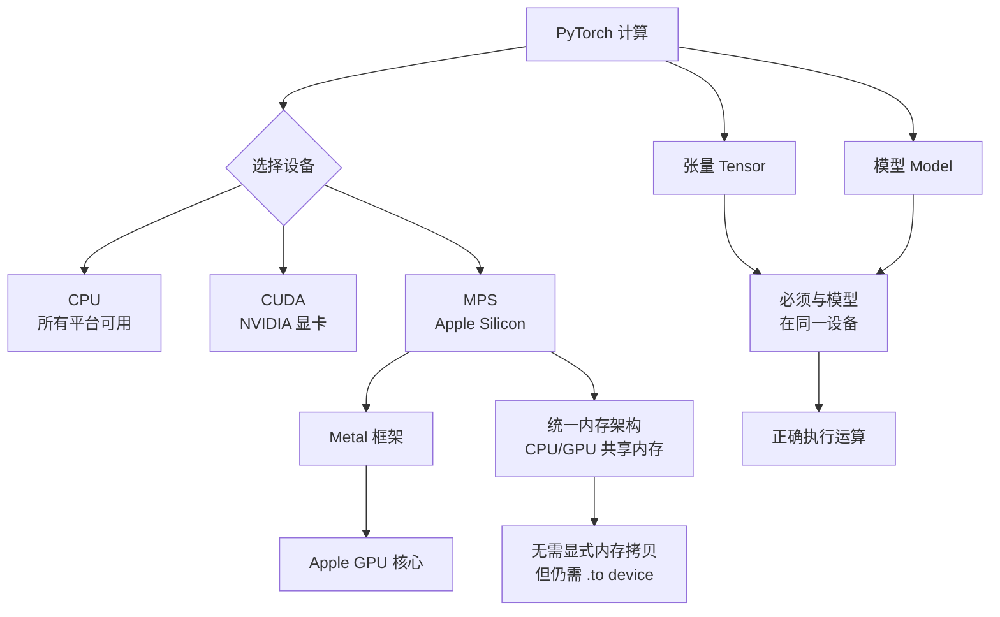

---


title: "苹果 MPS（Metal Performance Shaders）" 
created: 2026-04-01 
updated: 2026-04-01 
category: "AI/深度学习" 
tags:

- "type/concept"
- "type/tutorial"
- "AI/deep-learning"
- "tech/python"
- "tools/vscode"
- "status/seedling" 
- source: "experience" 
- source_url: "https://developer.apple.com/metal/pytorch/" 
- difficulty: "beginner" 
- prerequisites:
- "Python 基础语法"
- "PyTorch 基础"
- "深度学习基本概念" 
- aliases:
- MPS
- Metal Performance Shaders
- Apple Silicon GPU加速

---
---

# 苹果 MPS（Metal Performance Shaders）

> 📌 MPS 是苹果提供的 GPU 加速框架，让你在 MacBook M1/M2/M3 上用自己的显卡跑深度学习模型，速度比纯 CPU 快数倍到数十倍。

## 📋 前置知识

在开始之前，你需要了解这些概念：

- [[PyTorch 基础]] —— MPS 是 PyTorch 的一个设备后端，写法和 CUDA 高度相似
- [[深度学习基本概念]] —— 需要知道"模型"和"张量"是什么
- [[GPU 与 CPU 的区别]] —— 理解为什么 GPU 能加速矩阵运算

## 🤔 为什么要学这个？

假设你买了一台 MacBook Air M3，兴冲冲地想训练一个图像分类模型。你按教程写好代码，运行……然后发现跑得奇慢，风扇呼呼响，CPU 占用 100%。

原因是：你的代码默认只用 CPU，而你 M3 芯片里那块强大的 GPU（有 10 个核心，专为图形和矩阵运算设计）完全闲置着。

这就是 MPS 要解决的问题。MPS（Metal Performance Shaders）是苹果基于 Metal 图形 API 构建的高性能计算库，PyTorch 从 1.12 版本起开始支持把张量和模型放到 MPS 设备上运行，直接调用苹果 GPU。

学会 MPS，你能得到：

- 训练速度提升 3~15 倍（视任务而定）
- 充分利用你花钱买来的 Apple Silicon 算力
- 代码改动极小——只需换一个 `device` 字符串

## 🧠 核心概念

### MPS 是什么？

> 🎯 **类比**：把你的 MacBook 想象成一家餐厅。CPU 是餐厅经理，什么都能干，但同时只能处理一件事；GPU 是后厨团队，一次能同时炒几十道菜。深度学习的"训练"本质上是海量矩阵乘法，相当于同时炒一千道菜——这正是后厨（GPU）的强项。MPS 就是那个把订单从经理桌传到后厨的传菜系统。

**正式定义**：MPS 全称 Metal Performance Shaders，是苹果 Metal 框架的一部分，提供了一系列高度优化的 GPU 计算内核（kernel）。PyTorch 的 MPS 后端将张量运算映射到这些内核上，从而在 Apple Silicon（M1/M2/M3 系列）的 GPU 上加速计算。

### 三种设备：CPU、CUDA、MPS

在 PyTorch 里，所有计算都发生在某个"设备"上：

|设备|适用平台|关键字符串|
|---|---|---|
|CPU|所有平台|`"cpu"`|
|CUDA|NVIDIA 显卡（Windows/Linux）|`"cuda"`|
|MPS|Apple Silicon Mac|`"mps"`|

你只需要修改 `device` 变量，其余代码基本不用动。

### 核心使用模式

MPS 的使用遵循和 CUDA 完全相同的"设备感知"模式，分三步：

1. **检测设备**：判断当前环境是否支持 MPS
2. **把模型移到 MPS**：`model.to(device)`
3. **把数据移到 MPS**：`tensor.to(device)`

只要模型和数据在同一个设备上，运算就会在该设备的硬件上执行。

## 💻 代码示例

### 示例 1：检测 MPS 是否可用

```python
import torch

# 检测设备优先级：MPS > CPU（Mac 上通常没有 CUDA）
def get_device():
    if torch.backends.mps.is_available():
        return torch.device("mps")
    else:
        return torch.device("cpu")

device = get_device()
print(f"当前使用设备：{device}")
```

```bash
python3 check_device.py
```

**预期输出（M3 Mac 上）：**

```text
当前使用设备：mps
```

---

### 示例 2：在 MPS 上创建和运算张量

```python
import torch

device = torch.device("mps")  # 指定 MPS 设备

# 直接在 MPS 设备上创建张量
a = torch.randn(1000, 1000, device=device)  # 1000x1000 随机矩阵，存在 GPU 显存里
b = torch.randn(1000, 1000, device=device)

# 矩阵乘法，在 GPU 上执行
c = torch.matmul(a, b)

print(f"张量 c 所在设备：{c.device}")  # 确认运算结果也在 MPS 上
print(f"张量 c 的形状：{c.shape}")
```

```bash
python3 mps_tensor.py
```

**预期输出：**

```text
张量 c 所在设备：mps:0
张量 c 的形状：torch.Size([1000, 1000])
```

---

### 示例 3：完整的模型训练流程（MPS 版）

这是最常用的完整模板，从头到尾展示如何用 MPS 训练一个简单的全连接网络：

```python
import torch
import torch.nn as nn
import torch.optim as optim

# ── 1. 设备检测 ──────────────────────────────────────────
device = torch.device("mps" if torch.backends.mps.is_available() else "cpu")
print(f"训练设备：{device}")

# ── 2. 定义模型 ──────────────────────────────────────────
class SimpleNet(nn.Module):
    def __init__(self):
        super().__init__()
        self.layers = nn.Sequential(
            nn.Linear(784, 256),   # 输入层：784 维（如 MNIST 图片展平）
            nn.ReLU(),
            nn.Linear(256, 128),   # 隐藏层
            nn.ReLU(),
            nn.Linear(128, 10),    # 输出层：10 个类别
        )

    def forward(self, x):
        return self.layers(x)

model = SimpleNet()
model = model.to(device)           # 关键：把模型参数搬到 MPS 显存

# ── 3. 准备假数据（模拟一个 batch）────────────────────────
# 真实训练时这里换成 DataLoader，但 .to(device) 的写法完全相同
batch_size = 64
x = torch.randn(batch_size, 784).to(device)   # 输入数据搬到 MPS
y = torch.randint(0, 10, (batch_size,)).to(device)  # 标签搬到 MPS

# ── 4. 定义损失函数和优化器 ──────────────────────────────
criterion = nn.CrossEntropyLoss()
optimizer = optim.Adam(model.parameters(), lr=1e-3)

# ── 5. 训练循环 ──────────────────────────────────────────
for epoch in range(5):
    optimizer.zero_grad()          # 清除上一轮的梯度
    output = model(x)              # 前向传播（在 GPU 上执行）
    loss = criterion(output, y)    # 计算损失
    loss.backward()                # 反向传播，计算梯度
    optimizer.step()               # 更新参数

    print(f"Epoch {epoch+1}/5  Loss: {loss.item():.4f}")

# ── 6. 把结果搬回 CPU（用于保存或打印）──────────────────
output_cpu = output.detach().cpu()  # .detach() 断开梯度，.cpu() 搬回 CPU
print(f"\n输出张量已从 {output.device} 搬回 CPU，形状：{output_cpu.shape}")
```

```bash
python3 mps_training.py
```

**预期输出（数值因随机而异）：**

```text
训练设备：mps
Epoch 1/5  Loss: 2.3187
Epoch 2/5  Loss: 2.2954
Epoch 3/5  Loss: 2.2701
Epoch 4/5  Loss: 2.2428
Epoch 5/5  Loss: 2.2133

输出张量已从 mps:0 搬回 CPU，形状：torch.Size([64, 10])
```

---

### 示例 4：CPU vs MPS 速度对比

运行下面这段代码，你能直观看到速度差距：

```python
import torch
import time

def benchmark(device_name, size=4096, repeat=20):
    device = torch.device(device_name)
    a = torch.randn(size, size, device=device)
    b = torch.randn(size, size, device=device)

    # 预热：让 GPU 完成初始化，避免冷启动影响计时
    torch.matmul(a, b)
    if device_name == "mps":
        torch.mps.synchronize()   # 等待 GPU 完成所有操作

    start = time.time()
    for _ in range(repeat):
        c = torch.matmul(a, b)
        if device_name == "mps":
            torch.mps.synchronize()   # 确保 GPU 运算真正完成再计时
    elapsed = time.time() - start

    print(f"{device_name.upper():>4} | {size}x{size} 矩阵乘法 x{repeat}次 | 总耗时 {elapsed:.2f}s | 单次 {elapsed/repeat*1000:.1f}ms")

benchmark("cpu")
benchmark("mps")
```

```bash
python3 mps_benchmark.py
```

**参考输出（M3 Air，实际结果因机器状态而异）：**

```text
 CPU | 4096x4096 矩阵乘法 x20次 | 总耗时 18.43s | 单次 921.5ms
 MPS | 4096x4096 矩阵乘法 x20次 | 总耗时 1.87s  | 单次 93.5ms
```

速度提升约 10 倍。

## ⚠️ 常见误区与踩坑点

> ❌ **误区 1：以为装了 PyTorch 就自动用 GPU** 很多初学者以为只要安装了 PyTorch，代码就会自动调用 GPU。实际上 PyTorch 默认所有张量都在 CPU 上，你必须显式调用 `.to(device)` 才能把数据和模型送上 GPU。

> ⚠️ **踩坑 2：忘记把数据也搬到 MPS** 只把模型 `model.to(device)` 了，忘记把输入张量也 `.to(device)`，会报错：
> 
> ```text
> RuntimeError: Expected all tensors to be on the same device
> ```
> 
> **解决方法**：确保 `x = x.to(device)` 和 `y = y.to(device)` 与模型在同一设备。

> ⚠️ **踩坑 3：计时时忘记 `torch.mps.synchronize()`** GPU 运算是异步的——CPU 发出指令后不等 GPU 完成就继续执行。如果你用 `time.time()` 计时而不加 `synchronize()`，测出来的时间会严重偏小（只是"发指令"的时间，不是"完成运算"的时间）。

> ⚠️ **踩坑 4：某些操作 MPS 尚未支持** MPS 后端仍在持续完善中（截至 2026 年），部分算子（operator）还没有 MPS 实现。遇到报错 `NotImplementedError: The operator ... is not implemented for MPS`，解决方法有两种：
> 
> - 临时把该操作移到 CPU：`tensor.cpu().some_op().to("mps")`
> - 降级为 CPU 设备运行，等待 PyTorch 后续支持

> ⚠️ **踩坑 5：把 MPS 张量转 numpy 时报错**
> 
> ```python
> a = torch.randn(3, device="mps")
> a.numpy()  # ❌ 报错！
> ```
> 
> MPS 张量不能直接转 numpy，必须先搬回 CPU：
> 
> ```python
> a.cpu().numpy()  # ✅ 正确
> ```

> ❌ **误区 6：MPS 适合所有任务** MPS 对大批量矩阵运算提升显著，但对于很小的模型或很小的批次（batch size < 8），CPU 和 MPS 速度接近甚至 CPU 更快，因为数据传输本身有开销。实际应用时，batch size 越大，MPS 优势越明显。

## 🔄 概念对比

| 特性            | CPU       | CUDA (NVIDIA)   | MPS (Apple)         |
| ------------- | --------- | --------------- | ------------------- |
| 适用平台          | 所有平台      | Windows / Linux | macOS Apple Silicon |
| PyTorch 支持成熟度 | ⭐⭐⭐⭐⭐ 最成熟 | ⭐⭐⭐⭐⭐ 最成熟       | ⭐⭐⭐ 持续完善            |
| 大矩阵运算速度       | 慢         | 最快              | 快（约为 CUDA 的 30~70%） |
| 算子覆盖率         | 100%      | ~100%           | 90%+（部分仍缺失）         |
| 内存管理          | 系统内存      | 独立显存            | 统一内存（CPU/GPU 共享）    |
| 代码改动量         | 基准        | 换 `"cuda"`      | 换 `"mps"`           |

> 💡 **一句话总结区别**：CUDA 是 NVIDIA 独显的加速方案，功能最完整；MPS 是 Mac 专属方案，利用苹果统一内存架构，改动极小但算子支持略逊；CPU 是万能兜底方案。

## 🏋️ 动手练习

### 练习 1：设备自适应代码改造（⭐ 难度）

**题目**：下面这段代码只能在 CPU 上运行。请修改它，使其能自动检测 MPS，优先在 MPS 上运行，如果不支持则退回 CPU。

```python
import torch
import torch.nn as nn

model = nn.Linear(10, 5)
x = torch.randn(32, 10)
output = model(x)
print(output.shape)
```

**提示**：只需要加 3 行代码——一行定义 `device`，两行 `.to(device)`。

<details> <summary>💡 点击查看参考答案</summary>

```python
import torch
import torch.nn as nn

# 1. 自动检测设备
device = torch.device("mps" if torch.backends.mps.is_available() else "cpu")
print(f"使用设备：{device}")

model = nn.Linear(10, 5)
model = model.to(device)          # 2. 模型搬到设备

x = torch.randn(32, 10).to(device)  # 3. 数据搬到设备
output = model(x)
print(output.shape)
print(f"输出所在设备：{output.device}")
```

</details>

---

### 练习 2：测量真实提速比（⭐⭐ 难度）

**题目**：修改示例 4 的 benchmark 函数，让它接受矩阵尺寸列表 `[512, 1024, 2048, 4096]`，对每个尺寸分别测试 CPU 和 MPS 的耗时，并打印"MPS 是 CPU 的 X 倍速"。

**提示**：外层套一个 `for size in sizes` 循环，记录两次耗时后相除即得倍速。

<details> <summary>💡 点击查看参考答案</summary>

```python
import torch
import time

def benchmark_single(device_name, size, repeat=10):
    device = torch.device(device_name)
    a = torch.randn(size, size, device=device)
    b = torch.randn(size, size, device=device)
    # 预热
    torch.matmul(a, b)
    if device_name == "mps":
        torch.mps.synchronize()

    start = time.time()
    for _ in range(repeat):
        torch.matmul(a, b)
        if device_name == "mps":
            torch.mps.synchronize()
    return time.time() - start

sizes = [512, 1024, 2048, 4096]

for size in sizes:
    cpu_time = benchmark_single("cpu", size)
    mps_time = benchmark_single("mps", size)
    speedup = cpu_time / mps_time
    print(f"size={size:>4} | CPU {cpu_time:.2f}s | MPS {mps_time:.2f}s | MPS 快 {speedup:.1f}x")
```

</details>

---

### 练习 3：修复设备不一致的 Bug（⭐⭐ 难度）

**题目**：下面的代码会报 `RuntimeError`，找出所有"设备不一致"的问题并修复。

```python
import torch
import torch.nn as nn

device = torch.device("mps")

model = nn.Sequential(nn.Linear(8, 4), nn.ReLU(), nn.Linear(4, 2))
model.to(device)

x = torch.randn(16, 8)            # 忘记 .to(device)
label = torch.randint(0, 2, (16,)).to(device)

output = model(x)                  # 会报错
loss = nn.CrossEntropyLoss()(output, label)
loss.backward()

result = output.numpy()            # 会报错
```

**提示**：找出两处错误，分别涉及数据传输和 numpy 转换。

<details> <summary>💡 点击查看参考答案</summary>

```python
import torch
import torch.nn as nn

device = torch.device("mps")

model = nn.Sequential(nn.Linear(8, 4), nn.ReLU(), nn.Linear(4, 2))
model.to(device)

x = torch.randn(16, 8).to(device)            # ✅ 修复1：数据必须和模型在同一设备
label = torch.randint(0, 2, (16,)).to(device)

output = model(x)
loss = nn.CrossEntropyLoss()(output, label)
loss.backward()

result = output.detach().cpu().numpy()        # ✅ 修复2：先 detach 断梯度，再 .cpu() 才能转 numpy
```

</details>

## 📝 总结

### 本篇要点回顾

1. **MPS 是 Apple Silicon Mac 的 GPU 加速方案**，通过 PyTorch 的 MPS 后端调用，对大矩阵运算有显著加速效果。
2. **只需修改 `device` 变量**，代码迁移成本极低：`torch.device("mps")` 替换原来的 `"cpu"` 即可。
3. **模型和数据必须同时搬到 MPS**：只搬一方会报设备不一致错误。
4. **计时必须加 `torch.mps.synchronize()`**，否则因 GPU 异步执行而测得不准确。
5. **MPS 张量不能直接转 numpy**，必须先 `.cpu()` 再 `.numpy()`。

### 知识图谱



## 🔗 相关链接

- 上级概念：[[PyTorch 基础]]、[[Apple Silicon 架构]]
- 同级概念：[[CUDA 加速]]、[[CPU 多线程训练]]
- 下级概念：[[MPS 混合精度训练]]、[[PyTorch DataLoader 与 MPS 配合]]
- 实际应用：[[用 MPS 训练 MNIST 手写数字识别]]

## 📚 参考资料

- [PyTorch MPS 官方文档](https://pytorch.org/docs/stable/notes/mps.html) —— 官方后端说明，列出了已支持和未支持的算子
- [Apple Developer: PyTorch on Apple Silicon](https://developer.apple.com/metal/pytorch/) —— 苹果官方的 MPS + PyTorch 入门指南
- [PyTorch GitHub: MPS Backend Issues](https://github.com/pytorch/pytorch/issues?q=label%3A%22module%3A+mps%22) —— 查看当前 MPS 已知 Bug 和修复进度的好地方