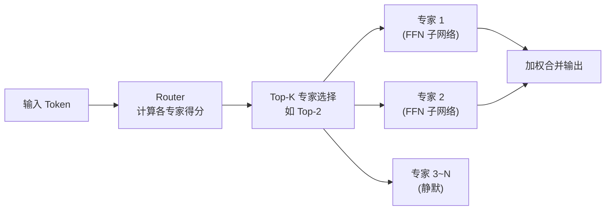
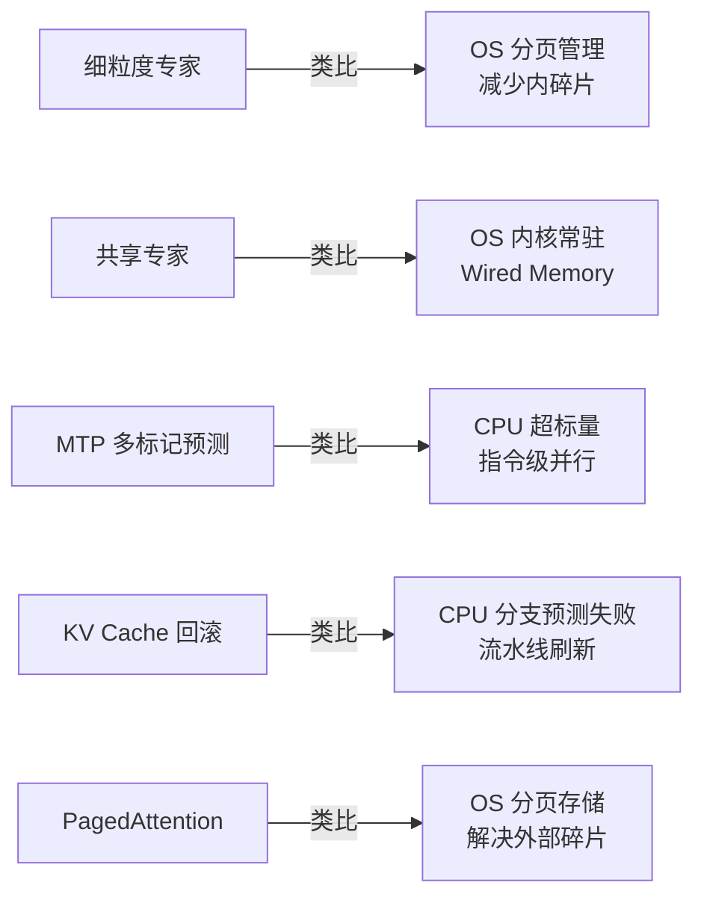
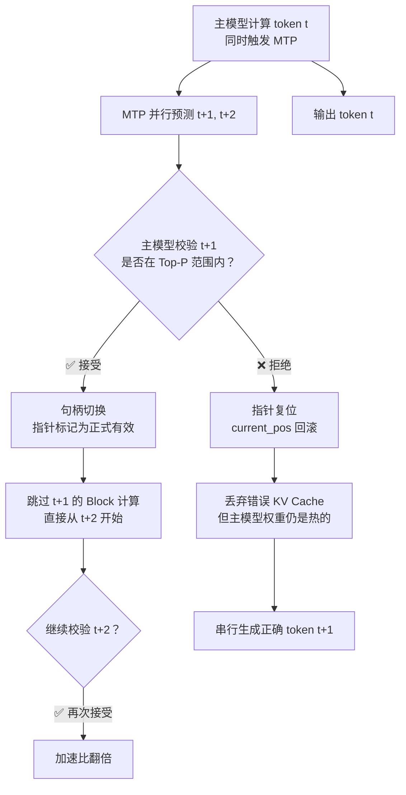
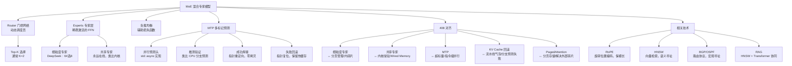

# Transformer MoE 深度拆解

> 📌 MoE（Mixture of Experts，混合专家模型）是在 Transformer 基础上引入"稀疏激活"的架构升级——参数量极大，但每次推理只激活一小部分，实现"大脑智商、小身材消耗"。本文同时深度拆解 DeepSeek 的细粒度专家、MTP 多标记预测，以及 RoPE、HNSW、BGP 等关联技术的 408 考点对齐。


## □ 前置知识

在开始之前，你需要了解这些概念：

- [[Transformer 基础框架]] — Self-Attention、FFN、KV Cache 的运作方式（本文大量复用）
- [[408-计算机组成原理-Cache]] — Cache Line、SIMD、流水线气泡
- [[408-操作系统-虚拟内存]] — 分页管理、LRU、抖动（Thrashing）
- [[408-计算机网络-路由协议]] — BGP、OSPF、最长前缀匹配


## 🤔 为什么要学 MoE？

想象一家超级医院：普通医院每位医生什么都看（稠密模型），而超级医院有数百位专科医生——来了一个病人，只需要挂号系统（Router）把他分配给最对口的 2~3 位医生（Expert）即可，其余医生继续休息。

这就是 MoE 的本质：**用空间（存放所有专家的权重）换算力（只计算少数专家）**。

- 总参数可以很大（如 DeepSeek 总参 671B），智商高
- 单次推理的活跃参数很小（如 37B），速度快、功耗低
- 对你的 M3 24GB Mac 既是福音（计算快）又是挑战（全部权重必须载入内存）


## 🧠 核心概念


### 4.1 MoE 的逻辑架构：从"通才"到"专家组"

传统 Transformer（如 Qwen 2.5 14B Dense）是**稠密模型（Dense Model）**，每处理一个词，所有神经元（参数）都参与计算。MoE 引入了**稀疏性（Sparsity）**。

**三大组件**：

**① 专家层（Experts）**

将原本巨大的 FFN 层横向切分为 $N$ 个独立的子网络，每个子网络就是一个"专家"。

> 🎯 **408 对齐**：这是一种**分治策略**——把一个大问题拆成 $N$ 个小问题，每个小问题由专门的单元处理。

**② 门控网络（Router）**

MoE 的调度中枢。接收输入向量，计算权重分布，决定将当前 Token 分配给哪几个专家。

通常使用 **Top-K 路由**：计算 Token 与每个专家的相关性得分，选出分数最高的 $K$ 个（通常 $K=1$ 或 $K=2$）。

**③ 动态激活机制**

推理时，只有被选中的 Top-K 专家处于活跃状态，其余专家保持静默。这实现了"参数量极大，但计算量受控"的效果。

数据流：



**Dense vs MoE 对比**：

| 特性 | Dense Model | MoE Model |
|------|------------|-----------|
| **总参数量** | 较小 | 极大 |
| **单次推理活跃参数** | = 总参数 | << 总参数（如 1/8） |
| **推理速度** | 受总参数限制 | 快（只算部分专家） |
| **内存需求** | 低（只需装入全部） | 高（全部专家权重必须在内存） |
| **典型代表** | Llama 3、Qwen 2.5 Dense | DeepSeek、Mixtral |


### 4.2 408 考点对齐：动态调度与负载均衡

MoE 不仅是 AI 算法，更像一个复杂的**分布式操作系统**调度问题。

**① 条件执行与分支预测**

MoE 的路由过程本质是复杂的条件分支。如果路由逻辑过于跳跃，对 M3 的流水线来说可能导致流水线排空（Pipeline Flush）。

**② 负载均衡（Load Balancing）挑战**

如果大量 Token 都涌向同一个专家（如所有关于"计算机"的词都去找专家 A），会导致该专家过载，其他专家闲置。

解决方案：在训练时设计**辅助损失函数（Auxiliary Loss）**，强制专家们"劳逸结合"，让每个专家被均匀激活。

**③ 空间换时间**

MoE 用巨大的存储空间（存放所有专家权重）换取极高的运行速度（只计算部分专家）——对应 408 中典型的存储性能权衡策略。


### 4.3 M3 Mac 实战意义：24GB 内存的"容量墙"

**推理速度的红利**：

由于单次生成的**活跃参数量（Active Parameters）**小（例如总规模 47B 的模型，活跃可能只有 12B），M3 的 GPU 核心能以极快的速度完成单次计算。

**内存容量的刚性需求（重点）**：

虽然活跃参数少，但**所有专家的权重必须全部载入内存**。如果 24GB 内存装不下整个 MoE 模型，就会频繁触发磁盘交换（Swap）。

> ⚠️ **踩坑点**：磁盘 Swap 一旦触发，生成速度会从每秒 20 个词直接掉到每秒 0.5 个词。这不是夸张，是实测数据。

**统一内存的带宽优势**：

M3 的统一内存（UMA）让 Router 能极快地将数据分发给不同专家区域，减少了数据在 CPU 和 GPU 之间的拷贝延迟——因为它们本来就共享同一块物理内存。

**24GB 的三重保障**：

| 保障维度 | 具体意义 |
|---------|---------|
| **容量保障** | 确保全量专家驻留物理内存，维持模型的"全量智商" |
| **性能保障** | 避免硬盘 Swap 介入，消除推理过程中的物理卡顿 |
| **精度保障** | 允许使用 Q4_K_M 而非 IQ2_M，确保逻辑结果的确定性 |

**量化精度与智商关系**：24GB 让你不需要为了"强行运行"而过度牺牲精度。Q4_K_M 相比 2-bit 量化，在处理复杂 C++ 编程逻辑时能极大保留模型的逻辑推理能力。一旦内存不足导致被迫使用 1-bit 量化，模型的逻辑链条就会断裂，产生"幻觉"或胡言乱语。


### 4.4 MoE 的"减重"黑科技

为了让 24GB 的 Mac 跑起更庞大的 MoE 模型，工业界引入了多种进阶手段：

**① 共享专家（Shared Experts）**

无论 Router 怎么选，都有一个或几个专家是"常驻"的，负责处理所有词共有的基础语义（如基础语法、标点逻辑），增加模型的稳定性。

**② 专家细粒度化**

将专家切得更小，增加专家数量，使路由更精准。DeepSeek 的极致实践见下文。

**③ 专家级量化**

对不常用的专家使用更激进的量化（如 IQ2_M），对常用专家保留 Q4_K_M 精度，从而在有限的 24GB 内存中塞入更多专家。


## 🏗️ DeepSeek 架构深度拆解


### 5.1 细粒度专家（Fine-Grained Experts）：打破计算抖动

在传统 MoE（如 Mixtral）中，专家通常被切得很大，导致"专业度"不够且调度不灵活。

> 🎯 **类比**：
> - **传统 MoE**：在 8 个全科医生里选 2 个
> - **DeepSeek**：在 64 个专科医生里选 8 个

DeepSeek 将一个大的 FFN 专家进一步切分成 $N$ 个更小的微型专家，提高路由灵活性。

**408 考点——减少内碎片**：

这类似于操作系统中的**页式管理**。专家切得越细，就能更精准地匹配 Token 的需求，减少不必要的参数被激活（类似减少内存分配中的内碎片），让每一分算力都花在刀刃上。

| 方案 | 类比 OS 概念 | 效果 |
|------|------------|------|
| 传统 MoE（大专家） | 固定分区分配 | 内碎片大，算力浪费 |
| 细粒度专家（小专家） | 分页存储管理 | 精准匹配，利用率高 |

**对 M3 的意义**：细粒度专家让 24GB 内存带宽利用率更高。每次激活的参数更精准，减少了由于载入无关参数导致的带宽浪费。更小的专家块更容易被换入 L2 缓存中处理，提升缓存命中率。


### 5.2 共享专家（Shared Experts）：语义基石的稳固

DeepSeek 发现，有些知识是所有 Token 都需要的（基础语法、标点逻辑等）。

**架构设计**：在路由专家之外，设置一个或多个"共享专家"，不参与路由，**始终被激活**。

**408 考点——内核常驻策略**：

| 概念 | AI 类比 | OS 类比 |
|------|--------|--------|
| 共享专家 | 永远在线的基础语义处理 | 操作系统内核（Kernel） |
| 动态路由专家 | 按 Token 类型激活 | 用户进程（User Processes） |
| 联动内存锁定 | 权重锁死在物理内存 | 内核常驻集（Wired Memory） |

**M3 实战**：在你的 Mac 上，共享专家的权重会被优先锁死在 L2 缓存或联动内存（Wired Memory）中。无论模型怎么切换专家，这部分核心数据不需要重新加载，保证了推理速度的下限。


### 5.3 DeepSeek 架构与 408 考点深度对齐总结




## ⚡ MTP（Multi-Token Prediction）多标记预测


### 6.1 逻辑本质：从"逐字蹦词"到"并行预测"

传统 Transformer 像一台慢速打字机，每次只能预测下一个词（Next-Token Prediction）。

**MTP 的精髓**：DeepSeek 在主模型之上挂载了多个额外的"预测头"，在计算当前词 $t$ 的同时，顺便把后面 $t+1, t+2$ 甚至更多词也预测出来。

**硬件收益**：对 M3 的 GPU 来说，算一个词和算三个词的**指令开销**差异并不大。MTP 显著提升了单次推理的"载荷"，让 M3 的算力利用率从"空转"切换到"满载"。

> 🎯 **408 考点——指令级并行（ILP）**：这对应《组原》中的**超标量（Superscalar）**架构。通过增加少量执行单元（MTP 预测头），换取更饱满的流水线。

**算力填补原理**：

大模型推理本质上是**访存密集型**任务（受限于内存带宽，不是计算能力）。M3 拥有强大的 ALU，但大量时间在等数据从内存搬运过来。MTP 通过增加少量计算任务，将原本"等数据"的闲置时间填满计算——"一次搬运，多次计算"。


### 6.2 MTP 的 C++ 并行实现机制

传统推理循环是单线程阻塞的：算出 Token A → 将 A 加入 KV Cache → 算出 Token B。

MTP 引入多个预测头，在代码层级，主干网络（Backbone）的输出同时喂给多个并行的线性层：

```cpp
// MTP 并行触发逻辑（伪代码）
void run_mtp_inference(Vector hidden_states) {
    // 1. 发起主预测任务（同步）
    auto token_main = predict_main_head(hidden_states);

    // 2. 异步发起辅助预测任务——充分利用 M3 多核闲置算力
    std::future<Token> next_1 = std::async(std::launch::async, [&](){
        return predict_aux_head_1(hidden_states);  // 预测 t+1
    });
    std::future<Token> next_2 = std::async(std::launch::async, [&](){
        return predict_aux_head_2(hidden_states);  // 预测 t+2
    });

    // 3. 主词输出的同时，后台已经算好了后两个词
    //    如果验证通过，直接跳过两步推理
}
```

**线程任务分配**：

- **线程 0（主线程）**：负责预测 $Token_{t+1}$（主任务）
- **线程 1**：负责预测 $Token_{t+2}$（辅助预测）
- **线程 2**：负责预测 $Token_{t+3}$（辅助预测）

**408 考点——同步、互斥与缓存一致性**：

| 挑战 | 问题 | 解决方案 |
|------|------|---------|
| 数据依赖 | 多个预测头读同一份 `hidden_states` | 只读共享（Read-only），无需加锁 |
| 临界区管理 | 多头更新 KV Cache 可能冲突 | 原子操作（Atomic）或轻量级锁 |
| MESI 缓存一致性 | 多核修改共享数据引发一致性流量 | MTP 计算阶段完全 Read-only，极大减少总线压力 |

**M3 硬件压榨——GCD 与 Metal 并行**：

在 MacBook Air M3 上，这类并行通常不是简单的 `pthread`，而是利用 Apple 底层框架：

- **GCD（Grand Central Dispatch）**：系统自动根据 M3 的能效核（E-core）和性能核（P-core）负载，动态分配 MTP 预测任务
- **GPU Kernel 并行**：在 Metal 层面，MTP 的多个线性层被打包成一个 Command Buffer 发送给 GPU。由于这些矩阵乘法之间没有相互依赖，GPU 的数千个核心可以真正"同时起飞"


### 6.3 MTP 的快速校验机制：推测与验证的博弈

MTP 预测出来的辅助 Token 并不是直接输出给用户的，它们只是"草稿"。主模型必须扮演"审核员"进行**推测验证（Speculative Verification）**。

**逻辑核心**：

主模型在计算当前词 $t$ 时，MTP 并行算出了 $t+1, t+2$。主模型会把 $t+1$ 的预测结果作为输入，跑一次极简的"验证 Pass"——检查：**"如果我真的选了 $t+1$ 这个词，它在我的数学空间里是否符合概率分布？"**

> 🎯 **408 考点——分支预测与预执行（Speculative Execution）**：这完全对应《组原》里的指令预执行。CPU 先预测一个分支并执行，猜对了直接提交结果；猜错了**回滚（Rollback）**重新算。

**接受准则（Acceptance Criterion）**：

- **Logits 对比**：主模型计算出 $t+1$ 词的真实 Logit 分数，与 MTP 给出的分数进行对比
- **贪婪/核采样校验**：如果 MTP 选出的词刚好是主模型概率最大的词，或落在 Top-P 范围内，则视为 **Accept（接受）**
- **加速效果**：一旦接受，模型不需要再为 $t+1$ 跑一遍完整的 Transformer Block，直接取出 MTP 已算好的 Hidden States

**加速步长**：如果 MTP 连续猜中 $k$ 个词，模型在这一步的加速比就是 $k$ 倍。


### 6.4 校验失败：推测推理中的"无效做功"

**逻辑本质**：

辅助头选出的 Token 在主模型的 Softmax 概率分布中，没能进入"允许接受"的范围（不在 Top-P 选词列表里，或概率远低于主模型的首选词）。

**工程代价——M3 上的双重浪费**：

- **算力空转**：M3 的 GPU 已消耗功耗去计算辅助头的矩阵乘法，但结果必须废弃
- **带宽污染**：系统已从 24GB 内存中读取了相关权重和 KV Cache，这部分带宽消耗变成纯粹的损失

> 🎯 **408 考点——流水线气泡（Pipeline Bubble）**：这对应《组原》中分支预测失败的情况。流水线必须清空（Flush）已有的错误预测指令，重新从正确地址取指，这期间浪费的时钟周期就是"气泡"。

**止损机制**：

- **即时截断**：一旦校验不通过，后续更远的预测（$t+2, t+3$）立刻停止，防止错误雪崩
- **缓存复用**：虽然 Token 猜错了，读取到高速缓存中的**主模型权重**依然是热的（Hot Cache），主模型可以利用这些"温热"的内存数据迅速转入正常串行生成模式


### 6.5 校验失败后的内存回收：KV Cache 的"断尾求生"

当主模型校验发现辅助头预测的 Token 错误时，系统必须在毫秒级完成"状态回滚"。

**物理结构：KV Cache 的线性存储**

在 C++ 推理框架中，KV Cache 通常不是分散的对象，而是一块巨大的**预分配连续内存**：

```cpp
// KV Cache 的简化物理结构
struct KVCache {
    float* data;           // 预分配的连续内存块
    size_t current_pos;    // 当前有效 Token 的末尾位置（关键指针）
    size_t capacity;       // 最大容量
};

// MTP 预写入：辅助头抢先将 t+1, t+2 的 K/V 写到 current_pos 之后
// 校验失败时的回滚：
void rollback_kv_cache(KVCache& cache, size_t last_valid_pos) {
    // 不需要物理清零！只需移动指针
    cache.current_pos = last_valid_pos;
    // 下次推理时，新数据会直接覆盖这里的"废稿"
}
```

**回收机制：指针重置与逻辑抹除**

系统并不会真的去"擦除"内存里的 0 和 1（那样太慢），而是进行**逻辑回收**：

- **指针复位（Pointer Reset）**：将 `current_pos` 强行拉回到主模型确认的最后一个正确位置
- **覆盖写策略**：下一次推理生成正确 Token 时，新数据直接覆盖之前错误的"废稿"

> 🎯 **408 考点**：这与操作系统中**撤销进程的内存占用**逻辑一致——通过修改页表项或边界标识释放空间，而不是物理清零。

**内存回收的硬核挑战**：

- **内存对齐（Memory Alignment）**：M3 的 AMX 单元要求数据按 32 或 64 字节对齐。如果回滚导致的起始位置不对齐，后续矩阵运算速度会暴跌
- **PagedAttention 的介入**：如果使用了分页管理，回滚可能涉及释放已分配好的"物理页"，必须确保引用计数准确，否则长对话会导致 24GB 内存被"幽灵数据"占满

**M3 统一内存下的"瞬间回滚"**：

- **零拷贝开销**：CPU 和 GPU 看到同一块物理内存，CPU 侧的指针复位 GPU 侧立刻感知
- **联动内存保护**：KV Cache 存在于联动内存中，不会被 macOS 交换到硬盘，确保回滚动作的原子性


### 6.6 校验成功：计算结果的"无缝焊接"

当主模型校验通过，意味着 MTP 预测的 Token $t+1$ 与主模型逻辑一致，系统发生**身份转换**。

**句柄切换（Handle Swapping）**：

MTP 之前在"临时区"计算好的 $t+1$ 的 KV 向量，其内存地址被直接标记为"正式有效"。

**跳过计算（Computation Bypassing）**：

既然 $t+1$ 的结果已知，主模型在下一个时钟周期**直接跳过**对 $t+1$ 的所有 Transformer Block 计算，直接从 $t+2$ 开始。

> 🎯 **408 考点——乱序执行（Out-of-Order Execution）**：虽然指令是按序预测的，但执行结果提前准备好，一旦验证成功直接写回寄存器堆。

**隐向量（Hidden States）的空间重用**：

```
传统模式：
权重读取①  → 计算 token t  → 权重读取②  → 计算 token t+1  (读 2 次)

MTP 成功模式：
权重读取①  → 并行计算 t 和 t+1  → [t+1 验证通过]  → 直接跳到 t+2  (读 1 次)
```

**零拷贝焊接**：由于 M3 的 UMA，这个"焊接"过程仅仅是**指针地址的传递**，没有任何物理内存拷贝。单次权重读取完成多词预测，内存带宽利用率瞬间翻倍。

> 🎯 **408 考点——动态规划（DP）**：我们已经算好了子问题 $f(t+1)$，当计算 $f(t+2)$ 需要 $f(t+1)$ 的结果时，直接查表（Cache）即可。

**MTP 全生命周期总结**：




## 🌀 RoPE 旋转位置编码：长文本的救星


### 7.1 逻辑本质：从"特征叠加"到"空间旋转"

- **早期 PE（Vanilla PE）**：像给向量**贴标签**（直接相加）。缺点是模型难以精准感知两词的相对距离，且容易在长文本中数值爆炸
- **RoPE 的精髓**：它不改动向量的大小，而是让向量在空间中**旋转**

> 🎯 **类比**：早期 PE 是给每个词在名牌上写"我是第 3 位"；RoPE 是让词的向量本身旋转一个角度，两词之间的距离直接体现为向量夹角——无论句子多长，夹角的关系始终清晰。

**三个关键属性**：

- **绝对位置**：每个位置 $pos$ 对应一个特定的旋转角度
- **相对距离**：两个词之间的相关性变成了向量之间的**相对夹角**，只要夹角不变，模型感知的相对距离就一致
- **外推能力（Extrapolation）**：即使模型训练时只见过 4k 长度，由于旋转角度连续且周期性，在处理 32k 文本时依然能通过夹角辨认顺序


### 7.2 数学推导：复数与旋转矩阵

RoPE 将维度 $d$ 两两成对，看作复数平面：

**核心公式**：对于第 $m$ 个位置的向量 $x$，旋转后的结果为 $x \cdot e^{im\theta}$。

**旋转矩阵**（每对维度独立旋转）：

$$\begin{pmatrix} \cos m\theta & -\sin m\theta \\ \sin m\theta & \cos m\theta \end{pmatrix} \begin{pmatrix} x_1 \\ x_2 \end{pmatrix}$$

**分频特性**：$\theta$ 是根据维度衰减的基数：

$$\theta_i = 10000^{-2i/d}$$

- **低频维度（$i$ 大，$\theta$ 小）**：旋转缓慢，负责感知长距离依赖
- **高频维度（$i$ 小，$\theta$ 大）**：旋转快速，负责感知短距离依赖

> 🎯 **408 联想**：这对应《计网》中的**频分多路复用（FDM）**——用不同频率的信号同时传输不同类型的信息。

**数值稳定性**：旋转不改变向量模长（乘法而非加法），避免了深度网络中常见的数值溢出问题。


### 7.3 408 考点对齐与 M3 实战

**指令集压榨**：

RoPE 的计算涉及大量 `sin` 和 `cos`。程序通常预先计算一张 **Sin/Cos 查找表（Lookup Table）**存入内存（联动内存），避开昂贵的超越函数实时计算——典型的**空间换时间**。

**访存优化——Fused Kernel**：

RoPE 是逐元素（Element-wise）操作。高性能框架通常把 RoPE 算子和 Embedding 算子**融合（Fused Kernel）**，减少一次内存读写，压榨 24GB 统一内存带宽。

**RoPE vs 传统 PE 对比**：

| 特性 | 传统 Sinusoidal PE | RoPE |
|------|-----------------|------|
| **注入方式** | 加法（修改向量大小） | 旋转（保持向量模长） |
| **相对位置感知** | 间接，通过加法近似 | 直接，体现为夹角 |
| **长文本外推** | 差，容易数值爆炸 | 好，旋转角连续周期性 |
| **代表模型** | 原版 Transformer、BERT | Llama、Qwen、Gemini |


## 🕸️ HNSW 向量检索与 Transformer 的关联

> 🎯 **核心关联**：HNSW 和 Transformer 的注意力机制，本质上都在解决同一个问题——**如何在大规模高维空间中，以最快速度找到"最相关"的信息**。


### 8.1 逻辑本质：语义寻址

- **HNSW（向量检索）**：不再通过 `key == value` 的布尔逻辑查找，而是通过计算余弦相似度或欧氏距离，在图中"跳跃"寻找距离最近的节点
- **Transformer（注意力机制）**：$Q \times K^T$ 的本质就是**点积寻址**——Query 是"搜索请求"，Key 是"索引标签"，点积结果是相似度得分

两者都抛弃了传统的地址寻址，转向基于**内容/语义特征**的寻址方式。


### 8.2 结构相似性：层级化与多头并行

**HNSW 的层级结构**：像跳表（Skip List）一样，通过多层图结构实现"从粗到精"的快速定位。顶层是稀疏的"高速公路"，底层是稠密的"街道"。

**Transformer 的多头寻址**：Multi-Head Attention 在不同的子空间（不同维度组合）并行进行寻址——有的头关注语法，有的头关注语义，就像 HNSW 在不同特征维度上建立索引。

> 🎯 **408 联想**：这对应《数据结构》中**多级索引**的思想。通过增加空间开销（层级或头）换取查找速度，降低时间复杂度。


### 8.3 一维数组优化 HNSW：Cache 命中率压榨

在 408 的《数据结构》中，邻接表通常用 `struct Node { int dest; Node* next; }` 配合指针实现。但在 M3 处理 HNSW 这种海量图跳跃时，**指针就是性能的毒药**。

**问题**：指针邻接表中，每个 `next` 指针都指向堆内存的随机位置，导致 M3 的 L1/L2 Cache 频繁失效（Cache Miss）。

**一维数组模拟邻接表**：

```cpp
// 传统指针邻接表（Cache Miss 重灾区）
struct Node { int dest; Node* next; };  // 物理内存分散

// 一维数组模拟（Cache 友好）
struct GraphCSR {
    std::vector<int> head;  // head[u] = 节点 u 在 edges 中的起始偏移
    std::vector<int> edges; // 所有边连续存放

    // 访问节点 u 的第 k 个邻居：O(1) 且物理连续
    int neighbor(int u, int k) const {
        return edges[head[u] + k];
    }
};
```

**寻址公式**：

$$\text{Target\_Addr} = \text{Base\_Addr} + \text{Head}[u] + k \times \text{sizeof(int)}$$

- **当下（Head[u]）**：节点 $u$ 在"边仓库"里的起始逻辑地址
- **K**：第几个邻居（索引）
- **Offset（sizeof）**：每个元素占用的物理空间（4 字节）

**408 考点——数据对齐存储**：

高性能框架（如 FAISS）在用一维数组存图时，会强制将每个节点的邻居数补齐到 32 的倍数（Padding）。虽然浪费了一点空间（内碎片），但换取了 M3 芯片单条指令处理 8 个邻居的极速吞吐。

**性能收益**：根本收益是当访问节点 $u$ 的所有邻居时，数据在物理内存中**绝对连续**。M3 的预取器（Prefetcher）能瞬间识别线性访问模式，将邻居数据提前"吸"入缓存。


### 8.4 RAG 中 HNSW + Transformer 的协同

现在最前沿的 **RAG（检索增强生成）**，就是把这两者结合：

1. **步骤 1**：利用 HNSW 在海量外部文档中进行快速"粗寻址"，找到相关片段（近似最近邻搜索）
2. **步骤 2**：将片段塞进 Transformer，利用注意力机制进行精细的"二次寻址"和生成


## 🧠 用 Transformer 思维解构 408 虚拟内存


### 9.1 PagedAttention vs. 操作系统分页存储

| 痛点 | 大模型（KV Cache） | 操作系统（进程内存） |
|------|-----------------|-----------------|
| **问题** | KV Cache 动态增长，连续数组产生内存碎片 | 进程大小不一，固定分区产生外部碎片 |
| **解决方案** | PagedAttention：KV Cache 分块，建立 Token→物理块的映射表 | 分页存储：物理内存分帧，建立逻辑页→物理帧的页表 |
| **精髓** | 离散化存储，通过索引层换内存利用率 | 非连续分配，解除逻辑地址与物理内存的强耦合 |


### 9.2 KV Cache 回滚 vs. 分支预测失败

| 场景 | 大模型 | 计算机组成原理 |
|------|--------|-------------|
| **触发条件** | MTP 校验失败，预测 Token 不符合概率分布 | 分支预测失败，条件分支走了错误路径 |
| **处理方式** | KV Cache 指针复位（Pointer Reset），逻辑回滚 | 流水线刷新（Pipeline Flush），清除预执行指令 |
| **代价** | 算力空转 + 带宽浪费 | 流水线气泡，浪费若干时钟周期 |
| **精髓** | 状态一致性回滚，错误尝试不影响全局正确性 | 原子性状态恢复，使用检查点机制 |


### 9.3 联动内存（Wired Memory）vs. 驻留集与工作集

你在 M3 Mac 的活动监视器中看到的"联动内存"，本质上是 OS 为了效率进行的**强制驻留**：

| 强制驻留内容 | 大模型 | 操作系统 |
|------------|--------|---------|
| 不可换出的数据 | 共享专家权重、FFN 核心权重 | 内核代码、页表、正在处理的 I/O 缓冲区 |
| 原因 | 防止换到硬盘导致推理卡顿 | 必须随时响应系统调用和中断 |
| 精髓 | 识别"核心工作集"，物理固定，以空间确定性换性能稳定性 | 驻留集管理，保证关键数据的访问速度 |


### 9.4 抖动（Thrashing）的触发条件

当活跃数据（工作集）超过物理内存上限时：

- **操作系统**：系统因频繁换页陷入抖动，CPU 大量时间用于等待磁盘 I/O
- **M3 上的大模型**：macOS 会启动内存压缩（Compressed Memory），CPU 忙着在后台压缩数据，无暇生成 Token——这就是长对话突然变卡的根本原因


## 🌐 BGP 与 OSPF：寻址艺术的宏观视角

> 🎯 **核心关联**：OSPF/BGP 解决的是在复杂物理拓扑中如何以局部信息推导全局最优路径——和 Transformer 的注意力机制在高维语义空间中"找最相关内容"，本质逻辑相通。


### 10.1 OSPF：链路状态算法（Dijkstra 的分布式实现）

OSPF 要求每个路由器都拥有全网的拓扑地图：

- **本质**：每个节点像 Transformer 的自注意力机制一样，观察周围所有邻居（LSA 洪泛），并计算自己到所有节点的"权重距离"
- **算法**：利用 Dijkstra 算法生成最短路径树
- **瓶颈**：当网络规模极大时，链路状态数据库（LSDB）会撑爆路由器内存——类似 KV Cache 撑爆 24GB 内存的困境


### 10.2 BGP：路径矢量协议（基于策略的寻址）

BGP 是互联网的骨干协议，处理自治系统（AS）间的寻址。

- **本质**：不再单纯看"距离"，而是看"路径属性"
- **类比**：像 Transformer 的 **Top-P 采样**——在众多可能路径中，根据"权重"和"策略"筛选出最合适的一条

**OSPF vs BGP 对比**：

| 特性 | OSPF | BGP |
|------|------|-----|
| **协议类型** | 链路状态协议 | 路径矢量协议 |
| **适用范围** | AS 内部（Interior Gateway） | AS 之间（Exterior Gateway） |
| **寻路目标** | 最短路（距离） | 最优策略路径（不一定最短） |
| **类比** | 公司内部"找最快路" | 国家间"外交协议下的选路" |

**BGP 的寻址决策过程（多维度选路）**：

1. **本地优先级（Local Preference）**：AS 内部定义的最高优先级，决定流量从哪个出口出去
2. **AS-PATH 长度**：经过的自治系统越少越好（这才是类比 OSPF 的"距离"）
3. **MED（Multi-Exit Discriminator）**：告诉邻居 AS"请从我这个特定的口进来"
4. **最长前缀匹配（LPM）**：所有路由寻址的底线

**BGP 对应 Transformer 的采样算法**：

通过调整 Local Preference 和 MED，改变流量的"概率分布"——就像调整 Temperature/Top-P 参数改变模型生成的确定性。


### 10.3 路由聚合（Route Aggregation）：寻址的"概括力"

**本质**：寻找最大公共前缀——把"南京路 1 号、南京路 2 号、南京路 3 号"统称为"南京路"。

**为什么必须有路由聚合**：全球有数百万个子网，如果每个子网在 BGP 里占一项，路由器内存（哪怕 24GB）也会瞬间崩盘。BGP 将成千上万个连续的 C 类地址聚合成一个巨大的 CIDR 地址块发给邻居。

**最长前缀匹配（LPM）解决冲突**：

如果路由表里既有"南京路"的概括路径，又有"南京路 1 号"的精确路径，路由器选谁？——谁的掩码长（1 的个数多），谁就更精确，路由器选谁。

> 🎯 **Transformer 联想**：这非常像 Attention 机制里的"相关性得分"——多个 Key 都能匹配，但得分（匹配长度）最高的那个决定了 Value 的流向。

**子网划分（Subnetting）**：

向主机位"借位"：借 $n$ 位就能划分 $2^n$ 个子网，剩下 $m$ 位主机位，每个子网能容纳 $2^m - 2$ 个主机（减去全 0 的网络地址和全 1 的广播地址）。

**BGP 增量更新 vs KV Cache 增量更新**：

BGP 不需要频繁发全表，只在发生变化时发增量（Keepalive 机制，运行在 TCP 端口 179 之上）——与 KV Cache 的增量追加逻辑不谋而合。


### 10.4 寻址大纲：从内存到网络的统一视角

| 层次 | 寻址方式 | 核心思想 | 408 对应 |
|------|---------|---------|---------|
| **内存（C++ 偏移）** | Base + Offset | 物理连续 → Cache 命中 | 《组原》数据对齐 |
| **向量空间（HNSW/Attention）** | 余弦相似度 / 点积 | 语义寻址，非精确匹配 | 《数据结构》多级索引 |
| **局域网（OSPF）** | Dijkstra 最短路 | 链路状态，全局视野 | 《数据结构》图算法 |
| **互联网（BGP）** | 路径矢量 + 策略 | 基于属性的多维选路 | 《计网》路由协议 |

**分治思想的统一性**：

- HNSW 的多层图：通过层级化缩小搜索范围
- OSPF 的 Area 划分：通过区域化减少 LSA 传播
- 操作系统的多级页表：通过层级化管理庞大地址空间

本质都是**分治法**——在大规模寻址任务中，直接全局检索是死路一条，必须通过层级化降低复杂度。


## 💻 代码示例


### MoE Router 的简化实现（Python）

```python
import torch
import torch.nn as nn
import torch.nn.functional as F

class MoERouter(nn.Module):
    """
    MoE 门控路由器的简化实现
    接收输入向量，输出 Top-K 专家选择和对应权重
    """
    def __init__(self, d_model, num_experts, top_k=2):
        super().__init__()
        self.num_experts = num_experts
        self.top_k = top_k
        # 路由线性层：将 d_model 维输入映射到 num_experts 维得分
        self.router = nn.Linear(d_model, num_experts, bias=False)

    def forward(self, x):
        """
        Args:
            x: 输入 Token 向量 (batch, seq_len, d_model)
        Returns:
            weights: 选中专家的权重 (batch, seq_len, top_k)
            indices: 选中专家的索引 (batch, seq_len, top_k)
        """
        # 计算每个专家的得分
        router_logits = self.router(x)  # (batch, seq_len, num_experts)

        # Top-K 选择：每个 Token 只激活 top_k 个专家
        top_k_scores, top_k_indices = torch.topk(router_logits, self.top_k, dim=-1)

        # Softmax 归一化，得到权重
        weights = F.softmax(top_k_scores, dim=-1)

        return weights, top_k_indices


class MoELayer(nn.Module):
    """
    完整的 MoE 层：Router + Experts
    """
    def __init__(self, d_model, d_ffn, num_experts=8, top_k=2):
        super().__init__()
        self.router = MoERouter(d_model, num_experts, top_k)
        self.top_k = top_k

        # 每个专家是一个独立的 FFN（升维-激活-降维）
        self.experts = nn.ModuleList([
            nn.Sequential(
                nn.Linear(d_model, d_ffn),
                nn.GELU(),
                nn.Linear(d_ffn, d_model)
            )
            for _ in range(num_experts)
        ])

    def forward(self, x):
        batch, seq_len, d_model = x.shape
        weights, indices = self.router(x)

        output = torch.zeros_like(x)

        # 只计算被选中的专家（稀疏计算）
        for k in range(self.top_k):
            expert_idx = indices[:, :, k]   # (batch, seq_len)
            expert_w   = weights[:, :, k].unsqueeze(-1)  # (batch, seq_len, 1)

            for e in range(len(self.experts)):
                # 找出哪些 Token 被路由到专家 e
                mask = (expert_idx == e)  # (batch, seq_len)
                if mask.any():
                    # 只对这些 Token 计算专家 e 的输出
                    x_e = x[mask]
                    out_e = self.experts[e](x_e)
                    output[mask] += expert_w[mask] * out_e

        return output


if __name__ == "__main__":
    batch, seq_len, d_model = 2, 10, 256
    moe = MoELayer(d_model=d_model, d_ffn=512, num_experts=8, top_k=2)
    x = torch.rand(batch, seq_len, d_model)
    out = moe(x)
    print(f"输入维度: {x.shape}")   # (2, 10, 256)
    print(f"输出维度: {out.shape}") # (2, 10, 256)
    # 验证：输出维度与输入相同，但只有 2/8 的专家参与了计算
```

运行命令：

```bash
python3 moe_layer.py
```


### RoPE 位置编码实现（Python）

```python
import torch
import math

def apply_rope(q, k, seq_len, head_dim):
    """
    对 Q 和 K 矩阵应用 RoPE 旋转位置编码
    Args:
        q, k: (batch, num_heads, seq_len, head_dim)
        seq_len: 序列长度
        head_dim: 每个头的维度（必须为偶数）
    """
    # 构建旋转角度 theta（频率衰减）
    half_dim = head_dim // 2
    # theta_i = 10000^(-2i/d)，低维频率低，高维频率高
    theta = 1.0 / (10000 ** (torch.arange(0, half_dim).float() / half_dim))

    # 构建每个位置的旋转角度矩阵
    positions = torch.arange(seq_len).float()
    angles = torch.outer(positions, theta)  # (seq_len, half_dim)

    # 预计算 sin 和 cos（实战中会预先存入查找表，空间换时间）
    cos = torch.cos(angles)  # (seq_len, half_dim)
    sin = torch.sin(angles)  # (seq_len, half_dim)

    def rotate_half(x):
        """将向量分成两半，对第二半取负并与第一半交换（实现旋转）"""
        x1 = x[..., :half_dim]   # 前半
        x2 = x[..., half_dim:]   # 后半
        return torch.cat([-x2, x1], dim=-1)

    # 应用旋转：q_rotated = q * cos + rotate_half(q) * sin
    cos_expanded = cos.unsqueeze(0).unsqueeze(0)  # (1, 1, seq_len, half_dim)
    sin_expanded = sin.unsqueeze(0).unsqueeze(0)

    # 注意：这里 cos/sin 只作用于 half_dim，需要扩展到 head_dim
    cos_full = torch.cat([cos_expanded, cos_expanded], dim=-1)
    sin_full = torch.cat([sin_expanded, sin_expanded], dim=-1)

    q_rotated = q * cos_full + rotate_half(q) * sin_full
    k_rotated = k * cos_full + rotate_half(k) * sin_full

    return q_rotated, k_rotated


if __name__ == "__main__":
    batch, num_heads, seq_len, head_dim = 1, 4, 8, 64
    q = torch.rand(batch, num_heads, seq_len, head_dim)
    k = torch.rand(batch, num_heads, seq_len, head_dim)

    q_rot, k_rot = apply_rope(q, k, seq_len, head_dim)

    print(f"Q 旋转前后向量模长（应保持不变）:")
    print(f"  旋转前: {q[0,0,0].norm():.4f}")
    print(f"  旋转后: {q_rot[0,0,0].norm():.4f}")
    # 关键验证：模长保持不变，只有方向发生了旋转
```

运行命令：

```bash
python3 rope.py
```


### KV Cache 内存回收模拟（C++）

```cpp
#include <vector>
#include <iostream>
#include <cassert>

/**
 * 简化的 KV Cache 管理器
 * 演示 MTP 预写入、校验失败回滚、校验成功焊接的完整逻辑
 */
struct KVCache {
    std::vector<float> data;   // 连续内存块（一维数组，Cache 友好）
    size_t current_pos = 0;    // 当前有效末尾指针
    size_t kv_dim;             // 每个 Token 的 K+V 维度

    explicit KVCache(size_t capacity, size_t kv_dim)
        : data(capacity * kv_dim, 0.0f), kv_dim(kv_dim) {}

    // 追加一个 Token 的 KV 向量（正常生成）
    void append(const std::vector<float>& kv_vec) {
        assert(kv_vec.size() == kv_dim);
        std::copy(kv_vec.begin(), kv_vec.end(),
                  data.begin() + current_pos * kv_dim);
        ++current_pos;
    }

    // MTP 预写入：返回"存档点"，失败时可回滚到这里
    size_t checkpoint() const { return current_pos; }

    // 校验失败：回滚到存档点（仅移动指针，不清零内存——速度是关键）
    void rollback(size_t saved_pos) {
        // 不需要 memset！新数据写入时会直接覆盖"废稿"
        current_pos = saved_pos;
    }

    // 校验成功：存档点之后的内容正式转正（指针已在正确位置，无需操作）
    void commit() {
        // current_pos 已经指向正确位置，什么都不用做
        // 这就是"零成本焊接"
    }
};

int main() {
    KVCache cache(1024, 256);  // 最大 1024 个 Token，每个 KV 256 维

    // 正常生成 3 个 Token
    for (int i = 0; i < 3; ++i) {
        cache.append(std::vector<float>(256, float(i)));
    }
    std::cout << "正常生成后 current_pos: " << cache.current_pos << std::endl; // 3

    // MTP 预写入 t+1, t+2（在 current_pos=3 之后写入）
    size_t checkpoint = cache.checkpoint();  // 保存存档点 = 3
    cache.append(std::vector<float>(256, 99.0f));  // 预写 t+1（猜测）
    cache.append(std::vector<float>(256, 88.0f));  // 预写 t+2（猜测）
    std::cout << "MTP 预写后 current_pos: " << cache.current_pos << std::endl; // 5

    // 模拟场景 A：校验失败，回滚
    cache.rollback(checkpoint);
    std::cout << "回滚后 current_pos: " << cache.current_pos << std::endl; // 3（回到存档点）

    // 模拟场景 B：重新预写，校验成功，焊接
    cache.append(std::vector<float>(256, 77.0f));  // 正确的 t+1
    cache.commit();  // 焊接：什么都不用做，指针已在正确位置
    std::cout << "焊接后 current_pos: " << cache.current_pos << std::endl; // 4

    return 0;
}
```

编译运行（macOS M3）：

```bash
clang++ -std=c++17 -O2 -o kv_cache_demo kv_cache_demo.cpp && ./kv_cache_demo
```


## ⚠️ 常见误区与踩坑点

> ❌ **误区 1：活跃参数少 = 内存需求少**
> 这是 MoE 最大的坑！虽然每次推理只激活 Top-2 专家，但**所有专家的权重必须全部预先加载到内存中**，否则 Router 没法决定激活哪个，等需要时再从磁盘加载会触发 Swap，速度暴降。

> ❌ **误区 2：MTP 预测错了就白算了**
> 预测失败确实产生了"流水线气泡"，但读入 L2 缓存的**主模型权重**依然是热的（Hot Cache）。主模型可以利用这些温热的数据迅速转入正常串行生成，并不是完全浪费。

> ⚠️ **踩坑 1：跑 MoE 模型前先算内存**
> 在下载 MoE 模型前，必须先算总权重占用（不是活跃参数！）：Mixtral 8×7B 实际总参数约 47B，Q4_K_M 下约 26GB，直接超出 24GB。建议先查 GGUF 文件大小。

> ⚠️ **踩坑 2：RoPE 的 head_dim 必须是偶数**
> RoPE 的实现是把维度两两配对做旋转，如果 head_dim 是奇数会报错。Llama/Qwen 的设计都保证了这一点（通常是 64 或 128），但自己实现时要注意。

> ❌ **误区 3：BGP 总是选最短路**
> BGP 是基于策略的选路，不一定走最短路。Local Preference 的优先级最高，可以为了商业策略或安全考虑绕远路。OSPF 才是纯粹的最短路协议。

> ⚠️ **踩坑 3：路由聚合可能产生黑洞路由**
> BGP 聚合时可能包含实际上不存在的 IP 地址（空洞）。需要配置一条指向 null0 的路由来丢弃这些流量，否则会产生路由环路。


## 📝 总结


### 本篇要点回顾

1. **MoE 的本质**：稀疏激活——用空间（全部专家权重必须在内存）换算力（只计算 Top-K 专家），24GB 是跑 MoE 的最低保障线
2. **DeepSeek 的三板斧**：细粒度专家（类比 OS 分页，减少内碎片）、共享专家（类比 OS 内核常驻）、MTP（类比 CPU 超标量，指令级并行）
3. **MTP 的完整生命周期**：并行预测 → 推测验证 → 成功焊接（零拷贝指针重定向）或失败回滚（指针复位，不清零）
4. **RoPE 的精髓**：用旋转代替加法注入位置信息，保持向量模长，相对距离变成夹角，天然支持长文本外推
5. **HNSW 与 Transformer 的统一**：两者都在做语义寻址；前者靠图跳跃，后者靠点积；一维数组模拟邻接表是两者底层优化的共同路径
6. **408 的全局观**：所有这些技术——MoE 调度、KV Cache 管理、路由协议选路——本质上都是在解决"如何在有限资源（内存/带宽/时间）下高效寻址并调度计算"这一根本问题


### 知识图谱




## 🔗 相关链接

- 上级概念：[[Transformer 基础框架]]
- 同级概念：[[量化技术 Quantization]]、[[Flash Attention]]、[[RoPE旋转位置编码]]
- 下级概念：[[DeepSeek架构详解]]、[[PagedAttention]]、[[HNSW向量索引]]
- 408 关联：[[408-操作系统-虚拟内存]]、[[408-计算机组成原理-流水线]]、[[408-计算机网络-BGP]]、[[408-数据结构-图与查找]]
- 实际应用：[[llama.cpp 部署指南]]、[[MacBook M3 大模型实战]]


## 📚 参考资料

- [Mixtral of Experts 论文](https://arxiv.org/abs/2401.04088) — MoE 架构的现代实践
- [DeepSeek-V3 技术报告](https://arxiv.org/abs/2412.19437) — 细粒度专家与 MTP 的工程细节
- [RoPE 原论文（苏剑林）](https://arxiv.org/abs/2104.09864) — 旋转位置编码的数学推导
- [vLLM 与 PagedAttention](https://arxiv.org/abs/2309.06180) — KV Cache 分页管理的工业实践
- [HNSW 论文](https://arxiv.org/abs/1603.09320) — 层级化可导航小世界图的构建
