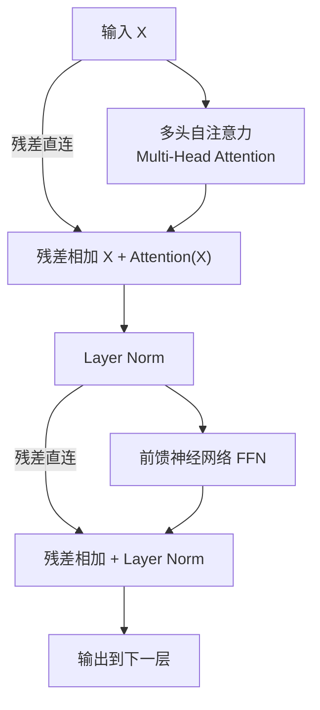
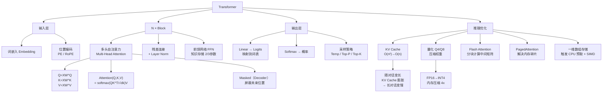

# Transformer 基础框架

> 📌 Transformer 是 2017 年 Google 提出的深度学习架构（论文《Attention is All You Need》），它抛弃了"顺序阅读"的方式，一眼看完整句话，通过注意力机制理解词间关系——几乎所有现代大模型（GPT、Claude、Llama、Qwen）都建立在它之上。


## □ 前置知识

在开始之前，你需要了解这些概念：

- [[矩阵乘法]] — 理解 Q、K、V 的计算方式，以及为何 GPU 适合做这件事
- [[向量与词嵌入 Embedding]] — 词是如何变成数字的
- [[神经网络基础]] — 什么是权重、梯度、反向传播
- [[408-计算机组成原理]] — Cache、内存带宽、SIMD 指令集（本笔记会大量关联）


## 🤔 为什么要学 Transformer？

想象你在用一个旧版翻译软件，它必须把英文一个词一个词地读完，才能慢慢翻译中文——这就是旧模型 RNN（循环神经网络）的工作方式，读到后面忘了前面是家常便饭。

Transformer 直接颠覆了这个范式：

- **彻底摆脱"排队"的低效**：不再依赖顺序，所有词同时处理，充分利用 GPU 的并行能力（$Q \times K^T$ 一次算完，复杂度从 RNN 的 $O(n)$ 时间步变成真正的并行）
- **长距离关联不再是难题**：文章第一段和最后一段，照样能精准建立联系，不会"失忆"
- **跨越领域的通用基石**：从写代码、回答问题，到看图说话（ViT）、预测蛋白质结构（AlphaFold），都是它

**408 考点关联**：RNN 需要 $O(n)$ 的时间步，是典型的串行结构；Transformer 的 $Q \times K^T$ 是一次性矩阵乘法，这是**空间换时间**，在《数据结构/算法》的复杂度分析中有对应。


## 🧠 核心概念


### 4.1 整体架构：双塔模型

> 🎯 **类比**：把 Transformer 想象成一个极其高效的翻译官小组。一部分人（编码器）负责精读原文，另一部分人（解码器）负责逐字写出译文。

标准的 Transformer 由两大部分组成：

**编码器 Encoder** — 负责"理解"
- 将输入文字转换成包含语义和位置信息的高维向量
- 可以**双向**看到整个句子（知道前文也知道后文）
- 典型代表：**BERT**、RoBERTa

**解码器 Decoder** — 负责"生成"
- 根据编码器提供的信息，逐个预测下一个词
- 只能**单向**看到已经生成的内容（不能偷看未来）
- 典型代表：**GPT-4、Claude、Llama、Qwen**

> ⚠️ **注**：现代纯生成模型（Llama、Qwen 等）通常只使用"纯解码器"架构，省去了 Encoder 部分，因为它们不需要处理"原文"。BERT 则只使用纯编码器架构。

| 特性 | Encoder（BERT 类） | Decoder（GPT 类） | Encoder-Decoder（原版） |
|------|---------|---------|------|
| **可见方向** | 双向（看完整句） | 单向（只看左边） | 编码器双向 + 解码器单向 |
| **典型代表** | BERT, RoBERTa | GPT-4, Claude, Llama | T5, BART |
| **核心任务** | 理解、分类、提取特征 | 续写、对话、生成 | 翻译、摘要 |
| **注意力类型** | Self-Attention | Masked Self-Attention | Cross-Attention + Masked |

> 💡 **一句话总结**：BERT 是"先读完整本书再做笔记"；GPT 是"边写边读，不能偷看后面的内容"。

整体数据流：


### 4.2 位置编码 (Positional Encoding)——赋予时间感

**核心问题**：Transformer 同时处理所有词，那"我爱你"和"你爱我"在它眼里不就一样了吗？

> 🎯 **类比**：把 Transformer 想象成一个能瞬间拍下整张黑板照片的学生。但照片没有"阅读顺序"，所以我们给每个词都贴上坐标贴纸，让模型知道谁在谁前面。

**解决方案**：给每个词的向量直接**加**上一个"位置向量"，而不是拼接（Concatenation）。

$$X_{final} = X_{embedding} + PE_{position}$$

> ⚠️ **为什么是加法而不是拼接？** 拼接会增加向量维度，导致后面所有的权重矩阵 $W$ 都要变大，内存开销成倍增加。相加在不改变维度的前提下完成了信息注入。

#### 原始论文：正弦余弦编码

$$PE_{(pos, 2i)} = \sin\left(\frac{pos}{10000^{2i/d_{model}}}\right)$$

$$PE_{(pos, 2i+1)} = \cos\left(\frac{pos}{10000^{2i/d_{model}}}\right)$$

- $pos$：词在句子中的位置（0, 1, 2…）
- $i$：向量维度的索引
- $d_{model}$：向量的总维度（如 512）

**为什么用三角函数，而不是直接用数字 1, 2, 3？**

| 方案 | 问题 |
|------|------|
| 直接用整数 1, 2, 3 | 序列长了数值爆炸，淹没语义信息 |
| 归一化到 [0, 1] | 训练时没见过的长度无法泛化 |
| 正弦/余弦函数 | 值域固定在 [-1, 1]，且能通过线性变换推算相对距离 |

**正弦函数的精妙之处**：根据三角函数的性质，$\sin(A+B)$ 可以由 $\sin A$、$\cos B$ 等组合出来。这意味着模型可以通过线性变换，轻松推算出单词之间的**相对距离**，而不只是绝对位置。

#### 现代进化版：RoPE（旋转位置编码）

Llama、Qwen、Gemini 等主流模型用的是 RoPE。

- **原始 PE**：给向量**加**一个位置数字
- **RoPE**：让向量在高维空间中**旋转**一定角度

两个词之间的相对距离，就变成了它们向量之间的夹角。这种设计对长文本的感知更精准，也让模型在处理超长上下文时更稳定。

**M3 实战视角**：计算 $\sin/\cos$ 本身比较耗时，实战中通常会预先计算一张 **Position Embedding Table** 放在内存里，用的时候直接按索引取——这是**空间换时间**。


### 4.3 自注意力 (Self-Attention)——核心魔法

这是 Transformer 最天才的地方。**它让每个词去"询问"句子里的其他词，看看谁跟自己最相关。**

> 🎯 **类比**：你在读"球掉进了水池，它溅起了水花。"当你读到"它"时，你的大脑会自动去回忆前面出现的名词：球？水池？通过语义判断，你知道"它"指的是"球"。Self-Attention 就在模拟这个过程。

#### Q、K、V 三个灵魂角色

想象你在图书馆找书：

- **$Q$（Query，查询）**：你手里拿的小纸条，写着"我想找关于深度学习的书"
- **$K$（Key，键）**：书架上每本书的标签/书名
- **$V$（Value，值）**：书里的具体内容

**Q、K、V 从哪来？** 每个词的初始向量（Embedding）记作 $X$，通过矩阵乘法得到：

$$Q = X \cdot W^Q \qquad K = X \cdot W^K \qquad V = X \cdot W^V$$

这里的 $W^Q, W^K, W^V$ 就是模型训练出来的**权重矩阵**，存储在 GGUF 等模型文件中。当你加载模型时，实际上就是把这些矩阵读入内存。

**从 408 线性代数角度看**：$Q \times K^T$ 的点积运算，本质上是在算**向量的余弦相似度**（方向越一致，相关性越高）。

#### 注意力计算公式（论文原文）

$$\text{Attention}(Q, K, V) = \text{softmax}\left(\frac{QK^T}{\sqrt{d_k}}\right)V$$

分三步理解：

**第一步：打分** $QK^T$

用"纸条"$Q$ 去和书架上所有"标签"$K$ 做点积。方向越一致，得分越高。**结果**：得到一个相似度分数矩阵，第 $i$ 行第 $j$ 列代表第 $i$ 个词对第 $j$ 个词的关注程度。

**第二步：归一化** $\text{softmax}(\cdots / \sqrt{d_k})$

- 除以 $\sqrt{d_k}$：防止分数太大导致梯度爆炸（$d_k$ 是向量维度，维度越高，点积结果越大）
- Softmax：把分数变成概率，所有位置的权重加起来等于 1

例如，模型处理"苹果好吃"里的"苹果"，得到的注意力权重可能是：

```
苹果 → 苹果: 0.50 (自身)
苹果 → 好吃: 0.40 (语义关联，"好吃"帮助确定苹果是水果而非手机)
苹果 → 。  : 0.10 (几乎无关)
```

**第三步：提取信息** $(\cdots) \times V$

用权重去加权求和 $V$（内容）。权重高的词贡献更多信息。

**结果**："苹果"从一个中性词，变成了一个"带着食物/水果语义"的向量——这才是真正包含上下文信息的表示。

#### 计算复杂度与 M3 GPU 的关系

$QK^T$ 是一个 $n \times n$ 的矩阵（$n$ 是序列长度），所有元素同时计算——这就是**高度并行化**的矩阵乘法。

对应 408《计算机组成原理》的 **SIMD（单指令流多数据流）** 概念：M3 GPU 拥有成百上千个核心，它们会并行处理矩阵乘法中所有的乘加运算。这是 Transformer 天生适合 GPU 加速的核心原因。

> ⚠️ **踩坑点**：当序列长度 $n = 8000$ 时，$QK^T$ 产生的中间矩阵大小为 $8000 \times 8000 \times 8\ \text{bytes} \approx 512\ \text{MB}$（仅一层一个头！）。多层多头下，这些中间矩阵会迅速撑爆内存。这就是 Flash Attention 要解决的问题（见后文）。


### 4.4 多头注意力 (Multi-Head Attention)

**如果只有一个注意力头，模型就像只有一双眼睛。但语言很复杂，我们需要多个视角同时观察。**

> 🎯 **类比**：一个侦探小组在分析案件。
> - 侦探 A（语义头）：专注逻辑，分析"苹果"是水果还是手机
> - 侦探 B（语法头）：关注主谓宾结构，分析"苹果"是主语
> - 侦探 C（指代头）：追踪"它"指的是哪个名词
>
> 最后汇总所有人的报告，得出最全面的结论。

**数学实现**：准备 $h$ 组不同的权重矩阵，并行计算 $h$ 个注意力，最后拼接后再通过线性层压缩：

$$\text{MultiHead}(Q,K,V) = \text{Concat}(\text{head}_1, \ldots, \text{head}_h) \cdot W^O$$

$$\text{head}_i = \text{Attention}(QW^Q_i,\ KW^K_i,\ VW^V_i)$$

**关键问题：多头会让参数量翻倍吗？**

答案是**不会**。总维度 $d_{model}$ 保持不变：

- **单头**：一个大的 $W^Q$ 矩阵，维度 $d_{model} \times d_{model}$
- **8 个头**：8 个小的 $W^Q$ 矩阵，每个维度 $d_{model} \times (d_{model}/8)$
- **结论**：$8 \times (d_{model} \times \frac{d_{model}}{8}) = d_{model}^2$，参数量**守恒**

**计算量也守恒吗？** 理论上是的。但现实中多头会带来额外的**管理开销**：矩阵的切分（Split）、转置（Transpose）和最后的拼接（Concat）涉及频繁的内存拷贝（Memcpy）。

**为什么多头反而更快？**

小矩阵 = 更高的缓存命中率。维度 64 的小矩阵更容易完全塞进 CPU 的 L1 Cache 或 GPU 的寄存器里，M3 的 AMX（高级矩阵扩展）单元可以同时处理多个小矩阵，比吞下一个巨型矩阵更灵活高效。

**常见配置**（GPT-2 为例）：12 个注意力头，每个头维度 = 768 / 12 = 64。


### 4.5 掩码自注意力 (Masked Self-Attention)——Decoder 专属

对于生成式模型，有一个关键约束：**预测第 $n$ 个词时，绝对不能提前看到第 $n$ 个词及之后的内容。**

否则就像考试时"偷看答案"，模型直接就知道答案是什么，根本学不会生成。

**实现方式**：在计算 $QK^T$ 之后，Softmax 之前，把当前词右侧（未来）位置的分数全部设为 $-\infty$：

$$M_{ij} = \begin{cases} 0 & i \geq j \text{（可以看）} \\ -\infty & i < j \text{（不能看）}\end{cases}$$

**为什么是 $-\infty$ 而不是 0？**

因为 $e^{-\infty} = 0$，经过 Softmax 后这些位置的权重彻底变成 0。用 `if-else` 判断会破坏并行性，**纯数学手段**才能让 GPU 并行计算时同时屏蔽未来位置——这是 Transformer 设计的精妙之处。

实战中通常用极小负数 $-10^9$ 代替真正的 $-\infty$，效果相同但不会引起浮点数计算问题。


### 4.6 交叉注意力 (Cross-Attention)——两个世界的交汇

在原始 Encoder-Decoder 架构中，Decoder 除了自己看自己（Masked Self-Attention），还需要去"看一眼"Encoder 的输出（Cross-Attention）：

- **自注意力**：看看我已经写了什么（Decoder 内部）
- **交叉注意力**：看看原文（Encoder 那边）到底说了什么

交叉注意力的 $Q$ 来自 Decoder，$K$ 和 $V$ 来自 Encoder 的输出。

> ⚠️ **注**：现代纯生成模型（GPT、Llama、Qwen）通常省去了 Encoder 和交叉注意力，因为它们不需要处理"原文"，只需要续写。


### 4.7 残差连接 (Residual Connection)——防止深度失忆

**问题**：如果 Transformer 堆叠了 96 层（GPT-3 就是 96 层），梯度在反向传播时会越来越弱，最底层什么都学不到——这就是"梯度消失"。

> 🎯 **类比**：你在备考 408 时，不仅要背新内容 $F(x)$，还要时刻对照着原版教材 $x$。就算这一轮复习没学到什么新东西（$F(x) \approx 0$），原始信息也不会丢失。

在每一层计算前后，执行一次加法：

$$\text{Output} = X + \text{Sublayer}(X)$$

**数学原理**：反向传播求导时，导数中会多出一个常数项 $1$：

$$\frac{\partial \text{Output}}{\partial X} = 1 + \frac{\partial \text{Sublayer}(X)}{\partial X}$$

即使深层 $\frac{\partial \text{Sublayer}}{\partial X} \approx 0$，这个 $1$ 能保证梯度信号无损地传回浅层，底层参数依然能得到更新。

**408 考点关联**：这类似于《计算机组成原理》中的**数据旁路/转发（Data Forwarding）** 技术。为了不让流水线因数据相关而停顿（Stall），硬件直接把计算结果传给下一级指令，不等待写回寄存器。残差连接同样是让信号"不等待、不损耗"，穿透复杂变换层直接传到下一层。

**M3 硬件视角**：执行 $x + F(x)$ 需要在内存中同时保留输入 $x$ 的副本，是 I/O 密集型操作。M3 的统一内存架构（UMA）让 CPU 和 GPU 共享这份备份，不需要跨 PCIe 总线拷贝，比传统架构代价低很多。


### 4.8 层归一化 (Layer Normalization)

残差相加后，数值可能变得很大或极不稳定。Layer Norm 强制把每一层的输出拉回均值为 0、方差为 1 的分布。

> 🎯 **类比**：就像计算机网络中的"信号整形"，无论信号怎么衰减或增强，都强制拉回标准电平，防止下一级因数据溢出而报错（对应 CPU 计算中的浮点溢出）。

**为什么是 Layer Norm 而不是 Batch Norm？**

Batch Norm 在"样本之间"做归一化，依赖 batch 内其他样本。Transformer 处理变长序列，Layer Norm 在"单个样本内部"做归一化，不依赖其他样本，在处理自然语言时更鲁棒。

**一个完整 Transformer Block 的流程**：




### 4.9 前馈神经网络 (Feed-Forward Network, FFN)——知识存储中心

在每层注意力之后，紧跟着一个 FFN。

> 🎯 **类比**：注意力机制负责"瞻前顾后"，在句子里找词间关联；FFN 负责"闭门思考"，对单个词进行深度加工和知识提取。
>
> **注意力**负责"联系"——"我看哪里"；**FFN** 负责"记忆"——"我是谁，我记住了什么"。

**结构：升维 → 激活 → 降维**

$$\text{FFN}(x) = \text{Activation}(xW_1 + b_1) \cdot W_2 + b_2$$

- **升维**：从 $d_{model}$ 扩展到 $4 \times d_{model}$（如 768 → 3072）
- **激活函数**：ReLU 或 GeLU（Qwen 系列用 SwiGLU）
- **降维**：从 $4 \times d_{model}$ 压回 $d_{model}$

**为什么要"升维再降维"？**

- 注意力机制本质是线性加权，FFN 通过激活函数引入**非线性**，是模型能处理复杂逻辑的关键
- Transformer 约 **2/3 的参数量**都集中在 FFN 层——把它想象成一个巨大的 Key-Value 存储器：升维过程在检索"知识点"，降维过程在提取"结论"

**408 考点（局部性与吞吐量）**：

- **完全并行**：FFN 处理一个序列时，每个 Token 之间的计算**完全独立**，是典型的 **SIMD** 模式，M3 的 GPU 可以开启数千个线程同时处理
- **内存带宽瓶颈**：FFN 参数量极大（14B 模型中这部分权重很重），当你感觉模型生成变慢时，往往是 M3 的内存总线在忙着把几 GB 的 FFN 权重从内存搬运到计算单元

**M3 上的缓存管理**：

- **权重锁定**：FFN 的权重通常被置于**联动内存（Wired Memory）**，防止系统在推理中途将其交换到 SSD
- **L2 缓存关键**：如果 4096 维度的中间结果能留在缓存里，回复生成速度会显著提升


### 4.10 输出层与采样策略 (Output & Sampling)

所有 Transformer Block 计算完后，最终输出一个高维向量，需要把它变成人类能读懂的文字。

#### 线性映射 (Linear Layer)

模型末尾有一个巨大的线性层矩阵，把向量"投影"到词表空间：

- **输入**：隐藏层向量（如长度 4096）
- **输出**：长度等于词表大小的向量（如 Llama 3 有 12.8 万个词，Qwen 约 15 万个词）
- 每个位置的数值叫 **Logits**，代表该词出现的"原始分数"

#### Softmax：从分数到概率

$$P_i = \frac{e^{logit_i}}{\sum_j e^{logit_j}}$$

将 Logits 映射到 $(0, 1)$ 区间，所有词的概率加起来等于 1。

**M3 视角**：计算 $e^x$ 是高开销操作，这种大规模的指数运算由 M3 的向量处理单元（SIMD）完成，防止浮点数溢出。

#### 采样策略：控制 AI 的"个性"

有了概率分布后，如果永远只选概率最高的词（贪心搜索），AI 说话会非常死板且容易陷入死循环。

| 参数 | 原理 | 效果 |
|------|------|------|
| **Temperature（温度）** | Softmax 前将 Logits 除以 $T$ | $T<1$：保守严谨；$T>1$：有创意爱胡说 |
| **Top-P（核采样）** | 只在累积概率达到 $P$（如 0.9）的候选词中随机抽取 | 动态调整候选集，模型越确定候选词越少 |
| **Top-K** | 只在概率最高的前 $K$ 个词中选择 | 缩小搜索空间，防止"胡言乱语" |

**Temperature 的数学本质**：这是一个**缩放变换**，$T$ 越大概率分布越平滑（熵越高），$T$ 越小越陡峭（熵越低）。对 M3 的计算量影响很小，主要影响的是生成质量。

**自回归生成的循环**：

1. 输入词向量 → Self-Attention → 算概率 → 选出一个词
2. 把这个词**塞回输入端**，作为下一次计算的依据
3. 重复，直到生成结束符或达到长度限制

这就是为什么大模型生成越长，速度可能越慢——每次都要处理越来越长的"历史记录"。


### 4.11 KV Cache——推理性能的核心优化

**问题**：生成第 1001 个词时，是否必须重新计算前 1000 个词的所有 $Q, K, V$ 矩阵？

**关键洞察**：前 1000 个词的 $K$ 和 $V$ 在这一层已经**固定不变**了（它们的内容不会因为新词的出现而改变）。唯一在变的是当前最新词的 $Q$。

**结论**：只需要算出新词的 $Q$，然后让它和缓存里存好的旧词的 $K, V$ 做乘法。

**KV Cache 的工作流程**：

1. **Prefill（预填充）**：你输入一段话，模型一次性算出所有词的 $K$ 和 $V$，存入内存
2. **Decoding（解码）**：每蹦出一个新词，算出它的 $K, V$ 追加到缓存末尾；只需算当前新词的 $Q$ 与缓存中所有 $K$ 的注意力

**408 联想**：这非常像《计算机组成原理》中的**写回（Write-back）策略**，我们不销毁旧数据，只增量更新。

**时间复杂度优化**：KV Cache 将推理的时间复杂度从 $O(n^2)$（每次都重算全部）降低到 $O(n)$（只算新词），但代价是 $O(n)$ 的内存占用。

**KV Cache 的内存计算**：

$$\text{KV Cache（GB）} = \frac{2 \times L \times H \times d_h \times n \times \text{sizeof(dtype)}}{1024^3}$$

- $L$：层数
- $H$：注意力头数
- $d_h$：每个头的维度
- $n$：上下文长度（Token 数）
- dtype：FP16 = 2 字节

以 Llama-3-8B（32 层，32 头，head_dim=128）处理 8192 上下文为例：$2 \times 32 \times 32 \times 128 \times 8192 \times 2 \approx 2\ \text{GB}$

**M3 用户的痛点——内存墙**：

- 对话越长，KV Cache 线性膨胀。当 24GB 接近满时，macOS 会触发**Compressed Memory（压缩内存）**，CPU 忙着在后台压缩数据，没空给你吐字——这就是长对话越来越慢的根本原因
- **408 联想**：类似操作系统的虚拟存储器，页面置换（Page Fault）太频繁时 CPU 再强也会因等待磁盘数据而"抖动"（Thrashing）


### 4.12 长文本与 KV Cache 淘汰

**问题**：如果内存装不下越来越长的 KV Cache，能不能像操作系统的 LRU 算法一样，把一部分丢弃？

**答案**：可以，但模型会"失忆"。

如果对话开头的 KV Cache 被删掉，模型在计算后续词的注意力时，找不到对应的 $K$ 和 $V$——就好比你开头告诉它"我叫凯瑞"，5000 字的对话后你问"我叫什么名字"，它会礼貌地回答"对不起，我不知道您的名字"。

这在技术上被称为**窗口注意力（Window Attention）**或上下文截断。

**工业界解决方案：PagedAttention（vLLM 核心技术）**

早期实现中，KV Cache 必须是**连续内存空间**（像数组），导致严重的内存碎片（外部碎片）。

PagedAttention 的做法：

- 将 KV Cache 划分成固定大小的"块（Blocks）"
- 允许这些块散落在内存各个角落（类似操作系统的分页）
- 通过"页表（Page Table）"映射逻辑词序和物理内存地址

**对你 M3 Mac 的意义**：这种技术能节省 20~30% 的内存，从而支持更长的对话或更大的模型。

**408 考点完美对应**：

| 大模型概念 | 操作系统概念 |
|-----------|-------------|
| KV Cache 碎片 | 外部碎片 |
| PagedAttention | 分页内存管理 |
| KV Cache 淘汰 | LRU 页面置换 |
| 上下文截断导致失忆 | 缺页后重新加载数据 |


### 4.13 量化 (Quantization)——在 M3 上跑更大的模型

**问题**：70B 模型用 FP16（16位浮点）存储需要约 140 GB，远超 M3 的 24 GB，怎么办？

**解决思路**：把每个权重从 16 位压缩到更少的位数。

$$\text{权重内存（GB）} \approx \frac{\text{参数量（B）} \times \text{量化位数}}{8}$$

#### 存储层：从 16 位到 4 位甚至更低

- **FP16（16 bit）**：主流训练精度，70B 模型需要 ~140 GB
- **INT8（8 bit）**：直接减半，70B 约 70 GB
- **INT4（4 bit，Q4）**：70B 约 35 GB
- **INT2（2 bit，IQ2）**：70B 约 17.5 GB（精度损失明显）

量化不是简单截断，而是通过**缩放因子（Scale）**将权重映射到整数区间。例如，把一组 FP16 权重映射到 $[-8, 7]$ 的整数范围（4-bit INT4）。

#### 算法层：分块量化与混合精度

简单地把所有数字压缩成 4 位会让模型"变傻"，需要更高级的算法：

- **分块量化（Block-wise Quantization）**：这是 llama.cpp 中 K-Quants 的核心。不给整个矩阵统一缩放，而是每 32 个或 64 个权重分为一组，每组独立的缩放因子，大幅减少量化误差
- **保护"离群值"（Outliers）**：模型中只有极少数权重（约 0.1%）对结果起决定性作用。对大部分数字用 4-bit，对关键数字保留 8-bit 或 16-bit——这就是 Q4_K_M 中 "K_M" 的含义

#### 架构层：分层推理与 GPU/CPU 协作

内存实在装不下时，还可以打磁盘和 CPU 的主意：

- **Layer Offloading（分层加载）**：用 `-ngl` 参数（number of gpu layers）控制多少层在 GPU 跑，其余在 CPU 跑
- 虽然速度会变慢，但能强行跑通原本跑不动的超大模型

**Flash Attention：解决中间矩阵的内存爆炸**

除了量化权重，注意力计算中的中间矩阵也是内存杀手（$n \times n$ 的得分矩阵）。

Flash Attention 的思路：**不一次性算出那个巨大的中间矩阵**。

利用操作系统的缓存局部性原理，把矩阵切成小块（如 $64 \times 64$），让每一块都塞进 M3 芯片最快的 SRAM（L1/L2 Cache）里。计算过程中不需要把中间矩阵写回 24 GB 的主内存，极大节省了内存带宽。

**效果**：内存占用从 $O(n^2)$ 降低到 $O(n)$，速度也因为减少了内存读写而大幅提升。


### 4.14 可逆残差网络——终极内存优化

**问题**：100 层 Transformer 的残差连接需要保存 100 份输入备份，训练时内存压力极大。

**梯度检查点（Gradient Checkpointing）**：只保存部分层的激活值，其余在需要时重新计算。以时间换空间，内存从 $O(L)$ 降至 $O(\sqrt{L})$。

**可逆残差网络（Reversible Residual Network）**：更绝的方案，完全不需要保存备份。

把输入分成两半 $x_1, x_2$，运算变为：

$$y_1 = x_1 + F(x_2)$$

$$y_2 = x_2 + G(y_1)$$

在反向传播时，可以通过 $y_1, y_2$ **反推**出 $x_1, x_2$，就像"倒带"一样。不需要备份 100 层的输入，只需记住最后一层的输出。

**结果**：内存占用从 $O(L)$（$L$ 是层数）直接降到 $O(1)$。

**M3 Mac 上的内存压力分析**：

- **容量（Capacity）是硬门槛**：推理（Inference）时不需要保存所有层的激活值，算完一层删一层即可
- **带宽（Bandwidth）是真瓶颈**：频繁地在 SSD 和内存之间置换数据，系统会卡在 I/O 等待上（对应 OS 的"抖动"Thrashing）


## 💻 代码示例


### 手写注意力机制（Python）

```python
import torch
import torch.nn.functional as F
import math

def scaled_dot_product_attention(Q, K, V, mask=None):
    """
    计算缩放点积注意力
    Args:
        Q: 查询矩阵 (batch, seq_len, d_k)
        K: 键矩阵   (batch, seq_len, d_k)
        V: 值矩阵   (batch, seq_len, d_v)
        mask: 掩码矩阵，0 表示屏蔽（用于 Decoder 的因果掩码）
    Returns:
        output: 注意力输出 (batch, seq_len, d_v)
        weights: 注意力权重分布（可用于可视化）
    """
    d_k = Q.size(-1)  # 获取键的维度

    # 第一步：打分 —— Q 和 K 的点积，除以 sqrt(d_k) 防止梯度爆炸
    scores = torch.matmul(Q, K.transpose(-2, -1)) / math.sqrt(d_k)

    # 应用掩码（Decoder 中用于遮住未来的词）
    if mask is not None:
        scores = scores.masked_fill(mask == 0, float('-inf'))

    # 第二步：Softmax 归一化，变成概率分布
    weights = F.softmax(scores, dim=-1)

    # 第三步：用权重加权求和 V，得到上下文向量
    output = torch.matmul(weights, V)

    return output, weights


if __name__ == "__main__":
    batch_size = 1
    seq_len    = 4        # 句子有 4 个词
    d_k        = 8        # 每个词的向量维度

    Q = torch.rand(batch_size, seq_len, d_k)
    K = torch.rand(batch_size, seq_len, d_k)
    V = torch.rand(batch_size, seq_len, d_k)

    # 编码器：无掩码，双向注意力
    output_enc, weights_enc = scaled_dot_product_attention(Q, K, V)
    print(f"[Encoder] 注意力权重:\n{weights_enc[0]}")

    # 解码器：因果掩码，只能看左边
    causal_mask = torch.tril(torch.ones(seq_len, seq_len))
    output_dec, weights_dec = scaled_dot_product_attention(Q, K, V, mask=causal_mask)
    print(f"\n[Decoder] 因果掩码后的注意力权重:\n{weights_dec[0]}")
    # 关键验证：上三角部分应全为 0（不能看未来）
```

运行命令：

```bash
python3 attention.py
```

**预期输出要点**：Decoder 的注意力权重矩阵上三角部分全为 0，表示每个词只能看到自己和左边的词。


### C++ 手写矩阵乘法（关注内存布局）

```cpp
#include <vector>
#include <cmath>
#include <stdexcept>
#include <iostream>

// ── 版本 A：vector<vector<double>> —— 内存分散，有 Cache Miss 问题 ──
class MatrixV2D {
public:
    int rows, cols;
    std::vector<std::vector<double>> data;

    MatrixV2D(int r, int c) : rows(r), cols(c), data(r, std::vector<double>(c, 0.0)) {}

    MatrixV2D operator*(const MatrixV2D& other) const {
        MatrixV2D result(rows, other.cols);
        for (int i = 0; i < rows; ++i)
            for (int j = 0; j < other.cols; ++j)
                for (int k = 0; k < cols; ++k)
                    // 问题：other.data[k][j] 跨行访问，物理地址不连续，触发 Cache Miss
                    result.data[i][j] += data[i][k] * other.data[k][j];
        return result;
    }
};

// ── 版本 B：一维数组 —— 物理连续，CPU 预取器友好，性能数倍提升 ──
class Matrix1D {
public:
    int rows, cols;
    std::vector<float> data;  // 注意：改用 float（4字节）而非 double（8字节）节省内存

    Matrix1D(int r, int c) : rows(r), cols(c), data(r * c, 0.0f) {}

    // 行优先存储：第 i 行第 j 列 = data[i * cols + j]
    float& at(int i, int j) { return data[i * cols + j]; }
    float  at(int i, int j) const { return data[i * cols + j]; }

    Matrix1D operator*(const Matrix1D& other) const {
        Matrix1D result(rows, other.cols);
        for (int i = 0; i < rows; ++i)
            for (int k = 0; k < cols; ++k)
                for (int j = 0; j < other.cols; ++j)
                    // 内循环按列连续访问 other，配合 k 循环顺序，触发 CPU 预取
                    result.at(i, j) += at(i, k) * other.at(k, j);
        return result;
    }
};

// ── Softmax（带数值稳定化）──
std::vector<float> softmax(const std::vector<float>& logits) {
    float max_val = *std::max_element(logits.begin(), logits.end());
    std::vector<float> exp_vals(logits.size());
    float sum = 0.0f;
    for (size_t i = 0; i < logits.size(); ++i) {
        exp_vals[i] = std::exp(logits[i] - max_val);  // 减去 max 防止溢出
        sum += exp_vals[i];
    }
    for (auto& v : exp_vals) v /= sum;
    return exp_vals;
}

int main() {
    std::cout << "测试一维数组矩阵乘法（行优先存储）..." << std::endl;
    Matrix1D A(3, 4), B(4, 2);
    // 随机填充...
    Matrix1D C = A * B;  // 结果 3×2
    std::cout << "矩阵乘法完成，结果维度: " << C.rows << "×" << C.cols << std::endl;
    return 0;
}
```

编译运行（macOS M3）：

```bash
clang++ -std=c++17 -O2 -o matrix_demo matrix_demo.cpp && ./matrix_demo
```

**性能对比说明**：

| 存储方式 | 物理布局 | Cache 行为 | 在 M3 上性能 |
|---------|---------|-----------|-------------|
| `vector<vector<double>>` | 分散，行间有跳跃 | 频繁 Cache Miss + TLB Miss | 基准 |
| `vector<float>` 一维 | 连续字节流 | CPU 预取器完美工作 | **数倍甚至数量级提升** |

**数据类型的内存影响**：

| 类型 | 位数 | 70B 模型占用 | 说明 |
|------|------|------------|------|
| `double`（FP64） | 64 bit | ~560 GB | 科研计算用，推理中完全不必要 |
| `float`（FP32） | 32 bit | ~280 GB | 标准训练精度 |
| `half`（FP16） | 16 bit | ~140 GB | 主流推理精度，M3 有专用硬件 |
| INT4 量化 | 4 bit | ~35 GB | llama.cpp Q4_K_M，24GB Mac 可运行 |
| INT2 量化 | 2 bit | ~17.5 GB | IQ2_M，质量有明显下降 |


### KV Cache 内存估算工具

```python
def estimate_kv_cache_memory(
    num_layers,
    num_heads,
    head_dim,
    seq_len,
    batch_size=1,
    dtype_bytes=2   # FP16 = 2 bytes
):
    """
    估算 KV Cache 占用内存（GB）
    Args:
        num_layers  : 模型层数（Llama-3-8B=32, 70B=80）
        num_heads   : 注意力头数（Llama-3-8B=32, 70B=64）
        head_dim    : 每个头的维度（通常是 128）
        seq_len     : 上下文长度（对话越长，这个越大）
    """
    # K 和 V 各一份，所以乘以 2
    kv_cache_bytes = (
        2 * num_layers * num_heads * head_dim * seq_len * batch_size * dtype_bytes
    )
    return kv_cache_bytes / (1024 ** 3)


if __name__ == "__main__":
    # Llama-3-8B 参数
    mem_8b = estimate_kv_cache_memory(32, 32, 128, seq_len=8192)
    print(f"Llama-3-8B，上下文 8192：KV Cache = {mem_8b:.2f} GB")
    # 预期：约 2.0 GB

    # 带宽计算：读取一次需要多长时间？
    bandwidth_gbps = 100  # M3 统一内存带宽约 100 GB/s
    read_time_ms = mem_8b / bandwidth_gbps * 1000
    print(f"M3 读取一次 KV Cache 耗时：{read_time_ms:.2f} ms")
    # 这就是为什么长对话每生成一个词都要这么久

    # 更大上下文的压力
    mem_8b_long = estimate_kv_cache_memory(32, 32, 128, seq_len=128000)
    print(f"Llama-3-8B，上下文 128K：KV Cache = {mem_8b_long:.2f} GB")
```

运行命令：

```bash
python3 kv_cache_estimate.py
```


### 位置编码可视化

```python
import torch
import math

def get_sinusoidal_pe(seq_len, d_model):
    """
    生成正弦/余弦位置编码矩阵（原版 Transformer 实现）
    """
    PE = torch.zeros(seq_len, d_model)
    position = torch.arange(0, seq_len, dtype=torch.float).unsqueeze(1)
    div_term = torch.exp(
        torch.arange(0, d_model, 2).float() * (-math.log(10000.0) / d_model)
    )
    PE[:, 0::2] = torch.sin(position * div_term)  # 偶数维度用 sin
    PE[:, 1::2] = torch.cos(position * div_term)  # 奇数维度用 cos
    return PE


if __name__ == "__main__":
    seq_len, d_model = 10, 16
    PE = get_sinusoidal_pe(seq_len, d_model)
    print(f"位置编码矩阵形状: {PE.shape}")           # (10, 16)
    print(f"第 0 个词（前4维）: {PE[0, :4].tolist()}")
    print(f"第 1 个词（前4维）: {PE[1, :4].tolist()}")
    print(f"第 5 个词（前4维）: {PE[5, :4].tolist()}")
    # 关键验证：每个位置的向量都不同，且每一维的值都在 [-1, 1] 之间
```

运行命令：

```bash
python3 positional_encoding.py
```


## ⚠️ 常见误区与踩坑点

> ❌ **误区 1：Self-Attention 可以替代所有其他模块**
> Transformer 是注意力 + FFN + 残差的组合体，缺一不可。注意力负责"联系"（找词间关系），FFN 负责"记忆"（存储和提取知识），残差连接负责"传承"（防止梯度消失）。

> ❌ **误区 2：Temperature 越高，模型越聪明**
> Temperature 越高，模型"创意"越强，但同时越容易幻觉（hallucination）。代码生成用低温（0.1~0.3），创意写作用高温（0.7~1.0）。Temperature 对 M3 的计算量几乎没有影响，影响的只是生成质量。

> ❌ **误区 3：多头注意力比单头注意力参数量多**
> 保持总维度 $d_{model}$ 不变的情况下，多头的总参数量与单头完全相同（等量切分）。多头的优势在于能同时从多个语义维度分析词间关系，而不是靠参数量取胜。

> ⚠️ **踩坑 1：KV Cache 导致长对话变慢**
> 解决方法：定期清空上下文（在 Ollama/Chatbox 中开新对话），或在启动 llama.cpp 时用 `-c 4096` 限制上下文长度，给 KV Cache 设一个上限。

> ⚠️ **踩坑 2：llama.cpp 的 `-ngl` 参数必须设置**
> 在 macOS 上不加 `-ngl 99` 会导致模型跑在 CPU 上，速度慢 5~10 倍。务必加上这个参数启用 Metal（M3 GPU）加速。

> ⚠️ **踩坑 3：MacBook Air 无风扇散热导致降频**
> 跑 32B 满载模型超过 10 分钟，M3 可能因为发热而降频（Thermal Throttling）。如果发现"蹦字"速度突然慢了一半，那就是芯片太热了，需要停一会儿或降低模型规模。

> ❌ **误区 4：`vector<vector<double>>` 的内存布局**
> 这是 C++ 初学者最容易踩的坑。`vector<vector>` 在物理内存中是分散的（类似二级页表），行间可能"千山万水"，导致频繁 Cache Miss 和 TLB Miss。Transformer 这种矩阵密集型计算必须用一维数组（`vector<float>(rows * cols)`）保证连续存储，才能触发 CPU 预取和 SIMD 加速。


## 🔄 概念对比

### Transformer vs 前辈模型

| 特性 | RNN/LSTM | Transformer |
|------|---------|-------------|
| **处理方式** | 顺序（一个接一个） | 并行（同时处理全部） |
| **长距离依赖** | 难，容易"遗忘" | 容易，注意力直接连接任意两词 |
| **GPU 利用率** | 低（串行难并行） | 高（矩阵乘法天生适合 GPU） |
| **训练速度** | 慢 | 快 |
| **位置感知** | 天然（物理顺序） | 需要显式位置编码 |

### 各种注意力机制对比

| 类型 | 来源 | 适用场景 |
|------|------|---------|
| Self-Attention | $Q, K, V$ 均来自同一序列 | Encoder 理解输入 |
| Masked Self-Attention | Self-Attention + 上三角掩码 | Decoder 生成输出 |
| Cross-Attention | $Q$ 来自 Decoder，$K, V$ 来自 Encoder | Encoder-Decoder 翻译任务 |
| Multi-Head Attention | 多组并行 Attention 拼接 | 所有场景（标准配置） |

### 位置编码进化史

| 版本 | 代表模型 | 特点 |
|------|---------|------|
| 正弦余弦编码 | 原版 Transformer | 固定，不可学习，数学优雅 |
| 可学习位置编码 | BERT | 可训练，但不能外推到训练长度以外 |
| RoPE（旋转编码） | Llama, Qwen, Gemini | 相对位置，支持长上下文外推 |
| ALiBi | MPT | 注意力偏置，轻量高效 |


## 💡 M3 Mac 实战——模型选型指南

**内存分配公式**：

$$\text{可用内存} \approx 24\ \text{GB} - 4\ \text{GB（系统）} - \text{KV Cache} \approx 18\text{~}20\ \text{GB}$$

**权重占用估算**：

$$\text{权重内存（GB）} \approx \frac{\text{参数量（B）} \times \text{量化位数}}{8}$$

| 模型规模 | 量化级别 | 约占内存 | 建议 |
|---------|---------|---------|------|
| 8B（Llama 3.1） | Q8_0（8bit） | ~8.5 GB | 极速，随意开程序 |
| 14B（Qwen 2.5） | Q4_K_M（4bit） | ~9 GB | 丝滑，精度良好 |
| **32B（Qwen 2.5）** | **Q4_K_M（4bit）** | **~19 GB** | **⭐ 甜点位** |
| 70B（Llama 3） | IQ2_M（2bit） | ~19 GB | 勉强运行，智商有损 |

> 💡 **推荐配置**：32B + Q4_K_M 是 M3 24GB 的最佳平衡。32B 的推理能力远强于 8B，能处理复杂的 C++ 编程逻辑，且 ~19 GB 的占用还能留给 IDE 和 PDF 阅读器。

**最优 llama.cpp 启动命令**：

```bash
./llama-cli -m qwen2.5-32b-q4_k_m.gguf \
    -ngl 99 \       # 将所有层推送到 M3 GPU（Metal 加速）
    -c 8192 \       # 上下文窗口 8192 token
    --temp 0.7      # 平衡创意与准确性
```

**Ollama 别名配置（一次性设置，终生受益）**：

```bash
# 在 ~/.zshrc 中添加
alias ask="ollama run qwen2.5:14b"
# 之后直接：ask "你的问题"
```


## 🦾 动手练习


### 练习 1：实现因果掩码（⭐ 入门）

**题目**：修改上面的 Python 注意力代码，添加 Decoder 的因果掩码，并打印出注意力权重矩阵，验证上三角部分确实为 0。

**提示**：`causal_mask = torch.tril(torch.ones(seq_len, seq_len))`

<details>
<summary>💡 点击查看参考答案</summary>

```python
import torch
import torch.nn.functional as F
import math

def scaled_dot_product_attention(Q, K, V, mask=None):
    d_k = Q.size(-1)
    scores = torch.matmul(Q, K.transpose(-2, -1)) / math.sqrt(d_k)
    if mask is not None:
        scores = scores.masked_fill(mask == 0, float('-inf'))
    weights = F.softmax(scores, dim=-1)
    return torch.matmul(weights, V), weights

seq_len, d_k = 5, 8
Q = torch.rand(1, seq_len, d_k)
K = torch.rand(1, seq_len, d_k)
V = torch.rand(1, seq_len, d_k)

causal_mask = torch.tril(torch.ones(seq_len, seq_len))
print("因果掩码:\n", causal_mask)

_, weights = scaled_dot_product_attention(Q, K, V, mask=causal_mask)
print("\nDecoder 注意力权重（上三角应全为 0）:")
print(weights[0].detach().numpy().round(3))
```

</details>


### 练习 2：KV Cache 内存计算（⭐⭐ 进阶）

**题目**：用 `estimate_kv_cache_memory` 函数计算以下两种情况，并判断 M3 24GB Mac 能否运行：

1. Qwen 2.5-14B（40层，40头，head_dim=128），Q4_K_M 量化，上下文 8192 token
2. Llama 3.1-70B（80层，64头，head_dim=128），IQ2_M 量化，上下文 4096 token

<details>
<summary>💡 点击查看参考答案</summary>

```python
def estimate_kv_cache_memory(num_layers, num_heads, head_dim, seq_len,
                              batch_size=1, dtype_bytes=2):
    return 2 * num_layers * num_heads * head_dim * seq_len * batch_size * dtype_bytes / (1024**3)

# 场景 1
weights_14b = 14 * 4 / 8         # Q4_K_M：4bit → 7 GB
kv_14b = estimate_kv_cache_memory(40, 40, 128, 8192)
total_1 = weights_14b + kv_14b + 4  # +4 系统开销
print(f"场景1：权重 {weights_14b:.1f}GB + KV {kv_14b:.2f}GB + 系统 4GB = {total_1:.1f}GB")
print(f"{'✅ 可以运行' if total_1 < 24 else '❌ 内存不足'}")

# 场景 2
weights_70b = 70 * 2 / 8         # IQ2_M：2bit → 17.5 GB
kv_70b = estimate_kv_cache_memory(80, 64, 128, 4096)
total_2 = weights_70b + kv_70b + 4
print(f"\n场景2：权重 {weights_70b:.1f}GB + KV {kv_70b:.2f}GB + 系统 4GB = {total_2:.1f}GB")
print(f"{'✅ 可以运行（勉强）' if total_2 < 24 else '❌ 内存不足'}")
```

</details>


### 练习 3：改写矩阵为一维数组（⭐⭐⭐ 挑战）

**题目**：将以下二维 `vector<vector<double>>` 矩阵乘法改写为基于 `vector<float>` 一维数组的版本，并用 `std::chrono` 计时对比两个版本在 1000×1000 矩阵上的性能差异。

**提示**：一维数组中，第 $i$ 行第 $j$ 列的元素索引为 `i * cols + j`。

<details>
<summary>💡 点击查看参考答案</summary>

```cpp
#include <vector>
#include <chrono>
#include <iostream>
#include <random>

// 一维数组版本
std::vector<float> matmul_1d(
    const std::vector<float>& A,
    const std::vector<float>& B,
    int M, int K, int N)
{
    std::vector<float> C(M * N, 0.0f);
    for (int i = 0; i < M; ++i)
        for (int k = 0; k < K; ++k)
            for (int j = 0; j < N; ++j)
                C[i * N + j] += A[i * K + k] * B[k * N + j];
    return C;
}

int main() {
    int M = 512, K = 512, N = 512;
    std::mt19937 rng(42);
    std::uniform_real_distribution<float> dist(0.0f, 1.0f);

    std::vector<float> A(M * K), B(K * N);
    for (auto& v : A) v = dist(rng);
    for (auto& v : B) v = dist(rng);

    auto start = std::chrono::high_resolution_clock::now();
    auto C = matmul_1d(A, B, M, K, N);
    auto end = std::chrono::high_resolution_clock::now();

    double ms = std::chrono::duration<double, std::milli>(end - start).count();
    std::cout << "一维数组矩阵乘法耗时：" << ms << " ms" << std::endl;
    return 0;
}
```

```bash
clang++ -std=c++17 -O2 -o matmul matmul.cpp && ./matmul
```

</details>


## 📝 总结


### 本篇要点回顾

1. **Transformer 的革命性**：抛弃顺序处理，一次看完全句，通过注意力机制建立词间关联；天生适合 GPU 并行，彻底改变了 AI 领域
2. **Q、K、V 三角色**：Query（我在找什么）、Key（我能提供什么标签）、Value（我的实际内容）；注意力就是带权重的检索，本质是余弦相似度计算
3. **残差连接是深层网络的救命稻草**：$x + F(x)$ 保证梯度在 96 层模型中依然能传播到底层，类比 CPU 流水线中的数据旁路/转发技术
4. **FFN 是知识存储的核心**：约占 2/3 的参数量，升维-激活-降维结构存储了模型"记住"的所有知识
5. **KV Cache 是推理速度与内存的核心博弈**：将时间复杂度从 $O(n^2)$ 降到 $O(n)$，但会随对话变长线性膨胀
6. **量化是在有限内存上跑大模型的关键**：Q4_K_M 是精度与压缩比的最佳平衡；Flash Attention 解决注意力中间矩阵的内存爆炸
7. **内存布局直接决定性能**：一维连续数组比 `vector<vector>` 快数倍，是 llama.cpp 等高性能推理引擎的底层基石


### 知识图谱




## 🔗 相关链接

- 上级概念：[[深度学习基础]]、[[神经网络]]
- 同级概念：[[BERT]]、[[GPT架构]]、[[RNN与LSTM]]
- 下级概念：[[Transformer MoE]]、[[KV Cache详解]]、[[量化技术 Quantization]]、[[Flash Attention]]、[[RoPE旋转位置编码]]
- 实际应用：[[llama.cpp 部署指南]]、[[MacBook M3 大模型实战]]、[[Ollama 配置指南]]
- 408 关联：[[408-计算机组成原理-Cache]]、[[408-操作系统-虚拟内存]]、[[408-算法-复杂度分析]]


## 📚 参考资料

- [Attention Is All You Need（原论文）](https://arxiv.org/abs/1706.03762) — 必读，所有公式的来源
- [The Illustrated Transformer（Jay Alammar）](https://jalammar.github.io/illustrated-transformer/) — 最好的可视化解释
- [Flash Attention 论文](https://arxiv.org/abs/2205.14135) — 理解分块计算如何解决内存瓶颈
- [llama.cpp GitHub](https://github.com/ggerganov/llama.cpp) — M3 Mac 上运行大模型的核心工具
- [vLLM 与 PagedAttention](https://arxiv.org/abs/2309.06180) — KV Cache 内存碎片的工业界解决方案
