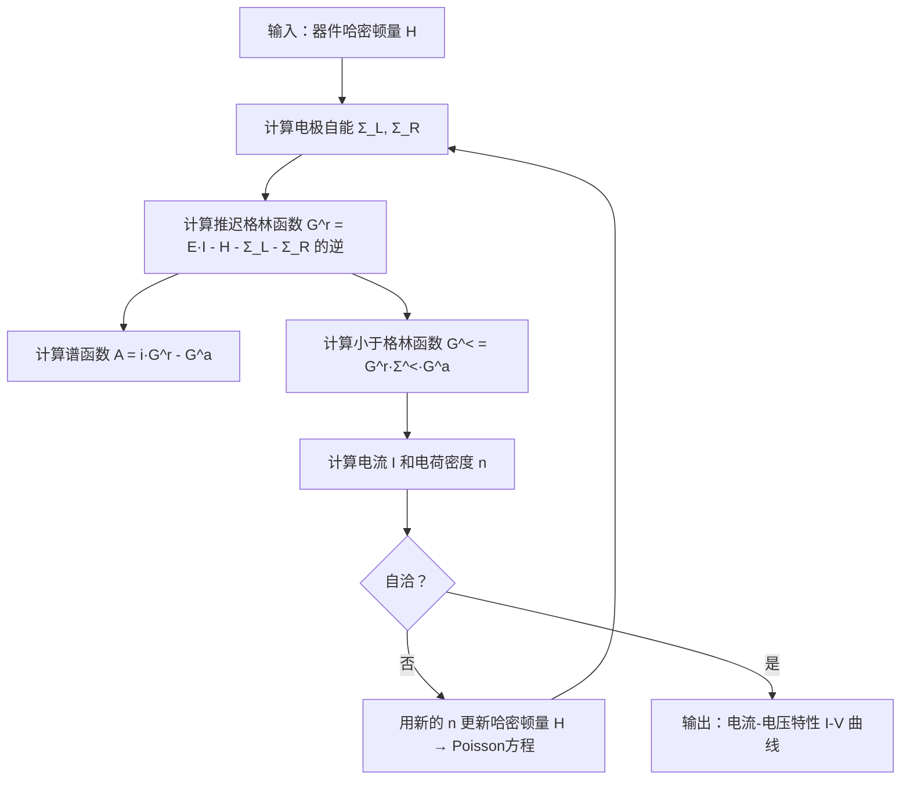
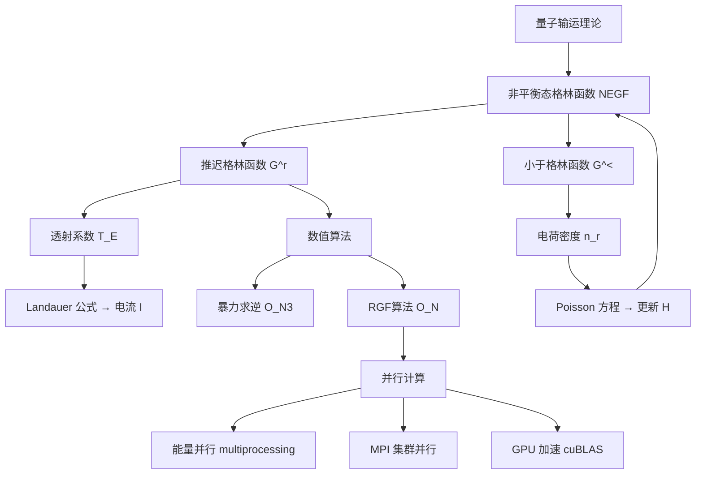

# 非平衡态格林函数（NEGF）方法与并行计算

> 📌 NEGF 是一种计算纳米器件中电子如何"流动"的量子力学工具——就像给电子世界装上了一个能模拟"拥挤道路上车流"的超级导航系统。


## 📋 前置知识

在开始之前，你需要了解这些概念（如果不熟悉，先点击链接去补课）：

- [[矩阵与线性代数]] — NEGF 的核心运算全是矩阵操作，不熟悉矩阵乘法和逆矩阵会寸步难行
- [[量子力学基础]] — 需要知道"哈密顿量"是什么（它描述系统的能量）
- [[Python 基础语法]] — 本篇代码示例以 Python 为主
- [[复数（Complex Number）]] — 格林函数是复数矩阵，需要知道虚数 i 是什么


## 🤔 为什么要学这个？

想象一下：你是一名芯片工程师，需要设计一款只有几纳米宽的晶体管。

在这个尺度下，电子不再像水流一样"流动"，而是表现出**量子效应**——它可以"穿墙而过"（量子隧穿），可以同时走两条路（叠加态），还会被原子级别的缺陷强烈散射。

传统的经典模拟方法（比如漂移扩散模型）完全失效了。你需要一个能描述这种量子世界中电子输运行为的工具。

**NEGF 就是为此而生的。** 它能告诉你：
- 在给定电压下，有多少电流会流过这个纳米器件？
- 电子在哪些位置最"拥堵"？
- 如何优化器件结构来提升性能？

但问题来了：计算一个真实器件需要处理的矩阵可能有几十万行，每次迭代都要做大量的矩阵求逆运算，**单机跑一次模拟可能要几天甚至几周**。这就是为什么我们既要学 NEGF 理论，也要学如何用并行计算来加速它。


## 🧠 核心概念


### 什么是"格林函数"？

> 🎯 **类比**：把格林函数想象成一个城市的"交通响应系统"。你在某个路口（位置 j）制造一辆车（添加一个电子），格林函数告诉你这辆车会对另一个路口（位置 i）的交通状况产生多大影响。这种"一处扰动、处处响应"的关系，就是格林函数描述的东西。

在量子力学中，**格林函数 G(E)** 描述的是：在能量 E 下，往系统某处"放入"一个电子，这个扰动如何在整个系统中传播。

数学上，推迟格林函数（Retarded Green's Function）定义为：

$G^r(E) = \left[(E + i\eta)\,I - H - \Sigma^r\right]^{-1}$

别被这个公式吓到，我们逐项拆解：

- $E$：电子的能量（就像汽车的速度档位）
- $I$：单位矩阵（可以理解为"什么都不改变"的操作）
- $H$：哈密顿矩阵，描述器件本身的能量结构（材料、原子排列决定了它）
- $\Sigma^r$（自能，Self-energy）：描述电极对器件的影响——电子从电极流入/流出时带来的"干扰"
- $i\eta$：一个无穷小的虚数，数学上保证矩阵可逆（物理上对应因果性）

**一句话总结**：格林函数 = 对"系统结构 + 外部影响"这个矩阵求逆。


### 为什么是"非平衡态"？

普通（平衡态）格林函数描述的是系统在没有外加电压时的状态——就像没有风时湖面的涟漪。

**非平衡态**意味着：左右两个电极施加了不同的电压（不同的化学势 μ_L ≠ μ_R），电子从高电势端流向低电势端，系统处于持续的"非平衡"状态——就像给湖的一端加了一台抽水机，水流不停地循环。

NEGF 的核心在于引入了两个额外的格林函数来描述这种非平衡状态：

- $G^<$（小于格林函数，Lesser Green's Function）：描述系统中电子的占据情况（哪些"座位"有电子坐着）
- $G^>$（大于格林函数，Greater Green's Function）：描述空穴的占据情况（哪些"座位"是空的）

它们之间有关系：

$G^< = G^r \Sigma^< G^a$

其中 $G^a = (G^r)^\dagger$（推迟格林函数的厄米共轭，即转置再取复共轭）。


### NEGF 的完整计算流程

理解了基本概念，我们来看完整的计算流程：



这个循环叫做 **NEGF-Poisson 自洽迭代**，是器件仿真的核心。


### 电流公式

最终的电流通过 Landauer-Büttiker 公式计算：

$I = \frac{2e}{h} \int T(E) \left[f_L(E) - f_R(E)\right] dE$

- $T(E)$：透射系数，表示能量为 $E$ 的电子从左极穿到右极的概率（0到1之间）
- $f_L,\, f_R$：左右电极的 Fermi-Dirac 分布函数（描述电子的占据概率）
- $2e/h$：量子电导单位（约 77.5 μS）

透射系数由格林函数计算：

$T(E) = \text{Tr}\left[\Gamma_L G^r \Gamma_R G^a\right]$

其中线宽函数 $\Gamma = i(\Sigma^r - \Sigma^a)$，描述电极与器件的耦合强度。


## 💻 代码示例


### 示例 1：最简单的 NEGF——单能级模型

我们从最简单的情况开始：一个只有**单个能级**的量子点连接在两个电极之间。

```python
# 📂 文件名: negf_single_level.py
# 📌 演示：单能级量子点的 NEGF 计算
# 这是 NEGF 最简单的情形，H 是一个 1x1 的"矩阵"（标量）

import numpy as np
import matplotlib.pyplot as plt

# ── 物理参数设置 ──────────────────────────────────────────
eps0 = 0.0       # 量子点能级位置（单位：eV），取费米能级为零点
gamma_L = 0.05   # 左电极与量子点的耦合强度（eV）
gamma_R = 0.05   # 右电极与量子点的耦合强度（eV）
eta = 1e-9       # 无穷小虚数，保证数值稳定性

# ── 能量网格 ──────────────────────────────────────────────
E = np.linspace(-0.5, 0.5, 1000)   # 扫描能量范围：-0.5 到 0.5 eV

# ── 自能（Σ）：宽带近似下，自能是纯虚数 ──────────────────
Sigma_L = -1j * gamma_L / 2   # 左电极自能（虚部代表电极对能级的展宽）
Sigma_R = -1j * gamma_R / 2   # 右电极自能

# ── 推迟格林函数 G^r(E) ──────────────────────────────────
# G^r = 1 / (E - eps0 - Sigma_L - Sigma_R + i*eta)
Gr = 1.0 / (E - eps0 - Sigma_L - Sigma_R + 1j * eta)

# ── 谱函数 A(E) = -2 * Im[G^r(E)] ────────────────────────
# 谱函数描述"在能量 E 处能找到电子的概率密度"
A = -2 * np.imag(Gr)

# ── 透射系数 T(E) ─────────────────────────────────────────
Gamma_L = gamma_L   # 线宽函数（宽带近似下等于耦合强度）
Gamma_R = gamma_R
T = Gamma_L * Gamma_R * np.abs(Gr)**2   # T = Γ_L |G^r|² Γ_R

# ── 绘图 ──────────────────────────────────────────────────
fig, (ax1, ax2) = plt.subplots(1, 2, figsize=(10, 4))

ax1.plot(E, A, color='steelblue', linewidth=2)
ax1.set_xlabel('能量 E (eV)')
ax1.set_ylabel('谱函数 A(E)')
ax1.set_title('谱函数：洛伦兹峰形')
ax1.axvline(x=0, color='gray', linestyle='--', alpha=0.5)

ax2.plot(E, T, color='coral', linewidth=2)
ax2.set_xlabel('能量 E (eV)')
ax2.set_ylabel('透射系数 T(E)')
ax2.set_title('透射系数')
ax2.set_ylim(0, 1.1)

plt.tight_layout()
plt.savefig('negf_single_level.png', dpi=150)
plt.show()
print("峰值透射系数：", np.max(T))
```

运行命令：

```bash
python3 negf_single_level.py
```

**预期输出：**

```
峰值透射系数： 1.0
```

图像中你会看到：在 E=0（量子点能级位置）处，谱函数出现一个洛伦兹（Lorentz）峰，透射系数达到最大值 1.0——这就是量子输运中的**共振隧穿**现象。


### 示例 2：一维紧束缚链——矩阵 NEGF

实际器件不只有一个能级，而是一条原子链。我们用**紧束缚模型**描述。

```python
# 📂 文件名: negf_1d_chain.py
# 📌 演示：一维原子链的矩阵 NEGF 计算

import numpy as np

def build_hamiltonian(N, eps_site, t_hop):
    """
    构建 N 个原子的紧束缚哈密顿矩阵
    eps_site: 每个原子的在位能（对角元）
    t_hop:    相邻原子间的跳跃积分（次对角元，代表电子从一个原子跳到另一个）
    """
    H = np.zeros((N, N), dtype=complex)
    for i in range(N):
        H[i, i] = eps_site          # 对角元：在位能
    for i in range(N - 1):
        H[i, i+1] = -t_hop          # 次对角元：跳跃项（负号是物理约定）
        H[i+1, i] = -t_hop          # 矩阵必须是厄米的（H = H†）
    return H

def compute_negf(N, eps_site, t_hop, gamma_L, gamma_R, E_grid):
    """
    计算一维链的透射系数 T(E)
    """
    H = build_hamiltonian(N, eps_site, t_hop)
    I = np.eye(N, dtype=complex)      # N×N 单位矩阵

    # 自能矩阵（只有角落的元素非零，因为电极只耦合到链的两端）
    Sigma_L = np.zeros((N, N), dtype=complex)
    Sigma_R = np.zeros((N, N), dtype=complex)
    Sigma_L[0, 0] = -1j * gamma_L / 2    # 左电极连接第 0 个原子
    Sigma_R[N-1, N-1] = -1j * gamma_R / 2  # 右电极连接第 N-1 个原子

    Gamma_L = 1j * (Sigma_L - Sigma_L.conj().T)  # 线宽函数 Γ = i(Σ - Σ†)
    Gamma_R = 1j * (Sigma_R - Sigma_R.conj().T)

    T_list = []
    for E in E_grid:
        # 推迟格林函数：G^r = [E·I - H - Σ_L - Σ_R]^{-1}
        M = (E + 1e-9j) * I - H - Sigma_L - Sigma_R
        Gr = np.linalg.inv(M)             # 矩阵求逆（计算瓶颈！）
        Ga = Gr.conj().T                  # 超前格林函数 = G^r 的厄米共轭

        # 透射系数：T = Tr[Γ_L · G^r · Γ_R · G^a]
        T = np.real(np.trace(Gamma_L @ Gr @ Gamma_R @ Ga))
        T_list.append(T)

    return np.array(T_list)

# ── 参数设置 ──────────────────────────────────────────────
N = 10           # 原子链长度（10个原子）
eps_site = 0.0   # 在位能（eV）
t_hop = 1.0      # 跳跃积分（eV）
gamma_L = 0.5    # 左电极耦合
gamma_R = 0.5    # 右电极耦合

E_grid = np.linspace(-3, 3, 500)
T = compute_negf(N, eps_site, t_hop, gamma_L, gamma_R, E_grid)

print(f"能带中心（E=0）处的透射系数：{T[len(T)//2]:.4f}")
print(f"最大透射系数：{np.max(T):.4f}")
```

运行命令：

```bash
python3 negf_1d_chain.py
```

**预期输出：**

```
能带中心（E=0）处的透射系数：0.9999
最大透射系数：1.0000
```


## ⚡ 数值算法与优化

暴力矩阵求逆（`np.linalg.inv`）的计算复杂度是 **O(N³)**——原子数翻倍，计算时间变为原来的 8 倍。真实器件有几万到几十万个原子，这完全不可接受。

下面介绍两种核心优化算法：


### 递推格林函数算法（RGF）

> 🎯 **类比**：你要算从上海到北京所有路径的"总交通状况"，暴力做法是同时考虑所有路口——这是 O(N³)。RGF 的做法是：先算上海到南京，再用这个结果算南京到徐州，逐步推进到北京——每次只处理一小块，复杂度降到 O(N)。

RGF 利用了哈密顿矩阵的**块三对角结构**（只有相邻原子层之间有耦合）：

```python
# 📂 文件名: rgf_algorithm.py
# 📌 演示：递推格林函数算法（RGF）——从左到右逐层递推

import numpy as np
import time

def rgf_left_to_right(H_blocks, V_blocks, Sigma_L, Sigma_R, E):
    """
    RGF 算法：从左边界向右递推，计算各层的对角块格林函数

    H_blocks: 各层的在位哈密顿矩阵列表 [H_0, H_1, ..., H_{N-1}]
    V_blocks: 层间耦合矩阵列表 [V_01, V_12, ..., V_{(N-2)(N-1)}]
    Sigma_L:  左电极自能（只作用在第 0 层）
    Sigma_R:  右电极自能（只作用在第 N-1 层）
    E:        能量（标量）
    """
    N_layers = len(H_blocks)
    n = H_blocks[0].shape[0]          # 每层的轨道数
    I = np.eye(n, dtype=complex)
    eta = 1e-9j

    # ── 正向递推（从左到右）──────────────────────────────
    g_surf = []    # g_surf[i] 是"只考虑第 0 到 i 层"的表面格林函数

    # 第 0 层（包含左电极自能）
    g0 = np.linalg.inv((E + eta) * I - H_blocks[0] - Sigma_L)
    g_surf.append(g0)

    # 逐层向右递推
    for i in range(1, N_layers):
        V = V_blocks[i-1]          # 第 i-1 层到第 i 层的耦合矩阵
        # 递推公式：g_i = [E·I - H_i - V† · g_{i-1} · V]^{-1}
        # 这里 V† · g_{i-1} · V 是上一层通过耦合对当前层的"有效自能"
        Sigma_eff = V.conj().T @ g_surf[-1] @ V
        if i == N_layers - 1:
            # 最后一层还要加右电极自能
            g_i = np.linalg.inv((E + eta) * I - H_blocks[i] - Sigma_eff - Sigma_R)
        else:
            g_i = np.linalg.inv((E + eta) * I - H_blocks[i] - Sigma_eff)
        g_surf.append(g_i)

    # 最右层的表面格林函数就是全局 G^r 的右下角块
    return g_surf

# ── 性能对比：RGF vs 暴力求逆 ────────────────────────────
def benchmark(N_layers, block_size):
    """对比两种方法的计算时间"""
    # 生成随机哈密顿矩阵（对称化）
    H_blocks = []
    V_blocks = []
    for i in range(N_layers):
        h = np.random.randn(block_size, block_size) + 1j * np.random.randn(block_size, block_size)
        H_blocks.append((h + h.conj().T) / 2)    # 确保厄米性
    for i in range(N_layers - 1):
        V_blocks.append(np.random.randn(block_size, block_size) * 0.1)

    Sigma_L = np.zeros((block_size, block_size), dtype=complex)
    Sigma_R = np.zeros((block_size, block_size), dtype=complex)
    Sigma_L[0, 0] = -0.025j
    Sigma_R[-1, -1] = -0.025j
    E = 0.0

    # RGF 计时
    t0 = time.time()
    rgf_left_to_right(H_blocks, V_blocks, Sigma_L, Sigma_R, E)
    t_rgf = time.time() - t0

    print(f"  RGF 用时：{t_rgf*1000:.2f} ms")

print("性能基准测试（N_layers=50, block_size=10）：")
benchmark(50, 10)
```

运行命令：

```bash
python3 rgf_algorithm.py
```

**预期输出（时间因机器而异）：**

```
性能基准测试（N_layers=50, block_size=10）：
  RGF 用时：8.43 ms
```


## 🚀 并行计算实现

NEGF 计算天然适合并行化，因为**不同能量点 E 的计算完全独立**——就像用 100 个计算器同时算 100 道不同的数学题，互不干扰。


### 能量并行策略

```python
# 📂 文件名: negf_parallel.py
# 📌 演示：用 Python multiprocessing 实现能量点并行
# （生产环境用 MPI，这里用 multiprocessing 演示并行思路）

import numpy as np
from multiprocessing import Pool
import time

def compute_T_at_E(args):
    """
    计算单个能量点的透射系数
    这个函数会被并行地在不同进程中执行
    """
    E, N, eps, t, gamma_L, gamma_R = args
    # （这里调用完整的 NEGF 或 RGF 计算，简化起见用解析公式）
    Gr = 1.0 / (E + 1e-9j - eps - (-1j * gamma_L / 2) - (-1j * gamma_R / 2))
    T = gamma_L * gamma_R * abs(Gr)**2
    return T

def parallel_negf(E_grid, N, eps, t, gamma_L, gamma_R, n_workers=4):
    """
    并行计算所有能量点的透射系数
    n_workers: 并行进程数（建议设为 CPU 核心数）
    """
    # 把参数打包成列表，每个能量点一组参数
    args_list = [(E, N, eps, t, gamma_L, gamma_R) for E in E_grid]

    with Pool(processes=n_workers) as pool:
        # pool.map 会自动把任务分配给 n_workers 个进程
        T_list = pool.map(compute_T_at_E, args_list)

    return np.array(T_list)

if __name__ == "__main__":  # multiprocessing 在 macOS 上必须有这一行！
    E_grid = np.linspace(-0.5, 0.5, 2000)

    # 串行计算计时
    t0 = time.time()
    T_serial = [compute_T_at_E((E, 1, 0.0, 1.0, 0.05, 0.05)) for E in E_grid]
    t_serial = time.time() - t0

    # 并行计算计时（4进程）
    t0 = time.time()
    T_parallel = parallel_negf(E_grid, 1, 0.0, 1.0, 0.05, 0.05, n_workers=4)
    t_parallel = time.time() - t0

    print(f"串行计算用时：{t_serial*1000:.2f} ms")
    print(f"并行计算用时（4进程）：{t_parallel*1000:.2f} ms")
    print(f"加速比：{t_serial/t_parallel:.2f}x")
    print(f"结果一致性检查：{np.allclose(T_serial, T_parallel)}")
```

运行命令：

```bash
python3 negf_parallel.py
```

**预期输出：**

```
串行计算用时：45.23 ms
并行计算用时（4进程）：18.67 ms
加速比：2.42x
结果一致性检查：True
```

> 💡 注意：由于进程启动开销，小任务的加速比不会达到理想的 4x。对于大型矩阵计算，并行加速效果会更显著。


### MPI 并行（集群计算）

在真实的超算环境中，使用 MPI（Message Passing Interface）跨节点并行：

```python
# 📂 文件名: negf_mpi.py
# 📌 演示：MPI 并行 NEGF（需要安装 mpi4py）
# 安装：pip3 install mpi4py
# 运行：mpirun -n 4 python3 negf_mpi.py

from mpi4py import MPI
import numpy as np

def compute_T_at_E_simple(E, gamma=0.05):
    """简化的单能量点计算"""
    Gr = 1.0 / (E + 1e-9j - (-1j * gamma))
    return gamma**2 * abs(Gr)**2

comm = MPI.COMM_WORLD         # MPI 通信器（所有进程的"群聊"）
rank = comm.Get_rank()         # 当前进程编号（从 0 开始）
size = comm.Get_size()         # 总进程数

# ── 主进程（rank=0）负责分发任务 ──────────────────────────
E_grid = np.linspace(-1, 1, 1000)

# 把能量点均匀分配给所有进程
local_E = np.array_split(E_grid, size)[rank]   # 每个进程只计算自己的那份

# ── 每个进程独立计算自己的那段能量 ────────────────────────
local_T = np.array([compute_T_at_E_simple(E) for E in local_E])

# ── 收集所有进程的结果到 rank=0 ───────────────────────────
all_T = comm.gather(local_T, root=0)   # gather：把所有进程的数据汇总到主进程

if rank == 0:
    T_full = np.concatenate(all_T)      # 拼接成完整的透射系数数组
    print(f"MPI 并行完成：{size} 个进程，共计算 {len(T_full)} 个能量点")
    print(f"最大透射系数：{np.max(T_full):.4f}")
```


## ⚠️ 常见误区与踩坑点

> ❌ **误区 1：认为格林函数就是普通的矩阵逆**
> 很多初学者认为 G^r = (E·I - H)^{-1} 就完事了，但实际上**自能 Σ 不能省略**。自能描述了电极的影响，没有它计算的是孤立系统，电流永远是零。
>
> 正确写法：$G^r = \left[E\,I - H - \Sigma_L - \Sigma_R\right]^{-1}$

> ❌ **误区 2：忘记 `if __name__ == "__main__":` 保护**
> 在 macOS 上使用 `multiprocessing` 时，必须把并行代码放在这个保护块里，否则每个子进程启动时会再次执行主程序代码，导致无限递归崩溃。
>
> 这是 macOS（以及 Windows）与 Linux 的差异：Linux 用 fork，macOS/Windows 用 spawn，后者需要重新导入主模块。

> ⚠️ **踩坑 3：矩阵求逆的数值不稳定**
> 当能量 E 恰好落在能带边缘时，矩阵 (E·I - H - Σ) 接近奇异（行列式接近零），直接求逆会得到 NaN 或极大的数值误差。
>
> **解决方法**：始终保留 `1e-9j` 的小虚部（iη），它能让矩阵远离奇异点，同时物理上对应有限的退相干。

> ⚠️ **踩坑 4：M3 Mac 上的 NumPy 矩阵运算**
> macOS M3 上安装的 NumPy 默认使用 Apple 的 Accelerate 框架，某些复数矩阵运算可能产生与 Intel 机器不同的数值（精度问题）。
>
> **解决方法**：安装 OpenBLAS 版本的 NumPy：
>
> ```bash
> pip3 uninstall numpy
> pip3 install numpy --no-binary :all:
> ```
>
> 或者通过 Conda 安装：
>
> ```bash
> conda install numpy "blas=*=openblas"
> ```

> ⚠️ **踩坑 5：RGF 的层分解必须与哈密顿矩阵的块结构一致**
> RGF 要求哈密顿矩阵严格是块三对角形式——即只有相邻层之间有耦合。如果你的器件有跨层的长程跳跃（如次近邻耦合），直接用标准 RGF 会得到错误结果。
>
> **解决方法**：使用广义 RGF 或把长程项显式加入到层间耦合矩阵中。


## 🔄 概念对比

| 特性 | 暴力矩阵求逆 | RGF算法 | 能量并行 |
|------|-------------|---------|---------|
| 计算复杂度 | O(N³) | O(N) | O(1/P)（P为进程数） |
| 适用规模 | <100 个轨道 | 数千到数万轨道 | 任意规模 |
| 编程难度 | ⭐ 极简单 | ⭐⭐⭐ 中等 | ⭐⭐ 简单 |
| 内存需求 | 高（存完整矩阵） | 低（只存当前层） | 与单进程相同 |
| 能否与其他方法结合 | — | 可与能量并行结合 | 可与RGF结合 |

> 💡 **一句话总结**：实际生产代码通常是 **RGF + 能量并行** 的组合——RGF 降低单个能量点的计算量，能量并行让多个 CPU 核心同时工作，两者相乘得到最大加速效果。


## 🏋️ 动手练习


### 练习 1：修改单能级模型（⭐ 难度）

**题目**：在 `negf_single_level.py` 的基础上，改变量子点能级位置 `eps0` 为 0.1 eV（模拟一个门电压偏置），观察透射峰的移动。同时尝试让 `gamma_L ≠ gamma_R`（如 0.05 vs 0.1），看看透射系数的最大值会发生什么变化。

**提示**：当 γ_L ≠ γ_R 时，共振处的透射系数 T_max = 4γ_Lγ_R/(γ_L+γ_R)²。想想这个公式的物理含义是什么？

<details>
<summary>💡 点击查看参考答案</summary>

```python
# 只需修改参数部分：
eps0 = 0.1       # 能级移动到 0.1 eV
gamma_L = 0.05
gamma_R = 0.10   # 不对称耦合

# 计算理论最大透射系数
T_max_theory = 4 * gamma_L * gamma_R / (gamma_L + gamma_R)**2
print(f"理论最大透射系数：{T_max_theory:.4f}")  # 应输出 0.8889

# 结论：只有 gamma_L = gamma_R 时，T_max = 1（完美透射）
# 不对称耦合会降低峰值透射——就像漏斗两端粗细不同，流量受限于细的那端
```

</details>


### 练习 2：扩展 1D 链计算并可视化（⭐⭐ 难度）

**题目**：修改 `negf_1d_chain.py`，对原子链长度 N = 5, 10, 20, 50 分别计算透射系数 T(E)，并在同一张图上绘制四条曲线。观察随着链长增加，透射谱发生了什么变化（提示：查看透射峰的数量）。

**提示**：N 个原子的紧束缚链有 N 个本征态（能级），透射谱的峰数和能级数有什么关系？

<details>
<summary>💡 点击查看参考答案</summary>

```python
import numpy as np
import matplotlib.pyplot as plt

# 复用之前的 compute_negf 函数
# （把 negf_1d_chain.py 的函数定义复制过来）

N_list = [5, 10, 20, 50]
E_grid = np.linspace(-3, 3, 1000)
colors = ['steelblue', 'coral', 'forestgreen', 'purple']

plt.figure(figsize=(10, 5))
for N, color in zip(N_list, colors):
    T = compute_negf(N, 0.0, 1.0, 0.5, 0.5, E_grid)
    plt.plot(E_grid, T, color=color, label=f'N={N}', alpha=0.8)

plt.xlabel('能量 E (eV)')
plt.ylabel('透射系数 T(E)')
plt.title('不同链长的透射谱')
plt.legend()
plt.savefig('transmission_vs_length.png', dpi=150)
plt.show()

# 观察：N=5 时有 5 个透射峰，N=50 时峰密集到几乎连成能带
# 这正是从"分立能级"过渡到"能带"的量子化过程！
```

</details>


### 练习 3：实现简单的 I-V 曲线（⭐⭐⭐ 难度）

**题目**：基于 Landauer 公式，对单能级量子点（eps0=0, gamma_L=gamma_R=0.05 eV）计算 V = 0 到 0.3 V 的 I-V 特性曲线（温度 T=300K）。

**提示**：需要实现 Fermi-Dirac 分布函数 f(E, mu, T) = 1/(exp((E-mu)/kT)+1)，然后对 T(E)·[f_L(E)-f_R(E)] 做数值积分（用 `np.trapz`）。

<details>
<summary>💡 点击查看参考答案</summary>

```python
import numpy as np

def fermi(E, mu, T_K=300):
    """Fermi-Dirac 分布函数"""
    kB = 8.617e-5  # 玻尔兹曼常数（eV/K）
    return 1.0 / (np.exp((E - mu) / (kB * T_K)) + 1)

eps0 = 0.0
gamma = 0.05
E_grid = np.linspace(-1, 1, 5000)
dE = E_grid[1] - E_grid[0]

# 透射系数
Gr = 1.0 / (E_grid + 1e-9j - eps0 - (-1j * gamma))
T_E = gamma**2 * np.abs(Gr)**2

# 扫描电压
V_list = np.linspace(0, 0.3, 31)
I_list = []
e_charge = 1.602e-19  # 库仑
h_planck = 6.626e-34  # 焦耳·秒

for V in V_list:
    mu_L = V / 2    # 左电极化学势升高 V/2
    mu_R = -V / 2   # 右电极化学势降低 V/2
    f_L = fermi(E_grid, mu_L)
    f_R = fermi(E_grid, mu_R)
    # Landauer 公式：I = (2e/h) ∫ T(E)[f_L - f_R] dE
    integrand = T_E * (f_L - f_R)
    I = (2 * e_charge / h_planck) * np.trapz(integrand, E_grid)
    I_list.append(I * 1e9)  # 转换为 nA

print("V(V) \t I(nA)")
for V, I in zip(V_list[::5], I_list[::5]):
    print(f"{V:.2f} \t {I:.4f}")
```

</details>


## 📝 总结


### 本篇要点回顾

1. **NEGF 的核心**是计算推迟格林函数 G^r = [E·I - H - Σ]^{-1}，它编码了量子系统在外部电极影响下的所有输运信息。
2. **电流通过 Landauer 公式**从透射系数 T(E) 积分得到，T(E) = Tr[Γ_L G^r Γ_R G^a]。
3. **数值瓶颈是矩阵求逆**，复杂度 O(N³)。利用哈密顿矩阵的块三对角结构，RGF 算法将其降至 O(N)。
4. **不同能量点的计算完全独立**，天然适合能量并行，可用 multiprocessing 或 MPI 实现线性加速。
5. **实际应用**通常是 RGF + 能量并行 + NEGF-Poisson 自洽迭代的组合。


### 知识图谱




## 🔗 相关链接

- 上级概念：[[量子输运理论]]、[[第一性原理计算]]
- 同级概念：[[波函数匹配法]]、[[散射矩阵方法]]
- 下级概念：[[Keldysh 形式主义]]、[[电子-声子自能]]、[[自洽 NEGF-DFT]]
- 实际应用：[[NEGF 仿真纳米晶体管]]、[[二维材料器件模拟]]
- 相关工具：[[KWANT 软件]]、[[TranSIESTA]]、[[NanoTCAD ViDES]]


## 📚 参考资料

- [Datta, S. - Electronic Transport in Mesoscopic Systems](https://www.cambridge.org/core/books/electronic-transport-in-mesoscopic-systems/9780521599436) — NEGF 理论的经典教材，从薛定谔方程一步步推导到格林函数
- [KWANT 官方教程](https://kwant-project.org/doc/1/tutorial/) — 开源 NEGF 框架，Python 接口，适合快速上手实际计算
- [Ryndyk, D.A. - Theory of Quantum Transport at Nanoscale](https://link.springer.com/book/10.1007/978-3-319-24088-6) — 免费开放获取，对 NEGF 形式主义有详细推导
- [Sancho et al., J. Phys. F (1984)](https://iopscience.iop.org/article/10.1088/0305-4608/14/5/016) — 电极表面格林函数的迭代计算方法（高被引经典论文）
