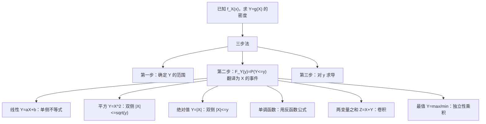

# 随机变量函数的分布：所有类型全解

> 📌 已知 $X$ 的概率密度 $f_X(x)$，求 $Y = g(X)$ 的概率密度 $f_Y(y)$。核心套路只有一个：**先求 $Y$ 的分布函数 $F_Y(y)$，再对 $y$ 求导**。本篇把所有常见类型一网打尽。

## 📋 前置知识

- [[概率密度函数 PDF]] — 描述连续随机变量取值的"密度"，$P(a \leq X \leq b) = \int_a^b f(x)\,dx$
- [[分布函数 CDF]] — $F_X(x) = P(X \leq x)$，是 PDF 的积分；PDF 是 CDF 的导数
- [[定积分]] — 计算面积/累积量的工具，本篇大量使用

## 🔑 万能三步法（所有类型通用）

在学任何具体类型之前，先把这三步烙进脑子里。**每一道题都用这三步解决**，不存在例外。

**第一步：确定 $Y$ 的取值范围**

$X$ 有它的范围，$Y = g(X)$ 的范围由 $X$ 的范围推导出来。搞清楚 $y$ 能取哪些值，这决定了你的答案在哪些区间上非零。

**第二步：写出 $F_Y(y) = P(Y \leq y)$，翻译成关于 $X$ 的不等式，然后用 $f_X$ 积分**

这一步是核心。把 "$Y \leq y$" 这个条件解开，变成 "$X$ 在某个区间内"，然后对 $f_X(x)$ 积分。

**第三步：对 $y$ 求导，得到 $f_Y(y)$**

$$f_Y(y) = F_Y'(y)$$

就这三步。下面所有类型都是这三步的具体展开。

## 🧠 类型一：线性变换 $Y = aX + b$

### 题型特征

$g(X)$ 是 $X$ 的一次函数，系数 $a \neq 0$，$b$ 是任意常数。

### 例题

设 $X$ 的概率密度为 $f_X(x)$，求 $Y = 2X + 3$ 的概率密度。

### 详细推导

**第一步：** $Y$ 的范围随 $X$ 线性变换，若 $X \in \mathbb{R}$ 则 $Y \in \mathbb{R}$。

**第二步：** 求 $F_Y(y)$：

$$F_Y(y) = P(Y \leq y) = P(2X + 3 \leq y) = P\!\left(X \leq \frac{y-3}{2}\right) = F_X\!\left(\frac{y-3}{2}\right)$$

注意：这里 $a = 2 > 0$，所以不等号方向不变。若 $a < 0$，不等号要翻转！

**第三步：** 对 $y$ 求导，用[[链式法则]]：

$$f_Y(y) = f_X\!\left(\frac{y-3}{2}\right) \cdot \frac{1}{2}$$

### 一般公式

对于 $Y = aX + b$（$a \neq 0$）：

$$\boxed{f_Y(y) = \frac{1}{|a|} f_X\!\left(\frac{y - b}{a}\right)}$$

> ⚠️ **踩坑：$a < 0$ 时有绝对值**
> 很多人忘记分母要取 $|a|$。这是因为当 $a < 0$ 时，$P(aX \leq t)$ 翻转成 $P(X \geq t/a)$，推导下来分母是 $|a|$。记住公式里是 $|a|$ 就永远不会错。

### 快速记忆

线性变换公式：**代入 $\frac{y-b}{a}$，乘以 $\frac{1}{|a|}$**。

## 🧠 类型二：平方变换 $Y = X^2$（或 $Y = X^2 + c$）

### 题型特征

$g(X) = X^2$ 是偶函数，不单调。这是最容易出错的类型，因为翻译那一步要考虑**两侧**。

### 例题（就是你发的那道题）

已知 $f_X(x) = |x|$（$|x| \leq 1$），求 $Y = X^2 + 1$ 的概率密度。

### 详细推导

**第一步：确定 $Y$ 的范围**

$X \in [-1, 1]$，所以 $X^2 \in [0, 1]$，$Y = X^2 + 1 \in [1, 2]$。

**第二步：求 $F_Y(y)$**，$y \in [1, 2]$：

$$F_Y(y) = P(Y \leq y) = P(X^2 + 1 \leq y) = P(X^2 \leq y - 1)$$

因为 $y - 1 \geq 0$，开根号后：

$$= P\!\left(-\sqrt{y-1} \leq X \leq \sqrt{y-1}\right) = \int_{-\sqrt{y-1}}^{\sqrt{y-1}} |x|\,dx$$

$|x|$ 是偶函数，利用对称性：

$$= 2\int_0^{\sqrt{y-1}} x\,dx = 2 \cdot \frac{x^2}{2}\Bigg|_0^{\sqrt{y-1}} = y - 1$$

**第三步：求导**

$$f_Y(y) = \frac{d}{dy}(y-1) = 1, \quad 1 \leq y \leq 2$$

$$\boxed{f_Y(y) = \begin{cases} 1, & 1 \leq y \leq 2 \\ 0, & \text{其他} \end{cases}}$$

### 关键动作：翻译 $X^2 \leq t$

$$X^2 \leq t \iff -\sqrt{t} \leq X \leq \sqrt{t} \quad (t \geq 0)$$

这是平方变换翻译的固定句式，背下来。

> ⚠️ **踩坑：$X$ 只取非负值时要特殊处理**
> 若题目告诉你 $X \geq 0$（如 $X$ 服从指数分布），那 $Y = X^2$ 时 $X$ 是单调的，翻译变成 $X \leq \sqrt{t}$，只有一侧，不能用两侧对称。判断 $X$ 的支撑范围是正半轴还是全轴，这决定了翻译方式。

## 🧠 类型三：指数/对数变换 $Y = e^X$ 或 $Y = \ln X$

### 题型特征

$g(X)$ 是单调函数（严格递增或递减），这类题有更快的公式法，但理解三步法更重要。

### 例题：$Y = e^X$，$X$ 服从标准正态分布 $N(0,1)$

**第一步：** $X \in (-\infty, +\infty)$，$e^X > 0$，所以 $Y \in (0, +\infty)$。

**第二步：** $y > 0$ 时，

$$F_Y(y) = P(e^X \leq y) = P(X \leq \ln y) = F_X(\ln y) = \Phi(\ln y)$$

其中 $\Phi$ 是标准正态的分布函数。

**第三步：** 求导，

$$f_Y(y) = \Phi'(\ln y) \cdot \frac{1}{y} = \varphi(\ln y) \cdot \frac{1}{y}$$

其中 $\varphi(x) = \frac{1}{\sqrt{2\pi}}e^{-x^2/2}$，代入得：

$$\boxed{f_Y(y) = \frac{1}{\sqrt{2\pi}\,y} e^{-\frac{(\ln y)^2}{2}}, \quad y > 0}$$

这正是**对数正态分布**的密度函数。

### 单调函数的快捷公式

若 $y = g(x)$ 在 $X$ 的支撑上**严格单调**，设反函数为 $x = h(y)$，则：

$$\boxed{f_Y(y) = f_X(h(y)) \cdot |h'(y)|}$$

对 $Y = e^X$：$h(y) = \ln y$，$h'(y) = \frac{1}{y}$，代入即得上面的结果。

> 💡 这个公式和线性变换公式是同一套逻辑，只不过推广到了任意单调函数。线性变换是它的特例：$h(y) = \frac{y-b}{a}$，$|h'(y)| = \frac{1}{|a|}$。

> ⚠️ **踩坑：单调性必须在整个支撑上成立**
> 如果 $X$ 的支撑是 $\mathbb{R}$，而 $g(x)$ 在 $(-\infty, 0)$ 递减、在 $(0, +\infty)$ 递增（比如 $g(x) = x^2$），那就不能直接用单调函数公式，必须分区间处理，或老老实实用三步法。

## 🧠 类型四：绝对值变换 $Y = |X|$

### 题型特征

$g(x) = |x|$ 把负半轴折叠到正半轴，是一种"折叠变换"，与平方类似，需要考虑两侧。

### 推导

$Y = |X| \geq 0$，所以只在 $y \geq 0$ 处讨论。

**第二步：**

$$F_Y(y) = P(|X| \leq y) = P(-y \leq X \leq y) = \int_{-y}^{y} f_X(x)\,dx \quad (y \geq 0)$$

**第三步：** 对 $y$ 求导（用[[微积分基本定理]]，注意两端都有 $y$）：

$$f_Y(y) = f_X(y) \cdot 1 - f_X(-y) \cdot (-1) = f_X(y) + f_X(-y), \quad y > 0$$

$$\boxed{f_Y(y) = \begin{cases} f_X(y) + f_X(-y), & y > 0 \\ 0, & y \leq 0 \end{cases}}$$

### 特殊情形：$X$ 关于 $0$ 对称（即 $f_X(-x) = f_X(x)$）

此时 $f_Y(y) = 2f_X(y)$（$y > 0$）。比如 $X \sim N(0,1)$，则 $Y = |X|$ 的密度是 $f_Y(y) = \frac{2}{\sqrt{2\pi}}e^{-y^2/2}$（$y > 0$），即半正态分布。

## 🧠 类型五：最大值/最小值变换 $Y = \max(X_1, X_2, \ldots, X_n)$

### 题型特征

$n$ 个独立同分布随机变量的最大值或最小值，属于**次序统计量**问题。

### 推导：$Y = \max(X_1, \ldots, X_n)$，各 $X_i$ 独立，CDF 为 $F(x)$

$$F_Y(y) = P(Y \leq y) = P(\max_i X_i \leq y) = P(X_1 \leq y, X_2 \leq y, \ldots, X_n \leq y)$$

由独立性：

$$= \prod_{i=1}^n P(X_i \leq y) = [F(y)]^n$$

$$\boxed{f_Y(y) = n[F(y)]^{n-1} f(y)}$$

### 推导：$Z = \min(X_1, \ldots, X_n)$

$$F_Z(y) = P(\min_i X_i \leq y) = 1 - P(\min_i X_i > y) = 1 - [1 - F(y)]^n$$

$$\boxed{f_Z(y) = n[1-F(y)]^{n-1} f(y)}$$

> 💡 **记忆技巧**：最大值用 $F^n$ 求导，最小值用 $1-(1-F)^n$ 求导。最大值要"全部都不超过"，最小值要"全部都超过"取余。

## 🧠 类型六：两个随机变量之和 $Z = X + Y$（卷积公式）

### 题型特征

两个独立随机变量之和的密度，用**卷积公式**。

### 公式

设 $X$、$Y$ 独立，密度分别为 $f_X$、$f_Y$，则 $Z = X + Y$ 的密度：

$$\boxed{f_Z(z) = \int_{-\infty}^{+\infty} f_X(z - y) f_Y(y)\,dy = \int_{-\infty}^{+\infty} f_X(x) f_Y(z - x)\,dx}$$

### 推导思路

$$F_Z(z) = P(X + Y \leq z) = \iint_{x+y \leq z} f_X(x)f_Y(y)\,dx\,dy$$

固定 $x$，$y$ 的积分上限是 $z - x$，先对 $y$ 积分：

$$= \int_{-\infty}^{+\infty} f_X(x) \left[\int_{-\infty}^{z-x} f_Y(y)\,dy\right] dx = \int_{-\infty}^{+\infty} f_X(x) F_Y(z-x)\,dx$$

对 $z$ 求导：

$$f_Z(z) = \int_{-\infty}^{+\infty} f_X(x) f_Y(z-x)\,dx$$

### 常见结论（要记住）

| $X$ 的分布 | $Y$ 的分布 | $Z = X+Y$ 的分布 |
|---|---|---|
| $N(\mu_1, \sigma_1^2)$ | $N(\mu_2, \sigma_2^2)$ | $N(\mu_1+\mu_2,\, \sigma_1^2+\sigma_2^2)$ |
| $\text{Poisson}(\lambda_1)$ | $\text{Poisson}(\lambda_2)$ | $\text{Poisson}(\lambda_1+\lambda_2)$ |
| $\Gamma(\alpha_1, \beta)$ | $\Gamma(\alpha_2, \beta)$ | $\Gamma(\alpha_1+\alpha_2, \beta)$ |
| $\chi^2(m)$ | $\chi^2(n)$ | $\chi^2(m+n)$ |

> ⚠️ **踩坑：卷积的积分范围要看实际支撑**
> $f_X(z-y)$ 在 $z-y$ 落在 $X$ 的支撑之外时为零。实际计算时积分范围要根据 $f_X$ 和 $f_Y$ 非零的区间联立确定，不能机械地从 $-\infty$ 积到 $+\infty$。

## 🧠 类型七：商变换 $Z = X/Y$ 与积变换 $Z = XY$

### $Z = X/Y$

$$f_Z(z) = \int_{-\infty}^{+\infty} |y| f_X(zy) f_Y(y)\,dy$$

**推导思路**：固定 $Y = y$，$Z \leq z \Leftrightarrow X \leq zy$（$y > 0$）或 $X \geq zy$（$y < 0$），对两种情形分别写 CDF 后合并求导，得上式。

### $Z = XY$

$$f_Z(z) = \int_{-\infty}^{+\infty} \frac{1}{|x|} f_X(x) f_Y\!\left(\frac{z}{x}\right) dx$$

> 💡 这两个公式记忆困难时，不要强记。考场上老老实实用**三步法**推，步骤不会出错。

## 🔄 所有类型横向对比

| 类型                    | 核心翻译动作                               | 难度  | 注意事项                   |
| --------------------- | ------------------------------------ | --- | ---------------------- |
| $Y = aX + b$          | $X \leq \frac{y-b}{a}$（注意 $a<0$ 时翻转） | ⭐   | 分母取 $\lvert a \rvert$  |
| $Y = X^2$             | $-\sqrt{y} \leq X \leq \sqrt{y}$     | ⭐⭐  | 要考虑两侧；$X\geq0$ 则只一侧    |
| $Y = e^X$（单调）         | $X \leq \ln y$，用单调公式                 | ⭐⭐  | 反函数存在才能用公式             |
| $Y = \lvert X \rvert$ | $-y \leq X \leq y$                   | ⭐⭐  | 结果是 $f_X(y)+f_X(-y)$   |
| $Y = \max(X_i)$       | $\prod P(X_i \leq y)$                | ⭐⭐  | 需要独立性                  |
| $Z = X+Y$             | 卷积，固定一个变量积分                          | ⭐⭐⭐ | 积分范围要看支撑               |
| $Z = X/Y$             | 固定 $Y$ 后分类讨论                         | ⭐⭐⭐ | 含 $\lvert y \rvert$ 因子 |
|                       |                                      |     |                        |

## ⚠️ 高频错误汇总

> ❌ **误区 1：直接对 $f_X$ 做代换，不走 CDF 那一步**
> 很多人看到 $Y = 2X$ 就写 $f_Y(y) = f_X(2y)$，忘了乘 $\frac{1}{|a|}$。一定要从三步法推，或者确保公式记准了。

> ❌ **误区 2：平方/绝对值变换只考虑正半轴**
> $Y = X^2$ 翻译时，$X^2 \leq y$ 对应 $X \in [-\sqrt{y}, \sqrt{y}]$，要积两侧。如果 $X$ 只取正值才是单侧。

> ⚠️ **踩坑 3：忘记写 $Y$ 的范围导致密度在错误区间非零**
> 每道题第一步就要确定 $y$ 的范围。密度在范围之外必须写 $0$，这是完整答案的一部分，不写要扣分。

> ⚠️ **踩坑 4：卷积积分范围没有根据支撑收紧**
> $f_X$ 和 $f_Y$ 都有支撑（非零区间），卷积时实际积分上下限要联立两个非零条件确定，机械地写 $(-\infty, +\infty)$ 会算错。

> ❌ **误区 5：单调函数公式用在了非单调函数上**
> $g(x) = x^2$ 在 $\mathbb{R}$ 上不单调，不能用单调公式 $f_X(h(y))|h'(y)|$。必须用三步法。

## 🏋️ 动手练习

### 练习 1：线性变换（⭐）

**题目**：设 $X \sim U(0, 1)$（均匀分布），求 $Y = 3X - 1$ 的概率密度 $f_Y(y)$。

**参考答案**：

$X$ 的密度 $f_X(x) = 1$（$0 < x < 1$），其余为 $0$。

$Y = 3X - 1$，$a = 3$，$b = -1$。$X \in (0,1)$ 时 $Y \in (-1, 2)$。

用公式 $f_Y(y) = \frac{1}{|a|} f_X\!\left(\frac{y-b}{a}\right) = \frac{1}{3} f_X\!\left(\frac{y+1}{3}\right)$。

$f_X\!\left(\frac{y+1}{3}\right) = 1$ 当且仅当 $0 < \frac{y+1}{3} < 1$，即 $-1 < y < 2$。

$$f_Y(y) = \begin{cases} \dfrac{1}{3}, & -1 < y < 2 \\ 0, & \text{其他} \end{cases}$$

### 练习 2：平方变换（⭐⭐）

**题目**：设 $X \sim U(-1, 1)$，求 $Y = X^2$ 的概率密度 $f_Y(y)$。

**参考答案**：

$f_X(x) = \frac{1}{2}$（$-1 < x < 1$）。$X^2 \in [0, 1)$，所以 $Y \in [0, 1)$。

对 $0 < y < 1$：

$$F_Y(y) = P(X^2 \leq y) = P(-\sqrt{y} \leq X \leq \sqrt{y}) = \int_{-\sqrt{y}}^{\sqrt{y}} \frac{1}{2}\,dx = \sqrt{y}$$

$$f_Y(y) = F_Y'(y) = \frac{1}{2\sqrt{y}}$$

$$f_Y(y) = \begin{cases} \dfrac{1}{2\sqrt{y}}, & 0 < y < 1 \\ 0, & \text{其他} \end{cases}$$

注意 $y = 0$ 处密度趋于无穷，但这不影响概率计算（单点无贡献）。

### 练习 3：指数变换（⭐⭐）

**题目**：设 $X \sim \text{Exp}(\lambda)$（指数分布），即 $f_X(x) = \lambda e^{-\lambda x}$（$x > 0$），求 $Y = \sqrt{X}$ 的概率密度。

**参考答案**：

$X > 0$，$Y = \sqrt{X} > 0$，所以 $Y \in (0, +\infty)$。

$g(x) = \sqrt{x}$ 在 $(0, +\infty)$ 上严格递增，反函数 $h(y) = y^2$，$h'(y) = 2y$。

用单调函数公式：

$$f_Y(y) = f_X(h(y)) \cdot |h'(y)| = \lambda e^{-\lambda y^2} \cdot 2y = 2\lambda y e^{-\lambda y^2}, \quad y > 0$$

$$f_Y(y) = \begin{cases} 2\lambda y\, e^{-\lambda y^2}, & y > 0 \\ 0, & \text{其他} \end{cases}$$

（这是 Weibull 分布的一种特例。）

### 练习 4：绝对值变换（⭐⭐）

**题目**：设 $X$ 的密度为 $f_X(x) = \frac{1}{2}e^{-|x|}$（$x \in \mathbb{R}$），求 $Y = |X|$ 的密度。

**参考答案**：

用公式 $f_Y(y) = f_X(y) + f_X(-y)$（$y > 0$）：

$$f_Y(y) = \frac{1}{2}e^{-|y|} + \frac{1}{2}e^{-|-y|} = \frac{1}{2}e^{-y} + \frac{1}{2}e^{-y} = e^{-y}, \quad y > 0$$

$$f_Y(y) = \begin{cases} e^{-y}, & y > 0 \\ 0, & \text{其他} \end{cases}$$

即 $Y \sim \text{Exp}(1)$。

## 📝 总结

### 本篇要点回顾

1. **三步法是核心**：确定范围 → 写 $F_Y(y)$ 并翻译成关于 $X$ 的事件 → 求导得 $f_Y(y)$。所有类型都是这三步。

2. **翻译那一步决定成败**：线性→单侧不等式；平方/绝对值→双侧不等式；单调函数→直接用反函数。

3. **单调函数有快捷公式**：$f_Y(y) = f_X(h(y))|h'(y)|$，但使用前必须确认单调性。

4. **始终明确 $Y$ 的范围**：密度在范围外为零，这是答案的一部分，不能省略。

5. **卷积用于独立变量之和**：积分范围要根据支撑联立确定。

### 知识图谱

## 🔗 相关链接

- 上级概念：[[随机变量与概率分布]]
- 同级概念：[[连续型随机变量的分布]]、[[常见概率分布总结]]
- 下级概念：[[正态分布变换]]、[[次序统计量]]、[[卷积公式详解]]
- 应用：[[数理统计中的抽样分布]]

## 📚 参考资料

- 浙大版《概率论与数理统计》第四版 — 第三章随机变量的函数分布
- 陈希孺《概率论与数理统计》— 对分布变换有更深入的理论阐述
