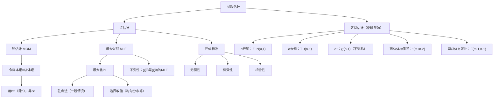

# 数理统计第七章：参数估计

> 📌 参数估计是统计推断的第一类问题：已知总体的分布形式，但参数未知，用**样本数据**来"猜测"参数的值。分为**点估计**（给一个具体数值）和**区间估计**（给一个置信区间）。

---

## 📋 前置知识

- [[数理统计第六章：样本与抽样分布]] — 三大抽样分布和正态总体定理是区间估计的直接工具
- [[概率论第四章：随机变量的数字特征]] — 矩估计用样本矩替换总体矩
- [[微积分求极值]] — 最大似然估计需要对似然函数求导取极值

---

## 🤔 为什么要区分点估计和区间估计？

> 🎯 **类比**：你问朋友"下午几点到？"
> - 朋友说"3点"——这是**点估计**，给了一个确切值，但完全不知道准不准。
> - 朋友说"3点到4点之间，90%的把握"——这是**区间估计**，给了一个范围和置信程度。
>
> 实际决策中，区间估计更有用：它告诉你估计的**可靠程度**，让你知道这个猜测有多大误差余地。

---

## 🧠 核心概念

### 一、点估计

#### 1.1 点估计的概念

**点估计（Point Estimation）**：用统计量 $\hat{\theta} = g(X_1, \ldots, X_n)$ 来估计未知参数 $\theta$。

$\hat{\theta}$ 称为**估计量**（随机变量），代入观测值后得到**估计值**（具体数值）。

> ⚠️ **统计量不含未知参数**。$\hat{\theta}$ 只能由样本计算，不能含 $\theta$ 本身。

---

#### 1.2 矩估计法（MOM）

**核心思想**：用**样本矩**替换**总体矩**，建立方程组，解出参数。

> 🎯 **类比**：总体矩是"理论平均"，样本矩是"实测平均"。大数定律保证样本矩依概率收敛于总体矩，所以用样本矩代替总体矩是合理的近似。

**步骤**：

1. 用参数 $\theta_1, \ldots, \theta_k$ 表达总体的前 $k$ 阶矩：$\mu_l = E(X^l) = h_l(\theta_1,\ldots,\theta_k)$

2. 令总体矩 = 样本矩：

$$h_l(\theta_1,\ldots,\theta_k) = A_l = \frac{1}{n}\sum_{i=1}^n X_i^l, \quad l = 1,2,\ldots,k$$

3. 解方程组，得估计量 $\hat{\theta}_1, \ldots, \hat{\theta}_k$。

**常用做法**：

- 一个参数：令 $E(X) = \bar{X}$，解出 $\theta$
- 两个参数：令 $E(X) = \bar{X}$，$D(X) = B_2 = \frac{1}{n}\sum(X_i-\bar{X})^2$，联立求解

> ⚠️ **矩估计用 $B_2$（除以 $n$），不是 $S^2$（除以 $n-1$）**。$B_2$ 是样本二阶中心矩，$S^2$ 是无偏样本方差，两者不同。

---

#### 1.3 最大似然估计法（MLE）

**核心思想**：选使"观测到当前样本概率最大"的参数值作为估计。

> 🎯 **类比**：你在街上遇到一个高个子（样本），猜他是篮球运动员还是普通人？因为"篮球运动员中遇到高个子"的概率更大，所以猜篮球运动员——这就是最大似然的逻辑。

**似然函数**：

- 离散型：$L(\theta) = \prod_{i=1}^n P(X = x_i;\theta)$
- 连续型：$L(\theta) = \prod_{i=1}^n f(x_i;\theta)$

**对数似然**（取对数积变和，更易求导）：

$$\ln L(\theta) = \sum_{i=1}^n \ln f(x_i;\theta)$$

**求解步骤**：

1. 写出 $\ln L(\theta)$
2. 对 $\theta$ 求导，令 $\frac{d\ln L}{d\theta} = 0$（**似然方程**）
3. 解出 $\hat{\theta}$

多参数时对各参数分别求偏导，联立求解。

**MLE 的不变性**：若 $\hat{\theta}$ 是 $\theta$ 的 MLE，则 $g(\hat{\theta})$ 是 $g(\theta)$ 的 MLE。

> ⚠️ **当 MLE 在边界取得时**：若似然函数在参数域内单调（无内部极值），则 MLE 在边界取得，**不能**用导数为零的方程，要分析单调性。典型例子：$U(0,\theta)$ 的 MLE 是 $X_{(n)} = \max X_i$。

---

#### 1.4 估计量的评价标准

**① 无偏性（Unbiasedness）**

$$E(\hat{\theta}) = \theta \Leftrightarrow \hat{\theta} \text{ 是 } \theta \text{ 的无偏估计}$$

常见结论：

- $\bar{X}$ 是 $\mu$ 的无偏估计 ✓
- $S^2 = \frac{1}{n-1}\sum(X_i-\bar{X})^2$ 是 $\sigma^2$ 的无偏估计 ✓
- $\hat{\sigma}^2_{MLE} = \frac{1}{n}\sum(X_i-\bar{X})^2$ 是 $\sigma^2$ 的**有偏**估计（偏小）✗

**② 有效性（Efficiency）**

在所有无偏估计量中，方差最小的最有效。

**③ 相合性（Consistency）**

$$\hat{\theta}_n \xrightarrow{P} \theta \Leftrightarrow \hat{\theta}_n \text{ 是 } \theta \text{ 的相合估计（一致估计）}$$

大数定律保证矩估计量一般都是相合的。

---

### 二、区间估计

#### 2.1 基本概念

**置信区间**：由样本确定的随机区间 $(\hat{\theta}_L, \hat{\theta}_U)$，满足

$$P(\hat{\theta}_L < \theta < \hat{\theta}_U) = 1-\alpha$$

$1-\alpha$ 为**置信度（置信水平）**，$\alpha$ 为**显著性水平**。

> ⚠️ **正确理解置信度**：$1-\alpha = 0.95$ 的意思是：反复抽样构造区间，约有 95% 的区间覆盖真实参数 $\theta$。**不是**"$\theta$ 有 95% 的概率在这个区间里"——$\theta$ 是固定常数，没有概率可言。

**构造方法——枢轴量法**：

1. 找**枢轴量** $G = G(X_1,\ldots,X_n;\theta)$：含 $\theta$，分布已知且不含其他未知参数
2. 找分位数 $a, b$ 使 $P(a < G < b) = 1-\alpha$
3. 将 $a < G < b$ 等价变形为 $\hat{\theta}_L < \theta < \hat{\theta}_U$

#### 2.2 单个正态总体的置信区间

设 $X_1,\ldots,X_n \sim N(\mu, \sigma^2)$：

**① $\mu$ 的置信区间（$\sigma^2$ 已知）**

枢轴量 $Z = \dfrac{\bar{X}-\mu}{\sigma/\sqrt{n}} \sim N(0,1)$：

$$\boxed{\left(\bar{X} - z_{\alpha/2}\frac{\sigma}{\sqrt{n}},\ \bar{X} + z_{\alpha/2}\frac{\sigma}{\sqrt{n}}\right)}$$

**② $\mu$ 的置信区间（$\sigma^2$ 未知）**

枢轴量 $T = \dfrac{\bar{X}-\mu}{S/\sqrt{n}} \sim t(n-1)$：

$$\boxed{\left(\bar{X} - t_{\alpha/2}(n-1)\frac{S}{\sqrt{n}},\ \bar{X} + t_{\alpha/2}(n-1)\frac{S}{\sqrt{n}}\right)}$$

> 💡 $\sigma$ 未知时用 $t$ 分布，区间**更宽**（$t_{\alpha/2}(n-1) > z_{\alpha/2}$），体现了多估计 $\sigma$ 带来的不确定性。

**③ $\sigma^2$ 的置信区间（$\mu$ 未知）**

枢轴量 $\chi^2 = \dfrac{(n-1)S^2}{\sigma^2} \sim \chi^2(n-1)$：

$$\boxed{\left(\frac{(n-1)S^2}{\chi^2_{\alpha/2}(n-1)},\ \frac{(n-1)S^2}{\chi^2_{1-\alpha/2}(n-1)}\right)}$$

> ⚠️ **卡方区间不对称**：$\chi^2$ 分布不对称，两端分位数不同，区间不是"中心值 $\pm$ 误差"的形式。且注意：$\chi^2_{\alpha/2} > \chi^2_{1-\alpha/2}$（$\alpha/2 < 1-\alpha/2$），所以左端点（除以大数）$<$ 右端点（除以小数），方向正确。

#### 2.3 两个正态总体的置信区间

设 $X_1,\ldots,X_m \sim N(\mu_1,\sigma_1^2)$，$Y_1,\ldots,Y_n \sim N(\mu_2,\sigma_2^2)$ 独立：

**① $\mu_1-\mu_2$ 的置信区间（$\sigma_1^2=\sigma_2^2$ 未知）**

合并方差：$S_p^2 = \dfrac{(m-1)S_1^2+(n-1)S_2^2}{m+n-2}$

枢轴量 $T = \dfrac{(\bar{X}-\bar{Y})-(\mu_1-\mu_2)}{S_p\sqrt{1/m+1/n}} \sim t(m+n-2)$：

$$\boxed{\left((\bar{X}-\bar{Y}) \pm t_{\alpha/2}(m+n-2)\cdot S_p\sqrt{\frac{1}{m}+\frac{1}{n}}\right)}$$

**② $\sigma_1^2/\sigma_2^2$ 的置信区间**

枢轴量 $F = \dfrac{S_1^2/\sigma_1^2}{S_2^2/\sigma_2^2} \sim F(m-1,n-1)$：

$$\boxed{\left(\frac{S_1^2}{S_2^2 \cdot F_{\alpha/2}(m-1,n-1)},\ \frac{S_1^2 \cdot F_{\alpha/2}(n-1,m-1)}{S_2^2}\right)}$$

#### 2.4 置信区间速查表

| 参数 | 条件 | 枢轴量分布 | 置信区间形式 |
|------|------|-----------|------------|
| $\mu$ | $\sigma^2$ 已知 | $N(0,1)$ | $\bar{X}\pm z_{\alpha/2}\sigma/\sqrt{n}$ |
| $\mu$ | $\sigma^2$ 未知 | $t(n-1)$ | $\bar{X}\pm t_{\alpha/2}(n-1)S/\sqrt{n}$ |
| $\sigma^2$ | $\mu$ 未知 | $\chi^2(n-1)$ | $\left(\frac{(n-1)S^2}{\chi^2_{\alpha/2}},\frac{(n-1)S^2}{\chi^2_{1-\alpha/2}}\right)$ |
| $\mu_1-\mu_2$ | $\sigma_1^2=\sigma_2^2$ 未知 | $t(m+n-2)$ | $(\bar{X}-\bar{Y})\pm t_{\alpha/2}S_p\sqrt{1/m+1/n}$ |
| $\sigma_1^2/\sigma_2^2$ | $\mu_1,\mu_2$ 未知 | $F(m-1,n-1)$ | 见 2.3 节 |

---

## 💻 典型题型与详细解析

### 【题型一】矩估计——单参数

**例题 1**：设总体 $X$ 的 PDF 为

$$f(x;\theta) = \begin{cases} (\theta+1)x^\theta, & 0 < x < 1 \\ 0, & \text{其他} \end{cases}$$

$\theta > -1$，用矩估计法估计 $\theta$。

**解答**：

$$E(X) = \int_0^1 x(\theta+1)x^\theta\,dx = (\theta+1)\cdot\frac{1}{\theta+2} = \frac{\theta+1}{\theta+2}$$

令 $E(X) = \bar{X}$，解方程：

$$\frac{\theta+1}{\theta+2} = \bar{X} \Rightarrow \theta(1-\bar{X}) = 2\bar{X}-1$$

$$\boxed{\hat{\theta} = \frac{2\bar{X}-1}{1-\bar{X}}}$$

---

### 【题型二】矩估计——双参数

**例题 2**：设总体 $X \sim \Gamma(\alpha, \lambda)$，$E(X) = \alpha/\lambda$，$D(X) = \alpha/\lambda^2$，用矩估计法估计 $\alpha$ 和 $\lambda$。

**解答**：

令 $E(X) = \bar{X}$ 和 $D(X) = B_2$（样本二阶中心矩）：

$$\frac{\alpha}{\lambda} = \bar{X}, \quad \frac{\alpha}{\lambda^2} = B_2$$

两式相除：$\frac{1}{\lambda} = \frac{B_2}{\bar{X}}$，故

$$\boxed{\hat{\lambda} = \frac{\bar{X}}{B_2}, \quad \hat{\alpha} = \frac{\bar{X}^2}{B_2}}$$

---

### 【题型三】MLE——离散型

**例题 3**：设 $X \sim B(m, p)$（$m$ 已知，$p$ 未知），样本 $x_1,\ldots,x_n$，求 $p$ 的 MLE。

**解答**：

$$\ln L(p) = \left(\sum x_i\right)\ln p + \left(mn-\sum x_i\right)\ln(1-p) + C$$

$$\frac{d\ln L}{dp} = \frac{\sum x_i}{p} - \frac{mn-\sum x_i}{1-p} = 0$$

解得：

$$\boxed{\hat{p} = \frac{\sum x_i}{mn} = \frac{\bar{x}}{m}}$$

直觉：成功率 = 成功总次数 / 总试验次数。

---

### 【题型四】MLE——正态分布（双参数）

**例题 4**：设 $X \sim N(\mu, \sigma^2)$，$\mu, \sigma^2$ 均未知，求 MLE。

**解答**：

$$\ln L = -\frac{n}{2}\ln(2\pi) - \frac{n}{2}\ln\sigma^2 - \frac{1}{2\sigma^2}\sum(x_i-\mu)^2$$

对 $\mu$ 求偏导：$\frac{\partial\ln L}{\partial\mu} = \frac{1}{\sigma^2}\sum(x_i-\mu) = 0 \Rightarrow \hat{\mu} = \bar{x}$

对 $\sigma^2$ 求偏导（令 $u=\sigma^2$）：$\frac{\partial\ln L}{\partial u} = -\frac{n}{2u}+\frac{\sum(x_i-\bar{x})^2}{2u^2} = 0$

$$\boxed{\hat{\mu} = \bar{X}, \quad \hat{\sigma}^2 = \frac{1}{n}\sum_{i=1}^n(X_i-\bar{X})^2}$$

> ⚠️ $\hat{\sigma}^2$ 除以 $n$（有偏），无偏估计 $S^2$ 除以 $n-1$，两者不同！

---

### 【题型五】MLE 在边界取得

**例题 5**：设 $X \sim U(0, \theta)$，$\theta > 0$ 未知，样本 $x_1,\ldots,x_n$，求 $\theta$ 的 MLE。

**解答**：

$$L(\theta) = \frac{1}{\theta^n} \cdot \mathbf{1}[\theta \geq x_{(n)}]$$

（其中 $x_{(n)} = \max_i x_i$，所有 $x_i$ 必须在 $(0,\theta)$ 内）

$L(\theta) = 1/\theta^n$ 在 $\theta \geq x_{(n)}$ 上单调递减，故在 $\theta = x_{(n)}$ 处取最大值：

$$\boxed{\hat{\theta} = X_{(n)} = \max(X_1,\ldots,X_n)}$$

**验证无偏性**：$E(X_{(n)}) = \frac{n\theta}{n+1} \neq \theta$，**有偏**。

无偏修正：$\hat{\theta}^* = \frac{n+1}{n}X_{(n)}$。

---

### 【题型六】无偏性与有效性比较

**例题 6**：设 $X_1, X_2, X_3$ i.i.d.，$E(X_i)=\mu$，$D(X_i)=\sigma^2$。三个估计量：

$$\hat{\mu}_1 = \bar{X} = \frac{X_1+X_2+X_3}{3}, \quad \hat{\mu}_2 = \frac{X_1+2X_2+X_3}{4}, \quad \hat{\mu}_3 = \frac{X_1+X_2}{2}$$

（1）哪些是无偏估计？（2）最有效的是哪个？

**解答**：

（1）$E(\hat{\mu}_1) = \mu$ ✓，$E(\hat{\mu}_2) = \frac{1+2+1}{4}\mu = \mu$ ✓，$E(\hat{\mu}_3) = \mu$ ✓，**三者均无偏**。

（2）方差：

$$D(\hat{\mu}_1) = \frac{\sigma^2}{3}, \quad D(\hat{\mu}_2) = \frac{1+4+1}{16}\sigma^2 = \frac{3\sigma^2}{8}, \quad D(\hat{\mu}_3) = \frac{\sigma^2}{2}$$

$\frac{1}{3} < \frac{3}{8} < \frac{1}{2}$，故 $\hat{\mu}_1 = \bar{X}$ **最有效**。

> 💡 等权平均在i.i.d.情形下总是最优的无偏线性估计。

---

### 【题型七】置信区间计算

**例题 7**：正态总体，$n=25$，$\bar{x}=100.12$，$s=0.06$。

（1）$\mu$ 的 95% 置信区间（$t_{0.025}(24) = 2.064$）；  
（2）$\sigma^2$ 的 90% 置信区间（$\chi^2_{0.05}(24)=36.42$，$\chi^2_{0.95}(24)=13.85$）；  
（3）若 $\sigma=0.05$ 已知，重求 $\mu$ 的 95% 置信区间（$z_{0.025}=1.96$），并与（1）比较宽度。

**解答**：

（1）$\bar{x} \pm t_{0.025}(24)\cdot s/\sqrt{n} = 100.12 \pm 2.064 \times 0.06/5 = 100.12 \pm 0.0248$

$$\mathbf{(100.0952,\ 100.1448)}, \quad \text{宽度} = 0.0496$$

（2）$\left(\frac{24\times0.0036}{36.42},\ \frac{24\times0.0036}{13.85}\right) = \left(\frac{0.0864}{36.42},\ \frac{0.0864}{13.85}\right) = \mathbf{(0.00237,\ 0.00624)}$

（3）$100.12 \pm 1.96\times0.05/5 = 100.12 \pm 0.0196$

$$\mathbf{(100.1004,\ 100.1396)}, \quad \text{宽度} = 0.0392$$

$\sigma$ 已知时区间更窄（$0.0392 < 0.0496$），精度更高。

---

### 【题型八】综合——MLE + 不变性 + 置信区间

**例题 8**：$X_1,\ldots,X_n$ i.i.d. $\sim E(\lambda)$，$\lambda>0$ 未知。

（1）求 $\lambda$ 的 MLE；  
（2）验证 MLE 的无偏性；  
（3）利用 $2n\lambda\bar{X}\sim\chi^2(2n)$ 构造 $\lambda$ 的 $1-\alpha$ 置信区间；  
（4）用不变性给出"某天无事故概率" $e^{-\lambda}$ 的 MLE。

**解答**：

（1）$\ln L = n\ln\lambda - \lambda\sum x_i$，$\frac{d\ln L}{d\lambda} = n/\lambda - \sum x_i = 0$：

$$\boxed{\hat{\lambda} = \frac{1}{\bar{X}}}$$

（2）$Y = n\bar{X} \sim \Gamma(n,\lambda)$，$E(1/\bar{X}) = E(n/Y)$：

$$E\left(\frac{1}{\bar{X}}\right) = \frac{n\lambda}{n-1} \neq \lambda \quad \text{（有偏！）}$$

无偏修正：$\hat{\lambda}^* = \dfrac{n-1}{n\bar{X}}$。

（3）以 $2n\lambda\bar{X}\sim\chi^2(2n)$ 为枢轴量：

$$P\left(\chi^2_{1-\alpha/2}(2n) < 2n\lambda\bar{X} < \chi^2_{\alpha/2}(2n)\right) = 1-\alpha$$

变形：

$$\boxed{\lambda \text{ 的置信区间：}\left(\frac{\chi^2_{1-\alpha/2}(2n)}{2n\bar{X}},\ \frac{\chi^2_{\alpha/2}(2n)}{2n\bar{X}}\right)}$$

（4）由 MLE 不变性：$\widehat{e^{-\lambda}} = e^{-\hat{\lambda}} = e^{-1/\bar{X}}$

---

## ⚠️ 常见误区与踩坑点

> ❌ **误区1：MLE 总是通过令导数为零求得**
>
> $U(0,\theta)$ 等分布的 MLE 在边界取得，似然函数单调无内部极值。必须先分析似然函数的形态，不能盲目求导。

> ⚠️ **踩坑2：矩估计用 $B_2$（除以 $n$），无偏估计用 $S^2$（除以 $n-1$）**
>
> 矩估计令样本矩 = 总体矩，样本二阶中心矩分母是 $n$。$S^2$ 的分母是 $n-1$，是为了保证无偏性。两者相差一个因子 $\frac{n}{n-1}$，不可混用。

> ❌ **误区3：置信度的错误解读**
>
> "95%置信区间包含 $\theta$"≠"$\theta$ 有95%概率在此区间"。$\theta$ 是固定常数，无随机性。正确理解：长期使用此方法，95%的构造出的区间会覆盖 $\theta$。

> ⚠️ **踩坑4：卡方置信区间端点顺序**
>
> $\sigma^2$ 的置信区间：分母越大，对应端点越小。$\chi^2_{\alpha/2} > \chi^2_{1-\alpha/2}$（当 $\alpha<0.5$），所以左端点 = $(n-1)S^2/\chi^2_{\alpha/2}$（除以大分位数），右端点 = $(n-1)S^2/\chi^2_{1-\alpha/2}$（除以小分位数）。

> ❌ **误区4：正态MLE的 $\hat{\sigma}^2$ 和无偏估计 $S^2$ 混淆**
>
> $\hat{\sigma}^2_{MLE} = \frac{1}{n}\sum(X_i-\bar{X})^2$（有偏，MLE结果）；$S^2 = \frac{1}{n-1}\sum(X_i-\bar{X})^2$（无偏）。题目问MLE就用前者，问无偏估计就用后者。

> ⚠️ **踩坑5：MLE不变性≠无偏性保持**
>
> $\hat{\theta}$ 是 $\theta$ 的MLE且无偏，不代表 $g(\hat{\theta})$ 是 $g(\theta)$ 的无偏估计。MLE不变性只保证最大似然性质，不保证无偏性传递（例如 $\bar{X}$ 是 $\mu$ 的无偏MLE，但 $\bar{X}^2$ 不是 $\mu^2$ 的无偏估计）。

---

## 🔄 矩估计 vs 最大似然估计

| | 矩估计（MOM） | 最大似然估计（MLE） |
|---|---|---|
| **核心思想** | 样本矩 = 总体矩 | 最大化观测到当前样本的概率 |
| **需要知道** | 总体矩的表达式 | 总体的完整分布形式 |
| **计算难度** | 一般较简单 | 有时需解复杂方程 |
| **统计性质** | 相合，不一定无偏 | 相合，渐近有效，具有不变性 |
| **适用场景** | 分布形式不完全已知 | 分布形式完全已知 |

---

## 🏋️ 动手练习

### 练习 1：矩估计与 MLE 对比（⭐⭐）

**题目**：设总体 PDF 为 $f(x;\theta) = \theta x^{\theta-1}$（$0<x<1$，$\theta>0$）。

（1）矩估计 $\hat{\theta}_{MOM}$；（2）MLE $\hat{\theta}_{MLE}$；（3）两者是否相同？

**参考答案**：

（1）$E(X) = \theta/(\theta+1)$，令 $= \bar{X}$：$\hat{\theta}_{MOM} = \bar{X}/(1-\bar{X})$

（2）$\ln L = n\ln\theta + (\theta-1)\sum\ln x_i$，$d\ln L/d\theta = n/\theta + \sum\ln x_i = 0$：$\hat{\theta}_{MLE} = -1/\overline{\ln X}$（$\overline{\ln X} = \frac{1}{n}\sum\ln x_i$）

（3）一般**不同**（泊松分布是特例，两者相同）。

---

### 练习 2：无偏性与有效性（⭐⭐）

**题目**：$X\sim U(0,\theta)$，样本 $X_1,\ldots,X_n$。

（1）验证 $2\bar{X}$ 是 $\theta$ 的无偏估计；  
（2）验证 $\frac{n+1}{n}X_{(n)}$ 是 $\theta$ 的无偏估计；  
（3）比较两者方差，哪个更有效？（$D(X_{(n)}) = \frac{n\theta^2}{(n+1)^2(n+2)}$）

**参考答案**：

（1）$E(\bar{X}) = \theta/2$，$E(2\bar{X}) = \theta$ ✓

（2）$E(X_{(n)}) = n\theta/(n+1)$，$E\left(\frac{n+1}{n}X_{(n)}\right) = \theta$ ✓

（3）$D(2\bar{X}) = 4\cdot\frac{\theta^2/12}{n} = \frac{\theta^2}{3n}$

$D\left(\frac{n+1}{n}X_{(n)}\right) = \frac{(n+1)^2}{n^2}\cdot\frac{n\theta^2}{(n+1)^2(n+2)} = \frac{\theta^2}{n(n+2)}$

因 $n+2>3$（$n\geq2$），$\frac{1}{n(n+2)} < \frac{1}{3n}$，故 $\frac{n+1}{n}X_{(n)}$ **更有效**。

---

### 练习 3：置信区间（⭐⭐）

**题目**：正态总体，$n=16$，$\bar{x}=1500$，$s=15$。

（1）$\mu$ 的 95% 置信区间（$t_{0.025}(15)=2.131$）；  
（2）$\sigma^2$ 的 95% 置信区间（$\chi^2_{0.025}(15)=27.488$，$\chi^2_{0.975}(15)=6.262$）；  
（3）若要 $\mu$ 的 95% CI 半宽 $\leq 5$，$\sigma=15$ 已知，至少需要多少样本（$z_{0.025}=1.96$）？

**参考答案**：

（1）$1500\pm 2.131\times15/4 = 1500\pm7.99 = \mathbf{(1492.01,\ 1507.99)}$

（2）$\left(\frac{15\times225}{27.488},\frac{15\times225}{6.262}\right) = \mathbf{(122.8,\ 539.0)}$

（3）$1.96\times15/\sqrt{n}\leq5 \Rightarrow \sqrt{n}\geq5.88 \Rightarrow n\geq34.57$，至少 **35** 个。

---

### 练习 4：综合——泊松分布全流程（⭐⭐⭐）

**题目**：交通事故次数 $X\sim P(\lambda)$，记录 $n=30$ 天，$\sum x_i = 90$。

（1）$\lambda$ 的 MLE；（2）"某天0次事故"概率 $e^{-\lambda}$ 的 MLE；（3）$\lambda$ 的矩估计，与MLE是否相同？（4）近似 95% CI（用 $\bar{X}\approx N(\lambda,\lambda/n)$，$z_{0.025}=1.96$，以 $\hat{\lambda}$ 代替方差中的 $\lambda$）。

**参考答案**：

（1）$\hat{\lambda} = \bar{x} = 90/30 = \mathbf{3}$

（2）$\widehat{e^{-\lambda}} = e^{-3} \approx 0.0498$

（3）矩估计：$E(X)=\lambda=\bar{X}$，$\hat{\lambda}_{MOM}=3$，与 MLE **相同**（泊松分布特性）。

（4）$\text{SE} = \sqrt{\hat{\lambda}/n} = \sqrt{3/30} = \sqrt{0.1}\approx0.316$

$\lambda$ 的近似 95% CI：$(3\pm1.96\times0.316) = (3\pm0.619) = \mathbf{(2.38,\ 3.62)}$

---

## 📝 总结

### 本篇要点回顾

1. **矩估计**：令样本矩=总体矩。一参数令 $E(X)=\bar{X}$，二参数加上 $D(X)=B_2$。简单直观，用 $B_2$（除以 $n$）不是 $S^2$。

2. **MLE**：最大化 $\ln L=\sum\ln f(x_i;\theta)$，令偏导为零求解。边界取值情形（如均匀分布）分析单调性。具有不变性。

3. **评价标准**：无偏性（$E(\hat\theta)=\theta$）、有效性（同无偏中方差最小）、相合性（依概率收敛）。$\bar{X}$ 和 $S^2$（除以 $n-1$）是最常用的无偏估计；正态MLE的 $\hat\sigma^2$ 除以 $n$，有偏。

4. **置信区间**：枢轴量法。$\sigma$ 已知用 $z$，$\sigma$ 未知用 $t(n-1)$，方差用 $\chi^2(n-1)$，两总体均值差用 $t(m+n-2)$，方差比用 $F(m-1,n-1)$。

5. **置信度理解**：$1-\alpha$ 是长期频率意义下的覆盖率，不是参数落在区间内的概率。

### 知识图谱

---

## 🔗 相关链接

- 上级概念：[[数理统计第六章：样本与抽样分布]]
- 下级概念：[[第八章 假设检验]]
- 同级延伸：[[回归分析中的参数估计]]
- 实际应用：[[最大似然估计在机器学习中的应用]]

## 📚 参考资料

- 浙大版《概率论与数理统计》第四版 第七章 — 置信区间推导完整
- 张宇《概率论 9 讲》第七讲 — MLE 边界取值的处理技巧
- 李永乐《数学复习全书》— 历年真题点估计与区间估计解析
