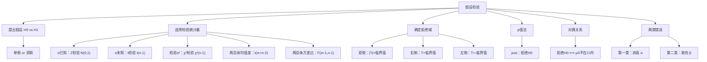

> 📌 假设检验是统计推断的第二类问题：不是估计参数的值，而是对参数的某个命题（假设）作出"接受"或"拒绝"的判断。它是医学临床试验、质量控制、科学实验的核心统计工具。

---

## 📋 前置知识

- [[数理统计第七章：参数估计]] — 置信区间与假设检验有内在对偶关系，枢轴量完全相同
- [[数理统计第六章：样本与抽样分布]] — 三大抽样分布是检验统计量的基础
- [[概率论第二章：随机变量及其分布]] — 正态、卡方、$t$、$F$ 分布的分位数查表

---

## 🤔 为什么需要假设检验？

> 🎯 **类比**：法庭审判。假定被告无罪（零假设 $H_0$），检察官提供证据（样本数据），若证据足以强烈反驳"无罪"假设，才宣判有罪（拒绝 $H_0$）；若证据不足，维持无罪推定（不拒绝 $H_0$）。
>
> 关键：**不是证明被告无罪，而是证据是否足以推翻无罪假定**。假设检验的逻辑完全一样。

区间估计回答"参数大概是多少"，假设检验回答"参数是否等于某个特定值"或"两组数据是否有显著差异"。

---

## 🧠 核心概念

### 一、基本框架

#### 1.1 假设的提出

**原假设（零假设）$H_0$**：默认成立的假设，通常是"无差异"、"等于某值"、"无效果"。

**备择假设（对立假设）$H_1$**：想要验证的假设，通常是"有差异"、"不等于某值"、"有效果"。

**假设的形式**（$\theta$ 为参数，$\theta_0$ 为假设值）：

| 类型 | $H_0$ | $H_1$ | 拒绝域方向 |
|------|-------|-------|-----------|
| 双侧检验 | $\theta = \theta_0$ | $\theta \neq \theta_0$ | 两侧 |
| 左侧检验 | $\theta \geq \theta_0$ | $\theta < \theta_0$ | 左侧 |
| 右侧检验 | $\theta \leq \theta_0$ | $\theta > \theta_0$ | 右侧 |

> 🎯 **如何判断单双侧**：备择假设 $H_1$ 用了"$\neq$"是双侧，用了"$>$"是右侧，用了"$<$"是左侧。**实际问题中，$H_1$ 通常反映我们想要证明的结论**（研究者的主张）。

#### 1.2 两类错误

| | 实际上 $H_0$ 为真 | 实际上 $H_0$ 为假 |
|---|---|---|
| **拒绝 $H_0$** | **第一类错误（弃真）** $\alpha$ | 正确（检验功效 $1-\beta$） |
| **不拒绝 $H_0$** | 正确（置信度 $1-\alpha$） | **第二类错误（取伪）** $\beta$ |

**第一类错误概率** $\alpha$（显著性水平）= $P(\text{拒绝}H_0 \mid H_0\text{为真})$

**第二类错误概率** $\beta$ = $P(\text{不拒绝}H_0 \mid H_0\text{为假})$

> ⚠️ **两类错误的权衡**：在样本量固定时，减小 $\alpha$ 会增大 $\beta$，反之亦然。只有增大样本量才能同时减小两者。考研中一般只控制 $\alpha$（显著性水平），不计算 $\beta$。

**显著性检验**：只控制第一类错误概率不超过 $\alpha$ 的检验方法。

#### 1.3 检验统计量与拒绝域

**检验统计量（Test Statistic）**：基于样本构造的、用于作出判断的统计量 $T = g(X_1,\ldots,X_n)$。

**拒绝域（Rejection Region / Critical Region）** $W$：使得拒绝 $H_0$ 的样本观测值的集合。

**检验的步骤**：

1. 提出 $H_0$ 和 $H_1$
2. 选取检验统计量，在 $H_0$ 为真时确定其分布
3. 给定显著性水平 $\alpha$，查分位数确定拒绝域 $W$
4. 计算检验统计量的观测值 $t_0$
5. 若 $t_0 \in W$，拒绝 $H_0$；否则不拒绝 $H_0$

**拒绝域的形式**：

- 双侧：$|T| > c$（$c = t_{\alpha/2}$ 或 $z_{\alpha/2}$）
- 右侧：$T > c$（$c = t_\alpha$ 或 $z_\alpha$）
- 左侧：$T < -c$（$c = t_\alpha$ 或 $z_\alpha$）

> 💡 **假设检验与置信区间的对偶关系**：$H_0: \theta=\theta_0$ 在显著性水平 $\alpha$ 下被拒绝 $\Leftrightarrow$ $\theta_0$ 不在参数 $\theta$ 的置信水平 $1-\alpha$ 的置信区间内。两者用的枢轴量完全相同，只是结论的表达方式不同。

---

### 二、单个正态总体的假设检验

#### 2.1 均值 $\mu$ 的检验（$\sigma^2$ 已知）——$Z$ 检验

**检验统计量**：

$$Z = \frac{\bar{X} - \mu_0}{\sigma/\sqrt{n}} \overset{H_0}{\sim} N(0,1)$$

**拒绝域**（显著性水平 $\alpha$）：

| $H_1$ | 拒绝域 $W$ |
|--------|-----------|
| $\mu \neq \mu_0$ | $\|Z\| > z_{\alpha/2}$ |
| $\mu > \mu_0$ | $Z > z_\alpha$ |
| $\mu < \mu_0$ | $Z < -z_\alpha$ |

#### 2.2 均值 $\mu$ 的检验（$\sigma^2$ 未知）——$t$ 检验

**检验统计量**：

$$T = \frac{\bar{X} - \mu_0}{S/\sqrt{n}} \overset{H_0}{\sim} t(n-1)$$

**拒绝域**：

| $H_1$ | 拒绝域 $W$ |
|--------|-----------|
| $\mu \neq \mu_0$ | $\|T\| > t_{\alpha/2}(n-1)$ |
| $\mu > \mu_0$ | $T > t_\alpha(n-1)$ |
| $\mu < \mu_0$ | $T < -t_\alpha(n-1)$ |

#### 2.3 方差 $\sigma^2$ 的检验（$\mu$ 未知）——$\chi^2$ 检验

**检验统计量**：

$$\chi^2 = \frac{(n-1)S^2}{\sigma_0^2} \overset{H_0}{\sim} \chi^2(n-1)$$

**拒绝域**：

| $H_1$ | 拒绝域 $W$ |
|--------|-----------|
| $\sigma^2 \neq \sigma_0^2$ | $\chi^2 > \chi^2_{\alpha/2}(n-1)$ 或 $\chi^2 < \chi^2_{1-\alpha/2}(n-1)$ |
| $\sigma^2 > \sigma_0^2$ | $\chi^2 > \chi^2_\alpha(n-1)$ |
| $\sigma^2 < \sigma_0^2$ | $\chi^2 < \chi^2_{1-\alpha}(n-1)$ |

> ⚠️ **卡方双侧检验的拒绝域不对称**：卡方分布不对称，双侧检验的两个临界值 $\chi^2_{\alpha/2}$ 和 $\chi^2_{1-\alpha/2}$ **不关于某中心对称**，要分别查表。

---

### 三、两个正态总体的假设检验

#### 3.1 均值差 $\mu_1 - \mu_2$ 的检验（$\sigma_1^2 = \sigma_2^2 = \sigma^2$ 未知）——两样本 $t$ 检验

**检验统计量**（合并方差 $S_p^2 = \frac{(m-1)S_1^2+(n-1)S_2^2}{m+n-2}$）：

$$T = \frac{(\bar{X}-\bar{Y})-\delta_0}{S_p\sqrt{1/m+1/n}} \overset{H_0}{\sim} t(m+n-2)$$

其中 $\delta_0 = \mu_1 - \mu_2$ 在 $H_0$ 下的假设值（最常见的是 $\delta_0 = 0$，即检验 $H_0: \mu_1 = \mu_2$）。

**拒绝域**：形式同单样本 $t$ 检验，自由度为 $m+n-2$。

#### 3.2 方差比 $\sigma_1^2/\sigma_2^2$ 的检验——$F$ 检验

**检验统计量**：

$$F = \frac{S_1^2}{S_2^2} \overset{H_0: \sigma_1^2=\sigma_2^2}{\sim} F(m-1, n-1)$$

**拒绝域**（$H_0: \sigma_1^2 = \sigma_2^2$，$H_1: \sigma_1^2 \neq \sigma_2^2$）：

$$W: F > F_{\alpha/2}(m-1, n-1) \text{ 或 } F < F_{1-\alpha/2}(m-1,n-1)$$

利用 $F_{1-\alpha/2}(m-1,n-1) = 1/F_{\alpha/2}(n-1,m-1)$ 化简下界。

---

### 四、假设检验汇总表

| 检验类型 | 条件 | 统计量 | $H_0$ 下分布 | 双侧拒绝域 |
|---------|------|--------|-------------|-----------|
| $Z$ 检验 | $\sigma^2$ 已知 | $(\bar{X}-\mu_0)/(\sigma/\sqrt{n})$ | $N(0,1)$ | $\|Z\|>z_{\alpha/2}$ |
| 单样本 $t$ | $\sigma^2$ 未知 | $(\bar{X}-\mu_0)/(S/\sqrt{n})$ | $t(n-1)$ | $\|T\|>t_{\alpha/2}(n-1)$ |
| $\chi^2$ 检验 | $\mu$ 未知 | $(n-1)S^2/\sigma_0^2$ | $\chi^2(n-1)$ | 两侧分别查 |
| 两样本 $t$ | $\sigma_1^2=\sigma_2^2$ 未知 | $(\bar{X}-\bar{Y})/(S_p\sqrt{1/m+1/n})$ | $t(m+n-2)$ | $\|T\|>t_{\alpha/2}(m+n-2)$ |
| $F$ 检验 | $\mu_1,\mu_2$ 未知 | $S_1^2/S_2^2$ | $F(m-1,n-1)$ | 两侧分别查 |

---

### 五、$p$ 值检验法

**$p$ 值（$p$-value）**：在 $H_0$ 为真的条件下，观测到"比当前更极端结果"的概率。

$$p\text{-value} = P(\text{检验统计量} \geq t_0 \mid H_0\text{为真})$$（右侧检验）

**判断规则**：

$$p\text{-value} \leq \alpha \Rightarrow \text{拒绝 } H_0$$

$$p\text{-value} > \alpha \Rightarrow \text{不拒绝 } H_0$$

> 🎯 **$p$ 值的直觉**：$p$ 值越小，说明在 $H_0$ 为真时观测到当前数据的概率越小，即当前数据与 $H_0$ 的矛盾越强烈。$p < 0.05$ 通常认为"有统计显著性"。

**各检验的 $p$ 值计算**：

- 双侧：$p = 2P(T > |t_0|)$（利用对称性）
- 右侧：$p = P(T > t_0)$
- 左侧：$p = P(T < t_0)$

---

## 💻 典型题型与详细解析

### 【题型一】单样本 $Z$ 检验（$\sigma$ 已知）

**例题 1**：某厂生产灯泡，已知寿命服从正态分布，历史标准差 $\sigma = 100$ 小时。随机抽取 25 只，均值 $\bar{x} = 1950$ 小时。在 $\alpha = 0.05$ 下，检验均值是否等于 2000 小时（$H_0: \mu = 2000$，$H_1: \mu \neq 2000$）。

（$z_{0.025} = 1.96$）

**解答**：

**第一步**：$H_0: \mu = 2000$，$H_1: \mu \neq 2000$，双侧检验。

**第二步**：检验统计量（$\sigma = 100$ 已知）：

$$Z = \frac{\bar{X} - \mu_0}{\sigma/\sqrt{n}} = \frac{1950 - 2000}{100/\sqrt{25}} = \frac{-50}{20} = -2.5$$

**第三步**：拒绝域：$|Z| > z_{0.025} = 1.96$。

**第四步**：$|Z| = 2.5 > 1.96$，落入拒绝域。

**结论**：在显著性水平 $\alpha = 0.05$ 下，**拒绝 $H_0$**，认为该批灯泡均值寿命与 2000 小时有显著差异。

**$p$ 值**：$p = 2P(Z > 2.5) = 2(1-\Phi(2.5)) = 2 \times 0.0062 = 0.0124 < 0.05$，与上述结论一致。

---

### 【题型二】单样本 $t$ 检验（$\sigma$ 未知）

**例题 2**：某饮料机每杯饮料容量服从正态分布，随机抽取 16 杯，$\bar{x} = 242$ mL，$s = 10$ mL。在 $\alpha = 0.05$ 下，检验均值是否等于 240 mL（$H_0: \mu = 240$，$H_1: \mu \neq 240$）。

（$t_{0.025}(15) = 2.131$）

**解答**：

检验统计量（$\sigma$ 未知，用 $s$）：

$$T = \frac{\bar{x} - \mu_0}{s/\sqrt{n}} = \frac{242 - 240}{10/\sqrt{16}} = \frac{2}{2.5} = 0.8$$

拒绝域：$|T| > t_{0.025}(15) = 2.131$。

$|T| = 0.8 < 2.131$，**不落入拒绝域**。

**结论**：在 $\alpha = 0.05$ 下，**不拒绝 $H_0$**，没有充分证据认为均值不等于 240 mL。

> 💡 "不拒绝 $H_0$"≠"$H_0$ 正确"，只是说证据不足以推翻 $H_0$。这是假设检验逻辑的重要细节。

---

### 【题型三】单侧 $t$ 检验

**例题 3**：某药物声称能提高血红素含量。对 10 名患者用药前后测量：

| 患者 | 1 | 2 | 3 | 4 | 5 | 6 | 7 | 8 | 9 | 10 |
|------|---|---|---|---|---|---|---|---|---|---|
| 用药前 | 10 | 9 | 11 | 8 | 12 | 10 | 9 | 11 | 10 | 9 |
| 用药后 | 11 | 10 | 12 | 9 | 14 | 11 | 11 | 12 | 11 | 10 |

设差值 $D_i = \text{后} - \text{前} \sim N(\mu_D, \sigma_D^2)$，在 $\alpha = 0.05$ 下检验 $H_0: \mu_D \leq 0$，$H_1: \mu_D > 0$（右侧检验）。

（$t_{0.05}(9) = 1.833$）

**解答**（**配对 $t$ 检验**）：

差值 $d_i$：$1, 1, 1, 1, 2, 1, 2, 1, 1, 1$

$$\bar{d} = \frac{1+1+1+1+2+1+2+1+1+1}{10} = \frac{12}{10} = 1.2$$

$$s_d^2 = \frac{1}{9}\sum(d_i - \bar{d})^2 = \frac{1}{9}\left[8\times(1-1.2)^2 + 2\times(2-1.2)^2\right] = \frac{1}{9}(8\times0.04 + 2\times0.64) = \frac{0.32+1.28}{9} = \frac{1.6}{9} \approx 0.178$$

$s_d = \sqrt{0.178} \approx 0.422$

检验统计量：

$$T = \frac{\bar{d}}{s_d/\sqrt{n}} = \frac{1.2}{0.422/\sqrt{10}} = \frac{1.2}{0.133} \approx 9.02$$

拒绝域（右侧）：$T > t_{0.05}(9) = 1.833$。

$T = 9.02 \gg 1.833$，**拒绝 $H_0$**。

**结论**：在 $\alpha = 0.05$ 下，有充分证据认为该药物能显著提高血红素含量。

> 💡 **配对 $t$ 检验**（Paired $t$-test）是两样本 $t$ 检验的特殊形式：将配对差值 $D_i = X_i - Y_i$ 视为单样本，对 $\mu_D$ 做单样本 $t$ 检验。配对设计消除了个体差异，检验功效更高。

---

### 【题型四】$\chi^2$ 检验——方差的检验

**例题 4**：某机器加工零件直径的方差历史值为 $\sigma_0^2 = 0.04$（mm²）。检修后抽取 $n = 25$ 个，$s^2 = 0.08$。在 $\alpha = 0.05$ 下，检验方差是否显著增大（$H_0: \sigma^2 \leq 0.04$，$H_1: \sigma^2 > 0.04$）。

（$\chi^2_{0.05}(24) = 36.415$）

**解答**：

右侧检验，检验统计量：

$$\chi^2 = \frac{(n-1)s^2}{\sigma_0^2} = \frac{24 \times 0.08}{0.04} = \frac{1.92}{0.04} = 48$$

拒绝域（右侧）：$\chi^2 > \chi^2_{0.05}(24) = 36.415$。

$\chi^2 = 48 > 36.415$，**拒绝 $H_0$**。

**结论**：在 $\alpha = 0.05$ 下，有充分证据认为检修后方差显著增大，机器精度有所下降。

---

### 【题型五】两样本 $t$ 检验——均值差

**例题 5**：两种工艺生产的产品强度服从正态分布，方差相同（$\sigma_1^2 = \sigma_2^2$，未知）。

工艺A：$m = 10$，$\bar{x} = 78.5$，$s_1^2 = 9.0$

工艺B：$n = 12$，$\bar{y} = 75.3$，$s_2^2 = 7.2$

在 $\alpha = 0.05$ 下，检验两种工艺的均值是否有显著差异（$H_0: \mu_1 = \mu_2$，$H_1: \mu_1 \neq \mu_2$）。

（$t_{0.025}(20) = 2.086$）

**解答**：

合并方差：

$$S_p^2 = \frac{(m-1)s_1^2 + (n-1)s_2^2}{m+n-2} = \frac{9\times9.0 + 11\times7.2}{20} = \frac{81+79.2}{20} = \frac{160.2}{20} = 8.01$$

$S_p = \sqrt{8.01} \approx 2.83$

检验统计量：

$$T = \frac{\bar{x}-\bar{y}}{S_p\sqrt{1/m+1/n}} = \frac{78.5-75.3}{2.83\sqrt{1/10+1/12}} = \frac{3.2}{2.83\sqrt{0.183}} = \frac{3.2}{2.83\times0.428} = \frac{3.2}{1.211} \approx 2.64$$

拒绝域（双侧）：$|T| > t_{0.025}(20) = 2.086$。

$|T| = 2.64 > 2.086$，**拒绝 $H_0$**。

**结论**：在 $\alpha = 0.05$ 下，两种工艺的产品强度均值有显著差异。

---

### 【题型六】$F$ 检验——方差比

**例题 6**：上题（例题5）中，在做两样本 $t$ 检验之前，应先验证方差齐性假设 $H_0: \sigma_1^2 = \sigma_2^2$。在 $\alpha = 0.10$ 下进行 $F$ 检验。

（$F_{0.05}(9, 11) = 2.90$，$F_{0.05}(11, 9) = 3.10$）

**解答**：

$H_0: \sigma_1^2 = \sigma_2^2$，$H_1: \sigma_1^2 \neq \sigma_2^2$（双侧）。

检验统计量：

$$F = \frac{s_1^2}{s_2^2} = \frac{9.0}{7.2} = 1.25$$

拒绝域（双侧，$\alpha = 0.10$，即每侧 $\alpha/2 = 0.05$）：

$F > F_{0.05}(9, 11) = 2.90$ 或 $F < F_{0.95}(9, 11) = 1/F_{0.05}(11, 9) = 1/3.10 \approx 0.323$

$F = 1.25$，既不大于 $2.90$，也不小于 $0.323$，**不拒绝 $H_0$**。

**结论**：在 $\alpha = 0.10$ 下，没有显著证据认为两总体方差不等，方差齐性假设成立，可以使用两样本 $t$ 检验。

> 💡 **实际检验流程**：进行两样本 $t$ 检验前，应先用 $F$ 检验验证方差齐性，再根据结果选择等方差 $t$ 检验（$S_p$ 合并）或不等方差近似检验（Welch $t$）。考研一般只考等方差情形。

---

### 【题型七】综合——检验与估计的对偶

**例题 7**：设 $X_1,\ldots,X_{16} \sim N(\mu, \sigma^2)$，$\sigma^2$ 未知，测得 $\bar{x} = 21.5$，$s = 2$。

（1）在 $\alpha = 0.05$ 下，检验 $H_0: \mu = 20$（双侧），$t_{0.025}(15) = 2.131$；  
（2）求 $\mu$ 的 95% 置信区间，并说明与（1）的关系；  
（3）若改为单侧检验 $H_0: \mu \leq 20$，$H_1: \mu > 20$，$t_{0.05}(15) = 1.753$，结论如何？  
（4）用 $p$ 值法对（1）作出判断，$\Phi(3) = 0.9987$（$t$ 分布近似用正态）。

**解答**：

（1）$T = \frac{21.5-20}{2/\sqrt{16}} = \frac{1.5}{0.5} = 3.0$

拒绝域：$|T| > 2.131$。$|T| = 3.0 > 2.131$，**拒绝 $H_0$**。

（2）$\mu$ 的 95% 置信区间：$21.5 \pm 2.131 \times 0.5 = 21.5 \pm 1.066 = (20.434, 22.566)$

$\mu_0 = 20$ **不在**置信区间内，与（1）拒绝 $H_0$ 的结论一致。

**对偶关系**：$H_0: \mu = \mu_0$ 被拒绝（$\alpha$水平）$\Leftrightarrow$ $\mu_0$ 不在 $1-\alpha$ 置信区间内。

（3）右侧检验：$T = 3.0 > t_{0.05}(15) = 1.753$，**拒绝 $H_0$**，认为 $\mu > 20$。

单侧检验的拒绝域比双侧更大（$1.753 < 2.131$），对同一方向的偏差更灵敏。

（4）$p$ 值（双侧，用正态近似）：$p = 2P(Z > 3.0) = 2(1-\Phi(3)) = 2\times0.0013 = 0.0026$

$p = 0.0026 < 0.05$，**拒绝 $H_0$**，与（1）结论一致。

---

### 【题型八】综合难题——完整检验流程

**例题 8**：某品牌声称其产品的某项指标均值为 $\mu_0 = 50$，标准差 $\sigma_0 = 5$。质检部门随机抽取 $n = 36$ 件，测得 $\bar{x} = 48.5$，$s = 5.4$。

（1）设 $\sigma$ 已知（= 5），在 $\alpha = 0.05$ 下检验均值（$z_{0.025}=1.96$，$z_{0.05}=1.645$）；  
（2）设 $\sigma$ 未知，在 $\alpha = 0.05$ 下检验均值（$t_{0.025}(35)=2.030$）；  
（3）在 $\alpha = 0.05$ 下检验方差 $\sigma^2$ 是否等于 25（$\chi^2_{0.025}(35)=53.203$，$\chi^2_{0.975}(35)=20.569$）；  
（4）计算（2）中的 $p$ 值（近似用正态，$\Phi(1.67)=0.9525$）。

**解答**：

（1）$\sigma = 5$ 已知，双侧 $Z$ 检验：

$$Z = \frac{48.5-50}{5/6} = \frac{-1.5}{0.833} = -1.80$$

$|Z| = 1.80 < 1.96$，**不拒绝 $H_0$**。

（2）$\sigma$ 未知，双侧 $t$ 检验：

$$T = \frac{48.5-50}{5.4/6} = \frac{-1.5}{0.9} = -1.667$$

$|T| = 1.667 < t_{0.025}(35) = 2.030$，**不拒绝 $H_0$**。

（3）$\chi^2$ 双侧检验，$H_0: \sigma^2 = 25$：

$$\chi^2 = \frac{35 \times 5.4^2}{25} = \frac{35 \times 29.16}{25} = \frac{1020.6}{25} = 40.824$$

拒绝域：$\chi^2 > 53.203$ 或 $\chi^2 < 20.569$。

$\chi^2 = 40.824$，在两者之间，**不拒绝 $H_0$**，方差无显著变化。

（4）$T = -1.667$，双侧 $p$ 值（用正态近似）：

$p = 2P(Z > 1.667) = 2(1-\Phi(1.667)) \approx 2(1-0.9525) = 2\times0.0475 = 0.095$

$p = 0.095 > 0.05$，**不拒绝 $H_0$**，与（2）一致。

---

## ⚠️ 常见误区与踩坑点

> ❌ **误区1："不拒绝 $H_0$" = "接受 $H_0$ 为真"**
>
> 不拒绝只是说"证据不足以推翻 $H_0$"，不代表 $H_0$ 正确。可能是样本量太小，检验功效不足。正确说法是"**没有充分证据拒绝 $H_0$**"，而非"$H_0$ 成立"。

> ⚠️ **踩坑2：单双侧检验的拒绝域选错**
>
> 双侧检验：$|T| > t_{\alpha/2}$（用 $\alpha/2$）；单侧检验：$T > t_\alpha$ 或 $T < -t_\alpha$（用 $\alpha$）。单侧检验的临界值比双侧更小（$t_\alpha < t_{\alpha/2}$），拒绝域更大，对指定方向更灵敏。

> ❌ **误区3：$p$ 值是 $H_0$ 为真的概率**
>
> $p$ 值是"假设 $H_0$ 为真时，观测到当前或更极端结果的概率"，而不是"$H_0$ 为真的概率"。$H_0$ 是固定的命题，没有概率。

> ⚠️ **踩坑4：$\chi^2$ 双侧检验拒绝域有两段**
>
> 卡方检验的双侧拒绝域是：$\chi^2 > \chi^2_{\alpha/2}(n-1)$ **或** $\chi^2 < \chi^2_{1-\alpha/2}(n-1)$，两段。不能只写单侧。

> ❌ **误区5：两样本 $t$ 检验前忘记验证方差齐性**
>
> 标准流程是先用 $F$ 检验（方差比检验）确认 $\sigma_1^2 = \sigma_2^2$，再用合并方差 $S_p^2$ 做 $t$ 检验。若先验知两组方差不等，应使用 Welch $t$ 检验（考研一般不考）。

> ⚠️ **踩坑6：显著性水平 $\alpha$ 与置信度 $1-\alpha$ 的关系**
>
> 假设检验的显著性水平 $\alpha$ = 第一类错误概率；置信区间的置信度 $1-\alpha$。两者用的分位数相同（$z_{\alpha/2}$、$t_{\alpha/2}$），但含义不同。对偶关系：$\alpha$ 水平的检验拒绝 $H_0: \theta=\theta_0$ $\Leftrightarrow$ $\theta_0$ 不在 $1-\alpha$ 置信区间内。

---

## 🔄 假设检验 vs 置信区间

| | 假设检验 | 置信区间 |
|---|---|---|
| **回答问题** | $\theta$ 是否等于某值？ | $\theta$ 大概在什么范围？ |
| **输出结果** | 拒绝/不拒绝（二元） | 数值区间（连续） |
| **信息量** | 较少 | 更丰富（含方向和量级） |
| **使用枢轴量** | 相同 | 相同 |
| **对偶关系** | 拒绝 $\Leftrightarrow$ $\theta_0\notin CI$ | $\theta_0\in CI \Leftrightarrow$ 不拒绝 |
| **适用场景** | 二选一的决策 | 估计参数范围 |

---

## 🏋️ 动手练习

### 练习 1：$Z$ 检验与 $t$ 检验对比（⭐⭐）

**题目**：某零件直径标准值 $\mu_0 = 100$ mm，正态分布。抽取 $n = 25$，$\bar{x} = 99.2$ mm，$s = 2$ mm。

（1）若已知 $\sigma = 2$，在 $\alpha = 0.05$ 下检验 $H_0: \mu = 100$（$z_{0.025} = 1.96$）；  
（2）若 $\sigma$ 未知，在 $\alpha = 0.05$ 下重新检验（$t_{0.025}(24) = 2.064$）；  
（3）两种检验结论是否相同？解释原因。

**参考答案**：

（1）$Z = (99.2-100)/(2/5) = -0.8/0.4 = -2$，$|Z| = 2 > 1.96$，**拒绝 $H_0$**。

（2）$T = (99.2-100)/(2/5) = -2$，$|T| = 2 < 2.064$，**不拒绝 $H_0$**。

（3）**结论不同**！$\sigma$ 已知用 $z_{0.025}=1.96$，$\sigma$ 未知用 $t_{0.025}(24)=2.064 > 1.96$。$|T|=2$ 恰好夹在两个临界值之间，导致结论不同。$\sigma$ 未知时临界值更大（$t$ 分布尾部更重），检验更保守。

---

### 练习 2：右侧 $t$ 检验（⭐⭐）

**题目**：某公司声称新型混凝土抗压强度 $\mu \geq 300$ MPa。随机测试 $n = 9$ 块，$\bar{x} = 292$，$s = 12$ MPa，正态分布，$\alpha = 0.05$。

检验 $H_0: \mu \geq 300$，$H_1: \mu < 300$（左侧检验）。（$t_{0.05}(8) = 1.860$）

**参考答案**：

$$T = \frac{292-300}{12/3} = \frac{-8}{4} = -2$$

左侧拒绝域：$T < -t_{0.05}(8) = -1.860$。

$T = -2 < -1.860$，**拒绝 $H_0$**。有充分证据认为抗压强度低于 300 MPa，该公司声称不成立。

---

### 练习 3：$\chi^2$ 检验与 $F$ 检验（⭐⭐）

**题目**：两台机器生产同种零件，各抽 10 件，$s_1^2 = 15.46$，$s_2^2 = 9.66$（正态分布，$\mu_1, \mu_2$ 未知）。

（1）在 $\alpha = 0.10$ 下，检验 $H_0: \sigma_1^2 = \sigma_2^2$（$F_{0.05}(9,9) = 3.18$）；  
（2）若 $\sigma_0^2 = 10$ 是规格标准，在 $\alpha = 0.05$ 下分别检验机器1和机器2的方差是否符合标准（$\chi^2_{0.025}(9)=19.023$，$\chi^2_{0.975}(9)=2.700$）。

**参考答案**：

（1）$F = 15.46/9.66 = 1.60$

双侧拒绝域：$F > F_{0.05}(9,9) = 3.18$ 或 $F < 1/3.18 = 0.314$。

$F = 1.60$，在范围内，**不拒绝 $H_0$**，两台机器方差无显著差异。

（2）机器1：$\chi^2 = 9\times15.46/10 = 13.91$，在 $(2.700, 19.023)$ 内，**不拒绝**，符合标准。

机器2：$\chi^2 = 9\times9.66/10 = 8.69$，在 $(2.700, 19.023)$ 内，**不拒绝**，符合标准。

---

### 练习 4：综合——完整检验决策链（⭐⭐⭐）

**题目**：研究新旧两种教学方法的效果。新方法组 $m=15$ 名学生，$\bar{x}=82$，$s_1=8$；旧方法组 $n=12$ 名，$\bar{y}=76$，$s_2=10$；假设成绩服从正态分布。

（1）先在 $\alpha=0.10$ 下用 $F$ 检验验证方差齐性（$F_{0.05}(14,11)=2.74$，$F_{0.05}(11,14)=2.56$）；  
（2）若方差齐性成立，在 $\alpha=0.05$ 下检验 $H_0:\mu_1=\mu_2$，$H_1:\mu_1>\mu_2$（右侧）（$t_{0.05}(25)=1.708$）；  
（3）求 $\mu_1-\mu_2$ 的 95% 置信区间（$t_{0.025}(25)=2.060$），验证其与（2）的对偶关系。

**参考答案**：

（1）$F = s_1^2/s_2^2 = 64/100 = 0.64$

双侧拒绝域（$\alpha=0.10$）：$F > F_{0.05}(14,11)=2.74$ 或 $F < 1/F_{0.05}(11,14) = 1/2.56=0.391$。

$F=0.64$，不在拒绝域内，**不拒绝** $H_0: \sigma_1^2=\sigma_2^2$，方差齐性成立。

（2）$S_p^2 = \frac{14\times64+11\times100}{25} = \frac{896+1100}{25} = \frac{1996}{25} = 79.84$，$S_p=8.935$

$$T = \frac{82-76}{8.935\sqrt{1/15+1/12}} = \frac{6}{8.935\times0.3727} = \frac{6}{3.33} \approx 1.802$$

右侧拒绝域：$T > t_{0.05}(25)=1.708$。

$T=1.802 > 1.708$，**拒绝 $H_0$**，新方法效果显著优于旧方法。

（3）$(\bar{x}-\bar{y}) \pm t_{0.025}(25)\times S_p\sqrt{1/m+1/n} = 6 \pm 2.060\times3.33 = 6\pm6.86 = (-0.86,\ 12.86)$

置信区间包含 $0$，即 $0$ 在 CI 内 $\Leftrightarrow$ 双侧检验不拒绝 $H_0:\mu_1=\mu_2$。

但（2）是**右侧单侧**检验，与双侧 95% CI 不直接对偶。对应的是：右侧 $\alpha=0.05$ 检验 $\Leftrightarrow$ $\mu_1-\mu_2$ 的单侧 90% 置信下界。

单侧 90% 置信下界：$6 - t_{0.05}(25)\times3.33 = 6 - 1.708\times3.33 = 6 - 5.69 = 0.31 > 0$，说明 $\mu_1-\mu_2>0$，与右侧检验拒绝 $H_0$ 一致 ✓。

---

## 📝 总结

### 本篇要点回顾

1. **假设检验框架**：$H_0$（零假设）vs $H_1$（备择假设）；两类错误（$\alpha$弃真，$\beta$取伪）；显著性水平控制 $\alpha$；步骤：提假设→选统计量→定拒绝域→算观测值→作结论。

2. **单样本检验**：$\sigma$ 已知用 $Z\sim N(0,1)$；$\sigma$ 未知用 $T\sim t(n-1)$；检验方差用 $\chi^2\sim\chi^2(n-1)$。

3. **两样本检验**：均值差（等方差）用合并 $S_p$，$T\sim t(m+n-2)$；方差比用 $F=S_1^2/S_2^2\sim F(m-1,n-1)$；配对数据转化为单样本差值。

4. **单双侧选择**：按 $H_1$ 的方向：$\neq$ 双侧，$>$ 右侧，$<$ 左侧。单侧临界值比双侧更小（相同 $\alpha$ 下更容易拒绝）。

5. **$p$ 值**：观测到当前或更极端结果的概率（在 $H_0$ 下）；$p\leq\alpha$ 拒绝 $H_0$。

6. **对偶关系**：$\alpha$ 水平双侧检验拒绝 $\Leftrightarrow$ $\mu_0$ 不在 $1-\alpha$ 置信区间内。

### 知识图谱

---

## 🔗 相关链接

- 上级概念：[[数理统计第七章：参数估计]]
- 同级延伸：[[非参数检验（秩和检验）]]、[[方差分析 ANOVA]]
- 实际应用：[[A/B 测试的统计原理]]、[[临床试验的样本量计算]]

## 📚 参考资料

- 浙大版《概率论与数理统计》第四版 第八章 — 假设检验完整体系
- 张宇《概率论 9 讲》第八讲 — 检验流程与两类错误的辨析
- 李永乐《数学复习全书》— 历年真题假设检验解析
